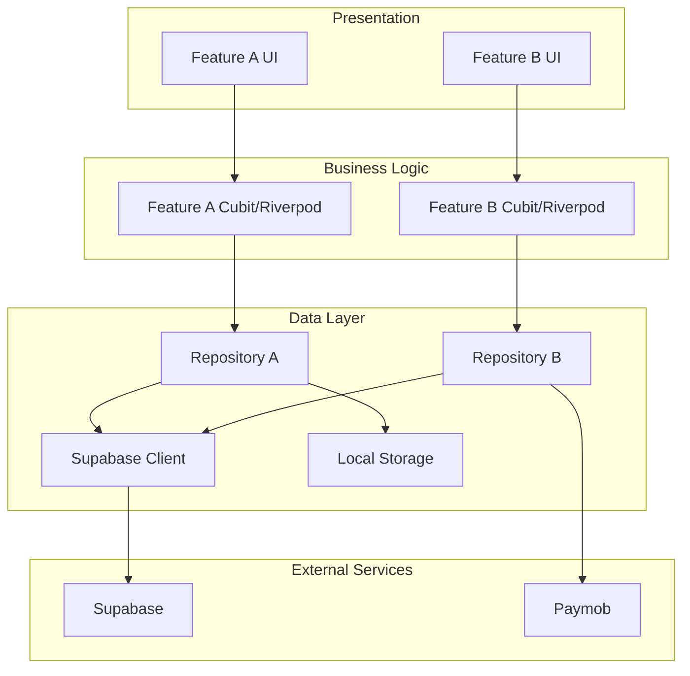
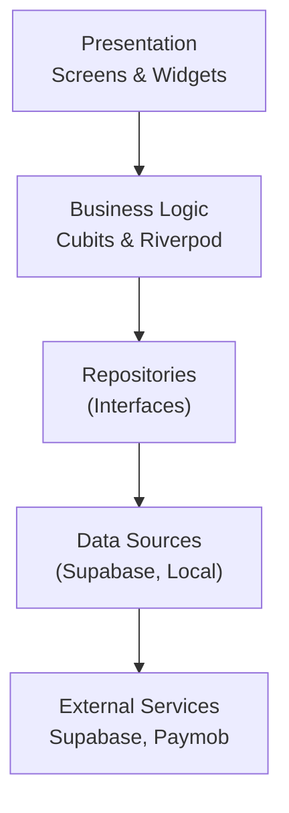
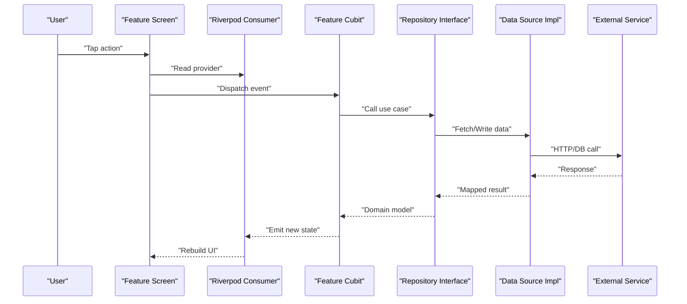
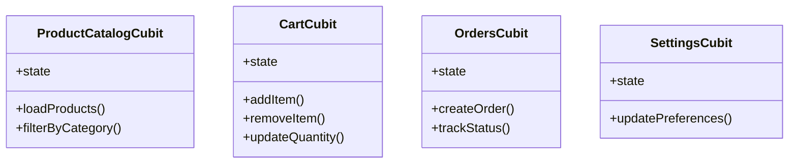
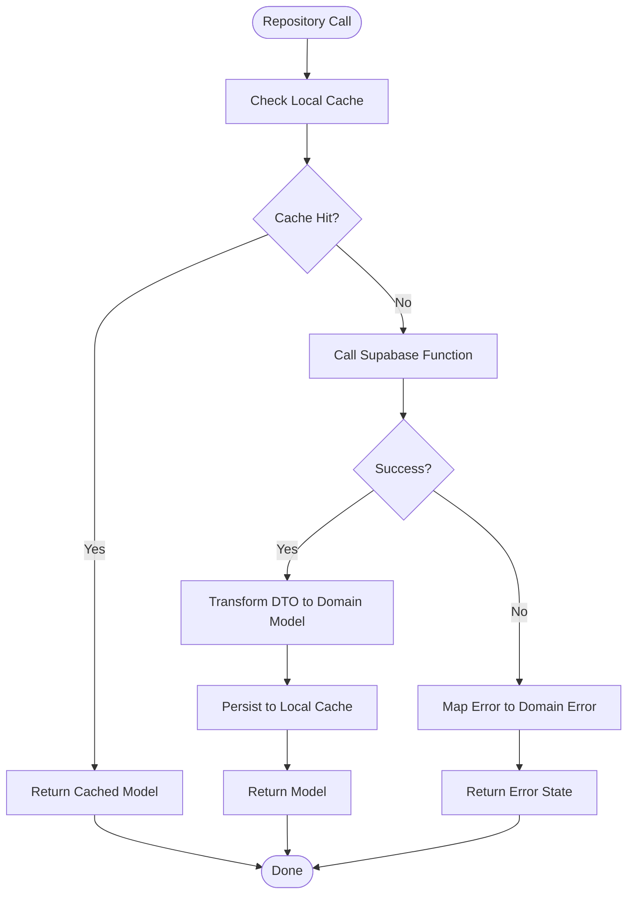
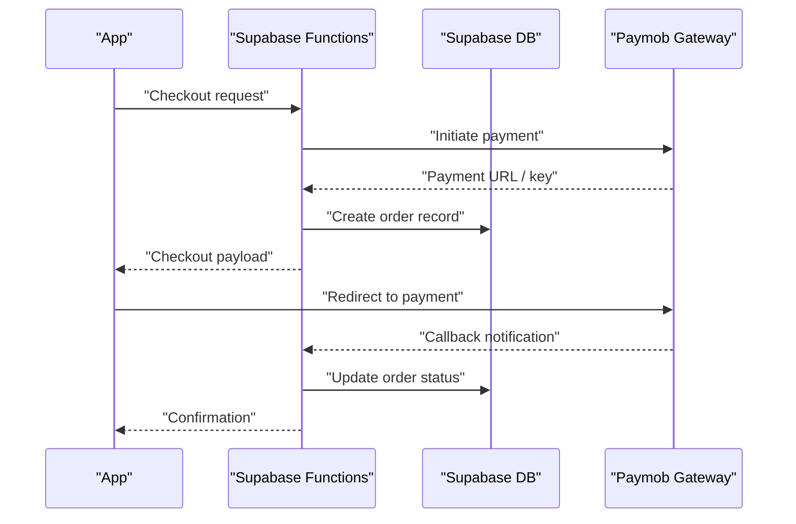
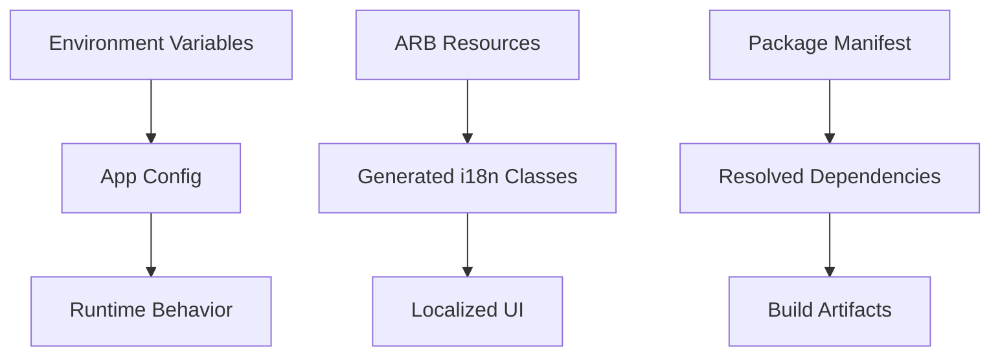
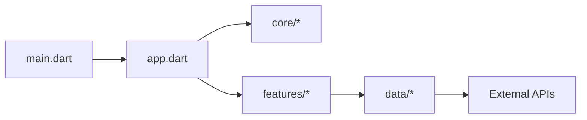

# Architecture Overview

<cite>
**Referenced Files in This Document**
- [main.dart](file://lib/main.dart)
- [app.dart](file://lib/app.dart)
- [supabase-integration.md](file://docs/supabase-integration.md)
- [storefront-walkthrough.md](file://docs/storefront-walkthrough.md)
- [money-walkthrough.md](file://docs/money-walkthrough.md)
- [foundation-walkthrough.md](file://docs/foundation-walkthrough.md)
- [pubspec.yaml](file://pubspec.yaml)
- [001_initial_schema.sql](file://supabase/migrations/001_initial_schema.sql)
- [006_payments_table.sql](file://supabase/migrations/006_payments_table.sql)
- [checkout/index.ts](file://supabase/functions/checkout/index.ts)
- [paymob-auth/index.ts](file://supabase/functions/paymob-auth/index.ts)
- [paymob-initiate/index.ts](file://supabase/functions/paymob-initiate/index.ts)
- [paymob-order/index.ts](file://supabase/functions/paymob-order/index.ts)
- [paymob-payment-key/index.ts](file://supabase/functions/paymob-payment-key/index.ts)
- [cancel-expired-orders/index.ts](file://supabase/functions/cancel-expired-orders/index.ts)
</cite>

## Table of Contents
1. [Introduction](#introduction)
2. [Project Structure](#project-structure)
3. [Core Components](#core-components)
4. [Architecture Overview](#architecture-overview)
5. [Detailed Component Analysis](#detailed-component-analysis)
6. [Dependency Analysis](#dependency-analysis)
7. [Performance Considerations](#performance-considerations)
8. [Troubleshooting Guide](#troubleshooting-guide)
9. [Conclusion](#conclusion)
10. [Appendices](#appendices)

## Introduction
This document presents the architectural overview of Albatal Store, a Flutter-based e-commerce application. It explains how Clean Architecture is applied with clear separation between presentation, business logic, and data layers; how features are organized by business domain rather than technical layer; and how state management and dependency injection are implemented using Riverpod and Cubit. It also details data flows from UI through business logic to data sources, integration patterns with Supabase and Paymob, system boundaries, trade-offs, constraints, and cross-cutting concerns such as error handling, logging, and configuration.

## Project Structure
The project follows a feature-driven organization layered on top of Clean Architecture:
- Presentation (UI): Feature-specific screens and widgets under features
- Business Logic: Stateful logic via Riverpod/Cubit per feature
- Data Layer: Repositories and data sources abstracting remote/local storage
- Core: Cross-cutting utilities, models, and shared infrastructure
- Shared: Reusable components and design tokens
- App bootstrap: Application entry point and root widget configuration

[No sources needed since this diagram shows conceptual workflow, not actual code structure]

**Section sources**
- [main.dart](file://lib/main.dart)
- [app.dart](file://lib/app.dart)
- [foundation-walkthrough.md](file://docs/foundation-walkthrough.md)

## Core Components
- Application Bootstrap
  - Entry point initializes environment, configures localization, theme, and dependency providers.
  - Root widget wires up global providers and navigators.
- Dependency Injection
  - Providers are registered at app startup for repositories, clients, and services.
  - Features consume dependencies via Riverpod’s provider API.
- State Management
  - Each feature exposes a Cubit or Riverpod state container that encapsulates business rules and side effects.
  - UI subscribes to state streams and reacts to changes.
- Data Abstraction
  - Repositories define interfaces used by business logic.
  - Implementations fetch from Supabase functions and local storage.
- External Integrations
  - Supabase Functions orchestrate payment flows and order lifecycle.
  - Paymob SDKs integrate via secure server-side endpoints.

**Section sources**
- [main.dart](file://lib/main.dart)
- [app.dart](file://lib/app.dart)
- [supabase-integration.md](file://docs/supabase-integration.md)
- [storefront-walkthrough.md](file://docs/storefront-walkthrough.md)

## Architecture Overview
Albatal Store implements Clean Architecture with a strict dependency rule: outer layers depend inward, never outward. The presentation layer depends only on business logic abstractions; business logic depends on repository interfaces; data layer implements those interfaces and communicates with external systems.

**Diagram sources**
- [main.dart](file://lib/main.dart)
- [app.dart](file://lib/app.dart)
- [supabase-integration.md](file://docs/supabase-integration.md)

## Detailed Component Analysis

### Presentation Layer
- Organized by feature folders containing pages, widgets, and navigation routes.
- Uses Riverpod consumers to subscribe to state and triggers actions via Cubit methods.
- Delegates all business decisions to lower layers; remains thin and testable.

**Diagram sources**
- [storefront-walkthrough.md](file://docs/storefront-walkthrough.md)
- [supabase-integration.md](file://docs/supabase-integration.md)

**Section sources**
- [storefront-walkthrough.md](file://docs/storefront-walkthrough.md)

### Business Logic Layer
- Encapsulated in Cubits and Riverpod providers per feature.
- Contains validation, orchestration, and transformation of domain models.
- Emits immutable states consumed by the UI.

**Diagram sources**
- [storefront-walkthrough.md](file://docs/storefront-walkthrough.md)
- [money-walkthrough.md](file://docs/money-walkthrough.md)

**Section sources**
- [storefront-walkthrough.md](file://docs/storefront-walkthrough.md)
- [money-walkthrough.md](file://docs/money-walkthrough.md)

### Data Layer
- Repository interfaces define contracts for product catalog, cart, orders, payments, and settings.
- Implementations handle network calls to Supabase Functions and local persistence.
- Mappers convert DTOs to domain models.

**Diagram sources**
- [supabase-integration.md](file://docs/supabase-integration.md)

**Section sources**
- [supabase-integration.md](file://docs/supabase-integration.md)

### External Integrations: Supabase and Paymob
- Supabase Functions centralize sensitive operations and enforce security policies.
- Payment flow uses multiple functions to authenticate, initiate checkout, create orders, and handle callbacks.
- Database schema defines core entities and relationships.

**Diagram sources**
- [checkout/index.ts](file://supabase/functions/checkout/index.ts)
- [paymob-auth/index.ts](file://supabase/functions/paymob-auth/index.ts)
- [paymob-initiate/index.ts](file://supabase/functions/paymob-initiate/index.ts)
- [paymob-order/index.ts](file://supabase/functions/paymob-order/index.ts)
- [paymob-payment-key/index.ts](file://supabase/functions/paymob-payment-key/index.ts)
- [006_payments_table.sql](file://supabase/migrations/006_payments_table.sql)
- [001_initial_schema.sql](file://supabase/migrations/001_initial_schema.sql)

**Section sources**
- [supabase-integration.md](file://docs/supabase-integration.md)
- [001_initial_schema.sql](file://supabase/migrations/001_initial_schema.sql)
- [006_payments_table.sql](file://supabase/migrations/006_payments_table.sql)
- [checkout/index.ts](file://supabase/functions/checkout/index.ts)
- [paymob-auth/index.ts](file://supabase/functions/paymob-auth/index.ts)
- [paymob-initiate/index.ts](file://supabase/functions/paymob-initiate/index.ts)
- [paymob-order/index.ts](file://supabase/functions/paymob-order/index.ts)
- [paymob-payment-key/index.ts](file://supabase/functions/paymob-payment-key/index.ts)

### Configuration and Environment
- Environment variables and secrets are managed via platform-specific files and build-time configurations.
- Localization resources are defined in ARB files and generated into Dart classes.
- Dependencies are declared in the package manifest.

**Diagram sources**
- [pubspec.yaml](file://pubspec.yaml)

**Section sources**
- [pubspec.yaml](file://pubspec.yaml)

## Dependency Analysis
The following diagram illustrates high-level module dependencies across the application.

**Diagram sources**
- [main.dart](file://lib/main.dart)
- [app.dart](file://lib/app.dart)

**Section sources**
- [main.dart](file://lib/main.dart)
- [app.dart](file://lib/app.dart)

## Performance Considerations
- Prefer lazy loading of heavy providers and screen-specific cubits.
- Use pagination and caching strategies in repositories to minimize network overhead.
- Debounce user inputs that trigger expensive queries.
- Keep UI rebuilds minimal by leveraging fine-grained Riverpod consumers.
- Optimize images and assets; leverage platform-native image decoders where possible.

[No sources needed since this section provides general guidance]

## Troubleshooting Guide
- Authentication and Authorization
  - Verify Supabase client initialization and session handling.
  - Ensure RLS policies align with expected access patterns.
- Payments
  - Validate function endpoints and callback signatures.
  - Inspect logs in Supabase Functions for Paymob interactions.
- Data Consistency
  - Confirm idempotency keys and order expiry handling.
  - Review stock increment functions and race conditions.
- Logging and Errors
  - Centralize error mapping in repositories and cubits.
  - Add structured logs around critical transitions (checkout, payment callbacks).

**Section sources**
- [supabase-integration.md](file://docs/supabase-integration.md)
- [cancel-expired-orders/index.ts](file://supabase/functions/cancel-expired-orders/index.ts)

## Conclusion
Albatal Store adopts Clean Architecture with a feature-driven layout, Riverpod/Cubit for state management, and robust integration with Supabase and Paymob. The architecture enforces clear separation of concerns, enabling maintainability, testability, and scalability. Trade-offs include initial setup complexity and the need for disciplined boundary enforcement, but these are outweighed by long-term benefits in clarity and evolution.

[No sources needed since this section summarizes without analyzing specific files]

## Appendices

### System Boundaries and Constraints
- Boundary: Mobile app vs. backend services (Supabase Functions and Paymob).
- Constraint: All sensitive operations must run server-side to protect secrets.
- Constraint: Idempotent order creation and payment callbacks to prevent duplicates.
- Constraint: Strict RLS policies to ensure data isolation.

[No sources needed since this section doesn't analyze specific source files]