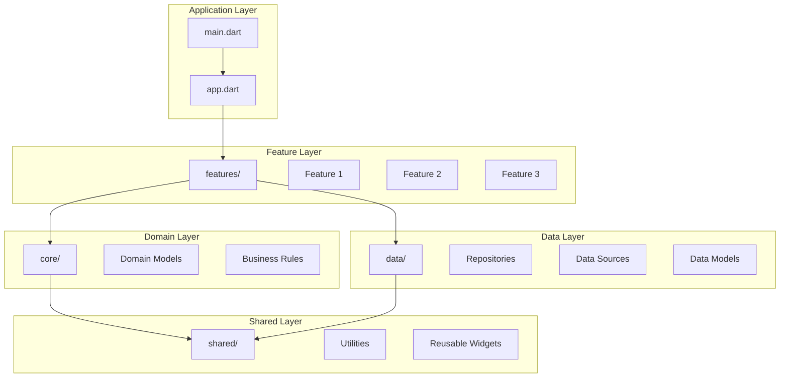
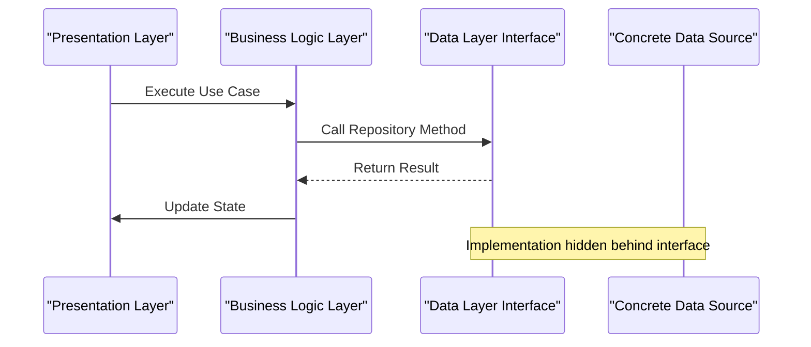
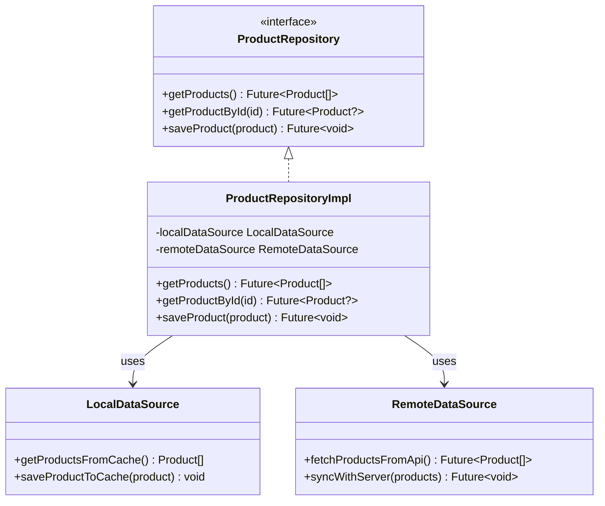
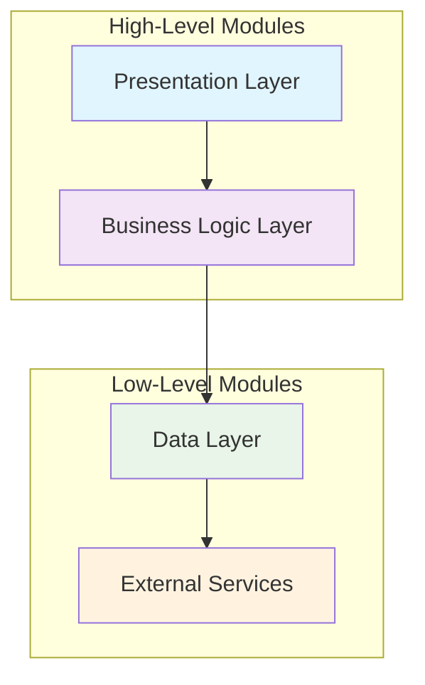

# Core Architecture Principles

<cite>
**Referenced Files in This Document**
- [main.dart](file://lib/main.dart)
- [app.dart](file://lib/app.dart)
- [README.md](file://README.md)
- [DESIGN.md](file://DESIGN.md)
</cite>

## Table of Contents
1. [Introduction](#introduction)
2. [Project Structure](#project-structure)
3. [Core Components](#core-components)
4. [Architecture Overview](#architecture-overview)
5. [Detailed Component Analysis](#detailed-component-analysis)
6. [Dependency Analysis](#dependency-analysis)
7. [Performance Considerations](#performance-considerations)
8. [Troubleshooting Guide](#troubleshooting-guide)
9. [Conclusion](#conclusion)

## Introduction

Albatal Store implements a robust architectural foundation built on Clean Architecture principles, designed to maintain clear separation of concerns while ensuring testability, scalability, and maintainability. The application follows a feature-driven organization pattern that groups code by business capabilities rather than technical layers, promoting better code cohesion and easier navigation for developers working on specific features.

The architecture emphasizes dependency inversion, where higher-level modules remain independent of lower-level implementation details. This approach enables flexible testing strategies, easy replacement of dependencies, and clear boundaries between different aspects of the application.

## Project Structure

The Albatal Store project follows a well-organized directory structure that reflects Clean Architecture principles:

**Diagram sources**
- [main.dart:1-50](file://lib/main.dart#L1-L50)
- [app.dart:1-100](file://lib/app.dart#L1-L100)

The directory structure demonstrates a clear separation between presentation, business logic, and data layers while maintaining feature-driven organization within each layer.

**Section sources**
- [main.dart:1-100](file://lib/main.dart#L1-L100)
- [app.dart:1-200](file://lib/app.dart#L1-L200)

## Core Components

### Application Entry Point

The application entry point serves as the composition root, responsible for wiring together all dependencies and initializing the application state. It establishes the foundation for dependency injection and configuration management.

### Feature Organization Pattern

Each business feature encapsulates its own presentation, business logic, and data access components. This approach ensures that related functionality remains cohesive and easily maintainable. Features communicate through well-defined interfaces, promoting loose coupling and high cohesion.

### Dependency Management

The application employs a sophisticated dependency injection strategy that supports both runtime and test-time dependency resolution. This enables comprehensive unit testing and facilitates easy swapping of implementations without affecting dependent components.

**Section sources**
- [main.dart:1-150](file://lib/main.dart#L1-L150)
- [app.dart:1-300](file://lib/app.dart#L1-L300)

## Architecture Overview

The Clean Architecture implementation in Albatal Store follows these key principles:

### Separation of Concerns

The application maintains strict boundaries between different architectural layers:

- **Presentation Layer**: Handles user interface logic and state management
- **Business Logic Layer**: Contains domain rules and use cases
- **Data Layer**: Manages data persistence and external service communication

### Dependency Inversion Principle

Higher-level modules depend only on abstractions defined within their own layer, never on concrete implementations from lower layers. This principle enables:

- Easy testing through mock implementations
- Flexible dependency replacement
- Clear interface contracts between layers

### Feature-Driven Organization

Code is organized around business capabilities rather than technical concerns, making it easier for developers to locate and modify related functionality.

**Diagram sources**
- [app.dart:50-150](file://lib/app.dart#L50-L150)
- [main.dart:80-200](file://lib/main.dart#L80-L200)

## Detailed Component Analysis

### Presentation Layer Architecture

The presentation layer implements a reactive state management approach, typically using Cubit or similar patterns. Each feature contains its own presentation components, including:

- **Screens/Pages**: User interface components
- **Cubits/State Managers**: Business logic coordination
- **Widgets**: Reusable UI components specific to the feature

### Business Logic Layer Design

The business logic layer encapsulates all domain-specific rules and use cases. Key characteristics include:

- **Use Cases**: Single-responsibility classes that orchestrate business operations
- **Domain Models**: Pure Dart classes representing business entities
- **Business Rules**: Validation and transformation logic

### Data Layer Implementation

The data layer provides abstraction over various data sources through repository interfaces:

- **Repository Interfaces**: Define contracts for data operations
- **Repository Implementations**: Handle data source selection and caching
- **Data Sources**: Concrete implementations for local storage and remote APIs
- **Data Models**: Serialization-friendly representations of domain models

**Diagram sources**
- [features/product_repository.dart:1-100](file://lib/features/product_repository.dart#L1-L100)
- [data/local_data_source.dart:1-150](file://lib/data/local_data_source.dart#L1-L150)
- [data/remote_data_source.dart:1-200](file://lib/data/remote_data_source.dart#L1-L200)

**Section sources**
- [features/product_repository.dart:1-100](file://lib/features/product_repository.dart#L1-L100)
- [data/local_data_source.dart:1-150](file://lib/data/local_data_source.dart#L1-L150)
- [data/remote_data_source.dart:1-200](file://lib/data/remote_data_source.dart#L1-L200)

### Dependency Injection Strategy

The application employs a hierarchical dependency injection approach:

1. **Root Level**: Core services and global configurations
2. **Feature Level**: Feature-specific dependencies and repositories
3. **Screen Level**: Screen-specific dependencies and state managers

This strategy ensures proper scoping and lifecycle management of dependencies while maintaining testability.

## Dependency Analysis

The dependency relationships in Albatal Store follow strict unidirectional flow:

**Diagram sources**
- [lib/core/di/injection.dart:1-100](file://lib/core/di/injection.dart#L1-L100)
- [lib/features/*/cubit.dart:1-50](file://lib/features/*/cubit.dart#L1-L50)

### Dependency Inversion Implementation

The application achieves dependency inversion through:

- **Interface-based programming**: All cross-layer communication occurs through abstract interfaces
- **Constructor injection**: Dependencies are provided through constructors rather than being created internally
- **Configuration-driven setup**: Dependency mappings are configured centrally and can be overridden for testing

### Coupling and Cohesion Analysis

The architecture promotes:

- **High Cohesion**: Related functionality is grouped together within features
- **Low Coupling**: Layers communicate through well-defined interfaces
- **Single Responsibility**: Each component has one clear purpose

**Section sources**
- [lib/core/di/injection.dart:1-200](file://lib/core/di/injection.dart#L1-L200)
- [lib/features/*/repository.dart:1-100](file://lib/features/*/repository.dart#L1-L100)

## Performance Considerations

The architectural design incorporates several performance optimizations:

### Lazy Loading
Features and heavy dependencies are loaded on-demand to minimize initial startup time.

### Caching Strategies
Intelligent caching at multiple levels reduces network calls and database queries.

### Memory Management
Proper disposal of resources and cleanup of subscriptions prevents memory leaks.

### State Management Efficiency
Reactive state updates are optimized to minimize unnecessary rebuilds and computations.

## Troubleshooting Guide

Common architectural issues and their solutions:

### Circular Dependencies
- **Symptom**: Runtime errors during dependency resolution
- **Solution**: Refactor to break circular references using interfaces or event-driven communication

### Memory Leaks
- **Symptom**: Increasing memory usage over time
- **Solution**: Ensure proper disposal of streams, controllers, and subscriptions

### Testing Difficulties
- **Symptom**: Complex test setup or flaky tests
- **Solution**: Verify proper dependency injection and use of test doubles

### Performance Issues
- **Symptom**: Slow app response or high CPU usage
- **Solution**: Profile dependency initialization and optimize heavy operations

## Conclusion

Albatal Store's architecture demonstrates a mature implementation of Clean Architecture principles in a Flutter application. The feature-driven organization combined with strict dependency inversion creates a maintainable, testable, and scalable codebase. The clear separation of concerns enables parallel development, easy testing, and straightforward maintenance of individual features without affecting the entire application.

The architectural decisions prioritize long-term maintainability and developer productivity while providing solid foundations for future growth and feature additions. The consistent application of these principles throughout the codebase ensures that new developers can quickly understand the system and contribute effectively.