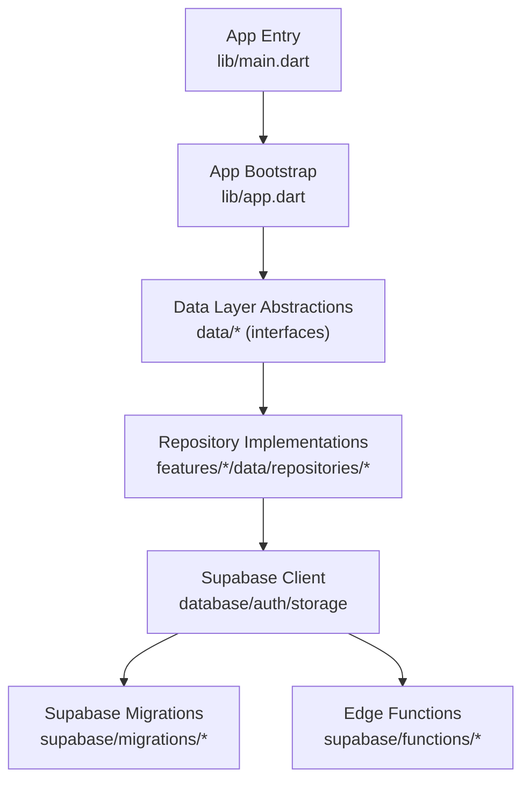
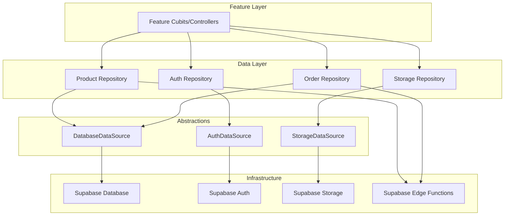
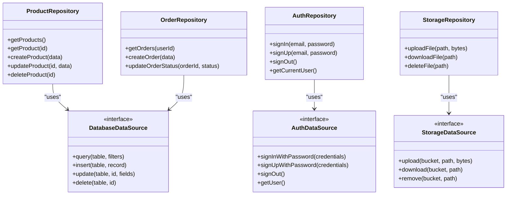
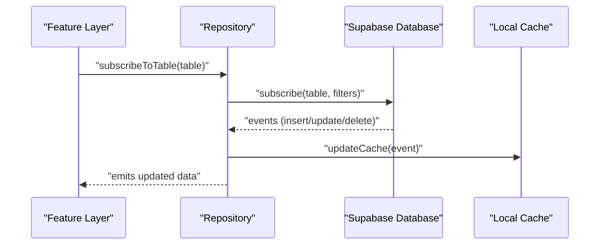
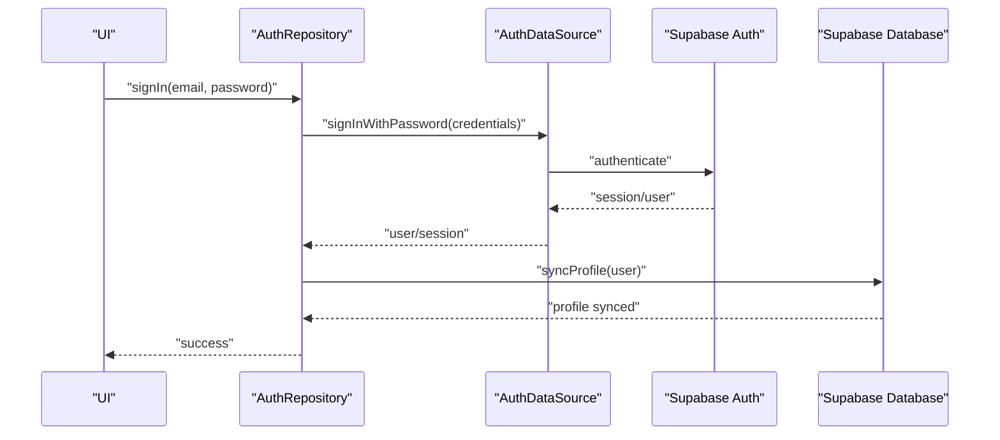
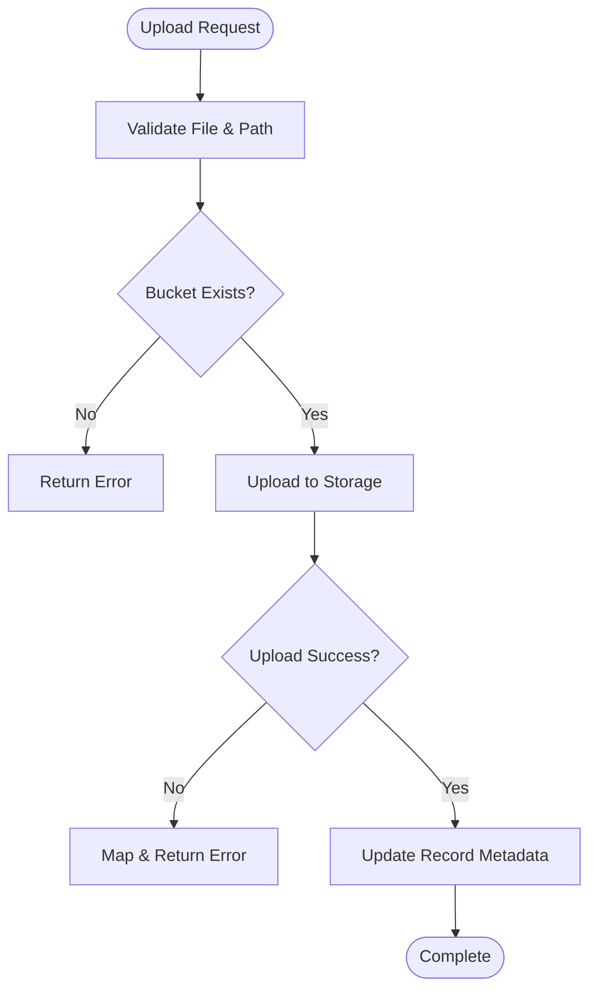
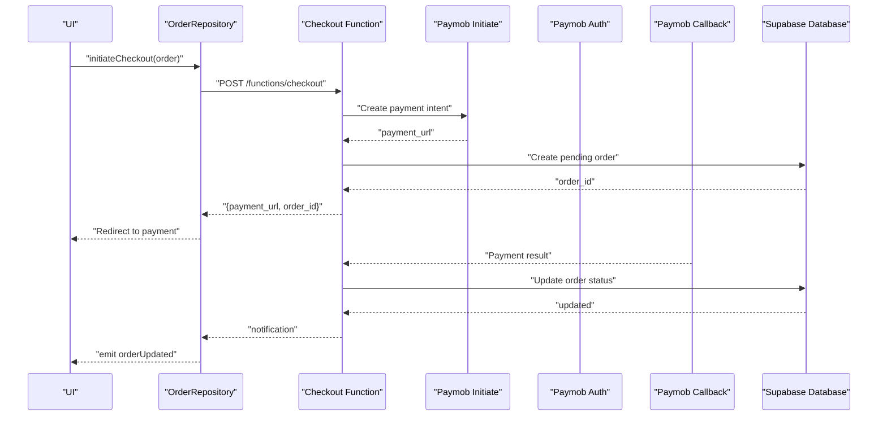
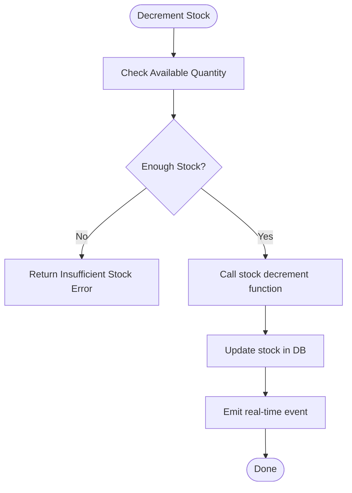
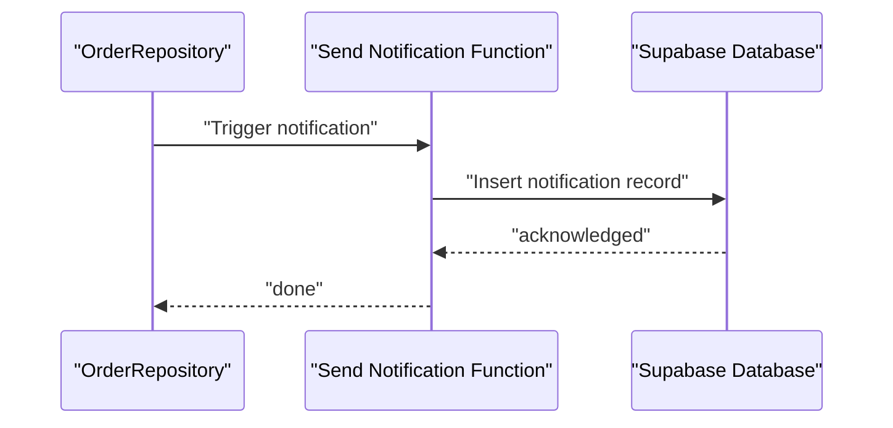
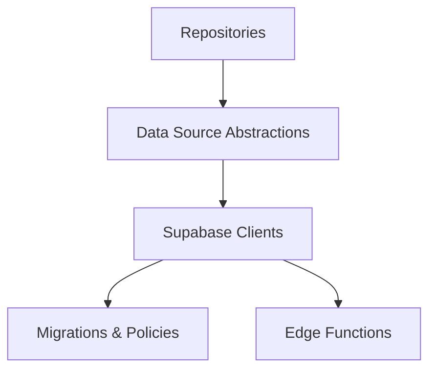

# Data Layer Architecture

<cite>
**Referenced Files in This Document**
- [main.dart](file://lib/main.dart)
- [app.dart](file://lib/app.dart)
- [supabase-integration.md](file://docs/supabase-integration.md)
- [001_initial_schema.sql](file://supabase/migrations/001_initial_schema.sql)
- [002_rls_policies.sql](file://supabase/migrations/002_rls_policies.sql)
- [003_auth_profiles_and_hardening.sql](file://supabase/migrations/003_auth_profiles_and_hardening.sql)
- [004_stock_function.sql](file://supabase/migrations/004_stock_function.sql)
- [005_storage_buckets.sql](file://supabase/migrations/005_storage_buckets.sql)
- [006_payments_table.sql](file://supabase/migrations/006_payments_table.sql)
- [007_stock_increment_function.sql](file://supabase/migrations/007_stock_increment_function.sql)
- [008_order_fulfillment.sql](file://supabase/migrations/008_order_fulfillment.sql)
- [009_shipping_zones.sql](file://supabase/migrations/009_shipping_zones.sql)
- [010_notifications_analytics.sql](file://supabase/migrations/010_notifications_analytics.sql)
- [011_orders_idempotency_and_expiry.sql](file://supabase/migrations/011_orders_idempotency_and_expiry.sql)
- [verify_rls.sql](file://supabase/migrations/verify_rls.sql)
- [cancel-expired-orders/index.ts](file://supabase/functions/cancel-expired-orders/index.ts)
- [checkout/index.ts](file://supabase/functions/checkout/index.ts)
- [paymob-auth/index.ts](file://supabase/functions/paymob-auth/index.ts)
- [paymob-callback/index.ts](file://supabase/functions/paymob-callback/index.ts)
- [paymob-initiate/index.ts](file://supabase/functions/paymob-initiate/index.ts)
- [paymob-order/index.ts](file://supabase/functions/paymob-order/index.ts)
- [paymob-payment-key/index.ts](file://supabase/functions/paymob-payment-key/index.ts)
- [send-order-notification/index.ts](file://supabase/functions/send-order-notification/index.ts)
</cite>

## Table of Contents
1. [Introduction](#introduction)
2. [Project Structure](#project-structure)
3. [Core Components](#core-components)
4. [Architecture Overview](#architecture-overview)
5. [Detailed Component Analysis](#detailed-component-analysis)
6. [Dependency Analysis](#dependency-analysis)
7. [Performance Considerations](#performance-considerations)
8. [Troubleshooting Guide](#troubleshooting-guide)
9. [Conclusion](#conclusion)
10. [Appendices](#appendices)

## Introduction
This document explains the data layer architecture that implements the Repository Pattern to abstract external services such as Supabase database, authentication, and storage. It covers caching strategies, persistence mechanisms, offline support patterns, real-time operations, authentication flows, file storage integration, repository implementations, data source abstractions, error handling, validation, transformation, and synchronization strategies. The goal is to provide a clear mental model for both technical and non-technical readers.

## Project Structure
The project follows a feature-oriented structure with shared core and data layers. The entry points initialize the application and wire up dependencies. Supabase configuration and migrations define the backend schema, policies, and server-side functions used by the app.

**Diagram sources**
- [main.dart](file://lib/main.dart)
- [app.dart](file://lib/app.dart)
- [supabase-integration.md](file://docs/supabase-integration.md)
- [001_initial_schema.sql](file://supabase/migrations/001_initial_schema.sql)
- [002_rls_policies.sql](file://supabase/migrations/002_rls_policies.sql)
- [003_auth_profiles_and_hardening.sql](file://supabase/migrations/003_auth_profiles_and_hardening.sql)
- [004_stock_function.sql](file://supabase/migrations/004_stock_function.sql)
- [005_storage_buckets.sql](file://supabase/migrations/005_storage_buckets.sql)
- [006_payments_table.sql](file://supabase/migrations/006_payments_table.sql)
- [007_stock_increment_function.sql](file://supabase/migrations/007_stock_increment_function.sql)
- [008_order_fulfillment.sql](file://supabase/migrations/008_order_fulfillment.sql)
- [009_shipping_zones.sql](file://supabase/migrations/009_shipping_zones.sql)
- [010_notifications_analytics.sql](file://supabase/migrations/010_notifications_analytics.sql)
- [011_orders_idempotency_and_expiry.sql](file://supabase/migrations/011_orders_idempotency_and_expiry.sql)
- [verify_rls.sql](file://supabase/migrations/verify_rls.sql)
- [cancel-expired-orders/index.ts](file://supabase/functions/cancel-expired-orders/index.ts)
- [checkout/index.ts](file://supabase/functions/checkout/index.ts)
- [paymob-auth/index.ts](file://supabase/functions/paymob-auth/index.ts)
- [paymob-callback/index.ts](file://supabase/functions/paymob-callback/index.ts)
- [paymob-initiate/index.ts](file://supabase/functions/paymob-initiate/index.ts)
- [paymob-order/index.ts](file://supabase/functions/paymob-order/index.ts)
- [paymob-payment-key/index.ts](file://supabase/functions/paymob-payment-key/index.ts)
- [send-order-notification/index.ts](file://supabase/functions/send-order-notification/index.ts)

**Section sources**
- [main.dart](file://lib/main.dart)
- [app.dart](file://lib/app.dart)
- [supabase-integration.md](file://docs/supabase-integration.md)

## Core Components
- Data Source Abstractions: Interfaces that define contracts for database, auth, and storage operations without exposing implementation details.
- Repository Implementations: Concrete classes that implement the abstractions, orchestrate calls to Supabase, handle caching, persistence, and error mapping.
- Real-Time Integration: Listens to database changes via Supabase subscriptions to keep UI state in sync.
- Authentication Flow: Manages sign-in/sign-up, session management, and profile synchronization.
- Storage Integration: Uploads, downloads, and manages files using Supabase storage buckets.
- Edge Functions: Server-side logic for payments, notifications, and background tasks invoked from the client.

Key responsibilities:
- Encapsulate all network and persistence logic behind clean interfaces.
- Provide consistent error types and retry/backoff strategies.
- Maintain local cache and offline-first behavior where appropriate.
- Transform domain models to and from Supabase records.

[No sources needed since this section provides general guidance]

## Architecture Overview
The data layer uses the Repository Pattern to decouple business features from infrastructure concerns. Repositories depend on data source abstractions, which are implemented using Supabase clients for database, auth, and storage. Real-time updates flow through subscriptions into repositories and then into feature state.

**Diagram sources**
- [supabase-integration.md](file://docs/supabase-integration.md)
- [001_initial_schema.sql](file://supabase/migrations/001_initial_schema.sql)
- [002_rls_policies.sql](file://supabase/migrations/002_rls_policies.sql)
- [003_auth_profiles_and_hardening.sql](file://supabase/migrations/003_auth_profiles_and_hardening.sql)
- [004_stock_function.sql](file://supabase/migrations/004_stock_function.sql)
- [005_storage_buckets.sql](file://supabase/migrations/005_storage_buckets.sql)
- [006_payments_table.sql](file://supabase/migrations/006_payments_table.sql)
- [007_stock_increment_function.sql](file://supabase/migrations/007_stock_increment_function.sql)
- [008_order_fulfillment.sql](file://supabase/migrations/008_order_fulfillment.sql)
- [009_shipping_zones.sql](file://supabase/migrations/009_shipping_zones.sql)
- [010_notifications_analytics.sql](file://supabase/migrations/010_notifications_analytics.sql)
- [011_orders_idempotency_and_expiry.sql](file://supabase/migrations/011_orders_idempotency_and_expiry.sql)
- [verify_rls.sql](file://supabase/migrations/verify_rls.sql)
- [cancel-expired-orders/index.ts](file://supabase/functions/cancel-expired-orders/index.ts)
- [checkout/index.ts](file://supabase/functions/checkout/index.ts)
- [paymob-auth/index.ts](file://supabase/functions/paymob-auth/index.ts)
- [paymob-callback/index.ts](file://supabase/functions/paymob-callback/index.ts)
- [paymob-initiate/index.ts](file://supabase/functions/paymob-initiate/index.ts)
- [paymob-order/index.ts](file://supabase/functions/paymob-order/index.ts)
- [paymob-payment-key/index.ts](file://supabase/functions/paymob-payment-key/index.ts)
- [send-order-notification/index.ts](file://supabase/functions/send-order-notification/index.ts)

## Detailed Component Analysis

### Repository Pattern and Data Source Abstractions
Repositories encapsulate all data access logic and expose simple methods to the feature layer. Data source abstractions define contracts for database, authentication, and storage operations. This separation allows swapping implementations and testing in isolation.

**Diagram sources**
- [supabase-integration.md](file://docs/supabase-integration.md)
- [001_initial_schema.sql](file://supabase/migrations/001_initial_schema.sql)
- [002_rls_policies.sql](file://supabase/migrations/002_rls_policies.sql)
- [003_auth_profiles_and_hardening.sql](file://supabase/migrations/003_auth_profiles_and_hardening.sql)
- [005_storage_buckets.sql](file://supabase/migrations/005_storage_buckets.sql)

**Section sources**
- [supabase-integration.md](file://docs/supabase-integration.md)

### Real-Time Database Operations
Real-time updates are achieved by subscribing to database changes. Repositories manage subscriptions, map events to domain models, and push updates to the feature layer.

**Diagram sources**
- [001_initial_schema.sql](file://supabase/migrations/001_initial_schema.sql)
- [002_rls_policies.sql](file://supabase/migrations/002_rls_policies.sql)

**Section sources**
- [001_initial_schema.sql](file://supabase/migrations/001_initial_schema.sql)
- [002_rls_policies.sql](file://supabase/migrations/002_rls_policies.sql)

### Authentication Flows
Authentication integrates with Supabase Auth. Repositories handle sign-in, sign-up, session retrieval, and sign-out, while ensuring user profiles are synchronized with the database.

**Diagram sources**
- [003_auth_profiles_and_hardening.sql](file://supabase/migrations/003_auth_profiles_and_hardening.sql)
- [002_rls_policies.sql](file://supabase/migrations/002_rls_policies.sql)

**Section sources**
- [003_auth_profiles_and_hardening.sql](file://supabase/migrations/003_auth_profiles_and_hardening.sql)
- [002_rls_policies.sql](file://supabase/migrations/002_rls_policies.sql)

### File Storage Integration
Storage operations are abstracted behind a repository and data source interface. Repositories coordinate uploads, downloads, and deletions against Supabase storage buckets.

**Diagram sources**
- [005_storage_buckets.sql](file://supabase/migrations/005_storage_buckets.sql)

**Section sources**
- [005_storage_buckets.sql](file://supabase/migrations/005_storage_buckets.sql)

### Payment and Order Workflows with Edge Functions
Payments and order processing leverage Supabase Edge Functions for secure server-side logic. The client invokes functions, which interact with payment providers and update database records accordingly.

**Diagram sources**
- [checkout/index.ts](file://supabase/functions/checkout/index.ts)
- [paymob-initiate/index.ts](file://supabase/functions/paymob-initiate/index.ts)
- [paymob-auth/index.ts](file://supabase/functions/paymob-auth/index.ts)
- [paymob-callback/index.ts](file://supabase/functions/paymob-callback/index.ts)
- [paymob-order/index.ts](file://supabase/functions/paymob-order/index.ts)
- [paymob-payment-key/index.ts](file://supabase/functions/paymob-payment-key/index.ts)
- [006_payments_table.sql](file://supabase/migrations/006_payments_table.sql)
- [008_order_fulfillment.sql](file://supabase/migrations/008_order_fulfillment.sql)

**Section sources**
- [checkout/index.ts](file://supabase/functions/checkout/index.ts)
- [paymob-initiate/index.ts](file://supabase/functions/paymob-initiate/index.ts)
- [paymob-auth/index.ts](file://supabase/functions/paymob-auth/index.ts)
- [paymob-callback/index.ts](file://supabase/functions/paymob-callback/index.ts)
- [paymob-order/index.ts](file://supabase/functions/paymob-order/index.ts)
- [paymob-payment-key/index.ts](file://supabase/functions/paymob-payment-key/index.ts)
- [006_payments_table.sql](file://supabase/migrations/006_payments_table.sql)
- [008_order_fulfillment.sql](file://supabase/migrations/008_order_fulfillment.sql)

### Inventory and Stock Management
Stock operations use database functions to ensure atomicity and consistency when updating inventory levels.

**Diagram sources**
- [004_stock_function.sql](file://supabase/migrations/004_stock_function.sql)
- [007_stock_increment_function.sql](file://supabase/migrations/007_stock_increment_function.sql)

**Section sources**
- [004_stock_function.sql](file://supabase/migrations/004_stock_function.sql)
- [007_stock_increment_function.sql](file://supabase/migrations/007_stock_increment_function.sql)

### Notifications and Analytics
Background tasks and analytics are handled via Edge Functions and database triggers.

**Diagram sources**
- [send-order-notification/index.ts](file://supabase/functions/send-order-notification/index.ts)
- [010_notifications_analytics.sql](file://supabase/migrations/010_notifications_analytics.sql)

**Section sources**
- [send-order-notification/index.ts](file://supabase/functions/send-order-notification/index.ts)
- [010_notifications_analytics.sql](file://supabase/migrations/010_notifications_analytics.sql)

### Offline Support and Caching Strategies
- Local Cache: Repositories maintain an in-memory or persistent cache keyed by entity IDs and query filters.
- Stale-While-Revalidate: Serve cached data immediately and refresh from the network asynchronously.
- Write-Behind: Queue mutations locally and synchronize when connectivity is available.
- Conflict Resolution: Use timestamps or version fields to resolve conflicts during sync.
- Subscription Backoff: Exponential backoff and reconnection handling for real-time subscriptions.

[No sources needed since this section provides general guidance]

### Data Validation and Transformation
- Input Validation: Enforce constraints at repository boundaries before sending requests.
- Model Mapping: Convert between domain models and Supabase records consistently.
- Error Mapping: Normalize errors into domain-specific exceptions with actionable messages.

[No sources needed since this section provides general guidance]

### Synchronization Strategies
- Delta Sync: Fetch only changed records using timestamps or cursors.
- Idempotency: Ensure repeated operations do not create duplicates (e.g., orders).
- Background Sync: Schedule periodic sync jobs for critical entities.

**Section sources**
- [011_orders_idempotency_and_expiry.sql](file://supabase/migrations/011_orders_idempotency_and_expiry.sql)

## Dependency Analysis
The data layer depends on Supabase clients for database, auth, and storage. Edge functions extend backend capabilities. Migrations define schema, policies, and functions that enforce security and business rules.

**Diagram sources**
- [supabase-integration.md](file://docs/supabase-integration.md)
- [001_initial_schema.sql](file://supabase/migrations/001_initial_schema.sql)
- [002_rls_policies.sql](file://supabase/migrations/002_rls_policies.sql)
- [003_auth_profiles_and_hardening.sql](file://supabase/migrations/003_auth_profiles_and_hardening.sql)
- [005_storage_buckets.sql](file://supabase/migrations/005_storage_buckets.sql)
- [006_payments_table.sql](file://supabase/migrations/006_payments_table.sql)
- [008_order_fulfillment.sql](file://supabase/migrations/008_order_fulfillment.sql)
- [010_notifications_analytics.sql](file://supabase/migrations/010_notifications_analytics.sql)
- [011_orders_idempotency_and_expiry.sql](file://supabase/migrations/011_orders_idempotency_and_expiry.sql)
- [verify_rls.sql](file://supabase/migrations/verify_rls.sql)
- [checkout/index.ts](file://supabase/functions/checkout/index.ts)
- [send-order-notification/index.ts](file://supabase/functions/send-order-notification/index.ts)

**Section sources**
- [supabase-integration.md](file://docs/supabase-integration.md)
- [001_initial_schema.sql](file://supabase/migrations/001_initial_schema.sql)
- [002_rls_policies.sql](file://supabase/migrations/002_rls_policies.sql)
- [003_auth_profiles_and_hardening.sql](file://supabase/migrations/003_auth_profiles_and_hardening.sql)
- [005_storage_buckets.sql](file://supabase/migrations/005_storage_buckets.sql)
- [006_payments_table.sql](file://supabase/migrations/006_payments_table.sql)
- [008_order_fulfillment.sql](file://supabase/migrations/008_order_fulfillment.sql)
- [010_notifications_analytics.sql](file://supabase/migrations/010_notifications_analytics.sql)
- [011_orders_idempotency_and_expiry.sql](file://supabase/migrations/011_orders_idempotency_and_expiry.sql)
- [verify_rls.sql](file://supabase/migrations/verify_rls.sql)
- [checkout/index.ts](file://supabase/functions/checkout/index.ts)
- [send-order-notification/index.ts](file://supabase/functions/send-order-notification/index.ts)

## Performance Considerations
- Minimize network calls by leveraging caches and real-time subscriptions.
- Use pagination and selective field fetching to reduce payload sizes.
- Batch writes where possible and apply write-behind queues.
- Apply exponential backoff and jitter for retries.
- Monitor subscription churn and unsubscribe when components dispose.

[No sources needed since this section provides general guidance]

## Troubleshooting Guide
- Authentication Issues: Verify session validity, token expiry, and profile sync.
- Storage Errors: Confirm bucket existence, permissions, and file paths.
- Real-Time Connectivity: Check subscription lifecycle and reconnection logic.
- Policy Violations: Review RLS policies and ensure correct user context.
- Payment Failures: Inspect edge function logs and callback handling.

**Section sources**
- [002_rls_policies.sql](file://supabase/migrations/002_rls_policies.sql)
- [003_auth_profiles_and_hardening.sql](file://supabase/migrations/003_auth_profiles_and_hardening.sql)
- [005_storage_buckets.sql](file://supabase/migrations/005_storage_buckets.sql)
- [checkout/index.ts](file://supabase/functions/checkout/index.ts)
- [paymob-callback/index.ts](file://supabase/functions/paymob-callback/index.ts)

## Conclusion
The data layer employs the Repository Pattern to cleanly separate concerns, abstracting Supabase database, authentication, and storage behind well-defined interfaces. Real-time updates, robust error handling, caching, and offline-first strategies improve responsiveness and resilience. Edge functions extend backend capabilities securely, while migrations enforce schema integrity and security policies.

[No sources needed since this section summarizes without analyzing specific files]

## Appendices

### Key Migration References
- Initial schema and core tables
- Row-level security policies
- Auth profiles and hardening
- Stock management functions
- Storage buckets configuration
- Payments table and fulfillment workflows
- Shipping zones
- Notifications and analytics
- Orders idempotency and expiry
- RLS verification utilities

**Section sources**
- [001_initial_schema.sql](file://supabase/migrations/001_initial_schema.sql)
- [002_rls_policies.sql](file://supabase/migrations/002_rls_policies.sql)
- [003_auth_profiles_and_hardening.sql](file://supabase/migrations/003_auth_profiles_and_hardening.sql)
- [004_stock_function.sql](file://supabase/migrations/004_stock_function.sql)
- [005_storage_buckets.sql](file://supabase/migrations/005_storage_buckets.sql)
- [006_payments_table.sql](file://supabase/migrations/006_payments_table.sql)
- [007_stock_increment_function.sql](file://supabase/migrations/007_stock_increment_function.sql)
- [008_order_fulfillment.sql](file://supabase/migrations/008_order_fulfillment.sql)
- [009_shipping_zones.sql](file://supabase/migrations/009_shipping_zones.sql)
- [010_notifications_analytics.sql](file://supabase/migrations/010_notifications_analytics.sql)
- [011_orders_idempotency_and_expiry.sql](file://supabase/migrations/011_orders_idempotency_and_expiry.sql)
- [verify_rls.sql](file://supabase/migrations/verify_rls.sql)