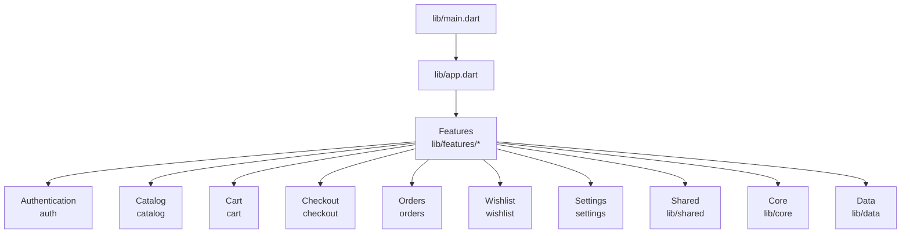
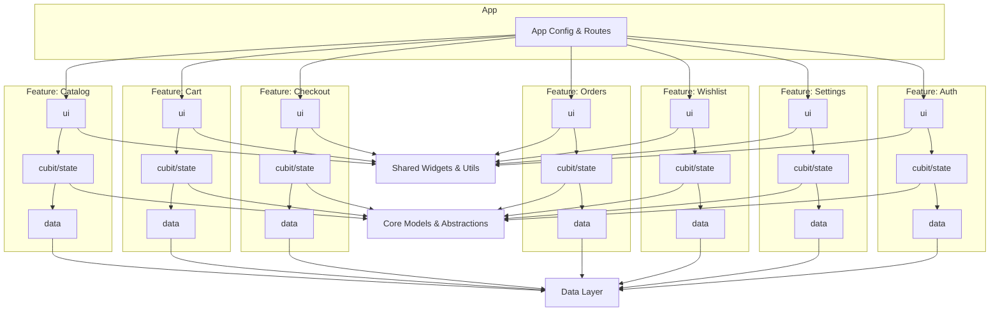
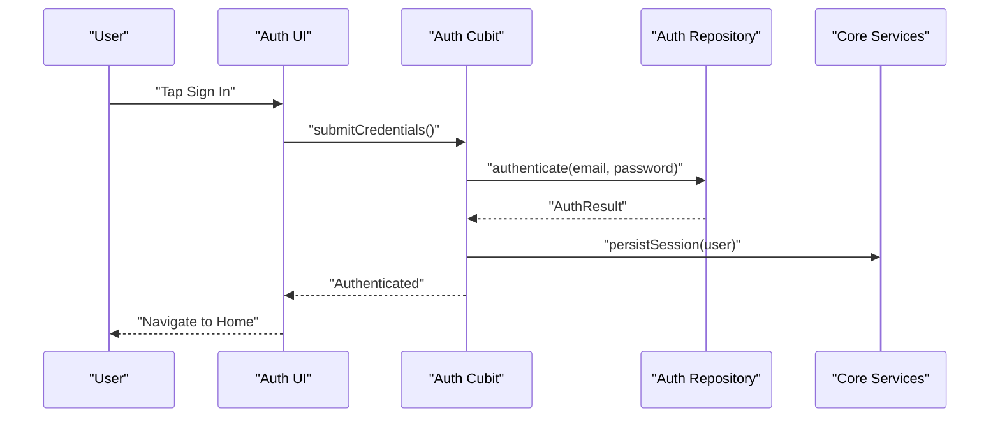
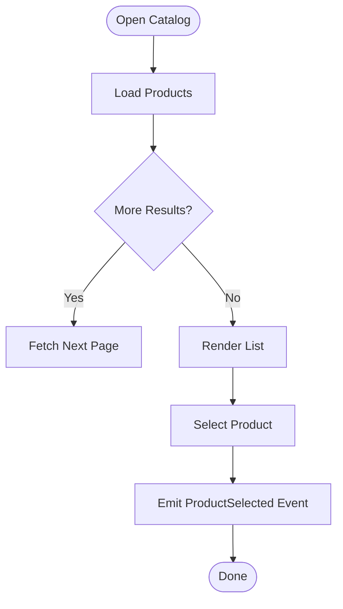
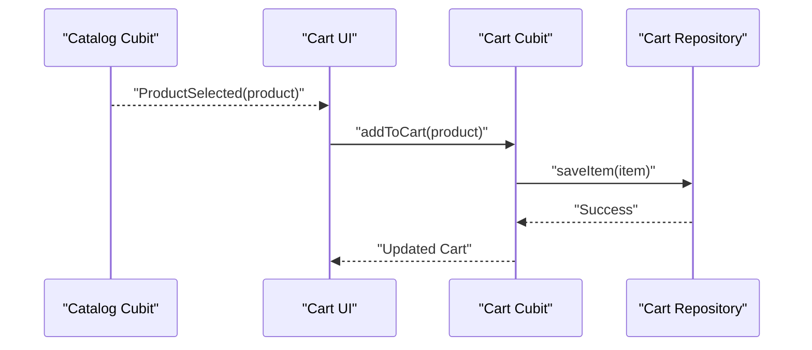
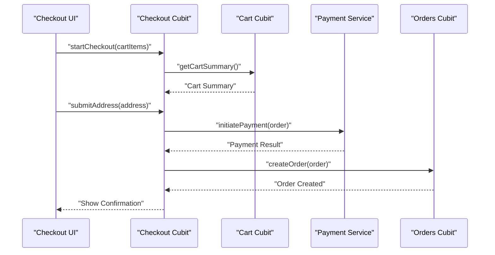
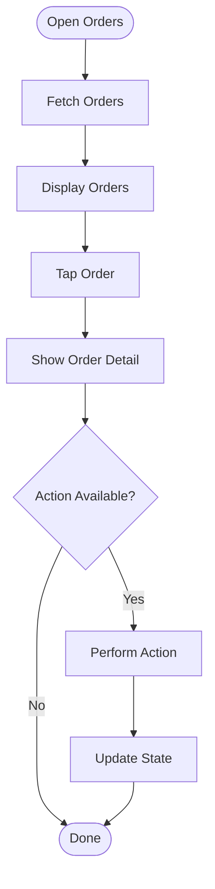
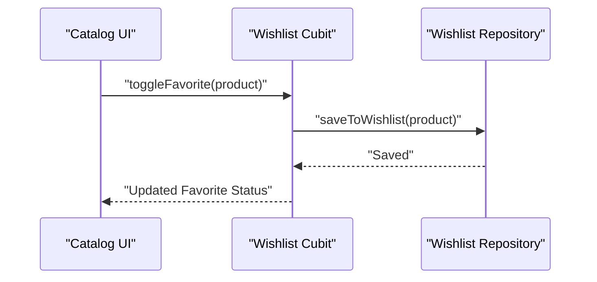
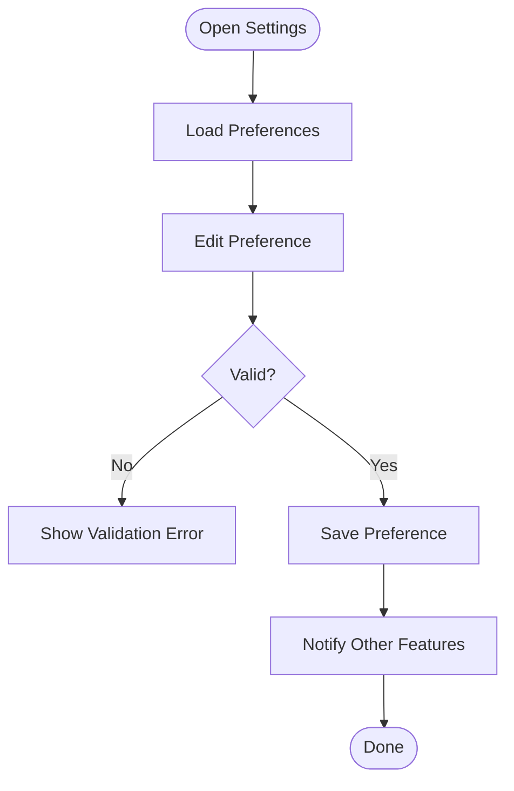
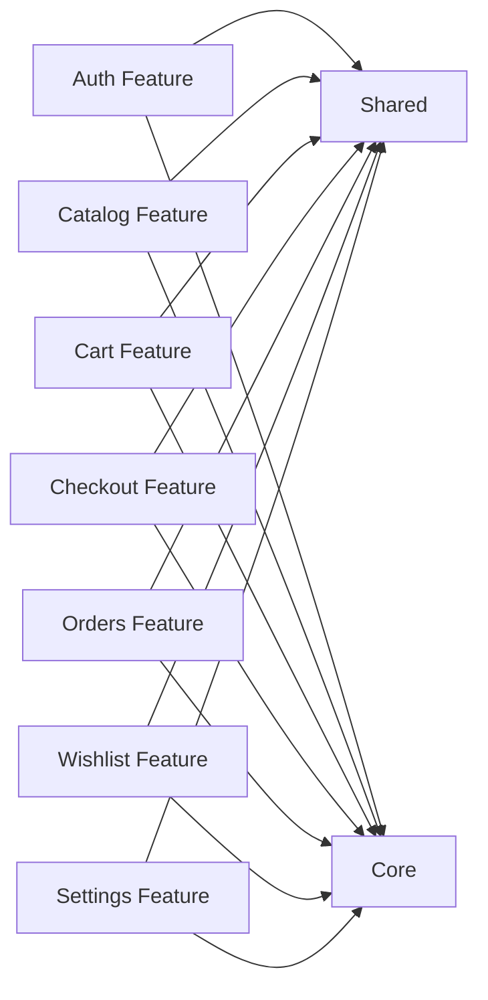

# Feature Organization Pattern

<cite>
**Referenced Files in This Document**
- [main.dart](file://lib/main.dart)
- [app.dart](file://lib/app.dart)
- [features/auth/](file://lib/features/auth/)
- [features/catalog/](file://lib/features/catalog/)
- [features/cart/](file://lib/features/cart/)
- [features/checkout/](file://lib/features/checkout/)
- [features/orders/](file://lib/features/orders/)
- [features/wishlist/](file://lib/features/wishlist/)
- [features/settings/](file://lib/features/settings/)
- [shared/](file://lib/shared/)
- [core/](file://lib/core/)
- [data/](file://lib/data/)
</cite>

## Table of Contents
1. [Introduction](#introduction)
2. [Project Structure](#project-structure)
3. [Core Components](#core-components)
4. [Architecture Overview](#architecture-overview)
5. [Detailed Component Analysis](#detailed-component-analysis)
6. [Dependency Analysis](#dependency-analysis)
7. [Performance Considerations](#performance-considerations)
8. [Troubleshooting Guide](#troubleshooting-guide)
9. [Conclusion](#conclusion)

## Introduction
This document explains the feature-driven organization pattern used in Albatal Store. Each business capability (authentication, catalog, cart, checkout, orders, wishlist, settings) is encapsulated as a self-contained module that owns its UI, business logic, and data access. Shared concerns are centralized in shared and core modules to avoid duplication while preserving clear boundaries between features. The goal is to make the codebase easy to navigate, test, and evolve by keeping related code together and minimizing cross-feature coupling.

## Project Structure
At a high level, the application is organized into:
- lib/main.dart: Application entry point and bootstrap
- lib/app.dart: App-level configuration, routing, and dependency wiring
- lib/features/<feature>: Self-contained feature modules with UI, state, and data layers
- lib/shared: Cross-cutting UI components, themes, constants, and utilities
- lib/core: Core abstractions, domain models, and foundational services
- lib/data: Data layer implementations and repositories

**Diagram sources**
- [main.dart](file://lib/main.dart)
- [app.dart](file://lib/app.dart)

**Section sources**
- [main.dart](file://lib/main.dart)
- [app.dart](file://lib/app.dart)

## Core Components
The following modules provide foundational capabilities reused across features:
- Core: Domain models, base classes, and platform-agnostic abstractions
- Shared: Reusable widgets, theming, localization helpers, and common utilities
- Data: Repositories and data source implementations that features consume via interfaces defined in core or feature-specific contracts

These modules are intentionally low-coupling and designed to be consumed by features without exposing internal implementation details.

**Section sources**
- [core/](file://lib/core/)
- [shared/](file://lib/shared/)
- [data/](file://lib/data/)

## Architecture Overview
Each feature follows a consistent internal structure:
- ui: Screens, routes, and presentation widgets
- cubit/state: Business logic and state management
- data: Local storage, remote calls, and repository implementations
- domain: Feature-specific entities and value objects (if applicable)

Features communicate through well-defined contracts (interfaces, events, or streams) and rely on shared/core for cross-cutting concerns. Routing and navigation are orchestrated at the app level.

**Diagram sources**
- [app.dart](file://lib/app.dart)
- [features/auth/](file://lib/features/auth/)
- [features/catalog/](file://lib/features/catalog/)
- [features/cart/](file://lib/features/cart/)
- [features/checkout/](file://lib/features/checkout/)
- [features/orders/](file://lib/features/orders/)
- [features/wishlist/](file://lib/features/wishlist/)
- [features/settings/](file://lib/features/settings/)
- [shared/](file://lib/shared/)
- [core/](file://lib/core/)
- [data/](file://lib/data/)

## Detailed Component Analysis

### Authentication Feature
Responsibilities:
- User sign-in/sign-out flows
- Session persistence and identity propagation
- Guarding protected routes and feature access

Internal structure:
- ui: Login screen, registration, profile view
- cubit/state: Authentication state, token handling, error states
- data: Auth provider integration, session storage

Inter-feature communication:
- Emits authenticated user changes consumed by other features
- Provides an auth status stream/event bus for guards and navigation

**Diagram sources**
- [features/auth/ui/](file://lib/features/auth/ui/)
- [features/auth/cubit/](file://lib/features/auth/cubit/)
- [features/auth/data/](file://lib/features/auth/data/)
- [core/](file://lib/core/)

**Section sources**
- [features/auth/](file://lib/features/auth/)

### Catalog Feature
Responsibilities:
- Product listing, search, filtering, and pagination
- Product detail views
- Category browsing

Internal structure:
- ui: Listing page, filters, product detail
- cubit/state: Catalog state, query parameters, loading/error states
- data: Remote catalog API, caching strategies

Inter-feature communication:
- Publishes product selection events consumed by cart and wishlist
- Exposes search/filter state for deep linking

**Diagram sources**
- [features/catalog/ui/](file://lib/features/catalog/ui/)
- [features/catalog/cubit/](file://lib/features/catalog/cubit/)
- [features/catalog/data/](file://lib/features/catalog/data/)

**Section sources**
- [features/catalog/](file://lib/features/catalog/)

### Cart Feature
Responsibilities:
- Add/remove items, update quantities
- Persist cart across sessions
- Compute totals and apply promotions

Internal structure:
- ui: Cart drawer/page, item controls
- cubit/state: Cart items, totals, validation
- data: Local storage, sync with server when needed

Inter-feature communication:
- Subscribes to product selection from catalog
- Emits cart changes consumed by checkout and orders

**Diagram sources**
- [features/cart/ui/](file://lib/features/cart/ui/)
- [features/cart/cubit/](file://lib/features/cart/cubit/)
- [features/cart/data/](file://lib/features/cart/data/)

**Section sources**
- [features/cart/](file://lib/features/cart/)

### Checkout Feature
Responsibilities:
- Address collection and validation
- Shipping options and cost calculation
- Payment initiation and result handling

Internal structure:
- ui: Checkout steps, forms, payment screens
- cubit/state: Checkout flow state, errors, confirmation
- data: Order creation, payment gateway integration

Inter-feature communication:
- Consumes cart contents and shipping addresses
- Emits order completion events consumed by orders feature

**Diagram sources**
- [features/checkout/ui/](file://lib/features/checkout/ui/)
- [features/checkout/cubit/](file://lib/features/checkout/cubit/)
- [features/checkout/data/](file://lib/features/checkout/data/)
- [features/cart/](file://lib/features/cart/)
- [features/orders/](file://lib/features/orders/)

**Section sources**
- [features/checkout/](file://lib/features/checkout/)

### Orders Feature
Responsibilities:
- Fetch and display user orders
- Track order status and history
- Handle order actions (cancel, retry payment)

Internal structure:
- ui: Order list, order detail
- cubit/state: Orders list, current order, loading/error
- data: Order repository, remote APIs

Inter-feature communication:
- Receives new order events from checkout
- Shares order status updates with notifications

**Diagram sources**
- [features/orders/ui/](file://lib/features/orders/ui/)
- [features/orders/cubit/](file://lib/features/orders/cubit/)
- [features/orders/data/](file://lib/features/orders/data/)

**Section sources**
- [features/orders/](file://lib/features/orders/)

### Wishlist Feature
Responsibilities:
- Save/remove favorite products
- Sync wishlist across devices if supported
- Provide quick access to saved items

Internal structure:
- ui: Wishlist list, toggle buttons
- cubit/state: Wishlist items, sync status
- data: Wishlist repository, local/remote storage

Inter-feature communication:
- Subscribes to product selection from catalog
- Emits wishlist changes consumed by UI and analytics

**Diagram sources**
- [features/wishlist/ui/](file://lib/features/wishlist/ui/)
- [features/wishlist/cubit/](file://lib/features/wishlist/cubit/)
- [features/wishlist/data/](file://lib/features/wishlist/data/)

**Section sources**
- [features/wishlist/](file://lib/features/wishlist/)

### Settings Feature
Responsibilities:
- Manage app preferences (language, theme, notifications)
- Account management and logout
- Privacy and legal links

Internal structure:
- ui: Settings screens, preference toggles
- cubit/state: Preferences state, validation
- data: Local preferences storage

Inter-feature communication:
- Emits preference changes consumed by UI and shared modules

**Diagram sources**
- [features/settings/ui/](file://lib/features/settings/ui/)
- [features/settings/cubit/](file://lib/features/settings/cubit/)
- [features/settings/data/](file://lib/features/settings/data/)

**Section sources**
- [features/settings/](file://lib/features/settings/)

### Shared Module
Purpose:
- Reusable UI components (buttons, inputs, cards)
- Theming, typography, color tokens
- Common utilities (validators, formatters, date/time helpers)
- Localization helpers and asset paths

Usage:
- All features import shared components to ensure consistency
- Avoid duplicating UI patterns across features

**Section sources**
- [shared/](file://lib/shared/)

### Core Module
Purpose:
- Domain models and value types
- Base classes and abstractions (e.g., network client, storage interface)
- Global services (logger, analytics, config)

Usage:
- Features depend on core abstractions rather than concrete implementations
- Promotes testability and decoupling

**Section sources**
- [core/](file://lib/core/)

## Dependency Analysis
Guidelines:
- Features depend on shared and core only; they do not depend on each other directly
- Inter-feature communication uses events, streams, or global state providers
- Data layer dependencies are abstracted behind repositories/interfaces

**Diagram sources**
- [features/auth/](file://lib/features/auth/)
- [features/catalog/](file://lib/features/catalog/)
- [features/cart/](file://lib/features/cart/)
- [features/checkout/](file://lib/features/checkout/)
- [features/orders/](file://lib/features/orders/)
- [features/wishlist/](file://lib/features/wishlist/)
- [features/settings/](file://lib/features/settings/)
- [shared/](file://lib/shared/)
- [core/](file://lib/core/)

**Section sources**
- [features/auth/](file://lib/features/auth/)
- [features/catalog/](file://lib/features/catalog/)
- [features/cart/](file://lib/features/cart/)
- [features/checkout/](file://lib/features/checkout/)
- [features/orders/](file://lib/features/orders/)
- [features/wishlist/](file://lib/features/wishlist/)
- [features/settings/](file://lib/features/settings/)
- [shared/](file://lib/shared/)
- [core/](file://lib/core/)

## Performance Considerations
- Lazy load feature routes and assets to reduce initial bundle size
- Use pagination and debounced search in catalog to minimize network requests
- Cache frequently accessed data locally and invalidate on relevant events
- Prefer immutable state updates to avoid unnecessary rebuilds
- Defer heavy computations off the main thread where possible

[No sources needed since this section provides general guidance]

## Troubleshooting Guide
Common issues and resolutions:
- Navigation loops: Ensure route guards check authentication state before allowing access
- State inconsistencies: Verify event emission points and subscription lifecycles
- Data sync conflicts: Implement idempotency keys for order creation and payment callbacks
- Memory leaks: Dispose streams and cancel subscriptions in feature teardown

**Section sources**
- [features/auth/](file://lib/features/auth/)
- [features/checkout/](file://lib/features/checkout/)
- [features/orders/](file://lib/features/orders/)

## Conclusion
Albatal Store’s feature-driven organization pattern promotes clarity, maintainability, and scalability. By encapsulating UI, business logic, and data within each feature and centralizing shared concerns in shared and core modules, the codebase remains modular and testable. Clear inter-feature communication and dependency management further reduce coupling and enable independent evolution of features.