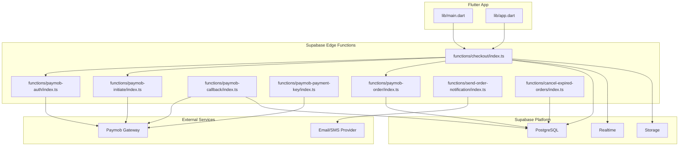
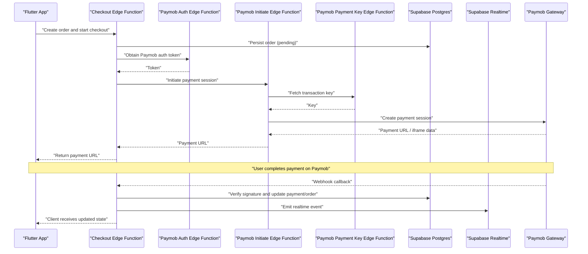
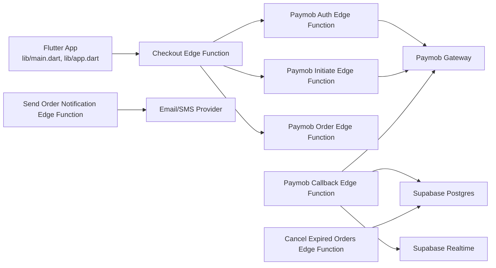

# Integration Patterns

<cite>
**Referenced Files in This Document**
- [supabase-integration.md](file://docs/supabase-integration.md)
- [index.ts (paymob-auth)](file://supabase/functions/paymob-auth/index.ts)
- [index.ts (paymob-initiate)](file://supabase/functions/paymob-initiate/index.ts)
- [index.ts (paymob-callback)](file://supabase/functions/paymob-callback/index.ts)
- [index.ts (paymob-payment-key)](file://supabase/functions/paymob-payment-key/index.ts)
- [index.ts (paymob-order)](file://supabase/functions/paymob-order/index.ts)
- [index.ts (checkout)](file://supabase/functions/checkout/index.ts)
- [index.ts (send-order-notification)](file://supabase/functions/send-order-notification/index.ts)
- [index.ts (cancel-expired-orders)](file://supabase/functions/cancel-expired-orders/index.ts)
- [006_payments_table.sql](file://supabase/migrations/006_payments_table.sql)
- [011_orders_idempotency_and_expiry.sql](file://supabase/migrations/011_orders_idempotency_and_expiry.sql)
- [app.dart](file://lib/app.dart)
- [main.dart](file://lib/main.dart)
</cite>

## Table of Contents
1. [Introduction](#introduction)
2. [Project Structure](#project-structure)
3. [Core Components](#core-components)
4. [Architecture Overview](#architecture-overview)
5. [Detailed Component Analysis](#detailed-component-analysis)
6. [Dependency Analysis](#dependency-analysis)
7. [Performance Considerations](#performance-considerations)
8. [Troubleshooting Guide](#troubleshooting-guide)
9. [Conclusion](#conclusion)
10. [Appendices](#appendices)

## Introduction
This document explains the integration patterns used by Albatal Store to connect with external services, focusing on:
- Edge functions architecture for serverless backend logic (payment processing, order management, notifications)
- Paymob payment gateway integration with secure callback handling and webhook processing
- Supabase integration patterns for real-time database operations, authentication flows, and file storage
- Security considerations, error handling strategies, and retry mechanisms for external service calls
- Examples of API client implementations and service abstractions

The goal is to provide a clear, code-mapped understanding of how the Flutter app interacts with Supabase Edge Functions and third-party services such as Paymob, while ensuring reliability and security.

## Project Structure
At a high level, the project follows a feature-oriented structure with shared core and data layers. The serverless backend is implemented using Supabase Edge Functions under supabase/functions. Database schema and policies are defined in migrations under supabase/migrations. Documentation for Supabase integration is provided in docs/supabase-integration.md.

**Diagram sources**
- [main.dart](file://lib/main.dart)
- [app.dart](file://lib/app.dart)
- [index.ts (checkout)](file://supabase/functions/checkout/index.ts)
- [index.ts (paymob-auth)](file://supabase/functions/paymob-auth/index.ts)
- [index.ts (paymob-initiate)](file://supabase/functions/paymob-initiate/index.ts)
- [index.ts (paymob-callback)](file://supabase/functions/paymob-callback/index.ts)
- [index.ts (paymob-payment-key)](file://supabase/functions/paymob-payment-key/index.ts)
- [index.ts (paymob-order)](file://supabase/functions/paymob-order/index.ts)
- [index.ts (send-order-notification)](file://supabase/functions/send-order-notification/index.ts)
- [index.ts (cancel-expired-orders)](file://supabase/functions/cancel-expired-orders/index.ts)

**Section sources**
- [supabase-integration.md](file://docs/supabase-integration.md)

## Core Components
- Checkout orchestration edge function: coordinates order creation, payment initiation, and post-payment updates.
- Paymob integration edge functions: handle authentication, payment key retrieval, payment initiation, and callback verification.
- Order lifecycle helpers: idempotency, expiration, and cancellation.
- Notification service: sends order-related notifications after successful payments or order state changes.
- Data layer: uses Supabase Postgres tables for orders and payments, Realtime for live updates, and Storage for files.

Key responsibilities:
- Securely manage secrets at runtime via environment variables.
- Validate and sign webhooks from Paymob.
- Enforce idempotency for payment callbacks.
- Emit events for notifications and analytics.

**Section sources**
- [index.ts (checkout)](file://supabase/functions/checkout/index.ts)
- [index.ts (paymob-auth)](file://supabase/functions/paymob-auth/index.ts)
- [index.ts (paymob-initiate)](file://supabase/functions/paymob-initiate/index.ts)
- [index.ts (paymob-callback)](file://supabase/functions/paymob-callback/index.ts)
- [index.ts (paymob-payment-key)](file://supabase/functions/paymob-payment-key/index.ts)
- [index.ts (paymob-order)](file://supabase/functions/paymob-order/index.ts)
- [index.ts (send-order-notification)](file://supabase/functions/send-order-notification/index.ts)
- [index.ts (cancel-expired-orders)](file://supabase/functions/cancel-expired-orders/index.ts)
- [006_payments_table.sql](file://supabase/migrations/006_payments_table.sql)
- [011_orders_idempotency_and_expiry.sql](file://supabase/migrations/011_orders_idempotency_and_expiry.sql)

## Architecture Overview
The system uses a thin Flutter client that delegates sensitive operations to Supabase Edge Functions. These functions interact with Paymob and Supabase services (Database, Realtime, Storage). Webhooks from Paymob are handled securely and deterministically.

**Diagram sources**
- [index.ts (checkout)](file://supabase/functions/checkout/index.ts)
- [index.ts (paymob-auth)](file://supabase/functions/paymob-auth/index.ts)
- [index.ts (paymob-initiate)](file://supabase/functions/paymob-initiate/index.ts)
- [index.ts (paymob-payment-key)](file://supabase/functions/paymob-payment-key/index.ts)
- [index.ts (paymob-callback)](file://supabase/functions/paymob-callback/index.ts)

## Detailed Component Analysis

### Checkout Orchestration
Responsibilities:
- Create an order record with initial status.
- Obtain Paymob credentials and initiate a payment session.
- Return a payment URL to the client.
- Optionally trigger notifications or analytics.

Error handling:
- Validate request inputs.
- Propagate upstream errors with structured responses.
- Ensure partial failures do not leave inconsistent state.

Idempotency:
- Use idempotency keys where applicable to prevent duplicate charges.

**Section sources**
- [index.ts (checkout)](file://supabase/functions/checkout/index.ts)
- [011_orders_idempotency_and_expiry.sql](file://supabase/migrations/011_orders_idempotency_and_expiry.sql)

### Paymob Authentication Edge Function
Responsibilities:
- Authenticate with Paymob using stored credentials.
- Cache or refresh tokens as needed.
- Expose a minimal endpoint for other functions to obtain a valid token.

Security:
- Read secrets from environment variables.
- Avoid logging sensitive values.

**Section sources**
- [index.ts (paymob-auth)](file://supabase/functions/paymob-auth/index.ts)

### Paymob Payment Key Edge Function
Responsibilities:
- Retrieve a transaction-specific key required by Paymob’s client SDK.
- Bind the key to a specific order context.

Security:
- Validate caller identity and order ownership.
- Limit key scope and lifetime.

**Section sources**
- [index.ts (paymob-payment-key)](file://supabase/functions/paymob-payment-key/index.ts)

### Paymob Initiation Edge Function
Responsibilities:
- Initialize a payment session with Paymob using the authenticated token and transaction key.
- Return a payment URL or iframe configuration to the client.

Reliability:
- Implement retries with backoff for transient network errors.
- Fail fast on invalid parameters.

**Section sources**
- [index.ts (paymob-initiate)](file://supabase/functions/paymob-initiate/index.ts)

### Paymob Callback Webhook Handler
Responsibilities:
- Receive asynchronous payment results from Paymob.
- Verify webhook signatures to ensure authenticity.
- Update payment and order records atomically.
- Emit Realtime events for live UI updates.
- Enforce idempotency to avoid double-processing.

Error handling:
- Acknowledge receipt promptly.
- Queue or retry failed updates if necessary.

**Section sources**
- [index.ts (paymob-callback)](file://supabase/functions/paymob-callback/index.ts)
- [006_payments_table.sql](file://supabase/migrations/006_payments_table.sql)
- [011_orders_idempotency_and_expiry.sql](file://supabase/migrations/011_orders_idempotency_and_expiry.sql)

### Send Order Notification Edge Function
Responsibilities:
- Trigger notifications (email/SMS) upon order confirmation or payment success.
- Compose message content based on order details.

Reliability:
- Retry failed deliveries with exponential backoff.
- Record delivery attempts for observability.

**Section sources**
- [index.ts (send-order-notification)](file://supabase/functions/send-order-notification/index.ts)

### Cancel Expired Orders Edge Function
Responsibilities:
- Periodically scan for expired orders and transition them to a canceled state.
- Release reserved stock if applicable.

Scheduling:
- Invoked by Supabase scheduled jobs or cron-like triggers.

**Section sources**
- [index.ts (cancel-expired-orders)](file://supabase/functions/cancel-expired-orders/index.ts)
- [011_orders_idempotency_and_expiry.sql](file://supabase/migrations/011_orders_idempotency_and_expiry.sql)

### Data Model and Policies
- Payments table defines fields for tracking transactions and linking to orders.
- Orders include idempotency and expiry semantics to support reliable workflows.

**Section sources**
- [006_payments_table.sql](file://supabase/migrations/006_payments_table.sql)
- [011_orders_idempotency_and_expiry.sql](file://supabase/migrations/011_orders_idempotency_and_expiry.sql)

## Dependency Analysis
The following diagram shows how the Flutter app depends on Edge Functions, which in turn depend on external services and Supabase platform capabilities.

**Diagram sources**
- [main.dart](file://lib/main.dart)
- [app.dart](file://lib/app.dart)
- [index.ts (checkout)](file://supabase/functions/checkout/index.ts)
- [index.ts (paymob-auth)](file://supabase/functions/paymob-auth/index.ts)
- [index.ts (paymob-initiate)](file://supabase/functions/paymob-initiate/index.ts)
- [index.ts (paymob-callback)](file://supabase/functions/paymob-callback/index.ts)
- [index.ts (paymob-order)](file://supabase/functions/paymob-order/index.ts)
- [index.ts (send-order-notification)](file://supabase/functions/send-order-notification/index.ts)
- [index.ts (cancel-expired-orders)](file://supabase/functions/cancel-expired-orders/index.ts)

**Section sources**
- [supabase-integration.md](file://docs/supabase-integration.md)

## Performance Considerations
- Prefer short-lived requests in Edge Functions; offload heavy work to background tasks or queues when possible.
- Use Supabase Realtime to push updates instead of polling.
- Cache non-sensitive tokens and keys within function execution boundaries to reduce overhead.
- Apply idempotency keys to avoid redundant processing during retries.
- Minimize payload sizes and only return necessary fields to clients.

[No sources needed since this section provides general guidance]

## Troubleshooting Guide
Common issues and resolutions:
- Invalid webhook signature: verify secret configuration and ensure the correct algorithm is used.
- Duplicate payments: confirm idempotency keys are present and enforced in the callback handler.
- Expired orders not canceled: check scheduled job configuration and time zone settings.
- Realtime events not received: validate RLS policies and channel subscriptions on the client.
- Storage upload failures: review bucket permissions and object size limits.

Operational checks:
- Inspect Edge Function logs for upstream errors and timeouts.
- Confirm environment variables for Paymob credentials are set per environment.
- Validate database constraints and RLS policies related to payments and orders.

**Section sources**
- [index.ts (paymob-callback)](file://supabase/functions/paymob-callback/index.ts)
- [index.ts (cancel-expired-orders)](file://supabase/functions/cancel-expired-orders/index.ts)
- [006_payments_table.sql](file://supabase/migrations/006_payments_table.sql)
- [011_orders_idempotency_and_expiry.sql](file://supabase/migrations/011_orders_idempotency_and_expiry.sql)

## Conclusion
Albatal Store integrates with Paymob and Supabase through a well-scoped set of Edge Functions that encapsulate sensitive logic, enforce security, and provide resilient workflows. The design emphasizes idempotency, secure webhook handling, and real-time updates, enabling a responsive and reliable user experience.

[No sources needed since this section summarizes without analyzing specific files]

## Appendices

### Security Considerations
- Keep all secrets in environment variables; never hardcode credentials.
- Validate and sign all incoming webhooks before processing.
- Enforce least privilege with RLS policies for database access.
- Scope and rotate Paymob tokens and keys regularly.
- Sanitize and validate all inputs at function entry points.

[No sources needed since this section provides general guidance]

### Error Handling Strategies
- Use structured error responses with actionable messages.
- Implement retries with exponential backoff for transient failures.
- Capture detailed context for observability without exposing secrets.
- Provide fallbacks for non-critical operations (e.g., notifications).

[No sources needed since this section provides general guidance]

### Retry Mechanisms
- Apply bounded retries for network calls to Paymob and notification providers.
- Use idempotency keys to safely retry state-changing operations.
- Log retry attempts and outcomes for debugging.

[No sources needed since this section provides general guidance]

### API Client Implementations and Service Abstractions
- Flutter client should call Edge Functions via a single abstraction layer to centralize error handling, retries, and caching.
- For Realtime, subscribe to channels scoped by order or user to minimize noise.
- For Storage, use signed URLs for uploads/downloads when appropriate.

[No sources needed since this section provides general guidance]