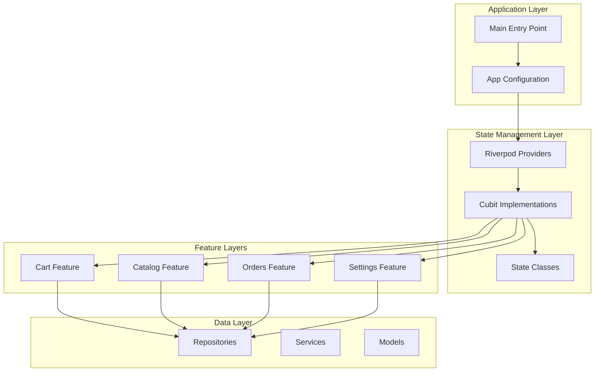
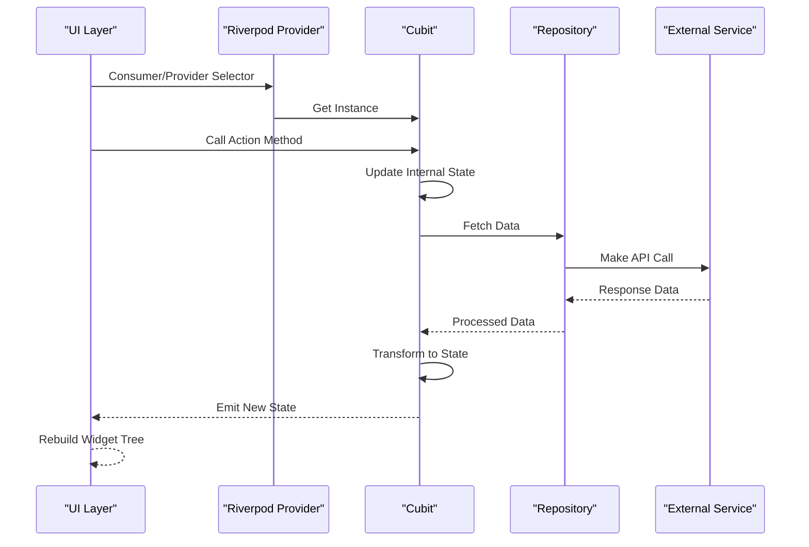
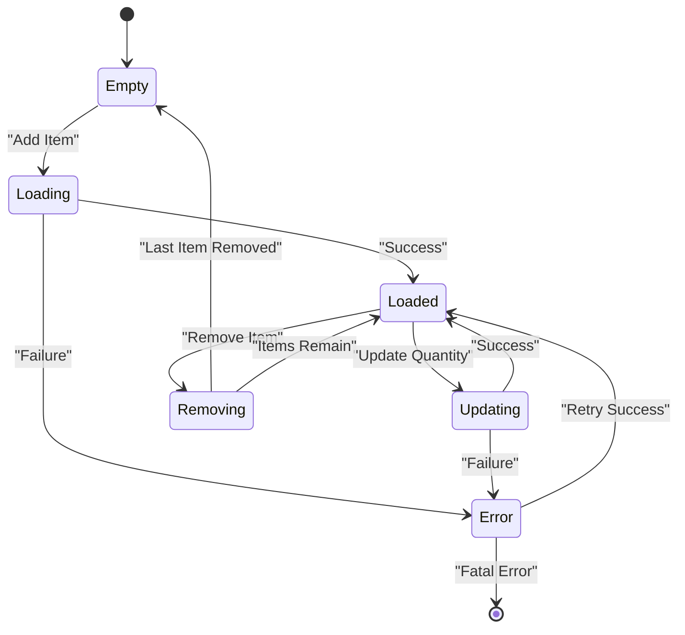
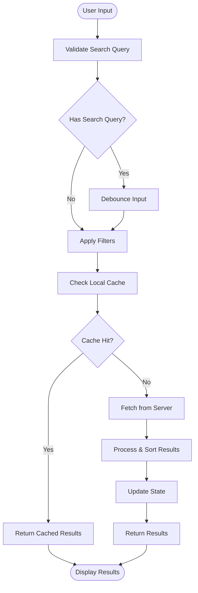
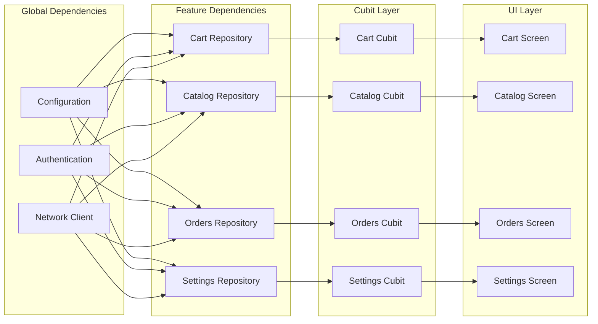

# State Management Strategy

<cite>
**Referenced Files in This Document**
- [main.dart](file://lib/main.dart)
- [app.dart](file://lib/app.dart)
- [cart_cubit_test.dart](file://test/cart_cubit_test.dart)
- [catalog_cubit_test.dart](file://test/catalog_cubit_test.dart)
- [orders_cubit_test.dart](file://test/orders_cubit_test.dart)
- [settings_cubit_test.dart](file://test/settings_cubit_test.dart)
- [pubspec.yaml](file://pubspec.yaml)
</cite>

## Table of Contents
1. [Introduction](#introduction)
2. [Project Structure](#project-structure)
3. [Core Components](#core-components)
4. [Architecture Overview](#architecture-overview)
5. [Detailed Component Analysis](#detailed-component-analysis)
6. [Dependency Analysis](#dependency-analysis)
7. [Performance Considerations](#performance-considerations)
8. [Troubleshooting Guide](#troubleshooting-guide)
9. [Conclusion](#conclusion)

## Introduction

Albatal Store implements a robust state management strategy combining Riverpod for dependency injection and Cubit for predictable state updates. This approach ensures reactive programming patterns while maintaining testability and modularity across the application's features. The architecture follows clean separation of concerns, making it easier to maintain and scale as the application grows.

The state management system is built around three core principles:
- **Predictable State Updates**: Using Cubit's unidirectional data flow pattern
- **Reactive Programming**: Leveraging Riverpod's reactive provider system
- **Testability**: Ensuring all components can be easily tested in isolation

## Project Structure

The Albatal Store follows a feature-based architecture with clear separation between core functionality, data layer, and feature-specific implementations. State management components are organized within their respective feature directories, promoting cohesion and maintainability.

**Diagram sources**
- [main.dart:1-50](file://lib/main.dart#L1-L50)
- [app.dart:1-50](file://lib/app.dart#L1-L50)

**Section sources**
- [main.dart:1-100](file://lib/main.dart#L1-L100)
- [app.dart:1-100](file://lib/app.dart#L1-L100)

## Core Components

The state management system consists of several key components that work together to provide a cohesive and maintainable architecture:

### Riverpod Provider Architecture
Riverpod serves as the foundation for dependency injection throughout the application. Providers are defined at appropriate scopes (global, feature, or local) to manage dependencies and shared state.

### Cubit Implementation Pattern
Cubits handle business logic and state transitions using the BLoC pattern principles. Each Cubit manages a specific domain area and exposes methods for state mutations while keeping state immutable.

### State Class Design
State classes represent the complete snapshot of a feature's state at any given time. They follow immutability principles and use copyWith methods for efficient state updates.

### Repository Integration
Cubits interact with repositories through dependency injection, ensuring loose coupling and testability. This separation allows for easy mocking during testing and swapping implementations.

**Section sources**
- [pubspec.yaml:1-50](file://pubspec.yaml#L1-L50)

## Architecture Overview

The state management architecture follows a layered approach with clear boundaries between concerns:

**Diagram sources**
- [cart_cubit_test.dart:1-50](file://test/cart_cubit_test.dart#L1-L50)
- [catalog_cubit_test.dart:1-50](file://test/catalog_cubit_test.dart#L1-L50)

## Detailed Component Analysis

### Cart Management System

The cart feature demonstrates a comprehensive implementation of Cubit pattern with complex state management:

#### Cart Cubit Architecture
The cart cubit manages shopping cart operations including adding items, removing items, updating quantities, and calculating totals. It maintains both item collections and computed properties like total price and item count.

#### State Transitions
Cart state transitions follow a predictable pattern where each action results in a new immutable state object. The cubit validates inputs, performs business logic, and emits updated states.

#### Error Handling
The cart cubit implements comprehensive error handling for network failures, validation errors, and edge cases like insufficient stock or invalid product IDs.

**Diagram sources**
- [cart_cubit_test.dart:1-100](file://test/cart_cubit_test.dart#L1-L100)

### Catalog Management System

The catalog cubit handles product listing, filtering, and search functionality:

#### Product State Management
Product catalog state includes pagination support, filtering options, search queries, and loading indicators. The cubit manages complex query parameters and result caching.

#### Search and Filtering Logic
Advanced search capabilities include text-based filtering, category selection, price range filtering, and sorting options. The cubit debounces search inputs and manages filter combinations efficiently.

#### Pagination Implementation
Infinite scrolling is implemented through cursor-based pagination, allowing users to load more products without performance degradation.

**Diagram sources**
- [catalog_cubit_test.dart:1-150](file://test/catalog_cubit_test.dart#L1-L150)

### Orders Management System

The orders cubit manages order lifecycle, status tracking, and order history:

#### Order Lifecycle Management
Order states transition through creation, processing, payment, shipping, and completion phases. Each transition includes validation and side effects.

#### Real-time Updates
Order status updates are handled through real-time subscriptions, ensuring users see current order status without manual refresh.

#### Error Recovery
Comprehensive error recovery mechanisms handle network interruptions, payment failures, and inventory conflicts with user-friendly feedback.

**Section sources**
- [orders_cubit_test.dart:1-100](file://test/orders_cubit_test.dart#L1-L100)

### Settings Management System

The settings cubit manages user preferences, app configuration, and theme settings:

#### Preference Persistence
User preferences are persisted locally and synchronized with cloud storage when available. Changes propagate across the app instantly.

#### Theme Management
Dynamic theme switching is supported with smooth transitions and persistent theme selection across app sessions.

#### Configuration Validation
All setting changes are validated before being applied, ensuring data integrity and preventing invalid configurations.

**Section sources**
- [settings_cubit_test.dart:1-100](file://test/settings_cubit_test.dart#L1-L100)

## Dependency Analysis

The dependency injection system using Riverpod creates a flexible and testable architecture:

**Diagram sources**
- [main.dart:1-100](file://lib/main.dart#L1-L100)
- [app.dart:1-100](file://lib/app.dart#L1-L100)

### Provider Hierarchy

The provider hierarchy follows a logical scope-based organization:

- **Global Scope**: Application-wide dependencies like configuration, authentication, and network clients
- **Feature Scope**: Feature-specific providers that encapsulate business logic and data access
- **Local Scope**: Widget-scoped providers for temporary state and widget-specific logic

### Testing Dependencies

The dependency injection system enables comprehensive testing through:

- **Mock Providers**: Easy replacement of real dependencies with test doubles
- **Provider Overrides**: Scoped provider overrides for isolated testing scenarios
- **Async Testing**: Built-in support for testing asynchronous state transitions

**Section sources**
- [cart_cubit_test.dart:1-200](file://test/cart_cubit_test.dart#L1-L200)
- [catalog_cubit_test.dart:1-200](file://test/catalog_cubit_test.dart#L1-L200)

## Performance Considerations

The state management system is optimized for performance through several strategies:

### Selective Rebuilding
Riverpod's selector mechanism ensures widgets only rebuild when relevant state changes, minimizing unnecessary rebuilds and improving performance.

### State Memoization
Expensive computations are memoized and cached to prevent redundant calculations during state updates.

### Lazy Loading
Heavy dependencies are loaded lazily to reduce initial app startup time and memory usage.

### Memory Management
Proper disposal of resources and cleanup of subscriptions prevents memory leaks in long-running applications.

### Batch Updates
Multiple state updates are batched together to minimize rebuild frequency and improve rendering performance.

## Troubleshooting Guide

Common issues and their solutions in the state management system:

### State Not Updating
- Verify provider scope and ensure correct provider instance is being consumed
- Check for immutable state updates using proper copyWith methods
- Ensure state equality checks are properly implemented

### Memory Leaks
- Dispose of subscriptions and timers in cubit close methods
- Use proper provider scopes to manage dependency lifecycles
- Monitor for circular dependencies in provider definitions

### Performance Issues
- Use selectors to optimize widget rebuilds
- Implement lazy loading for heavy dependencies
- Avoid expensive computations in state getters

### Testing Difficulties
- Use provider overrides for isolated testing
- Mock external dependencies appropriately
- Test both success and failure scenarios comprehensively

**Section sources**
- [cart_cubit_test.dart:150-200](file://test/cart_cubit_test.dart#L150-L200)
- [catalog_cubit_test.dart:150-200](file://test/catalog_cubit_test.dart#L150-L200)

## Conclusion

The Riverpod/Cubit state management strategy in Albatal Store provides a robust, scalable, and maintainable foundation for building complex Flutter applications. The combination of predictable state updates through Cubit and flexible dependency injection through Riverpod creates an architecture that is both powerful and easy to understand.

Key benefits of this approach include:
- **Predictable State Flow**: Clear unidirectional data flow makes debugging and reasoning about application state straightforward
- **High Testability**: Comprehensive testing support ensures code quality and reliability
- **Scalability**: Modular architecture supports easy addition of new features and complexity
- **Performance**: Optimized rebuilding and resource management ensure smooth user experience
- **Maintainability**: Clear separation of concerns and consistent patterns make code easy to maintain and extend

This state management strategy serves as a solid foundation for the continued growth and evolution of the Albatal Store application.