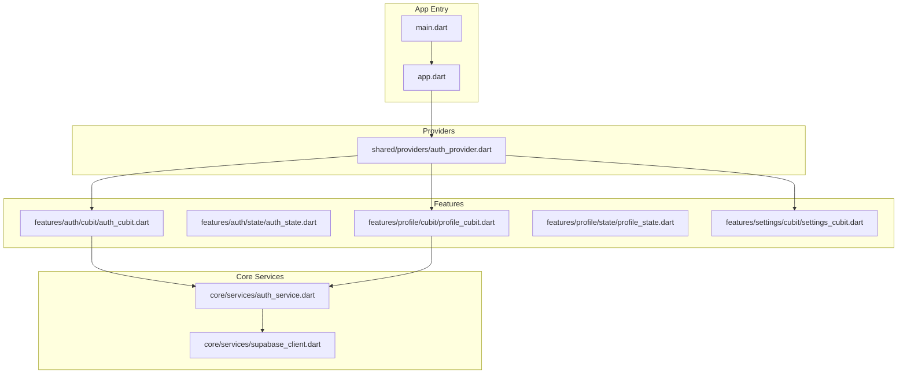
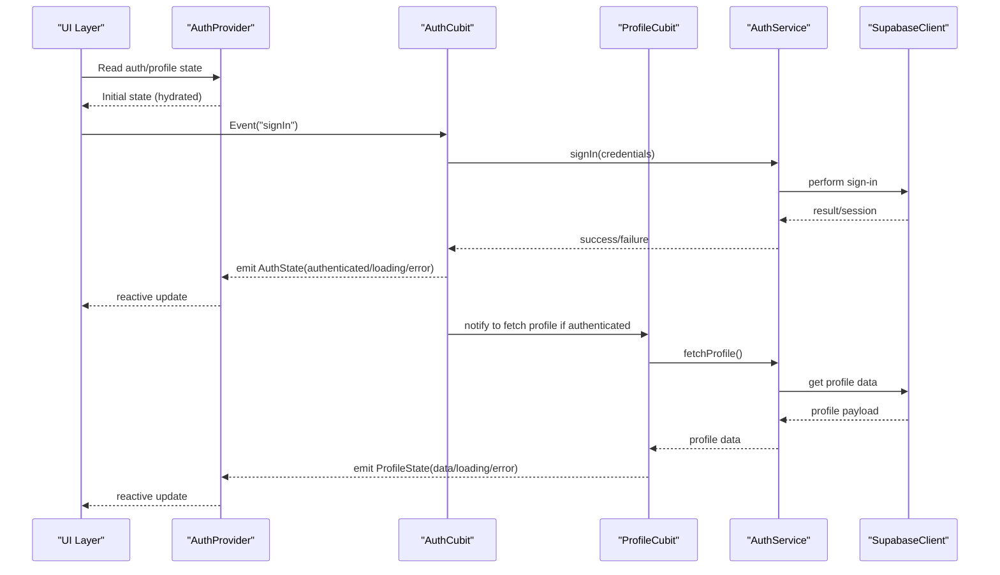
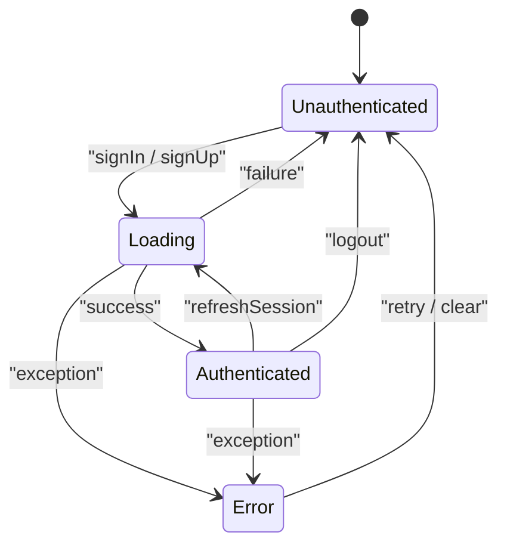
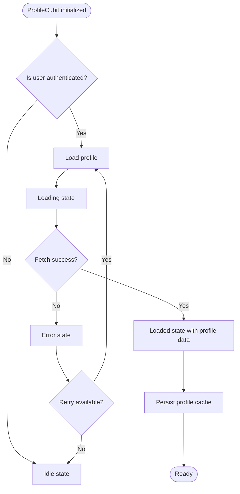
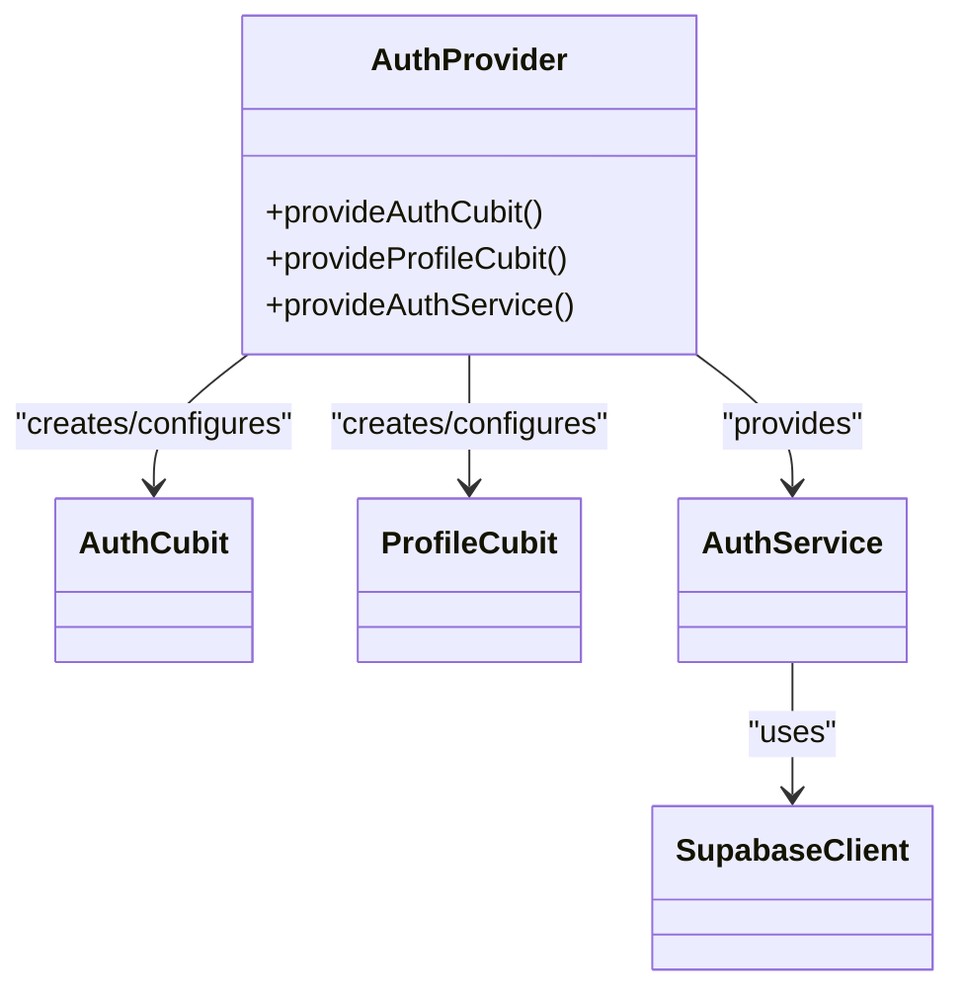
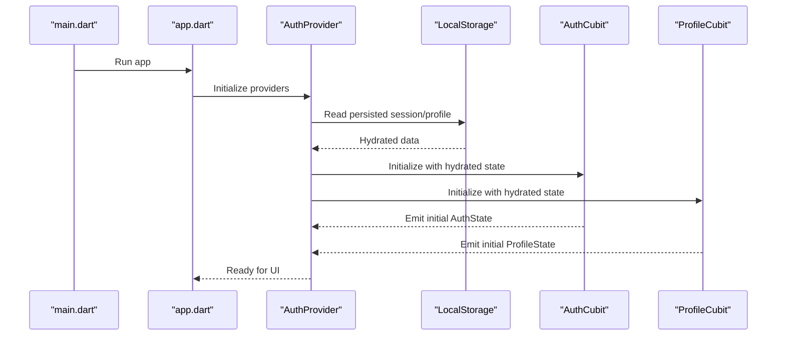
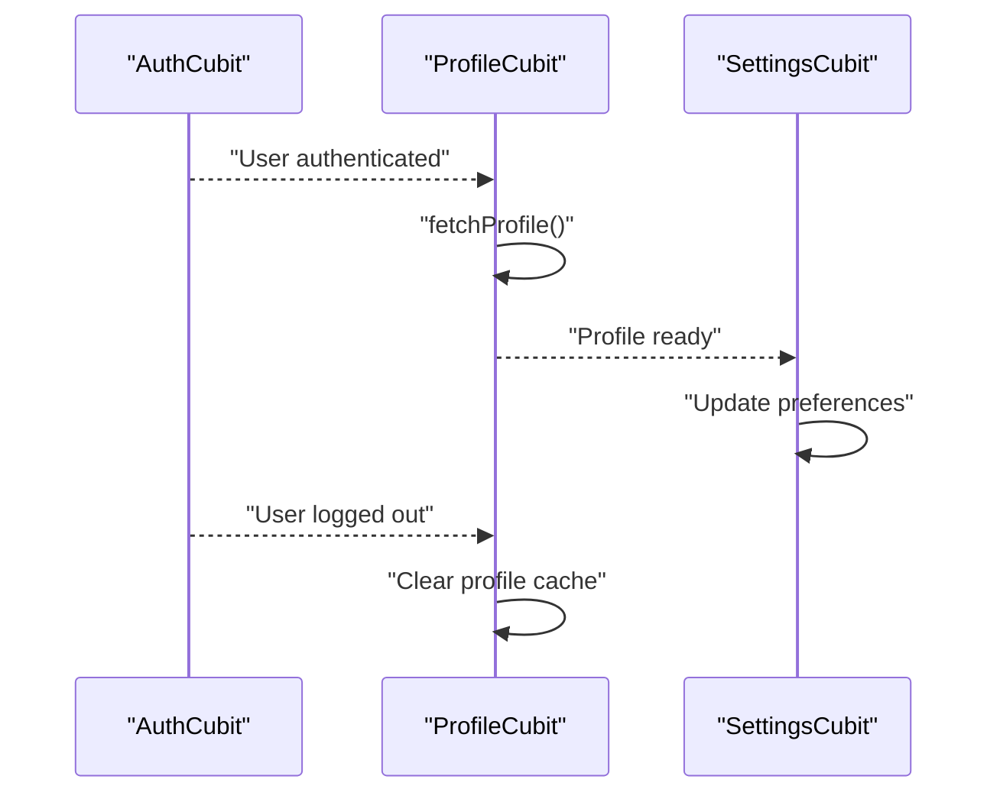
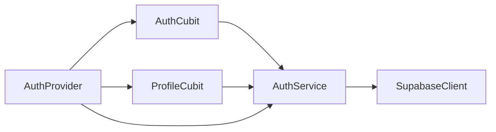

# Authentication State Management

<cite>
**Referenced Files in This Document**
- [main.dart](file://lib/main.dart)
- [app.dart](file://lib/app.dart)
- [auth_cubit.dart](file://lib/features/auth/cubit/auth_cubit.dart)
- [auth_state.dart](file://lib/features/auth/state/auth_state.dart)
- [profile_cubit.dart](file://lib/features/profile/cubit/profile_cubit.dart)
- [profile_state.dart](file://lib/features/profile/state/profile_state.dart)
- [auth_service.dart](file://lib/core/services/auth_service.dart)
- [supabase_client.dart](file://lib/core/services/supabase_client.dart)
- [auth_provider.dart](file://lib/shared/providers/auth_provider.dart)
- [settings_cubit.dart](file://lib/features/settings/cubit/settings_cubit.dart)
- [auth_test.dart](file://test/auth_test.dart)
</cite>

## Table of Contents
1. [Introduction](#introduction)
2. [Project Structure](#project-structure)
3. [Core Components](#core-components)
4. [Architecture Overview](#architecture-overview)
5. [Detailed Component Analysis](#detailed-component-analysis)
6. [Dependency Analysis](#dependency-analysis)
7. [Performance Considerations](#performance-considerations)
8. [Troubleshooting Guide](#troubleshooting-guide)
9. [Conclusion](#conclusion)
10. [Appendices](#appendices)

## Introduction
This document explains the authentication state management architecture implemented with the Cubit pattern. It covers how authentication and profile states are modeled, updated reactively, and persisted across app sessions. It also documents provider setup, dependency injection for auth services, global state access patterns, hydration on startup, error recovery mechanisms, and testing strategies. The goal is to make the system understandable for both new contributors and experienced developers.

## Project Structure
The authentication-related code is organized by feature and layer:
- Features encapsulate domain-specific logic (auth, profile, settings).
- Core services provide platform and backend integrations (Supabase client, auth service).
- Providers expose state via Riverpod or similar DI containers.
- Tests validate behavior and edge cases.

**Diagram sources**
- [main.dart](file://lib/main.dart)
- [app.dart](file://lib/app.dart)
- [auth_cubit.dart](file://lib/features/auth/cubit/auth_cubit.dart)
- [auth_state.dart](file://lib/features/auth/state/auth_state.dart)
- [profile_cubit.dart](file://lib/features/profile/cubit/profile_cubit.dart)
- [profile_state.dart](file://lib/features/profile/state/profile_state.dart)
- [auth_service.dart](file://lib/core/services/auth_service.dart)
- [supabase_client.dart](file://lib/core/services/supabase_client.dart)
- [auth_provider.dart](file://lib/shared/providers/auth_provider.dart)
- [settings_cubit.dart](file://lib/features/settings/cubit/settings_cubit.dart)

**Section sources**
- [main.dart](file://lib/main.dart)
- [app.dart](file://lib/app.dart)

## Core Components
- AuthCubit: Manages authentication lifecycle (login, logout, refresh), tracks loading and error states, and persists session status.
- AuthState: Represents current auth state (e.g., unauthenticated, authenticated, loading, error) and related metadata.
- ProfileCubit: Manages user profile data fetching, updates, and synchronization with auth state.
- ProfileState: Encapsulates profile loading, data, and errors.
- AuthService: Abstraction over authentication operations (sign-in/sign-out, token refresh, session checks).
- SupabaseClient: Low-level integration with Supabase for auth and data access.
- AuthProvider: Exposes cubits and services through a provider container for dependency injection and global access.

Key responsibilities:
- Reactive updates: Each cubit emits new states upon events, enabling UI to rebuild automatically.
- Persistence: Session and minimal profile info are persisted to local storage and hydrated on startup.
- Error handling: Errors are captured and surfaced as explicit state fields; cubits avoid throwing exceptions to keep UI stable.

**Section sources**
- [auth_cubit.dart](file://lib/features/auth/cubit/auth_cubit.dart)
- [auth_state.dart](file://lib/features/auth/state/auth_state.dart)
- [profile_cubit.dart](file://lib/features/profile/cubit/profile_cubit.dart)
- [profile_state.dart](file://lib/features/profile/state/profile_state.dart)
- [auth_service.dart](file://lib/core/services/auth_service.dart)
- [supabase_client.dart](file://lib/core/services/supabase_client.dart)
- [auth_provider.dart](file://lib/shared/providers/auth_provider.dart)

## Architecture Overview
The authentication flow uses a layered approach:
- UI interacts with cubits via providers.
- Cubits orchestrate business logic and call services.
- Services coordinate with Supabase and persist necessary data.
- On app start, providers initialize cubits and hydrate state from persistent storage.

**Diagram sources**
- [auth_cubit.dart](file://lib/features/auth/cubit/auth_cubit.dart)
- [profile_cubit.dart](file://lib/features/profile/cubit/profile_cubit.dart)
- [auth_service.dart](file://lib/core/services/auth_service.dart)
- [supabase_client.dart](file://lib/core/services/supabase_client.dart)
- [auth_provider.dart](file://lib/shared/providers/auth_provider.dart)

## Detailed Component Analysis

### AuthCubit and AuthState
AuthCubit implements the Cubit pattern for authentication:
- State transitions:
  - Unauthenticated -> Loading -> Authenticated
  - Any state -> Error (on failures)
  - Authenticated -> Unauthenticated (on logout)
- Async operations:
  - Sign-in/sign-up flows
  - Token refresh and session validation
  - Logout and cleanup
- Persistence:
  - Persists minimal session flags and tokens
  - Hydrates state on startup to avoid unnecessary network calls
- Error handling:
  - Catches service errors and maps them to explicit error states
  - Avoids throwing exceptions to maintain UI stability

**Diagram sources**
- [auth_cubit.dart](file://lib/features/auth/cubit/auth_cubit.dart)
- [auth_state.dart](file://lib/features/auth/state/auth_state.dart)

**Section sources**
- [auth_cubit.dart](file://lib/features/auth/cubit/auth_cubit.dart)
- [auth_state.dart](file://lib/features/auth/state/auth_state.dart)

### ProfileCubit and ProfileState
ProfileCubit manages user profile data:
- State transitions:
  - Idle -> Loading -> Loaded
  - Any state -> Error (on failures)
- Sync with AuthCubit:
  - Listens to authenticated state changes
  - Fetches profile when user becomes authenticated
  - Clears or invalidates cached profile on logout
- Persistence:
  - Optionally caches profile data locally to reduce network usage
- Error handling:
  - Maps network/service errors to profile error state
  - Provides retry semantics via UI actions

**Diagram sources**
- [profile_cubit.dart](file://lib/features/profile/cubit/profile_cubit.dart)
- [profile_state.dart](file://lib/features/profile/state/profile_state.dart)

**Section sources**
- [profile_cubit.dart](file://lib/features/profile/cubit/profile_cubit.dart)
- [profile_state.dart](file://lib/features/profile/state/profile_state.dart)

### Provider Setup and Dependency Injection
The provider layer wires cubits and services:
- Initializes AuthCubit and ProfileCubit with dependencies (AuthService, SupabaseClient).
- Exposes state streams/streams-like APIs to UI components.
- Handles lifecycle:
  - Creates instances once per scope
  - Disposes resources on teardown
- Global access patterns:
  - UI reads state via provider selectors
  - Actions dispatched through cubit methods exposed by providers

**Diagram sources**
- [auth_provider.dart](file://lib/shared/providers/auth_provider.dart)
- [auth_cubit.dart](file://lib/features/auth/cubit/auth_cubit.dart)
- [profile_cubit.dart](file://lib/features/profile/cubit/profile_cubit.dart)
- [auth_service.dart](file://lib/core/services/auth_service.dart)
- [supabase_client.dart](file://lib/core/services/supabase_client.dart)

**Section sources**
- [auth_provider.dart](file://lib/shared/providers/auth_provider.dart)

### State Hydration on App Startup
Hydration ensures consistent state immediately after launch:
- On app start, providers read persisted session and profile data.
- AuthCubit initializes with hydrated state (e.g., authenticated flag).
- ProfileCubit conditionally loads profile based on auth state.
- UI renders without flicker due to pre-hydrated values.

**Diagram sources**
- [main.dart](file://lib/main.dart)
- [app.dart](file://lib/app.dart)
- [auth_provider.dart](file://lib/shared/providers/auth_provider.dart)
- [auth_cubit.dart](file://lib/features/auth/cubit/auth_cubit.dart)
- [profile_cubit.dart](file://lib/features/profile/cubit/profile_cubit.dart)

**Section sources**
- [main.dart](file://lib/main.dart)
- [app.dart](file://lib/app.dart)
- [auth_provider.dart](file://lib/shared/providers/auth_provider.dart)

### Error Handling Patterns
- Service layer returns structured results or throws typed exceptions.
- Cubits catch exceptions and map them to explicit error states.
- UI reacts to error states by showing messages and offering retry actions.
- Recovery mechanisms:
  - Re-authentication prompts on token expiration
  - Clearing corrupted local state and rehydrating
  - Graceful fallbacks when network unavailable

**Section sources**
- [auth_cubit.dart](file://lib/features/auth/cubit/auth_cubit.dart)
- [profile_cubit.dart](file://lib/features/profile/cubit/profile_cubit.dart)
- [auth_service.dart](file://lib/core/services/auth_service.dart)

### Testing Strategies for Auth State
- Unit tests for cubits:
  - Verify state transitions on events (signIn, logout, refresh)
  - Mock AuthService and SupabaseClient to isolate logic
  - Assert error states on failure scenarios
- Integration tests:
  - Simulate full login flow including hydration
  - Validate that profile sync occurs post-authentication
- Example test file references:
  - [auth_test.dart](file://test/auth_test.dart)

**Section sources**
- [auth_test.dart](file://test/auth_test.dart)

### Coordination Between AuthCubit and ProfileCubit
- AuthCubit emits authenticated/unauthenticated events.
- ProfileCubit listens to these events and triggers profile load/clear accordingly.
- SettingsCubit may depend on profile data for preferences and theme selection.

**Diagram sources**
- [auth_cubit.dart](file://lib/features/auth/cubit/auth_cubit.dart)
- [profile_cubit.dart](file://lib/features/profile/cubit/profile_cubit.dart)
- [settings_cubit.dart](file://lib/features/settings/cubit/settings_cubit.dart)

**Section sources**
- [auth_cubit.dart](file://lib/features/auth/cubit/auth_cubit.dart)
- [profile_cubit.dart](file://lib/features/profile/cubit/profile_cubit.dart)
- [settings_cubit.dart](file://lib/features/settings/cubit/settings_cubit.dart)

## Dependency Analysis
The following diagram shows key dependencies among core components:

**Diagram sources**
- [auth_cubit.dart](file://lib/features/auth/cubit/auth_cubit.dart)
- [profile_cubit.dart](file://lib/features/profile/cubit/profile_cubit.dart)
- [auth_service.dart](file://lib/core/services/auth_service.dart)
- [supabase_client.dart](file://lib/core/services/supabase_client.dart)
- [auth_provider.dart](file://lib/shared/providers/auth_provider.dart)

**Section sources**
- [auth_cubit.dart](file://lib/features/auth/cubit/auth_cubit.dart)
- [profile_cubit.dart](file://lib/features/profile/cubit/profile_cubit.dart)
- [auth_service.dart](file://lib/core/services/auth_service.dart)
- [supabase_client.dart](file://lib/core/services/supabase_client.dart)
- [auth_provider.dart](file://lib/shared/providers/auth_provider.dart)

## Performance Considerations
- Minimize redundant network calls by caching profile data and checking auth state before requests.
- Use debounced or throttled operations for frequent state updates where appropriate.
- Prefer lightweight hydration payloads (e.g., session flags) and fetch heavy data on demand.
- Ensure cubits do not perform heavy computations synchronously; offload to background tasks if needed.

[No sources needed since this section provides general guidance]

## Troubleshooting Guide
Common issues and resolutions:
- Stuck in loading state:
  - Verify AuthService responses and ensure cubit emits success/failure states correctly.
  - Check persistence layer for corrupted data; clear and rehydrate.
- Profile not updating after login:
  - Confirm ProfileCubit listens to AuthCubit’s authenticated event and triggers fetch.
  - Inspect network logs for profile endpoint errors.
- Error loops:
  - Ensure error states include actionable retry paths and that retries reset loading flags.
- Hydration mismatches:
  - Validate that initial state matches persisted data schema; add migration or fallback logic if needed.

**Section sources**
- [auth_cubit.dart](file://lib/features/auth/cubit/auth_cubit.dart)
- [profile_cubit.dart](file://lib/features/profile/cubit/profile_cubit.dart)
- [auth_service.dart](file://lib/core/services/auth_service.dart)

## Conclusion
The authentication state management leverages the Cubit pattern to deliver predictable, reactive state transitions with robust error handling and persistence. AuthCubit and ProfileCubit coordinate to maintain consistent application state, while providers centralize dependency injection and global access. Hydration ensures seamless startup experiences, and comprehensive testing validates correctness across unit and integration scenarios.

[No sources needed since this section summarizes without analyzing specific files]

## Appendices
- Example references for concrete implementations:
  - State initialization and async operations:
    - [auth_cubit.dart](file://lib/features/auth/cubit/auth_cubit.dart)
    - [profile_cubit.dart](file://lib/features/profile/cubit/profile_cubit.dart)
  - Provider setup and DI:
    - [auth_provider.dart](file://lib/shared/providers/auth_provider.dart)
  - Service integrations:
    - [auth_service.dart](file://lib/core/services/auth_service.dart)
    - [supabase_client.dart](file://lib/core/services/supabase_client.dart)
  - Testing examples:
    - [auth_test.dart](file://test/auth_test.dart)