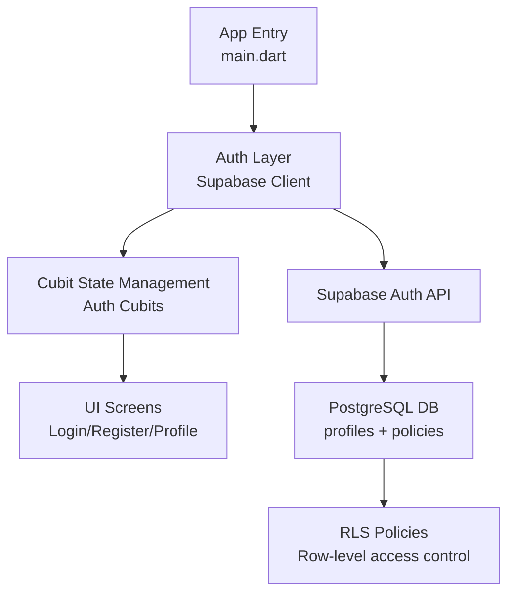
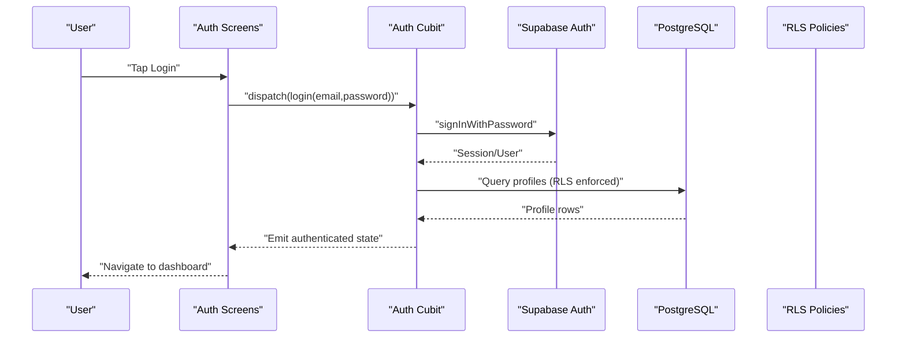
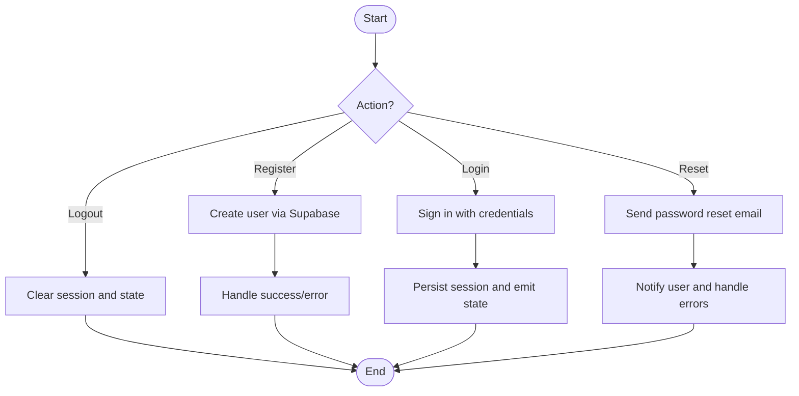
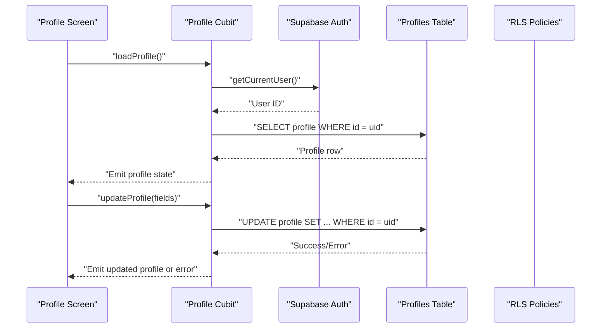
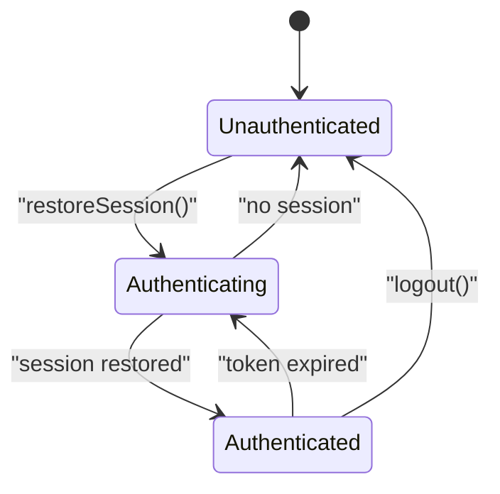
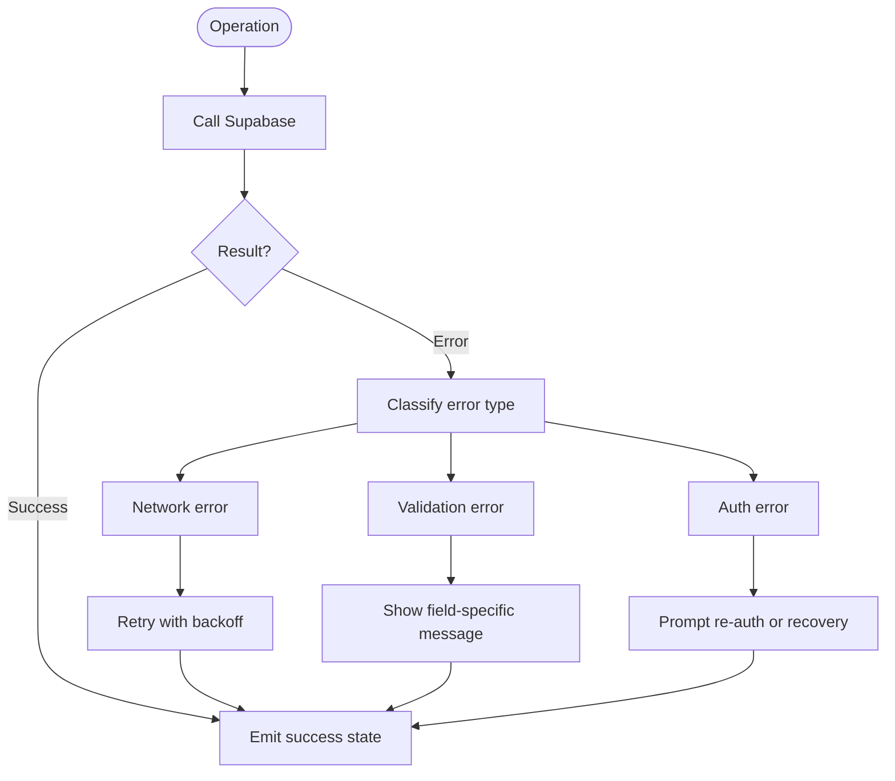
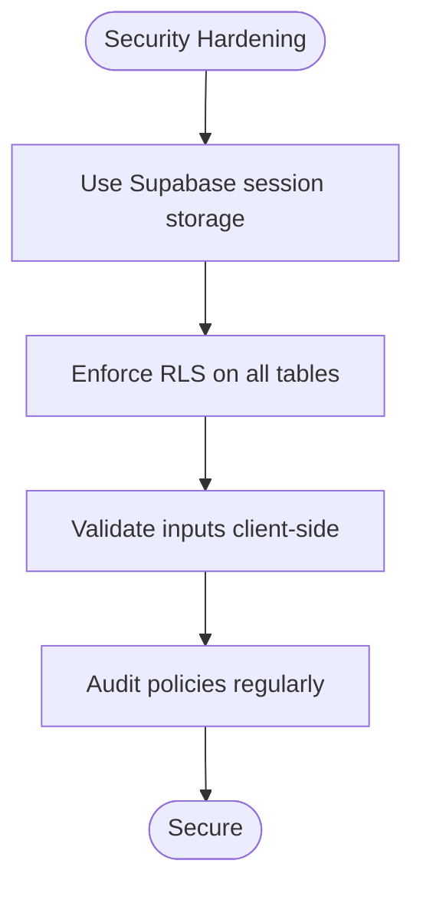
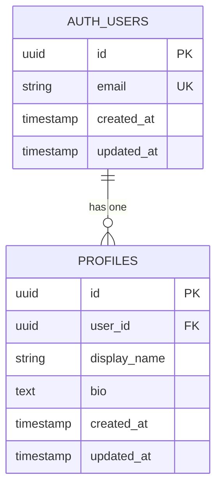
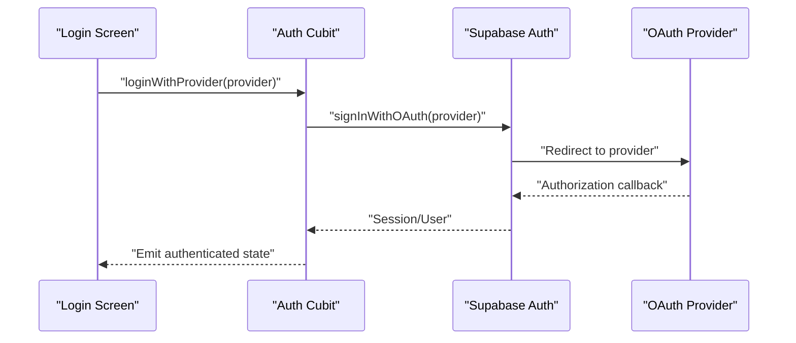
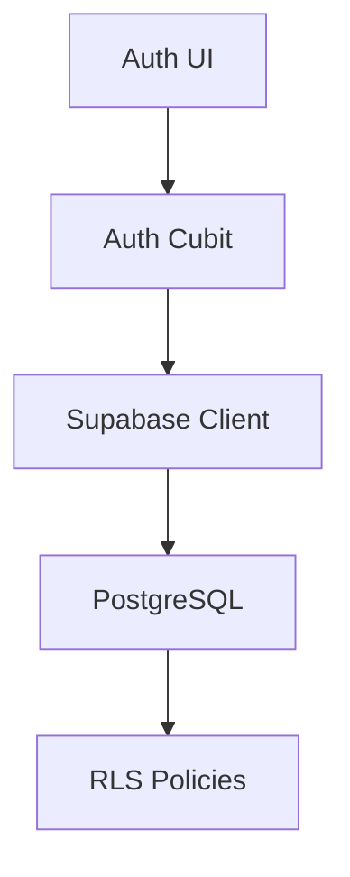

# Authentication System

<cite>
**Referenced Files in This Document**
- [README.md](file://README.md)
- [supabase-integration.md](file://docs/supabase-integration.md)
- [001_initial_schema.sql](file://supabase/migrations/001_initial_schema.sql)
- [002_rls_policies.sql](file://supabase/migrations/002_rls_policies.sql)
- [003_auth_profiles_and_hardening.sql](file://supabase/migrations/003_auth_profiles_and_hardening.sql)
- [verify_rls.sql](file://supabase/migrations/verify_rls.sql)
- [auth_test.dart](file://test/auth_test.dart)
</cite>

## Table of Contents
1. [Introduction](#introduction)
2. [Project Structure](#project-structure)
3. [Core Components](#core-components)
4. [Architecture Overview](#architecture-overview)
5. [Detailed Component Analysis](#detailed-component-analysis)
6. [Dependency Analysis](#dependency-analysis)
7. [Performance Considerations](#performance-considerations)
8. [Troubleshooting Guide](#troubleshooting-guide)
9. [Conclusion](#conclusion)
10. [Appendices](#appendices)

## Introduction
This document explains the authentication system implementation for the project, focusing on user registration, login, profile management, and session handling using Supabase authentication. It also covers Cubit state management for auth flows, security considerations including token management and Row Level Security (RLS) policies, database schema for user profiles, and integration with Supabase auth providers. The goal is to make the system understandable for beginners while providing sufficient technical depth for experienced developers.

## Project Structure
The authentication-related code spans several areas:
- Documentation and integration notes
- Database migrations defining schema, RLS policies, and hardening measures
- Tests validating authentication behavior
- Application entry points and feature modules that consume Supabase auth

[No sources needed since this diagram shows conceptual workflow, not actual code structure]

**Section sources**
- [README.md](file://README.md)
- [supabase-integration.md](file://docs/supabase-integration.md)

## Core Components
- Supabase client initialization and configuration
- Auth Cubits managing authentication state transitions
- UI screens for login, registration, password reset, and profile management
- Database schema for user profiles and related tables
- RLS policies enforcing data access rules
- Integration tests covering authentication flows

Key responsibilities:
- Initialize Supabase client and persist sessions
- Expose auth state via Cubits for reactive UI updates
- Provide secure operations for registration, login, logout, password reset, and profile updates
- Enforce RLS policies to protect user data

**Section sources**
- [supabase-integration.md](file://docs/supabase-integration.md)
- [auth_test.dart](file://test/auth_test.dart)

## Architecture Overview
The authentication architecture integrates Flutter UI, Cubit state management, and Supabase services.

**Diagram sources**
- [supabase-integration.md](file://docs/supabase-integration.md)
- [002_rls_policies.sql](file://supabase/migrations/002_rls_policies.sql)
- [003_auth_profiles_and_hardening.sql](file://supabase/migrations/003_auth_profiles_and_hardening.sql)

## Detailed Component Analysis

### Authentication Flows
- Registration: Create a new user via Supabase auth; optionally create or link a profile record; handle errors such as duplicate email or network failures.
- Login: Authenticate with credentials; persist session; emit authenticated state; load user profile.
- Password Reset: Request password reset email; confirm success or error; guide user to check inbox.
- Logout: Clear local session; reset Cubit state; navigate to login screen.

[No sources needed since this diagram shows conceptual workflow, not actual code structure]

**Section sources**
- [auth_test.dart](file://test/auth_test.dart)
- [supabase-integration.md](file://docs/supabase-integration.md)

### Profile Management
- Read current user profile after authentication.
- Update profile fields securely, ensuring only the owner can modify their own data.
- Validate inputs before sending requests.

**Diagram sources**
- [003_auth_profiles_and_hardening.sql](file://supabase/migrations/003_auth_profiles_and_hardening.sql)
- [002_rls_policies.sql](file://supabase/migrations/002_rls_policies.sql)

**Section sources**
- [003_auth_profiles_and_hardening.sql](file://supabase/migrations/003_auth_profiles_and_hardening.sql)
- [002_rls_policies.sql](file://supabase/migrations/002_rls_policies.sql)

### Session Handling
- On app start, restore session from Supabase storage.
- Listen to auth state changes to update UI reactively.
- Handle session expiration by prompting re-authentication.

[No sources needed since this diagram shows conceptual workflow, not actual code structure]

**Section sources**
- [supabase-integration.md](file://docs/supabase-integration.md)

### Error Handling
- Normalize errors from Supabase into user-friendly messages.
- Surface validation errors (e.g., invalid email, weak password).
- Retry transient network errors with backoff where appropriate.

[No sources needed since this diagram shows conceptual workflow, not actual code structure]

**Section sources**
- [auth_test.dart](file://test/auth_test.dart)

### Security Considerations
- Token Management: Use Supabase’s built-in session persistence; avoid storing tokens manually.
- RLS Policies: Ensure all sensitive queries are protected by RLS; verify policies allow only intended access.
- Input Validation: Validate and sanitize inputs before sending to backend.
- Least Privilege: Grant minimal permissions to service roles and ensure client-side checks align with server-side policies.

**Diagram sources**
- [002_rls_policies.sql](file://supabase/migrations/002_rls_policies.sql)
- [003_auth_profiles_and_hardening.sql](file://supabase/migrations/003_auth_profiles_and_hardening.sql)

**Section sources**
- [002_rls_policies.sql](file://supabase/migrations/002_rls_policies.sql)
- [003_auth_profiles_and_hardening.sql](file://supabase/migrations/003_auth_profiles_and_hardening.sql)

### Database Schema and Policies
- Initial schema defines core tables and relationships.
- RLS policies restrict access based on user identity.
- Auth profiles migration adds user profile table and hardening measures.
- Verification script helps validate RLS effectiveness.

**Diagram sources**
- [001_initial_schema.sql](file://supabase/migrations/001_initial_schema.sql)
- [003_auth_profiles_and_hardening.sql](file://supabase/migrations/003_auth_profiles_and_hardening.sql)

**Section sources**
- [001_initial_schema.sql](file://supabase/migrations/001_initial_schema.sql)
- [002_rls_policies.sql](file://supabase/migrations/002_rls_policies.sql)
- [003_auth_profiles_and_hardening.sql](file://supabase/migrations/003_auth_profiles_and_hardening.sql)
- [verify_rls.sql](file://supabase/migrations/verify_rls.sql)

### Integration with Supabase Providers
- Configure supported providers (email/password, OAuth providers if enabled).
- Handle provider callbacks and map results to application state.
- Manage provider-specific errors and edge cases.

[No sources needed since this diagram shows conceptual workflow, not actual code structure]

**Section sources**
- [supabase-integration.md](file://docs/supabase-integration.md)

## Dependency Analysis
Authentication components depend on:
- Supabase client for auth and database access
- Cubit for state management
- UI layers for user interactions
- Database schema and RLS policies for data protection

**Diagram sources**
- [supabase-integration.md](file://docs/supabase-integration.md)
- [002_rls_policies.sql](file://supabase/migrations/002_rls_policies.sql)

**Section sources**
- [supabase-integration.md](file://docs/supabase-integration.md)
- [002_rls_policies.sql](file://supabase/migrations/002_rls_policies.sql)

## Performance Considerations
- Minimize redundant auth calls by caching user state locally within the app lifecycle.
- Debounce profile updates to reduce network overhead.
- Use efficient queries with proper indexes on frequently accessed profile fields.
- Monitor session restoration latency and optimize Supabase client initialization.

[No sources needed since this section provides general guidance]

## Troubleshooting Guide
Common issues and resolutions:
- Session not restored: Verify Supabase client initialization and storage configuration.
- RLS policy violations: Review policies and ensure user context is present in queries.
- Email already exists: Handle duplicate registration errors gracefully.
- Network timeouts: Implement retry logic and user feedback.

**Section sources**
- [auth_test.dart](file://test/auth_test.dart)
- [verify_rls.sql](file://supabase/migrations/verify_rls.sql)

## Conclusion
The authentication system leverages Supabase for robust user management, Cubit for reactive state, and RLS policies for strong data protection. By following the documented flows, security practices, and troubleshooting steps, developers can implement reliable and secure authentication features across platforms.

[No sources needed since this section summarizes without analyzing specific files]

## Appendices
- Quick reference to key migrations and tests for deeper inspection.
- Guidance on extending auth providers and customizing error messages.

[No sources needed since this section provides general guidance]