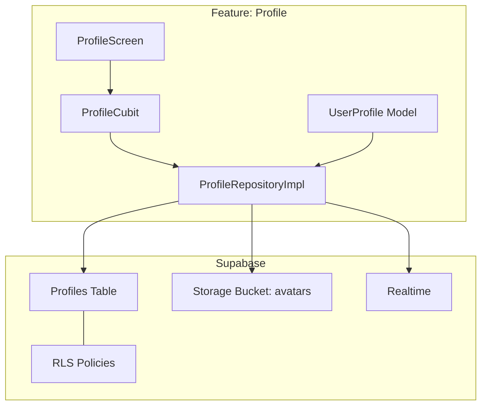
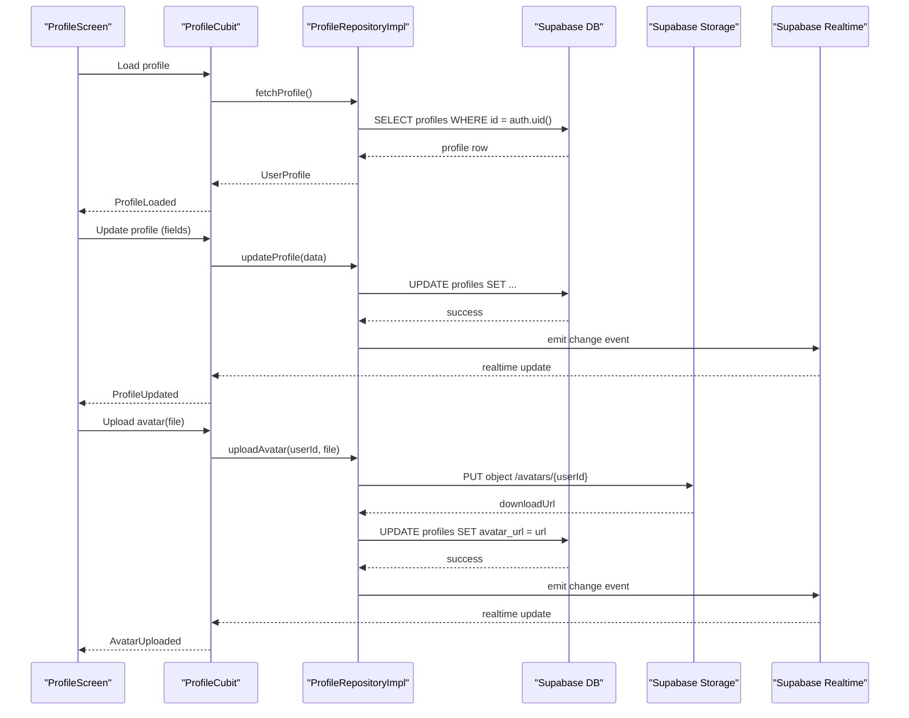
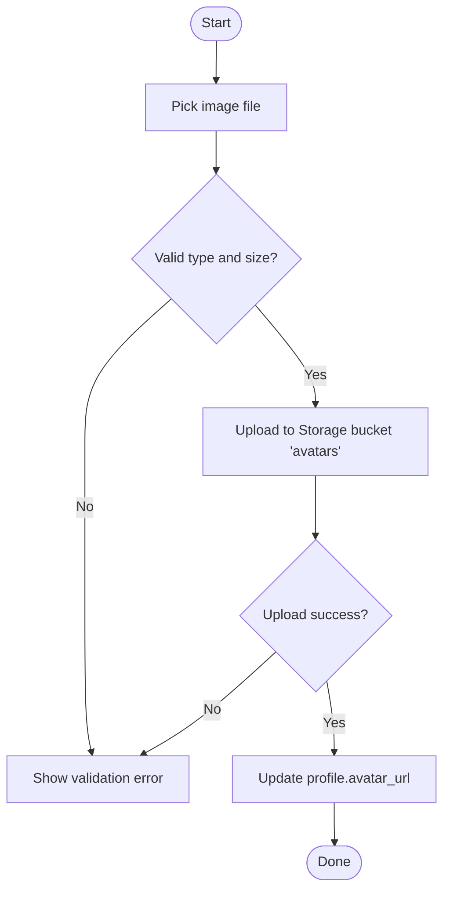
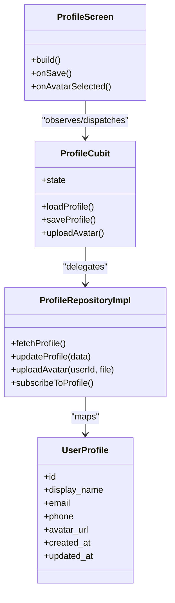

# Profile Management

<cite>
**Referenced Files in This Document**
- [lib/features/profile/domain/models/user_profile_model.dart](file://lib/features/profile/domain/models/user_profile_model.dart)
- [lib/features/profile/data/repositories/profile_repository_impl.dart](file://lib/features/profile/data/repositories/profile_repository_impl.dart)
- [lib/features/profile/presentation/cubit/profile_cubit.dart](file://lib/features/profile/presentation/cubit/profile_cubit.dart)
- [lib/features/profile/presentation/screens/profile_screen.dart](file://lib/features/profile/presentation/screens/profile_screen.dart)
- [supabase/migrations/003_auth_profiles_and_hardening.sql](file://supabase/migrations/003_auth_profiles_and_hardening.sql)
- [supabase/migrations/002_rls_policies.sql](file://supabase/migrations/002_rls_policies.sql)
- [supabase/migrations/005_storage_buckets.sql](file://supabase/migrations/005_storage_buckets.sql)
</cite>

## Table of Contents
1. [Introduction](#introduction)
2. [Project Structure](#project-structure)
3. [Core Components](#core-components)
4. [Architecture Overview](#architecture-overview)
5. [Detailed Component Analysis](#detailed-component-analysis)
6. [Dependency Analysis](#dependency-analysis)
7. [Performance Considerations](#performance-considerations)
8. [Troubleshooting Guide](#troubleshooting-guide)
9. [Conclusion](#conclusion)

## Introduction
This document explains the user profile management features, including CRUD operations, data synchronization with Supabase, and real-time updates. It covers the UserProfile model structure, ProfileCubit state management, and the profile screen implementation. It also documents database schema, Row Level Security (RLS) policies, storage for profile images, validation, error handling, offline sync considerations, and integration points with Supabase Storage and Realtime.

## Project Structure
Profile-related code is organized by feature:
- Domain model: UserProfile definition
- Data layer: Repository implementation interacting with Supabase
- Presentation layer: Cubit for state management and a screen for UI
- Database migrations: Schema, RLS policies, and storage buckets

**Diagram sources**
- [lib/features/profile/domain/models/user_profile_model.dart](file://lib/features/profile/domain/models/user_profile_model.dart)
- [lib/features/profile/data/repositories/profile_repository_impl.dart](file://lib/features/profile/data/repositories/profile_repository_impl.dart)
- [lib/features/profile/presentation/cubit/profile_cubit.dart](file://lib/features/profile/presentation/cubit/profile_cubit.dart)
- [lib/features/profile/presentation/screens/profile_screen.dart](file://lib/features/profile/presentation/screens/profile_screen.dart)
- [supabase/migrations/003_auth_profiles_and_hardening.sql](file://supabase/migrations/003_auth_profiles_and_hardening.sql)
- [supabase/migrations/002_rls_policies.sql](file://supabase/migrations/002_rls_policies.sql)
- [supabase/migrations/005_storage_buckets.sql](file://supabase/migrations/005_storage_buckets.sql)

**Section sources**
- [lib/features/profile/domain/models/user_profile_model.dart](file://lib/features/profile/domain/models/user_profile_model.dart)
- [lib/features/profile/data/repositories/profile_repository_impl.dart](file://lib/features/profile/data/repositories/profile_repository_impl.dart)
- [lib/features/profile/presentation/cubit/profile_cubit.dart](file://lib/features/profile/presentation/cubit/profile_cubit.dart)
- [lib/features/profile/presentation/screens/profile_screen.dart](file://lib/features/profile/presentation/screens/profile_screen.dart)
- [supabase/migrations/003_auth_profiles_and_hardening.sql](file://supabase/migrations/003_auth_profiles_and_hardening.sql)
- [supabase/migrations/002_rls_policies.sql](file://supabase/migrations/002_rls_policies.sql)
- [supabase/migrations/005_storage_buckets.sql](file://supabase/migrations/005_storage_buckets.sql)

## Core Components
- UserProfile model: Defines the shape of profile data used across layers.
- ProfileRepositoryImpl: Encapsulates all Supabase interactions for profiles, including reads, writes, avatar uploads, and real-time subscriptions.
- ProfileCubit: Manages profile state (loading, success, error), orchestrates repository calls, and exposes streams/events to the UI.
- ProfileScreen: Renders profile fields, handles user input, triggers cubit actions, and displays feedback.

Key responsibilities:
- Validation at the UI and repository boundaries
- Error propagation and user-friendly messages
- Avatar upload flow with progress and error states
- Real-time subscription to profile changes

**Section sources**
- [lib/features/profile/domain/models/user_profile_model.dart](file://lib/features/profile/domain/models/user_profile_model.dart)
- [lib/features/profile/data/repositories/profile_repository_impl.dart](file://lib/features/profile/data/repositories/profile_repository_impl.dart)
- [lib/features/profile/presentation/cubit/profile_cubit.dart](file://lib/features/profile/presentation/cubit/profile_cubit.dart)
- [lib/features/profile/presentation/screens/profile_screen.dart](file://lib/features/profile/presentation/screens/profile_screen.dart)

## Architecture Overview
The profile feature follows a clean architecture pattern:
- Presentation: ProfileScreen observes ProfileCubit state and dispatches events.
- State Management: ProfileCubit coordinates business logic and delegates persistence to the repository.
- Data Access: ProfileRepositoryImpl uses Supabase client for table operations, Storage for avatars, and Realtime for live updates.
- Database: Profiles table stores user profile records; RLS enforces per-user access; Storage bucket holds avatar files.

**Diagram sources**
- [lib/features/profile/presentation/screens/profile_screen.dart](file://lib/features/profile/presentation/screens/profile_screen.dart)
- [lib/features/profile/presentation/cubit/profile_cubit.dart](file://lib/features/profile/presentation/cubit/profile_cubit.dart)
- [lib/features/profile/data/repositories/profile_repository_impl.dart](file://lib/features/profile/data/repositories/profile_repository_impl.dart)
- [supabase/migrations/003_auth_profiles_and_hardening.sql](file://supabase/migrations/003_auth_profiles_and_hardening.sql)
- [supabase/migrations/005_storage_buckets.sql](file://supabase/migrations/005_storage_buckets.sql)

## Detailed Component Analysis

### UserProfile Model
- Purpose: Strongly typed representation of a user profile record.
- Typical fields: unique identifier, display name, email, phone, address lines, city, country, postal code, avatar URL, timestamps.
- Usage: Used by the repository to map rows to domain objects and by the cubit/screen to render and validate inputs.

Best practices:
- Keep field names aligned with database columns.
- Provide factory constructors or fromJson/toJson helpers if needed.
- Avoid storing sensitive data beyond what is required.

**Section sources**
- [lib/features/profile/domain/models/user_profile_model.dart](file://lib/features/profile/domain/models/user_profile_model.dart)

### ProfileRepositoryImpl
Responsibilities:
- Read profile by authenticated user ID.
- Create or update profile fields.
- Upload avatar image to Supabase Storage and persist the public URL.
- Subscribe to profile changes via Realtime.
- Map database rows to UserProfile and handle errors.

Key flows:
- Fetch profile: query profiles table filtered by current user.
- Update profile: upsert or update fields with validation.
- Upload avatar: upload file to avatars bucket, then update avatar_url column.
- Realtime: listen to changes on the profiles table for the current user.

Error handling:
- Network and permission errors surfaced to the cubit.
- Specific messages for invalid file types/sizes.
- Graceful fallbacks when Realtime is unavailable.

**Section sources**
- [lib/features/profile/data/repositories/profile_repository_impl.dart](file://lib/features/profile/data/repositories/profile_repository_impl.dart)

### ProfileCubit
Responsibilities:
- Maintain profile state (initial, loading, loaded, error).
- Expose methods to load, update, and upload avatar.
- Manage Realtime subscription lifecycle.
- Transform repository results into UI-ready states.

State transitions:
- Initial -> Loading -> Loaded
- Any -> Error on failure
- Realtime updates trigger re-render without network calls

Validation:
- Enforce non-empty required fields.
- Validate email format and optional phone patterns.
- Reject unsupported image formats and oversized files before upload.

**Section sources**
- [lib/features/profile/presentation/cubit/profile_cubit.dart](file://lib/features/profile/presentation/cubit/profile_cubit.dart)

### ProfileScreen
Responsibilities:
- Display current profile values.
- Collect user edits and trigger cubit actions.
- Show loading indicators and error messages.
- Handle avatar selection and preview.

User interactions:
- Tap Save to call update profile.
- Choose image to start avatar upload.
- Navigate back after successful save.

Accessibility and UX:
- Clear labels and helper text.
- Inline validation feedback.
- Disabled controls during loading.

**Section sources**
- [lib/features/profile/presentation/screens/profile_screen.dart](file://lib/features/profile/presentation/screens/profile_screen.dart)

### Database Schema and RLS Policies
Schema highlights:
- Profiles table includes user identity reference, profile fields, avatar URL, and timestamps.
- Columns are constrained appropriately (e.g., not null where required).

RLS policies:
- Users can read only their own profile.
- Users can update only their own profile.
- Optional: allow authenticated users to insert their own profile on first login.

Storage bucket:
- A dedicated bucket for avatars with policies allowing authenticated users to upload/update/delete their own files.

Realtime:
- Enable Realtime on the profiles table to broadcast changes to subscribed clients.

**Section sources**
- [supabase/migrations/003_auth_profiles_and_hardening.sql](file://supabase/migrations/003_auth_profiles_and_hardening.sql)
- [supabase/migrations/002_rls_policies.sql](file://supabase/migrations/002_rls_policies.sql)
- [supabase/migrations/005_storage_buckets.sql](file://supabase/migrations/005_storage_buckets.sql)

### Profile Image Upload Flow

**Diagram sources**
- [lib/features/profile/data/repositories/profile_repository_impl.dart](file://lib/features/profile/data/repositories/profile_repository_impl.dart)
- [supabase/migrations/005_storage_buckets.sql](file://supabase/migrations/005_storage_buckets.sql)

### Real-time Profile Updates
- The repository subscribes to profile changes for the current user.
- On any change, the cubit receives an updated UserProfile and emits a new state.
- The screen automatically reflects updates without manual refresh.

Considerations:
- Ensure authentication is established before subscribing.
- Handle connection drops and re-subscribe gracefully.
- Debounce heavy UI work on frequent updates.

**Section sources**
- [lib/features/profile/data/repositories/profile_repository_impl.dart](file://lib/features/profile/data/repositories/profile_repository_impl.dart)
- [lib/features/profile/presentation/cubit/profile_cubit.dart](file://lib/features/profile/presentation/cubit/profile_cubit.dart)

## Dependency Analysis

**Diagram sources**
- [lib/features/profile/domain/models/user_profile_model.dart](file://lib/features/profile/domain/models/user_profile_model.dart)
- [lib/features/profile/data/repositories/profile_repository_impl.dart](file://lib/features/profile/data/repositories/profile_repository_impl.dart)
- [lib/features/profile/presentation/cubit/profile_cubit.dart](file://lib/features/profile/presentation/cubit/profile_cubit.dart)
- [lib/features/profile/presentation/screens/profile_screen.dart](file://lib/features/profile/presentation/screens/profile_screen.dart)

**Section sources**
- [lib/features/profile/domain/models/user_profile_model.dart](file://lib/features/profile/domain/models/user_profile_model.dart)
- [lib/features/profile/data/repositories/profile_repository_impl.dart](file://lib/features/profile/data/repositories/profile_repository_impl.dart)
- [lib/features/profile/presentation/cubit/profile_cubit.dart](file://lib/features/profile/presentation/cubit/profile_cubit.dart)
- [lib/features/profile/presentation/screens/profile_screen.dart](file://lib/features/profile/presentation/screens/profile_screen.dart)

## Performance Considerations
- Cache the latest UserProfile locally in the cubit to avoid redundant network calls.
- Use pagination or selective fields if the profile grows large.
- Compress images before upload to reduce bandwidth and storage costs.
- Debounce rapid edits and batch updates where possible.
- Leverage Realtime to minimize polling and keep UI consistent.

[No sources needed since this section provides general guidance]

## Troubleshooting Guide
Common issues and resolutions:
- Authentication required: Ensure the user is signed in before fetching/updating profiles.
- RLS policy violations: Verify that policies allow the current user to read/write their own profile.
- Storage permissions: Confirm the avatars bucket allows authenticated users to upload and manage their own files.
- File validation: Reject unsupported formats and enforce maximum sizes to prevent failures.
- Realtime connectivity: Reconnect on network changes and handle transient errors gracefully.

Operational checks:
- Inspect Supabase logs for denied requests due to RLS.
- Validate bucket policies and object paths.
- Monitor cubit state transitions for unexpected error states.

**Section sources**
- [supabase/migrations/002_rls_policies.sql](file://supabase/migrations/002_rls_policies.sql)
- [supabase/migrations/005_storage_buckets.sql](file://supabase/migrations/005_storage_buckets.sql)
- [lib/features/profile/presentation/cubit/profile_cubit.dart](file://lib/features/profile/presentation/cubit/profile_cubit.dart)

## Conclusion
The profile management feature integrates cleanly with Supabase through a well-structured repository, robust state management, and a responsive UI. With strong validation, clear error handling, and real-time synchronization, it delivers a reliable experience for creating, updating, and viewing user profiles, including avatar uploads and cross-device consistency.