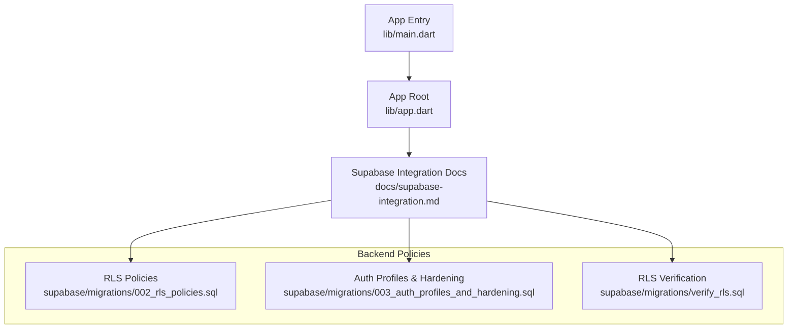
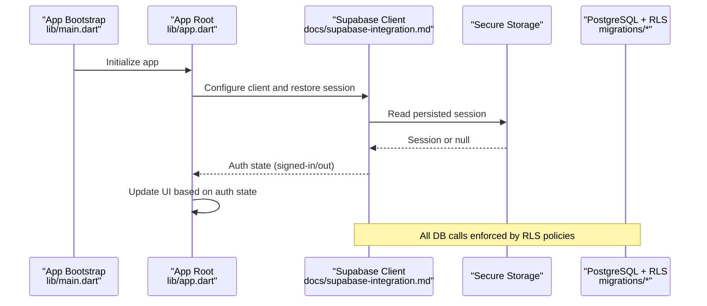
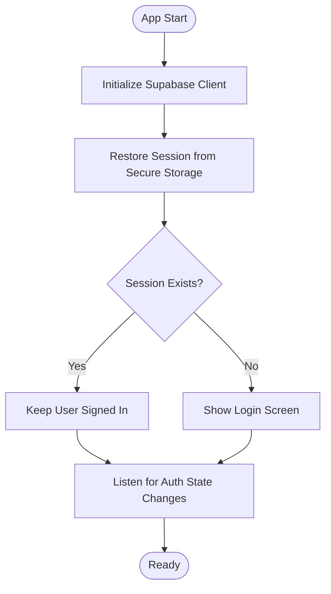
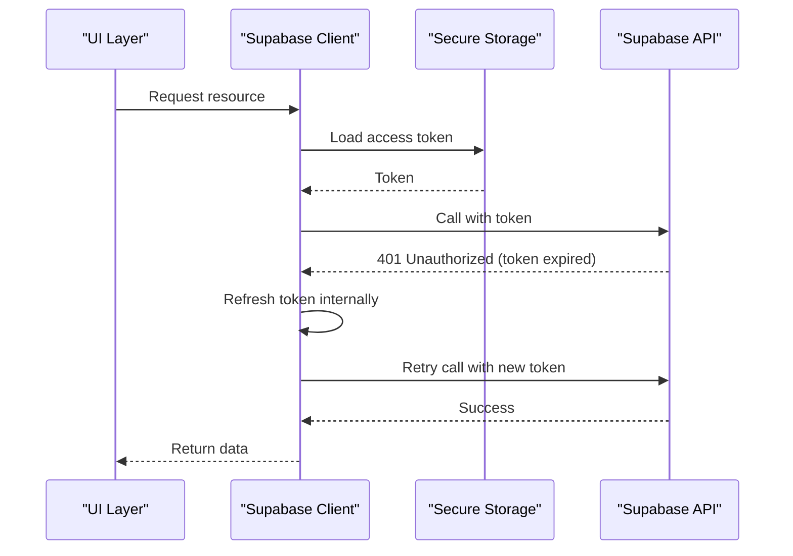
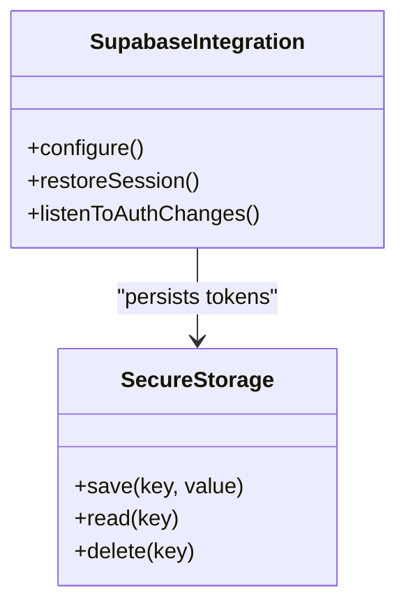
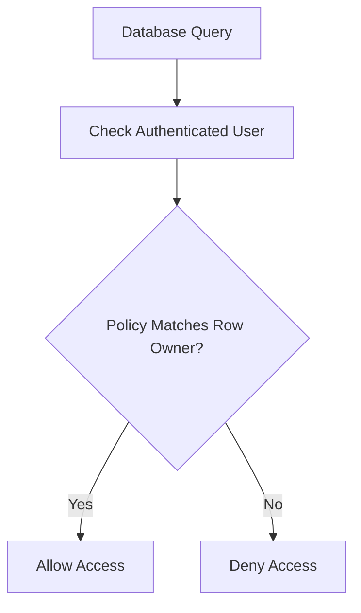
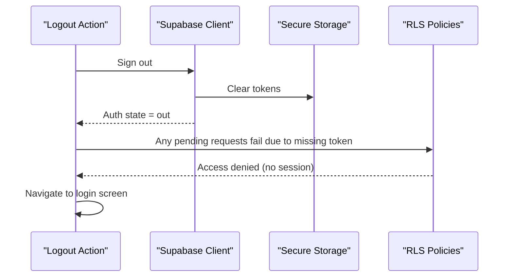
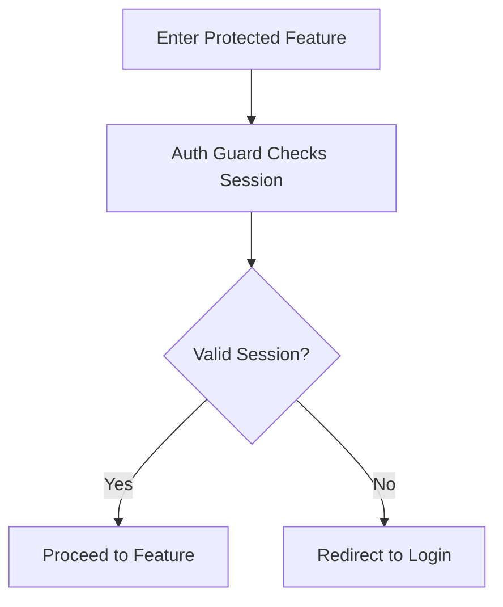
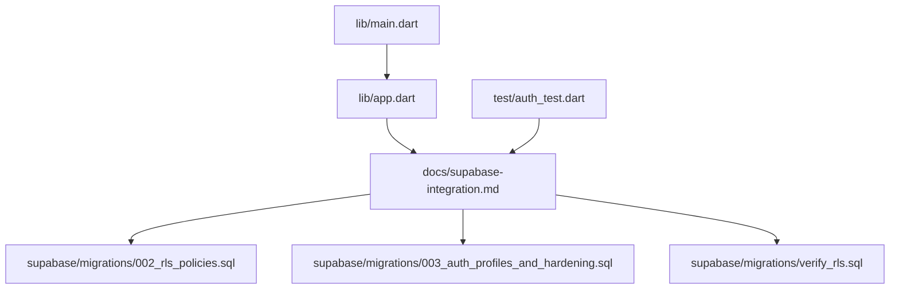

# Session Handling & Security

<cite>
**Referenced Files in This Document**
- [main.dart](file://lib/main.dart)
- [app.dart](file://lib/app.dart)
- [supabase-integration.md](file://docs/supabase-integration.md)
- [002_rls_policies.sql](file://supabase/migrations/002_rls_policies.sql)
- [003_auth_profiles_and_hardening.sql](file://supabase/migrations/003_auth_profiles_and_hardening.sql)
- [verify_rls.sql](file://supabase/migrations/verify_rls.sql)
- [auth_test.dart](file://test/auth_test.dart)
</cite>

## Table of Contents
1. [Introduction](#introduction)
2. [Project Structure](#project-structure)
3. [Core Components](#core-components)
4. [Architecture Overview](#architecture-overview)
5. [Detailed Component Analysis](#detailed-component-analysis)
6. [Dependency Analysis](#dependency-analysis)
7. [Performance Considerations](#performance-considerations)
8. [Troubleshooting Guide](#troubleshooting-guide)
9. [Conclusion](#conclusion)
10. [Appendices](#appendices)

## Introduction
This document explains how sessions and security are implemented across the application, focusing on token lifecycle management, automatic session refresh, secure storage mechanisms, and persistence across app restarts. It also documents Row-Level Security (RLS) policies, token validation, secure communication with Supabase, session timeout handling, logout procedures, and platform-specific secure storage integration. The goal is to provide a clear, code-sourced understanding of how authentication state flows through the app and how data access is protected.

## Project Structure
The project follows a Flutter architecture with feature-based organization under lib/features and shared utilities under lib/shared. Authentication and session-related logic is integrated at the application entry points and coordinated via shared services. Supabase configuration and RLS policies are defined in migrations and documentation artifacts.

**Diagram sources**
- [main.dart](file://lib/main.dart)
- [app.dart](file://lib/app.dart)
- [supabase-integration.md](file://docs/supabase-integration.md)
- [002_rls_policies.sql](file://supabase/migrations/002_rls_policies.sql)
- [003_auth_profiles_and_hardening.sql](file://supabase/migrations/003_auth_profiles_and_hardening.sql)
- [verify_rls.sql](file://supabase/migrations/verify_rls.sql)

**Section sources**
- [main.dart](file://lib/main.dart)
- [app.dart](file://lib/app.dart)
- [supabase-integration.md](file://docs/supabase-integration.md)

## Core Components
- Application bootstrap: Initializes core services and sets up the root widget tree.
- Supabase integration layer: Configures client options, manages auth state, and persists sessions.
- RLS policy definitions: Enforce row-level access control for authenticated users.
- Auth tests: Validate login, logout, and session behavior.

Key responsibilities:
- Initialize Supabase client with secure defaults.
- Restore session from persistent storage on app start.
- Handle token refresh automatically when needed.
- Apply RLS policies to protect user data.
- Provide logout flow that clears local tokens and resets UI state.

**Section sources**
- [main.dart](file://lib/main.dart)
- [app.dart](file://lib/app.dart)
- [supabase-integration.md](file://docs/supabase-integration.md)
- [002_rls_policies.sql](file://supabase/migrations/002_rls_policies.sql)
- [003_auth_profiles_and_hardening.sql](file://supabase/migrations/003_auth_profiles_and_hardening.sql)
- [verify_rls.sql](file://supabase/migrations/verify_rls.sql)
- [auth_test.dart](file://test/auth_test.dart)

## Architecture Overview
The session and security architecture centers around a Supabase client configured at app startup. The client restores any existing session from secure storage, listens for auth state changes, and triggers UI updates accordingly. All database queries are subject to RLS policies defined in migrations.

**Diagram sources**
- [main.dart](file://lib/main.dart)
- [app.dart](file://lib/app.dart)
- [supabase-integration.md](file://docs/supabase-integration.md)
- [002_rls_policies.sql](file://supabase/migrations/002_rls_policies.sql)
- [003_auth_profiles_and_hardening.sql](file://supabase/migrations/003_auth_profiles_and_hardening.sql)
- [verify_rls.sql](file://supabase/migrations/verify_rls.sql)

## Detailed Component Analysis

### Session Initialization and Restoration
- On app start, the initialization sequence configures the Supabase client and attempts to restore an existing session from secure storage.
- If a valid session exists, the client remains signed in; otherwise, the app shows the unauthenticated UI.
- Auth state listeners propagate sign-in/sign-out events to update UI components.

**Diagram sources**
- [main.dart](file://lib/main.dart)
- [app.dart](file://lib/app.dart)
- [supabase-integration.md](file://docs/supabase-integration.md)

**Section sources**
- [main.dart](file://lib/main.dart)
- [app.dart](file://lib/app.dart)
- [supabase-integration.md](file://docs/supabase-integration.md)

### Token Lifecycle Management and Automatic Refresh
- Tokens are stored securely and restored on app launch.
- The Supabase client handles token refresh automatically when tokens approach expiration.
- Auth state change streams notify the UI of refresh outcomes.

**Diagram sources**
- [supabase-integration.md](file://docs/supabase-integration.md)

**Section sources**
- [supabase-integration.md](file://docs/supabase-integration.md)

### Secure Storage Mechanisms and Cross-Platform Consistency
- Platform-specific secure storage backends are used to persist tokens safely.
- The integration layer abstracts storage details to ensure consistent behavior across Android, iOS, web, desktop.
- On first run, no session is present; after successful login, tokens are persisted and restored on subsequent launches.

**Diagram sources**
- [supabase-integration.md](file://docs/supabase-integration.md)

**Section sources**
- [supabase-integration.md](file://docs/supabase-integration.md)

### RLS Policies and Data Protection
- RLS policies enforce per-user data access at the database level.
- Policies restrict reads/writes to rows owned by the authenticated user.
- Verification scripts validate that policies are correctly applied.

**Diagram sources**
- [002_rls_policies.sql](file://supabase/migrations/002_rls_policies.sql)
- [003_auth_profiles_and_hardening.sql](file://supabase/migrations/003_auth_profiles_and_hardening.sql)
- [verify_rls.sql](file://supabase/migrations/verify_rls.sql)

**Section sources**
- [002_rls_policies.sql](file://supabase/migrations/002_rls_policies.sql)
- [003_auth_profiles_and_hardening.sql](file://supabase/migrations/003_auth_profiles_and_hardening.sql)
- [verify_rls.sql](file://supabase/migrations/verify_rls.sql)

### Logout Procedures and Session Timeout Handling
- Logout clears local tokens and resets UI state to unauthenticated.
- Session timeouts are handled by token expiration; the client refreshes tokens automatically where possible.
- When refresh fails, the user is redirected to login.

**Diagram sources**
- [supabase-integration.md](file://docs/supabase-integration.md)
- [002_rls_policies.sql](file://supabase/migrations/002_rls_policies.sql)

**Section sources**
- [supabase-integration.md](file://docs/supabase-integration.md)
- [002_rls_policies.sql](file://supabase/migrations/002_rls_policies.sql)

### Security Middleware and Validation
- Middleware-like guards check authentication before allowing access to protected routes or features.
- Token validation ensures only authenticated requests reach protected endpoints.
- RLS policies act as server-side middleware enforcing data access rules.

**Diagram sources**
- [app.dart](file://lib/app.dart)
- [supabase-integration.md](file://docs/supabase-integration.md)

**Section sources**
- [app.dart](file://lib/app.dart)
- [supabase-integration.md](file://docs/supabase-integration.md)

### Concrete Examples from Codebase
- Session initialization: See the app bootstrap and root setup files for client configuration and session restoration.
- Token refresh logic: Refer to the Supabase integration documentation for automatic refresh behavior.
- Security middleware: Review the app routing and guards for session checks.
- RLS policies: Inspect migration files defining row-level access controls.
- Auth tests: Use the test suite to verify login/logout and session persistence behaviors.

**Section sources**
- [main.dart](file://lib/main.dart)
- [app.dart](file://lib/app.dart)
- [supabase-integration.md](file://docs/supabase-integration.md)
- [002_rls_policies.sql](file://supabase/migrations/002_rls_policies.sql)
- [003_auth_profiles_and_hardening.sql](file://supabase/migrations/003_auth_profiles_and_hardening.sql)
- [verify_rls.sql](file://supabase/migrations/verify_rls.sql)
- [auth_test.dart](file://test/auth_test.dart)

## Dependency Analysis
The following diagram maps key dependencies between application entry points, Supabase integration, and backend security policies.

**Diagram sources**
- [main.dart](file://lib/main.dart)
- [app.dart](file://lib/app.dart)
- [supabase-integration.md](file://docs/supabase-integration.md)
- [002_rls_policies.sql](file://supabase/migrations/002_rls_policies.sql)
- [003_auth_profiles_and_hardening.sql](file://supabase/migrations/003_auth_profiles_and_hardening.sql)
- [verify_rls.sql](file://supabase/migrations/verify_rls.sql)
- [auth_test.dart](file://test/auth_test.dart)

**Section sources**
- [main.dart](file://lib/main.dart)
- [app.dart](file://lib/app.dart)
- [supabase-integration.md](file://docs/supabase-integration.md)
- [002_rls_policies.sql](file://supabase/migrations/002_rls_policies.sql)
- [003_auth_profiles_and_hardening.sql](file://supabase/migrations/003_auth_profiles_and_hardening.sql)
- [verify_rls.sql](file://supabase/migrations/verify_rls.sql)
- [auth_test.dart](file://test/auth_test.dart)

## Performance Considerations
- Minimize unnecessary re-authentication by restoring sessions promptly at startup.
- Avoid redundant network calls by leveraging cached tokens and relying on automatic refresh.
- Ensure RLS policies are efficient to reduce query overhead.
- Debounce rapid auth state changes to prevent excessive UI rebuilds.

[No sources needed since this section provides general guidance]

## Troubleshooting Guide
Common issues and resolutions:
- Session not restored after restart: Verify secure storage permissions and keys; confirm restoration logic runs during app bootstrap.
- Frequent logouts: Check token refresh behavior and network connectivity; ensure refresh hooks are active.
- Permission denied errors: Confirm RLS policies match expected user ownership; run verification scripts to validate policies.
- Login loop: Inspect guard logic and redirect paths; ensure proper error handling for failed refresh.

**Section sources**
- [supabase-integration.md](file://docs/supabase-integration.md)
- [002_rls_policies.sql](file://supabase/migrations/002_rls_policies.sql)
- [verify_rls.sql](file://supabase/migrations/verify_rls.sql)
- [auth_test.dart](file://test/auth_test.dart)

## Conclusion
The application implements robust session management and security by integrating Supabase with secure storage, automatic token refresh, and strict RLS policies. The architecture ensures cross-platform consistency, protects user data at the database level, and provides clear logout and timeout handling. Following the documented patterns and best practices will maintain a secure and reliable authentication experience.

[No sources needed since this section summarizes without analyzing specific files]

## Appendices

### Security Best Practices Checklist
- Always initialize Supabase client with secure defaults.
- Persist tokens using platform-specific secure storage.
- Implement auth guards for all protected routes.
- Define and verify RLS policies for every table containing sensitive data.
- Handle token expiration gracefully with automatic refresh and fallback to login.
- Log minimal, non-sensitive diagnostics for troubleshooting.

[No sources needed since this section provides general guidance]