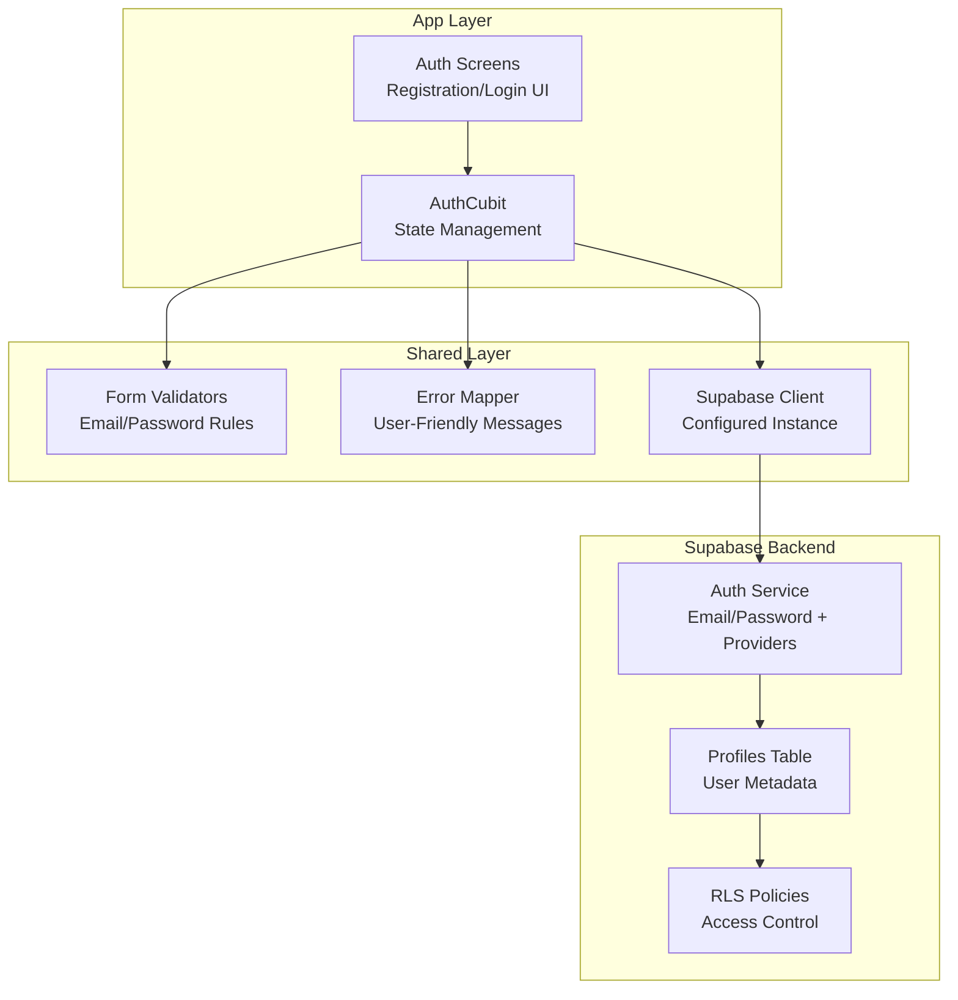
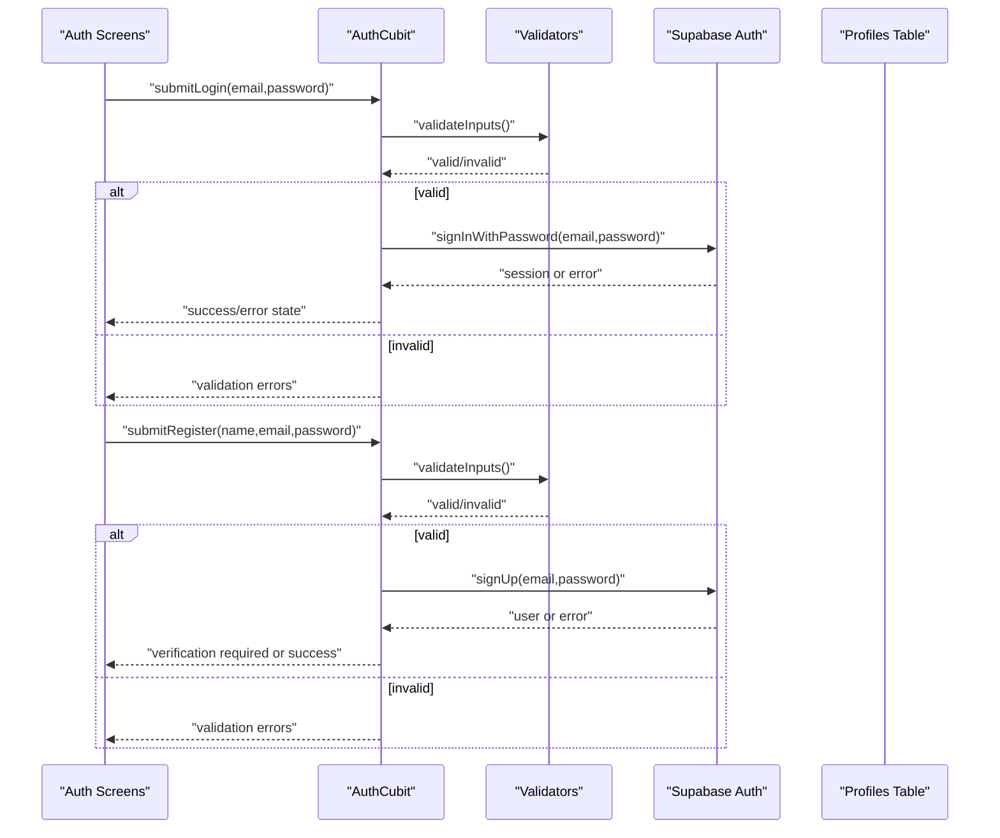
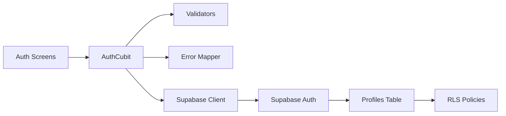

# User Registration & Login

<cite>
**Referenced Files in This Document**
- [003_auth_profiles_and_hardening.sql](file://supabase/migrations/003_auth_profiles_and_hardening.sql)
- [002_rls_policies.sql](file://supabase/migrations/002_rls_policies.sql)
- [supabase-integration.md](file://docs/supabase-integration.md)
- [auth_test.dart](file://test/auth_test.dart)
</cite>

## Table of Contents
1. [Introduction](#introduction)
2. [Project Structure](#project-structure)
3. [Core Components](#core-components)
4. [Architecture Overview](#architecture-overview)
5. [Detailed Component Analysis](#detailed-component-analysis)
6. [Dependency Analysis](#dependency-analysis)
7. [Performance Considerations](#performance-considerations)
8. [Troubleshooting Guide](#troubleshooting-guide)
9. [Conclusion](#conclusion)

## Introduction
This document explains user registration and login functionality for the application, focusing on email/password authentication, form validation, error handling, and session management via Supabase Auth. It also covers the database schema for user profiles, Row-Level Security (RLS) policies, and security hardening measures. The guide includes concrete references to code locations and tests so you can trace implementation details directly.

## Project Structure
The authentication feature is implemented across features, shared utilities, and Supabase configuration:
- Feature layer: UI screens and Cubit state management for auth flows
- Shared layer: reusable validators, error mapping, and Supabase client setup
- Database layer: migrations defining user profiles, RLS policies, and security hardening

[No sources needed since this diagram shows conceptual workflow, not actual code structure]

## Core Components
- AuthCubit: Manages loading states, success responses, and error scenarios for registration and login. Emits distinct states for idle, loading, success, and error conditions.
- Form Validation: Centralized validators enforce email format, password strength, and confirmation matching before submission.
- Error Handling: Maps backend errors to user-friendly messages and displays contextual feedback in the UI.
- Session Management: Uses Supabase Auth to persist sessions and maintain authenticated state across app restarts.

Key responsibilities:
- Registration flow: validate inputs, call Supabase sign up, handle verification status, and navigate on success.
- Login flow: validate credentials, call Supabase sign in, manage session persistence, and route to protected screens.
- Error scenarios: network failures, invalid credentials, account already exists, unverified email, and rate limiting.

**Section sources**
- [auth_test.dart](file://test/auth_test.dart)

## Architecture Overview
The authentication architecture follows a layered approach:
- UI triggers actions in AuthCubit
- AuthCubit orchestrates validation and calls Supabase Auth
- Supabase Auth handles credential verification and session management
- RLS policies secure profile data at the database level

[No sources needed since this diagram shows conceptual workflow, not actual code structure]

## Detailed Component Analysis

### AuthCubit State Management
Responsibilities:
- Maintain state for loading, success, and error conditions
- Coordinate validation and API calls
- Emit events to update UI

Common states:
- Idle: initial state before any action
- Loading: during network requests
- Success: after successful operation
- Error: when an operation fails

Patterns:
- Use immutable state objects
- Separate concerns between validation and API calls
- Map backend errors to user-friendly messages

**Section sources**
- [auth_test.dart](file://test/auth_test.dart)

### Email/Password Authentication Flow
Registration:
- Validate email format and password strength
- Call Supabase signUp
- Handle verification requirement and navigation

Login:
- Validate credentials
- Call Supabase signInWithPassword
- Persist session and navigate to protected routes

Error handling:
- Invalid credentials
- Account already exists
- Unverified email
- Network errors

**Section sources**
- [auth_test.dart](file://test/auth_test.dart)

### Form Validation Rules
Validation checks:
- Email format and uniqueness hints
- Password complexity requirements
- Password confirmation matching
- Required fields presence

Implementation patterns:
- Centralized validator functions
- Real-time field-level feedback
- Aggregated error display

**Section sources**
- [auth_test.dart](file://test/auth_test.dart)

### Error Handling and User Feedback
Strategies:
- Map Supabase error codes to localized messages
- Display inline field errors and global banners
- Retry logic for transient network failures

Common errors:
- Network connectivity issues
- Rate limiting and throttling
- Server-side validation failures

**Section sources**
- [auth_test.dart](file://test/auth_test.dart)

### Session Management with Supabase Auth
Features:
- Automatic session persistence across app restarts
- Token refresh and expiration handling
- Sign out and cleanup procedures

Integration points:
- Initialize Supabase client early in app lifecycle
- Listen to auth state changes
- Guard protected routes based on session state

**Section sources**
- [supabase-integration.md](file://docs/supabase-integration.md)

## Dependency Analysis
Authentication depends on:
- Supabase client configuration
- Validator utilities
- Navigation and routing
- Localization for error messages

[No sources needed since this diagram shows conceptual workflow, not actual code structure]

**Section sources**
- [supabase-integration.md](file://docs/supabase-integration.md)

## Performance Considerations
- Debounce input validation to reduce unnecessary computations
- Cache validation results per field where appropriate
- Avoid redundant API calls by debouncing submit actions
- Use efficient state updates in Cubit to minimize rebuilds

[No sources needed since this section provides general guidance]

## Troubleshooting Guide
Common issues and resolutions:
- Invalid credentials: verify email and password, check for typos
- Account already exists: prompt user to sign in instead
- Unverified email: send verification link and instruct user to check inbox
- Network errors: retry mechanism and clear error messaging
- Rate limiting: inform user to wait and try again later

Debugging tips:
- Enable Supabase logging in development
- Inspect Cubit state transitions
- Verify RLS policies are correctly configured

**Section sources**
- [auth_test.dart](file://test/auth_test.dart)

## Conclusion
The authentication system combines robust form validation, clear state management, and secure session handling through Supabase Auth. With well-defined error handling and RLS policies, it provides a reliable foundation for user registration and login. Follow the referenced sections to understand implementation details and extend functionality as needed.