# Checkout & Payment

<cite>
**Referenced Files in This Document**
- [README.md](file://README.md)
- [supabase/functions/checkout/index.ts](file://supabase/functions/checkout/index.ts)
- [supabase/functions/paymob-auth/index.ts](file://supabase/functions/paymob-auth/index.ts)
- [supabase/functions/paymob-callback/index.ts](file://supabase/functions/paymob-callback/index.ts)
- [supabase/functions/paymob-initiate/index.ts](file://supabase/functions/paymob-initiate/index.ts)
- [supabase/functions/paymob-order/index.ts](file://supabase/functions/paymob-order/index.ts)
- [supabase/functions/paymob-payment-key/index.ts](file://supabase/functions/paymob-payment-key/index.ts)
- [supabase/functions/send-order-notification/index.ts](file://supabase/functions/send-order-notification/index.ts)
- [supabase/migrations/001_initial_schema.sql](file://supabase/migrations/001_initial_schema.sql)
- [supabase/migrations/006_payments_table.sql](file://supabase/migrations/006_payments_table.sql)
- [supabase/migrations/008_order_fulfillment.sql](file://supabase/migrations/008_order_fulfillment.sql)
- [supabase/migrations/009_shipping_zones.sql](file://supabase/migrations/009_shipping_zones.sql)
- [supabase/migrations/011_orders_idempotency_and_expiry.sql](file://supabase/migrations/011_orders_idempotency_and_expiry.sql)
- [lib/main.dart](file://lib/main.dart)
- [test/payment_integration_test.dart](file://test/payment_integration_test.dart)
- [test/payment_test.dart](file://test/payment_test.dart)
</cite>

## Table of Contents
1. [Introduction](#introduction)
2. [Project Structure](#project-structure)
3. [Core Components](#core-components)
4. [Architecture Overview](#architecture-overview)
5. [Detailed Component Analysis](#detailed-component-analysis)
6. [Dependency Analysis](#dependency-analysis)
7. [Performance Considerations](#performance-considerations)
8. [Security and Compliance](#security-and-compliance)
9. [Troubleshooting Guide](#troubleshooting-guide)
10. [Conclusion](#conclusion)
11. [Appendices](#appendices)

## Introduction
This document explains the checkout and payment processing system, focusing on the end-to-end flow from address selection to order confirmation using Paymob as the payment gateway. It covers:
- Complete checkout flow including address management, shipping options, and order creation
- Payment initiation with Paymob via serverless functions
- Callback handling for payment result verification
- Database schema for payments, orders, and fulfillment tracking
- Error handling for failed payments, refund processing, and reconciliation
- Security best practices and PCI compliance considerations
- Testing strategies and monitoring success rates

The implementation uses a Flutter frontend that delegates sensitive operations to Supabase Edge Functions, which interact with Paymob APIs and persist state in Supabase Postgres.

## Project Structure
The checkout and payment features are implemented primarily through:
- Supabase Edge Functions for secure backend logic (authentication, payment initiation, callback handling, order creation)
- Supabase migrations defining the database schema for orders, payments, shipping zones, and fulfillment
- Flutter app entry point and tests validating integration behavior

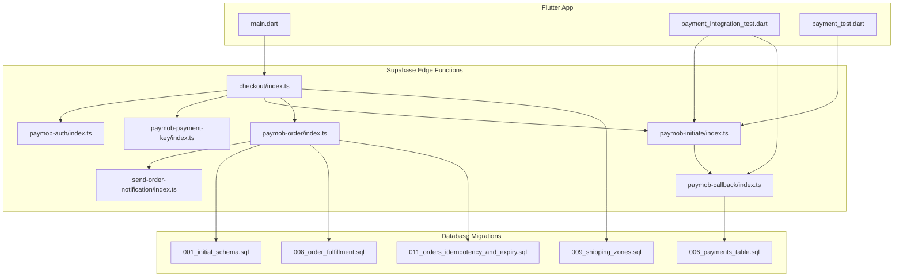

**Diagram sources**
- [lib/main.dart](file://lib/main.dart)
- [supabase/functions/checkout/index.ts](file://supabase/functions/checkout/index.ts)
- [supabase/functions/paymob-auth/index.ts](file://supabase/functions/paymob-auth/index.ts)
- [supabase/functions/paymob-payment-key/index.ts](file://supabase/functions/paymob-payment-key/index.ts)
- [supabase/functions/paymob-initiate/index.ts](file://supabase/functions/paymob-initiate/index.ts)
- [supabase/functions/paymob-order/index.ts](file://supabase/functions/paymob-order/index.ts)
- [supabase/functions/paymob-callback/index.ts](file://supabase/functions/paymob-callback/index.ts)
- [supabase/functions/send-order-notification/index.ts](file://supabase/functions/send-order-notification/index.ts)
- [supabase/migrations/001_initial_schema.sql](file://supabase/migrations/001_initial_schema.sql)
- [supabase/migrations/006_payments_table.sql](file://supabase/migrations/006_payments_table.sql)
- [supabase/migrations/008_order_fulfillment.sql](file://supabase/migrations/008_order_fulfillment.sql)
- [supabase/migrations/009_shipping_zones.sql](file://supabase/migrations/009_shipping_zones.sql)
- [supabase/migrations/011_orders_idempotency_and_expiry.sql](file://supabase/migrations/011_orders_idempotency_and_expiry.sql)

**Section sources**
- [README.md](file://README.md)
- [lib/main.dart](file://lib/main.dart)

## Core Components
- Checkout orchestration function coordinates authentication, payment key retrieval, order creation, and payment initiation.
- Paymob-specific functions handle:
  - Authentication and token acquisition
  - Payment key generation
  - Order creation and linking to transactions
  - Callback verification and state updates
- Database schema defines entities for orders, payments, shipping zones, and fulfillment tracking.
- Tests validate integration paths for initiating payments and handling callbacks.

Key responsibilities:
- Securely obtain Paymob credentials and tokens server-side
- Create idempotent orders with expiry handling
- Initiate Paymob payment sessions and return client-facing URLs/tokens
- Verify callbacks and update payment/order status
- Persist payment records and fulfillments

**Section sources**
- [supabase/functions/checkout/index.ts](file://supabase/functions/checkout/index.ts)
- [supabase/functions/paymob-auth/index.ts](file://supabase/functions/paymob-auth/index.ts)
- [supabase/functions/paymob-payment-key/index.ts](file://supabase/functions/paymob-payment-key/index.ts)
- [supabase/functions/paymob-initiate/index.ts](file://supabase/functions/paymob-initiate/index.ts)
- [supabase/functions/paymob-order/index.ts](file://supabase/functions/paymob-order/index.ts)
- [supabase/functions/paymob-callback/index.ts](file://supabase/functions/paymob-callback/index.ts)
- [supabase/migrations/001_initial_schema.sql](file://supabase/migrations/001_initial_schema.sql)
- [supabase/migrations/006_payments_table.sql](file://supabase/migrations/006_payments_table.sql)
- [supabase/migrations/008_order_fulfillment.sql](file://supabase/migrations/008_order_fulfillment.sql)
- [supabase/migrations/009_shipping_zones.sql](file://supabase/migrations/009_shipping_zones.sql)
- [supabase/migrations/011_orders_idempotency_and_expiry.sql](file://supabase/migrations/011_orders_idempotency_and_expiry.sql)

## Architecture Overview
The architecture follows a secure-by-design pattern where sensitive operations occur in serverless functions. The Flutter app orchestrates user interactions and calls Edge Functions to perform authenticated requests to Paymob and persist data in Supabase.

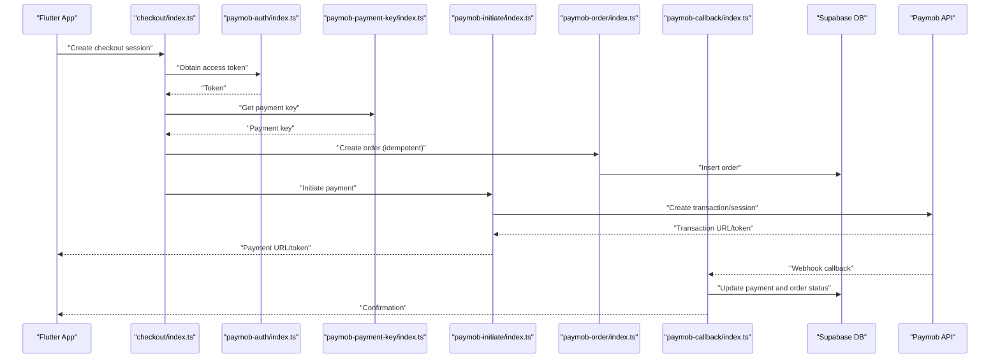

**Diagram sources**
- [supabase/functions/checkout/index.ts](file://supabase/functions/checkout/index.ts)
- [supabase/functions/paymob-auth/index.ts](file://supabase/functions/paymob-auth/index.ts)
- [supabase/functions/paymob-payment-key/index.ts](file://supabase/functions/paymob-payment-key/index.ts)
- [supabase/functions/paymob-initiate/index.ts](file://supabase/functions/paymob-initiate/index.ts)
- [supabase/functions/paymob-order/index.ts](file://supabase/functions/paymob-order/index.ts)
- [supabase/functions/paymob-callback/index.ts](file://supabase/functions/paymob-callback/index.ts)

## Detailed Component Analysis

### Checkout Orchestration
Responsibilities:
- Coordinate authentication, payment key retrieval, order creation, and payment initiation
- Validate inputs and ensure idempotency
- Return client-ready payment information

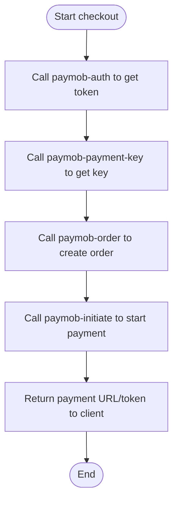

**Diagram sources**
- [supabase/functions/checkout/index.ts](file://supabase/functions/checkout/index.ts)
- [supabase/functions/paymob-auth/index.ts](file://supabase/functions/paymob-auth/index.ts)
- [supabase/functions/paymob-payment-key/index.ts](file://supabase/functions/paymob-payment-key/index.ts)
- [supabase/functions/paymob-order/index.ts](file://supabase/functions/paymob-order/index.ts)
- [supabase/functions/paymob-initiate/index.ts](file://supabase/functions/paymob-initiate/index.ts)

**Section sources**
- [supabase/functions/checkout/index.ts](file://supabase/functions/checkout/index.ts)

### Paymob Authentication
Responsibilities:
- Obtain an access token from Paymob using stored credentials
- Provide a reusable token for subsequent API calls

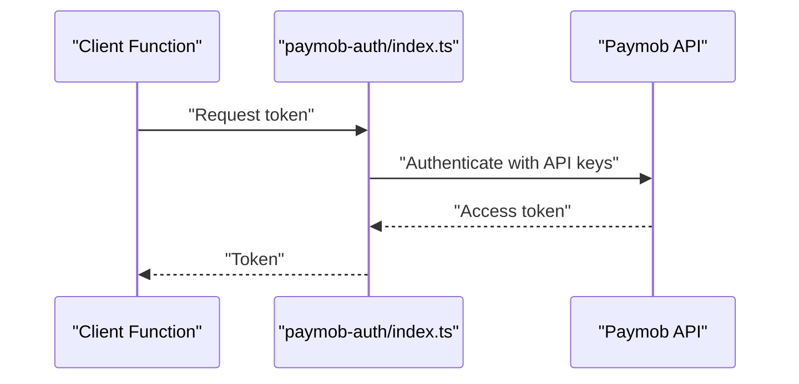

**Diagram sources**
- [supabase/functions/paymob-auth/index.ts](file://supabase/functions/paymob-auth/index.ts)

**Section sources**
- [supabase/functions/paymob-auth/index.ts](file://supabase/functions/paymob-auth/index.ts)

### Payment Key Retrieval
Responsibilities:
- Retrieve a one-time payment key required by Paymob for initiating transactions
- Ensure key freshness and validity

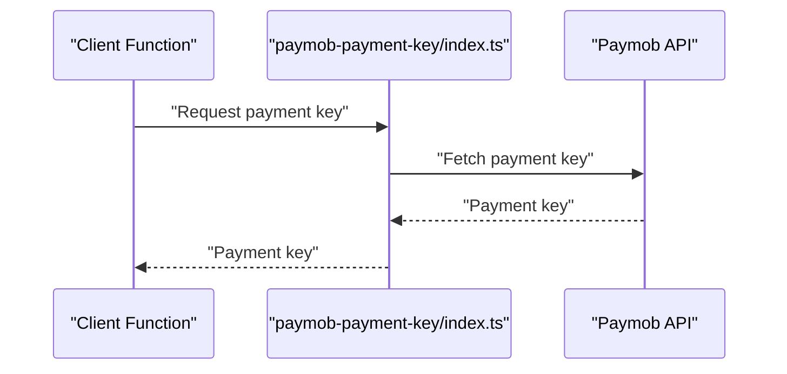

**Diagram sources**
- [supabase/functions/paymob-payment-key/index.ts](file://supabase/functions/paymob-payment-key/index.ts)

**Section sources**
- [supabase/functions/paymob-payment-key/index.ts](file://supabase/functions/paymob-payment-key/index.ts)

### Order Creation
Responsibilities:
- Create an order record with idempotency guarantees
- Link order to shipping zone and totals
- Enforce order expiry policies

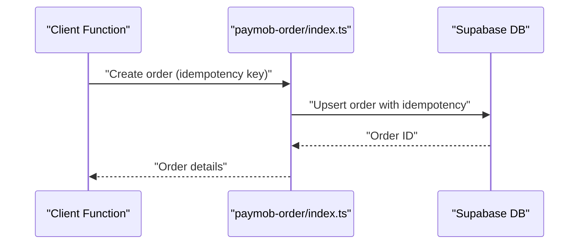

**Diagram sources**
- [supabase/functions/paymob-order/index.ts](file://supabase/functions/paymob-order/index.ts)
- [supabase/migrations/011_orders_idempotency_and_expiry.sql](file://supabase/migrations/011_orders_idempotency_and_expiry.sql)

**Section sources**
- [supabase/functions/paymob-order/index.ts](file://supabase/functions/paymob-order/index.ts)
- [supabase/migrations/011_orders_idempotency_and_expiry.sql](file://supabase/migrations/011_orders_idempotency_and_expiry.sql)

### Payment Initiation
Responsibilities:
- Initialize a Paymob transaction using the obtained token and payment key
- Associate transaction with the created order
- Return client-facing payment URL or token

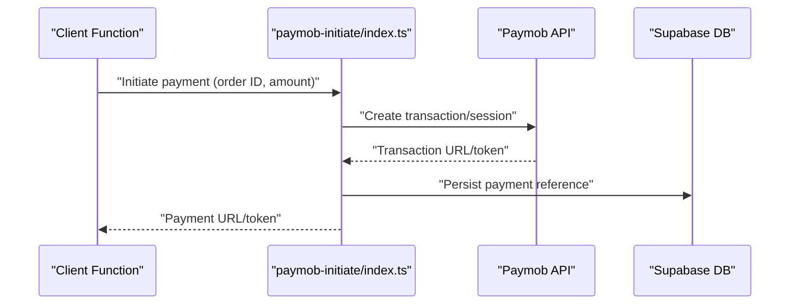

**Diagram sources**
- [supabase/functions/paymob-initiate/index.ts](file://supabase/functions/paymob-initiate/index.ts)
- [supabase/migrations/006_payments_table.sql](file://supabase/migrations/006_payments_table.sql)

**Section sources**
- [supabase/functions/paymob-initiate/index.ts](file://supabase/functions/paymob-initiate/index.ts)
- [supabase/migrations/006_payments_table.sql](file://supabase/migrations/006_payments_table.sql)

### Callback Handling
Responsibilities:
- Receive and verify Paymob webhook callbacks
- Update payment and order statuses atomically
- Handle retries and idempotency

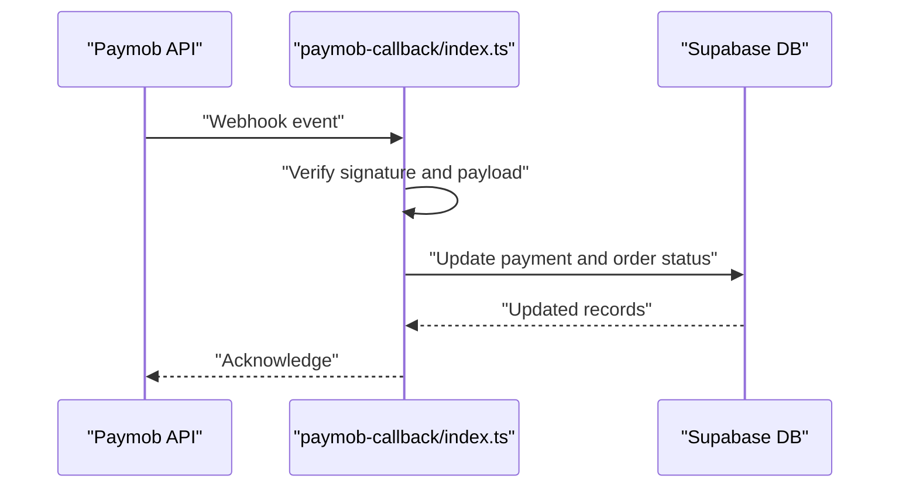

**Diagram sources**
- [supabase/functions/paymob-callback/index.ts](file://supabase/functions/paymob-callback/index.ts)
- [supabase/migrations/006_payments_table.sql](file://supabase/migrations/006_payments_table.sql)

**Section sources**
- [supabase/functions/paymob-callback/index.ts](file://supabase/functions/paymob-callback/index.ts)
- [supabase/migrations/006_payments_table.sql](file://supabase/migrations/006_payments_table.sql)

### Shipping Zones
Responsibilities:
- Define shipping zones and associated costs
- Support dynamic shipping option calculation during checkout

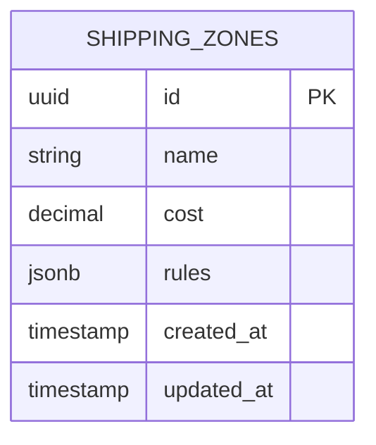

**Diagram sources**
- [supabase/migrations/009_shipping_zones.sql](file://supabase/migrations/009_shipping_zones.sql)

**Section sources**
- [supabase/migrations/009_shipping_zones.sql](file://supabase/migrations/009_shipping_zones.sql)

### Order Fulfillment Tracking
Responsibilities:
- Track fulfillment lifecycle from creation to completion
- Record status transitions and timestamps

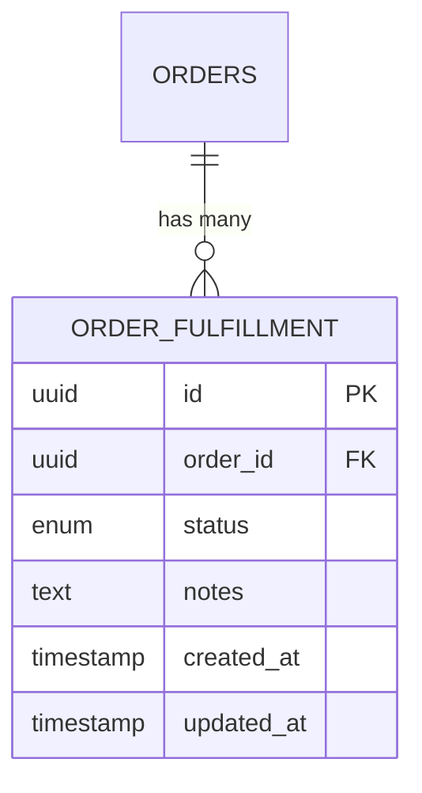

**Diagram sources**
- [supabase/migrations/008_order_fulfillment.sql](file://supabase/migrations/008_order_fulfillment.sql)

**Section sources**
- [supabase/migrations/008_order_fulfillment.sql](file://supabase/migrations/008_order_fulfillment.sql)

### Payments Schema
Responsibilities:
- Store payment references, amounts, currency, and status
- Link payments to orders and external transaction IDs

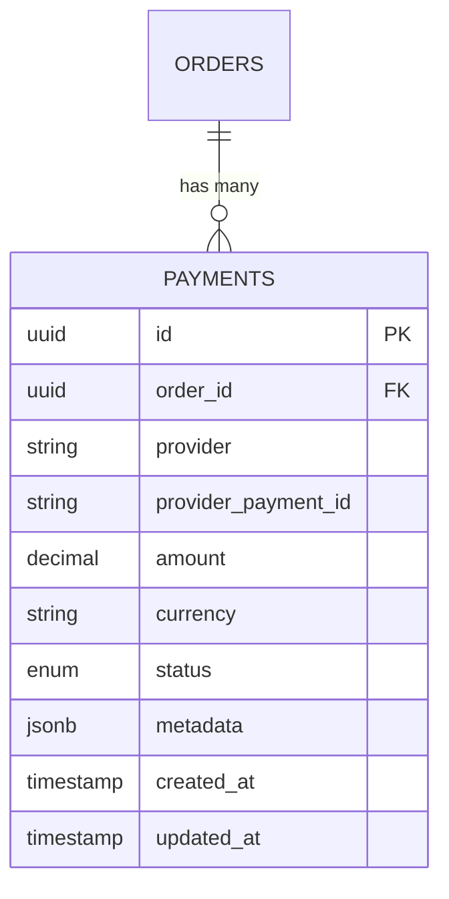

**Diagram sources**
- [supabase/migrations/006_payments_table.sql](file://supabase/migrations/006_payments_table.sql)

**Section sources**
- [supabase/migrations/006_payments_table.sql](file://supabase/migrations/006_payments_table.sql)

### Orders Schema and Idempotency
Responsibilities:
- Define core order fields and relationships
- Implement idempotency keys and expiry handling to prevent duplicate charges

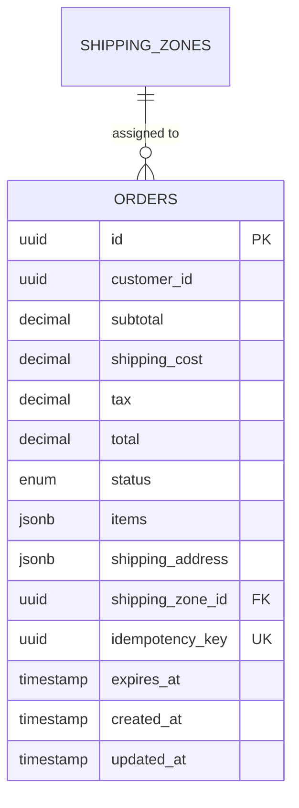

**Diagram sources**
- [supabase/migrations/001_initial_schema.sql](file://supabase/migrations/001_initial_schema.sql)
- [supabase/migrations/011_orders_idempotency_and_expiry.sql](file://supabase/migrations/011_orders_idempotency_and_expiry.sql)

**Section sources**
- [supabase/migrations/001_initial_schema.sql](file://supabase/migrations/001_initial_schema.sql)
- [supabase/migrations/011_orders_idempotency_and_expiry.sql](file://supabase/migrations/011_orders_idempotency_and_expiry.sql)

### Notification Dispatch
Responsibilities:
- Send order notifications upon successful payment and order creation

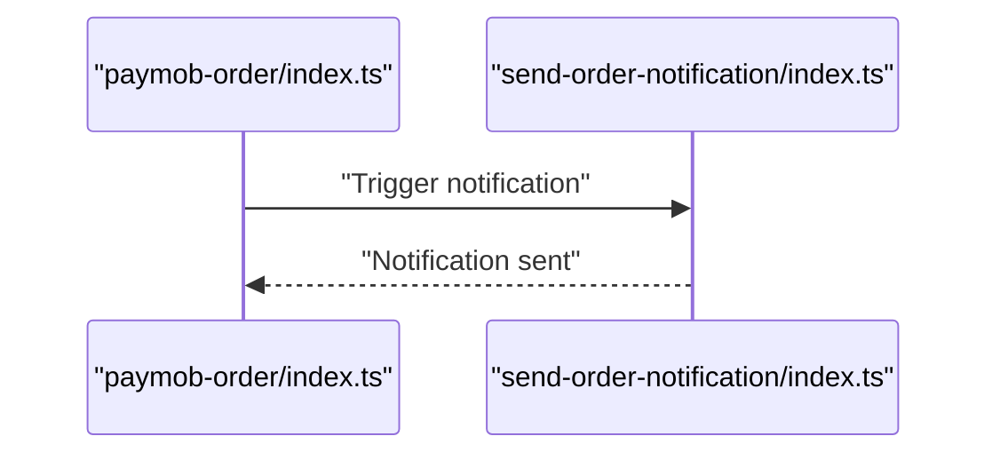

**Diagram sources**
- [supabase/functions/paymob-order/index.ts](file://supabase/functions/paymob-order/index.ts)
- [supabase/functions/send-order-notification/index.ts](file://supabase/functions/send-order-notification/index.ts)

**Section sources**
- [supabase/functions/paymob-order/index.ts](file://supabase/functions/paymob-order/index.ts)
- [supabase/functions/send-order-notification/index.ts](file://supabase/functions/send-order-notification/index.ts)

## Dependency Analysis
The checkout flow depends on multiple Edge Functions and database migrations. The following diagram shows functional dependencies and data persistence points.

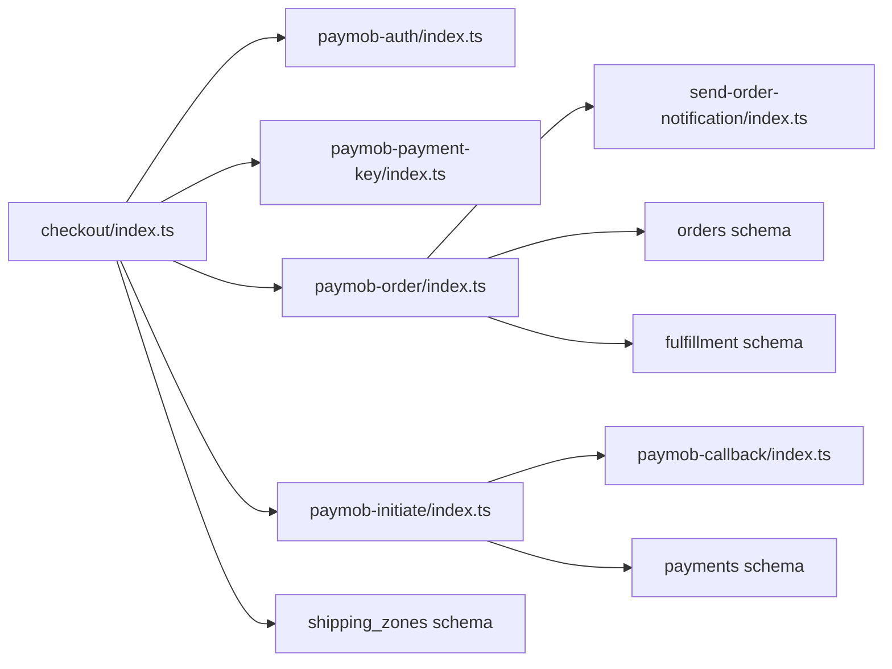

**Diagram sources**
- [supabase/functions/checkout/index.ts](file://supabase/functions/checkout/index.ts)
- [supabase/functions/paymob-auth/index.ts](file://supabase/functions/paymob-auth/index.ts)
- [supabase/functions/paymob-payment-key/index.ts](file://supabase/functions/paymob-payment-key/index.ts)
- [supabase/functions/paymob-initiate/index.ts](file://supabase/functions/paymob-initiate/index.ts)
- [supabase/functions/paymob-order/index.ts](file://supabase/functions/paymob-order/index.ts)
- [supabase/functions/paymob-callback/index.ts](file://supabase/functions/paymob-callback/index.ts)
- [supabase/functions/send-order-notification/index.ts](file://supabase/functions/send-order-notification/index.ts)
- [supabase/migrations/001_initial_schema.sql](file://supabase/migrations/001_initial_schema.sql)
- [supabase/migrations/006_payments_table.sql](file://supabase/migrations/006_payments_table.sql)
- [supabase/migrations/008_order_fulfillment.sql](file://supabase/migrations/008_order_fulfillment.sql)
- [supabase/migrations/009_shipping_zones.sql](file://supabase/migrations/009_shipping_zones.sql)

**Section sources**
- [supabase/functions/checkout/index.ts](file://supabase/functions/checkout/index.ts)
- [supabase/migrations/001_initial_schema.sql](file://supabase/migrations/001_initial_schema.sql)
- [supabase/migrations/006_payments_table.sql](file://supabase/migrations/006_payments_table.sql)
- [supabase/migrations/008_order_fulfillment.sql](file://supabase/migrations/008_order_fulfillment.sql)
- [supabase/migrations/009_shipping_zones.sql](file://supabase/migrations/009_shipping_zones.sql)

## Performance Considerations
- Prefer idempotent order creation to avoid duplicate charges and reduce retry overhead.
- Cache Paymob tokens and payment keys within short TTLs at the function level to minimize network calls.
- Use batched updates for order and payment status changes when possible.
- Keep payloads minimal; store only necessary metadata in JSONB fields.
- Monitor function execution times and database query latency; optimize indexes on frequently queried columns such as order_id and provider_payment_id.

[No sources needed since this section provides general guidance]

## Security and Compliance
- Never expose Paymob secrets in the Flutter app; all sensitive operations must run in Edge Functions.
- Validate and sign callbacks to prevent tampering; reject malformed or unsigned events.
- Enforce least privilege for database access via Row Level Security policies.
- Avoid logging sensitive payment data; redact tokens, card details, and PII.
- Use HTTPS-only endpoints and enforce strict input validation on all parameters.
- Follow PCI DSS guidelines by delegating card data handling to Paymob’s hosted flows and avoiding storage of PAN or CVV.

[No sources needed since this section provides general guidance]

## Troubleshooting Guide
Common issues and resolutions:
- Failed payment due to invalid token or expired session:
  - Re-authenticate via paymob-auth and re-fetch payment key before initiating payment.
- Duplicate orders:
  - Ensure idempotency keys are unique per checkout attempt and persisted correctly.
- Callback not received:
  - Verify webhook endpoint configuration and signature verification logic.
- Insufficient funds or declined cards:
  - Surface clear error messages to users and allow retry with different payment methods.
- Refund processing:
  - Implement server-side refund calls to Paymob and update payment status accordingly.
- Transaction reconciliation:
  - Periodically reconcile local payments table with Paymob transaction states using provider_payment_id.

Testing strategies:
- Use integration tests to simulate payment initiation and callback flows.
- Mock Paymob responses for edge cases like timeouts and partial failures.
- Validate idempotency by sending duplicate requests and asserting single order creation.

**Section sources**
- [test/payment_integration_test.dart](file://test/payment_integration_test.dart)
- [test/payment_test.dart](file://test/payment_test.dart)

## Conclusion
The checkout and payment system leverages secure serverless functions to integrate with Paymob while maintaining robust order and payment tracking in Supabase. By enforcing idempotency, verifying callbacks, and adhering to security best practices, the system ensures reliable and compliant payment processing. Continuous testing and monitoring will help maintain high success rates and rapid issue resolution.

[No sources needed since this section summarizes without analyzing specific files]

## Appendices

### Example Flows from Codebase
- Payment initiation example path:
  - [supabase/functions/paymob-initiate/index.ts](file://supabase/functions/paymob-initiate/index.ts)
- Callback processing example path:
  - [supabase/functions/paymob-callback/index.ts](file://supabase/functions/paymob-callback/index.ts)
- Order creation example path:
  - [supabase/functions/paymob-order/index.ts](file://supabase/functions/paymob-order/index.ts)

**Section sources**
- [supabase/functions/paymob-initiate/index.ts](file://supabase/functions/paymob-initiate/index.ts)
- [supabase/functions/paymob-callback/index.ts](file://supabase/functions/paymob-callback/index.ts)
- [supabase/functions/paymob-order/index.ts](file://supabase/functions/paymob-order/index.ts)