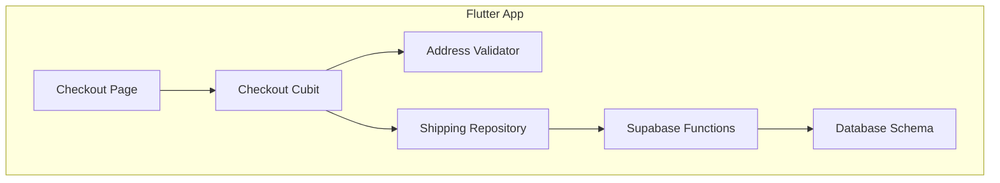
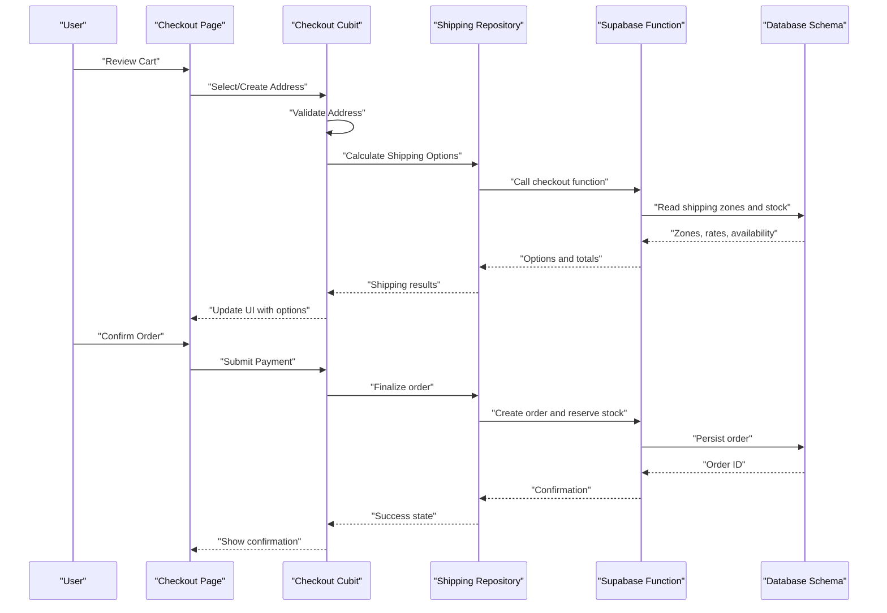
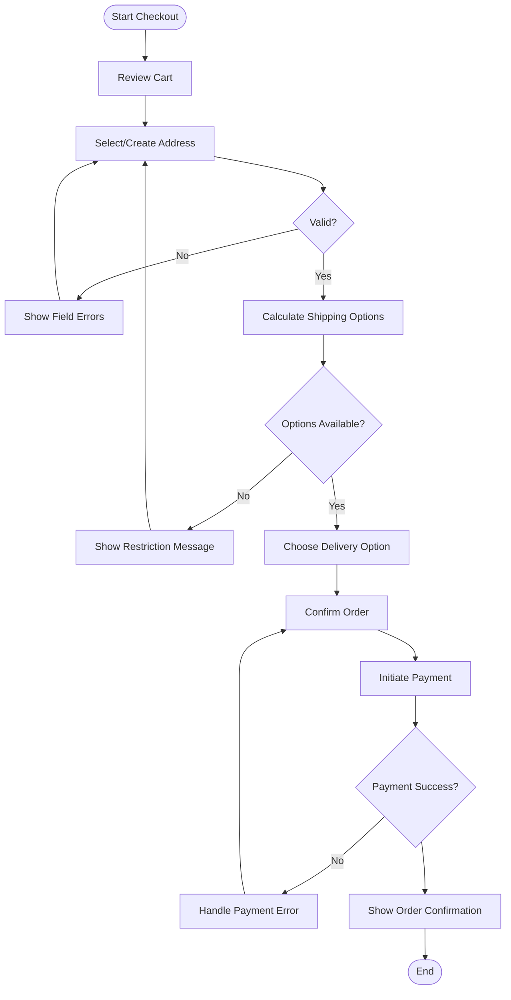
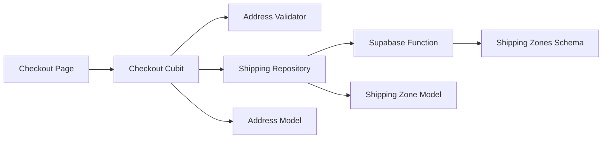

# Checkout Flow & Address Management

<cite>
**Referenced Files in This Document**
- [README.md](file://README.md)
- [supabase/migrations/009_shipping_zones.sql](file://supabase/migrations/009_shipping_zones.sql)
- [supabase/functions/checkout/index.ts](file://supabase/functions/checkout/index.ts)
- [test/checkout_address_test.dart](file://test/checkout_address_test.dart)
- [test/checkout_page_test.dart](file://test/checkout_page_test.dart)
- [lib/features/checkout/cubit/checkout_cubit.dart](file://lib/features/checkout/cubit/checkout_cubit.dart)
- [lib/features/checkout/state/checkout_state.dart](file://lib/features/checkout/state/checkout_state.dart)
- [lib/features/checkout/validation/address_validator.dart](file://lib/features/checkout/validation/address_validator.dart)
- [lib/features/checkout/repository/shipping_repository.dart](file://lib/features/checkout/repository/shipping_repository.dart)
- [lib/core/models/address_model.dart](file://lib/core/models/address_model.dart)
- [lib/core/models/shipping_zone_model.dart](file://lib/core/models/shipping_zone_model.dart)
</cite>

## Table of Contents
1. [Introduction](#introduction)
2. [Project Structure](#project-structure)
3. [Core Components](#core-components)
4. [Architecture Overview](#architecture-overview)
5. [Detailed Component Analysis](#detailed-component-analysis)
6. [Dependency Analysis](#dependency-analysis)
7. [Performance Considerations](#performance-considerations)
8. [Troubleshooting Guide](#troubleshooting-guide)
9. [Conclusion](#conclusion)

## Introduction
This document explains the end-to-end checkout flow and address management system, from cart review to order confirmation. It covers:
- Step-by-step checkout process including address creation and validation
- Shipping zone calculations and delivery options
- Cubit state management for checkout steps
- Form validation patterns and data persistence strategies
- Integration with shipping zones database schema and real-time availability updates
- Error handling for invalid addresses, shipping restrictions, and inventory conflicts
- Troubleshooting guides and performance optimization tips for large product catalogs

## Project Structure
The checkout feature is organized under a feature-based structure with clear separation of concerns:
- UI and navigation are implemented in Flutter screens and widgets
- Business logic and state are managed via Cubits and states
- Validation rules are encapsulated in dedicated validators
- Data access is abstracted through repositories that interact with Supabase functions and migrations

[No sources needed since this diagram shows conceptual workflow, not actual code structure]

## Core Components
- Checkout Cubit: Manages step-by-step state transitions (cart review, address selection/creation, shipping options, payment, confirmation). Emits loading, success, and error states during async operations.
- Address Validator: Enforces required fields, format checks, and region constraints before submission.
- Shipping Repository: Calculates shipping costs based on selected shipping zone and cart contents, and fetches available delivery options.
- Models: Address and Shipping Zone models define the shape of persisted and computed data used across the flow.

Key responsibilities:
- State transitions and event handling in the Cubit
- Input validation and user feedback in the validator
- External calls and caching in the repository
- Data contracts in models

**Section sources**
- [lib/features/checkout/cubit/checkout_cubit.dart](file://lib/features/checkout/cubit/checkout_cubit.dart)
- [lib/features/checkout/state/checkout_state.dart](file://lib/features/checkout/state/checkout_state.dart)
- [lib/features/checkout/validation/address_validator.dart](file://lib/features/checkout/validation/address_validator.dart)
- [lib/features/checkout/repository/shipping_repository.dart](file://lib/features/checkout/repository/shipping_repository.dart)
- [lib/core/models/address_model.dart](file://lib/core/models/address_model.dart)
- [lib/core/models/shipping_zone_model.dart](file://lib/core/models/shipping_zone_model.dart)

## Architecture Overview
The checkout flow integrates UI, state management, validation, and backend services:

**Diagram sources**
- [supabase/functions/checkout/index.ts](file://supabase/functions/checkout/index.ts)
- [supabase/migrations/009_shipping_zones.sql](file://supabase/migrations/009_shipping_zones.sql)
- [lib/features/checkout/cubit/checkout_cubit.dart](file://lib/features/checkout/cubit/checkout_cubit.dart)
- [lib/features/checkout/repository/shipping_repository.dart](file://lib/features/checkout/repository/shipping_repository.dart)

## Detailed Component Analysis

### Checkout Cubit and State Management
Responsibilities:
- Maintain current step (e.g., address, shipping, payment, confirmation)
- Handle events like select address, create address, calculate shipping, confirm order
- Emit states reflecting loading, success, and errors
- Coordinate between validation and repository calls

State design:
- Immutable state objects representing each step’s data and status
- Clear transitions enforced by event handlers
- Centralized error mapping for consistent user feedback

Common patterns:
- One-way data flow from UI to Cubit to repository
- Debounced or guarded actions to prevent duplicate submissions
- Local state snapshots for quick recovery after transient failures

**Section sources**
- [lib/features/checkout/cubit/checkout_cubit.dart](file://lib/features/checkout/cubit/checkout_cubit.dart)
- [lib/features/checkout/state/checkout_state.dart](file://lib/features/checkout/state/checkout_state.dart)

### Address Creation and Validation
Validation rules:
- Required fields such as name, phone, street, city, postal code, country
- Format checks for phone numbers and postal codes
- Region-specific constraints when applicable
- Duplicate detection against saved addresses if supported

Flow:
- User inputs address details
- Validator runs synchronously to provide immediate feedback
- On valid input, Cubit proceeds to shipping calculation
- Invalid input prevents progression and highlights fields

Persistence strategy:
- Save validated addresses locally for reuse
- Optionally persist to user profile via backend integration

**Section sources**
- [lib/features/checkout/validation/address_validator.dart](file://lib/features/checkout/validation/address_validator.dart)
- [lib/core/models/address_model.dart](file://lib/core/models/address_model.dart)
- [test/checkout_address_test.dart](file://test/checkout_address_test.dart)

### Shipping Zone Calculations and Delivery Options
Calculation logic:
- Determine shipping zone based on destination address
- Compute shipping cost using zone rules and cart contents
- Return multiple delivery options with estimated times and prices

Integration points:
- Repository calls Supabase function to compute options
- Database schema provides zone definitions and constraints
- Real-time availability updates reflect stock changes and regional restrictions

Example scenario:
- Selecting an address triggers shipping options retrieval
- If no options match, display fallback message or restrict checkout
- When stock is insufficient, mark items unavailable and adjust totals

**Section sources**
- [lib/features/checkout/repository/shipping_repository.dart](file://lib/features/checkout/repository/shipping_repository.dart)
- [supabase/functions/checkout/index.ts](file://supabase/functions/checkout/index.ts)
- [supabase/migrations/009_shipping_zones.sql](file://supabase/migrations/009_shipping_zones.sql)
- [lib/core/models/shipping_zone_model.dart](file://lib/core/models/shipping_zone_model.dart)

### End-to-End Checkout Sequence
Steps:
1. Review cart and proceed to address selection
2. Create or select a saved address; validate immediately
3. Fetch shipping options and present choices
4. Confirm order and initiate payment
5. Receive confirmation and show order summary

Error handling:
- Invalid address: block progression and show field-level errors
- Shipping restrictions: disable options and inform user
- Inventory conflicts: update cart totals and notify user

**Diagram sources**
- [lib/features/checkout/cubit/checkout_cubit.dart](file://lib/features/checkout/cubit/checkout_cubit.dart)
- [lib/features/checkout/validation/address_validator.dart](file://lib/features/checkout/validation/address_validator.dart)
- [lib/features/checkout/repository/shipping_repository.dart](file://lib/features/checkout/repository/shipping_repository.dart)
- [supabase/functions/checkout/index.ts](file://supabase/functions/checkout/index.ts)

## Dependency Analysis
Component relationships:
- Checkout Page depends on Checkout Cubit for state and behavior
- Checkout Cubit depends on Address Validator and Shipping Repository
- Shipping Repository depends on Supabase Functions and Database Schema
- Models define shared contracts across components

**Diagram sources**
- [lib/features/checkout/cubit/checkout_cubit.dart](file://lib/features/checkout/cubit/checkout_cubit.dart)
- [lib/features/checkout/validation/address_validator.dart](file://lib/features/checkout/validation/address_validator.dart)
- [lib/features/checkout/repository/shipping_repository.dart](file://lib/features/checkout/repository/shipping_repository.dart)
- [supabase/functions/checkout/index.ts](file://supabase/functions/checkout/index.ts)
- [supabase/migrations/009_shipping_zones.sql](file://supabase/migrations/009_shipping_zones.sql)
- [lib/core/models/address_model.dart](file://lib/core/models/address_model.dart)
- [lib/core/models/shipping_zone_model.dart](file://lib/core/models/shipping_zone_model.dart)

**Section sources**
- [lib/features/checkout/cubit/checkout_cubit.dart](file://lib/features/checkout/cubit/checkout_cubit.dart)
- [lib/features/checkout/validation/address_validator.dart](file://lib/features/checkout/validation/address_validator.dart)
- [lib/features/checkout/repository/shipping_repository.dart](file://lib/features/checkout/repository/shipping_repository.dart)
- [supabase/functions/checkout/index.ts](file://supabase/functions/checkout/index.ts)
- [supabase/migrations/009_shipping_zones.sql](file://supabase/migrations/009_shipping_zones.sql)
- [lib/core/models/address_model.dart](file://lib/core/models/address_model.dart)
- [lib/core/models/shipping_zone_model.dart](file://lib/core/models/shipping_zone_model.dart)

## Performance Considerations
- Cache shipping zones and delivery options to reduce repeated network calls
- Debounce address changes before recalculating shipping
- Use pagination or lazy loading for large product catalogs in cart summaries
- Minimize reflows by batching state updates in the Cubit
- Prefer server-side validation and computation for complex shipping rules
- Implement optimistic UI updates with rollback on failure

[No sources needed since this section provides general guidance]

## Troubleshooting Guide
Common issues and resolutions:
- Invalid address: ensure all required fields are filled and formats are correct; check region constraints
- No shipping options: verify shipping zone coverage for the selected address; confirm item availability
- Inventory conflicts: refresh stock levels and update cart totals; inform users about unavailability
- Payment failures: retry with updated tokens; handle timeouts and partial successes gracefully

Debugging tips:
- Inspect Cubit state transitions to identify stuck steps
- Log repository calls and responses to pinpoint network or schema mismatches
- Use tests to reproduce edge cases in address validation and shipping calculations

**Section sources**
- [test/checkout_address_test.dart](file://test/checkout_address_test.dart)
- [test/checkout_page_test.dart](file://test/checkout_page_test.dart)
- [lib/features/checkout/cubit/checkout_cubit.dart](file://lib/features/checkout/cubit/checkout_cubit.dart)
- [lib/features/checkout/repository/shipping_repository.dart](file://lib/features/checkout/repository/shipping_repository.dart)

## Conclusion
The checkout flow combines robust state management, strict validation, and reliable backend integration to deliver a smooth purchasing experience. By leveraging shipping zones, real-time availability, and clear error handling, the system ensures accuracy and resilience. For large catalogs, caching and debouncing improve responsiveness while maintaining correctness.

[No sources needed since this section summarizes without analyzing specific files]