# Order Processing & Fulfillment

<cite>
**Referenced Files in This Document**
- [supabase/functions/checkout/index.ts](file://supabase/functions/checkout/index.ts)
- [supabase/functions/cancel-expired-orders/index.ts](file://supabase/functions/cancel-expired-orders/index.ts)
- [supabase/functions/send-order-notification/index.ts](file://supabase/functions/send-order-notification/index.ts)
- [supabase/migrations/008_order_fulfillment.sql](file://supabase/migrations/008_order_fulfillment.sql)
- [supabase/migrations/011_orders_idempotency_and_expiry.sql](file://supabase/migrations/011_orders_idempotency_and_expiry.sql)
- [supabase/migrations/004_stock_function.sql](file://supabase/migrations/004_stock_function.sql)
- [supabase/migrations/007_stock_increment_function.sql](file://supabase/migrations/007_stock_increment_function.sql)
- [supabase/migrations/010_notifications_analytics.sql](file://supabase/migrations/010_notifications_analytics.sql)
- [lib/features/orders/orders_cubit.dart](file://lib/features/orders/orders_cubit.dart)
- [test/orders_cubit_test.dart](file://test/orders_cubit_test.dart)
</cite>

## Table of Contents
1. [Introduction](#introduction)
2. [Project Structure](#project-structure)
3. [Core Components](#core-components)
4. [Architecture Overview](#architecture-overview)
5. [Detailed Component Analysis](#detailed-component-analysis)
6. [Dependency Analysis](#dependency-analysis)
7. [Performance Considerations](#performance-considerations)
8. [Troubleshooting Guide](#troubleshooting-guide)
9. [Conclusion](#conclusion)
10. [Appendices](#appendices)

## Introduction
This document explains the end-to-end order processing and fulfillment workflows in the store system. It covers the atomic checkout RPC function, order creation transactions, stock reservation mechanisms, order lifecycle and status transitions, notification triggers, data models, database schema, concurrency controls, and monitoring strategies. The goal is to help developers understand how orders are created, paid, fulfilled, and tracked while ensuring consistency and reliability under concurrent load.

## Project Structure
The order processing logic spans client-side state management and serverless backend functions backed by a relational database. Key areas include:
- Serverless functions for checkout, payment callbacks, notifications, and background tasks
- Database migrations defining schemas for orders, items, payments, stock, shipping zones, and notifications
- Client-side features managing cart, catalog, orders, and checkout flows

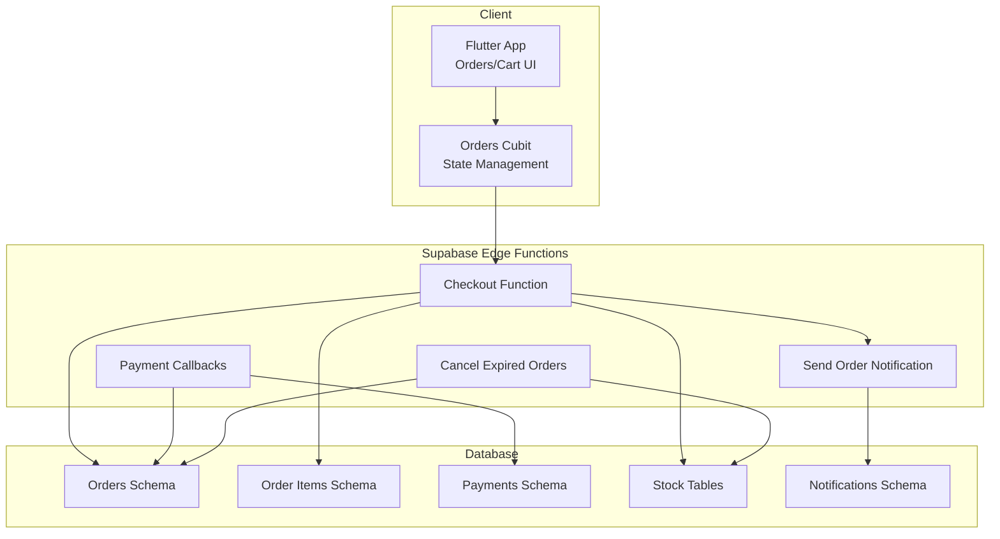

[No sources needed since this diagram shows conceptual workflow, not actual code structure]

## Core Components
- Atomic Checkout RPC: Creates an order atomically, reserves stock, persists order items, and returns a payment intent or next step. Designed to be idempotent and safe under concurrency.
- Order Creation Transaction: Wraps order header, line items, and stock reservations in a single transaction to ensure consistency.
- Stock Reservation Mechanism: Uses database-level functions to decrement available stock safely, preventing overselling.
- Background Expiration Handler: Periodically cancels unpaid/expired orders and releases reserved stock.
- Notifications: Emits events when orders change state (created, paid, shipped, canceled).
- Payment Integration: Handles initiation, callback verification, and finalization of payment states.

**Section sources**
- [supabase/functions/checkout/index.ts](file://supabase/functions/checkout/index.ts)
- [supabase/functions/cancel-expired-orders/index.ts](file://supabase/functions/cancel-expired-orders/index.ts)
- [supabase/functions/send-order-notification/index.ts](file://supabase/functions/send-order-notification/index.ts)
- [supabase/migrations/008_order_fulfillment.sql](file://supabase/migrations/008_order_fulfillment.sql)
- [supabase/migrations/011_orders_idempotency_and_expiry.sql](file://supabase/migrations/011_orders_idempotency_and_expiry.sql)
- [supabase/migrations/004_stock_function.sql](file://supabase/migrations/004_stock_function.sql)
- [supabase/migrations/007_stock_increment_function.sql](file://supabase/migrations/007_stock_increment_function.sql)
- [supabase/migrations/010_notifications_analytics.sql](file://supabase/migrations/010_notifications_analytics.sql)
- [lib/features/orders/orders_cubit.dart](file://lib/features/orders/orders_cubit.dart)
- [test/orders_cubit_test.dart](file://test/orders_cubit_test.dart)

## Architecture Overview
The checkout flow is implemented as an atomic RPC that performs multiple steps within a single database transaction. After successful creation, the client proceeds to payment. On payment success, the order moves to paid and then into fulfillment. Notifications are emitted at key milestones.

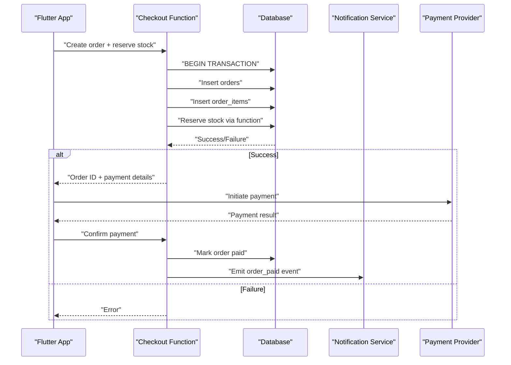

**Diagram sources**
- [supabase/functions/checkout/index.ts](file://supabase/functions/checkout/index.ts)
- [supabase/migrations/008_order_fulfillment.sql](file://supabase/migrations/008_order_fulfillment.sql)
- [supabase/migrations/010_notifications_analytics.sql](file://supabase/migrations/010_notifications_analytics.sql)

## Detailed Component Analysis

### Atomic Checkout RPC
Responsibilities:
- Validate request inputs (cart contents, addresses, promo codes if applicable)
- Create order header and items in one transaction
- Reserve stock atomically using a dedicated function
- Return order details and initiate payment flow
- Ensure idempotency via idempotency keys to prevent duplicate orders

Concurrency and consistency:
- All mutations occur inside a single transaction
- Stock reservation uses row-level locking or a stored procedure to avoid race conditions
- Idempotency key prevents double-processing on retries

Status transitions:
- Created -> Paid (after payment confirmation)
- Created -> Cancelled (on expiry or user cancellation)

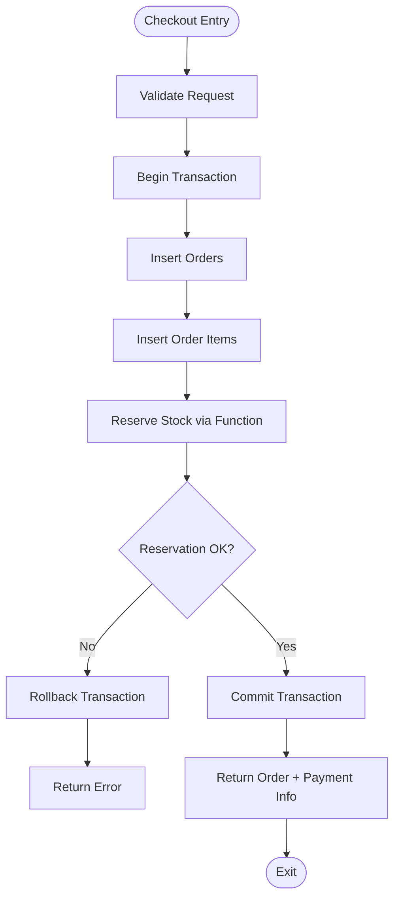

**Diagram sources**
- [supabase/functions/checkout/index.ts](file://supabase/functions/checkout/index.ts)
- [supabase/migrations/004_stock_function.sql](file://supabase/migrations/004_stock_function.sql)
- [supabase/migrations/007_stock_increment_function.sql](file://supabase/migrations/007_stock_increment_function.sql)

**Section sources**
- [supabase/functions/checkout/index.ts](file://supabase/functions/checkout/index.ts)
- [supabase/migrations/011_orders_idempotency_and_expiry.sql](file://supabase/migrations/011_orders_idempotency_and_expiry.sql)

### Order Creation Transactions
Key guarantees:
- All-or-nothing semantics for order header and items
- Consistent totals and tax/shipping calculations before committing
- Audit fields (created_at, updated_at) and referential integrity enforced

Data model highlights:
- orders: unique identifiers, customer reference, totals, currency, status, timestamps
- order_items: product references, quantities, unit prices, discounts, totals

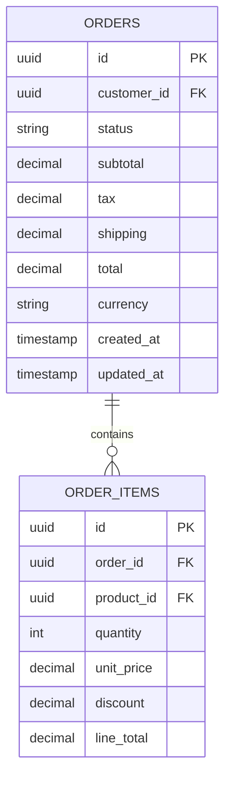

**Diagram sources**
- [supabase/migrations/008_order_fulfillment.sql](file://supabase/migrations/008_order_fulfillment.sql)

**Section sources**
- [supabase/migrations/008_order_fulfillment.sql](file://supabase/migrations/008_order_fulfillment.sql)

### Stock Reservation Mechanism
Design principles:
- Use a stored function to decrement available stock atomically
- Prevent overselling by checking availability within the same transaction
- Support partial failures by rolling back entire order if any item cannot be reserved

Implementation notes:
- Accepts product IDs and requested quantities
- Returns success/failure per item or overall error
- Optionally supports inventory snapshots for auditability

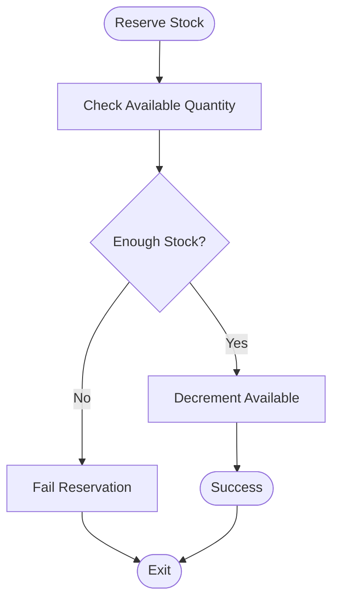

**Diagram sources**
- [supabase/migrations/004_stock_function.sql](file://supabase/migrations/004_stock_function.sql)
- [supabase/migrations/007_stock_increment_function.sql](file://supabase/migrations/007_stock_increment_function.sql)

**Section sources**
- [supabase/migrations/004_stock_function.sql](file://supabase/migrations/004_stock_function.sql)
- [supabase/migrations/007_stock_increment_function.sql](file://supabase/migrations/007_stock_increment_function.sql)

### Order Lifecycle and Status Transitions
Typical statuses:
- Created: Order placed but not yet paid
- Paid: Payment confirmed
- Processing: Ready for fulfillment
- Shipped: Dispatched with tracking
- Delivered: Received by customer
- Canceled: Order canceled (by user or expired)

Transitions:
- Created -> Paid (payment callback)
- Paid -> Processing (internal workflow)
- Processing -> Shipped (fulfillment action)
- Shipped -> Delivered (delivery confirmation)
- Any -> Canceled (cancellation policy or expiration)

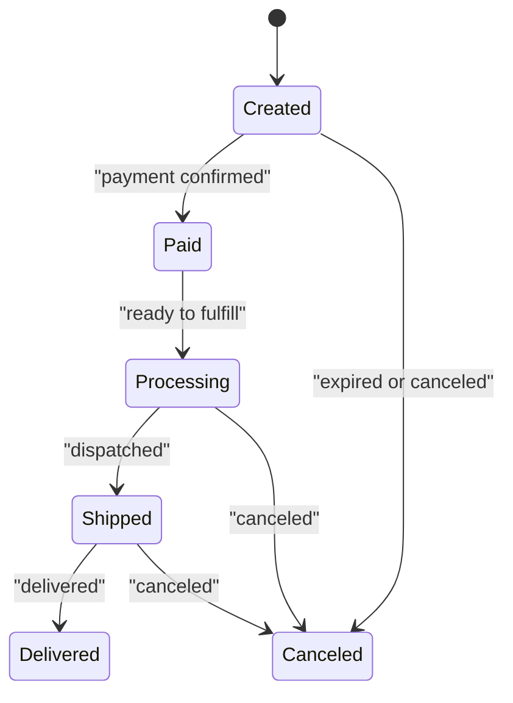

**Diagram sources**
- [supabase/migrations/008_order_fulfillment.sql](file://supabase/migrations/008_order_fulfillment.sql)

**Section sources**
- [supabase/migrations/008_order_fulfillment.sql](file://supabase/migrations/008_order_fulfillment.sql)

### Fulfillment Workflow
Fulfillment typically involves:
- Validating order readiness (status = Processing)
- Reserving physical inventory (warehouse)
- Generating packing slips and labels
- Updating order status to Shipped with tracking info
- Emitting notifications to customers

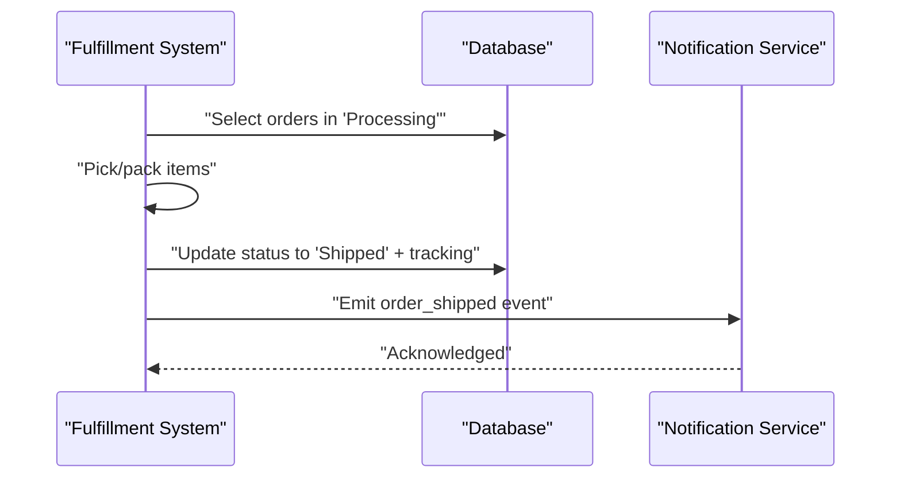

**Diagram sources**
- [supabase/migrations/008_order_fulfillment.sql](file://supabase/migrations/008_order_fulfillment.sql)
- [supabase/migrations/010_notifications_analytics.sql](file://supabase/migrations/010_notifications_analytics.sql)

**Section sources**
- [supabase/migrations/008_order_fulfillment.sql](file://supabase/migrations/008_order_fulfillment.sql)
- [supabase/migrations/010_notifications_analytics.sql](file://supabase/migrations/010_notifications_analytics.sql)

### Inventory Management
Inventory operations:
- Decrement on successful checkout (reservation)
- Increment on order cancellation or refund
- Optional adjustments for corrections and audits

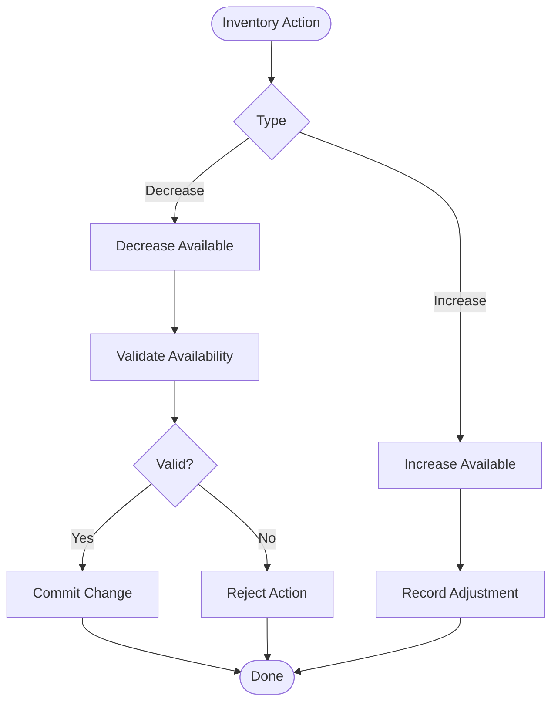

**Diagram sources**
- [supabase/migrations/004_stock_function.sql](file://supabase/migrations/004_stock_function.sql)
- [supabase/migrations/007_stock_increment_function.sql](file://supabase/migrations/007_stock_increment_function.sql)

**Section sources**
- [supabase/migrations/004_stock_function.sql](file://supabase/migrations/004_stock_function.sql)
- [supabase/migrations/007_stock_increment_function.sql](file://supabase/migrations/007_stock_increment_function.sql)

### Concurrency, Race Conditions, and Data Consistency
- Transactions: All order-related writes are wrapped in a single transaction to maintain consistency.
- Row-level locking: Stock functions lock relevant rows to prevent concurrent oversell.
- Idempotency: Checkout accepts idempotency keys to safely retry without duplicating orders.
- Expiration handling: Background job cancels unpaid orders after a timeout and restores stock.

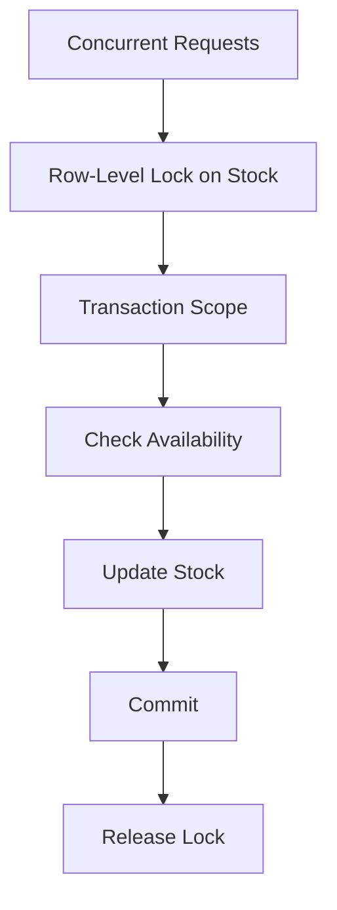

**Diagram sources**
- [supabase/migrations/004_stock_function.sql](file://supabase/migrations/004_stock_function.sql)
- [supabase/migrations/011_orders_idempotency_and_expiry.sql](file://supabase/migrations/011_orders_idempotency_and_expiry.sql)

**Section sources**
- [supabase/migrations/004_stock_function.sql](file://supabase/migrations/004_stock_function.sql)
- [supabase/migrations/011_orders_idempotency_and_expiry.sql](file://supabase/migrations/011_orders_idempotency_and_expiry.sql)

### Notification System
Triggers:
- Order created: welcome email/SMS
- Order paid: receipt and confirmation
- Order shipped: dispatch notice with tracking
- Order delivered: delivery confirmation and feedback prompt
- Order canceled: cancellation notice and refund status

Implementation:
- Dedicated function emits events to a notifications table or external service
- Events include payload metadata for personalization and analytics

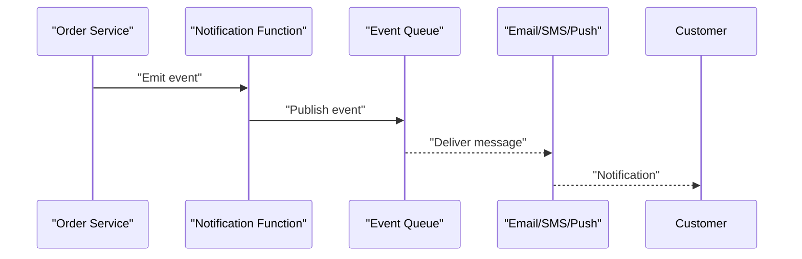

**Diagram sources**
- [supabase/functions/send-order-notification/index.ts](file://supabase/functions/send-order-notification/index.ts)
- [supabase/migrations/010_notifications_analytics.sql](file://supabase/migrations/010_notifications_analytics.sql)

**Section sources**
- [supabase/functions/send-order-notification/index.ts](file://supabase/functions/send-order-notification/index.ts)
- [supabase/migrations/010_notifications_analytics.sql](file://supabase/migrations/010_notifications_analytics.sql)

### Client-Side Order State Management
The Flutter app manages order state through a cubit that:
- Calls checkout RPC and handles responses
- Subscribes to order updates and reflects them in the UI
- Retries failed requests with idempotency keys
- Displays status transitions and actions (cancel, track shipment)

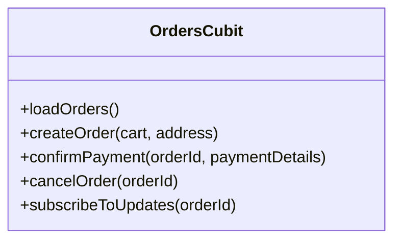

**Diagram sources**
- [lib/features/orders/orders_cubit.dart](file://lib/features/orders/orders_cubit.dart)

**Section sources**
- [lib/features/orders/orders_cubit.dart](file://lib/features/orders/orders_cubit.dart)
- [test/orders_cubit_test.dart](file://test/orders_cubit_test.dart)

## Dependency Analysis
High-level dependencies:
- Checkout depends on stock functions and order schema
- Payment callbacks update order status and trigger notifications
- Background jobs depend on order expiry policies and stock restoration
- Client depends on serverless functions and real-time updates

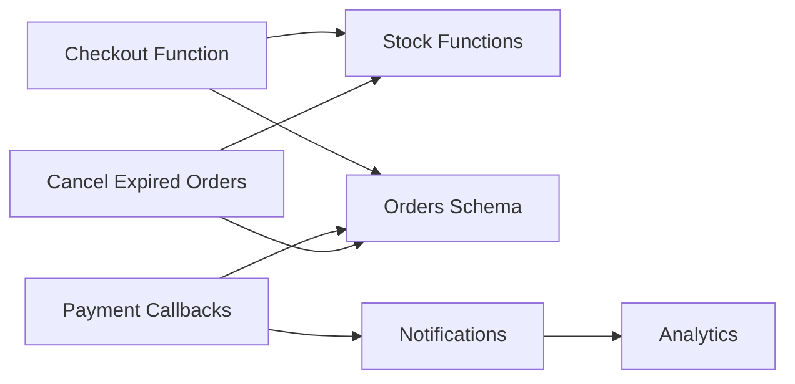

**Diagram sources**
- [supabase/functions/checkout/index.ts](file://supabase/functions/checkout/index.ts)
- [supabase/functions/cancel-expired-orders/index.ts](file://supabase/functions/cancel-expired-orders/index.ts)
- [supabase/functions/send-order-notification/index.ts](file://supabase/functions/send-order-notification/index.ts)
- [supabase/migrations/008_order_fulfillment.sql](file://supabase/migrations/008_order_fulfillment.sql)
- [supabase/migrations/010_notifications_analytics.sql](file://supabase/migrations/010_notifications_analytics.sql)

**Section sources**
- [supabase/functions/checkout/index.ts](file://supabase/functions/checkout/index.ts)
- [supabase/functions/cancel-expired-orders/index.ts](file://supabase/functions/cancel-expired-orders/index.ts)
- [supabase/functions/send-order-notification/index.ts](file://supabase/functions/send-order-notification/index.ts)
- [supabase/migrations/008_order_fulfillment.sql](file://supabase/migrations/008_order_fulfillment.sql)
- [supabase/migrations/010_notifications_analytics.sql](file://supabase/migrations/010_notifications_analytics.sql)

## Performance Considerations
- Keep checkout transaction minimal; avoid heavy computations inside it
- Use indexes on frequently queried columns (order_id, customer_id, status)
- Batch notifications where possible to reduce overhead
- Monitor long-running queries and optimize stock functions
- Use connection pooling and caching for read-heavy endpoints

[No sources needed since this section provides general guidance]

## Troubleshooting Guide
Common issues and resolutions:
- Duplicate orders: Verify idempotency key usage and ensure only one successful commit path
- Oversold stock: Inspect stock function logic and confirm row-level locks are applied
- Stuck orders: Check expiration job and ensure pending orders transition to canceled
- Missing notifications: Validate event emission and queue delivery logs

Operational checks:
- Review function logs for errors and timeouts
- Inspect database constraints and foreign key violations
- Confirm RLS policies allow expected reads/writes

**Section sources**
- [supabase/migrations/011_orders_idempotency_and_expiry.sql](file://supabase/migrations/011_orders_idempotency_and_expiry.sql)
- [supabase/migrations/004_stock_function.sql](file://supabase/migrations/004_stock_function.sql)
- [supabase/migrations/010_notifications_analytics.sql](file://supabase/migrations/010_notifications_analytics.sql)

## Conclusion
The order processing system emphasizes atomicity, idempotency, and strong consistency. By leveraging database transactions, row-level locking, and background jobs, it ensures reliable order creation, stock reservation, and fulfillment. Notifications keep customers informed throughout the lifecycle, while monitoring and testing practices support operational stability.

[No sources needed since this section summarizes without analyzing specific files]

## Appendices

### Example Order Data Models
- orders: id, customer_id, status, totals, currency, timestamps
- order_items: id, order_id, product_id, quantity, unit_price, discount, line_total
- payments: id, order_id, provider, status, amount, currency, timestamps
- stock: product_id, available_quantity, reserved_quantity, last_updated

**Section sources**
- [supabase/migrations/008_order_fulfillment.sql](file://supabase/migrations/008_order_fulfillment.sql)
- [supabase/migrations/006_payments_table.sql](file://supabase/migrations/006_payments_table.sql)
- [supabase/migrations/004_stock_function.sql](file://supabase/migrations/004_stock_function.sql)

### Monitoring Strategies
- Metrics: order creation rate, payment success rate, fulfillment latency, stock reservation failures
- Alerts: high error rates, slow queries, stuck orders beyond SLA
- Dashboards: funnel from checkout to delivery, top failure reasons
- Tracing: correlate client requests with serverless function logs and DB transactions

[No sources needed since this section provides general guidance]