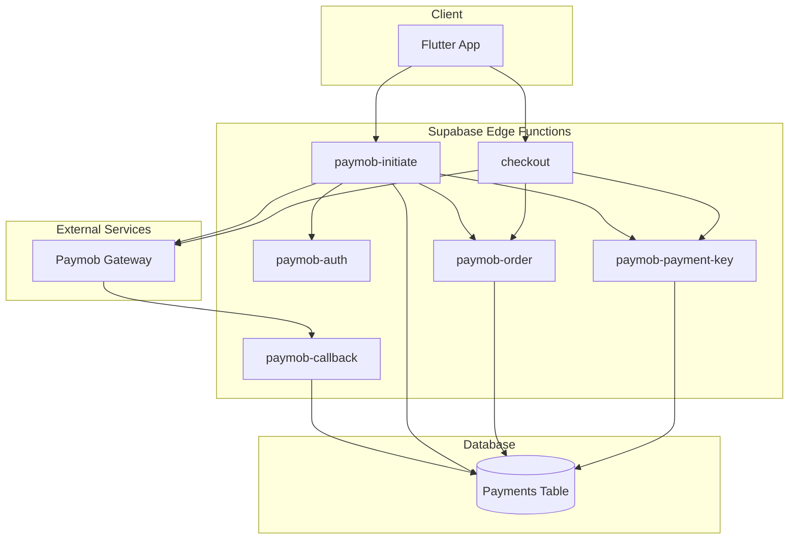
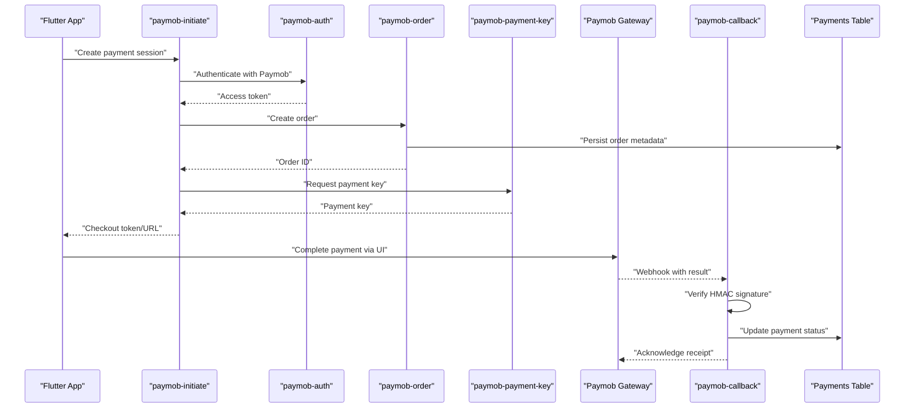
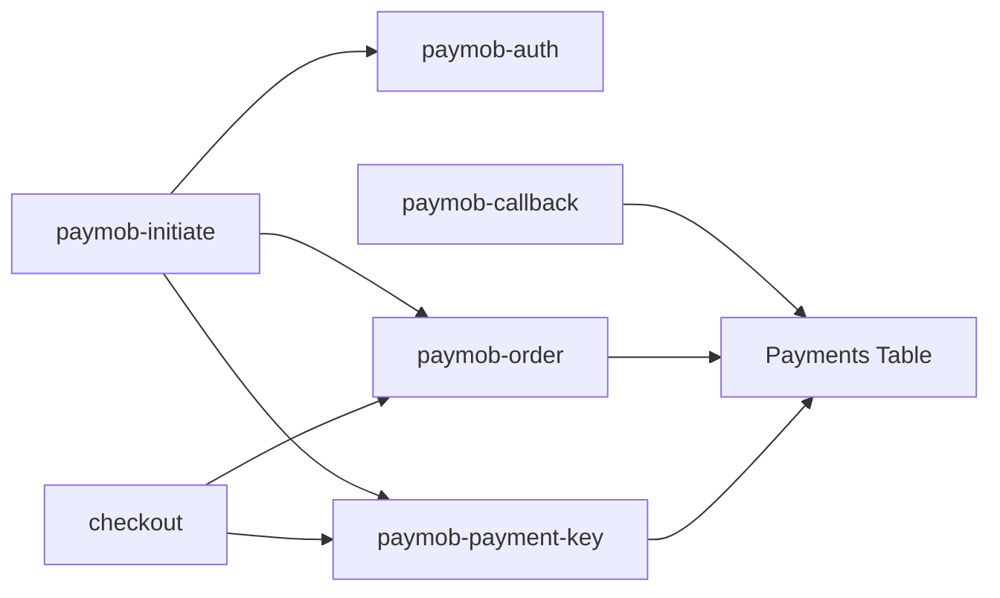

# Payment Gateway Integration (Paymob)

<cite>
**Referenced Files in This Document**
- [paymob-initiate/index.ts](file://supabase/functions/paymob-initiate/index.ts)
- [paymob-callback/index.ts](file://supabase/functions/paymob-callback/index.ts)
- [checkout/index.ts](file://supabase/functions/checkout/index.ts)
- [paymob-auth/index.ts](file://supabase/functions/paymob-auth/index.ts)
- [paymob-order/index.ts](file://supabase/functions/paymob-order/index.ts)
- [paymob-payment-key/index.ts](file://supabase/functions/paymob-payment-key/index.ts)
- [006_payments_table.sql](file://supabase/migrations/006_payments_table.sql)
- [payment_integration_test.dart](file://test/payment_integration_test.dart)
- [payment_test.dart](file://test/payment_test.dart)
</cite>

## Table of Contents
1. [Introduction](#introduction)
2. [Project Structure](#project-structure)
3. [Core Components](#core-components)
4. [Architecture Overview](#architecture-overview)
5. [Detailed Component Analysis](#detailed-component-analysis)
6. [Dependency Analysis](#dependency-analysis)
7. [Performance Considerations](#performance-considerations)
8. [Security Considerations](#security-considerations)
9. [Testing Strategies](#testing-strategies)
10. [Troubleshooting Guide](#troubleshooting-guide)
11. [Conclusion](#conclusion)

## Introduction
This document provides comprehensive API documentation for integrating the Paymob payment gateway within the project. It covers the end-to-end payment processing architecture, including payment initiation, secure token handling, callback verification, and transaction status management. The Supabase Edge Functions used to orchestrate these flows are documented with request/response schemas, HMAC signature verification, webhook payload handling, idempotency patterns, and security considerations.

## Project Structure
The Paymob integration is implemented primarily through Supabase Edge Functions and a dedicated payments table schema. The key files involved are:
- Supabase functions for initiating payments, authenticating with Paymob, creating orders, obtaining payment keys, handling callbacks, and orchestrating checkout.
- Database migration defining the payments table schema.
- Tests covering payment flows and integration scenarios.

**Diagram sources**
- [paymob-initiate/index.ts](file://supabase/functions/paymob-initiate/index.ts)
- [paymob-callback/index.ts](file://supabase/functions/paymob-callback/index.ts)
- [checkout/index.ts](file://supabase/functions/checkout/index.ts)
- [paymob-auth/index.ts](file://supabase/functions/paymob-auth/index.ts)
- [paymob-order/index.ts](file://supabase/functions/paymob-order/index.ts)
- [paymob-payment-key/index.ts](file://supabase/functions/paymob-payment-key/index.ts)
- [006_payments_table.sql](file://supabase/migrations/006_payments_table.sql)

**Section sources**
- [paymob-initiate/index.ts](file://supabase/functions/paymob-initiate/index.ts)
- [paymob-callback/index.ts](file://supabase/functions/paymob-callback/index.ts)
- [checkout/index.ts](file://supabase/functions/checkout/index.ts)
- [paymob-auth/index.ts](file://supabase/functions/paymob-auth/index.ts)
- [paymob-order/index.ts](file://supabase/functions/paymob-order/index.ts)
- [paymob-payment-key/index.ts](file://supabase/functions/paymob-payment-key/index.ts)
- [006_payments_table.sql](file://supabase/migrations/006_payments_table.sql)

## Core Components
- paymob-initiate: Orchestrates payment initiation by authenticating with Paymob, creating an order, obtaining a payment key, and returning a client-side token or URL for checkout.
- paymob-auth: Handles authentication with Paymob using stored credentials.
- paymob-order: Creates an order record in Paymob and persists order metadata in the database.
- paymob-payment-key: Requests a payment key from Paymob for the created order.
- paymob-callback: Receives Paymob webhooks, verifies HMAC signatures, updates payment status, and ensures idempotency.
- checkout: High-level endpoint that coordinates order creation, payment key retrieval, and returns checkout data to the client.
- Payments table: Stores payment transactions, statuses, and audit fields.

**Section sources**
- [paymob-initiate/index.ts](file://supabase/functions/paymob-initiate/index.ts)
- [paymob-auth/index.ts](file://supabase/functions/paymob-auth/index.ts)
- [paymob-order/index.ts](file://supabase/functions/paymob-order/index.ts)
- [paymob-payment-key/index.ts](file://supabase/functions/paymob-payment-key/index.ts)
- [paymob-callback/index.ts](file://supabase/functions/paymob-callback/index.ts)
- [checkout/index.ts](file://supabase/functions/checkout/index.ts)
- [006_payments_table.sql](file://supabase/migrations/006_payments_table.sql)

## Architecture Overview
The payment flow involves multiple steps across client, serverless functions, external gateway, and database:

**Diagram sources**
- [paymob-initiate/index.ts](file://supabase/functions/paymob-initiate/index.ts)
- [paymob-auth/index.ts](file://supabase/functions/paymob-auth/index.ts)
- [paymob-order/index.ts](file://supabase/functions/paymob-order/index.ts)
- [paymob-payment-key/index.ts](file://supabase/functions/paymob-payment-key/index.ts)
- [paymob-callback/index.ts](file://supabase/functions/paymob-callback/index.ts)
- [006_payments_table.sql](file://supabase/migrations/006_payments_table.sql)

## Detailed Component Analysis

### paymob-initiate Function
Responsibilities:
- Authenticate with Paymob using stored credentials.
- Create an order via paymob-order.
- Request a payment key via paymob-payment-key.
- Return a client-ready checkout token or URL.
- Persist initial payment state and idempotency keys.

Input schema (example):
- order_id: string
- amount_cents: integer
- currency: string
- customer_email: string
- idempotency_key: string (optional)

Output schema (example):
- checkout_url: string
- token: string
- payment_id: string
- status: string

Idempotency:
- Uses idempotency_key to prevent duplicate order creation and payment key requests.

Error handling:
- Returns structured errors for authentication failures, order creation errors, and payment key retrieval errors.

**Section sources**
- [paymob-initiate/index.ts](file://supabase/functions/paymob-initiate/index.ts)
- [paymob-auth/index.ts](file://supabase/functions/paymob-auth/index.ts)
- [paymob-order/index.ts](file://supabase/functions/paymob-order/index.ts)
- [paymob-payment-key/index.ts](file://supabase/functions/paymob-payment-key/index.ts)

### paymob-auth Function
Responsibilities:
- Retrieve and refresh Paymob access tokens using stored credentials.
- Cache tokens where appropriate to reduce network calls.
- Provide authenticated headers for subsequent Paymob API calls.

Security:
- Credentials are accessed securely via environment variables.
- Token caching minimizes exposure and improves performance.

**Section sources**
- [paymob-auth/index.ts](file://supabase/functions/paymob-auth/index.ts)

### paymob-order Function
Responsibilities:
- Create an order in Paymob with amount, currency, and customer details.
- Persist order metadata in the database for reconciliation.
- Return Paymob order ID for subsequent payment key requests.

Idempotency:
- Ensures unique order creation per idempotency_key.

**Section sources**
- [paymob-order/index.ts](file://supabase/functions/paymob-order/index.ts)
- [006_payments_table.sql](file://supabase/migrations/006_payments_table.sql)

### paymob-payment-key Function
Responsibilities:
- Request a payment key from Paymob using the created order ID.
- Return a short-lived token or URL for client-side checkout.
- Store payment key reference in the database for auditing.

Security:
- Payment keys are transient and should not be persisted beyond necessary audit fields.

**Section sources**
- [paymob-payment-key/index.ts](file://supabase/functions/paymob-payment-key/index.ts)
- [006_payments_table.sql](file://supabase/migrations/006_payments_table.sql)

### paymob-callback Function
Responsibilities:
- Receive Paymob webhook payloads.
- Verify HMAC signature using shared secret.
- Update payment status in the database based on webhook data.
- Ensure idempotent updates using transaction IDs.

HMAC verification:
- Computes HMAC over the raw request body using the configured secret.
- Compares computed signature against the provided header value.

Payload handling:
- Extracts transaction ID, amount, currency, and status.
- Maps Paymob statuses to internal states.

Idempotency:
- Uses transaction_id to avoid duplicate status updates.

**Section sources**
- [paymob-callback/index.ts](file://supabase/functions/paymob-callback/index.ts)
- [006_payments_table.sql](file://supabase/migrations/006_payments_table.sql)

### checkout Function
Responsibilities:
- Orchestrate high-level checkout process.
- Call paymob-order and paymob-payment-key.
- Return consolidated checkout data to the client.

Integration:
- Acts as a facade over lower-level Paymob operations.

**Section sources**
- [checkout/index.ts](file://supabase/functions/checkout/index.ts)
- [paymob-order/index.ts](file://supabase/functions/paymob-order/index.ts)
- [paymob-payment-key/index.ts](file://supabase/functions/paymob-payment-key/index.ts)

### Payments Table Schema
The payments table stores transaction records and supports reconciliation and reporting.

Fields (representative):
- id: primary key
- payment_id: Paymob payment identifier
- order_id: internal order reference
- amount_cents: integer
- currency: string
- status: enum (e.g., pending, paid, failed, refunded)
- hmac_verified: boolean
- idempotency_key: string
- created_at: timestamp
- updated_at: timestamp

Indexes:
- Unique index on payment_id for fast lookups.
- Index on idempotency_key for deduplication.

Constraints:
- Not null constraints on critical fields.
- Check constraints on status values.

**Section sources**
- [006_payments_table.sql](file://supabase/migrations/006_payments_table.sql)

## Dependency Analysis
The components exhibit clear separation of concerns:
- paymob-initiate depends on paymob-auth, paymob-order, and paymob-payment-key.
- paymob-callback depends on database writes and HMAC verification logic.
- checkout composes order and payment key operations.

**Diagram sources**
- [paymob-initiate/index.ts](file://supabase/functions/paymob-initiate/index.ts)
- [paymob-auth/index.ts](file://supabase/functions/paymob-auth/index.ts)
- [paymob-order/index.ts](file://supabase/functions/paymob-order/index.ts)
- [paymob-payment-key/index.ts](file://supabase/functions/paymob-payment-key/index.ts)
- [paymob-callback/index.ts](file://supabase/functions/paymob-callback/index.ts)
- [checkout/index.ts](file://supabase/functions/checkout/index.ts)
- [006_payments_table.sql](file://supabase/migrations/006_payments_table.sql)

**Section sources**
- [paymob-initiate/index.ts](file://supabase/functions/paymob-initiate/index.ts)
- [paymob-callback/index.ts](file://supabase/functions/paymob-callback/index.ts)
- [checkout/index.ts](file://supabase/functions/checkout/index.ts)
- [paymob-auth/index.ts](file://supabase/functions/paymob-auth/index.ts)
- [paymob-order/index.ts](file://supabase/functions/paymob-order/index.ts)
- [paymob-payment-key/index.ts](file://supabase/functions/paymob-payment-key/index.ts)
- [006_payments_table.sql](file://supabase/migrations/006_payments_table.sql)

## Performance Considerations
- Minimize network calls by caching Paymob access tokens.
- Use idempotency keys to avoid redundant operations.
- Keep webhook handlers lightweight; perform heavy tasks asynchronously if needed.
- Ensure database indexes support frequent queries by payment_id and idempotency_key.

[No sources needed since this section provides general guidance]

## Security Considerations
- PCI Compliance: Do not store sensitive card data in your system. Rely on Paymob’s hosted checkout and tokens.
- Token Storage: Avoid persisting payment keys beyond audit requirements; prefer ephemeral usage.
- Callback Authentication: Always verify HMAC signatures before updating payment status.
- Secrets Management: Store Paymob credentials and HMAC secrets in environment variables accessible only to Edge Functions.
- Input Validation: Validate all incoming payloads and reject malformed requests early.

[No sources needed since this section provides general guidance]

## Testing Strategies
- Unit tests for HMAC verification logic and payload parsing.
- Integration tests simulating Paymob webhooks with valid and invalid signatures.
- Idempotency tests ensuring duplicate webhooks do not alter final state.
- End-to-end tests covering initiate -> checkout -> callback flow.

**Section sources**
- [payment_integration_test.dart](file://test/payment_integration_test.dart)
- [payment_test.dart](file://test/payment_test.dart)

## Troubleshooting Guide
Common issues and resolutions:
- Payment failures:
  - Inspect error responses from Paymob APIs and log contextual fields.
  - Verify amount and currency match Paymob configuration.
- Timeout handling:
  - Implement retries with exponential backoff for transient network errors.
  - Set appropriate timeouts for HTTP calls to Paymob.
- Reconciliation processes:
  - Periodically poll Paymob for pending transactions and reconcile with local status.
  - Use idempotency keys to safely reprocess failed updates.
- Webhook reliability:
  - Acknowledge receipts promptly after successful HMAC verification and DB update.
  - Log full payloads for debugging while avoiding sensitive data retention.

**Section sources**
- [paymob-callback/index.ts](file://supabase/functions/paymob-callback/index.ts)
- [paymob-initiate/index.ts](file://supabase/functions/paymob-initiate/index.ts)

## Conclusion
The Paymob integration leverages Supabase Edge Functions to orchestrate secure, idempotent payment flows. By adhering to best practices for HMAC verification, token handling, and idempotency, the system ensures reliable transaction processing and robust reconciliation. Continuous testing and monitoring will further enhance resilience and user experience.

[No sources needed since this section summarizes without analyzing specific files]