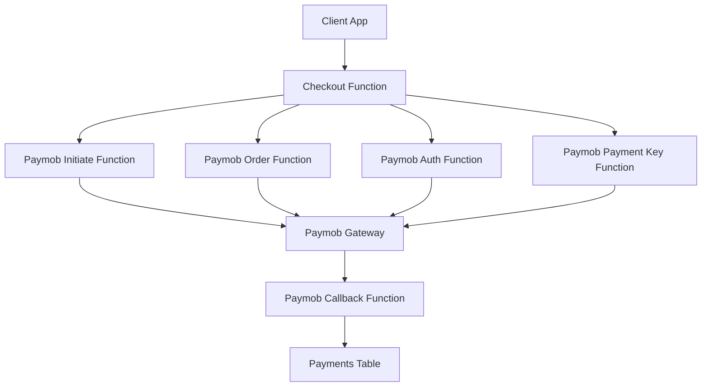
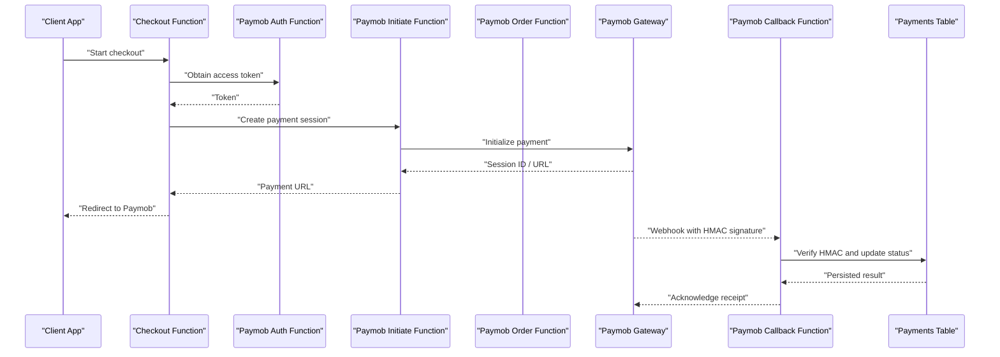
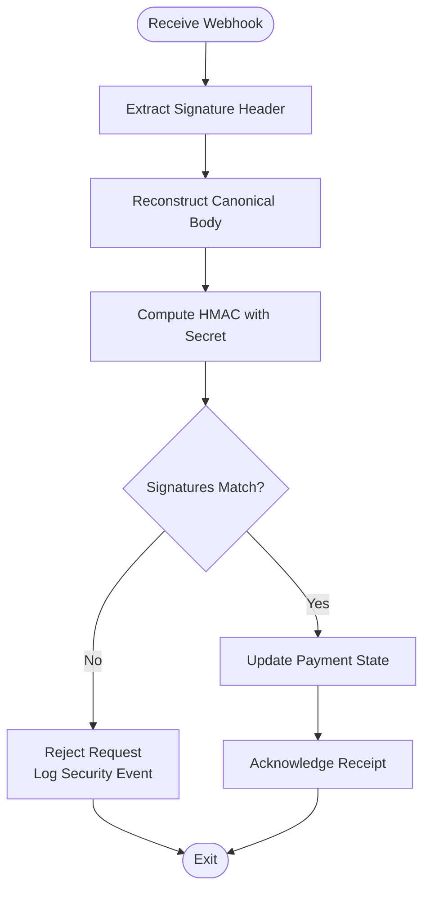
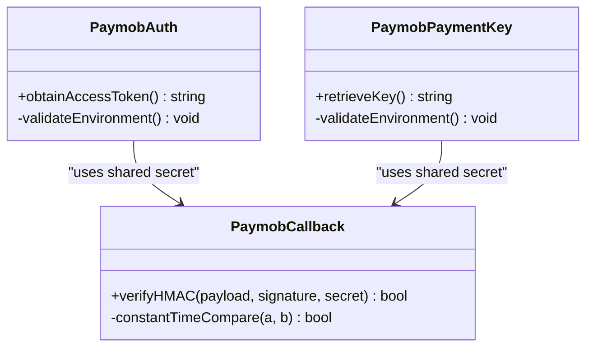
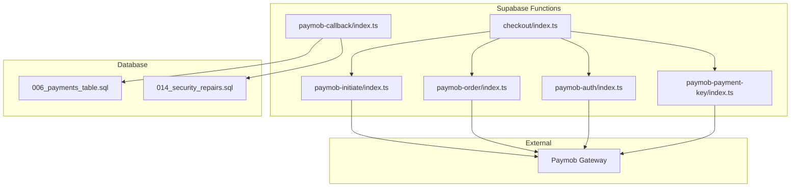

# Payment Security & Token Management

<cite>
**Referenced Files in This Document**
- [paymob-auth/index.ts](file://supabase/functions/paymob-auth/index.ts)
- [paymob-initiate/index.ts](file://supabase/functions/paymob-initiate/index.ts)
- [paymob-order/index.ts](file://supabase/functions/paymob-order/index.ts)
- [paymob-payment-key/index.ts](file://supabase/functions/paymob-payment-key/index.ts)
- [paymob-callback/index.ts](file://supabase/functions/paymob-callback/index.ts)
- [checkout/index.ts](file://supabase/functions/checkout/index.ts)
- [006_payments_table.sql](file://supabase/migrations/006_payments_table.sql)
- [014_security_repairs.sql](file://supabase/migrations/014_security_repairs.sql)
- [README.md](file://README.md)
</cite>

## Table of Contents
1. [Introduction](#introduction)
2. [Project Structure](#project-structure)
3. [Core Components](#core-components)
4. [Architecture Overview](#architecture-overview)
5. [Detailed Component Analysis](#detailed-component-analysis)
6. [Dependency Analysis](#dependency-analysis)
7. [Performance Considerations](#performance-considerations)
8. [Troubleshooting Guide](#troubleshooting-guide)
9. [Conclusion](#conclusion)
10. [Appendices](#appendices)

## Introduction
This document provides comprehensive security guidance for the Paymob payment integration, focusing on HMAC signature verification for webhook authentication, secure token handling, PCI DSS compliance considerations, and data protection measures. It also details the security repairs implemented in migration 014 and their impact on payment processing, along with guidelines for secure storage, input validation, and protection against common payment attacks. Finally, it includes security testing strategies and vulnerability assessment procedures tailored to this integration.

## Project Structure
The payment integration is implemented primarily through Supabase Edge Functions that orchestrate communication with Paymob APIs and persist payment-related state in the database. The key components include:
- Authentication and token acquisition for Paymob
- Order creation and payment initiation
- Webhook callback handling with HMAC verification
- Secure storage of payment metadata and status updates

**Diagram sources**
- [checkout/index.ts](file://supabase/functions/checkout/index.ts)
- [paymob-auth/index.ts](file://supabase/functions/paymob-auth/index.ts)
- [paymob-initiate/index.ts](file://supabase/functions/paymob-initiate/index.ts)
- [paymob-order/index.ts](file://supabase/functions/paymob-order/index.ts)
- [paymob-payment-key/index.ts](file://supabase/functions/paymob-payment-key/index.ts)
- [paymob-callback/index.ts](file://supabase/functions/paymob-callback/index.ts)
- [006_payments_table.sql](file://supabase/migrations/006_payments_table.sql)

**Section sources**
- [README.md](file://README.md)

## Core Components
- Paymob Authentication: Acquires short-lived access tokens used by subsequent API calls.
- Payment Initiation: Creates a transaction session and returns a payment URL or iframe configuration.
- Order Creation: Establishes order records and associates them with payment sessions.
- Payment Key Retrieval: Obtains necessary keys for client-side initialization securely.
- Webhook Callback: Receives asynchronous payment notifications from Paymob and verifies HMAC signatures before updating order/payment state.

Security responsibilities are concentrated in server-side functions to minimize exposure of secrets and ensure consistent validation logic.

**Section sources**
- [paymob-auth/index.ts](file://supabase/functions/paymob-auth/index.ts)
- [paymob-initiate/index.ts](file://supabase/functions/paymob-initiate/index.ts)
- [paymob-order/index.ts](file://supabase/functions/paymob-order/index.ts)
- [paymob-payment-key/index.ts](file://supabase/functions/paymob-payment-key/index.ts)
- [paymob-callback/index.ts](file://supabase/functions/paymob-callback/index.ts)

## Architecture Overview
The end-to-end flow involves client requests routed through Supabase Edge Functions, which interact with Paymob APIs and update local state. Webhooks provide asynchronous confirmation of payment outcomes.

**Diagram sources**
- [checkout/index.ts](file://supabase/functions/checkout/index.ts)
- [paymob-auth/index.ts](file://supabase/functions/paymob-auth/index.ts)
- [paymob-initiate/index.ts](file://supabase/functions/paymob-initiate/index.ts)
- [paymob-order/index.ts](file://supabase/functions/paymob-order/index.ts)
- [paymob-callback/index.ts](file://supabase/functions/paymob-callback/index.ts)
- [006_payments_table.sql](file://supabase/migrations/006_payments_table.sql)

## Detailed Component Analysis

### HMAC Signature Verification for Webhook Authentication
HMAC verification ensures that webhook payloads originate from Paymob and have not been tampered with. The typical process:
- Extract the signature header provided by Paymob.
- Reconstruct the canonical request body (exact bytes).
- Compute HMAC using the shared secret configured securely in environment variables.
- Compare computed signature with the provided signature using constant-time comparison to prevent timing attacks.
- Reject requests with invalid signatures and log security events.

**Diagram sources**
- [paymob-callback/index.ts](file://supabase/functions/paymob-callback/index.ts)

**Section sources**
- [paymob-callback/index.ts](file://supabase/functions/paymob-callback/index.ts)

### Secure Token Handling Patterns
- Access Tokens: Obtain via dedicated auth function; never expose to clients. Cache briefly if needed within server context.
- Payment Keys: Retrieve via payment key function; use only for client-side initialization where required by Paymob’s model.
- Secrets Management: Store all secrets (API keys, HMAC secrets) in environment variables accessible only to server functions. Avoid hardcoding or logging.
- Rotation: Implement periodic rotation of HMAC secrets and API keys with zero-downtime support.

**Diagram sources**
- [paymob-auth/index.ts](file://supabase/functions/paymob-auth/index.ts)
- [paymob-payment-key/index.ts](file://supabase/functions/paymob-payment-key/index.ts)
- [paymob-callback/index.ts](file://supabase/functions/paymob-callback/index.ts)

**Section sources**
- [paymob-auth/index.ts](file://supabase/functions/paymob-auth/index.ts)
- [paymob-payment-key/index.ts](file://supabase/functions/paymob-payment-key/index.ts)
- [paymob-callback/index.ts](file://supabase/functions/paymob-callback/index.ts)

### PCI DSS Compliance Considerations
- Do not store PAN, CVV, or full track data in logs, databases, or client memory.
- Use Paymob’s hosted payment flows or SDKs to offload sensitive card data handling.
- Ensure TLS everywhere for all communications with Paymob.
- Restrict access to secrets and payment-related endpoints via least privilege.
- Maintain audit trails for payment lifecycle events without capturing sensitive fields.

[No sources needed since this section provides general guidance]

### Data Protection Measures
- Encrypt sensitive fields at rest where applicable (e.g., internal identifiers linked to external references).
- Minimize data retention; purge or anonymize old payment records per policy.
- Apply strict input validation and output encoding to prevent injection and XSS.
- Use idempotency keys for payment operations to avoid duplicate charges.

[No sources needed since this section provides general guidance]

### Security Repairs in Migration 014
Migration 014 introduces security enhancements impacting payment processing:
- Enforces stricter Row-Level Security policies for payment tables.
- Adds validation constraints to prevent malformed or unauthorized updates.
- Introduces audit columns and immutable timestamps for traceability.
- Tightens permissions for service roles interacting with payment data.

Impact:
- Prevents unauthorized modification of payment records.
- Improves integrity and auditability of payment state transitions.
- Reduces risk of data leakage through misconfigured RLS policies.

**Section sources**
- [014_security_repairs.sql](file://supabase/migrations/014_security_repairs.sql)

### Input Validation and Attack Mitigation
- Validate all incoming payloads: enforce schema, length limits, and allowed character sets.
- Normalize and sanitize inputs before HMAC computation and database writes.
- Protect against replay attacks by validating timestamps and nonce values when applicable.
- Rate-limit webhook endpoints and reject suspicious patterns.

[No sources needed since this section provides general guidance]

## Dependency Analysis
The payment integration depends on environment-configured secrets and Paymob APIs. Server functions encapsulate dependencies to reduce attack surface.

**Diagram sources**
- [paymob-auth/index.ts](file://supabase/functions/paymob-auth/index.ts)
- [paymob-initiate/index.ts](file://supabase/functions/paymob-initiate/index.ts)
- [paymob-order/index.ts](file://supabase/functions/paymob-order/index.ts)
- [paymob-payment-key/index.ts](file://supabase/functions/paymob-payment-key/index.ts)
- [paymob-callback/index.ts](file://supabase/functions/paymob-callback/index.ts)
- [checkout/index.ts](file://supabase/functions/checkout/index.ts)
- [006_payments_table.sql](file://supabase/migrations/006_payments_table.sql)
- [014_security_repairs.sql](file://supabase/migrations/014_security_repairs.sql)

**Section sources**
- [paymob-auth/index.ts](file://supabase/functions/paymob-auth/index.ts)
- [paymob-initiate/index.ts](file://supabase/functions/paymob-initiate/index.ts)
- [paymob-order/index.ts](file://supabase/functions/paymob-order/index.ts)
- [paymob-payment-key/index.ts](file://supabase/functions/paymob-payment-key/index.ts)
- [paymob-callback/index.ts](file://supabase/functions/paymob-callback/index.ts)
- [checkout/index.ts](file://supabase/functions/checkout/index.ts)
- [006_payments_table.sql](file://supabase/migrations/006_payments_table.sql)
- [014_security_repairs.sql](file://supabase/migrations/014_security_repairs.sql)

## Performance Considerations
- Cache short-lived access tokens within server functions to reduce overhead.
- Batch database updates for webhook processing to minimize round trips.
- Use connection pooling and timeouts for external API calls to prevent resource exhaustion.
- Monitor latency and error rates for Paymob endpoints and implement retries with backoff.

[No sources needed since this section provides general guidance]

## Troubleshooting Guide
Common issues and resolutions:
- HMAC mismatch: Verify exact payload reconstruction and secret alignment; ensure no extra whitespace or encoding differences.
- Invalid signature headers: Confirm Paymob configuration matches expected header names.
- Unauthorized updates: Check RLS policies and service role permissions after migration 014.
- Duplicate payments: Validate idempotency keys and deduplicate webhook events.

**Section sources**
- [paymob-callback/index.ts](file://supabase/functions/paymob-callback/index.ts)
- [014_security_repairs.sql](file://supabase/migrations/014_security_repairs.sql)

## Conclusion
This integration centralizes security-sensitive operations in server-side functions, enforces robust HMAC verification for webhooks, and applies stricter database protections via migration 014. Adhering to PCI DSS principles, minimizing data exposure, and implementing rigorous input validation and testing will further strengthen the system against payment-related threats.

[No sources needed since this section summarizes without analyzing specific files]

## Appendices

### Secure Storage Guidelines
- Store secrets in environment variables; never commit to version control.
- Limit access to secrets using least privilege roles.
- Rotate secrets regularly and maintain rollback plans.
- Log only non-sensitive identifiers and outcomes.

[No sources needed since this section provides general guidance]

### Security Testing Strategies
- Unit tests for HMAC verification with known payloads and secrets.
- Integration tests simulating webhook delivery with valid and invalid signatures.
- Penetration testing focused on input validation and authorization bypass.
- Audit checks for RLS policies and secret exposure.

[No sources needed since this section provides general guidance]

### Vulnerability Assessment Procedures
- Review code paths handling Paymob callbacks for timing leaks and injection risks.
- Validate TLS configurations and certificate pinning where applicable.
- Assess dependency vulnerabilities and apply patches promptly.
- Conduct periodic reviews of RLS policies and service role permissions.

[No sources needed since this section provides general guidance]