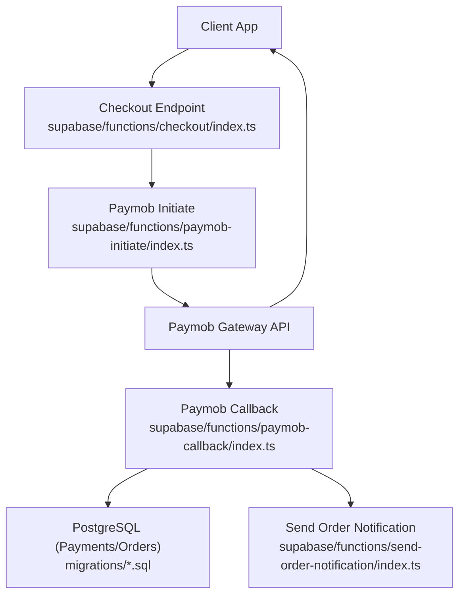
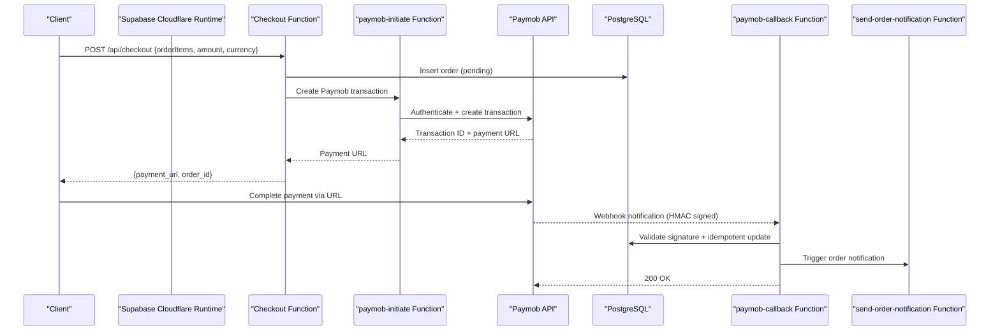
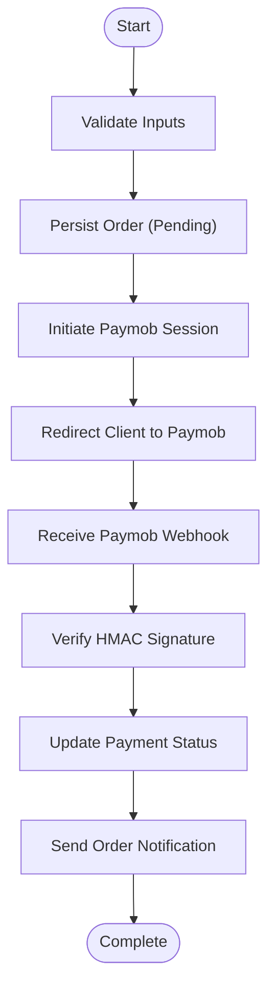
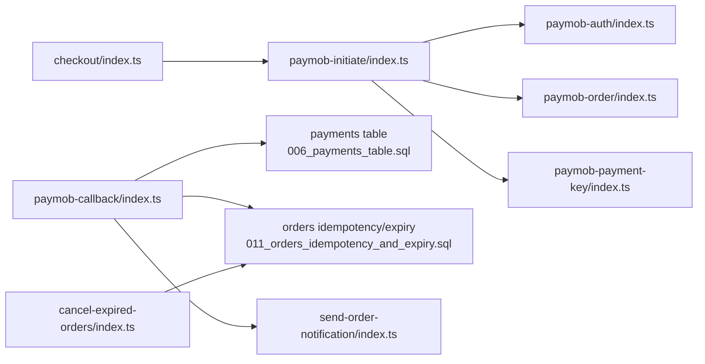

# Paymob API Endpoints & Webhooks

<cite>
**Referenced Files in This Document**
- [supabase/functions/paymob-initiate/index.ts](file://supabase/functions/paymob-initiate/index.ts)
- [supabase/functions/paymob-callback/index.ts](file://supabase/functions/paymob-callback/index.ts)
- [supabase/functions/checkout/index.ts](file://supabase/functions/checkout/index.ts)
- [supabase/functions/paymob-auth/index.ts](file://supabase/functions/paymob-auth/index.ts)
- [supabase/functions/paymob-order/index.ts](file://supabase/functions/paymob-order/index.ts)
- [supabase/functions/paymob-payment-key/index.ts](file://supabase/functions/paymob-payment-key/index.ts)
- [supabase/migrations/006_payments_table.sql](file://supabase/migrations/006_payments_table.sql)
- [supabase/migrations/011_orders_idempotency_and_expiry.sql](file://supabase/migrations/011_orders_idempotency_and_expiry.sql)
- [supabase/functions/cancel-expired-orders/index.ts](file://supabase/functions/cancel-expired-orders/index.ts)
- [supabase/functions/send-order-notification/index.ts](file://supabase/functions/send-order-notification/index.ts)
</cite>

## Table of Contents
1. [Introduction](#introduction)
2. [Project Structure](#project-structure)
3. [Core Components](#core-components)
4. [Architecture Overview](#architecture-overview)
5. [Detailed Component Analysis](#detailed-component-analysis)
6. [Dependency Analysis](#dependency-analysis)
7. [Performance Considerations](#performance-considerations)
8. [Troubleshooting Guide](#troubleshooting-guide)
9. [Conclusion](#conclusion)

## Introduction
This document provides comprehensive API documentation for the Paymob payment gateway integration exposed via Supabase Edge Functions. It covers:
- paymob-initiate: Create a Paymob payment session and return an iframe URL or redirect link to complete payment.
- checkout: Orchestrate the end-to-end payment flow, including order creation, session initiation, and client redirection.
- paymob-callback: Process Paymob webhook notifications, validate HMAC signatures, update payment status, and trigger downstream actions.

It also explains authentication headers, request/response schemas, error handling, retry mechanisms, and how asynchronous processing is handled through Supabase Edge Functions and database tables.

## Project Structure
The Paymob integration is implemented as a set of Supabase Edge Functions that expose HTTP endpoints and interact with the application’s PostgreSQL database (via migrations). The key files are:
- paymob-initiate: Creates a Paymob transaction and returns a payment URL.
- checkout: Orchestrates order creation and initiates payment.
- paymob-callback: Receives and validates Paymob webhooks, updates payments, and triggers notifications.
- Supporting functions: paymob-auth, paymob-order, paymob-payment-key, cancel-expired-orders, send-order-notification.

**Diagram sources**
- [supabase/functions/checkout/index.ts](file://supabase/functions/checkout/index.ts)
- [supabase/functions/paymob-initiate/index.ts](file://supabase/functions/paymob-initiate/index.ts)
- [supabase/functions/paymob-callback/index.ts](file://supabase/functions/paymob-callback/index.ts)
- [supabase/migrations/006_payments_table.sql](file://supabase/migrations/006_payments_table.sql)
- [supabase/migrations/011_orders_idempotency_and_expiry.sql](file://supabase/migrations/011_orders_idempotency_and_expiry.sql)
- [supabase/functions/send-order-notification/index.ts](file://supabase/functions/send-order-notification/index.ts)

## Core Components
- paymob-initiate endpoint: Authenticates with Paymob, creates a transaction, and returns a payment URL for the client to open in an iframe or redirect.
- checkout endpoint: Validates inputs, persists an order, calls paymob-initiate, and returns the payment URL to the client.
- paymob-callback handler: Verifies HMAC signature from Paymob, validates payload, updates payment status idempotently, and triggers notifications.

Key responsibilities:
- Authentication and secret management via environment variables.
- Idempotent updates on callback to handle retries safely.
- Clear error responses with actionable codes.
- Asynchronous processing using Edge Functions and background tasks.

**Section sources**
- [supabase/functions/paymob-initiate/index.ts](file://supabase/functions/paymob-initiate/index.ts)
- [supabase/functions/checkout/index.ts](file://supabase/functions/checkout/index.ts)
- [supabase/functions/paymob-callback/index.ts](file://supabase/functions/paymob-callback/index.ts)
- [supabase/migrations/006_payments_table.sql](file://supabase/migrations/006_payments_table.sql)
- [supabase/migrations/011_orders_idempotency_and_expiry.sql](file://supabase/migrations/011_orders_idempotency_and_expiry.sql)

## Architecture Overview
The payment flow uses Supabase Edge Functions to securely communicate with Paymob while maintaining idempotency and auditability in the database.

**Diagram sources**
- [supabase/functions/checkout/index.ts](file://supabase/functions/checkout/index.ts)
- [supabase/functions/paymob-initiate/index.ts](file://supabase/functions/paymob-initiate/index.ts)
- [supabase/functions/paymob-callback/index.ts](file://supabase/functions/paymob-callback/index.ts)
- [supabase/functions/send-order-notification/index.ts](file://supabase/functions/send-order-notification/index.ts)
- [supabase/migrations/006_payments_table.sql](file://supabase/migrations/006_payments_table.sql)
- [supabase/migrations/011_orders_idempotency_and_expiry.sql](file://supabase/migrations/011_orders_idempotency_and_expiry.sql)

## Detailed Component Analysis

### paymob-initiate Endpoint
Purpose:
- Authenticate with Paymob using stored credentials.
- Create a transaction for the given order details.
- Return a payment URL for the client to render in an iframe or redirect.

Authentication:
- Requires a valid JWT token issued by your backend/auth system.
- Pass Authorization header: Bearer <token>.

Request parameters:
- order_id: string, unique identifier for the order.
- amount: number, total amount in minor units (e.g., cents).
- currency: string, ISO 4217 code (e.g., USD, EGP).
- billing_email: string, optional customer email.
- billing_phone: string, optional customer phone.
- metadata: object, optional arbitrary data for tracking.

Response schema:
- success: boolean
- payment_url: string, Paymob iframe/redirect URL
- transaction_id: string, Paymob transaction reference
- message: string, human-readable status

Error responses:
- 401 Unauthorized: Invalid or missing token.
- 400 Bad Request: Missing or invalid fields.
- 500 Internal Server Error: Paymob API failure or internal error.

Retry mechanism:
- If Paymob returns transient errors, implement exponential backoff with jitter on the client side.
- Ensure idempotency by passing a stable order_id; do not generate new sessions for the same order unless explicitly required.

Idempotency considerations:
- Use order_id to avoid duplicate transactions.
- If a transaction already exists for the order, return the existing payment_url rather than creating a new one.

**Section sources**
- [supabase/functions/paymob-initiate/index.ts](file://supabase/functions/paymob-initiate/index.ts)
- [supabase/functions/paymob-auth/index.ts](file://supabase/functions/paymob-auth/index.ts)
- [supabase/functions/paymob-order/index.ts](file://supabase/functions/paymob-order/index.ts)
- [supabase/functions/paymob-payment-key/index.ts](file://supabase/functions/paymob-payment-key/index.ts)

### checkout Endpoint
Purpose:
- Orchestrate the full payment flow: validate inputs, persist order, initiate Paymob session, and return payment URL.

Authentication:
- Requires a valid JWT token.
- Authorization header: Bearer <token>.

Request parameters:
- items: array of objects with product_id, quantity, unit_price.
- shipping_address: object with street, city, postal_code, country.
- amount: number, total amount in minor units.
- currency: string, ISO 4217 code.
- customer_email: string, required for receipts and notifications.
- customer_phone: string, optional.
- metadata: object, optional.

Response schema:
- success: boolean
- order_id: string, persisted order identifier
- payment_url: string, Paymob payment URL
- expires_at: timestamp, order/session expiry time

Error responses:
- 400 Bad Request: Validation failures (missing fields, invalid amounts).
- 401 Unauthorized: Invalid token.
- 409 Conflict: Duplicate order submission detected.
- 500 Internal Server Error: Database or Paymob errors.

Flow highlights:
- Validates and normalizes input.
- Persists order with pending status.
- Calls paymob-initiate to obtain payment_url.
- Returns both order_id and payment_url to the client.

Idempotency:
- Enforce uniqueness constraints on order identifiers to prevent duplicates.
- On conflict, return existing order_id and payment_url if available.

**Section sources**
- [supabase/functions/checkout/index.ts](file://supabase/functions/checkout/index.ts)
- [supabase/migrations/011_orders_idempotency_and_expiry.sql](file://supabase/migrations/011_orders_idempotency_and_expiry.sql)

### paymob-callback Webhook Handler
Purpose:
- Receive and process Paymob payment notifications.
- Verify HMAC signature to ensure authenticity.
- Update payment status idempotently.
- Trigger downstream actions such as order fulfillment notifications.

Authentication and security:
- Verify HMAC signature using the shared secret configured in environment variables.
- Reject requests with invalid or missing signatures.

Payload validation:
- Ensure required fields exist (transaction_id, order_id, amount, currency, status).
- Validate numeric fields and currency codes.
- Check that the amount matches the expected value for the order.

Status updates:
- Map Paymob statuses to internal states (e.g., paid, failed, refunded).
- Update payments table and related orders atomically.
- Handle partial refunds and chargebacks if applicable.

Downstream actions:
- Send order confirmation/notification via send-order-notification function.
- Log events for auditing and analytics.

Error handling:
- Return 200 OK only after successful processing to acknowledge receipt.
- For validation/signature failures, return 400/401 with descriptive messages.
- For transient errors, return 500 to prompt Paymob to retry.

Idempotency:
- Use transaction_id as the idempotency key to avoid duplicate updates.
- Skip processing if the payment has already been updated to the same state.

Retry behavior:
- Paymob will retry failed callbacks; ensure handlers are idempotent.
- Implement exponential backoff on your side if calling external services.

**Section sources**
- [supabase/functions/paymob-callback/index.ts](file://supabase/functions/paymob-callback/index.ts)
- [supabase/migrations/006_payments_table.sql](file://supabase/migrations/006_payments_table.sql)
- [supabase/functions/send-order-notification/index.ts](file://supabase/functions/send-order-notification/index.ts)

### Conceptual Overview
The following conceptual diagram illustrates the overall payment lifecycle without mapping to specific source files:

[No sources needed since this diagram shows conceptual workflow, not actual code structure]

## Dependency Analysis
The components depend on each other and on external systems as follows:

**Diagram sources**
- [supabase/functions/checkout/index.ts](file://supabase/functions/checkout/index.ts)
- [supabase/functions/paymob-initiate/index.ts](file://supabase/functions/paymob-initiate/index.ts)
- [supabase/functions/paymob-auth/index.ts](file://supabase/functions/paymob-auth/index.ts)
- [supabase/functions/paymob-order/index.ts](file://supabase/functions/paymob-order/index.ts)
- [supabase/functions/paymob-payment-key/index.ts](file://supabase/functions/paymob-payment-key/index.ts)
- [supabase/functions/paymob-callback/index.ts](file://supabase/functions/paymob-callback/index.ts)
- [supabase/migrations/006_payments_table.sql](file://supabase/migrations/006_payments_table.sql)
- [supabase/migrations/011_orders_idempotency_and_expiry.sql](file://supabase/migrations/011_orders_idempotency_and_expiry.sql)
- [supabase/functions/cancel-expired-orders/index.ts](file://supabase/functions/cancel-expired-orders/index.ts)
- [supabase/functions/send-order-notification/index.ts](file://supabase/functions/send-order-notification/index.ts)

**Section sources**
- [supabase/functions/checkout/index.ts](file://supabase/functions/checkout/index.ts)
- [supabase/functions/paymob-initiate/index.ts](file://supabase/functions/paymob-initiate/index.ts)
- [supabase/functions/paymob-callback/index.ts](file://supabase/functions/paymob-callback/index.ts)
- [supabase/migrations/006_payments_table.sql](file://supabase/migrations/006_payments_table.sql)
- [supabase/migrations/011_orders_idempotency_and_expiry.sql](file://supabase/migrations/011_orders_idempotency_and_expiry.sql)
- [supabase/functions/cancel-expired-orders/index.ts](file://supabase/functions/cancel-expired-orders/index.ts)
- [supabase/functions/send-order-notification/index.ts](file://supabase/functions/send-order-notification/index.ts)

## Performance Considerations
- Keep Edge Functions lightweight; delegate heavy work to background tasks or queues where possible.
- Cache Paymob auth tokens to reduce latency and rate limit exposure.
- Use database indexes on frequently queried fields (order_id, transaction_id, status).
- Avoid synchronous calls to slow external services within critical paths; prefer async notifications.
- Monitor timeouts and configure appropriate limits for network calls.

[No sources needed since this section provides general guidance]

## Troubleshooting Guide
Common issues and resolutions:
- Invalid HMAC signature:
  - Ensure the shared secret used to verify the signature matches the one configured in Paymob.
  - Confirm the raw body is used for verification (no extra whitespace or transformations).
- Duplicate payments:
  - Verify idempotency logic based on transaction_id.
  - Check database constraints and upsert operations.
- Expired orders:
  - Use cancel-expired-orders function to periodically clean up stale orders.
- Network errors:
  - Implement retries with exponential backoff for external calls.
  - Log detailed error contexts for debugging.

Operational checks:
- Inspect logs in Supabase dashboard for function execution details.
- Validate database records in payments and orders tables for consistency.
- Test webhook delivery using Paymock or similar tools.

**Section sources**
- [supabase/functions/paymob-callback/index.ts](file://supabase/functions/paymob-callback/index.ts)
- [supabase/functions/cancel-expired-orders/index.ts](file://supabase/functions/cancel-expired-orders/index.ts)
- [supabase/migrations/006_payments_table.sql](file://supabase/migrations/006_payments_table.sql)
- [supabase/migrations/011_orders_idempotency_and_expiry.sql](file://supabase/migrations/011_orders_idempotency_and_expiry.sql)

## Conclusion
The Paymob integration leverages Supabase Edge Functions to provide secure, idempotent, and observable payment processing. By separating concerns across checkout, initiate, and callback functions, the system maintains clarity and resilience. Proper authentication, signature verification, and idempotency ensure correctness under retries and concurrent access. Monitoring and logging should be enabled to facilitate troubleshooting and continuous improvement.