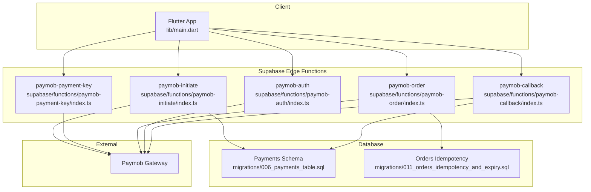
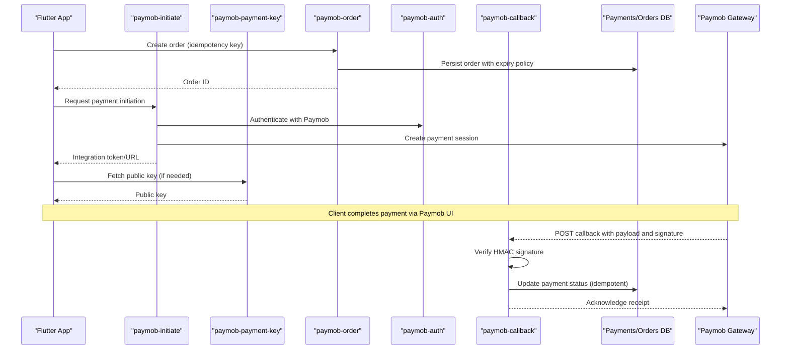
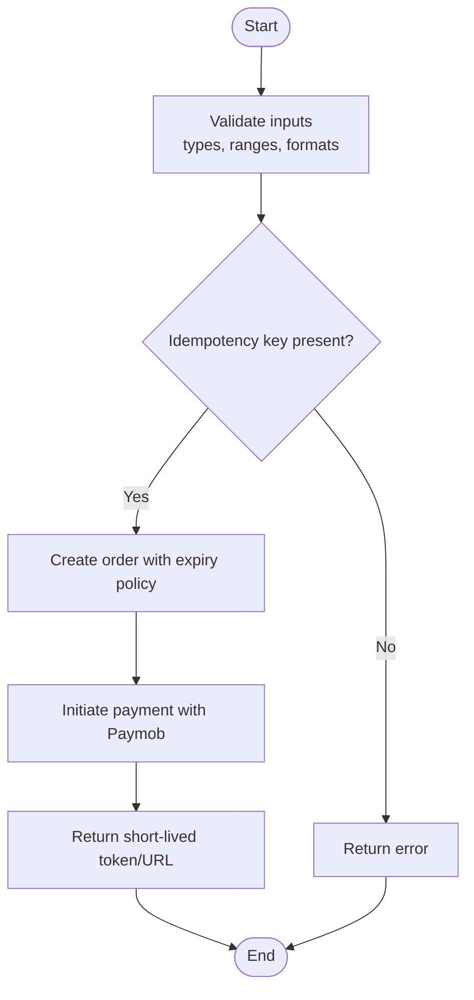
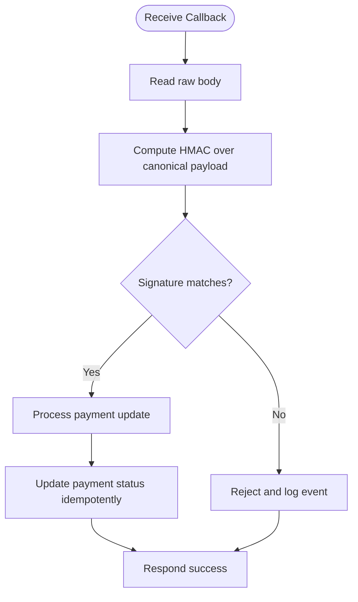
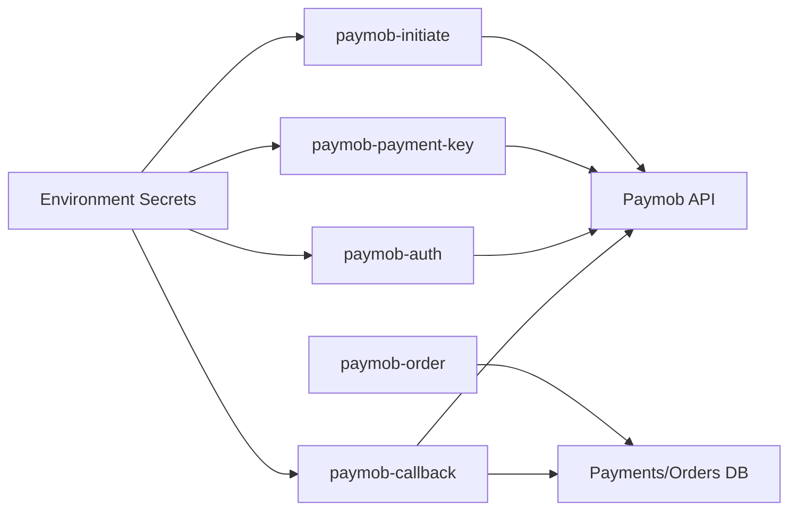

# Payment Security & Compliance

<cite>
**Referenced Files in This Document**
- [supabase/functions/paymob-initiate/index.ts](file://supabase/functions/paymob-initiate/index.ts)
- [supabase/functions/paymob-payment-key/index.ts](file://supabase/functions/paymob-payment-key/index.ts)
- [supabase/functions/paymob-order/index.ts](file://supabase/functions/paymob-order/index.ts)
- [supabase/functions/paymob-auth/index.ts](file://supabase/functions/paymob-auth/index.ts)
- [supabase/functions/paymob-callback/index.ts](file://supabase/functions/paymob-callback/index.ts)
- [supabase/migrations/006_payments_table.sql](file://supabase/migrations/006_payments_table.sql)
- [supabase/migrations/011_orders_idempotency_and_expiry.sql](file://supabase/migrations/011_orders_idempotency_and_expiry.sql)
- [lib/main.dart](file://lib/main.dart)
- [test/payment_integration_test.dart](file://test/payment_integration_test.dart)
- [secrets-staging.env](file://secrets-staging.env)
</cite>

## Table of Contents
1. [Introduction](#introduction)
2. [Project Structure](#project-structure)
3. [Core Components](#core-components)
4. [Architecture Overview](#architecture-overview)
5. [Detailed Component Analysis](#detailed-component-analysis)
6. [Dependency Analysis](#dependency-analysis)
7. [Performance Considerations](#performance-considerations)
8. [Troubleshooting Guide](#troubleshooting-guide)
9. [Conclusion](#conclusion)
10. [Appendices](#appendices)

## Introduction
This document provides comprehensive security documentation for payment processing and PCI compliance within the project. It focuses on token leak prevention, secure payment flow hardening, HMAC signature verification, secure communication protocols, vulnerability mitigation strategies, and audit trails. It also outlines compliance requirements (PCI DSS), encryption at rest and in transit, secure key management, security testing guidelines, penetration testing approaches, and incident response procedures tailored to payment-related issues.

## Project Structure
The payment system is implemented primarily through Supabase Edge Functions that orchestrate interactions with Paymob, along with database migrations for payments and orders. The Flutter application integrates with these functions via HTTPS endpoints.

**Diagram sources**
- [supabase/functions/paymob-initiate/index.ts](file://supabase/functions/paymob-initiate/index.ts)
- [supabase/functions/paymob-payment-key/index.ts](file://supabase/functions/paymob-payment-key/index.ts)
- [supabase/functions/paymob-order/index.ts](file://supabase/functions/paymob-order/index.ts)
- [supabase/functions/paymob-auth/index.ts](file://supabase/functions/paymob-auth/index.ts)
- [supabase/functions/paymob-callback/index.ts](file://supabase/functions/paymob-callback/index.ts)
- [supabase/migrations/006_payments_table.sql](file://supabase/migrations/006_payments_table.sql)
- [supabase/migrations/011_orders_idempotency_and_expiry.sql](file://supabase/migrations/011_orders_idempotency_and_expiry.sql)
- [lib/main.dart](file://lib/main.dart)

**Section sources**
- [lib/main.dart](file://lib/main.dart)
- [supabase/functions/paymob-initiate/index.ts](file://supabase/functions/paymob-initiate/index.ts)
- [supabase/functions/paymob-payment-key/index.ts](file://supabase/functions/paymob-payment-key/index.ts)
- [supabase/functions/paymob-order/index.ts](file://supabase/functions/paymob-order/index.ts)
- [supabase/functions/paymob-auth/index.ts](file://supabase/functions/paymob-auth/index.ts)
- [supabase/functions/paymob-callback/index.ts](file://supabase/functions/paymob-callback/index.ts)
- [supabase/migrations/006_payments_table.sql](file://supabase/migrations/006_payments_table.sql)
- [supabase/migrations/011_orders_idempotency_and_expiry.sql](file://supabase/migrations/011_orders_idempotency_and_expiry.sql)

## Core Components
- paymob-initiate: Initializes a payment session with Paymob and returns a client-side integration token or URL.
- paymob-payment-key: Retrieves a short-lived public key for client-side operations where applicable.
- paymob-order: Creates or updates an order record before initiating payment.
- paymob-auth: Performs authentication steps required by Paymob.
- paymob-callback: Receives and verifies asynchronous payment callbacks from Paymob, validates signatures, and updates payment status.
- Database schemas: Payments table and orders idempotency/expiry policies ensure durable, auditable records and prevent duplicate processing.

Security responsibilities:
- Server-side only secrets handling (API keys, HMAC secret).
- Strict input validation and output encoding.
- Signature verification for all Paymob callbacks.
- Idempotent order creation and payment updates.
- Secure logging without sensitive data.

**Section sources**
- [supabase/functions/paymob-initiate/index.ts](file://supabase/functions/paymob-initiate/index.ts)
- [supabase/functions/paymob-payment-key/index.ts](file://supabase/functions/paymob-payment-key/index.ts)
- [supabase/functions/paymob-order/index.ts](file://supabase/functions/paymob-order/index.ts)
- [supabase/functions/paymob-auth/index.ts](file://supabase/functions/paymob-auth/index.ts)
- [supabase/functions/paymob-callback/index.ts](file://supabase/functions/paymob-callback/index.ts)
- [supabase/migrations/006_payments_table.sql](file://supabase/migrations/006_payments_table.sql)
- [supabase/migrations/011_orders_idempotency_and_expiry.sql](file://supabase/migrations/011_orders_idempotency_and_expiry.sql)

## Architecture Overview
The secure payment architecture enforces a server-mediated flow to avoid exposing sensitive credentials or card data to the client. All cryptographic operations and secret access occur within trusted serverless functions.

**Diagram sources**
- [supabase/functions/paymob-initiate/index.ts](file://supabase/functions/paymob-initiate/index.ts)
- [supabase/functions/paymob-payment-key/index.ts](file://supabase/functions/paymob-payment-key/index.ts)
- [supabase/functions/paymob-order/index.ts](file://supabase/functions/paymob-order/index.ts)
- [supabase/functions/paymob-auth/index.ts](file://supabase/functions/paymob-auth/index.ts)
- [supabase/functions/paymob-callback/index.ts](file://supabase/functions/paymob-callback/index.ts)
- [supabase/migrations/006_payments_table.sql](file://supabase/migrations/006_payments_table.sql)
- [supabase/migrations/011_orders_idempotency_and_expiry.sql](file://supabase/migrations/011_orders_idempotency_and_expiry.sql)

## Detailed Component Analysis

### Token Leak Prevention
- Never log or return tokens beyond what is necessary; mask or redact any sensitive values in logs.
- Use short-lived tokens and restrict their scope.
- Enforce HTTPS-only transport and Content Security Policy for web targets.
- Avoid storing tokens in persistent storage unless absolutely required; prefer ephemeral memory.

Implementation anchors:
- Ensure initialization and key retrieval functions do not echo back secrets or long-lived tokens.
- Validate request origins and enforce strict CORS if applicable.

**Section sources**
- [supabase/functions/paymob-initiate/index.ts](file://supabase/functions/paymob-initiate/index.ts)
- [supabase/functions/paymob-payment-key/index.ts](file://supabase/functions/paymob-payment-key/index.ts)

### Secure Payment Flow Hardening
- Server-side orchestration: All calls to Paymob must originate from serverless functions.
- Idempotency: Use unique idempotency keys for order creation and payment updates to prevent duplicates.
- Timeouts and retries: Apply bounded timeouts and exponential backoff for external calls.
- Least privilege: Limit function permissions to only required database tables and columns.

**Diagram sources**
- [supabase/functions/paymob-order/index.ts](file://supabase/functions/paymob-order/index.ts)
- [supabase/migrations/011_orders_idempotency_and_expiry.sql](file://supabase/migrations/011_orders_idempotency_and_expiry.sql)

**Section sources**
- [supabase/functions/paymob-order/index.ts](file://supabase/functions/paymob-order/index.ts)
- [supabase/migrations/011_orders_idempotency_and_expiry.sql](file://supabase/migrations/011_orders_idempotency_and_expiry.sql)

### HMAC Signature Verification Implementation
- Always verify the HMAC signature provided by Paymob using the shared secret stored securely in environment variables.
- Recompute the signature over the canonical request body and compare it against the provided value.
- Reject requests with invalid or missing signatures and log non-sensitive details for auditing.

**Diagram sources**
- [supabase/functions/paymob-callback/index.ts](file://supabase/functions/paymob-callback/index.ts)

**Section sources**
- [supabase/functions/paymob-callback/index.ts](file://supabase/functions/paymob-callback/index.ts)

### Secure Communication Protocols
- Enforce TLS 1.2+ for all communications with Paymob and internal services.
- Validate certificates and avoid disabling certificate checks.
- Use HTTPS-only cookies and headers where applicable.

**Section sources**
- [supabase/functions/paymob-initiate/index.ts](file://supabase/functions/paymob-initiate/index.ts)
- [supabase/functions/paymob-payment-key/index.ts](file://supabase/functions/paymob-payment-key/index.ts)
- [supabase/functions/paymob-auth/index.ts](file://supabase/functions/paymob-auth/index.ts)

### Vulnerability Mitigation Strategies
- Input validation: Strictly validate types, lengths, enums, and formats for all incoming parameters.
- Output encoding: Encode outputs to prevent injection when rendering or forwarding data.
- Rate limiting and throttling: Protect endpoints from abuse.
- Secrets management: Store secrets in environment variables; never commit them to source control.

**Section sources**
- [supabase/functions/paymob-callback/index.ts](file://supabase/functions/paymob-callback/index.ts)
- [supabase/functions/paymob-initiate/index.ts](file://supabase/functions/paymob-initiate/index.ts)
- [secrets-staging.env](file://secrets-staging.env)

### Audit Trails for Payment Transactions
- Record immutable audit entries for critical events: order creation, payment initiation, callback receipt, signature verification results, and status changes.
- Include correlation IDs and timestamps; exclude sensitive data.

**Section sources**
- [supabase/migrations/006_payments_table.sql](file://supabase/migrations/006_payments_table.sql)
- [supabase/migrations/011_orders_idempotency_and_expiry.sql](file://supabase/migrations/011_orders_idempotency_and_expiry.sql)

## Dependency Analysis
The payment subsystem depends on:
- External Paymob API for authentication, session creation, and callbacks.
- Database schema for payments and orders with idempotency and expiry constraints.
- Environment configuration for secrets.

**Diagram sources**
- [supabase/functions/paymob-initiate/index.ts](file://supabase/functions/paymob-initiate/index.ts)
- [supabase/functions/paymob-payment-key/index.ts](file://supabase/functions/paymob-payment-key/index.ts)
- [supabase/functions/paymob-order/index.ts](file://supabase/functions/paymob-order/index.ts)
- [supabase/functions/paymob-auth/index.ts](file://supabase/functions/paymob-auth/index.ts)
- [supabase/functions/paymob-callback/index.ts](file://supabase/functions/paymob-callback/index.ts)
- [supabase/migrations/006_payments_table.sql](file://supabase/migrations/006_payments_table.sql)
- [supabase/migrations/011_orders_idempotency_and_expiry.sql](file://supabase/migrations/011_orders_idempotency_and_expiry.sql)
- [secrets-staging.env](file://secrets-staging.env)

**Section sources**
- [supabase/functions/paymob-initiate/index.ts](file://supabase/functions/paymob-initiate/index.ts)
- [supabase/functions/paymob-payment-key/index.ts](file://supabase/functions/paymob-payment-key/index.ts)
- [supabase/functions/paymob-order/index.ts](file://supabase/functions/paymob-order/index.ts)
- [supabase/functions/paymob-auth/index.ts](file://supabase/functions/paymob-auth/index.ts)
- [supabase/functions/paymob-callback/index.ts](file://supabase/functions/paymob-callback/index.ts)
- [supabase/migrations/006_payments_table.sql](file://supabase/migrations/006_payments_table.sql)
- [supabase/migrations/011_orders_idempotency_and_expiry.sql](file://supabase/migrations/011_orders_idempotency_and_expiry.sql)
- [secrets-staging.env](file://secrets-staging.env)

## Performance Considerations
- Minimize network round-trips by batching operations where safe.
- Cache non-sensitive, short-lived data appropriately.
- Use connection pooling and keep-alive for outbound HTTP calls.
- Monitor latency and errors; set appropriate timeouts and circuit breakers.

[No sources needed since this section provides general guidance]

## Troubleshooting Guide
Common issues and mitigations:
- Invalid HMAC signature: Ensure canonical payload construction matches provider expectations; verify secret alignment across environments.
- Duplicate payments: Confirm idempotency keys are unique per attempt and persisted correctly.
- Expired orders: Align order expiry policies with expected user interaction windows.
- Certificate errors: Validate TLS settings and CA bundles.

Operational checks:
- Inspect logs for non-sensitive diagnostic information.
- Re-run tests against staging with sanitized payloads.

**Section sources**
- [supabase/functions/paymob-callback/index.ts](file://supabase/functions/paymob-callback/index.ts)
- [supabase/migrations/011_orders_idempotency_and_expiry.sql](file://supabase/migrations/011_orders_idempotency_and_expiry.sql)

## Conclusion
By centralizing secrets, enforcing strict input validation, verifying HMAC signatures, and maintaining idempotent, auditable transactions, the payment system aligns with PCI DSS principles and reduces exposure to common vulnerabilities. Continuous security testing, robust monitoring, and clear incident response procedures further strengthen resilience.

[No sources needed since this section summarizes without analyzing specific files]

## Appendices

### PCI DSS Alignment Checklist
- Restrict cardholder data exposure to minimal, necessary fields.
- Encrypt data in transit with strong ciphers and validated certificates.
- Encrypt sensitive data at rest using approved algorithms and key management.
- Maintain secure configurations and change control processes.
- Implement logging and monitoring with alerting for anomalies.
- Conduct regular vulnerability scans and penetration tests.

[No sources needed since this section provides general guidance]

### Security Testing Guidelines
- Unit tests for input validation and HMAC verification logic.
- Integration tests simulating Paymob callbacks with valid and invalid signatures.
- Fuzzing of request bodies and edge cases.
- Secret rotation drills and environment parity checks.

**Section sources**
- [test/payment_integration_test.dart](file://test/payment_integration_test.dart)

### Penetration Testing Approaches
- Focus on payment flows: initiation, callback processing, and state transitions.
- Attempt token leakage via logs, responses, and error messages.
- Test idempotency bypasses and race conditions.
- Validate TLS configuration and certificate pinning (where applicable).

[No sources needed since this section provides general guidance]

### Incident Response Procedures
- Detect: Alert on failed signature verifications, unexpected payment states, and high error rates.
- Contain: Temporarily disable affected endpoints and rotate compromised secrets.
- Eradicate: Patch vulnerabilities and remove malicious artifacts.
- Recover: Restore from verified backups and re-validate integrations.
- Lessons Learned: Update controls, tests, and runbooks based on findings.

[No sources needed since this section provides general guidance]