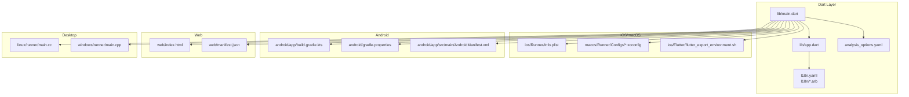
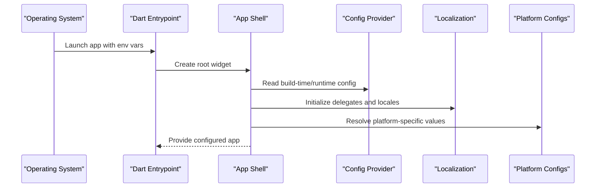
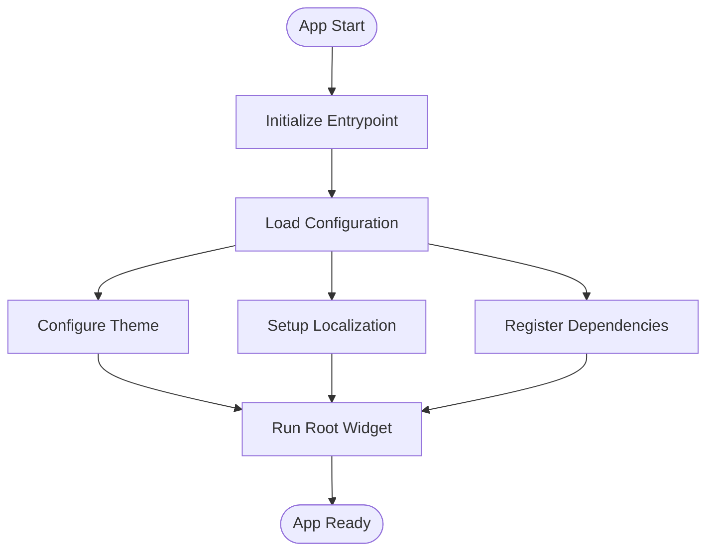
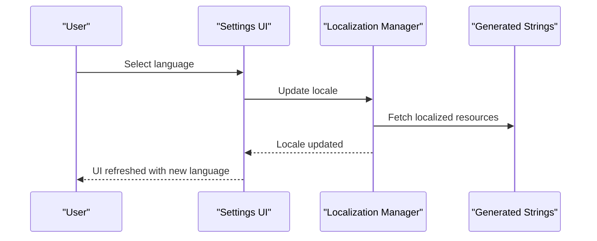
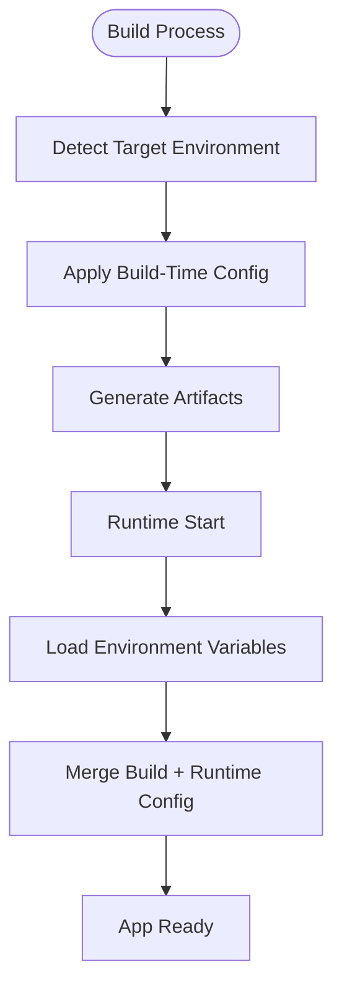
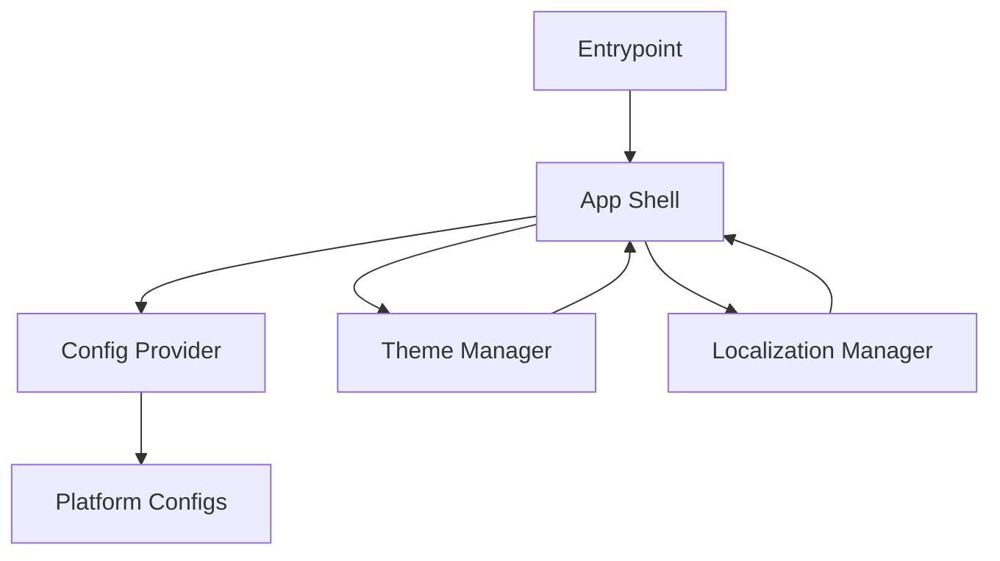

# Configuration & Environment Management

<cite>
**Referenced Files in This Document**
- [main.dart](file://lib/main.dart)
- [app.dart](file://lib/app.dart)
- [pubspec.yaml](file://pubspec.yaml)
- [l10n.yaml](file://l10n.yaml)
- [analysis_options.yaml](file://analysis_options.yaml)
- [secrets-staging.env](file://secrets-staging.env)
- [flutter_export_environment.sh](file://ios/Flutter/flutter_export_environment.sh)
- [AppInfo.xcconfig](file://macos/Runner/Configs/AppInfo.xcconfig)
- [Debug.xcconfig](file://macos/Runner/Configs/Debug.xcconfig)
- [Release.xcconfig](file://macos/Runner/Configs/Release.xcconfig)
- [Warnings.xcconfig](file://macos/Runner/Configs/Warnings.xcconfig)
- [build.gradle.kts](file://android/build.gradle.kts)
- [app/build.gradle.kts](file://android/app/build.gradle.kts)
- [gradle.properties](file://android/gradle.properties)
- [AndroidManifest.xml](file://android/app/src/main/AndroidManifest.xml)
- [Info.plist](file://ios/Runner/Info.plist)
- [AppDelegate.swift](file://ios/Runner/AppDelegate.swift)
- [SceneDelegate.swift](file://ios/Runner/SceneDelegate.swift)
- [main.cc](file://linux/runner/main.cc)
- [my_application.h](file://linux/runner/my_application.h)
- [main.cpp](file://windows/runner/main.cpp)
- [win32_window.h](file://windows/runner/win32_window.h)
- [index.html](file://web/index.html)
- [manifest.json](file://web/manifest.json)
- [app_en.arb](file://l10n/app_en.arb)
- [app_ar.arb](file://l10n/app_ar.arb)
</cite>

## Table of Contents
1. [Introduction](#introduction)
2. [Project Structure](#project-structure)
3. [Core Components](#core-components)
4. [Architecture Overview](#architecture-overview)
5. [Detailed Component Analysis](#detailed-component-analysis)
6. [Dependency Analysis](#dependency-analysis)
7. [Performance Considerations](#performance-considerations)
8. [Troubleshooting Guide](#troubleshooting-guide)
9. [Conclusion](#conclusion)
10. [Appendices](#appendices)

## Introduction
This document explains how the application initializes, manages configuration and environment settings, and supports theming and localization. It covers:
- App initialization and dependency injection setup
- Global configuration management across platforms
- Theme configuration and language switching mechanisms
- Environment-specific configurations and secret management
- Build-time vs runtime configuration
- How to add new configuration options
- Development tooling, analysis options, and linting rules

## Project Structure
Configuration-related files are distributed across platform-specific directories and shared Dart code:
- Dart entry points and app shell: lib/main.dart, lib/app.dart
- Localization: l10n.yaml, l10n/*.arb
- Linting and analysis: analysis_options.yaml
- Secrets and environment hints: secrets-staging.env
- iOS/macOS configs: Info.plist, xcconfig files, flutter_export_environment.sh
- Android configs: Gradle scripts, manifest
- Web configs: index.html, manifest.json
- Desktop entry points: Linux main.cc, Windows main.cpp

**Diagram sources**
- [main.dart](file://lib/main.dart)
- [app.dart](file://lib/app.dart)
- [l10n.yaml](file://l10n.yaml)
- [analysis_options.yaml](file://analysis_options.yaml)
- [Info.plist](file://ios/Runner/Info.plist)
- [AppInfo.xcconfig](file://macos/Runner/Configs/AppInfo.xcconfig)
- [Debug.xcconfig](file://macos/Runner/Configs/Debug.xcconfig)
- [Release.xcconfig](file://macos/Runner/Configs/Release.xcconfig)
- [Warnings.xcconfig](file://macos/Runner/Configs/Warnings.xcconfig)
- [flutter_export_environment.sh](file://ios/Flutter/flutter_export_environment.sh)
- [app/build.gradle.kts](file://android/app/build.gradle.kts)
- [gradle.properties](file://android/gradle.properties)
- [AndroidManifest.xml](file://android/app/src/main/AndroidManifest.xml)
- [index.html](file://web/index.html)
- [manifest.json](file://web/manifest.json)
- [main.cc](file://linux/runner/main.cc)
- [main.cpp](file://windows/runner/main.cpp)

**Section sources**
- [main.dart](file://lib/main.dart)
- [app.dart](file://lib/app.dart)
- [l10n.yaml](file://l10n.yaml)
- [analysis_options.yaml](file://analysis_options.yaml)
- [secrets-staging.env](file://secrets-staging.env)
- [flutter_export_environment.sh](file://ios/Flutter/flutter_export_environment.sh)
- [AppInfo.xcconfig](file://macos/Runner/Configs/AppInfo.xcconfig)
- [Debug.xcconfig](file://macos/Runner/Configs/Debug.xcconfig)
- [Release.xcconfig](file://macos/Runner/Configs/Release.xcconfig)
- [Warnings.xcconfig](file://macos/Runner/Configs/Warnings.xcconfig)
- [build.gradle.kts](file://android/build.gradle.kts)
- [app/build.gradle.kts](file://android/app/build.gradle.kts)
- [gradle.properties](file://android/gradle.properties)
- [AndroidManifest.xml](file://android/app/src/main/AndroidManifest.xml)
- [Info.plist](file://ios/Runner/Info.plist)
- [index.html](file://web/index.html)
- [manifest.json](file://web/manifest.json)
- [main.cc](file://linux/runner/main.cc)
- [main.cpp](file://windows/runner/main.cpp)

## Core Components
- Application bootstrap: The Flutter app is initialized from the Dart entry point, which sets up the root widget and global configuration.
- App shell: The root widget configures theme, localization, and dependency providers.
- Localization: Generated locale-aware strings are configured via l10n.yaml and ARB files.
- Platform configuration: iOS/macOS use Info.plist and xcconfig; Android uses Gradle properties and manifest; Web uses HTML/manifest; Desktop uses native entry points.
- Secret management: Environment variables and secrets are provided through platform build systems and exported environment files.

Key responsibilities:
- Initialize dependencies and inject them into the app tree
- Configure theme (light/dark) and typography
- Set up localization delegates and supported locales
- Load environment-specific values at build or runtime
- Expose configuration to features via a central provider

**Section sources**
- [main.dart](file://lib/main.dart)
- [app.dart](file://lib/app.dart)
- [l10n.yaml](file://l10n.yaml)
- [pubspec.yaml](file://pubspec.yaml)

## Architecture Overview
The configuration system spans multiple layers:
- Dart layer: Entry point and app shell configure theme, i18n, and DI.
- Platform layer: Native configs provide environment variables and app metadata.
- Build layer: Gradle and xcconfig define build-time constants and flags.
- Runtime layer: Environment variables and generated localization data are consumed by the app.

**Diagram sources**
- [main.dart](file://lib/main.dart)
- [app.dart](file://lib/app.dart)
- [l10n.yaml](file://l10n.yaml)
- [Info.plist](file://ios/Runner/Info.plist)
- [AppInfo.xcconfig](file://macos/Runner/Configs/AppInfo.xcconfig)
- [Debug.xcconfig](file://macos/Runner/Configs/Debug.xcconfig)
- [Release.xcconfig](file://macos/Runner/Configs/Release.xcconfig)
- [Warnings.xcconfig](file://macos/Runner/Configs/Warnings.xcconfig)
- [flutter_export_environment.sh](file://ios/Flutter/flutter_export_environment.sh)
- [app/build.gradle.kts](file://android/app/build.gradle.kts)
- [gradle.properties](file://android/gradle.properties)
- [AndroidManifest.xml](file://android/app/src/main/AndroidManifest.xml)
- [index.html](file://web/index.html)
- [manifest.json](file://web/manifest.json)
- [main.cc](file://linux/runner/main.cc)
- [main.cpp](file://windows/runner/main.cpp)

## Detailed Component Analysis

### App Initialization and Dependency Injection
- The Dart entry point creates the root widget and wires up global configuration.
- The app shell configures theme, localization, and dependency providers for features.
- Dependencies are injected at the top of the widget tree so that feature modules can consume them without tight coupling.

**Diagram sources**
- [main.dart](file://lib/main.dart)
- [app.dart](file://lib/app.dart)

**Section sources**
- [main.dart](file://lib/main.dart)
- [app.dart](file://lib/app.dart)

### Global Configuration Management
- Centralized configuration is exposed to the app tree, allowing features to read settings such as API endpoints, feature flags, and UI preferences.
- Configuration values may be derived from:
  - Build-time constants defined in platform configs
  - Runtime environment variables
  - Generated localization data

Best practices:
- Keep configuration keys consistent across platforms
- Validate required values at startup
- Provide safe defaults for non-critical settings

**Section sources**
- [app.dart](file://lib/app.dart)
- [Info.plist](file://ios/Runner/Info.plist)
- [AppInfo.xcconfig](file://macos/Runner/Configs/AppInfo.xcconfig)
- [Debug.xcconfig](file://macos/Runner/Configs/Debug.xcconfig)
- [Release.xcconfig](file://macos/Runner/Configs/Release.xcconfig)
- [Warnings.xcconfig](file://macos/Runner/Configs/Warnings.xcconfig)
- [flutter_export_environment.sh](file://ios/Flutter/flutter_export_environment.sh)
- [app/build.gradle.kts](file://android/app/build.gradle.kts)
- [gradle.properties](file://android/gradle.properties)
- [AndroidManifest.xml](file://android/app/src/main/AndroidManifest.xml)
- [index.html](file://web/index.html)
- [manifest.json](file://web/manifest.json)
- [main.cc](file://linux/runner/main.cc)
- [main.cpp](file://windows/runner/main.cpp)

### Theme Configuration
- Theme configuration defines colors, typography, and component styles used throughout the app.
- Supports light and dark modes, enabling users to switch themes at runtime.
- Theme changes propagate via the app shell to all widgets.

Implementation notes:
- Define theme variants in the app shell
- Expose a theme provider to toggle between variants
- Ensure accessibility contrast requirements are met

**Section sources**
- [app.dart](file://lib/app.dart)

### Localization Setup and Language Switching
- Localization is configured via l10n.yaml and ARB files under l10n/.
- Supported locales include English and Arabic.
- Language switching updates the active locale at runtime and refreshes localized text across the app.

**Diagram sources**
- [l10n.yaml](file://l10n.yaml)
- [app_en.arb](file://l10n/app_en.arb)
- [app_ar.arb](file://l10n/app_ar.arb)

**Section sources**
- [l10n.yaml](file://l10n.yaml)
- [app_en.arb](file://l10n/app_en.arb)
- [app_ar.arb](file://l10n/app_ar.arb)

### Environment-Specific Configurations
- Development, staging, and production environments are differentiated using:
  - Platform-specific configuration files (xcconfig, Gradle, manifest)
  - Environment variables and exported environment scripts
  - Feature flags and base URLs for services

Guidelines:
- Use separate configuration files per environment
- Avoid committing secrets; load them from secure sources
- Validate environment presence at startup

**Section sources**
- [secrets-staging.env](file://secrets-staging.env)
- [flutter_export_environment.sh](file://ios/Flutter/flutter_export_environment.sh)
- [AppInfo.xcconfig](file://macos/Runner/Configs/AppInfo.xcconfig)
- [Debug.xcconfig](file://macos/Runner/Configs/Debug.xcconfig)
- [Release.xcconfig](file://macos/Runner/Configs/Release.xcconfig)
- [Warnings.xcconfig](file://macos/Runner/Configs/Warnings.xcconfig)
- [app/build.gradle.kts](file://android/app/build.gradle.kts)
- [gradle.properties](file://android/gradle.properties)
- [AndroidManifest.xml](file://android/app/src/main/AndroidManifest.xml)
- [Info.plist](file://ios/Runner/Info.plist)

### Secret Management
- Secrets are managed via environment files and platform build systems.
- For staging, a dedicated secrets file exists and should not be committed to version control.
- Exported environment variables are consumed by the app at runtime.

Security recommendations:
- Store secrets outside the repository
- Use CI/CD pipelines to inject secrets during builds
- Restrict access to sensitive configuration files

**Section sources**
- [secrets-staging.env](file://secrets-staging.env)
- [flutter_export_environment.sh](file://ios/Flutter/flutter_export_environment.sh)

### Build-Time vs Runtime Configuration
- Build-time configuration:
  - Defined in xcconfig and Gradle files
  - Embedded into the binary during compilation
- Runtime configuration:
  - Loaded from environment variables and platform-specific sources
  - Allows changing behavior without rebuilding

Decision flow:

**Diagram sources**
- [AppInfo.xcconfig](file://macos/Runner/Configs/AppInfo.xcconfig)
- [Debug.xcconfig](file://macos/Runner/Configs/Debug.xcconfig)
- [Release.xcconfig](file://macos/Runner/Configs/Release.xcconfig)
- [Warnings.xcconfig](file://macos/Runner/Configs/Warnings.xcconfig)
- [app/build.gradle.kts](file://android/app/build.gradle.kts)
- [gradle.properties](file://android/gradle.properties)

**Section sources**
- [AppInfo.xcconfig](file://macos/Runner/Configs/AppInfo.xcconfig)
- [Debug.xcconfig](file://macos/Runner/Configs/Debug.xcconfig)
- [Release.xcconfig](file://macos/Runner/Configs/Release.xcconfig)
- [Warnings.xcconfig](file://macos/Runner/Configs/Warnings.xcconfig)
- [app/build.gradle.kts](file://android/app/build.gradle.kts)
- [gradle.properties](file://android/gradle.properties)

### Adding New Configuration Options
Steps to add a new configuration option:
- Define the key in platform-specific configuration files (xcconfig, Gradle, manifest)
- Export environment variables if needed for runtime access
- Add the option to the centralized configuration provider
- Consume the option in features via dependency injection
- Validate presence and type at startup

Example references:
- iOS/macOS: xcconfig files and Info.plist
- Android: Gradle properties and manifest
- Web: HTML and manifest
- Desktop: native entry points

**Section sources**
- [Info.plist](file://ios/Runner/Info.plist)
- [AppInfo.xcconfig](file://macos/Runner/Configs/AppInfo.xcconfig)
- [Debug.xcconfig](file://macos/Runner/Configs/Debug.xcconfig)
- [Release.xcconfig](file://macos/Runner/Configs/Release.xcconfig)
- [Warnings.xcconfig](file://macos/Runner/Configs/Warnings.xcconfig)
- [flutter_export_environment.sh](file://ios/Flutter/flutter_export_environment.sh)
- [app/build.gradle.kts](file://android/app/build.gradle.kts)
- [gradle.properties](file://android/gradle.properties)
- [AndroidManifest.xml](file://android/app/src/main/AndroidManifest.xml)
- [index.html](file://web/index.html)
- [manifest.json](file://web/manifest.json)
- [main.cc](file://linux/runner/main.cc)
- [main.cpp](file://windows/runner/main.cpp)

### Managing Different Environments
- Development:
  - Enable verbose logging and debug flags
  - Use local service endpoints
- Staging:
  - Use staging secrets and endpoints
  - Enable limited analytics
- Production:
  - Disable debug features
  - Use production secrets and endpoints
  - Optimize performance and security settings

Environment selection is typically driven by build targets and environment variables.

**Section sources**
- [secrets-staging.env](file://secrets-staging.env)
- [Debug.xcconfig](file://macos/Runner/Configs/Debug.xcconfig)
- [Release.xcconfig](file://macos/Runner/Configs/Release.xcconfig)
- [app/build.gradle.kts](file://android/app/build.gradle.kts)
- [gradle.properties](file://android/gradle.properties)

### Analysis Options, Linting Rules, and Development Tooling
- Linting and static analysis are configured via analysis_options.yaml.
- Pubspec.yaml declares dependencies and dev dependencies, including tooling packages.
- Recommended practices:
  - Enable strict lint rules for consistency
  - Use pre-commit hooks to enforce checks
  - Integrate analysis into CI pipelines

**Section sources**
- [analysis_options.yaml](file://analysis_options.yaml)
- [pubspec.yaml](file://pubspec.yaml)

## Dependency Analysis
Configuration components interact as follows:
- Entrypoint depends on app shell for initialization
- App shell depends on configuration provider, theme manager, and localization
- Platform configs supply environment variables and build-time constants
- Features depend on the configuration provider for runtime values

**Diagram sources**
- [main.dart](file://lib/main.dart)
- [app.dart](file://lib/app.dart)
- [Info.plist](file://ios/Runner/Info.plist)
- [AppInfo.xcconfig](file://macos/Runner/Configs/AppInfo.xcconfig)
- [Debug.xcconfig](file://macos/Runner/Configs/Debug.xcconfig)
- [Release.xcconfig](file://macos/Runner/Configs/Release.xcconfig)
- [Warnings.xcconfig](file://macos/Runner/Configs/Warnings.xcconfig)
- [flutter_export_environment.sh](file://ios/Flutter/flutter_export_environment.sh)
- [app/build.gradle.kts](file://android/app/build.gradle.kts)
- [gradle.properties](file://android/gradle.properties)
- [AndroidManifest.xml](file://android/app/src/main/AndroidManifest.xml)
- [index.html](file://web/index.html)
- [manifest.json](file://web/manifest.json)
- [main.cc](file://linux/runner/main.cc)
- [main.cpp](file://windows/runner/main.cpp)

**Section sources**
- [main.dart](file://lib/main.dart)
- [app.dart](file://lib/app.dart)
- [Info.plist](file://ios/Runner/Info.plist)
- [AppInfo.xcconfig](file://macos/Runner/Configs/AppInfo.xcconfig)
- [Debug.xcconfig](file://macos/Runner/Configs/Debug.xcconfig)
- [Release.xcconfig](file://macos/Runner/Configs/Release.xcconfig)
- [Warnings.xcconfig](file://macos/Runner/Configs/Warnings.xcconfig)
- [flutter_export_environment.sh](file://ios/Flutter/flutter_export_environment.sh)
- [app/build.gradle.kts](file://android/app/build.gradle.kts)
- [gradle.properties](file://android/gradle.properties)
- [AndroidManifest.xml](file://android/app/src/main/AndroidManifest.xml)
- [index.html](file://web/index.html)
- [manifest.json](file://web/manifest.json)
- [main.cc](file://linux/runner/main.cc)
- [main.cpp](file://windows/runner/main.cpp)

## Performance Considerations
- Minimize configuration lookups in hot paths; cache frequently accessed values.
- Avoid heavy initialization at startup; defer non-critical tasks.
- Use build-time constants where possible to reduce runtime overhead.
- Ensure localization assets are properly bundled and loaded efficiently.

[No sources needed since this section provides general guidance]

## Troubleshooting Guide
Common issues and resolutions:
- Missing environment variables:
  - Verify platform-specific configuration files export required variables
  - Check exported environment scripts and CI/CD pipeline settings
- Localization not updating:
  - Confirm l10n.yaml configuration and ARB files are valid
  - Ensure locale change triggers widget rebuild
- Theme not applying:
  - Verify theme provider is correctly wired in the app shell
  - Check that theme changes propagate to the root widget
- Build-time constants not available:
  - Validate xcconfig and Gradle definitions for the target environment
  - Rebuild after modifying configuration files

**Section sources**
- [l10n.yaml](file://l10n.yaml)
- [app_en.arb](file://l10n/app_en.arb)
- [app_ar.arb](file://l10n/app_ar.arb)
- [app.dart](file://lib/app.dart)
- [Info.plist](file://ios/Runner/Info.plist)
- [AppInfo.xcconfig](file://macos/Runner/Configs/AppInfo.xcconfig)
- [Debug.xcconfig](file://macos/Runner/Configs/Debug.xcconfig)
- [Release.xcconfig](file://macos/Runner/Configs/Release.xcconfig)
- [Warnings.xcconfig](file://macos/Runner/Configs/Warnings.xcconfig)
- [flutter_export_environment.sh](file://ios/Flutter/flutter_export_environment.sh)
- [app/build.gradle.kts](file://android/app/build.gradle.kts)
- [gradle.properties](file://android/gradle.properties)
- [AndroidManifest.xml](file://android/app/src/main/AndroidManifest.xml)

## Conclusion
The configuration and environment management system integrates Dart-level initialization with platform-specific configurations to support flexible, secure, and maintainable app behavior across environments. By centralizing configuration, enforcing validation, and leveraging build-time and runtime sources, the app achieves robustness and adaptability. Following the guidelines in this document ensures consistent addition of new options and reliable operation in development, staging, and production.

[No sources needed since this section summarizes without analyzing specific files]

## Appendices

### Example: Adding a New Configuration Option
- Define the key in platform configs (xcconfig, Gradle, manifest)
- Export environment variables if needed
- Add the option to the centralized configuration provider
- Consume it in features via dependency injection
- Validate at startup and provide safe defaults

References:
- [Info.plist](file://ios/Runner/Info.plist)
- [AppInfo.xcconfig](file://macos/Runner/Configs/AppInfo.xcconfig)
- [Debug.xcconfig](file://macos/Runner/Configs/Debug.xcconfig)
- [Release.xcconfig](file://macos/Runner/Configs/Release.xcconfig)
- [Warnings.xcconfig](file://macos/Runner/Configs/Warnings.xcconfig)
- [flutter_export_environment.sh](file://ios/Flutter/flutter_export_environment.sh)
- [app/build.gradle.kts](file://android/app/build.gradle.kts)
- [gradle.properties](file://android/gradle.properties)
- [AndroidManifest.xml](file://android/app/src/main/AndroidManifest.xml)
- [index.html](file://web/index.html)
- [manifest.json](file://web/manifest.json)
- [main.cc](file://linux/runner/main.cc)
- [main.cpp](file://windows/runner/main.cpp)

### Example: Managing Environments
- Development: enable debug flags and local endpoints
- Staging: use staging secrets and endpoints
- Production: disable debug features and optimize performance

References:
- [secrets-staging.env](file://secrets-staging.env)
- [Debug.xcconfig](file://macos/Runner/Configs/Debug.xcconfig)
- [Release.xcconfig](file://macos/Runner/Configs/Release.xcconfig)
- [app/build.gradle.kts](file://android/app/build.gradle.kts)
- [gradle.properties](file://android/gradle.properties)