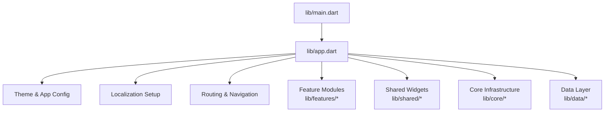
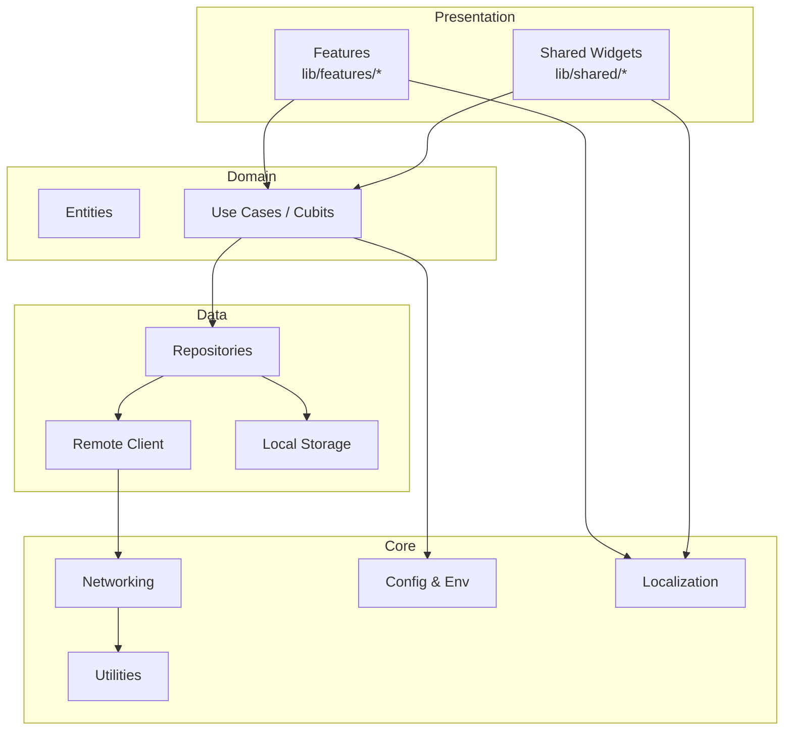
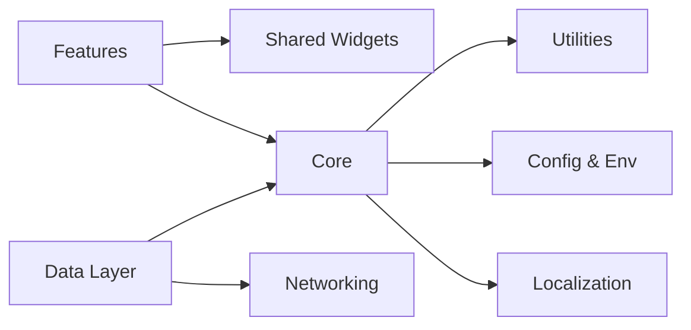

# Core Modules

<cite>
**Referenced Files in This Document**
- [main.dart](file://lib/main.dart)
- [app.dart](file://lib/app.dart)
- [pubspec.yaml](file://pubspec.yaml)
- [l10n.yaml](file://l10n.yaml)
- [app_en.arb](file://l10n/app_en.arb)
- [app_ar.arb](file://l10n/app_ar.arb)
</cite>

## Table of Contents
1. [Introduction](#introduction)
2. [Project Structure](#project-structure)
3. [Core Components](#core-components)
4. [Architecture Overview](#architecture-overview)
5. [Detailed Component Analysis](#detailed-component-analysis)
6. [Dependency Analysis](#dependency-analysis)
7. [Performance Considerations](#performance-considerations)
8. [Troubleshooting Guide](#troubleshooting-guide)
9. [Conclusion](#conclusion)
10. [Appendices](#appendices)

## Introduction
This document describes the core modules and shared components that form the foundation of Albatal Store. It focuses on:
- Core utilities, constants, base classes, and shared functionality
- Shared widgets library and reusable UI components
- Configuration management, theme definitions, and localization setup
- Networking layer, error handling strategies, and utility functions
- Usage examples for extending and customizing core functionality
- Performance considerations, best practices, and integration patterns
- Guidelines for contributing new shared components and maintaining consistency

The goal is to provide a comprehensive reference for developers building features on top of the application’s foundation.

## Project Structure
At a high level, the Flutter application entry points are defined in lib/main.dart and lib/app.dart. The project uses standard Flutter conventions with feature-based organization under lib/features, shared components under lib/shared, core infrastructure under lib/core, and data access under lib/data. Localization is configured via l10n.yaml and ARB files under l10n.

[No sources needed since this diagram shows conceptual workflow, not actual code structure]

## Core Components
This section outlines the foundational pieces that other parts of the app rely on.

- Application bootstrap and configuration
  - Entry point initialization and app wiring are typically centralized in the main file and app widget.
  - Look for app-level providers, dependency injection setup, and global configuration.

- Theme system
  - Centralized theme definitions (colors, typography, spacing) should be exposed from a single source to ensure consistency across screens.
  - Support for light/dark modes and platform-specific overrides.

- Localization
  - Generated localizations are driven by l10n.yaml and ARB files.
  - Ensure all user-facing strings are externalized and use generated helpers.

- Shared widgets library
  - Reusable UI primitives (buttons, inputs, cards, dialogs) encapsulate design tokens and behavior.
  - Provide consistent accessibility labels, semantics, and keyboard navigation.

- Core utilities and constants
  - Common helpers for formatting, validation, routing, and environment configuration.
  - Constants for API endpoints, feature flags, and app-wide settings.

- Networking layer
  - HTTP client configuration, interceptors, retry policies, and error mapping.
  - Typed responses and domain models decoupled from transport details.

- Error handling strategy
  - Centralized error types and handlers for network, parsing, and business errors.
  - User-friendly messages and logging for diagnostics.

- Base classes and mixins
  - Shared state management patterns, repository interfaces, and view model bases.
  - Mixins for common behaviors like loading states, pagination, and caching.

Usage example patterns:
- Extend a base repository to implement a new data source.
- Create a new shared widget by composing existing primitives and applying theme tokens.
- Add a new route using the central router configuration.

Best practices:
- Keep shared components pure and testable.
- Avoid leaking platform or feature-specific logic into shared layers.
- Prefer composition over inheritance when designing widgets.

[No sources needed since this section provides general guidance]

## Architecture Overview
The application follows a layered architecture:
- Presentation layer: Feature screens and shared widgets
- Domain layer: Business logic and entities
- Data layer: Repositories, remote clients, and local storage
- Core layer: Utilities, networking, configuration, and shared abstractions

[No sources needed since this diagram shows conceptual workflow, not actual code structure]

## Detailed Component Analysis

### Application Bootstrap and Configuration
- Responsibilities
  - Initialize dependencies, configure theme, set up localization, and start the root navigator.
  - Provide app-wide settings such as debug flags and analytics.

- Integration points
  - Reads environment variables and feature flags.
  - Wires up providers or dependency injection containers.

- Extensibility
  - Add new global services during bootstrap.
  - Register routes and initial screen.

Guidelines:
- Keep bootstrap minimal and deterministic.
- Fail fast on missing critical configuration.

[No sources needed since this section provides general guidance]

### Theme System
- Responsibilities
  - Define color schemes, typography scales, spacing units, and component styles.
  - Expose theme getters for easy consumption across widgets.

- Customization
  - Provide theme variants (light/dark).
  - Allow per-feature overrides where necessary.

- Consistency
  - Enforce design tokens through shared widgets.
  - Validate contrast and accessibility constraints.

[No sources needed since this section provides general guidance]

### Localization Setup
- Responsibilities
  - Configure l10n generation and supported locales.
  - Provide typed string accessors and pluralization rules.

- Workflow
  - Update ARB files for each locale.
  - Regenerate localizations and add tests for coverage.

- Best practices
  - Use context-aware selectors for dynamic content.
  - Avoid concatenating localized strings; prefer parameterized messages.

[No sources needed since this section provides general guidance]

### Shared Widgets Library
- Responsibilities
  - Implement reusable UI components aligned with the design system.
  - Encapsulate layout, styling, and interaction patterns.

- Composition
  - Build complex screens by composing primitives.
  - Provide themed variants and responsive layouts.

- Accessibility
  - Include semantic labels, focus traversal, and keyboard support.

- Testing
  - Unit test widget behavior and integration test common flows.

[No sources needed since this section provides general guidance]

### Networking Layer
- Responsibilities
  - Configure HTTP client, timeouts, retries, and interceptors.
  - Map server responses to domain models and handle errors consistently.

- Strategies
  - Centralize error codes and messages.
  - Cache responses where appropriate.

- Security
  - Handle authentication headers and token refresh.
  - Sanitize sensitive data in logs.

[No sources needed since this section provides general guidance]

### Error Handling Strategy
- Responsibilities
  - Define error taxonomy (network, parsing, business).
  - Provide user-facing messages and developer-friendly diagnostics.

- Patterns
  - Wrap third-party errors into domain errors.
  - Surface actionable feedback to users.

- Logging
  - Correlate errors with request IDs and timestamps.

[No sources needed since this section provides general guidance]

### Base Classes and Mixins
- Responsibilities
  - Provide common state management scaffolding.
  - Offer reusable behaviors like loading indicators and pagination.

- Design
  - Favor composition and small, focused mixins.
  - Keep base classes stable and backward compatible.

[No sources needed since this section provides general guidance]

## Dependency Analysis
High-level module relationships:
- Features depend on shared widgets and core utilities.
- Data layer depends on networking and configuration.
- Core provides abstractions consumed by both presentation and data layers.

[No sources needed since this diagram shows conceptual workflow, not actual code structure]

## Performance Considerations
- Minimize rebuilds by isolating state and using immutable data structures.
- Prefer const constructors and memoization for expensive computations.
- Defer heavy work off the UI thread and use streams or async generators judiciously.
- Optimize images and assets; use vector graphics where possible.
- Profile memory usage and avoid retaining large objects in long-lived scopes.

[No sources needed since this section provides general guidance]

## Troubleshooting Guide
Common issues and resolutions:
- Missing localization keys: regenerate localizations and verify ARB entries.
- Theme inconsistencies: ensure all colors and text styles come from the central theme.
- Network failures: check interceptors, error mapping, and retry policies.
- State synchronization: validate cubit/state updates and side effects.

[No sources needed since this section provides general guidance]

## Conclusion
Albatal Store’s core modules provide a robust foundation for scalable feature development. By adhering to the shared widgets library, centralized configuration, and consistent error handling, teams can maintain a cohesive user experience and accelerate delivery. Follow the contribution guidelines to keep the codebase clean, performant, and accessible.

[No sources needed since this section summarizes without analyzing specific files]

## Appendices

### Contribution Guidelines for New Shared Components
- Naming and structure
  - Use clear, descriptive names and colocate related files.
  - Follow existing folder conventions under shared and core.

- Design alignment
  - Apply design tokens and follow accessibility standards.
  - Provide both light and dark mode support.

- Documentation and testing
  - Add usage examples and inline comments.
  - Include unit and widget tests covering key interactions.

- Review checklist
  - No hardcoded strings or colors.
  - No feature-specific logic in shared components.
  - Backward compatibility maintained.

[No sources needed since this section provides general guidance]