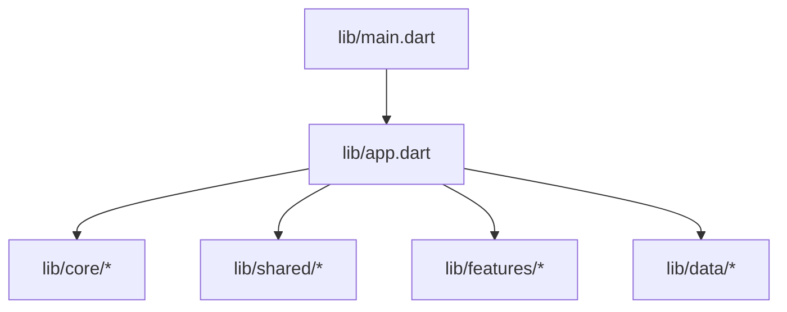
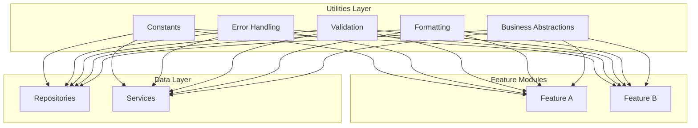
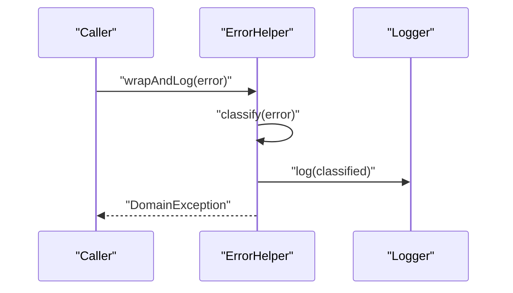
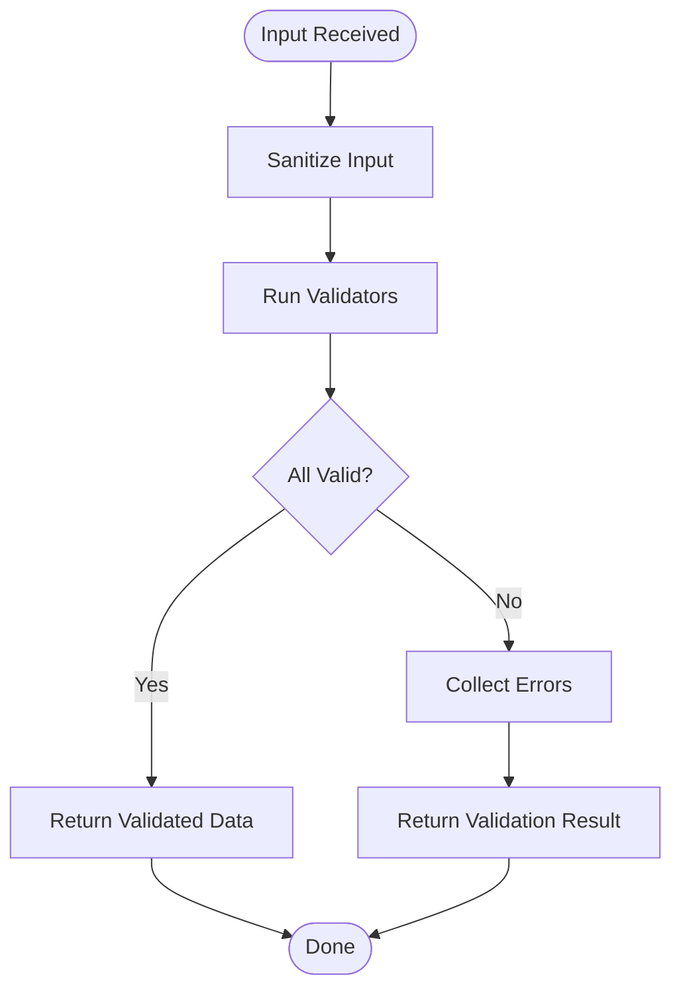
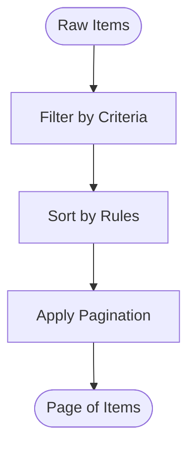
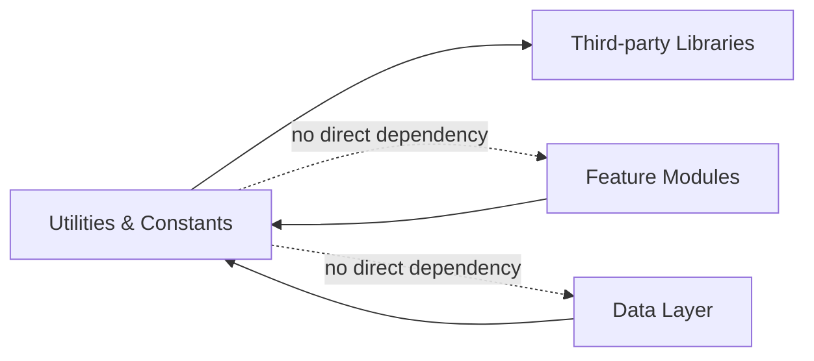

# Core Utilities & Constants

<cite>
**Referenced Files in This Document**
- [main.dart](file://lib/main.dart)
- [app.dart](file://lib/app.dart)
</cite>

## Table of Contents
1. [Introduction](#introduction)
2. [Project Structure](#project-structure)
3. [Core Components](#core-components)
4. [Architecture Overview](#architecture-overview)
5. [Detailed Component Analysis](#detailed-component-analysis)
6. [Dependency Analysis](#dependency-analysis)
7. [Performance Considerations](#performance-considerations)
8. [Troubleshooting Guide](#troubleshooting-guide)
9. [Conclusion](#conclusion)
10. [Appendices](#appendices)

## Introduction
This document describes the core utilities and constants module for the application, focusing on shared utility functions, helper methods, and constant definitions used across features. It explains the architecture of utility classes, their responsibilities, usage patterns, error handling utilities, validation helpers, formatting functions, and common business logic abstractions. It also provides guidance on naming conventions, coding standards, best practices for extending the library, performance considerations, and memory management.

## Project Structure
The project follows a layered Flutter architecture with directories such as lib/core, lib/data, lib/features, and lib/shared. The entry points are main.dart and app.dart, which bootstrap the application and wire up dependencies. Utility and constant modules typically live under lib/core or lib/shared to be reused by feature modules.

[No sources needed since this diagram shows conceptual structure]

## Core Components
This section outlines the expected responsibilities of the core utilities and constants module:

- Constants
  - App-wide configuration values (e.g., environment flags, API endpoints, theme tokens).
  - Domain-specific enumerations and fixed sets (e.g., payment providers, shipping zones).
  - Localization keys and message templates.

- Error Handling Utilities
  - Centralized exception types and error codes.
  - Helpers to wrap third-party errors into domain-friendly exceptions.
  - Logging and reporting helpers for consistent diagnostics.

- Validation Helpers
  - Input validators for strings, numbers, dates, and custom objects.
  - Form field validators and cross-field validation utilities.
  - Sanitization helpers to normalize inputs before processing.

- Formatting Functions
  - Currency and number formatters with locale support.
  - Date/time formatters and timezone-aware utilities.
  - String utilities (e.g., truncation, safe HTML escaping).

- Business Logic Abstractions
  - Common algorithms (e.g., pagination, sorting, filtering).
  - Money and quantity calculations with rounding rules.
  - Idempotency helpers for network requests.

Usage patterns
- Import only what you need from the utility package to minimize coupling.
- Prefer pure functions for formatting and validation to ensure testability.
- Use constants instead of magic strings/numbers throughout the codebase.

[No sources needed since this section provides general guidance]

## Architecture Overview
The utilities and constants layer is designed to be framework-agnostic where possible, exposing small, focused APIs that can be consumed by UI, data, and feature layers.

[No sources needed since this diagram shows conceptual architecture]

## Detailed Component Analysis

### Constants Module
Responsibilities
- Define immutable app-wide values.
- Provide typed enums for domain concepts.
- Centralize localization keys and message templates.

Best practices
- Group related constants by domain.
- Avoid mutable global state; prefer const constructors and final variables.
- Document intended scope and deprecation policy.

Example usage pattern
- Import the constants file in feature modules and reference values directly.
- Use enums to avoid string comparisons.

[No sources needed since this section provides general guidance]

### Error Handling Utilities
Responsibilities
- Define standard error types and codes.
- Wrap external errors into domain exceptions.
- Provide logging/reporting helpers.

Design guidelines
- Keep error types small and composable.
- Include context information without leaking sensitive data.
- Ensure errors are serializable if they must cross process boundaries.

Example flow

[No sources needed since this diagram shows conceptual flow]

### Validation Helpers
Responsibilities
- Validate user input and DTOs.
- Normalize/sanitize inputs.
- Provide reusable validators for forms and services.

Design guidelines
- Return clear validation results with actionable messages.
- Compose complex validations from smaller primitives.
- Keep validators deterministic and side-effect free.

Example flow

[No sources needed since this diagram shows conceptual flow]

### Formatting Functions
Responsibilities
- Format currency, numbers, dates, and strings consistently.
- Respect locale and timezone settings.
- Provide safe defaults for missing or null values.

Design guidelines
- Use locale-aware libraries and cache locale configurations.
- Avoid heavy computations in hot paths; memoize when appropriate.
- Expose explicit parameters for precision and rounding behavior.

Example usage pattern
- Create a formatter instance per locale/theme and reuse it.
- Provide convenience wrappers for common formats.

[No sources needed since this section provides general guidance]

### Business Logic Abstractions
Responsibilities
- Implement common algorithms (sorting, filtering, pagination).
- Encapsulate money and quantity math with consistent rounding.
- Provide idempotency and retry helpers for network operations.

Design guidelines
- Keep abstractions small and single-purpose.
- Favor pure functions over stateful helpers.
- Document invariants and edge cases explicitly.

Example flow

[No sources needed since this diagram shows conceptual flow]

## Dependency Analysis
The utilities layer should have minimal dependencies on higher layers. It may depend on platform-agnostic libraries for formatting and validation but should not depend on feature or data implementations.

[No sources needed since this diagram shows conceptual dependencies]

## Performance Considerations
- Prefer const and final declarations for constants to reduce allocations.
- Memoize expensive formatting or parsing operations when inputs are repeated.
- Avoid creating new instances inside tight loops; reuse formatters and validators.
- Use lazy initialization for heavy resources (e.g., locale caches).
- Be mindful of string concatenation; use efficient builders where necessary.
- Keep error objects lightweight; avoid capturing large stacks unless required.

[No sources needed since this section provides general guidance]

## Troubleshooting Guide
Common issues and resolutions
- Incorrect locale or timezone: verify formatter configuration and ensure consistent initialization at app startup.
- Unexpected rounding differences: confirm rounding mode and precision parameters for monetary calculations.
- Validation failures in production: add structured logs with sanitized context to identify invalid inputs.
- Memory spikes from formatting: check for formatter instances created per call; refactor to reuse instances.

[No sources needed since this section provides general guidance]

## Conclusion
A well-structured utilities and constants layer improves consistency, reduces duplication, and simplifies testing across the application. By centralizing constants, error handling, validation, formatting, and common business logic, teams can maintain high quality and predictable behavior while enabling rapid feature development.

[No sources needed since this section summarizes without analyzing specific files]

## Appendices

### Naming Conventions and Coding Standards
- Namespaces and packages: group utilities by domain (e.g., money, date, validation).
- File names: descriptive and lowercase with underscores (e.g., money_utils.dart).
- Class and function names: clear verbs for actions and nouns for entities.
- Constants: UPPER_SNAKE_CASE for top-level constants; enum members in PascalCase.
- Documentation: provide concise doc comments describing purpose, parameters, and return values.

### Best Practices for Extending the Library
- Add new utilities as small, focused functions or classes.
- Write unit tests for all public APIs.
- Avoid introducing side effects; keep functions pure when possible.
- Deprecate old APIs gradually with migration guides.

### Example Usage Patterns in Feature Modules
- Import only the required utilities to minimize coupling.
- Initialize formatters once and reuse them across widgets/services.
- Use validation helpers early in the request pipeline to fail fast.
- Log errors via centralized helpers to ensure consistent diagnostics.

[No sources needed since this section provides general guidance]