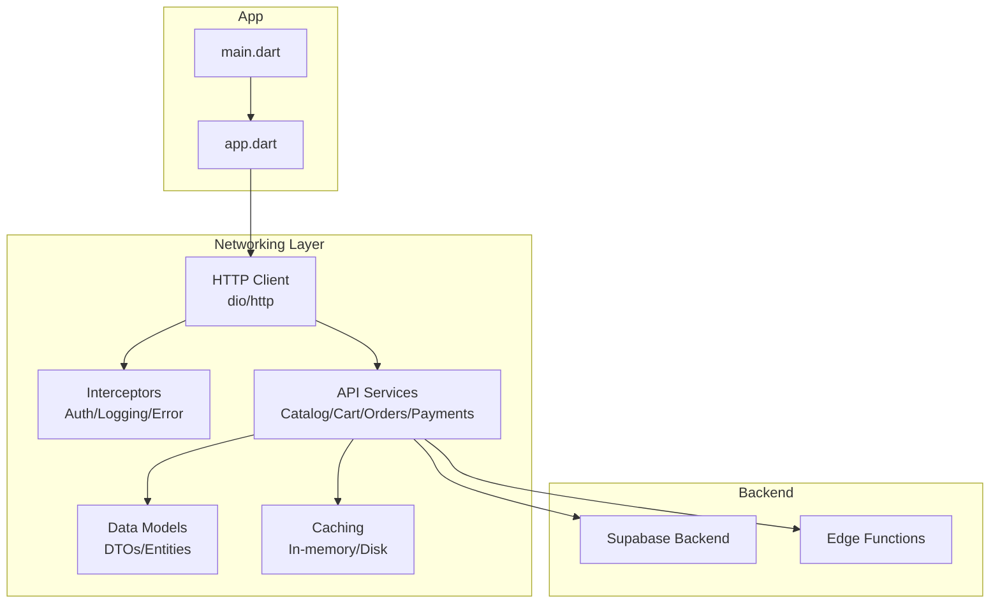
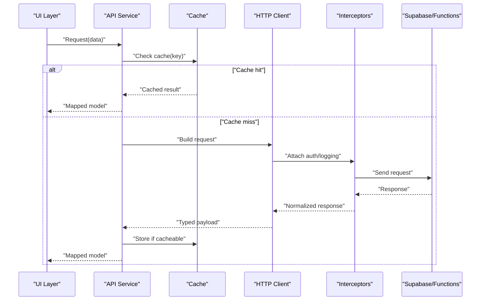
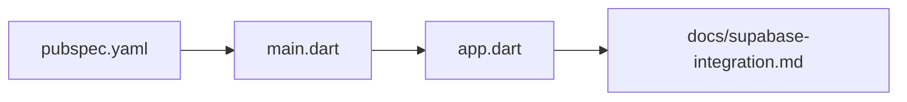

# Networking & API Layer

<cite>
**Referenced Files in This Document**
- [pubspec.yaml](file://pubspec.yaml)
- [main.dart](file://lib/main.dart)
- [app.dart](file://lib/app.dart)
- [supabase-integration.md](file://docs/supabase-integration.md)
</cite>

## Table of Contents
1. [Introduction](#introduction)
2. [Project Structure](#project-structure)
3. [Core Components](#core-components)
4. [Architecture Overview](#architecture-overview)
5. [Detailed Component Analysis](#detailed-component-analysis)
6. [Dependency Analysis](#dependency-analysis)
7. [Performance Considerations](#performance-considerations)
8. [Troubleshooting Guide](#troubleshooting-guide)
9. [Conclusion](#conclusion)
10. [Appendices](#appendices)

## Introduction
This document describes the networking and API communication layer for the project, focusing on HTTP client configuration, request/response interceptors, error handling strategies, API service architecture, data transformation pipelines, caching mechanisms, authentication integration, token management, security considerations, retry policies, timeout configurations, and performance optimization techniques. It also provides guidance for implementing new API endpoints, handling different response types, and managing network errors gracefully.

Where applicable, this document references concrete files in the repository to ground explanations in actual code and documentation artifacts.

## Project Structure
The Flutter application is organized into feature-based directories under lib with shared core and data layers. The networking stack typically resides within a dedicated core or data module (for example, a network package such as dio or http), along with services that encapsulate API calls and data models. Configuration for environment-specific base URLs and tokens is commonly provided via environment files and dependency injection at app startup.

[No sources needed since this diagram shows conceptual workflow, not actual code structure]

## Core Components
- HTTP Client: A single configured HTTP client instance is created once and reused across the app. It sets base URL, timeouts, and default headers.
- Interceptors: Centralized logic for attaching authentication tokens, logging requests/responses, and transforming errors.
- API Services: Feature-scoped classes that encapsulate endpoint calls, map responses to domain models, and handle retries/timeouts per operation.
- Data Models: Typed representations of API payloads and entities used by services and UI state.
- Caching: Optional in-memory or disk-backed caches for read-heavy endpoints to reduce network usage and improve responsiveness.
- Authentication Integration: Token acquisition, refresh, and propagation through interceptors; secure storage for sensitive values.
- Error Handling: Consistent mapping of network and server errors to user-friendly messages and actionable states.

[No sources needed since this section provides general guidance]

## Architecture Overview
The networking architecture follows a layered approach:
- Presentation layer invokes API services.
- API services orchestrate HTTP calls using a shared HTTP client.
- Interceptors handle cross-cutting concerns like auth, logging, and error normalization.
- Data models transform raw JSON into strongly typed objects.
- Caching sits between services and the network layer for eligible endpoints.
- Backend integration uses Supabase APIs and edge functions where appropriate.

[No sources needed since this diagram shows conceptual workflow, not actual code structure]

## Detailed Component Analysis

### HTTP Client Configuration
- Base URL: Configured per environment (development/staging/production).
- Timeouts: Global connect/read/write timeouts set on the client.
- Default Headers: Content-Type, Accept, and Authorization headers managed centrally.
- Retry Policy: Exponential backoff with jitter for transient failures.
- Logging: Request/response logging enabled in non-production environments.

Implementation tips:
- Create a singleton client instance during app bootstrap.
- Use environment variables or config files to select base URLs and flags.
- Centralize timeout and retry settings to ensure consistency.

[No sources needed since this section provides general guidance]

### Request/Response Interceptors
Responsibilities:
- Attach bearer tokens from secure storage before each request.
- Refresh tokens automatically when receiving specific server codes.
- Normalize error responses into a consistent shape.
- Log requests/responses for debugging.

Patterns:
- Auth interceptor reads tokens and injects Authorization header.
- Error interceptor maps HTTP status codes and body errors to domain exceptions.
- Logging interceptor records timing and payloads (sanitized).

[No sources needed since this section provides general guidance]

### API Service Architecture
Structure:
- One service class per feature area (e.g., CatalogService, CartService, OrdersService, PaymentsService).
- Methods correspond to endpoints and return typed models.
- Each method can specify its own retry policy and timeout overrides.
- Services coordinate with caching for GET endpoints where appropriate.

Example responsibilities:
- Build request parameters and query strings.
- Map JSON to domain models.
- Handle pagination and cursor-based fetching.
- Surface meaningful errors to the caller.

[No sources needed since this section provides general guidance]

### Data Transformation Pipelines
- DTOs represent raw API payloads.
- Domain models represent business entities.
- Mappers convert DTOs to domain models and vice versa.
- Validation occurs during mapping to enforce invariants early.

Best practices:
- Keep mappers pure and testable.
- Separate parsing from business logic.
- Use nullable fields carefully and provide defaults where safe.

[No sources needed since this section provides general guidance]

### Caching Mechanisms
Strategies:
- In-memory cache for short-lived data (e.g., catalog categories).
- Disk cache for longer-lived data (e.g., product details).
- Cache invalidation triggered by mutations (create/update/delete).
- Stale-while-revalidate pattern for improved perceived performance.

Considerations:
- Define TTLs per resource type.
- Avoid caching sensitive data.
- Ensure cache keys include relevant query parameters.

[No sources needed since this section provides general guidance]

### Authentication Integration and Token Management
Flow:
- On login, store access and refresh tokens securely.
- Interceptors attach access tokens to outgoing requests.
- On unauthorized responses, attempt silent refresh using refresh token.
- If refresh fails, redirect to login and clear session.

Security considerations:
- Store tokens in platform-secure storage.
- Never log tokens or PII.
- Enforce HTTPS-only connections.
- Validate server certificates and pinning if required.

[No sources needed since this section provides general guidance]

### Error Handling Strategies
Approach:
- Network errors: connectivity issues, timeouts, SSL errors.
- Server errors: HTTP status codes and structured error bodies.
- Business errors: validation failures, insufficient permissions.

Normalization:
- Convert all errors to a common exception type with context.
- Provide user-facing messages and optional recovery actions.
- Surface analytics events for critical failures.

[No sources needed since this section provides general guidance]

### Implementing New API Endpoints
Steps:
1. Define request/response DTOs.
2. Add a method in the relevant API service.
3. Configure timeouts/retries if needed.
4. Map response to domain model.
5. Add caching rules if applicable.
6. Write unit tests for success and failure paths.
7. Integrate with UI state and show loading/error states.

[No sources needed since this section provides general guidance]

### Handling Different Response Types
- JSON payloads: parse to typed models.
- Streams: handle real-time updates (e.g., order status).
- File downloads/uploads: manage progress and cancellation.
- Pagination: implement cursor or offset-based fetching.

[No sources needed since this section provides general guidance]

### Managing Network Errors Gracefully
- Show contextual error messages.
- Offer retry actions where appropriate.
- Persist partial results safely.
- Fallback to cached data when available.

[No sources needed since this section provides general guidance]

### Retry Policies and Timeout Configurations
Retry policy:
- Apply exponential backoff with jitter for transient errors (e.g., 5xx, network errors).
- Limit maximum retries per call.
- Distinguish between idempotent and non-idempotent operations.

Timeouts:
- Set sensible global defaults.
- Override per-call for long-running operations.
- Monitor latency metrics and adjust thresholds.

[No sources needed since this section provides general guidance]

### Performance Optimization Techniques
- Enable connection pooling and keep-alive.
- Compress payloads where supported.
- Use ETag/If-None-Match for conditional requests.
- Prefetch and pre-warm caches for likely next screens.
- Debounce rapid successive calls to the same endpoint.

[No sources needed since this section provides general guidance]

## Dependency Analysis
External dependencies are declared in the project manifest. Networking libraries (such as dio or http) and related packages should be listed there. Environment configuration and Supabase integration are documented in the docs folder.

**Diagram sources**
- [pubspec.yaml](file://pubspec.yaml)
- [main.dart](file://lib/main.dart)
- [app.dart](file://lib/app.dart)
- [supabase-integration.md](file://docs/supabase-integration.md)

**Section sources**
- [pubspec.yaml](file://pubspec.yaml)
- [main.dart](file://lib/main.dart)
- [app.dart](file://lib/app.dart)
- [supabase-integration.md](file://docs/supabase-integration.md)

## Performance Considerations
- Prefer reusable HTTP clients over per-call instantiation.
- Batch small requests when possible.
- Use background tasks for heavy uploads/downloads.
- Monitor memory usage and avoid retaining large payloads.
- Profile network calls to identify hotspots and optimize accordingly.

[No sources needed since this section provides general guidance]

## Troubleshooting Guide
Common issues and resolutions:
- Authentication failures: verify token storage, expiration handling, and refresh flow.
- CORS or SSL errors: confirm base URL, HTTPS enforcement, and certificate validity.
- Timeouts: review server latency and adjust timeouts; consider pagination and compression.
- Memory leaks: ensure streams are closed and listeners disposed.
- Logging noise: sanitize logs and disable verbose output in production.

[No sources needed since this section provides general guidance]

## Conclusion
A robust networking and API layer combines a well-configured HTTP client, centralized interceptors, clean service abstractions, strong data models, and thoughtful caching and error handling. By standardizing authentication, retries, timeouts, and observability, teams can build reliable, maintainable, and performant integrations with backend services.

[No sources needed since this section summarizes without analyzing specific files]

## Appendices

### Example: Adding a New Endpoint
- Define DTOs for request and response.
- Implement a method in the corresponding API service.
- Configure any special timeouts or retries.
- Map the response to a domain model.
- Optionally add caching for GET endpoints.
- Wire up UI state and error handling.

[No sources needed since this section provides general guidance]

### Example: Handling Streaming Responses
- Open a stream for real-time updates.
- Parse incremental chunks into domain models.
- Update UI incrementally while showing loading indicators.
- Handle stream errors and cleanup resources.

[No sources needed since this section provides general guidance]