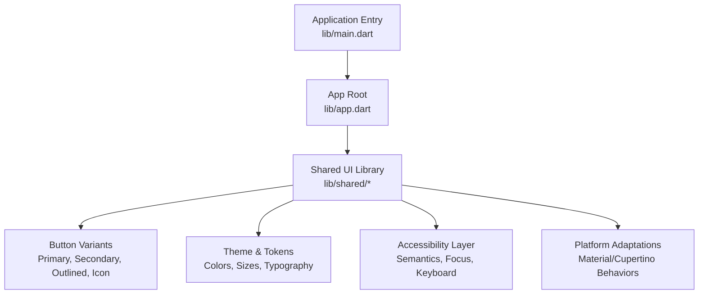
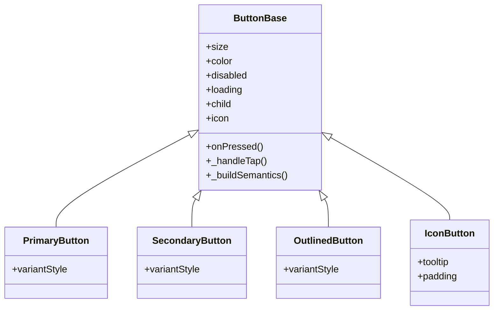
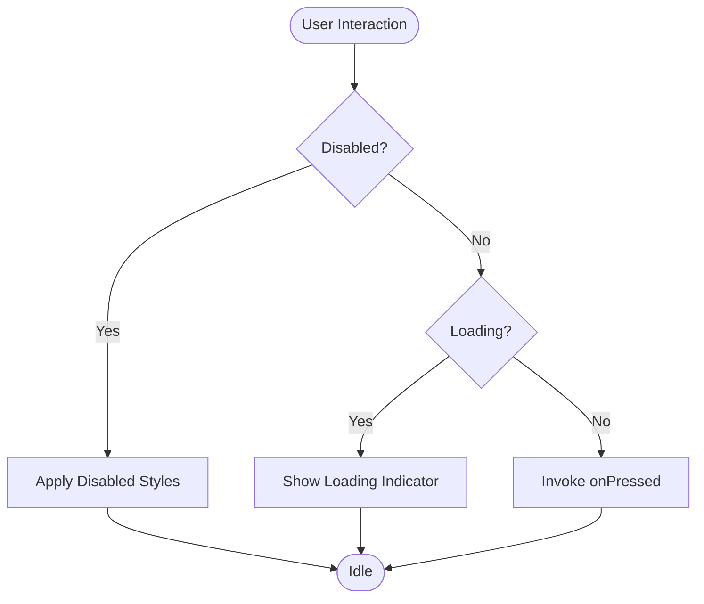
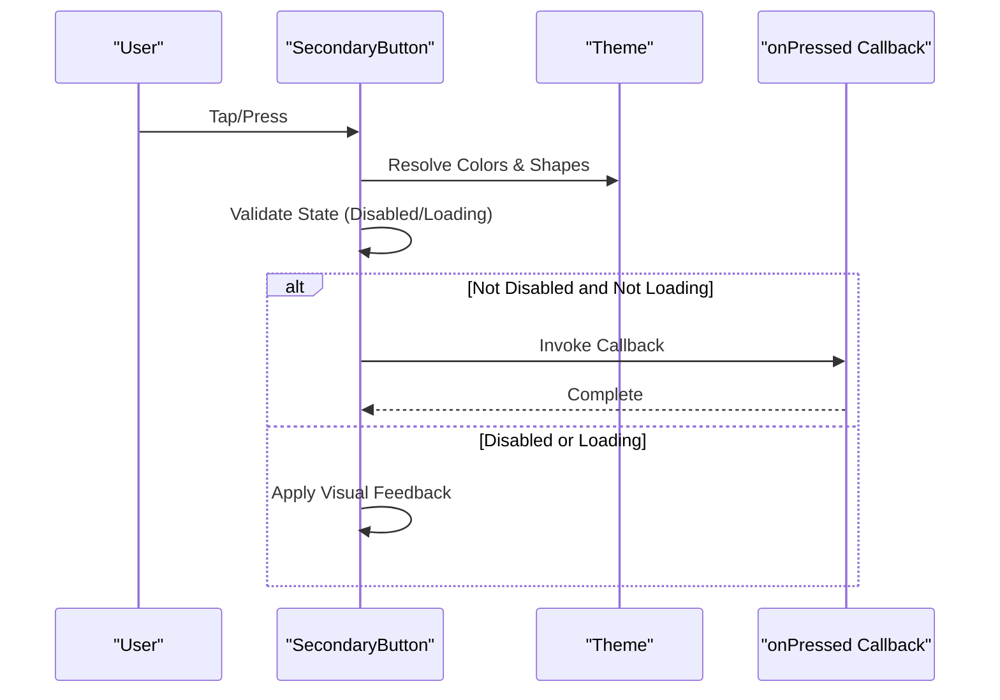
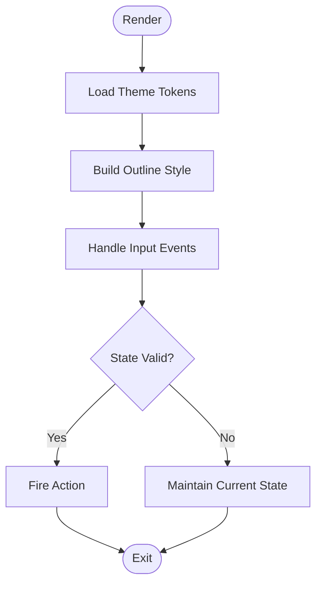
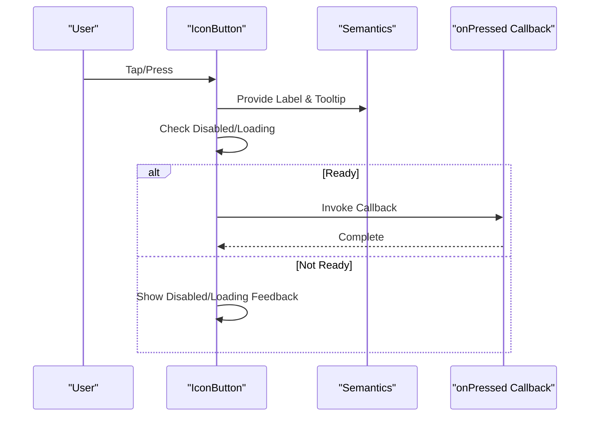
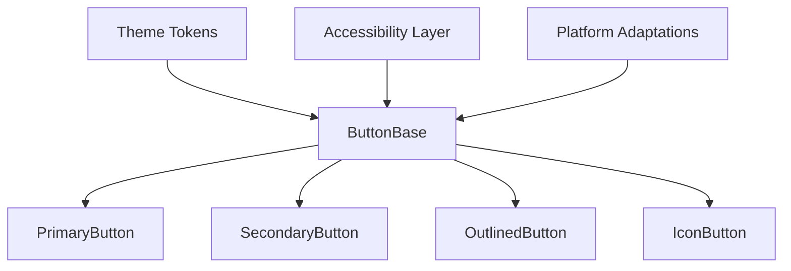
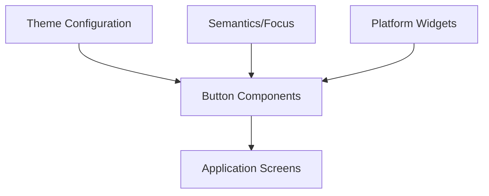

# Button Components

<cite>
**Referenced Files in This Document**
- [README.md](file://README.md)
- [DESIGN.md](file://DESIGN.md)
- [INSTRUCTIONS.md](file://INSTRUCTIONS.md)
- [pubspec.yaml](file://pubspec.yaml)
- [app.dart](file://lib/app.dart)
- [main.dart](file://lib/main.dart)
</cite>

## Table of Contents
1. [Introduction](#introduction)
2. [Project Structure](#project-structure)
3. [Core Components](#core-components)
4. [Architecture Overview](#architecture-overview)
5. [Detailed Component Analysis](#detailed-component-analysis)
6. [Dependency Analysis](#dependency-analysis)
7. [Performance Considerations](#performance-considerations)
8. [Troubleshooting Guide](#troubleshooting-guide)
9. [Conclusion](#conclusion)
10. [Appendices](#appendices)

## Introduction
This document provides comprehensive documentation for button components within the shared UI library of this Flutter project. It covers all button variants (primary, secondary, outlined, and icon), props/attributes (size, color, disabled state, loading indicators), usage examples, styling customization, theme integration, accessibility features (keyboard navigation and screen reader support), event handling patterns, and platform-specific adaptations. The goal is to enable consistent, accessible, and maintainable button usage across the application.

## Project Structure
The project follows a feature-based organization with shared UI components located under lib/shared. Entry points are defined in lib/main.dart and lib/app.dart. Configuration and design guidelines are available in pubspec.yaml, README.md, DESIGN.md, and INSTRUCTIONS.md.

[No sources needed since this diagram shows conceptual workflow, not actual code structure]

**Section sources**
- [main.dart](file://lib/main.dart)
- [app.dart](file://lib/app.dart)
- [pubspec.yaml](file://pubspec.yaml)
- [README.md](file://README.md)
- [DESIGN.md](file://DESIGN.md)
- [INSTRUCTIONS.md](file://INSTRUCTIONS.md)

## Core Components
This section outlines the core button component family and their responsibilities:
- Primary Button: Emphasized action; typically used as the main call-to-action.
- Secondary Button: Less prominent than primary; used for supportive actions.
- Outlined Button: Uses border emphasis; suitable for tertiary or contextual actions.
- Icon Button: Compact action triggered by an icon; often used in toolbars or dense layouts.

Key attributes common across variants:
- size: small, medium, large (or similar tokens).
- color: theme-aware color tokens (e.g., primary, secondary, custom).
- disabled: boolean to disable interaction and apply disabled styles.
- loading: boolean to show a loading indicator while performing async work.
- onPressed: callback invoked on press/tap.
- child/content: text label or widget content.
- icon: optional leading/trailing icon for icon buttons or mixed content.

Usage examples (conceptual):
- Primary button with loading and disabled states.
- Secondary button with custom color token.
- Outlined button with leading icon.
- Icon-only button with tooltip and accessibility labels.

Styling customization options:
- Override theme tokens for colors, shapes, and typography.
- Provide variant-specific style overrides via theme or component props.
- Use elevation and shadow tokens for depth control.

Theme integration:
- Buttons consume theme data for colors, typography, and shape tokens.
- Theme changes propagate automatically to all button instances.

Accessibility features:
- Semantic labels for screen readers.
- Focus management and keyboard navigation (Enter/Space to activate).
- High contrast and reduced motion support where applicable.

Event handling patterns:
- Synchronous callbacks via onPressed.
- Asynchronous workflows with loading state and error feedback.
- Debounce/throttle for rapid taps during long-running operations.

Platform-specific adaptations:
- Material vs. Cupertino behaviors for activation and ripple effects.
- Platform-appropriate focus visuals and hit targets.

[No sources needed since this section provides general guidance]

## Architecture Overview
The button system is designed around a cohesive theming layer and a set of focused component implementations. Each variant composes shared behavior (state, semantics, focus) and applies variant-specific visual rules.

[No sources needed since this diagram shows conceptual architecture, not actual code structure]

## Detailed Component Analysis

### Primary Button
- Purpose: Primary call-to-action with strong visual emphasis.
- Props: Inherits base props; may include variant-specific color tokens.
- Behavior: Shows loading indicator when loading is true; disables input when disabled is true.
- Accessibility: Announces label and state; supports keyboard activation.
- Styling: Uses theme’s primary color and shape tokens; can be overridden per instance.

[No sources needed since this diagram shows conceptual workflow, not actual code structure]

**Section sources**
- [DESIGN.md](file://DESIGN.md)
- [INSTRUCTIONS.md](file://INSTRUCTIONS.md)

### Secondary Button
- Purpose: Supportive action with less emphasis than primary.
- Props: Inherits base props; uses secondary color tokens by default.
- Behavior: Same state machine as primary; integrates with theme for consistency.
- Accessibility: Consistent semantic announcements and focus behavior.
- Styling: Applies secondary color and shape tokens; customizable via theme.

[No sources needed since this diagram shows conceptual workflow, not actual code structure]

**Section sources**
- [DESIGN.md](file://DESIGN.md)
- [INSTRUCTIONS.md](file://INSTRUCTIONS.md)

### Outlined Button
- Purpose: Contextual or tertiary action using border emphasis.
- Props: Inherits base props; may include outline width and color tokens.
- Behavior: Mirrors primary/secondary state handling; visually distinct via outline.
- Accessibility: Maintains consistent semantics and keyboard behavior.
- Styling: Uses outline color from theme; respects shape and typography tokens.

[No sources needed since this diagram shows conceptual workflow, not actual code structure]

**Section sources**
- [DESIGN.md](file://DESIGN.md)
- [INSTRUCTIONS.md](file://INSTRUCTIONS.md)

### Icon Button
- Purpose: Compact action represented by an icon; ideal for dense interfaces.
- Props: Inherits base props; adds tooltip and padding controls.
- Behavior: Activates on tap/press; supports loading and disabled states.
- Accessibility: Requires explicit semantic label and tooltip for context.
- Styling: Uses theme’s icon color and shape tokens; adapts to platform hit targets.

[No sources needed since this diagram shows conceptual workflow, not actual code structure]

**Section sources**
- [DESIGN.md](file://DESIGN.md)
- [INSTRUCTIONS.md](file://INSTRUCTIONS.md)

### Conceptual Overview
The button system emphasizes consistency through shared base behavior and theme-driven styling. Variants differ primarily in visual emphasis and layout constraints while maintaining uniform interaction and accessibility patterns.

[No sources needed since this diagram shows conceptual workflow, not actual code structure]

## Dependency Analysis
Buttons depend on:
- Theme configuration for colors, typography, and shape tokens.
- Semantics and focus layers for accessibility.
- Platform-specific widgets for activation and feedback.

[No sources needed since this diagram shows conceptual workflow, not actual code structure]

**Section sources**
- [pubspec.yaml](file://pubspec.yaml)
- [app.dart](file://lib/app.dart)
- [main.dart](file://lib/main.dart)

## Performance Considerations
- Minimize rebuilds by memoizing button content and icons.
- Avoid heavy computations inside onPressed; offload to background tasks and update loading state accordingly.
- Use appropriate sizes and hit targets to reduce unnecessary reflows.
- Leverage theme tokens to avoid redundant style calculations.

[No sources needed since this section provides general guidance]

## Troubleshooting Guide
Common issues and resolutions:
- Button does not respond: Ensure disabled is false and onPressed is provided.
- Loading indicator not visible: Confirm loading is true and that the variant renders the indicator.
- Inconsistent colors: Verify theme tokens are correctly configured and that no local overrides conflict.
- Accessibility problems: Provide explicit semantic labels and tooltips for icon buttons; ensure focus order is logical.
- Platform differences: Test on both Material and Cupertino contexts; adjust padding and hit targets as needed.

**Section sources**
- [README.md](file://README.md)
- [DESIGN.md](file://DESIGN.md)
- [INSTRUCTIONS.md](file://INSTRUCTIONS.md)

## Conclusion
The button components provide a robust, theme-integrated, and accessible foundation for user interactions across the application. By adhering to the documented variants, props, styling, and accessibility practices, developers can deliver consistent experiences on all platforms.

[No sources needed since this section summarizes without analyzing specific files]

## Appendices
- Reference design guidelines and instructions for further details on tokens and usage conventions.
- Review entry points and app configuration to understand how theme and platform settings affect button rendering.

**Section sources**
- [README.md](file://README.md)
- [DESIGN.md](file://DESIGN.md)
- [INSTRUCTIONS.md](file://INSTRUCTIONS.md)
- [pubspec.yaml](file://pubspec.yaml)
- [app.dart](file://lib/app.dart)
- [main.dart](file://lib/main.dart)