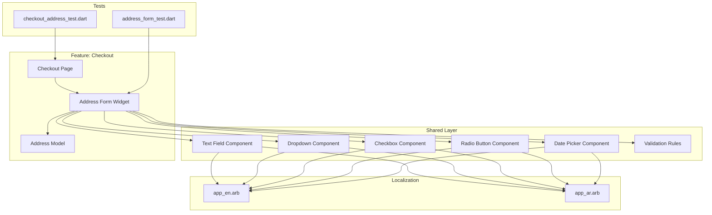
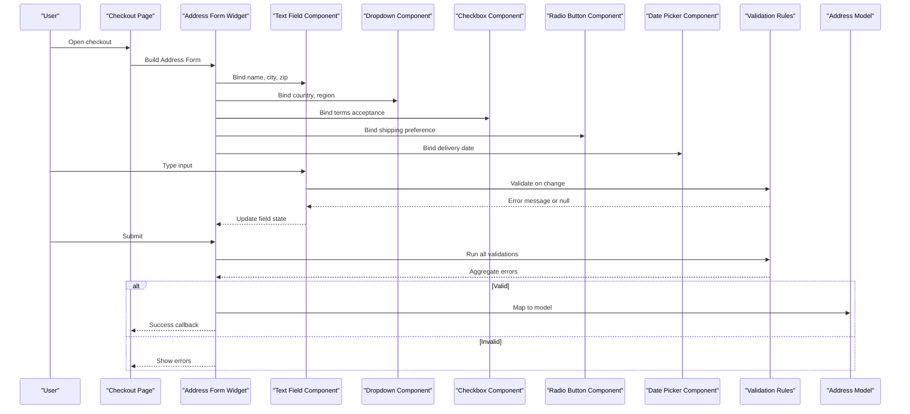
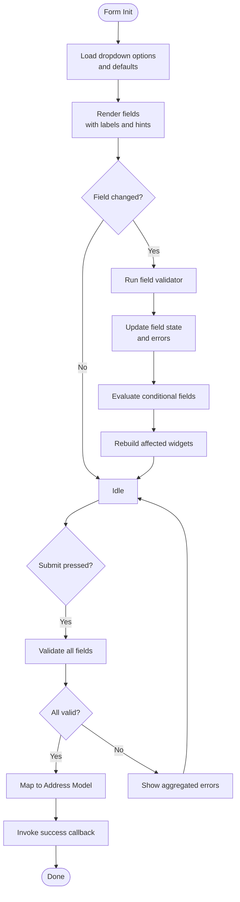
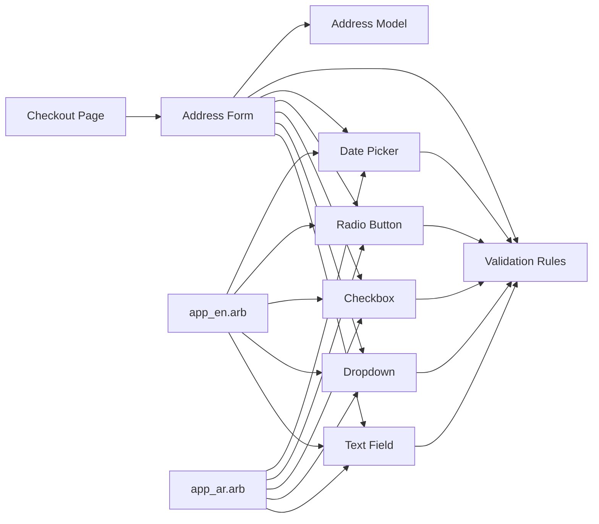

# Form Components

<cite>
**Referenced Files in This Document**
- [lib/features/checkout/domain/models/address_model.dart](file://lib/features/checkout/domain/models/address_model.dart)
- [lib/features/checkout/presentation/pages/checkout_page.dart](file://lib/features/checkout/presentation/pages/checkout_page.dart)
- [lib/features/checkout/presentation/widgets/address_form_widget.dart](file://lib/features/checkout/presentation/widgets/address_form_widget.dart)
- [lib/shared/form/text_field_component.dart](file://lib/shared/form/text_field_component.dart)
- [lib/shared/form/dropdown_component.dart](file://lib/shared/form/dropdown_component.dart)
- [lib/shared/form/checkbox_component.dart](file://lib/shared/form/checkbox_component.dart)
- [lib/shared/form/radio_button_component.dart](file://lib/shared/form/radio_button_component.dart)
- [lib/shared/form/date_picker_component.dart](file://lib/shared/form/date_picker_component.dart)
- [lib/shared/form/validation_rules.dart](file://lib/shared/form/validation_rules.dart)
- [l10n/app_en.arb](file://l10n/app_en.arb)
- [l10n/app_ar.arb](file://l10n/app_ar.arb)
- [test/address_form_test.dart](file://test/address_form_test.dart)
- [test/checkout_address_test.dart](file://test/checkout_address_test.dart)
</cite>

## Table of Contents
1. [Introduction](#introduction)
2. [Project Structure](#project-structure)
3. [Core Components](#core-components)
4. [Architecture Overview](#architecture-overview)
5. [Detailed Component Analysis](#detailed-component-analysis)
6. [Dependency Analysis](#dependency-analysis)
7. [Performance Considerations](#performance-considerations)
8. [Troubleshooting Guide](#troubleshooting-guide)
9. [Conclusion](#conclusion)
10. [Appendices](#appendices)

## Introduction
This document provides comprehensive documentation for form-related components including text fields, dropdowns, checkboxes, radio buttons, and date pickers. It covers validation patterns, error handling, user feedback mechanisms, state management integration, data binding, submission workflows, complex layouts, conditional fields, dynamic generation, accessibility compliance, internationalization support, mobile keyboard handling, and guidelines for creating custom form components and validation rules.

## Project Structure
The form system is organized around reusable shared components under the shared layer and feature-specific forms under features. The checkout flow demonstrates a complete end-to-end example with address collection, validation, and submission.

**Diagram sources**
- [lib/features/checkout/presentation/pages/checkout_page.dart](file://lib/features/checkout/presentation/pages/checkout_page.dart)
- [lib/features/checkout/presentation/widgets/address_form_widget.dart](file://lib/features/checkout/presentation/widgets/address_form_widget.dart)
- [lib/features/checkout/domain/models/address_model.dart](file://lib/features/checkout/domain/models/address_model.dart)
- [lib/shared/form/text_field_component.dart](file://lib/shared/form/text_field_component.dart)
- [lib/shared/form/dropdown_component.dart](file://lib/shared/form/dropdown_component.dart)
- [lib/shared/form/checkbox_component.dart](file://lib/shared/form/checkbox_component.dart)
- [lib/shared/form/radio_button_component.dart](file://lib/shared/form/radio_button_component.dart)
- [lib/shared/form/date_picker_component.dart](file://lib/shared/form/date_picker_component.dart)
- [lib/shared/form/validation_rules.dart](file://lib/shared/form/validation_rules.dart)
- [l10n/app_en.arb](file://l10n/app_en.arb)
- [l10n/app_ar.arb](file://l10n/app_ar.arb)
- [test/address_form_test.dart](file://test/address_form_test.dart)
- [test/checkout_address_test.dart](file://test/checkout_address_test.dart)

**Section sources**
- [lib/features/checkout/presentation/pages/checkout_page.dart](file://lib/features/checkout/presentation/pages/checkout_page.dart)
- [lib/features/checkout/presentation/widgets/address_form_widget.dart](file://lib/features/checkout/presentation/widgets/address_form_widget.dart)
- [lib/features/checkout/domain/models/address_model.dart](file://lib/features/checkout/domain/models/address_model.dart)
- [lib/shared/form/text_field_component.dart](file://lib/shared/form/text_field_component.dart)
- [lib/shared/form/dropdown_component.dart](file://lib/shared/form/dropdown_component.dart)
- [lib/shared/form/checkbox_component.dart](file://lib/shared/form/checkbox_component.dart)
- [lib/shared/form/radio_button_component.dart](file://lib/shared/form/radio_button_component.dart)
- [lib/shared/form/date_picker_component.dart](file://lib/shared/form/date_picker_component.dart)
- [lib/shared/form/validation_rules.dart](file://lib/shared/form/validation_rules.dart)
- [l10n/app_en.arb](file://l10n/app_en.arb)
- [l10n/app_ar.arb](file://l10n/app_ar.arb)
- [test/address_form_test.dart](file://test/address_form_test.dart)
- [test/checkout_address_test.dart](file://test/checkout_address_test.dart)

## Core Components
- Text Field Component: Provides input control with label, hint, validator, error display, keyboard type, autocorrect, and focus behavior. Integrates with localization for labels and messages.
- Dropdown Component: Presents selectable options with search/filter capability, supports disabled states, and displays validation errors.
- Checkbox Component: Binds boolean values, supports custom labels, and shows inline validation feedback.
- Radio Button Component: Manages single selection among multiple options with accessible grouping and localized labels.
- Date Picker Component: Wraps platform-native date selection, formats dates per locale, and validates required or range constraints.
- Validation Rules: Centralized validators for common patterns (required, length, email, phone, numeric, regex), returning structured error messages that integrate with UI components.

Key responsibilities:
- Encapsulate UI and validation logic per field.
- Expose typed value getters/setters for data binding.
- Emit validation events to parent forms for aggregate state.
- Provide consistent error presentation and accessibility semantics.

**Section sources**
- [lib/shared/form/text_field_component.dart](file://lib/shared/form/text_field_component.dart)
- [lib/shared/form/dropdown_component.dart](file://lib/shared/form/dropdown_component.dart)
- [lib/shared/form/checkbox_component.dart](file://lib/shared/form/checkbox_component.dart)
- [lib/shared/form/radio_button_component.dart](file://lib/shared/form/radio_button_component.dart)
- [lib/shared/form/date_picker_component.dart](file://lib/shared/form/date_picker_component.dart)
- [lib/shared/form/validation_rules.dart](file://lib/shared/form/validation_rules.dart)

## Architecture Overview
The form architecture separates concerns across layers:
- Presentation layer: Widgets compose reusable form fields and orchestrate layout and user interactions.
- Domain layer: Models define the shape of submitted data and any domain-level constraints.
- Shared utilities: Validation rules and i18n keys ensure consistency across forms.

**Diagram sources**
- [lib/features/checkout/presentation/pages/checkout_page.dart](file://lib/features/checkout/presentation/pages/checkout_page.dart)
- [lib/features/checkout/presentation/widgets/address_form_widget.dart](file://lib/features/checkout/presentation/widgets/address_form_widget.dart)
- [lib/shared/form/text_field_component.dart](file://lib/shared/form/text_field_component.dart)
- [lib/shared/form/dropdown_component.dart](file://lib/shared/form/dropdown_component.dart)
- [lib/shared/form/checkbox_component.dart](file://lib/shared/form/checkbox_component.dart)
- [lib/shared/form/radio_button_component.dart](file://lib/shared/form/radio_button_component.dart)
- [lib/shared/form/date_picker_component.dart](file://lib/shared/form/date_picker_component.dart)
- [lib/shared/form/validation_rules.dart](file://lib/shared/form/validation_rules.dart)
- [lib/features/checkout/domain/models/address_model.dart](file://lib/features/checkout/domain/models/address_model.dart)

## Detailed Component Analysis

### Address Form Widget
The address form orchestrates multiple fields, aggregates validation, maps inputs to a domain model, and triggers submission callbacks. It demonstrates complex layouts, conditional fields, and dynamic updates based on user selections.

**Diagram sources**
- [lib/features/checkout/presentation/widgets/address_form_widget.dart](file://lib/features/checkout/presentation/widgets/address_form_widget.dart)
- [lib/shared/form/validation_rules.dart](file://lib/shared/form/validation_rules.dart)
- [lib/features/checkout/domain/models/address_model.dart](file://lib/features/checkout/domain/models/address_model.dart)

**Section sources**
- [lib/features/checkout/presentation/widgets/address_form_widget.dart](file://lib/features/checkout/presentation/widgets/address_form_widget.dart)
- [lib/features/checkout/domain/models/address_model.dart](file://lib/features/checkout/domain/models/address_model.dart)

### Text Field Component
Responsibilities:
- Accepts label, hint, validator, keyboard type, autocorrect, and focus node configuration.
- Displays inline errors and supports clearing and toggling visibility for sensitive inputs.
- Emits value changes and validation results to parent forms.

Integration points:
- Uses validation rules to produce localized error messages.
- Supports internationalized labels via l10n keys.

Accessibility:
- Provides semantic labels and error descriptions for screen readers.
- Ensures sufficient contrast and focus indicators.

Mobile considerations:
- Configurable keyboard types and input actions to improve typing experience.
- Avoids unnecessary rebuilds by isolating state within the component.

**Section sources**
- [lib/shared/form/text_field_component.dart](file://lib/shared/form/text_field_component.dart)
- [lib/shared/form/validation_rules.dart](file://lib/shared/form/validation_rules.dart)
- [l10n/app_en.arb](file://l10n/app_en.arb)
- [l10n/app_ar.arb](file://l10n/app_ar.arb)

### Dropdown Component
Responsibilities:
- Renders a list of options with optional search/filtering.
- Supports disabled states and multi-select if needed.
- Validates presence of selection and displays localized errors.

Integration points:
- Consumes validation rules for required checks.
- Binds selected option to parent form state.

Accessibility:
- Announces current selection and available options.
- Maintains focus order and keyboard navigation.

**Section sources**
- [lib/shared/form/dropdown_component.dart](file://lib/shared/form/dropdown_component.dart)
- [lib/shared/form/validation_rules.dart](file://lib/shared/form/validation_rules.dart)
- [l10n/app_en.arb](file://l10n/app_en.arb)
- [l10n/app_ar.arb](file://l10n/app_ar.arb)

### Checkbox Component
Responsibilities:
- Binds boolean values and toggles state on interaction.
- Shows validation errors when required and not checked.
- Supports custom labels and helper text.

Accessibility:
- Provides role and checked state announcements.
- Ensures clear visual indication of checked state.

**Section sources**
- [lib/shared/form/checkbox_component.dart](file://lib/shared/form/checkbox_component.dart)
- [lib/shared/form/validation_rules.dart](file://lib/shared/form/validation_rules.dart)
- [l10n/app_en.arb](file://l10n/app_en.arb)
- [l10n/app_ar.arb](file://l10n/app_ar.arb)

### Radio Button Component
Responsibilities:
- Manages single selection from grouped options.
- Validates that an option is selected when required.
- Supports localized labels and helper text.

Accessibility:
- Groups related radios with accessible roles.
- Announces group context and selected option.

**Section sources**
- [lib/shared/form/radio_button_component.dart](file://lib/shared/form/radio_button_component.dart)
- [lib/shared/form/validation_rules.dart](file://lib/shared/form/validation_rules.dart)
- [l10n/app_en.arb](file://l10n/app_en.arb)
- [l10n/app_ar.arb](file://l10n/app_ar.arb)

### Date Picker Component
Responsibilities:
- Opens native date picker and returns formatted date.
- Validates required selection and optional min/max ranges.
- Formats output according to locale settings.

Accessibility:
- Announces selected date and picker status.
- Provides clear error messaging for invalid selections.

**Section sources**
- [lib/shared/form/date_picker_component.dart](file://lib/shared/form/date_picker_component.dart)
- [lib/shared/form/validation_rules.dart](file://lib/shared/form/validation_rules.dart)
- [l10n/app_en.arb](file://l10n/app_en.arb)
- [l10n/app_ar.arb](file://l10n/app_ar.arb)

### Validation Rules
Centralized validators provide consistent, reusable rules:
- Required, minimum/maximum length, email, phone, numeric, and regex-based patterns.
- Return structured error messages that integrate with UI components.
- Support composing multiple rules for complex constraints.

Usage pattern:
- Each field passes its current value to the appropriate rule(s).
- Errors are displayed inline and aggregated at form submission time.

**Section sources**
- [lib/shared/form/validation_rules.dart](file://lib/shared/form/validation_rules.dart)

### Internationalization Support
All form components consume localized strings for labels, hints, and error messages. Keys are defined in ARB files and accessed through generated localization classes.

Best practices:
- Use descriptive keys for each field’s label and error messages.
- Ensure pluralization and gender where applicable.
- Test both LTR and RTL layouts for correct alignment.

**Section sources**
- [l10n/app_en.arb](file://l10n/app_en.arb)
- [l10n/app_ar.arb](file://l10n/app_ar.arb)

### Mobile Keyboard Handling
Recommendations:
- Set appropriate keyboard types per field (e.g., number, email, tel).
- Configure input action buttons (Next, Done) to navigate between fields.
- Avoid auto-capitalization unless necessary; disable autocorrect for codes.
- Use padding and safe areas to prevent keyboard overlap.

**Section sources**
- [lib/shared/form/text_field_component.dart](file://lib/shared/form/text_field_component.dart)

### Accessibility Compliance
Guidelines:
- Provide semantic labels and descriptions for all interactive elements.
- Ensure focus order matches logical reading order.
- Maintain color contrast ratios for text and error states.
- Announce validation errors to assistive technologies without interrupting flow.

**Section sources**
- [lib/shared/form/text_field_component.dart](file://lib/shared/form/text_field_component.dart)
- [lib/shared/form/dropdown_component.dart](file://lib/shared/form/dropdown_component.dart)
- [lib/shared/form/checkbox_component.dart](file://lib/shared/form/checkbox_component.dart)
- [lib/shared/form/radio_button_component.dart](file://lib/shared/form/radio_button_component.dart)
- [lib/shared/form/date_picker_component.dart](file://lib/shared/form/date_picker_component.dart)

### Complex Layouts, Conditional Fields, and Dynamic Generation
Patterns:
- Use columnar layouts to organize related fields.
- Conditionally render fields based on previous selections (e.g., show “Other” details when “Other” is chosen).
- Generate repeated sections dynamically using lists and unique keys.
- Debounce heavy computations during input to maintain responsiveness.

Example reference:
- Address form demonstrates conditional rendering and aggregation of multiple fields into a domain model.

**Section sources**
- [lib/features/checkout/presentation/widgets/address_form_widget.dart](file://lib/features/checkout/presentation/widgets/address_form_widget.dart)

### Submission Workflows
Flow:
- Collect values from all fields.
- Run validation rules across the entire form.
- If valid, map to domain model and invoke success callback.
- If invalid, present aggregated errors and highlight offending fields.

Error handling:
- Distinguish between network errors and validation errors.
- Provide retry mechanisms for failed submissions.
- Persist partial progress to avoid data loss.

**Section sources**
- [lib/features/checkout/presentation/widgets/address_form_widget.dart](file://lib/features/checkout/presentation/widgets/address_form_widget.dart)
- [lib/shared/form/validation_rules.dart](file://lib/shared/form/validation_rules.dart)

### Data Binding and State Management Integration
Approaches:
- Local state within form widgets for simple scenarios.
- External state managers (e.g., Cubit/Provider) for complex flows and cross-screen persistence.
- Two-way binding via controlled components that expose value setters and change callbacks.

Data mapping:
- Convert UI values to domain models before submission.
- Normalize inputs (trimming, casing) prior to validation.

**Section sources**
- [lib/features/checkout/presentation/pages/checkout_page.dart](file://lib/features/checkout/presentation/pages/checkout_page.dart)
- [lib/features/checkout/domain/models/address_model.dart](file://lib/features/checkout/domain/models/address_model.dart)

### Custom Form Component Creation Guidelines
Steps:
- Define props: label, hint, validator, enabled/disabled, and accessibility attributes.
- Manage internal state for value and error display.
- Integrate with validation rules and localize messages.
- Expose callbacks for change and blur events.
- Ensure keyboard and focus behavior aligns with platform conventions.

Validation rule implementation:
- Keep rules pure and composable.
- Return explicit error messages keyed for localization.
- Allow chaining multiple rules for complex constraints.

**Section sources**
- [lib/shared/form/validation_rules.dart](file://lib/shared/form/validation_rules.dart)

## Dependency Analysis
The form system exhibits low coupling between individual components and high cohesion within each widget. Shared validation rules centralize business logic, while localization decouples content from behavior.

**Diagram sources**
- [lib/shared/form/text_field_component.dart](file://lib/shared/form/text_field_component.dart)
- [lib/shared/form/dropdown_component.dart](file://lib/shared/form/dropdown_component.dart)
- [lib/shared/form/checkbox_component.dart](file://lib/shared/form/checkbox_component.dart)
- [lib/shared/form/radio_button_component.dart](file://lib/shared/form/radio_button_component.dart)
- [lib/shared/form/date_picker_component.dart](file://lib/shared/form/date_picker_component.dart)
- [lib/shared/form/validation_rules.dart](file://lib/shared/form/validation_rules.dart)
- [lib/features/checkout/presentation/widgets/address_form_widget.dart](file://lib/features/checkout/presentation/widgets/address_form_widget.dart)
- [lib/features/checkout/domain/models/address_model.dart](file://lib/features/checkout/domain/models/address_model.dart)
- [lib/features/checkout/presentation/pages/checkout_page.dart](file://lib/features/checkout/presentation/pages/checkout_page.dart)
- [l10n/app_en.arb](file://l10n/app_en.arb)
- [l10n/app_ar.arb](file://l10n/app_ar.arb)

**Section sources**
- [lib/shared/form/text_field_component.dart](file://lib/shared/form/text_field_component.dart)
- [lib/shared/form/dropdown_component.dart](file://lib/shared/form/dropdown_component.dart)
- [lib/shared/form/checkbox_component.dart](file://lib/shared/form/checkbox_component.dart)
- [lib/shared/form/radio_button_component.dart](file://lib/shared/form/radio_button_component.dart)
- [lib/shared/form/date_picker_component.dart](file://lib/shared/form/date_picker_component.dart)
- [lib/shared/form/validation_rules.dart](file://lib/shared/form/validation_rules.dart)
- [lib/features/checkout/presentation/widgets/address_form_widget.dart](file://lib/features/checkout/presentation/widgets/address_form_widget.dart)
- [lib/features/checkout/domain/models/address_model.dart](file://lib/features/checkout/domain/models/address_model.dart)
- [lib/features/checkout/presentation/pages/checkout_page.dart](file://lib/features/checkout/presentation/pages/checkout_page.dart)
- [l10n/app_en.arb](file://l10n/app_en.arb)
- [l10n/app_ar.arb](file://l10n/app_ar.arb)

## Performance Considerations
- Minimize rebuilds by isolating field state within components and using efficient update strategies.
- Debounce expensive validations or API calls triggered by input changes.
- Avoid heavy computations in build methods; precompute options and formaters where possible.
- Use const constructors for static parts of forms to reduce overhead.
- Optimize dropdown filtering by limiting initial items and implementing virtualization for large lists.

[No sources needed since this section provides general guidance]

## Troubleshooting Guide
Common issues and resolutions:
- Validation not triggering: Ensure validators are attached to fields and invoked on change/blur.
- Localization missing: Verify ARB keys exist and are imported correctly.
- Focus and keyboard problems: Confirm keyboard types and input actions are set appropriately.
- Conditional fields not updating: Check dependency tracking and rebuild scopes.
- Submission failures: Differentiate between validation errors and network errors; implement retry and user feedback.

Testing references:
- Unit tests for address form behavior and validation outcomes.
- Integration tests for checkout address flow.

**Section sources**
- [test/address_form_test.dart](file://test/address_form_test.dart)
- [test/checkout_address_test.dart](file://test/checkout_address_test.dart)

## Conclusion
The form system leverages reusable, accessible, and localized components with centralized validation rules. The checkout address form exemplifies complex layouts, conditional fields, and robust submission workflows. By following the provided guidelines, teams can create consistent, high-quality forms that perform well across platforms and meet accessibility and internationalization standards.

[No sources needed since this section summarizes without analyzing specific files]

## Appendices

### Example References
- Address form implementation and usage:
  - [lib/features/checkout/presentation/widgets/address_form_widget.dart](file://lib/features/checkout/presentation/widgets/address_form_widget.dart)
  - [lib/features/checkout/presentation/pages/checkout_page.dart](file://lib/features/checkout/presentation/pages/checkout_page.dart)
  - [lib/features/checkout/domain/models/address_model.dart](file://lib/features/checkout/domain/models/address_model.dart)

- Shared form components:
  - [lib/shared/form/text_field_component.dart](file://lib/shared/form/text_field_component.dart)
  - [lib/shared/form/dropdown_component.dart](file://lib/shared/form/dropdown_component.dart)
  - [lib/shared/form/checkbox_component.dart](file://lib/shared/form/checkbox_component.dart)
  - [lib/shared/form/radio_button_component.dart](file://lib/shared/form/radio_button_component.dart)
  - [lib/shared/form/date_picker_component.dart](file://lib/shared/form/date_picker_component.dart)
  - [lib/shared/form/validation_rules.dart](file://lib/shared/form/validation_rules.dart)

- Localization:
  - [l10n/app_en.arb](file://l10n/app_en.arb)
  - [l10n/app_ar.arb](file://l10n/app_ar.arb)

- Tests:
  - [test/address_form_test.dart](file://test/address_form_test.dart)
  - [test/checkout_address_test.dart](file://test/checkout_address_test.dart)