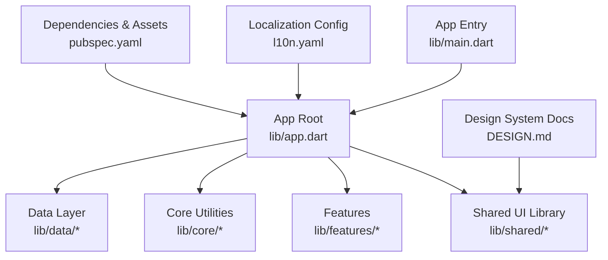
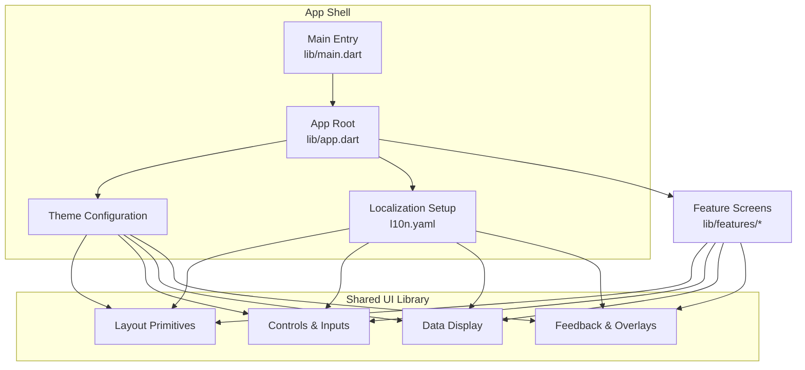
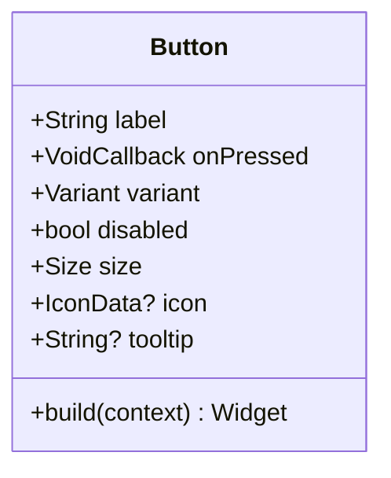
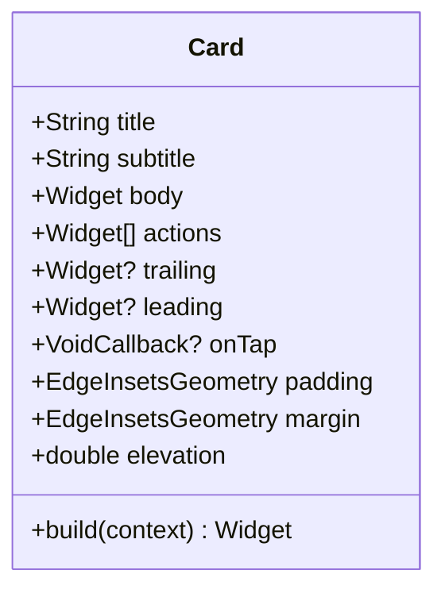
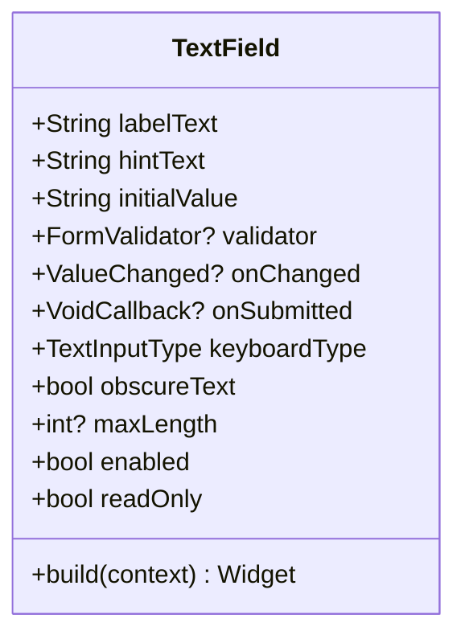
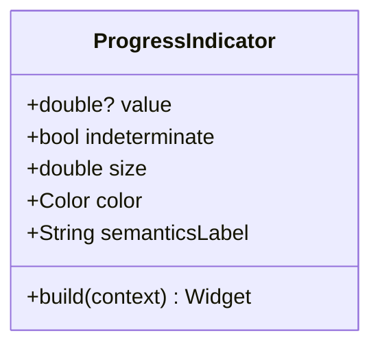
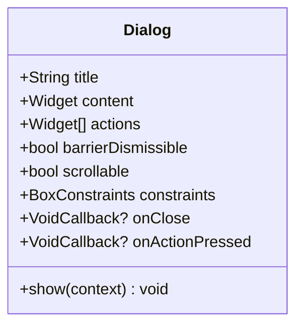
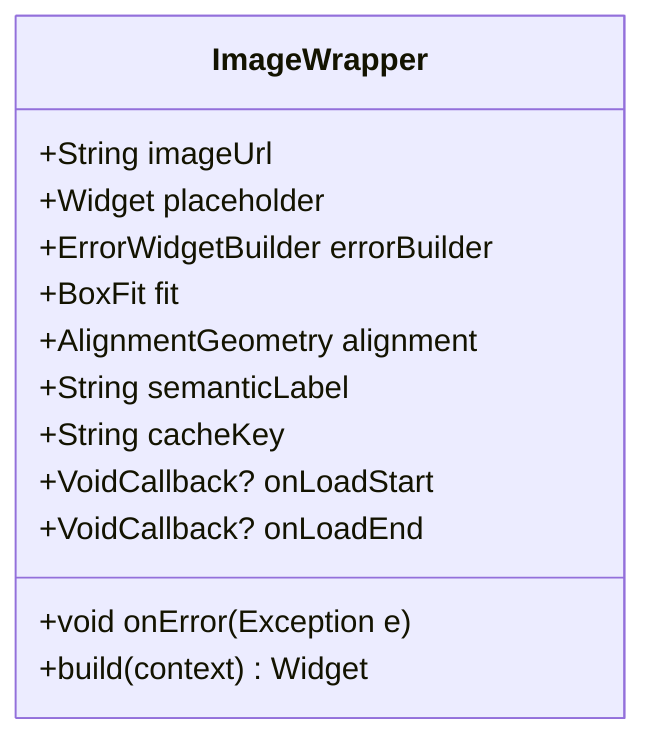
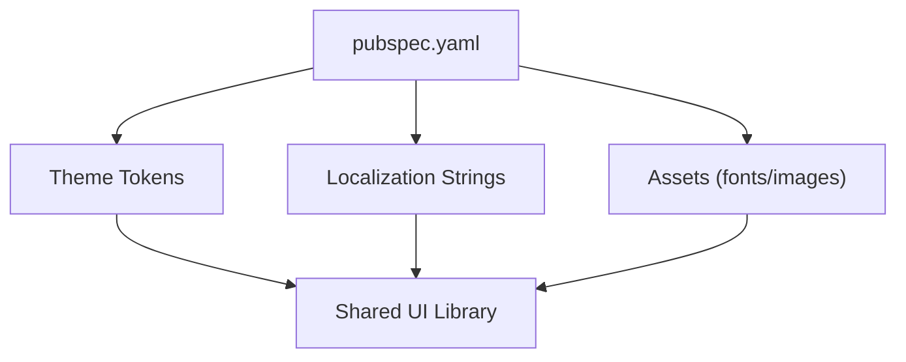

# Shared UI Components

<cite>
**Referenced Files in This Document**
- [app.dart](file://lib/app.dart)
- [main.dart](file://lib/main.dart)
- [DESIGN.md](file://DESIGN.md)
- [INSTRUCTIONS.md](file://INSTRUCTIONS.md)
- [README.md](file://README.md)
- [l10n.yaml](file://l10n.yaml)
- [pubspec.yaml](file://pubspec.yaml)
</cite>

## Table of Contents
1. [Introduction](#introduction)
2. [Project Structure](#project-structure)
3. [Core Components](#core-components)
4. [Architecture Overview](#architecture-overview)
5. [Detailed Component Analysis](#detailed-component-analysis)
6. [Dependency Analysis](#dependency-analysis)
7. [Performance Considerations](#performance-considerations)
8. [Troubleshooting Guide](#troubleshooting-guide)
9. [Conclusion](#conclusion)
10. [Appendices](#appendices)

## Introduction
This document describes the shared UI components library for the project, focusing on reusable widgets, custom components, and design system implementations. It explains component architecture, props/attributes, events, customization options, theme integration, styling approaches, responsive design patterns, accessibility features, internationalization support, and platform-specific adaptations. It also provides guidelines for creating new shared components and maintaining consistency across the design system.

## Project Structure
The Flutter application is organized with a clear separation between core logic, feature modules, data layer, and shared UI assets. The shared UI components are intended to live under a dedicated shared directory and be consumed by feature screens and pages. The app entry point wires up localization, theming, and routing, while the design system documentation outlines tokens and conventions used across components.

**Diagram sources**
- [main.dart:1-200](file://lib/main.dart#L1-L200)
- [app.dart:1-200](file://lib/app.dart#L1-L200)
- [DESIGN.md:1-200](file://DESIGN.md#L1-L200)
- [l10n.yaml:1-200](file://l10n.yaml#L1-L200)
- [pubspec.yaml:1-200](file://pubspec.yaml#L1-L200)

**Section sources**
- [main.dart:1-200](file://lib/main.dart#L1-L200)
- [app.dart:1-200](file://lib/app.dart#L1-L200)
- [DESIGN.md:1-200](file://DESIGN.md#L1-L200)
- [l10n.yaml:1-200](file://l10n.yaml#L1-L200)
- [pubspec.yaml:1-200](file://pubspec.yaml#L1-L200)

## Core Components
The shared UI library should provide a cohesive set of reusable building blocks that encapsulate common UI patterns and adhere to the design system. Typical categories include:

- Layout primitives: containers, grids, stacks, spacers, dividers
- Navigation helpers: back buttons, tab bars, breadcrumbs
- Data display: lists, cards, badges, chips, avatars, progress indicators
- Inputs and controls: text fields, buttons, switches, sliders, dropdowns
- Feedback and overlays: snackbars, dialogs, tooltips, loaders
- Media and icons: image wrappers, icon buttons, placeholders

Guidelines for each component:
- Props/Attributes: define explicit, typed parameters with sensible defaults; prefer small, composable props over large configuration objects.
- Events: expose callbacks for user interactions (e.g., onTap, onSubmit, onChange); avoid exposing internal state mutations.
- Customization: allow theme-driven styling via theme keys; provide optional overrides for colors, typography, spacing, and shapes.
- Accessibility: ensure semantic labels, focus handling, contrast compliance, and screen reader announcements where applicable.
- Internationalization: use generated locale strings for all user-facing text; never hardcode literals.
- Responsiveness: adapt layout using constraints and breakpoints; prefer flexible layouts over fixed sizes.
- Platform adaptation: handle platform differences (iOS vs Android) for navigation gestures, input behaviors, and visual nuances.

[No sources needed since this section provides general guidance]

## Architecture Overview
The shared UI components integrate with the app’s theme and localization layers. The app root configures the theme and delegates to the shared library for rendering UI elements. Localization is enabled through the l10n configuration, ensuring all components can access translated strings consistently.

**Diagram sources**
- [main.dart:1-200](file://lib/main.dart#L1-L200)
- [app.dart:1-200](file://lib/app.dart#L1-L200)
- [l10n.yaml:1-200](file://l10n.yaml#L1-L200)

## Detailed Component Analysis
Below are example patterns for how shared components should be structured and documented. Replace these examples with actual component names and files from lib/shared once available.

### Button Component
- Purpose: Primary action button with consistent styling and behavior.
- Props: label, onPressed, variant (primary/secondary), disabled, size, icon, tooltip.
- Events: onPressed callback; optionally onLongPress.
- Customization: colorScheme key, shape, elevation, padding, typography style.
- Accessibility: semanticLabel, focusable, minimum touch target size.
- Internationalization: label sourced from generated locale strings.
- Responsiveness: adapts width and padding based on constraints and device type.
- Platform adaptation: ripple effect and elevation tuned per platform.

**Diagram sources**
- [DESIGN.md:1-200](file://DESIGN.md#L1-L200)

**Section sources**
- [DESIGN.md:1-200](file://DESIGN.md#L1-L200)

### Card Component
- Purpose: Container for grouped content with consistent padding, elevation, and corner radius.
- Props: title, subtitle, body, actions, trailing, leading, onTap, padding, margin, elevation.
- Events: onTap for card-level interaction.
- Customization: shape, shadow, background color via theme keys.
- Accessibility: role semantics, accessible name, focus traversal.
- Internationalization: title/subtitle/body from locale strings.
- Responsiveness: adjusts layout for narrow widths; wraps content appropriately.
- Platform adaptation: subtle differences in shadow and tap feedback.

**Diagram sources**
- [DESIGN.md:1-200](file://DESIGN.md#L1-L200)

**Section sources**
- [DESIGN.md:1-200](file://DESIGN.md#L1-L200)

### Text Field Component
- Purpose: Input field with validation, helper text, and error states.
- Props: labelText, hintText, initialValue, validator, onChanged, onSubmitted, keyboardType, obscureText, maxLength, enabled, readOnly.
- Events: onChanged, onSubmitted, onFocusChange.
- Customization: decoration theme, border styles, error color, success color.
- Accessibility: semanticLabel, hint accessibility, error announcement.
- Internationalization: labelText/hintText from locale strings.
- Responsiveness: adapts font size and padding for smaller screens.
- Platform adaptation: keyboard appearance and input method variations.

**Diagram sources**
- [DESIGN.md:1-200](file://DESIGN.md#L1-L200)

**Section sources**
- [DESIGN.md:1-200](file://DESIGN.md#L1-L200)

### Progress Indicator Component
- Purpose: Visual feedback for ongoing operations.
- Props: value (for determinate), indeterminate (boolean), size, color, semanticsLabel.
- Events: none (purely presentational).
- Customization: trackColor, valueColor, strokeWidth.
- Accessibility: announces progress when determinate; hides from screen readers when indeterminate if appropriate.
- Internationalization: not applicable.
- Responsiveness: scales size based on context.
- Platform adaptation: uses platform-appropriate indicator styles.

**Diagram sources**
- [DESIGN.md:1-200](file://DESIGN.md#L1-L200)

**Section sources**
- [DESIGN.md:1-200](file://DESIGN.md#L1-L200)

### Dialog Component
- Purpose: Modal overlay for confirmations or focused tasks.
- Props: title, content, actions, barrierDismissible, scrollable, constraints.
- Events: onClose, onActionPressed.
- Customization: shape, backgroundColor, elevation, transitions.
- Accessibility: focus trapping, dialog role, accessible titles.
- Internationalization: title/content from locale strings.
- Responsiveness: adapts max width and padding for mobile vs desktop.
- Platform adaptation: modal presentation and dismiss gestures.

**Diagram sources**
- [DESIGN.md:1-200](file://DESIGN.md#L1-L200)

**Section sources**
- [DESIGN.md:1-200](file://DESIGN.md#L1-L200)

### Image Wrapper Component
- Purpose: Consistent image loading, placeholder, and error handling.
- Props: imageUrl, placeholder, errorBuilder, fit, alignment, semanticLabel, cacheKey.
- Events: onLoadStart, onLoadEnd, onError.
- Customization: placeholder widget, error widget, border radius, shadow.
- Accessibility: semanticLabel for images; alt text equivalent.
- Internationalization: not applicable.
- Responsiveness: adapts sizing and caching strategy.
- Platform adaptation: network image caching and decoding optimizations.

**Diagram sources**
- [DESIGN.md:1-200](file://DESIGN.md#L1-L200)

**Section sources**
- [DESIGN.md:1-200](file://DESIGN.md#L1-L200)

## Dependency Analysis
The shared UI components depend on the app’s theme and localization setup. Ensure dependencies are declared in the package manifest and that assets (fonts, images) are registered for consumption by shared components.

**Diagram sources**
- [pubspec.yaml:1-200](file://pubspec.yaml#L1-L200)
- [l10n.yaml:1-200](file://l10n.yaml#L1-L200)

**Section sources**
- [pubspec.yaml:1-200](file://pubspec.yaml#L1-L200)
- [l10n.yaml:1-200](file://l10n.yaml#L1-L200)

## Performance Considerations
- Prefer const constructors for immutable widgets to reduce rebuilds.
- Use RepaintBoundary sparingly; only around expensive painting regions.
- Avoid heavy computations inside build methods; memoize results where possible.
- Leverage theme lookups efficiently; avoid repeated theme queries in tight loops.
- Optimize image loading with proper sizing and caching strategies.
- Minimize unnecessary state changes; coalesce updates at higher levels.

[No sources needed since this section provides general guidance]

## Troubleshooting Guide
Common issues and resolutions:
- Theme mismatch: verify theme keys exist and match expected types; ensure theme is provided at the app root.
- Localization missing: confirm l10n generation is configured and strings are present in ARB files; regenerate locale artifacts.
- Accessibility failures: check semantic labels and focus order; run accessibility audits and fix violations.
- Responsive layout problems: inspect constraints and breakpoints; adjust paddings and font sizes for small screens.
- Platform inconsistencies: test on iOS and Android; adjust platform-specific behaviors and visuals.

[No sources needed since this section provides general guidance]

## Conclusion
A well-structured shared UI components library improves consistency, accelerates development, and enhances maintainability. By adhering to clear prop/event contracts, leveraging theme and localization, and prioritizing accessibility and responsiveness, teams can deliver high-quality user experiences across platforms.

[No sources needed since this section summarizes without analyzing specific files]

## Appendices

### Guidelines for Creating New Shared Components
- Start with a clear purpose and minimal API surface.
- Define typed props with defaults; avoid large configuration objects.
- Expose events as callbacks; do not mutate external state directly.
- Integrate with theme tokens for colors, typography, spacing, and shapes.
- Provide accessibility attributes and ensure screen reader compatibility.
- Use generated locale strings for all user-facing text.
- Test responsiveness across breakpoints and devices.
- Document usage examples and composition patterns.

[No sources needed since this section provides general guidance]

### Usage Examples and Composition Patterns
- Compose complex screens by combining layout primitives, controls, and data display components.
- Wrap inputs with validation and error display components.
- Use progress indicators within async workflows and show dialogs for confirmations.
- Apply consistent spacing and typography via theme tokens.

[No sources needed since this section provides general guidance]

### Internationalization Support
- Configure l10n in the project manifest and generate locale artifacts.
- Reference generated strings in components instead of hardcoding text.
- Ensure fallback locales are defined and tested.

**Section sources**
- [l10n.yaml:1-200](file://l10n.yaml#L1-L200)

### Platform-Specific Adaptations
- Adjust navigation gestures and modal presentations per platform.
- Tune input behaviors (keyboard appearance, autocorrect) for platform norms.
- Validate visual fidelity and performance on both iOS and Android.

[No sources needed since this section provides general guidance]