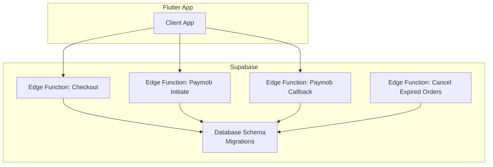
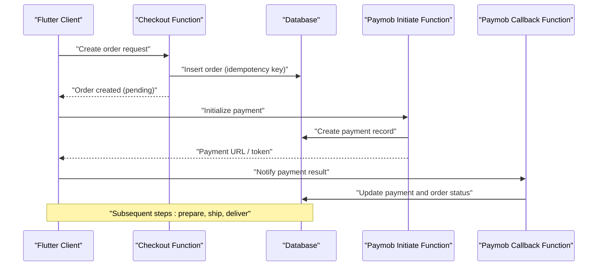
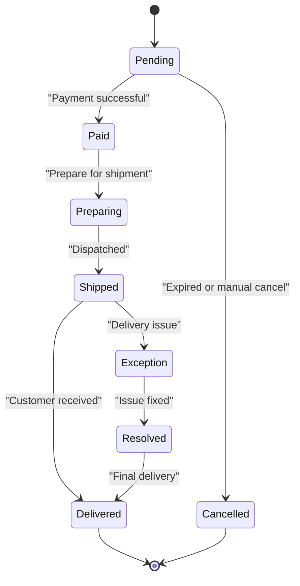
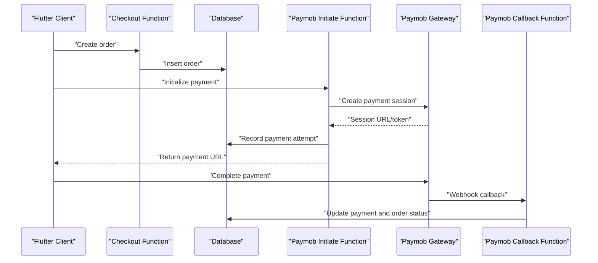
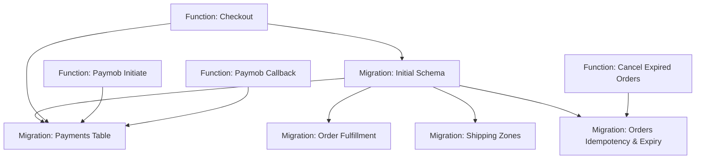

# Business Operations Tables

<cite>
**Referenced Files in This Document**
- [001_initial_schema.sql](file://supabase/migrations/001_initial_schema.sql)
- [006_payments_table.sql](file://supabase/migrations/006_payments_table.sql)
- [008_order_fulfillment.sql](file://supabase/migrations/008_order_fulfillment.sql)
- [009_shipping_zones.sql](file://supabase/migrations/009_shipping_zones.sql)
- [011_orders_idempotency_and_expiry.sql](file://supabase/migrations/011_orders_idempotency_and_expiry.sql)
- [checkout/index.ts](file://supabase/functions/checkout/index.ts)
- [paymob-initiate/index.ts](file://supabase/functions/paymob-initiate/index.ts)
- [paymob-callback/index.ts](file://supabase/functions/paymob-callback/index.ts)
- [cancel-expired-orders/index.ts](file://supabase/functions/cancel-expired-orders/index.ts)
</cite>

## Table of Contents
1. [Introduction](#introduction)
2. [Project Structure](#project-structure)
3. [Core Components](#core-components)
4. [Architecture Overview](#architecture-overview)
5. [Detailed Component Analysis](#detailed-component-analysis)
6. [Dependency Analysis](#dependency-analysis)
7. [Performance Considerations](#performance-considerations)
8. [Troubleshooting Guide](#troubleshooting-guide)
9. [Conclusion](#conclusion)

## Introduction
This document describes the business operations data model for Albatal Store, focusing on orders, payments, shipping zones, and fulfillment tracking. It explains the end-to-end order lifecycle, payment processing integration with Paymob, transaction tracking, refund handling, shipping zone configuration, logistics management, idempotency mechanisms, expiry handling for pending orders, audit trails, validation rules, business constraints, and transactional integrity requirements.

## Project Structure
The business operations are implemented primarily through Supabase migrations (database schema), Edge Functions (business logic and integrations), and Flutter features that consume these APIs. The relevant files for this document include:
- Database schema migrations for core tables and enhancements
- Edge Functions for checkout, Paymob integration, callback handling, and expired order cancellation

[No sources needed since this diagram shows conceptual workflow, not actual code structure]

## Core Components
- Orders: Represent customer purchases, including totals, currency, status, and timestamps. Enhanced with idempotency keys and expiry windows to prevent duplicate submissions and handle stale pending orders.
- Payments: Track payment attempts, gateway responses, and outcomes, including Paymob-specific identifiers and statuses. Supports refunds and reconciliation.
- Shipping Zones: Define geographic delivery regions, associated costs, and delivery options. Used during checkout to compute shipping fees and available carriers.
- Fulfillment Tracking: Record shipment creation, carrier details, tracking numbers, and status transitions from preparation to delivery or exceptions.

Key responsibilities:
- Enforce business constraints via database-level checks and triggers
- Provide idempotent order creation and payment processing
- Maintain an audit trail for critical state changes
- Ensure consistent order lifecycle transitions

**Section sources**
- [001_initial_schema.sql](file://supabase/migrations/001_initial_schema.sql)
- [006_payments_table.sql](file://supabase/migrations/006_payments_table.sql)
- [008_order_fulfillment.sql](file://supabase/migrations/008_order_fulfillment.sql)
- [009_shipping_zones.sql](file://supabase/migrations/009_shipping_zones.sql)
- [011_orders_idempotency_and_expiry.sql](file://supabase/migrations/011_orders_idempotency_and_expiry.sql)

## Architecture Overview
The order lifecycle integrates client requests, serverless functions, and database operations:

**Diagram sources**
- [checkout/index.ts](file://supabase/functions/checkout/index.ts)
- [paymob-initiate/index.ts](file://supabase/functions/paymob-initiate/index.ts)
- [paymob-callback/index.ts](file://supabase/functions/paymob-callback/index.ts)

## Detailed Component Analysis

### Orders Data Model
- Purpose: Capture purchase intent, line items, totals, currency, and lifecycle state.
- Key attributes:
  - Unique identifier
  - Customer reference
  - Totals and currency
  - Status (e.g., pending, paid, preparing, shipped, delivered, cancelled)
  - Idempotency key to prevent duplicate submissions
  - Expiry timestamp for pending orders
  - Audit fields (created_at, updated_at)
- Constraints and validations:
  - Non-negative totals
  - Currency must be a supported ISO code
  - Status transitions enforced by application logic and database checks
  - Idempotency key uniqueness per user/session context
- Transactional integrity:
  - Order creation is atomic; related records (line items, shipping address) are inserted within the same transaction where applicable.

**Section sources**
- [001_initial_schema.sql](file://supabase/migrations/001_initial_schema.sql)
- [011_orders_idempotency_and_expiry.sql](file://supabase/migrations/011_orders_idempotency_and_expiry.sql)

### Payments Data Model
- Purpose: Track payment attempts, gateway interactions, and outcomes.
- Key attributes:
  - Unique identifier
  - Associated order reference
  - Gateway provider (e.g., Paymob)
  - External transaction identifiers (e.g., Paymob transaction ID)
  - Amount and currency
  - Status (e.g., initiated, authorized, captured, refunded, failed)
  - Metadata for callbacks and reconciliation
  - Timestamps for lifecycle events
- Refund handling:
  - Separate refund records linked to original payment
  - Refund amount cannot exceed original payment amount
  - Status updates propagate to order totals and accounting
- Validation rules:
  - Amount must match order total at time of capture
  - Currency consistency between order and payment
  - Idempotent payment initiation using external IDs

**Section sources**
- [006_payments_table.sql](file://supabase/migrations/006_payments_table.sql)

### Shipping Zones Data Model
- Purpose: Configure delivery regions, costs, and options.
- Key attributes:
  - Zone name and description
  - Geographic boundaries (country, region, city, postal codes)
  - Delivery options (standard, express)
  - Cost calculation rules (flat fee, weight-based, price-based)
  - Active/inactive flags
- Business constraints:
  - At least one active option per zone
  - Costs must be non-negative
  - Overlapping zones resolved by priority or specificity
- Integration points:
  - Checkout function computes shipping cost based on customer address and selected option
  - Fulfillment uses zone to determine eligible carriers and SLAs

**Section sources**
- [009_shipping_zones.sql](file://supabase/migrations/009_shipping_zones.sql)

### Fulfillment Tracking Data Model
- Purpose: Record shipment lifecycle from preparation to delivery.
- Key attributes:
  - Order reference
  - Carrier information
  - Tracking number(s)
  - Status (prepared, dispatched, in transit, delivered, exception)
  - Event timestamps and notes
- State transitions:
  - Prepared -> Dispatched -> In Transit -> Delivered
  - Any state can transition to Exception with reason
- Audit trail:
  - Each status change recorded with actor/system and timestamp
  - Notes field captures human-readable context

**Section sources**
- [008_order_fulfillment.sql](file://supabase/migrations/008_order_fulfillment.sql)

### Order Lifecycle and State Management
The order lifecycle progresses through well-defined states:

- Idempotency:
  - Order creation requires a unique idempotency key to avoid duplicates
  - Payment initiation uses external transaction IDs for idempotent retries
- Expiry handling:
  - Pending orders have an expiry window
  - Background job cancels expired pending orders

**Diagram sources**
- [011_orders_idempotency_and_expiry.sql](file://supabase/migrations/011_orders_idempotency_and_expiry.sql)
- [cancel-expired-orders/index.ts](file://supabase/functions/cancel-expired-orders/index.ts)

**Section sources**
- [011_orders_idempotency_and_expiry.sql](file://supabase/migrations/011_orders_idempotency_and_expiry.sql)
- [cancel-expired-orders/index.ts](file://supabase/functions/cancel-expired-orders/index.ts)

### Payment Processing Integration with Paymob
Integration flow:
- Client initiates checkout and creates an order
- Server initializes Paymob payment session
- Client completes payment via Paymob UI
- Paymob sends callback to update payment and order status
- Refunds are processed against existing payment records

**Diagram sources**
- [checkout/index.ts](file://supabase/functions/checkout/index.ts)
- [paymob-initiate/index.ts](file://supabase/functions/paymob-initiate/index.ts)
- [paymob-callback/index.ts](file://supabase/functions/paymob-callback/index.ts)

**Section sources**
- [checkout/index.ts](file://supabase/functions/checkout/index.ts)
- [paymob-initiate/index.ts](file://supabase/functions/paymob-initiate/index.ts)
- [paymob-callback/index.ts](file://supabase/functions/paymob-callback/index.ts)

### Idempotency Mechanisms
- Order creation:
  - Requires a unique idempotency key per user/session
  - Duplicate submissions return the existing order without side effects
- Payment initiation:
  - Uses external transaction IDs to ensure idempotent retries
  - Prevents double-charging when clients retry due to network issues

**Section sources**
- [011_orders_idempotency_and_expiry.sql](file://supabase/migrations/011_orders_idempotency_and_expiry.sql)

### Expiry Handling for Pending Orders
- Pending orders have an expiry timestamp
- A scheduled background job scans for expired pending orders and cancels them
- Cancellation updates order status and frees reserved resources (e.g., stock holds if applicable)

**Section sources**
- [011_orders_idempotency_and_expiry.sql](file://supabase/migrations/011_orders_idempotency_and_expiry.sql)
- [cancel-expired-orders/index.ts](file://supabase/functions/cancel-expired-orders/index.ts)

### Audit Trails for Business Operations
- All critical state changes are recorded with timestamps and actors
- Payment status updates include gateway response metadata
- Fulfillment events capture carrier, tracking numbers, and notes
- Audit logs support reconciliation and dispute resolution

**Section sources**
- [006_payments_table.sql](file://supabase/migrations/006_payments_table.sql)
- [008_order_fulfillment.sql](file://supabase/migrations/008_order_fulfillment.sql)

### Data Validation Rules and Business Constraints
- Monetary values:
  - Non-negative amounts
  - Currency must be valid ISO code
  - Payment amount matches order total at capture time
- Shipping zones:
  - At least one active delivery option per zone
  - Costs computed from configured rules
- Order status transitions:
  - Enforced by application logic and database checks
  - Invalid transitions rejected with clear errors
- Referential integrity:
  - Foreign keys enforce relationships between orders, payments, and fulfillment records

**Section sources**
- [001_initial_schema.sql](file://supabase/migrations/001_initial_schema.sql)
- [006_payments_table.sql](file://supabase/migrations/006_payments_table.sql)
- [009_shipping_zones.sql](file://supabase/migrations/009_shipping_zones.sql)
- [008_order_fulfillment.sql](file://supabase/migrations/008_order_fulfillment.sql)

### Transactional Integrity Requirements
- Atomic order creation with related records
- Payment updates occur within transactions to maintain consistency
- Rollback on failures to prevent partial state changes
- Idempotent operations ensure safe retries

**Section sources**
- [checkout/index.ts](file://supabase/functions/checkout/index.ts)
- [paymob-callback/index.ts](file://supabase/functions/paymob-callback/index.ts)

## Dependency Analysis
The following diagram illustrates dependencies among key components involved in business operations:

**Diagram sources**
- [001_initial_schema.sql](file://supabase/migrations/001_initial_schema.sql)
- [006_payments_table.sql](file://supabase/migrations/006_payments_table.sql)
- [008_order_fulfillment.sql](file://supabase/migrations/008_order_fulfillment.sql)
- [009_shipping_zones.sql](file://supabase/migrations/009_shipping_zones.sql)
- [011_orders_idempotency_and_expiry.sql](file://supabase/migrations/011_orders_idempotency_and_expiry.sql)
- [checkout/index.ts](file://supabase/functions/checkout/index.ts)
- [paymob-initiate/index.ts](file://supabase/functions/paymob-initiate/index.ts)
- [paymob-callback/index.ts](file://supabase/functions/paymob-callback/index.ts)
- [cancel-expired-orders/index.ts](file://supabase/functions/cancel-expired-orders/index.ts)

**Section sources**
- [001_initial_schema.sql](file://supabase/migrations/001_initial_schema.sql)
- [006_payments_table.sql](file://supabase/migrations/006_payments_table.sql)
- [008_order_fulfillment.sql](file://supabase/migrations/008_order_fulfillment.sql)
- [009_shipping_zones.sql](file://supabase/migrations/009_shipping_zones.sql)
- [011_orders_idempotency_and_expiry.sql](file://supabase/migrations/011_orders_idempotency_and_expiry.sql)
- [checkout/index.ts](file://supabase/functions/checkout/index.ts)
- [paymob-initiate/index.ts](file://supabase/functions/paymob-initiate/index.ts)
- [paymob-callback/index.ts](file://supabase/functions/paymob-callback/index.ts)
- [cancel-expired-orders/index.ts](file://supabase/functions/cancel-expired-orders/index.ts)

## Performance Considerations
- Indexing:
  - Ensure indexes on frequently queried columns (order status, payment external IDs, shipping zone boundaries)
- Batch operations:
  - Use batched updates for bulk status changes (e.g., marking multiple orders as shipped)
- Connection pooling:
  - Leverage Supabase connection pooling for high-throughput scenarios
- Caching:
  - Cache shipping zone configurations on the client for faster checkout calculations
- Concurrency control:
  - Use optimistic locking or advisory locks for critical updates to prevent race conditions

[No sources needed since this section provides general guidance]

## Troubleshooting Guide
Common issues and resolutions:
- Duplicate orders:
  - Verify idempotency key usage and uniqueness constraints
- Payment mismatches:
  - Check payment amount vs. order total and currency consistency
- Expired orders not cancelled:
  - Confirm background job execution and expiry thresholds
- Shipping cost discrepancies:
  - Validate zone configuration and rule priorities
- Callback failures:
  - Inspect webhook signatures and payload validation

**Section sources**
- [011_orders_idempotency_and_expiry.sql](file://supabase/migrations/011_orders_idempotency_and_expiry.sql)
- [006_payments_table.sql](file://supabase/migrations/006_payments_table.sql)
- [009_shipping_zones.sql](file://supabase/migrations/009_shipping_zones.sql)
- [paymob-callback/index.ts](file://supabase/functions/paymob-callback/index.ts)

## Conclusion
Albatal Store’s business operations rely on a robust data model and integrated workflows spanning orders, payments, shipping zones, and fulfillment. The design emphasizes idempotency, expiry handling, auditability, and strict validation to ensure reliable and traceable transactions. Proper indexing, caching, and concurrency controls further enhance performance and resilience.