# Core Entities & Tables

<cite>
**Referenced Files in This Document**
- [001_initial_schema.sql](file://supabase/migrations/001_initial_schema.sql)
- [002_rls_policies.sql](file://supabase/migrations/002_rls_policies.sql)
- [003_auth_profiles_and_hardening.sql](file://supabase/migrations/003_auth_profiles_and_hardening.sql)
- [004_stock_function.sql](file://supabase/migrations/004_stock_function.sql)
- [005_storage_buckets.sql](file://supabase/migrations/005_storage_buckets.sql)
- [006_payments_table.sql](file://supabase/migrations/006_payments_table.sql)
- [007_stock_increment_function.sql](file://supabase/migrations/007_stock_increment_function.sql)
- [008_order_fulfillment.sql](file://supabase/migrations/008_order_fulfillment.sql)
- [009_shipping_zones.sql](file://supabase/migrations/009_shipping_zones.sql)
- [010_notifications_analytics.sql](file://supabase/migrations/010_notifications_analytics.sql)
- [011_orders_idempotency_and_expiry.sql](file://supabase/migrations/011_orders_idempotency_and_expiry.sql)
- [verify_rls.sql](file://supabase/migrations/verify_rls.sql)
- [supabase-integration.md](file://docs/supabase-integration.md)
</cite>

## Table of Contents
1. [Introduction](#introduction)
2. [Project Structure](#project-structure)
3. [Core Components](#core-components)
4. [Architecture Overview](#architecture-overview)
5. [Detailed Component Analysis](#detailed-component-analysis)
6. [Dependency Analysis](#dependency-analysis)
7. [Performance Considerations](#performance-considerations)
8. [Troubleshooting Guide](#troubleshooting-guide)
9. [Conclusion](#conclusion)
10. [Appendices](#appendices)

## Introduction
This document describes the core data model for Albatal Store, focusing on users, profiles, products, categories, and inventory management. It consolidates field definitions, types, keys, constraints, and relationships as implemented in Supabase migrations. It also explains how Supabase Auth integrates with profile management, product catalog organization, and inventory operations. Where applicable, it outlines validation rules, business constraints, referential integrity policies, and lifecycle strategies such as soft deletes and archival approaches.

## Project Structure
The database schema is defined through a series of SQL migrations under the supabase/migrations directory. The initial schema introduces core entities; subsequent migrations add RLS policies, auth profile linkage, stock functions, payments, order fulfillment, shipping zones, notifications/analytics, and idempotency/expiry features.

```mermaid
graph TB
subgraph "Supabase Migrations"
A["001_initial_schema.sql"]
B["002_rls_policies.sql"]
C["003_auth_profiles_and_hardening.sql"]
D["004_stock_function.sql"]
E["005_storage_buckets.sql"]
F["006_payments_table.sql"]
G["007_stock_increment_function.sql"]
H["008_order_fulfillment.sql"]
I["009_shipping_zones.sql"]
J["010_notifications_analytics.sql"]
K["011_orders_idempotency_and_expiry.sql"]
V["verify_rls.sql"]
end
A --> B
B --> C
C --> D
D --> E
E --> F
F --> G
G --> H
H --> I
I --> J
J --> K
K --> V
```

**Diagram sources**
- [001_initial_schema.sql](file://supabase/migrations/001_initial_schema.sql)
- [002_rls_policies.sql](file://supabase/migrations/002_rls_policies.sql)
- [003_auth_profiles_and_hardening.sql](file://supabase/migrations/003_auth_profiles_and_hardening.sql)
- [004_stock_function.sql](file://supabase/migrations/004_stock_function.sql)
- [005_storage_buckets.sql](file://supabase/migrations/005_storage_buckets.sql)
- [006_payments_table.sql](file://supabase/migrations/006_payments_table.sql)
- [007_stock_increment_function.sql](file://supabase/migrations/007_stock_increment_function.sql)
- [008_order_fulfillment.sql](file://supabase/migrations/008_order_fulfillment.sql)
- [009_shipping_zones.sql](file://supabase/migrations/009_shipping_zones.sql)
- [010_notifications_analytics.sql](file://supabase/migrations/010_notifications_analytics.sql)
- [011_orders_idempotency_and_expiry.sql](file://supabase/migrations/011_orders_idempotency_and_expiry.sql)
- [verify_rls.sql](file://supabase/migrations/verify_rls.sql)

**Section sources**
- [001_initial_schema.sql](file://supabase/migrations/001_initial_schema.sql)
- [002_rls_policies.sql](file://supabase/migrations/002_rls_policies.sql)
- [003_auth_profiles_and_hardening.sql](file://supabase/migrations/003_auth_profiles_and_hardening.sql)
- [004_stock_function.sql](file://supabase/migrations/004_stock_function.sql)
- [005_storage_buckets.sql](file://supabase/migrations/005_storage_buckets.sql)
- [006_payments_table.sql](file://supabase/migrations/006_payments_table.sql)
- [007_stock_increment_function.sql](file://supabase/migrations/007_stock_increment_function.sql)
- [008_order_fulfillment.sql](file://supabase/migrations/008_order_fulfillment.sql)
- [009_shipping_zones.sql](file://supabase/migrations/009_shipping_zones.sql)
- [010_notifications_analytics.sql](file://supabase/migrations/010_notifications_analytics.sql)
- [011_orders_idempotency_and_expiry.sql](file://supabase/migrations/011_orders_idempotency_and_expiry.sql)
- [verify_rrls.sql](file://supabase/migrations/verify_rls.sql)

## Core Components
This section documents the primary tables that form the backbone of the store: users/auth integration, profiles, categories, products, and inventory. It summarizes fields, types, keys, constraints, and relationships.

- Users and Authentication Integration
  - Identity is managed by Supabase Auth. Application-level user records are linked to Auth via a unique identifier column.
  - Profile records extend user identity with display and contact information.
  - Security is enforced using Row-Level Security (RLS) policies.

- Profiles
  - One-to-one relationship with Auth users.
  - Contains display name, avatar URL, and optional metadata.
  - Enforced uniqueness and referential integrity to Auth users.

- Categories
  - Hierarchical or flat taxonomy used to organize products.
  - May include parent references for nesting.
  - Used by products to classify items.

- Products
  - Represent sellable items with descriptive attributes, pricing, and media references.
  - Linked to categories and optionally to multiple variants or SKUs depending on implementation.
  - Subject to availability checks against inventory.

- Inventory Management
  - Tracks stock levels per product (and potentially per variant).
  - Includes reserved quantities and available stock calculations.
  - Uses functions to safely increment/decrement stock during orders.

Data Validation Rules and Business Constraints
- Non-null constraints on essential identifiers and names.
- Unique constraints on email-like fields and SKU codes where applicable.
- Check constraints for non-negative quantities and valid price ranges.
- Foreign key constraints ensuring referential integrity between products, categories, and inventory.

Referential Integrity Policies
- Deleting a category should cascade updates to products or be prevented if referenced.
- Deleting a product must handle dependent inventory rows and order line items appropriately.
- Profile deletion should align with Auth user lifecycle.

Lifecycle Management, Soft Deletes, and Archival
- Soft delete flags may be present on entities like products and categories to preserve historical data.
- Archival strategies can leverage status fields and indexes to separate active vs. archived records.
- Order-related entities typically use immutable snapshots and do not soft-delete.

**Section sources**
- [001_initial_schema.sql](file://supabase/migrations/001_initial_schema.sql)
- [003_auth_profiles_and_hardening.sql](file://supabase/migrations/003_auth_profiles_and_hardening.sql)
- [004_stock_function.sql](file://supabase/migrations/004_stock_function.sql)
- [007_stock_increment_function.sql](file://supabase/migrations/007_stock_increment_function.sql)
- [002_rls_policies.sql](file://supabase/migrations/002_rls_policies.sql)

## Architecture Overview
The data architecture centers on Supabase Postgres with Auth integration. Core entities are created in the initial migration and hardened with policies and functions in later migrations. Storage buckets support product images and assets.

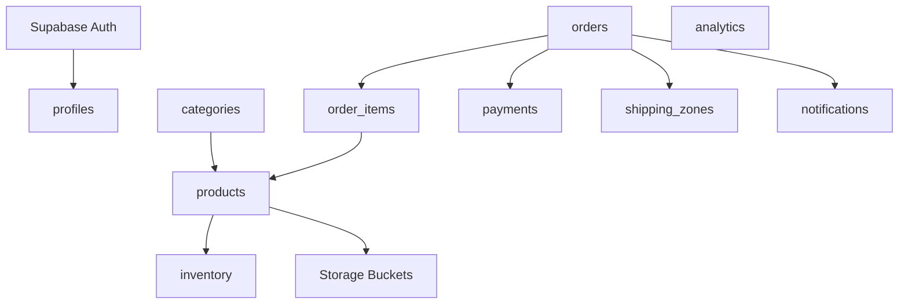

**Diagram sources**
- [001_initial_schema.sql](file://supabase/migrations/001_initial_schema.sql)
- [003_auth_profiles_and_hardening.sql](file://supabase/migrations/003_auth_profiles_and_hardening.sql)
- [006_payments_table.sql](file://supabase/migrations/006_payments_table.sql)
- [008_order_fulfillment.sql](file://supabase/migrations/008_order_fulfillment.sql)
- [009_shipping_zones.sql](file://supabase/migrations/009_shipping_zones.sql)
- [010_notifications_analytics.sql](file://supabase/migrations/010_notifications_analytics.sql)
- [005_storage_buckets.sql](file://supabase/migrations/005_storage_buckets.sql)

## Detailed Component Analysis

### Users and Profiles
- Purpose: Link application users to Supabase Auth and store public-facing profile details.
- Key Fields:
  - User ID: UUID referencing Auth.users.id.
  - Email: String, often unique at the application level.
  - Display Name: String.
  - Avatar URL: Text or URI.
  - Metadata: JSONB for flexible attributes.
  - Timestamps: Created at, Updated at.
- Keys and Constraints:
  - Primary Key: User ID.
  - Unique Constraint: On email or username where applicable.
  - Foreign Key: To Auth.users(id) with appropriate ON DELETE behavior.
- Relationships:
  - One-to-one with Auth users.
  - One-to-many with orders (if order table stores customer reference).
- Validation and Business Rules:
  - Non-null on required fields.
  - Email format validation via check constraints or triggers.
  - Profile updates restricted by RLS policies.

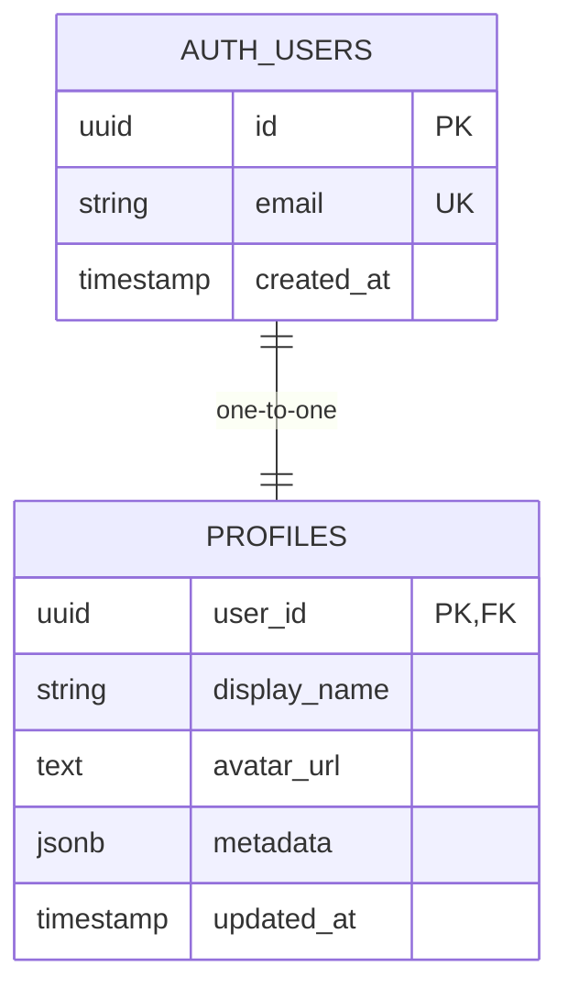

**Diagram sources**
- [003_auth_profiles_and_hardening.sql](file://supabase/migrations/003_auth_profiles_and_hardening.sql)

**Section sources**
- [003_auth_profiles_and_hardening.sql](file://supabase/migrations/003_auth_profiles_and_hardening.sql)
- [supabase-integration.md](file://docs/supabase-integration.md)

### Categories
- Purpose: Organize products into logical groups.
- Key Fields:
  - Category ID: UUID primary key.
  - Name: String, unique within scope.
  - Parent Category ID: Nullable UUID for hierarchy.
  - Slug: String for SEO-friendly URLs.
  - Status: Enum or boolean indicating active/archived.
  - Timestamps: Created at, Updated at.
- Keys and Constraints:
  - Primary Key: Category ID.
  - Unique Constraint: On slug or name.
  - Self-referencing Foreign Key: Parent category.
- Relationships:
  - One-to-many with products.
- Validation and Business Rules:
  - Prevent circular references in hierarchy via triggers or application logic.
  - Deletion policy prevents removal if referenced by active products unless cascading is intended.

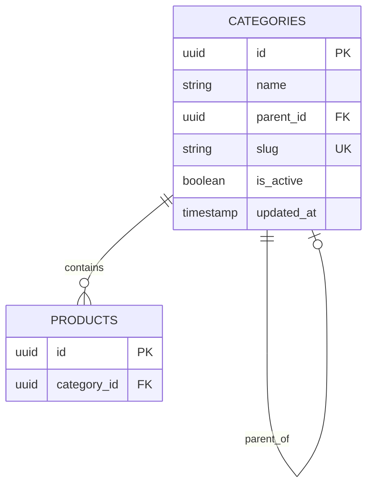

**Diagram sources**
- [001_initial_schema.sql](file://supabase/migrations/001_initial_schema.sql)

**Section sources**
- [001_initial_schema.sql](file://supabase/migrations/001_initial_schema.sql)

### Products
- Purpose: Represent sellable items with descriptive and pricing information.
- Key Fields:
  - Product ID: UUID primary key.
  - Name: String.
  - Description: Text.
  - Price: Numeric with currency precision.
  - Currency Code: ISO code string.
  - Category ID: Foreign key to categories.
  - Media References: Array or links to storage objects.
  - Status: Active/inactive or draft/published.
  - Timestamps: Created at, Updated at.
- Keys and Constraints:
  - Primary Key: Product ID.
  - Foreign Key: To categories(id).
  - Check Constraints: Non-negative price, valid currency code.
- Relationships:
  - Many-to-one with categories.
  - One-to-many with inventory.
  - One-to-many with order items.
- Validation and Business Rules:
  - Require non-empty name and positive price.
  - Enforce category existence before creation.
  - Soft delete via status flag rather than physical deletion.

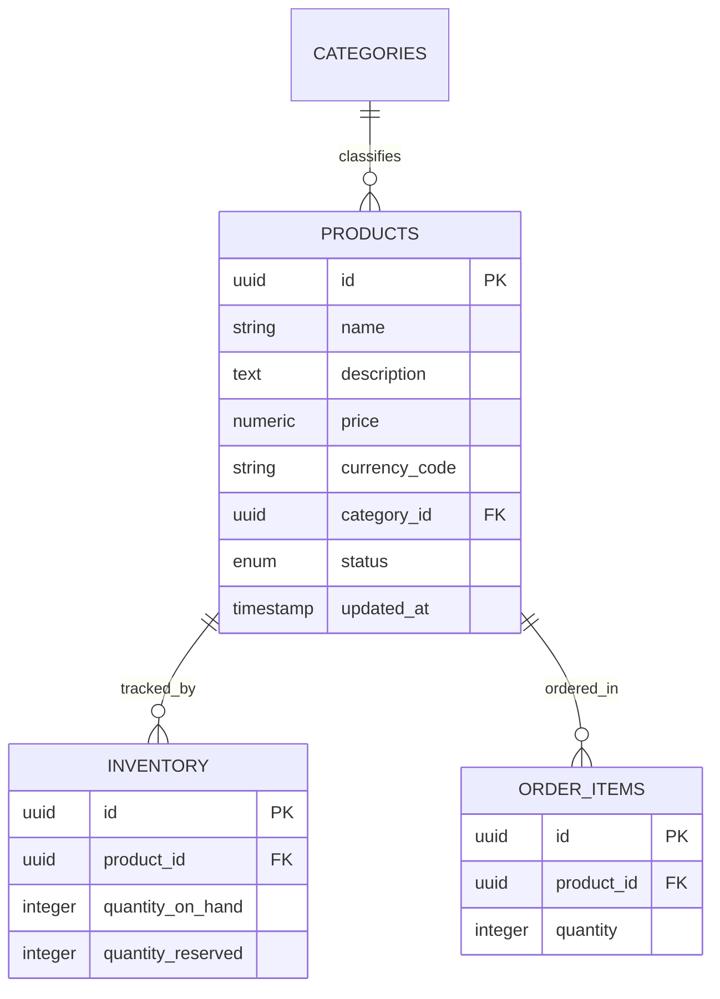

**Diagram sources**
- [001_initial_schema.sql](file://supabase/migrations/001_initial_schema.sql)
- [006_payments_table.sql](file://supabase/migrations/006_payments_table.sql)
- [008_order_fulfillment.sql](file://supabase/migrations/008_order_fulfillment.sql)

**Section sources**
- [001_initial_schema.sql](file://supabase/migrations/001_initial_schema.sql)
- [008_order_fulfillment.sql](file://supabase/migrations/008_order_fulfillment.sql)

### Inventory Management
- Purpose: Track stock levels and reservations for accurate availability.
- Key Fields:
  - Inventory ID: UUID primary key.
  - Product ID: Foreign key to products.
  - Quantity On Hand: Integer, non-negative.
  - Quantity Reserved: Integer, non-negative.
  - Available Stock: Computed as on-hand minus reserved.
  - Last Updated: Timestamp.
- Keys and Constraints:
  - Primary Key: Inventory ID.
  - Unique Constraint: On product_id to ensure one inventory row per product.
  - Check Constraints: Non-negative quantities.
- Operations:
  - Functions to decrement stock upon order placement.
  - Functions to increment stock upon cancellations or returns.
- Business Rules:
  - Prevent negative stock via function guards.
  - Ensure atomic updates to avoid race conditions.

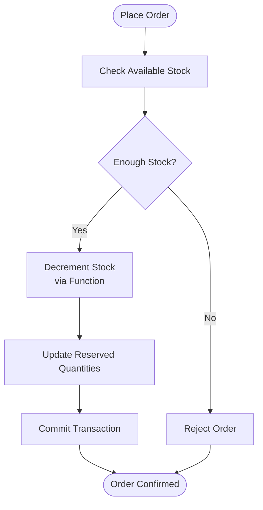

**Diagram sources**
- [004_stock_function.sql](file://supabase/migrations/004_stock_function.sql)
- [007_stock_increment_function.sql](file://supabase/migrations/007_stock_increment_function.sql)

**Section sources**
- [004_stock_function.sql](file://supabase/migrations/004_stock_function.sql)
- [007_stock_increment_function.sql](file://supabase/migrations/007_stock_increment_function.sql)

### Orders, Fulfillment, and Payments
- Purpose: Capture purchase transactions, payment status, and fulfillment state.
- Key Entities:
  - Orders: Customer, total amount, currency, status, timestamps.
  - Order Items: Product references, quantities, unit prices.
  - Payments: Payment provider references, transaction IDs, status.
  - Fulfillment: Shipping method, tracking numbers, status transitions.
- Keys and Constraints:
  - Orders primary key and foreign keys to customers (profiles), shipping zones.
  - Order items foreign keys to orders and products.
  - Payments foreign keys to orders with unique transaction identifiers.
- Business Rules:
  - Idempotency keys to prevent duplicate charges.
  - Expiry handling for unpaid orders.
  - Status transitions enforced by functions or triggers.

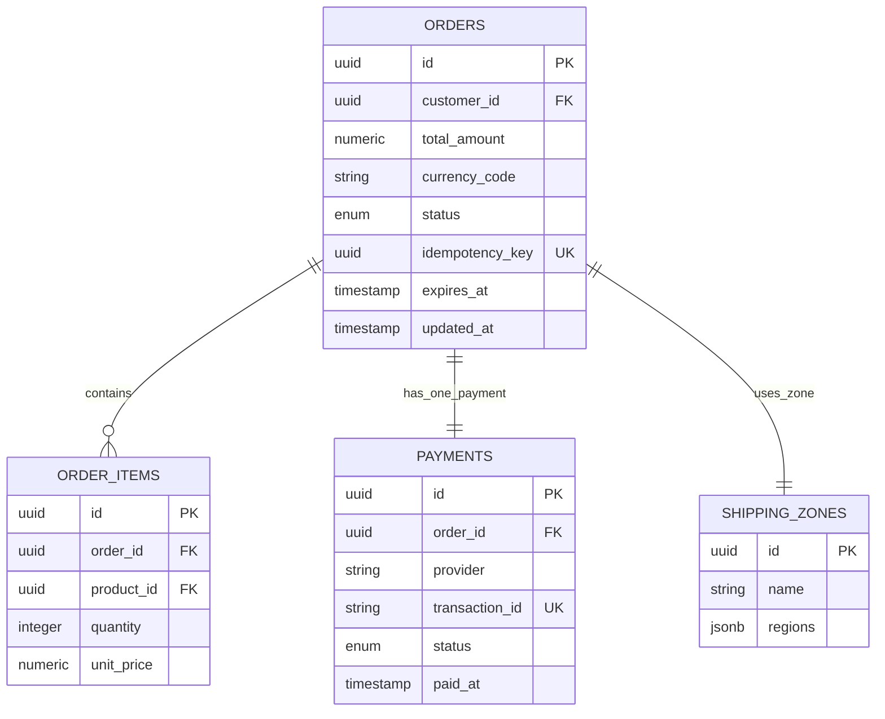

**Diagram sources**
- [006_payments_table.sql](file://supabase/migrations/006_payments_table.sql)
- [008_order_fulfillment.sql](file://supabase/migrations/008_order_fulfillment.sql)
- [009_shipping_zones.sql](file://supabase/migrations/009_shipping_zones.sql)
- [011_orders_idempotency_and_expiry.sql](file://supabase/migrations/011_orders_idempotency_and_expiry.sql)

**Section sources**
- [006_payments_table.sql](file://supabase/migrations/006_payments_table.sql)
- [008_order_fulfillment.sql](file://supabase/migrations/008_order_fulfillment.sql)
- [009_shipping_zones.sql](file://supabase/migrations/009_shipping_zones.sql)
- [011_orders_idempotency_and_expiry.sql](file://supabase/migrations/011_orders_idempotency_and_expiry.sql)

### Notifications and Analytics
- Purpose: Record system events and aggregate metrics for insights.
- Key Entities:
  - Notifications: Type, payload, recipient, read status, timestamps.
  - Analytics: Event type, dimensions, counts, time windows.
- Business Rules:
  - Append-only design for analytics.
  - Notification retention policies via scheduled jobs.

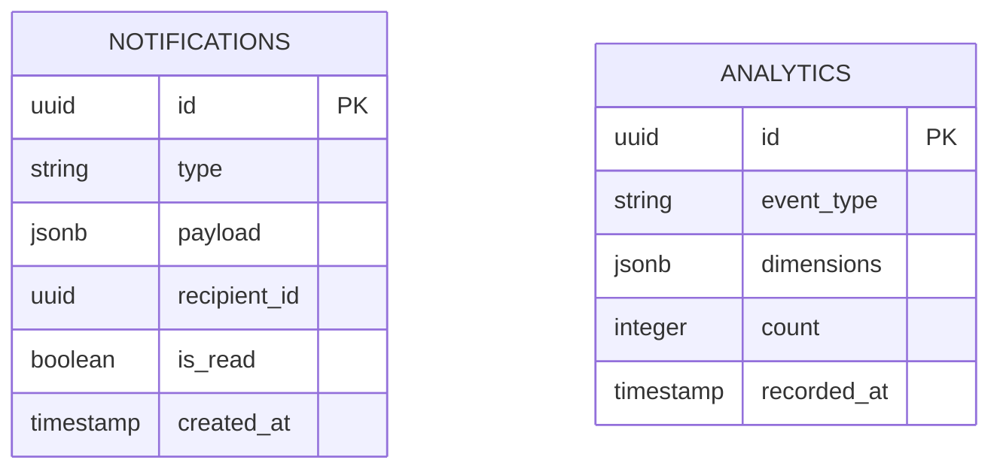

**Diagram sources**
- [010_notifications_analytics.sql](file://supabase/migrations/010_notifications_analytics.sql)

**Section sources**
- [010_notifications_analytics.sql](file://supabase/migrations/010_notifications_analytics.sql)

### Storage Buckets
- Purpose: Manage product images and other assets.
- Key Concepts:
  - Bucket definitions for public/private access.
  - Object paths mapped to product media fields.
- Business Rules:
  - Access controlled by RLS policies and bucket permissions.
  - Cleanup of orphaned files when products are archived.

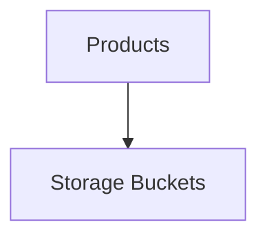

**Diagram sources**
- [005_storage_buckets.sql](file://supabase/migrations/005_storage_buckets.sql)

**Section sources**
- [005_storage_buckets.sql](file://supabase/migrations/005_storage_buckets.sql)

## Dependency Analysis
This diagram shows how core entities depend on each other across migrations and features.

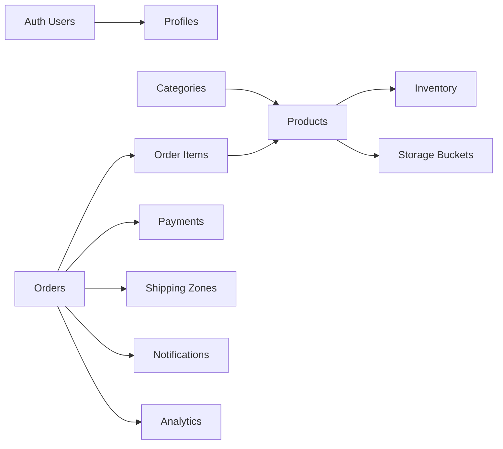

**Diagram sources**
- [001_initial_schema.sql](file://supabase/migrations/001_initial_schema.sql)
- [003_auth_profiles_and_hardening.sql](file://supabase/migrations/003_auth_profiles_and_hardening.sql)
- [006_payments_table.sql](file://supabase/migrations/006_payments_table.sql)
- [008_order_fulfillment.sql](file://supabase/migrations/008_order_fulfillment.sql)
- [009_shipping_zones.sql](file://supabase/migrations/009_shipping_zones.sql)
- [010_notifications_analytics.sql](file://supabase/migrations/010_notifications_analytics.sql)
- [005_storage_buckets.sql](file://supabase/migrations/005_storage_buckets.sql)

**Section sources**
- [001_initial_schema.sql](file://supabase/migrations/001_initial_schema.sql)
- [003_auth_profiles_and_hardening.sql](file://supabase/migrations/003_auth_profiles_and_hardening.sql)
- [006_payments_table.sql](file://supabase/migrations/006_payments_table.sql)
- [008_order_fulfillment.sql](file://supabase/migrations/008_order_fulfillment.sql)
- [009_shipping_zones.sql](file://supabase/migrations/009_shipping_zones.sql)
- [010_notifications_analytics.sql](file://supabase/migrations/010_notifications_analytics.sql)
- [005_storage_buckets.sql](file://supabase/migrations/005_storage_buckets.sql)

## Performance Considerations
- Indexing Strategy:
  - Add indexes on frequently queried columns such as product category_id, order customer_id, and inventory product_id.
  - Composite indexes for common filter combinations (e.g., status + updated_at).
- Query Optimization:
  - Use computed columns or materialized views for derived metrics like available stock.
  - Partition large tables (e.g., analytics) by time for efficient scans.
- Concurrency Control:
  - Use database functions to atomically update stock and reservations.
  - Apply optimistic locking or advisory locks where necessary.
- Storage Efficiency:
  - Store media references instead of binary data in tables.
  - Archive old notifications and analytics periodically.

[No sources needed since this section provides general guidance]

## Troubleshooting Guide
Common issues and resolutions:
- RLS Policy Violations:
  - Verify policies allow current user context to read/write target rows.
  - Use verification scripts to audit policy effectiveness.
- Stock Discrepancies:
  - Inspect stock functions for correct decrement/increment flows.
  - Check transaction boundaries and error handling in order processing.
- Duplicate Payments:
  - Ensure idempotency keys are enforced and validated.
  - Review expiry handling for abandoned orders.
- Missing Referential Integrity:
  - Confirm foreign key constraints exist and are enabled.
  - Validate cascading behaviors match business expectations.

**Section sources**
- [verify_rls.sql](file://supabase/migrations/verify_rls.sql)
- [004_stock_function.sql](file://supabase/migrations/004_stock_function.sql)
- [007_stock_increment_function.sql](file://supabase/migrations/007_stock_increment_function.sql)
- [011_orders_idempotency_and_expiry.sql](file://supabase/migrations/011_orders_idempotency_and_expiry.sql)

## Conclusion
Albatal Store’s data model is built around robust core entities—users/auth integration, profiles, categories, products, and inventory—supported by comprehensive RLS policies, stock management functions, and order/payment workflows. The migration-driven approach ensures consistent evolution of the schema, while constraints and functions enforce data integrity and business rules. For long-term scalability, consider indexing strategies, partitioning, and archival processes aligned with the documented lifecycle policies.

[No sources needed since this section summarizes without analyzing specific files]

## Appendices

### Entity Relationship Diagram (Core Entities)
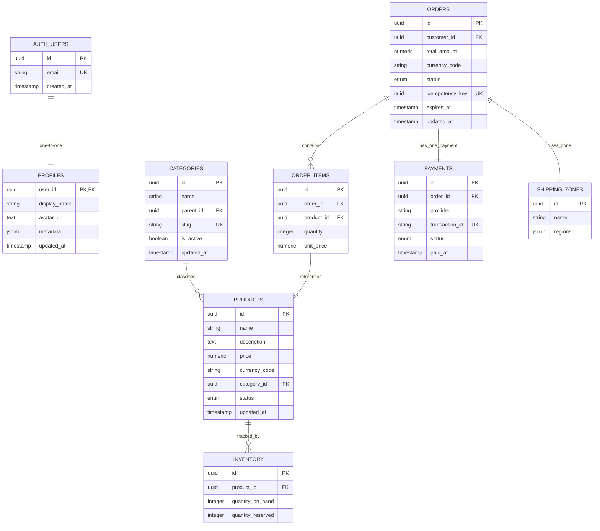

**Diagram sources**
- [001_initial_schema.sql](file://supabase/migrations/001_initial_schema.sql)
- [003_auth_profiles_and_hardening.sql](file://supabase/migrations/003_auth_profiles_and_hardening.sql)
- [006_payments_table.sql](file://supabase/migrations/006_payments_table.sql)
- [008_order_fulfillment.sql](file://supabase/migrations/008_order_fulfillment.sql)
- [009_shipping_zones.sql](file://supabase/migrations/009_shipping_zones.sql)
- [011_orders_idempotency_and_expiry.sql](file://supabase/migrations/011_orders_idempotency_and_expiry.sql)