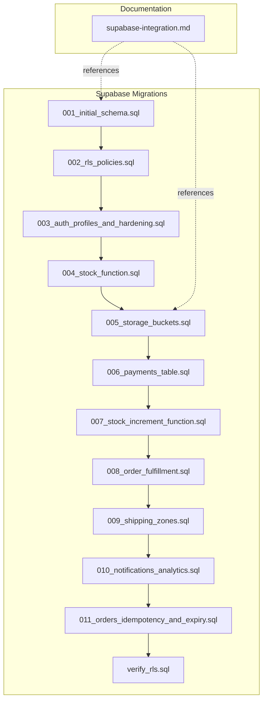
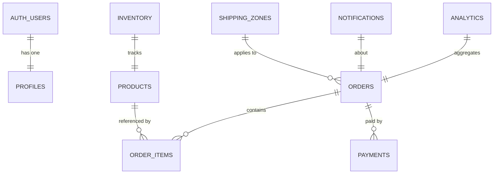
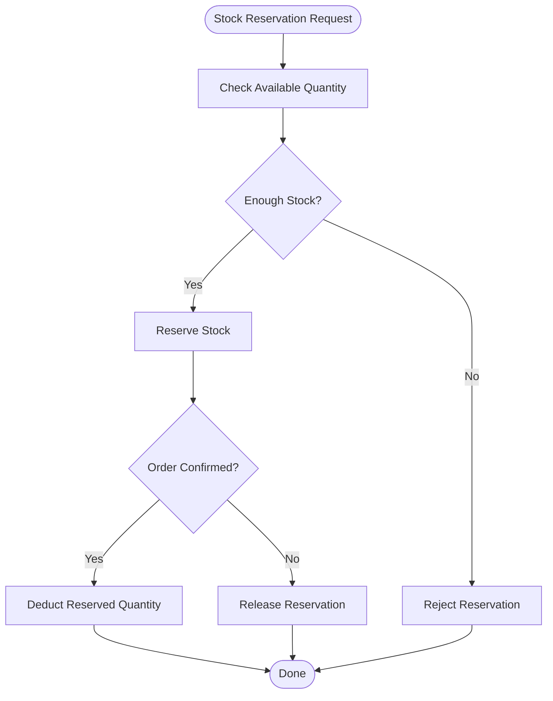
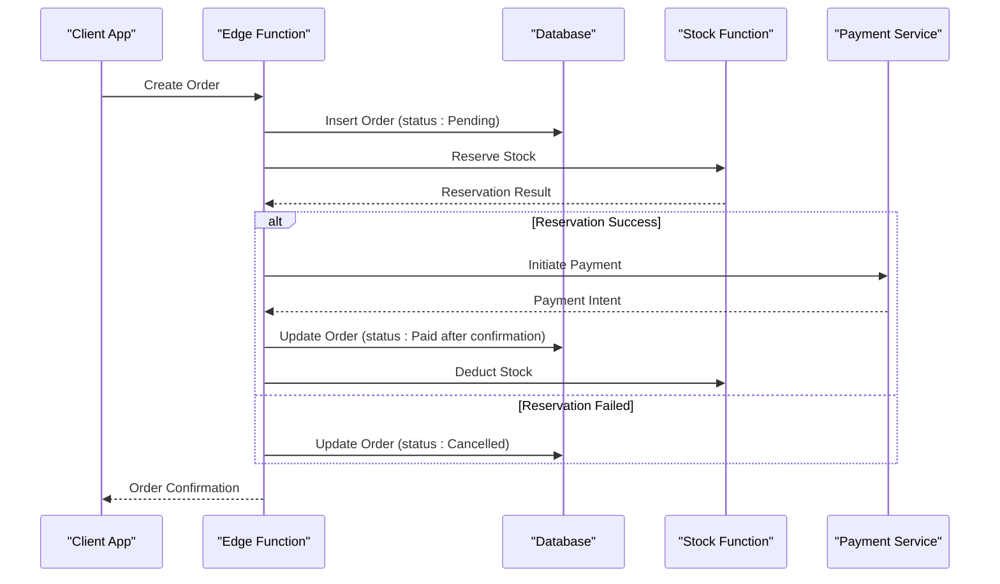
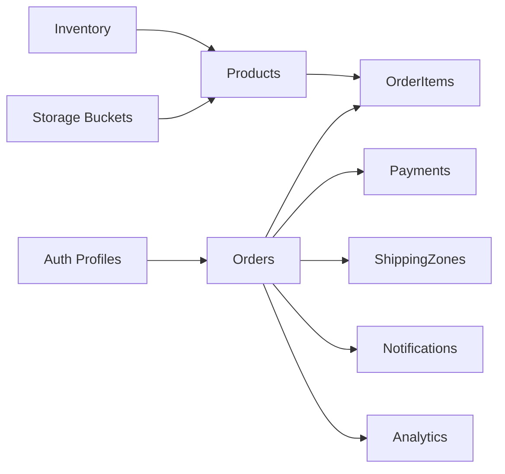

# Database Schema Design

<cite>
**Referenced Files in This Document**
- [001_initial_schema.sql](file://supabase/migrations/001_initial_schema.sql)
- [002_rls_policies.sql](file://supabase/migrations/002_rls_policies.sql)
- [003_auth_profiles_and_hardening.sql](file://supabase/migrations/003_auth_profiles_and_hardening.sql)
- [004_stock_function.sql](file://supabase/migrations/004_stock_function.sql)
- [005_storage_buckets.sql](file://supabase/migrations/005_storage_buckets.sql)
- [006_payments_table.sql](file://supabase/migrations/006_payments_table.sql)
- [007_stock_increment_function.sql](file://supabase/migrations/007_stock_increment_function.sql)
- [008_order_fulfillment.sql](file://supabase/migrations/008_order_fulfillment.sql)
- [009_shipping_zones.sql](file://supabase/migrations/009_shipping_zones.sql)
- [010_notifications_analytics.sql](file://supabase/migrations/010_notifications_analytics.sql)
- [011_orders_idempotency_and_expiry.sql](file://supabase/migrations/011_orders_idempotency_and_expiry.sql)
- [verify_rls.sql](file://supabase/migrations/verify_rls.sql)
- [supabase-integration.md](file://docs/supabase-integration.md)
</cite>

## Table of Contents
1. [Introduction](#introduction)
2. [Project Structure](#project-structure)
3. [Core Components](#core-components)
4. [Architecture Overview](#architecture-overview)
5. [Detailed Component Analysis](#detailed-component-analysis)
6. [Dependency Analysis](#dependency-analysis)
7. [Performance Considerations](#performance-considerations)
8. [Troubleshooting Guide](#troubleshooting-guide)
9. [Conclusion](#conclusion)
10. [Appendices](#appendices)

## Introduction
This document provides comprehensive data model documentation for the Albatal Store’s Supabase database schema. It covers entity relationships among users, products, orders, payments, and inventory; field definitions and constraints; Row Level Security (RLS) policies; stored procedures and functions for stock management; business logic encapsulated in database functions; schema diagrams; validation rules; referential integrity; lifecycle and archival strategies; security and privacy considerations; and migration and rollback procedures.

The schema is implemented as a series of SQL migrations under the supabase/migrations directory, with RLS policies and verification scripts also provided. The project integrates with Supabase Edge Functions for checkout and payment orchestration.

## Project Structure
The database schema is versioned using Supabase migrations. Each migration file introduces or alters tables, indexes, constraints, functions, and policies. Supporting documentation explains integration points with Supabase services such as storage buckets and authentication profiles.

**Diagram sources**
- [001_initial_schema.sql](file://supabase/migrations/001_initial_schema.sql)
- [002_rls_policies.sql](file://supabase/migrations/002_rls_policies.sql)
- [003_auth_profiles_and_hardening.sql](file://supabase/migrations/003_auth_profiles_and_hardening.sql)
- [004_stock_function.sql](file://supabase/migrations/004_stock_function.sql)
- [005_storage_buckets.sql](file://supabase/migrations/005_storage_buckets.sql)
- [006_payments_table.sql](file://supabase/migrations/006_payments_table.sql)
- [007_stock_increment_function.sql](file://supabase/migrations/007_stock_increment_function.sql)
- [008_order_fulfillment.sql](file://supabase/migrations/008_order_fulfillment.sql)
- [009_shipping_zones.sql](file://supabase/migrations/009_shipping_zones.sql)
- [010_notifications_analytics.sql](file://supabase/migrations/010_notifications_analytics.sql)
- [011_orders_idempotency_and_expiry.sql](file://supabase/migrations/011_orders_idempotency_and_expiry.sql)
- [verify_rls.sql](file://supabase/migrations/verify_rls.sql)
- [supabase-integration.md](file://docs/supabase-integration.md)

**Section sources**
- [supabase-integration.md](file://docs/supabase-integration.md)

## Core Components
This section summarizes the primary entities and their responsibilities:

- Users and Profiles
  - Authentication identities are managed by Supabase Auth. Application-specific user profile data is maintained in a dedicated table to decouple from auth internals and enforce RLS at the application layer.
  - Typical fields include identifiers, display names, contact information, and timestamps.

- Products and Inventory
  - Product catalog includes product metadata, pricing, and availability flags.
  - Inventory tracks stock levels per product, with constraints ensuring non-negative quantities and auditability via timestamps.

- Orders and Order Items
  - Orders represent customer purchases with status tracking, totals, and addresses.
  - Order items link orders to products with ordered quantities and snapshot prices.

- Payments
  - Payment records capture transaction details, provider references, amounts, currency, and statuses. They reference orders to maintain referential integrity.

- Shipping Zones
  - Shipping zones define regions and associated shipping costs or rules used during checkout.

- Notifications and Analytics
  - Notification logs record outbound messages and delivery outcomes.
  - Analytics tables store aggregated metrics for reporting and dashboards.

- Storage Buckets
  - Supabase Storage buckets are configured for media assets referenced by products and other resources.

Key design principles:
- Strong referential integrity via foreign keys.
- Non-negative monetary and quantity fields enforced by constraints.
- Auditability through created_at and updated_at columns.
- Access control via RLS policies tailored to roles and ownership.

**Section sources**
- [001_initial_schema.sql](file://supabase/migrations/001_initial_schema.sql)
- [003_auth_profiles_and_hardening.sql](file://supabase/migrations/003_auth_profiles_and_hardening.sql)
- [006_payments_table.sql](file://supabase/migrations/006_payments_table.sql)
- [009_shipping_zones.sql](file://supabase/migrations/009_shipping_zones.sql)
- [010_notifications_analytics.sql](file://supabase/migrations/010_notifications_analytics.sql)
- [005_storage_buckets.sql](file://supabase/migrations/005_storage_buckets.sql)

## Architecture Overview
The data architecture centers on relational tables with clear ownership and access boundaries enforced by RLS. Business-critical operations like stock reservation and order fulfillment are encapsulated in stored functions to ensure consistency and idempotency.

**Diagram sources**
- [001_initial_schema.sql](file://supabase/migrations/001_initial_schema.sql)
- [003_auth_profiles_and_hardening.sql](file://supabase/migrations/003_auth_profiles_and_hardening.sql)
- [006_payments_table.sql](file://supabase/migrations/006_payments_table.sql)
- [009_shipping_zones.sql](file://supabase/migrations/009_shipping_zones.sql)
- [010_notifications_analytics.sql](file://supabase/migrations/010_notifications_analytics.sql)

## Detailed Component Analysis

### Users and Profiles
- Purpose: Decouples application-level user attributes from Supabase Auth while maintaining a stable identity reference.
- Key relationships:
  - One-to-one with Auth users via a unique identifier column.
  - Referenced by orders and notifications.
- Constraints and validation:
  - Unique constraints on email and username where applicable.
  - Not-null constraints on core identity fields.
  - Timestamps for auditability.
- RLS:
  - Policies restrict reads/writes to authenticated users’ own profiles unless elevated roles are granted.

**Section sources**
- [003_auth_profiles_and_hardening.sql](file://supabase/migrations/003_auth_profiles_and_hardening.sql)
- [002_rls_policies.sql](file://supabase/migrations/002_rls_policies.sql)

### Products and Inventory
- Purpose: Catalog and stock management.
- Key relationships:
  - One-to-many with order items.
  - One-to-one with inventory rows.
- Constraints and validation:
  - Non-negative price and quantity enforced by check constraints.
  - Unique SKU or product code constraint.
  - Soft delete or active flag for deactivation without deletion.
- Indexes:
  - Indexed on SKU, category, and active status for efficient queries.
- Stock management:
  - Stored functions handle reservations and decrements to prevent overselling.

**Diagram sources**
- [004_stock_function.sql](file://supabase/migrations/004_stock_function.sql)
- [007_stock_increment_function.sql](file://supabase/migrations/007_stock_increment_function.sql)

**Section sources**
- [001_initial_schema.sql](file://supabase/migrations/001_initial_schema.sql)
- [004_stock_function.sql](file://supabase/migrations/004_stock_function.sql)
- [007_stock_increment_function.sql](file://supabase/migrations/007_stock_increment_function.sql)

### Orders and Order Items
- Purpose: Capture purchase transactions and line items.
- Key relationships:
  - Many order items per order.
  - References to products and shipping zones.
- Status lifecycle:
  - Draft -> Pending -> Paid -> Processing -> Shipped -> Delivered -> Cancelled.
- Idempotency and expiry:
  - Idempotency keys to prevent duplicate processing.
  - Expiry handling for abandoned carts or pending orders.
- Constraints:
  - Totals computed from items with checks for consistency.
  - Non-negative quantities and prices.

**Diagram sources**
- [008_order_fulfillment.sql](file://supabase/migrations/008_order_fulfillment.sql)
- [011_orders_idempotency_and_expiry.sql](file://supabase/migrations/011_orders_idempotency_and_expiry.sql)
- [004_stock_function.sql](file://supabase/migrations/004_stock_function.sql)
- [006_payments_table.sql](file://supabase/migrations/006_payments_table.sql)

**Section sources**
- [001_initial_schema.sql](file://supabase/migrations/001_initial_schema.sql)
- [008_order_fulfillment.sql](file://supabase/migrations/008_order_fulfillment.sql)
- [011_orders_idempotency_and_expiry.sql](file://supabase/migrations/011_orders_idempotency_and_expiry.sql)

### Payments
- Purpose: Record payment events and external provider references.
- Key relationships:
  - Foreign key to orders.
- Fields and types:
  - Amount, currency, provider transaction IDs, status, timestamps.
- Constraints:
  - Non-negative amount and valid currency codes.
  - Unique provider transaction ID to avoid duplicates.
- RLS:
  - Restricted to authenticated users for their own payments and admin roles for oversight.

**Section sources**
- [006_payments_table.sql](file://supabase/migrations/006_payments_table.sql)
- [002_rls_policies.sql](file://supabase/migrations/002_rls_policies.sql)

### Shipping Zones
- Purpose: Define geographic zones and shipping rules/costs.
- Relationships:
  - Applied to orders to compute shipping fees.
- Constraints:
  - Unique zone identifiers and descriptive labels.

**Section sources**
- [009_shipping_zones.sql](file://supabase/migrations/009_shipping_zones.sql)

### Notifications and Analytics
- Notifications:
  - Log outbound messages (email/SMS/push), recipients, payloads, and delivery results.
  - Reference orders or users as needed.
- Analytics:
  - Aggregated metrics for sales, inventory turnover, and user activity.
  - Updated by scheduled jobs or triggers.

**Section sources**
- [010_notifications_analytics.sql](file://supabase/migrations/010_notifications_analytics.sql)

### Storage Buckets
- Purpose: Manage media assets (product images, documents).
- Configuration:
  - Bucket creation and policy setup for public/private access.
- Integration:
  - URLs stored in product or order records referencing bucket paths.

**Section sources**
- [005_storage_buckets.sql](file://supabase/migrations/005_storage_buckets.sql)
- [supabase-integration.md](file://docs/supabase-integration.md)

## Dependency Analysis
The following diagram illustrates high-level dependencies between schema components and supporting features:

**Diagram sources**
- [003_auth_profiles_and_hardening.sql](file://supabase/migrations/003_auth_profiles_and_hardening.sql)
- [001_initial_schema.sql](file://supabase/migrations/001_initial_schema.sql)
- [006_payments_table.sql](file://supabase/migrations/006_payments_table.sql)
- [009_shipping_zones.sql](file://supabase/migrations/009_shipping_zones.sql)
- [010_notifications_analytics.sql](file://supabase/migrations/010_notifications_analytics.sql)
- [005_storage_buckets.sql](file://supabase/migrations/005_storage_buckets.sql)

**Section sources**
- [001_initial_schema.sql](file://supabase/migrations/001_initial_schema.sql)
- [006_payments_table.sql](file://supabase/migrations/006_payments_table.sql)
- [009_shipping_zones.sql](file://supabase/migrations/009_shipping_zones.sql)
- [010_notifications_analytics.sql](file://supabase/migrations/010_notifications_analytics.sql)
- [005_storage_buckets.sql](file://supabase/migrations/005_storage_buckets.sql)

## Performance Considerations
- Indexing strategy:
  - Primary keys and foreign keys should be indexed where frequently joined.
  - Add composite indexes for common query patterns (e.g., orders by user and status).
- Data normalization vs. denormalization:
  - Keep normalized structure for integrity; consider materialized views or analytics tables for heavy reporting.
- Concurrency:
  - Use stored functions for stock updates to minimize race conditions.
  - Leverage idempotency keys for order creation and payment callbacks.
- Query optimization:
  - Avoid selecting unnecessary columns.
  - Use pagination for large result sets.

[No sources needed since this section provides general guidance]

## Troubleshooting Guide
- RLS misconfiguration:
  - Verify policies allow expected operations for roles and ownership.
  - Use the verification script to assert policy behavior across tables.
- Stock inconsistencies:
  - Inspect stock functions for correct reservation/deduction flows.
  - Ensure order cancellation releases reserved stock.
- Duplicate payments:
  - Confirm unique constraints on provider transaction IDs and idempotency enforcement.
- Storage access errors:
  - Validate bucket policies and object permissions.

**Section sources**
- [verify_rls.sql](file://supabase/migrations/verify_rls.sql)
- [004_stock_function.sql](file://supabase/migrations/004_stock_function.sql)
- [007_stock_increment_function.sql](file://supabase/migrations/007_stock_increment_function.sql)
- [006_payments_table.sql](file://supabase/migrations/006_payments_table.sql)
- [005_storage_buckets.sql](file://supabase/migrations/005_storage_buckets.sql)

## Conclusion
The Albatal Store’s database schema emphasizes strong integrity, secure access, and robust business logic encapsulation. Through well-defined tables, constraints, RLS policies, and stored functions, the system ensures reliable stock management, consistent order processing, and secure payment recording. Migration-based evolution supports safe rollouts and rollbacks, while analytics and notifications enable operational insights and user engagement.

[No sources needed since this section summarizes without analyzing specific files]

## Appendices

### Data Lifecycle and Archival
- Retention:
  - Define retention periods for notifications and analytics based on compliance needs.
- Archival:
  - Archive historical orders and payments to cold storage or separate tables periodically.
- Backup strategy:
  - Enable automated backups and point-in-time recovery.
  - Test restore procedures regularly.

[No sources needed since this section provides general guidance]

### Security and Privacy
- RLS policies:
  - Enforce row-level access based on user identity and role.
- Secrets management:
  - Store sensitive configuration in environment variables and secret managers.
- PII handling:
  - Minimize collection and encrypt sensitive fields where required.
- Audit logging:
  - Track critical mutations via triggers or application-layer logging.

**Section sources**
- [002_rls_policies.sql](file://supabase/migrations/002_rls_policies.sql)
- [supabase-integration.md](file://docs/supabase-integration.md)

### Migration Strategy and Rollback Procedures
- Versioning:
  - Each change is a numbered migration applied in order.
- Deployment:
  - Apply migrations in staging before production.
  - Run verification scripts post-deployment.
- Rollback:
  - Maintain reverse migrations or feature flags to revert changes safely.
  - Validate data compatibility before applying forward migrations.

**Section sources**
- [001_initial_schema.sql](file://supabase/migrations/001_initial_schema.sql)
- [002_rls_policies.sql](file://supabase/migrations/002_rls_policies.sql)
- [verify_rls.sql](file://supabase/migrations/verify_rls.sql)