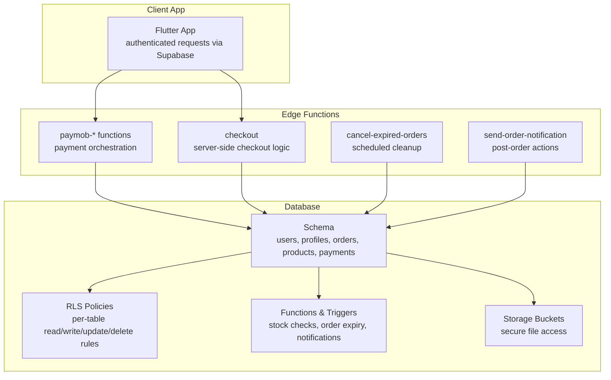
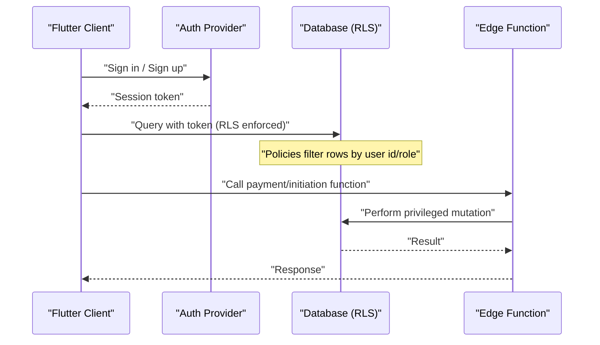
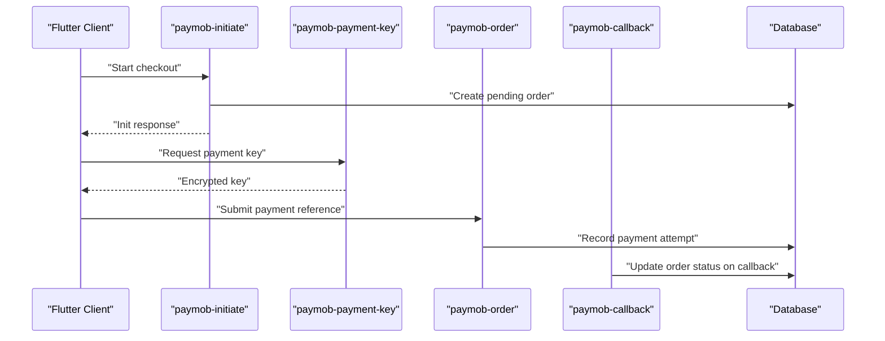
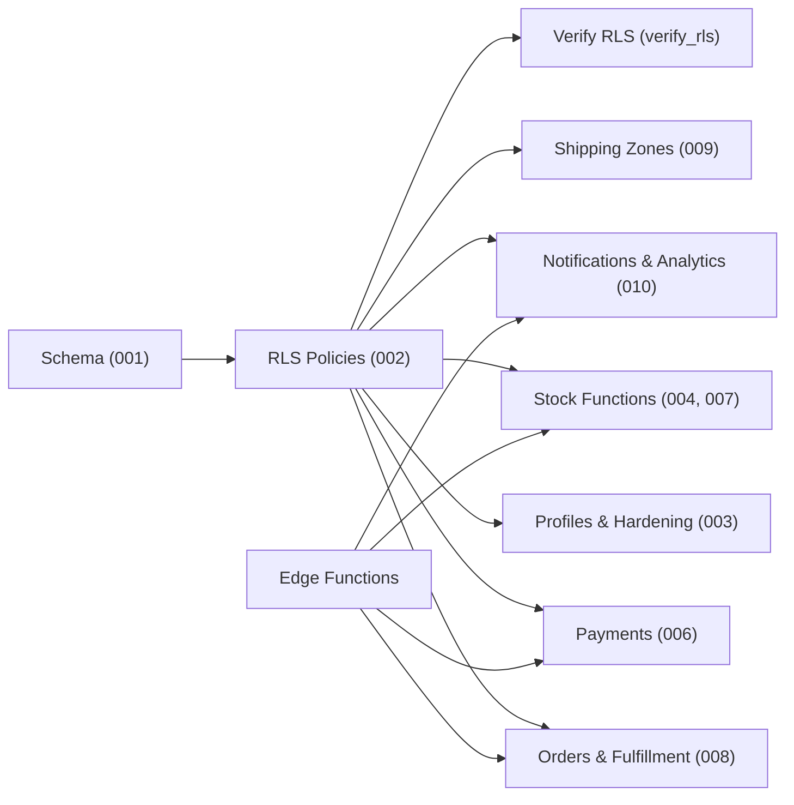

# Row Level Security & Access Control

<cite>
**Referenced Files in This Document**
- [supabase/migrations/001_initial_schema.sql](file://supabase/migrations/001_initial_schema.sql)
- [supabase/migrations/002_rls_policies.sql](file://supabase/migrations/002_rls_policies.sql)
- [supabase/migrations/003_auth_profiles_and_hardening.sql](file://supabase/migrations/003_auth_profiles_and_hardening.sql)
- [supabase/migrations/004_stock_function.sql](file://supabase/migrations/004_stock_function.sql)
- [supabase/migrations/005_storage_buckets.sql](file://supabase/migrations/005_storage_buckets.sql)
- [supabase/migrations/006_payments_table.sql](file://supabase/migrations/006_payments_table.sql)
- [supabase/migrations/007_stock_increment_function.sql](file://supabase/migrations/007_stock_increment_function.sql)
- [supabase/migrations/008_order_fulfillment.sql](file://supabase/migrations/008_order_fulfillment.sql)
- [supabase/migrations/009_shipping_zones.sql](file://supabase/migrations/009_shipping_zones.sql)
- [supabase/migrations/010_notifications_analytics.sql](file://supabase/migrations/010_notifications_analytics.sql)
- [supabase/migrations/011_orders_idempotency_and_expiry.sql](file://supabase/migrations/011_orders_idempotency_and_expiry.sql)
- [supabase/migrations/verify_rls.sql](file://supabase/migrations/verify_rls.sql)
- [supabase/functions/paymob-auth/index.ts](file://supabase/functions/paymob-auth/index.ts)
- [supabase/functions/paymob-initiate/index.ts](file://supabase/functions/paymob-initiate/index.ts)
- [supabase/functions/paymob-order/index.ts](file://supabase/functions/paymob-order/index.ts)
- [supabase/functions/paymob-payment-key/index.ts](file://supabase/functions/paymob-payment-key/index.ts)
- [supabase/functions/paymob-callback/index.ts](file://supabase/functions/paymob-callback/index.ts)
- [supabase/functions/cancel-expired-orders/index.ts](file://supabase/functions/cancel-expired-orders/index.ts)
- [supabase/functions/send-order-notification/index.ts](file://supabase/functions/send-order-notification/index.ts)
- [supabase/functions/checkout/index.ts](file://supabase/functions/checkout/index.ts)
- [docs/supabase-integration.md](file://docs/supabase-integration.md)
</cite>

## Table of Contents
1. [Introduction](#introduction)
2. [Project Structure](#project-structure)
3. [Core Components](#core-components)
4. [Architecture Overview](#architecture-overview)
5. [Detailed Component Analysis](#detailed-component-analysis)
6. [Dependency Analysis](#dependency-analysis)
7. [Performance Considerations](#performance-considerations)
8. [Troubleshooting Guide](#troubleshooting-guide)
9. [Conclusion](#conclusion)
10. [Appendices](#appendices)

## Introduction
This document explains the Row Level Security (RLS) policies and access control mechanisms implemented for Albatal Store’s database. It covers role-based access, user permission hierarchies, data isolation strategies, authentication integration patterns, session management, and security hardening measures. It also provides policy examples for different roles such as customers, administrators, and system processes, along with best practices, vulnerability mitigation, and compliance considerations including GDPR and sensitive data protection.

## Project Structure
Security-related definitions are primarily located under supabase/migrations and supabase/functions:
- Migrations define schema, RLS policies, functions, storage buckets, and verification scripts.
- Edge Functions implement server-side integrations (e.g., payment flows) that enforce secure operations outside client reach.

**Diagram sources**
- [supabase/migrations/001_initial_schema.sql](file://supabase/migrations/001_initial_schema.sql)
- [supabase/migrations/002_rls_policies.sql](file://supabase/migrations/002_rls_policies.sql)
- [supabase/migrations/003_auth_profiles_and_hardening.sql](file://supabase/migrations/003_auth_profiles_and_hardening.sql)
- [supabase/migrations/004_stock_function.sql](file://supabase/migrations/004_stock_function.sql)
- [supabase/migrations/005_storage_buckets.sql](file://supabase/migrations/005_storage_buckets.sql)
- [supabase/migrations/006_payments_table.sql](file://supabase/migrations/006_payments_table.sql)
- [supabase/migrations/007_stock_increment_function.sql](file://supabase/migrations/007_stock_increment_function.sql)
- [supabase/migrations/008_order_fulfillment.sql](file://supabase/migrations/008_order_fulfillment.sql)
- [supabase/migrations/009_shipping_zones.sql](file://supabase/migrations/009_shipping_zones.sql)
- [supabase/migrations/010_notifications_analytics.sql](file://supabase/migrations/010_notifications_analytics.sql)
- [supabase/migrations/011_orders_idempotency_and_expiry.sql](file://supabase/migrations/011_orders_idempotency_and_expiry.sql)
- [supabase/functions/paymob-auth/index.ts](file://supabase/functions/paymob-auth/index.ts)
- [supabase/functions/paymob-initiate/index.ts](file://supabase/functions/paymob-initiate/index.ts)
- [supabase/functions/paymob-order/index.ts](file://supabase/functions/paymob-order/index.ts)
- [supabase/functions/paymob-payment-key/index.ts](file://supabase/functions/paymob-payment-key/index.ts)
- [supabase/functions/paymob-callback/index.ts](file://supabase/functions/paymob-callback/index.ts)
- [supabase/functions/cancel-expired-orders/index.ts](file://supabase/functions/cancel-expired-orders/index.ts)
- [supabase/functions/send-order-notification/index.ts](file://supabase/functions/send-order-notification/index.ts)
- [supabase/functions/checkout/index.ts](file://supabase/functions/checkout/index.ts)

**Section sources**
- [supabase/migrations/001_initial_schema.sql](file://supabase/migrations/001_initial_schema.sql)
- [supabase/migrations/002_rls_policies.sql](file://supabase/migrations/002_rls_policies.sql)
- [supabase/migrations/003_auth_profiles_and_hardening.sql](file://supabase/migrations/003_auth_profiles_and_hardening.sql)
- [supabase/migrations/005_storage_buckets.sql](file://supabase/migrations/005_storage_buckets.sql)
- [supabase/migrations/006_payments_table.sql](file://supabase/migrations/006_payments_table.sql)
- [supabase/migrations/011_orders_idempotency_and_expiry.sql](file://supabase/migrations/011_orders_idempotency_and_expiry.sql)
- [supabase/functions/paymob-auth/index.ts](file://supabase/functions/paymob-auth/index.ts)
- [supabase/functions/paymob-initiate/index.ts](file://supabase/functions/paymob-initiate/index.ts)
- [supabase/functions/paymob-order/index.ts](file://supabase/functions/paymob-order/index.ts)
- [supabase/functions/paymob-payment-key/index.ts](file://supabase/functions/paymob-payment-key/index.ts)
- [supabase/functions/paymob-callback/index.ts](file://supabase/functions/paymob-callback/index.ts)
- [supabase/functions/cancel-expired-orders/index.ts](file://supabase/functions/cancel-expired-orders/index.ts)
- [supabase/functions/send-order-notification/index.ts](file://supabase/functions/send-order-notification/index.ts)
- [supabase/functions/checkout/index.ts](file://supabase/functions/checkout/index.ts)
- [docs/supabase-integration.md](file://docs/supabase-integration.md)

## Core Components
- Authentication and Profiles: User identity is managed by the platform’s auth system; profile records link identities to business entities and roles.
- RLS Policies: Per-table policies restrict row-level visibility and mutations based on authenticated user context and roles.
- Server-Side Functions: Edge Functions perform privileged or sensitive operations (e.g., payment initiation, callback handling, order cancellation).
- Storage Buckets: Secure object storage with bucket-level and row-level policies controlling access to files.
- Verification Script: Automated checks validate that RLS policies are active and effective.

Key responsibilities:
- Enforce least privilege at the database layer.
- Isolate customer data by user identity.
- Provide admin-only operations through explicit roles/policies.
- Centralize sensitive logic in Edge Functions.

**Section sources**
- [supabase/migrations/003_auth_profiles_and_hardening.sql](file://supabase/migrations/003_auth_profiles_and_hardening.sql)
- [supabase/migrations/002_rls_policies.sql](file://supabase/migrations/002_rls_policies.sql)
- [supabase/migrations/005_storage_buckets.sql](file://supabase/migrations/005_storage_buckets.sql)
- [supabase/migrations/verify_rls.sql](file://supabase/migrations/verify_rls.sql)

## Architecture Overview
The security architecture combines database-level RLS with Edge Functions for sensitive workflows. Clients authenticate and operate within their own data scope. Admins have elevated privileges where explicitly allowed. System processes run via Edge Functions using service-level credentials.

**Diagram sources**
- [supabase/migrations/002_rls_policies.sql](file://supabase/migrations/002_rls_policies.sql)
- [supabase/migrations/003_auth_profiles_and_hardening.sql](file://supabase/migrations/003_auth_profiles_and_hardening.sql)
- [supabase/functions/paymob-initiate/index.ts](file://supabase/functions/paymob-initiate/index.ts)
- [supabase/functions/paymob-auth/index.ts](file://supabase/functions/paymob-auth/index.ts)

## Detailed Component Analysis

### Database Schema and Identity
- Users and profiles are established to bind identities to business data.
- Role attributes and flags enable fine-grained permissions.
- Hardening measures include constraints, defaults, and audit-friendly fields.

Access model:
- Customers: Read/write only their own resources.
- Administrators: Elevated read/write across relevant tables.
- System processes: Operate via Edge Functions with service credentials.

**Section sources**
- [supabase/migrations/001_initial_schema.sql](file://supabase/migrations/001_initial_schema.sql)
- [supabase/migrations/003_auth_profiles_and_hardening.sql](file://supabase/migrations/003_auth_profiles_and_hardening.sql)

### Row Level Security Policies
RLS policies are defined per table and govern:
- SELECT: Visibility filters by owner or role.
- INSERT: Ownership validation and defaulting.
- UPDATE: Owner/admin checks and field-level constraints.
- DELETE: Owner/admin checks.

Typical patterns:
- Customer isolation: WHERE user_id = current_user().
- Admin override: OR has_role('admin').
- Audit-safe updates: Only allow specific columns to be updated by non-admins.

Policy examples by role:
- Customer: Can read and update own profile; can create and manage own orders; cannot view other users’ data.
- Administrator: Can read all orders/products; can update inventory and shipping zones; restricted from modifying payment secrets.
- System process: Uses Edge Functions to perform batch updates (e.g., cancel expired orders), bypassing RLS via service role when necessary.

**Section sources**
- [supabase/migrations/002_rls_policies.sql](file://supabase/migrations/002_rls_policies.sql)

### Orders and Fulfillment
Orders involve multiple actors:
- Customers place orders and view their own.
- Administrators manage fulfillment and status transitions.
- System processes expire and cancel stale orders.

Data isolation:
- Customers see only their orders.
- Administrators see all orders.
- Sensitive fields (e.g., payment tokens) are not exposed to clients.

Operational safeguards:
- Idempotency keys prevent duplicate charges.
- Expiry windows ensure abandoned carts do not hold stock indefinitely.

**Section sources**
- [supabase/migrations/008_order_fulfillment.sql](file://supabase/migrations/008_order_fulfillment.sql)
- [supabase/migrations/011_orders_idempotency_and_expiry.sql](file://supabase/migrations/011_orders_idempotency_and_expiry.sql)

### Inventory and Stock Management
Stock changes occur during order creation and cancellations:
- Decrements on confirmed orders.
- Increments on cancellations/expirations.
- Functions encapsulate atomic adjustments to avoid race conditions.

Constraints:
- Prevent negative stock.
- Ensure consistency between order lines and available inventory.

**Section sources**
- [supabase/migrations/004_stock_function.sql](file://supabase/migrations/004_stock_function.sql)
- [supabase/migrations/007_stock_increment_function.sql](file://supabase/migrations/007_stock_increment_function.sql)

### Payments Integration
Payment flows are handled via Edge Functions to keep secrets off the client:
- Initiate payment session.
- Retrieve payment key securely.
- Create order references.
- Handle provider callbacks and reconcile state.

Security posture:
- Secrets stored server-side.
- Callbacks validated and signed.
- Minimal data returned to clients.

**Diagram sources**
- [supabase/functions/paymob-initiate/index.ts](file://supabase/functions/paymob-initiate/index.ts)
- [supabase/functions/paymob-payment-key/index.ts](file://supabase/functions/paymob-payment-key/index.ts)
- [supabase/functions/paymob-order/index.ts](file://supabase/functions/paymob-order/index.ts)
- [supabase/functions/paymob-callback/index.ts](file://supabase/functions/paymob-callback/index.ts)
- [supabase/migrations/006_payments_table.sql](file://supabase/migrations/006_payments_table.sql)

**Section sources**
- [supabase/migrations/006_payments_table.sql](file://supabase/migrations/006_payments_table.sql)
- [supabase/functions/paymob-auth/index.ts](file://supabase/functions/paymob-auth/index.ts)
- [supabase/functions/paymob-initiate/index.ts](file://supabase/functions/paymob-initiate/index.ts)
- [supabase/functions/paymob-payment-key/index.ts](file://supabase/functions/paymob-payment-key/index.ts)
- [supabase/functions/paymob-order/index.ts](file://supabase/functions/paymob-order/index.ts)
- [supabase/functions/paymob-callback/index.ts](file://supabase/functions/paymob-callback/index.ts)

### Shipping Zones
Shipping zones are administrative data:
- Administrators can read and update zones.
- Customers may read applicable zones for checkout calculations.

Isolation:
- No direct customer writes to shipping zones.
- Admin-only policies protect zone configuration.

**Section sources**
- [supabase/migrations/009_shipping_zones.sql](file://supabase/migrations/009_shipping_zones.sql)

### Notifications and Analytics
Notifications and analytics tables support operational insights:
- Customers receive order-related notifications.
- Administrators can query aggregated metrics.
- PII is minimized; identifiers are used where possible.

**Section sources**
- [supabase/migrations/010_notifications_analytics.sql](file://supabase/migrations/010_notifications_analytics.sql)
- [supabase/functions/send-order-notification/index.ts](file://supabase/functions/send-order-notification/index.ts)

### Storage Buckets
Secure file access is governed by bucket-level and row-level policies:
- Customers can upload/download their own assets.
- Administrators can manage shared assets.
- Sensitive documents are restricted.

Best practices:
- Use unique filenames tied to user IDs.
- Validate content types and sizes server-side.

**Section sources**
- [supabase/migrations/005_storage_buckets.sql](file://supabase/migrations/005_storage_buckets.sql)

### Verification and Auditing
A verification script ensures RLS is enabled and policies are effective:
- Checks that policies exist for critical tables.
- Validates that unauthenticated access is denied.
- Confirms admin vs. customer isolation.

**Section sources**
- [supabase/migrations/verify_rls.sql](file://supabase/migrations/verify_rls.sql)

## Dependency Analysis
The following diagram shows how components depend on each other for secure operations:

**Diagram sources**
- [supabase/migrations/001_initial_schema.sql](file://supabase/migrations/001_initial_schema.sql)
- [supabase/migrations/002_rls_policies.sql](file://supabase/migrations/002_rls_policies.sql)
- [supabase/migrations/003_auth_profiles_and_hardening.sql](file://supabase/migrations/003_auth_profiles_and_hardening.sql)
- [supabase/migrations/004_stock_function.sql](file://supabase/migrations/004_stock_function.sql)
- [supabase/migrations/005_storage_buckets.sql](file://supabase/migrations/005_storage_buckets.sql)
- [supabase/migrations/006_payments_table.sql](file://supabase/migrations/006_payments_table.sql)
- [supabase/migrations/007_stock_increment_function.sql](file://supabase/migrations/007_stock_increment_function.sql)
- [supabase/migrations/008_order_fulfillment.sql](file://supabase/migrations/008_order_fulfillment.sql)
- [supabase/migrations/009_shipping_zones.sql](file://supabase/migrations/009_shipping_zones.sql)
- [supabase/migrations/010_notifications_analytics.sql](file://supabase/migrations/010_notifications_analytics.sql)
- [supabase/migrations/verify_rls.sql](file://supabase/migrations/verify_rls.sql)
- [supabase/functions/paymob-initiate/index.ts](file://supabase/functions/paymob-initiate/index.ts)
- [supabase/functions/paymob-payment-key/index.ts](file://supabase/functions/paymob-payment-key/index.ts)
- [supabase/functions/paymob-order/index.ts](file://supabase/functions/paymob-order/index.ts)
- [supabase/functions/paymob-callback/index.ts](file://supabase/functions/paymob-callback/index.ts)
- [supabase/functions/cancel-expired-orders/index.ts](file://supabase/functions/cancel-expired-orders/index.ts)
- [supabase/functions/send-order-notification/index.ts](file://supabase/functions/send-order-notification/index.ts)

**Section sources**
- [supabase/migrations/002_rls_policies.sql](file://supabase/migrations/002_rls_policies.sql)
- [supabase/migrations/003_auth_profiles_and_hardening.sql](file://supabase/migrations/003_auth_profiles_and_hardening.sql)
- [supabase/migrations/006_payments_table.sql](file://supabase/migrations/006_payments_table.sql)
- [supabase/migrations/008_order_fulfillment.sql](file://supabase/migrations/008_order_fulfillment.sql)
- [supabase/migrations/009_shipping_zones.sql](file://supabase/migrations/009_shipping_zones.sql)
- [supabase/migrations/010_notifications_analytics.sql](file://supabase/migrations/010_notifications_analytics.sql)
- [supabase/migrations/verify_rls.sql](file://supabase/migrations/verify_rls.sql)

## Performance Considerations
- Prefer set-based queries and indexes on frequently filtered columns (e.g., user_id, order status).
- Keep RLS predicates simple and sargable to avoid full table scans.
- Use functions for complex stock adjustments to reduce contention and ensure consistency.
- Avoid returning large payloads; paginate and project only needed columns.
- Cache read-heavy, low-sensitivity data at the application layer when appropriate.

[No sources needed since this section provides general guidance]

## Troubleshooting Guide
Common issues and resolutions:
- Policy violations: Check RLS policies for the affected table and verify user role and ownership predicates.
- Missing session token: Ensure the client attaches the auth token to requests.
- Unexpected data exposure: Run the verification script to confirm policies are active and correct.
- Payment failures: Inspect Edge Function logs and callback signatures; validate environment secrets.

Useful references:
- RLS policies definition and examples.
- Verification script to assert policy effectiveness.
- Edge Functions for payment flows and order lifecycle.

**Section sources**
- [supabase/migrations/002_rls_policies.sql](file://supabase/migrations/002_rls_policies.sql)
- [supabase/migrations/verify_rls.sql](file://supabase/migrations/verify_rls.sql)
- [supabase/functions/paymob-callback/index.ts](file://supabase/functions/paymob-callback/index.ts)
- [supabase/functions/paymob-initiate/index.ts](file://supabase/functions/paymob-initiate/index.ts)

## Conclusion
Albatal Store enforces strong security through database-level RLS, role-based access, and server-side Edge Functions for sensitive operations. Customer data is isolated, administrators have controlled privileges, and system processes operate securely via functions. The verification script helps maintain policy integrity. Following the recommended best practices further reduces risk and supports compliance requirements.

[No sources needed since this section summarizes without analyzing specific files]

## Appendices

### Role-Based Access Matrix
- Customers: Own-data read/write; no cross-user access.
- Administrators: Broad read/write on operational tables; restricted from secrets.
- System Processes: Privileged operations via Edge Functions; minimal data exposure.

[No sources needed since this section provides a conceptual summary]

### Compliance and Privacy
- Minimize collection and retention of personal data.
- Mask or hash identifiers where feasible.
- Provide mechanisms for data export and deletion upon request.
- Encrypt sensitive fields at rest and in transit.
- Maintain audit trails for critical operations.

[No sources needed since this section provides general guidance]

### Session Management and Authentication Integration
- Use platform-provided authentication with short-lived tokens.
- Refresh tokens securely and store them safely on the client.
- Validate server-side sessions in Edge Functions.
- Enforce HTTPS and secure headers.

**Section sources**
- [docs/supabase-integration.md](file://docs/supabase-integration.md)
- [supabase/functions/paymob-auth/index.ts](file://supabase/functions/paymob-auth/index.ts)