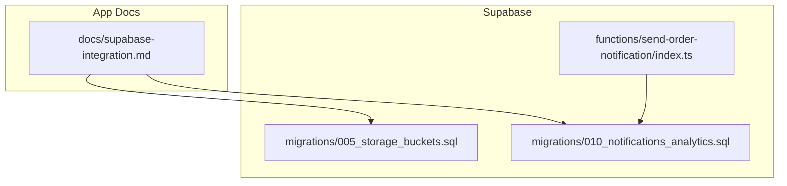
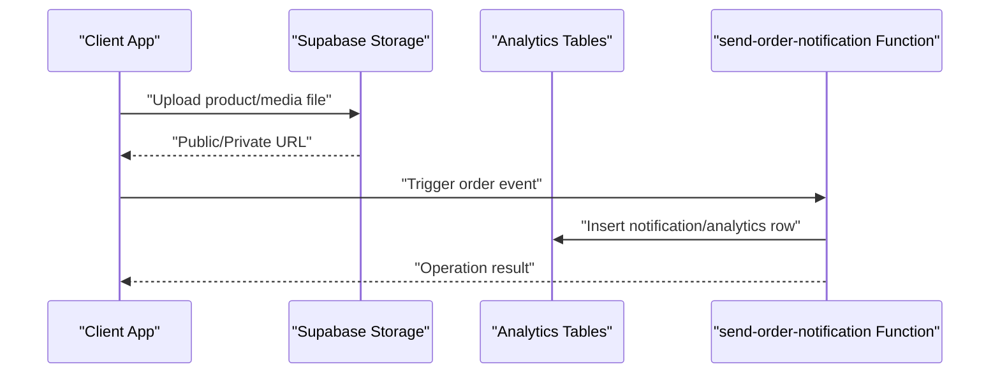
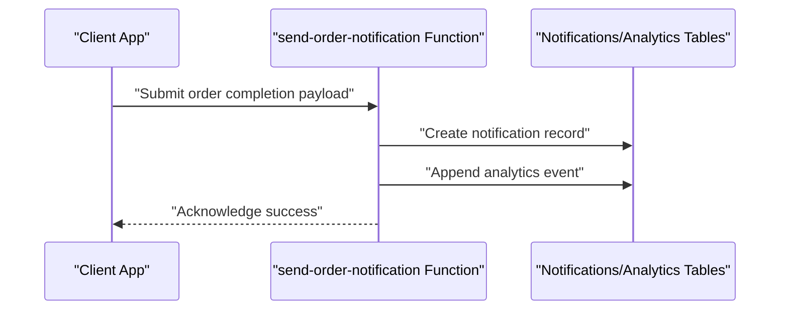
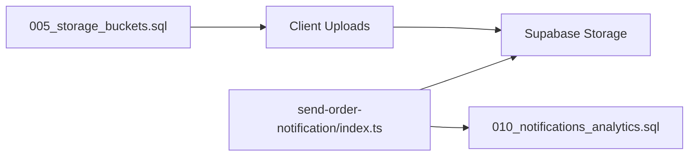

# Storage Buckets & Analytics Tables

<cite>
**Referenced Files in This Document**
- [supabase-integration.md](file://docs/supabase-integration.md)
- [005_storage_buckets.sql](file://supabase/migrations/005_storage_buckets.sql)
- [010_notifications_analytics.sql](file://supabase/migrations/010_notifications_analytics.sql)
- [send-order-notification/index.ts](file://supabase/functions/send-order-notification/index.ts)
</cite>

## Table of Contents
1. [Introduction](#introduction)
2. [Project Structure](#project-structure)
3. [Core Components](#core-components)
4. [Architecture Overview](#architecture-overview)
5. [Detailed Component Analysis](#detailed-component-analysis)
6. [Dependency Analysis](#dependency-analysis)
7. [Performance Considerations](#performance-considerations)
8. [Troubleshooting Guide](#troubleshooting-guide)
9. [Conclusion](#conclusion)
10. [Appendices](#appendices)

## Introduction
This document explains how Albatal Store organizes storage buckets and analytics tables, focusing on:
- File storage configuration for product images, user uploads, and media assets
- Bucket permissions, access controls, and CDN integration
- Analytics tables for user behavior tracking, notifications, and business intelligence
- Data collection patterns, aggregation methods, and reporting structures
- Storage optimization strategies, image processing pipelines, and asset management workflows
- Data retention policies, privacy considerations, and performance optimization for large datasets

The content is derived from the Supabase migrations and documentation included in the repository.

## Project Structure
Relevant areas for storage and analytics are located under:
- supabase/migrations: database schema and storage bucket definitions
- supabase/functions: serverless functions that interact with storage and analytics
- docs: project documentation including Supabase integration notes

**Diagram sources**
- [005_storage_buckets.sql](file://supabase/migrations/005_storage_buckets.sql)
- [010_notifications_analytics.sql](file://supabase/migrations/010_notifications_analytics.sql)
- [send-order-notification/index.ts](file://supabase/functions/send-order-notification/index.ts)
- [supabase-integration.md](file://docs/supabase-integration.md)

**Section sources**
- [supabase-integration.md](file://docs/supabase-integration.md)

## Core Components
- Storage buckets for product images, user uploads, and general media assets are defined via a dedicated migration.
- Analytics and notification tables are defined via a separate migration to support user behavior tracking and operational notifications.
- A serverless function coordinates order-related notifications and can integrate with storage and analytics as needed.

Key responsibilities:
- Define and secure storage buckets (names, public/private flags, RLS policies).
- Provide analytics tables for events, notifications, and BI-friendly aggregates.
- Enforce data retention and privacy through table design and policies.

**Section sources**
- [005_storage_buckets.sql](file://supabase/migrations/005_storage_buckets.sql)
- [010_notifications_analytics.sql](file://supabase/migrations/010_notifications_analytics.sql)
- [send-order-notification/index.ts](file://supabase/functions/send-order-notification/index.ts)

## Architecture Overview
High-level flow for storage and analytics:
- Clients upload files to Supabase Storage using configured buckets.
- Access is controlled by RLS policies and bucket settings.
- Serverless functions orchestrate side effects (e.g., sending notifications) and may write to analytics tables.
- Reports and dashboards query normalized analytics tables or materialized views.

**Diagram sources**
- [005_storage_buckets.sql](file://supabase/migrations/005_storage_buckets.sql)
- [010_notifications_analytics.sql](file://supabase/migrations/010_notifications_analytics.sql)
- [send-order-notification/index.ts](file://supabase/functions/send-order-notification/index.ts)

## Detailed Component Analysis

### Storage Buckets Configuration
- Purpose: Centralize file storage for product images, user uploads, and media assets.
- Key aspects covered by the migration:
  - Bucket names and intended use cases
  - Public vs private access flags
  - Row-level security policies for read/write operations
  - Naming conventions and folder structure recommendations

Operational guidance:
- Use distinct buckets per domain (e.g., product images, user avatars, marketing media).
- Prefer private buckets for sensitive data; expose via signed URLs when necessary.
- Apply RLS policies to restrict access to authenticated users and specific roles.

**Section sources**
- [005_storage_buckets.sql](file://supabase/migrations/005_storage_buckets.sql)

#### Storage Permissions and Access Controls
- Bucket-level visibility determines whether objects are publicly accessible.
- Policies govern who can list, read, write, and delete objects.
- Recommended pattern:
  - Product images: public bucket with strict naming and size limits
  - User uploads: private bucket with RLS allowing only the uploader to manage their files
  - Media assets: mixed strategy based on sensitivity and audience

**Section sources**
- [005_storage_buckets.sql](file://supabase/migrations/005_storage_buckets.sql)

#### CDN Integration
- Supabase Storage integrates with a CDN for fast global delivery.
- For public buckets, serve assets via the provided CDN endpoints.
- For private assets, generate time-limited signed URLs to avoid exposing credentials.

Best practices:
- Cache immutable assets aggressively (product images).
- Use cache-busting filenames for updated assets.
- Configure appropriate Content-Type and compression headers at upload time.

[No sources needed since this section provides general guidance]

### Analytics Tables and Notification System
- Purpose: Track user behavior, system notifications, and provide BI-ready structures.
- Covered by the analytics migration:
  - Event tables for user interactions and flows
  - Notification tables for operational messaging
  - Indexing and partitioning considerations for large datasets
  - Retention-friendly schemas (e.g., timestamps, IDs, lightweight payloads)

Data collection patterns:
- Append-only event logging with clear timestamps and entity references.
- Normalize dimensions (users, products, orders) and keep metrics concise.
- Separate high-volume telemetry from low-volume reference data.

Aggregation and reporting:
- Use materialized views or scheduled jobs to precompute KPIs.
- Maintain star-schema-like structures for BI tools.
- Keep raw events immutable; derive summaries separately.

Privacy and compliance:
- Avoid storing PII in analytics unless required; prefer hashed identifiers.
- Implement data minimization and purpose limitation.
- Provide mechanisms for deletion requests and data export.

Retention policies:
- Archive or purge old events based on retention windows.
- Partition by time to simplify lifecycle management.
- Ensure backups align with retention requirements.

**Section sources**
- [010_notifications_analytics.sql](file://supabase/migrations/010_notifications_analytics.sql)

### Order Notification Flow
A serverless function orchestrates post-order actions such as writing notifications and potentially updating analytics.

**Diagram sources**
- [send-order-notification/index.ts](file://supabase/functions/send-order-notification/index.ts)
- [010_notifications_analytics.sql](file://supabase/migrations/010_notifications_analytics.sql)

**Section sources**
- [send-order-notification/index.ts](file://supabase/functions/send-order-notification/index.ts)
- [010_notifications_analytics.sql](file://supabase/migrations/010_notifications_analytics.sql)

### Image Processing Pipelines and Asset Management
Recommended pipeline:
- Ingest: Accept original uploads into a staging area.
- Transform: Resize, compress, and convert to web-friendly formats.
- Publish: Move processed assets to the final bucket with deterministic filenames.
- Catalog: Update metadata in the database if needed.
- Invalidate: Clear CDN caches when replacing critical assets.

Automation options:
- Use storage hooks or serverless functions to trigger transformations.
- Queue heavy workloads to avoid blocking user flows.
- Version assets by hash to enable safe rollbacks.

Optimization tips:
- Limit maximum dimensions and file sizes.
- Use progressive JPEG/WebP where supported.
- Leverage CDN caching and ETags.

[No sources needed since this section provides general guidance]

## Dependency Analysis
Relationships between components:
- The storage buckets migration defines the foundation for all file-based features.
- The analytics migration provides the schema for behavioral and operational data.
- The notification function depends on both storage and analytics to coordinate cross-cutting concerns.

**Diagram sources**
- [005_storage_buckets.sql](file://supabase/migrations/005_storage_buckets.sql)
- [010_notifications_analytics.sql](file://supabase/migrations/010_notifications_analytics.sql)
- [send-order-notification/index.ts](file://supabase/functions/send-order-notification/index.ts)

**Section sources**
- [005_storage_buckets.sql](file://supabase/migrations/005_storage_buckets.sql)
- [010_notifications_analytics.sql](file://supabase/migrations/010_notifications_analytics.sql)
- [send-order-notification/index.ts](file://supabase/functions/send-order-notification/index.ts)

## Performance Considerations
- Storage:
  - Prefer smaller, optimized images to reduce bandwidth and improve load times.
  - Use CDN caching headers aligned with asset volatility.
  - Batch uploads and implement retries with exponential backoff.
- Analytics:
  - Partition large event tables by time to speed up queries and simplify purging.
  - Create indexes on foreign keys and timestamp columns used in common filters.
  - Materialize frequent aggregations to avoid expensive real-time computations.
- Functions:
  - Keep serverless functions idempotent and short-running.
  - Offload heavy processing to background workers or queues.

[No sources needed since this section provides general guidance]

## Troubleshooting Guide
Common issues and resolutions:
- Upload failures:
  - Verify bucket existence and policy grants.
  - Check client authentication and token validity.
  - Inspect network errors and retry logic.
- Permission denied:
  - Confirm RLS policies allow the current role/user.
  - Validate object paths match policy conditions.
- Slow analytics queries:
  - Review missing indexes and filter predicates.
  - Consider materialized views for hot reports.
  - Partition tables and archive old data.
- Notifications not delivered:
  - Inspect function logs for errors.
  - Validate input payloads and idempotency keys.
  - Ensure downstream tables accept writes.

[No sources needed since this section provides general guidance]

## Conclusion
Albatal Store’s storage and analytics foundations are defined through targeted Supabase migrations and supporting functions. By following the recommended patterns for bucket configuration, access control, CDN usage, and analytics design, teams can build scalable, secure, and performant features around product images, user uploads, and rich behavioral insights.

[No sources needed since this section summarizes without analyzing specific files]

## Appendices

### Quick Reference: Where to Look
- Storage buckets definition: [005_storage_buckets.sql](file://supabase/migrations/005_storage_buckets.sql)
- Analytics and notifications schema: [010_notifications_analytics.sql](file://supabase/migrations/010_notifications_analytics.sql)
- Notification function implementation: [send-order-notification/index.ts](file://supabase/functions/send-order-notification/index.ts)
- Supabase integration overview: [supabase-integration.md](file://docs/supabase-integration.md)

**Section sources**
- [005_storage_buckets.sql](file://supabase/migrations/005_storage_buckets.sql)
- [010_notifications_analytics.sql](file://supabase/migrations/010_notifications_analytics.sql)
- [send-order-notification/index.ts](file://supabase/functions/send-order-notification/index.ts)
- [supabase-integration.md](file://docs/supabase-integration.md)