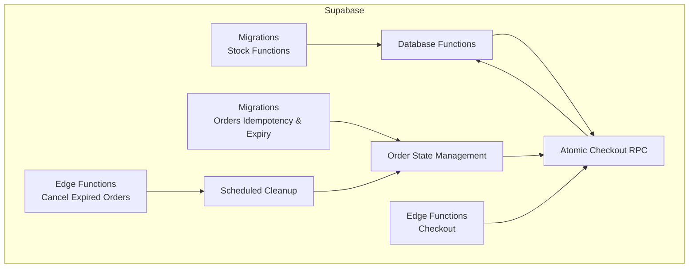
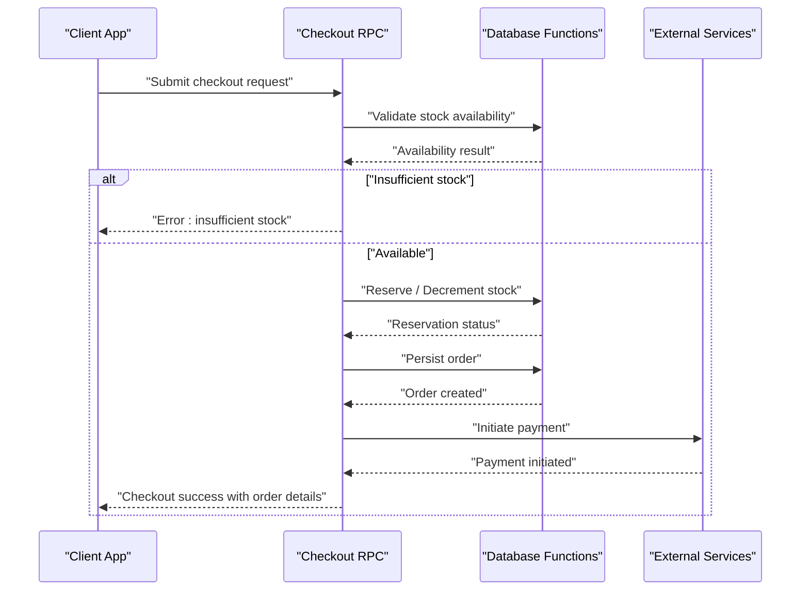
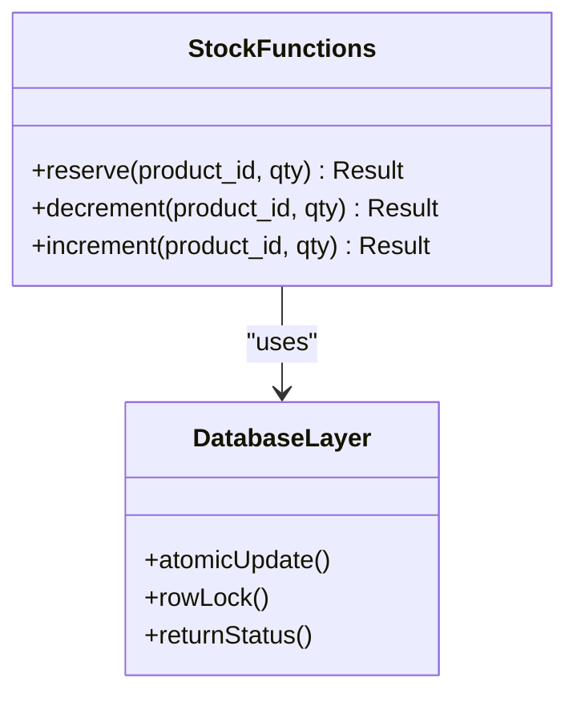
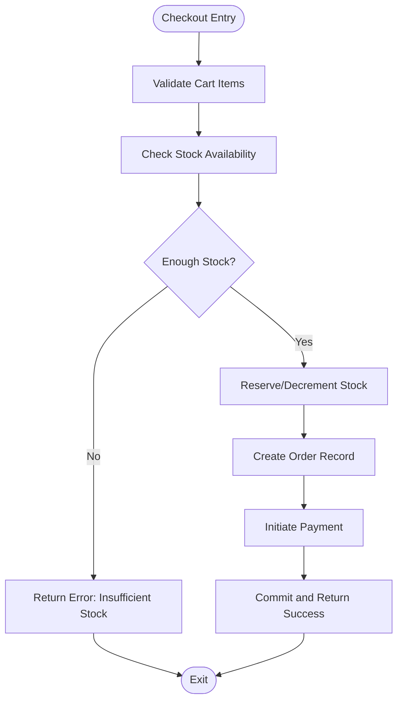
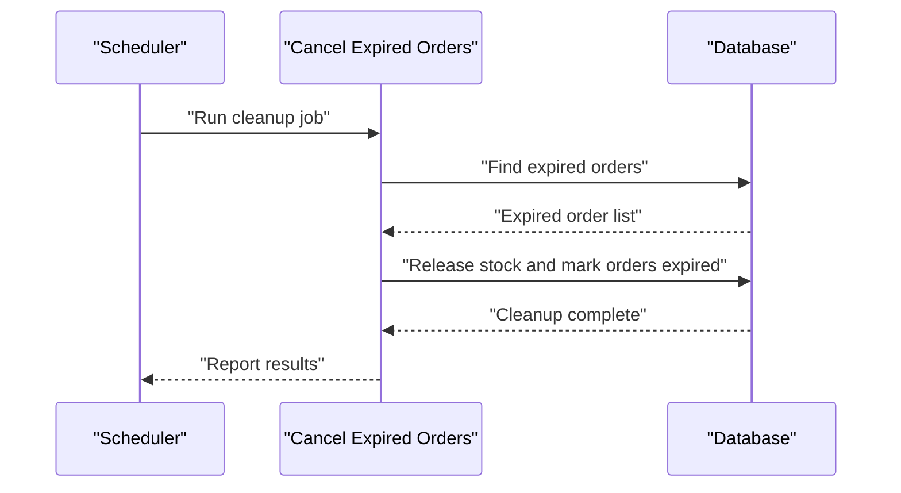
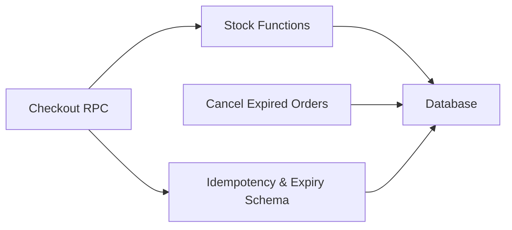

# Stored Procedures & Database Functions

<cite>
**Referenced Files in This Document**
- [004_stock_function.sql](file://supabase/migrations/004_stock_function.sql)
- [007_stock_increment_function.sql](file://supabase/migrations/007_stock_increment_function.sql)
- [index.ts](file://supabase/functions/checkout/index.ts)
- [index.ts](file://supabase/functions/cancel-expired-orders/index.ts)
- [011_orders_idempotency_and_expiry.sql](file://supabase/migrations/011_orders_idempotency_and_expiry.sql)
</cite>

## Table of Contents
1. [Introduction](#introduction)
2. [Project Structure](#project-structure)
3. [Core Components](#core-components)
4. [Architecture Overview](#architecture-overview)
5. [Detailed Component Analysis](#detailed-component-analysis)
6. [Dependency Analysis](#dependency-analysis)
7. [Performance Considerations](#performance-considerations)
8. [Troubleshooting Guide](#troubleshooting-guide)
9. [Conclusion](#conclusion)

## Introduction
This document explains the stored procedures and database functions used by Albatal Store for stock management and checkout operations. It focuses on:
- Inventory reservation, decrement, and reconciliation
- Atomic checkout RPC procedures that encapsulate complex business logic transactions
- Function parameters, return values, error handling, and performance considerations
- Usage examples demonstrating proper invocation patterns and error scenarios
- Transaction boundaries, rollback mechanisms, and data consistency guarantees
- Optimization strategies including indexing and monitoring

## Project Structure
The relevant server-side assets are located under supabase:
- Migrations define SQL functions and schema changes (stock functions, idempotency, expiry)
- Edge Functions implement RPC endpoints that orchestrate database calls and external services

**Diagram sources**
- [004_stock_function.sql](file://supabase/migrations/004_stock_function.sql)
- [007_stock_increment_function.sql](file://supabase/migrations/007_stock_increment_function.sql)
- [011_orders_idempotency_and_expiry.sql](file://supabase/migrations/011_orders_idempotency_and_expiry.sql)
- [index.ts](file://supabase/functions/checkout/index.ts)
- [index.ts](file://supabase/functions/cancel-expired-orders/index.ts)

**Section sources**
- [004_stock_function.sql](file://supabase/migrations/004_stock_function.sql)
- [007_stock_increment_function.sql](file://supabase/migrations/007_stock_increment_function.sql)
- [011_orders_idempotency_and_expiry.sql](file://supabase/migrations/011_orders_idempotency_and_expiry.sql)
- [index.ts](file://supabase/functions/checkout/index.ts)
- [index.ts](file://supabase/functions/cancel-expired-orders/index.ts)

## Core Components
- Stock management functions:
  - Reservation and decrement operations to safely reduce available inventory
  - Increment function to restore stock on cancellations or failures
- Checkout RPC:
  - An atomic transaction that validates stock, reserves/decrements inventory, persists order, and returns a consistent result
- Order idempotency and expiry:
  - Mechanisms to prevent duplicate processing and clean up expired orders

Key responsibilities:
- Ensure correctness under concurrency
- Provide clear error signals for invalid states (e.g., insufficient stock)
- Maintain auditability via structured return values

**Section sources**
- [004_stock_function.sql](file://supabase/migrations/004_stock_function.sql)
- [007_stock_increment_function.sql](file://supabase/migrations/007_stock_increment_function.sql)
- [011_orders_idempotency_and_expiry.sql](file://supabase/migrations/011_orders_idempotency_and_expiry.sql)
- [index.ts](file://supabase/functions/checkout/index.ts)

## Architecture Overview
The checkout flow is implemented as an RPC that orchestrates multiple database operations within a single transaction. Stock functions enforce constraints at the database layer to guarantee consistency even under high concurrency.

**Diagram sources**
- [index.ts](file://supabase/functions/checkout/index.ts)
- [004_stock_function.sql](file://supabase/migrations/004_stock_function.sql)
- [007_stock_increment_function.sql](file://supabase/migrations/007_stock_increment_function.sql)
- [011_orders_idempotency_and_expiry.sql](file://supabase/migrations/011_orders_idempotency_and_expiry.sql)

## Detailed Component Analysis

### Stock Management Functions
Purpose:
- Safely reserve and decrement inventory
- Restore stock when necessary (increment)
- Provide deterministic outcomes for concurrent requests

Typical responsibilities:
- Validate product existence and current stock levels
- Apply updates atomically using row-level locking
- Return explicit status codes or messages indicating success or failure reasons

Parameters and return values:
- Inputs typically include product identifiers and quantities
- Outputs indicate success/failure and may include updated stock levels or error codes

Usage examples:
- Reserve stock before creating an order
- Decrement stock upon confirmed purchase
- Increment stock on cancellation or refund

Error handling:
- Insufficient stock errors
- Invalid product or quantity inputs
- Concurrency conflicts resolved by database locks

Performance considerations:
- Use targeted updates to minimize lock scope
- Avoid unnecessary reads; rely on atomic operations where possible

**Section sources**
- [004_stock_function.sql](file://supabase/migrations/004_stock_function.sql)
- [007_stock_increment_function.sql](file://supabase/migrations/007_stock_increment_function.sql)

#### Class Diagram: Stock Operations

**Diagram sources**
- [004_stock_function.sql](file://supabase/migrations/004_stock_function.sql)
- [007_stock_increment_function.sql](file://supabase/migrations/007_stock_increment_function.sql)

### Atomic Checkout RPC
Purpose:
- Encapsulate the entire checkout process in a single transaction
- Coordinate stock reservation/decrement, order creation, and payment initiation
- Guarantee all-or-nothing semantics

Flow overview:
- Validate cart items and totals
- Check stock availability
- Reserve or decrement stock
- Persist order record
- Initiate payment
- Commit transaction and return result

**Diagram sources**
- [index.ts](file://supabase/functions/checkout/index.ts)
- [004_stock_function.sql](file://supabase/migrations/004_stock_function.sql)
- [007_stock_increment_function.sql](file://supabase/migrations/007_stock_increment_function.sql)

Parameters and return values:
- Inputs: cart items, customer context, shipping/payment details
- Outputs: order ID, status, payment session reference, and error details if any

Error handling:
- Insufficient stock
- Payment initiation failures
- Database constraint violations
- Network timeouts

Transaction boundaries:
- All critical writes occur within a single transaction
- Rollback occurs automatically on any error path

Data consistency guarantees:
- No partial state: either the order is fully created and stock decremented, or nothing changes
- Deterministic outcomes under concurrency due to row-level locks

Usage examples:
- Successful checkout with immediate payment initiation
- Failure due to insufficient stock
- Failure due to payment gateway error

**Section sources**
- [index.ts](file://supabase/functions/checkout/index.ts)
- [004_stock_function.sql](file://supabase/migrations/004_stock_function.sql)
- [007_stock_increment_function.sql](file://supabase/migrations/007_stock_increment_function.sql)

### Order Idempotency and Expiry
Purpose:
- Prevent duplicate order processing
- Clean up orders that have not been completed within a time window

Mechanisms:
- Idempotency keys to deduplicate repeated submissions
- Scheduled cleanup to expire incomplete orders and release reserved stock

**Diagram sources**
- [index.ts](file://supabase/functions/cancel-expired-orders/index.ts)
- [011_orders_idempotency_and_expiry.sql](file://supabase/migrations/011_orders_idempotency_and_expiry.sql)

Parameters and return values:
- Inputs: time threshold for expiration
- Outputs: counts of processed orders and released stock

Error handling:
- Partial failures during cleanup should be retried
- Logging and metrics for observability

**Section sources**
- [index.ts](file://supabase/functions/cancel-expired-orders/index.ts)
- [011_orders_idempotency_and_expiry.sql](file://supabase/migrations/011_orders_idempotency_and_expiry.sql)

## Dependency Analysis
Relationships between components:
- Checkout RPC depends on stock functions for inventory updates
- Order idempotency and expiry depend on order state tables and scheduled jobs
- Stock increment function supports rollback paths (cancellations/refunds)

**Diagram sources**
- [index.ts](file://supabase/functions/checkout/index.ts)
- [index.ts](file://supabase/functions/cancel-expired-orders/index.ts)
- [004_stock_function.sql](file://supabase/migrations/004_stock_function.sql)
- [007_stock_increment_function.sql](file://supabase/migrations/007_stock_increment_function.sql)
- [011_orders_idempotency_and_expiry.sql](file://supabase/migrations/011_orders_idempotency_and_expiry.sql)

**Section sources**
- [index.ts](file://supabase/functions/checkout/index.ts)
- [index.ts](file://supabase/functions/cancel-expired-orders/index.ts)
- [004_stock_function.sql](file://supabase/migrations/004_stock_function.sql)
- [007_stock_increment_function.sql](file://supabase/migrations/007_stock_increment_function.sql)
- [011_orders_idempotency_and_expiry.sql](file://supabase/migrations/011_orders_idempotency_and_expiry.sql)

## Performance Considerations
- Indexing strategies:
  - Indexes on product identifiers and foreign keys used in stock checks and updates
  - Composite indexes for queries filtering by product and status fields
- Query optimization:
  - Prefer atomic updates over read-modify-write sequences
  - Minimize round-trips by batching operations within a single transaction
- Concurrency control:
  - Rely on database row-level locks to serialize conflicting updates
  - Keep transactions short to reduce lock contention
- Monitoring:
  - Track slow queries and lock waits
  - Monitor error rates for insufficient stock and payment failures
  - Observe idempotency key collisions and retry patterns

[No sources needed since this section provides general guidance]

## Troubleshooting Guide
Common issues and resolutions:
- Insufficient stock:
  - Verify stock levels and ensure reservation/decrement functions are invoked correctly
  - Check for uncommitted transactions holding locks
- Duplicate order processing:
  - Confirm idempotency keys are unique per submission
  - Review cleanup job logs for expired orders
- Payment initiation failures:
  - Inspect network connectivity and external service responses
  - Implement retries with exponential backoff and circuit breakers
- Slow checkout:
  - Analyze query plans for stock checks and order inserts
  - Add or adjust indexes based on observed access patterns

Operational tips:
- Enable detailed logging around transaction boundaries
- Capture error contexts including product IDs, quantities, and order IDs
- Use dashboards to monitor throughput and latency percentiles

**Section sources**
- [index.ts](file://supabase/functions/checkout/index.ts)
- [index.ts](file://supabase/functions/cancel-expired-orders/index.ts)
- [011_orders_idempotency_and_expiry.sql](file://supabase/migrations/011_orders_idempotency_and_expiry.sql)

## Conclusion
Albatal Store’s stock management and checkout systems are designed for correctness and resilience:
- Stock functions provide safe, atomic operations for reservation, decrement, and increment
- The checkout RPC enforces transactional integrity across inventory and order persistence
- Idempotency and expiry mechanisms protect against duplicates and stale state
- Proper indexing, concise transactions, and robust monitoring ensure performance and reliability

[No sources needed since this section summarizes without analyzing specific files]