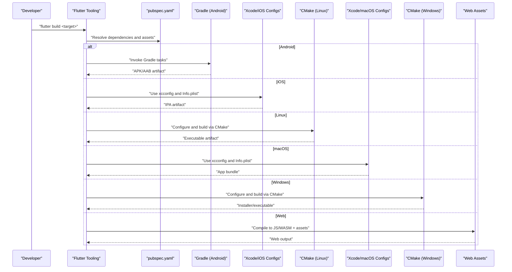
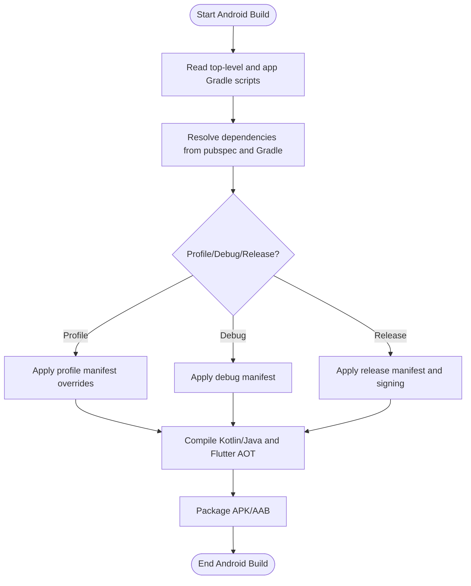
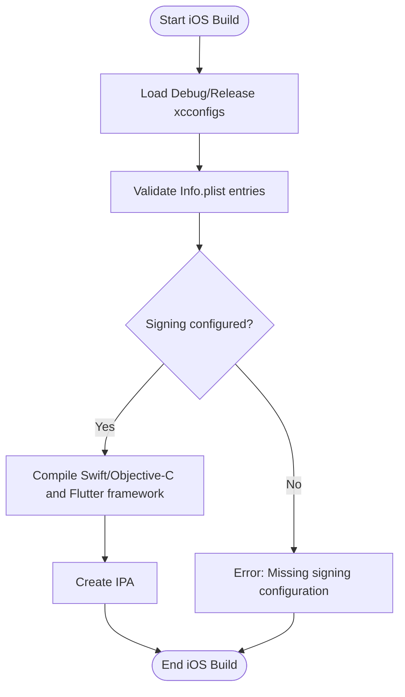
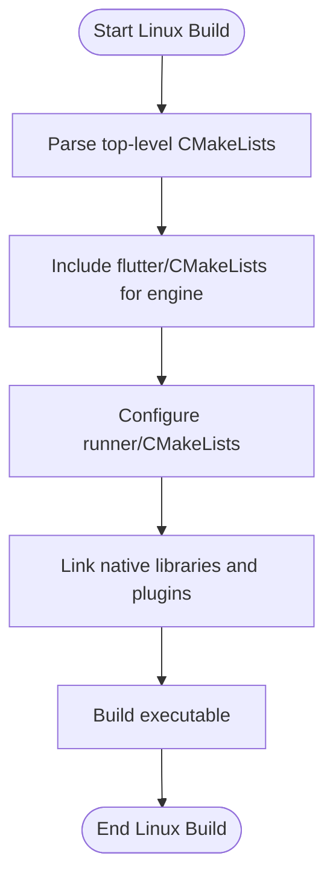
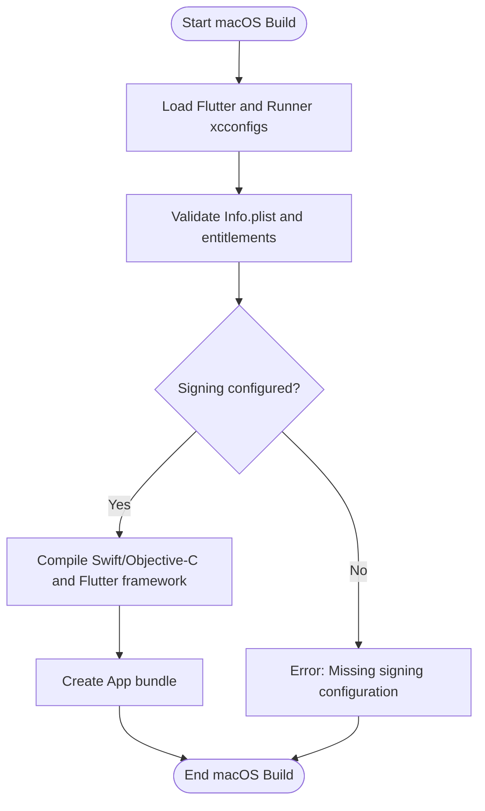
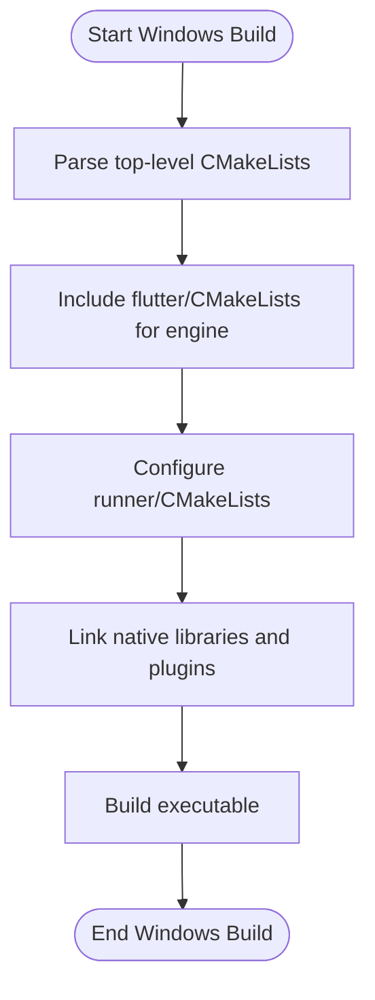
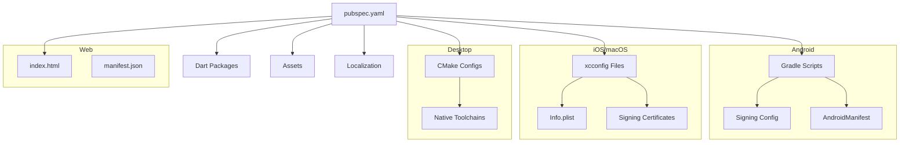

# Build Configuration

<cite>
**Referenced Files in This Document**
- [pubspec.yaml](file://pubspec.yaml)
- [android/build.gradle.kts](file://android/build.gradle.kts)
- [android/app/build.gradle.kts](file://android/app/build.gradle.kts)
- [android/gradle.properties](file://android/gradle.properties)
- [android/settings.gradle.kts](file://android/settings.gradle.kts)
- [android/app/src/main/AndroidManifest.xml](file://android/app/src/main/AndroidManifest.xml)
- [android/app/src/profile/AndroidManifest.xml](file://android/app/src/profile/AndroidManifest.xml)
- [ios/Flutter/Debug.xcconfig](file://ios/Flutter/Debug.xcconfig)
- [ios/Flutter/Release.xcconfig](file://ios/Flutter/Release.xcconfig)
- [ios/Runner/Info.plist](file://ios/Runner/Info.plist)
- [macos/Flutter/Flutter-Debug.xcconfig](file://macos/Flutter/Flutter-Debug.xcconfig)
- [macos/Flutter/Flutter-Release.xcconfig](file://macos/Flutter/Flutter-Release.xcconfig)
- [macos/Runner/Configs/AppInfo.xcconfig](file://macos/Runner/Configs/AppInfo.xcconfig)
- [macos/Runner/Configs/Debug.xcconfig](file://macos/Runner/Configs/Debug.xcconfig)
- [macos/Runner/Configs/Release.xcconfig](file://macos/Runner/Configs/Release.xcconfig)
- [macos/Runner/Info.plist](file://macos/Runner/Info.plist)
- [linux/CMakeLists.txt](file://linux/CMakeLists.txt)
- [linux/flutter/CMakeLists.txt](file://linux/flutter/CMakeLists.txt)
- [linux/runner/CMakeLists.txt](file://linux/runner/CMakeLists.txt)
- [windows/CMakeLists.txt](file://windows/CMakeLists.txt)
- [windows/flutter/CMakeLists.txt](file://windows/flutter/CMakeLists.txt)
- [windows/runner/CMakeLists.txt](file://windows/runner/CMakeLists.txt)
- [web/index.html](file://web/index.html)
- [web/manifest.json](file://web/manifest.json)
</cite>

## Table of Contents
1. [Introduction](#introduction)
2. [Project Structure](#project-structure)
3. [Core Components](#core-components)
4. [Architecture Overview](#architecture-overview)
5. [Detailed Component Analysis](#detailed-component-analysis)
6. [Dependency Analysis](#dependency-analysis)
7. [Performance Considerations](#performance-considerations)
8. [Troubleshooting Guide](#troubleshooting-guide)
9. [Conclusion](#conclusion)

## Introduction
This document explains the build configuration for a multi-platform Flutter application across Android, iOS, Linux, macOS, Windows, and Web. It covers project setup in pubspec.yaml, platform-specific build scripts, signing and manifest settings, CMake configurations for desktop platforms, and environment-specific build variants. It also includes performance tuning strategies, caching recommendations, and troubleshooting guidance based on the repository’s actual configuration files.

## Project Structure
The project follows standard Flutter multi-platform layout:
- Root-level Dart project with pubspec.yaml defining dependencies, assets, and localization.
- Platform folders android/, ios/, linux/, macos/, windows/, web/ contain native build artifacts and configurations.
- Desktop platforms use CMake to integrate Flutter engine and plugins.
- Mobile platforms use Gradle (Android) and Xcode config files (iOS/macOS).

```mermaid
graph TB
subgraph "Root"
P["pubspec.yaml"]
end
subgraph "Android"
AGradle["android/build.gradle.kts"]
AAppGradle["android/app/build.gradle.kts"]
AProps["android/gradle.properties"]
ASettings["android/settings.gradle.kts"]
AManifest["android/app/src/main/AndroidManifest.xml"]
AProfileManifest["android/app/src/profile/AndroidManifest.xml"]
end
subgraph "iOS"
IDebug["ios/Flutter/Debug.xcconfig"]
IRelease["ios/Flutter/Release.xcconfig"]
IInfo["ios/Runner/Info.plist"]
end
subgraph "Linux"
LCMain["linux/CMakeLists.txt"]
LFFlutter["linux/flutter/CMakeLists.txt"]
LRunner["linux/runner/CMakeLists.txt"]
end
subgraph "macOS"
MDebug["macos/Flutter/Flutter-Debug.xcconfig"]
MRelease["macos/Flutter/Flutter-Release.xcconfig"]
MAppInfo["macos/Runner/Configs/AppInfo.xcconfig"]
MDebugCfg["macos/Runner/Configs/Debug.xcconfig"]
MReleaseCfg["macos/Runner/Configs/Release.xcconfig"]
MInfo["macos/Runner/Info.plist"]
end
subgraph "Windows"
WMain["windows/CMakeLists.txt"]
WFlutter["windows/flutter/CMakeLists.txt"]
WRunner["windows/runner/CMakeLists.txt"]
end
subgraph "Web"
WIndex["web/index.html"]
WManifest["web/manifest.json"]
end
P --> AGradle
P --> AAppGradle
P --> AProps
P --> ASettings
P --> AManifest
P --> AProfileManifest
P --> IDebug
P --> IRelease
P --> IInfo
P --> LCMain
P --> LFFlutter
P --> LRunner
P --> MDebug
P --> MRelease
P --> MAppInfo
P --> MDebugCfg
P --> MReleaseCfg
P --> MInfo
P --> WMain
P --> WFlutter
P --> WRunner
P --> WIndex
P --> WManifest
```

**Diagram sources**
- [pubspec.yaml](file://pubspec.yaml)
- [android/build.gradle.kts](file://android/build.gradle.kts)
- [android/app/build.gradle.kts](file://android/app/build.gradle.kts)
- [android/gradle.properties](file://android/gradle.properties)
- [android/settings.gradle.kts](file://android/settings.gradle.kts)
- [android/app/src/main/AndroidManifest.xml](file://android/app/src/main/AndroidManifest.xml)
- [android/app/src/profile/AndroidManifest.xml](file://android/app/src/profile/AndroidManifest.xml)
- [ios/Flutter/Debug.xcconfig](file://ios/Flutter/Debug.xcconfig)
- [ios/Flutter/Release.xcconfig](file://ios/Flutter/Release.xcconfig)
- [ios/Runner/Info.plist](file://ios/Runner/Info.plist)
- [linux/CMakeLists.txt](file://linux/CMakeLists.txt)
- [linux/flutter/CMakeLists.txt](file://linux/flutter/CMakeLists.txt)
- [linux/runner/CMakeLists.txt](file://linux/runner/CMakeLists.txt)
- [macos/Flutter/Flutter-Debug.xcconfig](file://macos/Flutter/Flutter-Debug.xcconfig)
- [macos/Flutter/Flutter-Release.xcconfig](file://macos/Flutter/Flutter-Release.xcconfig)
- [macos/Runner/Configs/AppInfo.xcconfig](file://macos/Runner/Configs/AppInfo.xcconfig)
- [macos/Runner/Configs/Debug.xcconfig](file://macos/Runner/Configs/Debug.xcconfig)
- [macos/Runner/Configs/Release.xcconfig](file://macos/Runner/Configs/Release.xcconfig)
- [macos/Runner/Info.plist](file://macos/Runner/Info.plist)
- [windows/CMakeLists.txt](file://windows/CMakeLists.txt)
- [windows/flutter/CMakeLists.txt](file://windows/flutter/CMakeLists.txt)
- [windows/runner/CMakeLists.txt](file://windows/runner/CMakeLists.txt)
- [web/index.html](file://web/index.html)
- [web/manifest.json](file://web/manifest.json)

**Section sources**
- [pubspec.yaml](file://pubspec.yaml)
- [android/build.gradle.kts](file://android/build.gradle.kts)
- [android/app/build.gradle.kts](file://android/app/build.gradle.kts)
- [android/gradle.properties](file://android/gradle.properties)
- [android/settings.gradle.kts](file://android/settings.gradle.kts)
- [android/app/src/main/AndroidManifest.xml](file://android/app/src/main/AndroidManifest.xml)
- [android/app/src/profile/AndroidManifest.xml](file://android/app/src/profile/AndroidManifest.xml)
- [ios/Flutter/Debug.xcconfig](file://ios/Flutter/Debug.xcconfig)
- [ios/Flutter/Release.xcconfig](file://ios/Flutter/Release.xcconfig)
- [ios/Runner/Info.plist](file://ios/Runner/Info.plist)
- [linux/CMakeLists.txt](file://linux/CMakeLists.txt)
- [linux/flutter/CMakeLists.txt](file://linux/flutter/CMakeLists.txt)
- [linux/runner/CMakeLists.txt](file://linux/runner/CMakeLists.txt)
- [macos/Flutter/Flutter-Debug.xcconfig](file://macos/Flutter/Flutter-Debug.xcconfig)
- [macos/Flutter/Flutter-Release.xcconfig](file://macos/Flutter/Flutter-Release.xcconfig)
- [macos/Runner/Configs/AppInfo.xcconfig](file://macos/Runner/Configs/AppInfo.xcconfig)
- [macos/Runner/Configs/Debug.xcconfig](file://macos/Runner/Configs/Debug.xcconfig)
- [macos/Runner/Configs/Release.xcconfig](file://macos/Runner/Configs/Release.xcconfig)
- [macos/Runner/Info.plist](file://macos/Runner/Info.plist)
- [windows/CMakeLists.txt](file://windows/CMakeLists.txt)
- [windows/flutter/CMakeLists.txt](file://windows/flutter/CMakeLists.txt)
- [windows/runner/CMakeLists.txt](file://windows/runner/CMakeLists.txt)
- [web/index.html](file://web/index.html)
- [web/manifest.json](file://web/manifest.json)

## Core Components
- Flutter project definition: Dependencies, assets, and localization are declared in pubspec.yaml.
- Android builds: Managed by Gradle Kotlin DSL; app module build script defines compile options, signing, and product flavors if present.
- iOS builds: Configured via xcconfig files for Debug/Release and Info.plist for runtime permissions and metadata.
- Desktop builds: Linux and Windows use CMake to integrate Flutter engine and plugins; macOS uses Xcode configs similar to iOS.
- Web build: index.html and manifest.json define entrypoint and web app metadata.

Key responsibilities:
- Dependency resolution and asset bundling (pubspec.yaml).
- Native compilation and packaging (Gradle, CMake, Xcode configs).
- Environment-specific flags and optimizations (build types, profiles, release modes).
- Signing and distribution requirements per platform.

**Section sources**
- [pubspec.yaml](file://pubspec.yaml)
- [android/build.gradle.kts](file://android/build.gradle.kts)
- [android/app/build.gradle.kts](file://android/app/build.gradle.kts)
- [android/gradle.properties](file://android/gradle.properties)
- [android/settings.gradle.kts](file://android/settings.gradle.kts)
- [android/app/src/main/AndroidManifest.xml](file://android/app/src/main/AndroidManifest.xml)
- [android/app/src/profile/AndroidManifest.xml](file://android/app/src/profile/AndroidManifest.xml)
- [ios/Flutter/Debug.xcconfig](file://ios/Flutter/Debug.xcconfig)
- [ios/Flutter/Release.xcconfig](file://ios/Flutter/Release.xcconfig)
- [ios/Runner/Info.plist](file://ios/Runner/Info.plist)
- [linux/CMakeLists.txt](file://linux/CMakeLists.txt)
- [linux/flutter/CMakeLists.txt](file://linux/flutter/CMakeLists.txt)
- [linux/runner/CMakeLists.txt](file://linux/runner/CMakeLists.txt)
- [macos/Flutter/Flutter-Debug.xcconfig](file://macos/Flutter/Flutter-Debug.xcconfig)
- [macos/Flutter/Flutter-Release.xcconfig](file://macos/Flutter/Flutter-Release.xcconfig)
- [macos/Runner/Configs/AppInfo.xcconfig](file://macos/Runner/Configs/AppInfo.xcconfig)
- [macos/Runner/Configs/Debug.xcconfig](file://macos/Runner/Configs/Debug.xcconfig)
- [macos/Runner/Configs/Release.xcconfig](file://macos/Runner/Configs/Release.xcconfig)
- [macos/Runner/Info.plist](file://macos/Runner/Info.plist)
- [windows/CMakeLists.txt](file://windows/CMakeLists.txt)
- [windows/flutter/CMakeLists.txt](file://windows/flutter/CMakeLists.txt)
- [windows/runner/CMakeLists.txt](file://windows/runner/CMakeLists.txt)
- [web/index.html](file://web/index.html)
- [web/manifest.json](file://web/manifest.json)

## Architecture Overview
Build pipeline overview:
- Flutter tooling reads pubspec.yaml to resolve dependencies and assets.
- For each target platform, Flutter delegates to native build systems:
  - Android: Gradle compiles Kotlin/Java and packages APK/AAB.
  - iOS/macOS: Xcode builds using xcconfig and Info.plist.
  - Linux/Windows: CMake orchestrates Flutter engine linking and plugin integration.
  - Web: Dart-to-JS/WASM compilation with HTML/manifest metadata.

[No sources needed since this diagram shows conceptual workflow, not actual code structure]

## Detailed Component Analysis

### Flutter Project Setup (pubspec.yaml)
- Declares dependencies, dev_dependencies, and version constraints.
- Defines assets directories and fonts used at runtime.
- May include localization configuration and platform overrides.

Best practices:
- Pin dependency versions where stability is critical.
- Organize assets under dedicated folders and reference them explicitly.
- Keep platform-specific overrides minimal and well-documented.

**Section sources**
- [pubspec.yaml](file://pubspec.yaml)

### Android Build Configuration
Key files:
- android/build.gradle.kts: Top-level Gradle configuration.
- android/app/build.gradle.kts: App module build rules, compileSdk/targetSdk, signing, and packaging options.
- android/gradle.properties: Global Gradle properties (e.g., JVM args, AndroidX).
- android/settings.gradle.kts: Included projects and plugin management.
- android/app/src/main/AndroidManifest.xml: Application metadata, permissions, and components.
- android/app/src/profile/AndroidManifest.xml: Profile-mode specific overrides.

Highlights:
- Use separate profile/debug/release manifests when necessary.
- Configure signing for release builds (keystore references and alias).
- Set minSdkVersion and targetSdkVersion aligned with supported devices.
- Enable R8/ProGuard rules for release shrinkage and obfuscation if applicable.

**Diagram sources**
- [android/build.gradle.kts](file://android/build.gradle.kts)
- [android/app/build.gradle.kts](file://android/app/build.gradle.kts)
- [android/gradle.properties](file://android/gradle.properties)
- [android/settings.gradle.kts](file://android/settings.gradle.kts)
- [android/app/src/main/AndroidManifest.xml](file://android/app/src/main/AndroidManifest.xml)
- [android/app/src/profile/AndroidManifest.xml](file://android/app/src/profile/AndroidManifest.xml)

**Section sources**
- [android/build.gradle.kts](file://android/build.gradle.kts)
- [android/app/build.gradle.kts](file://android/app/build.gradle.kts)
- [android/gradle.properties](file://android/gradle.properties)
- [android/settings.gradle.kts](file://android/settings.gradle.kts)
- [android/app/src/main/AndroidManifest.xml](file://android/app/src/main/AndroidManifest.xml)
- [android/app/src/profile/AndroidManifest.xml](file://android/app/src/profile/AndroidManifest.xml)

### iOS Build Configuration
Key files:
- ios/Flutter/Debug.xcconfig and Release.xcconfig: Build settings for Debug/Release modes.
- ios/Runner/Info.plist: App metadata, permissions, and runtime behavior.

Highlights:
- Ensure deployment target meets minimum OS requirements.
- Configure signing certificates and provisioning profiles for release builds.
- Validate Info.plist keys for required capabilities (e.g., background modes, network security).

**Diagram sources**
- [ios/Flutter/Debug.xcconfig](file://ios/Flutter/Debug.xcconfig)
- [ios/Flutter/Release.xcconfig](file://ios/Flutter/Release.xcconfig)
- [ios/Runner/Info.plist](file://ios/Runner/Info.plist)

**Section sources**
- [ios/Flutter/Debug.xcconfig](file://ios/Flutter/Debug.xcconfig)
- [ios/Flutter/Release.xcconfig](file://ios/Flutter/Release.xcconfig)
- [ios/Runner/Info.plist](file://ios/Runner/Info.plist)

### Linux Build Configuration (CMake)
Key files:
- linux/CMakeLists.txt: Top-level CMake configuration for Linux target.
- linux/flutter/CMakeLists.txt: Flutter engine integration and plugin registration.
- linux/runner/CMakeLists.txt: Runner executable and resource linking.

Highlights:
- Ensure system dependencies (GTK, GL, etc.) are installed.
- Configure install targets and packaging (e.g., .deb or AppImage) as needed.
- Verify plugin compatibility with Linux backend.

**Diagram sources**
- [linux/CMakeLists.txt](file://linux/CMakeLists.txt)
- [linux/flutter/CMakeLists.txt](file://linux/flutter/CMakeLists.txt)
- [linux/runner/CMakeLists.txt](file://linux/runner/CMakeLists.txt)

**Section sources**
- [linux/CMakeLists.txt](file://linux/CMakeLists.txt)
- [linux/flutter/CMakeLists.txt](file://linux/flutter/CMakeLists.txt)
- [linux/runner/CMakeLists.txt](file://linux/runner/CMakeLists.txt)

### macOS Build Configuration (Xcode and CMake)
Key files:
- macos/Flutter/Flutter-Debug.xcconfig and Flutter-Release.xcconfig: Build settings for Debug/Release.
- macos/Runner/Configs/AppInfo.xcconfig, Debug.xcconfig, Release.xcconfig: App-specific build settings.
- macos/Runner/Info.plist: App metadata and entitlements.

Highlights:
- Configure signing and notarization for distribution.
- Align deployment target with supported macOS versions.
- Validate entitlements for sandboxed apps.

**Diagram sources**
- [macos/Flutter/Flutter-Debug.xcconfig](file://macos/Flutter/Flutter-Debug.xcconfig)
- [macos/Flutter/Flutter-Release.xcconfig](file://macos/Flutter/Flutter-Release.xcconfig)
- [macos/Runner/Configs/AppInfo.xcconfig](file://macos/Runner/Configs/AppInfo.xcconfig)
- [macos/Runner/Configs/Debug.xcconfig](file://macos/Runner/Configs/Debug.xcconfig)
- [macos/Runner/Configs/Release.xcconfig](file://macos/Runner/Configs/Release.xcconfig)
- [macos/Runner/Info.plist](file://macos/Runner/Info.plist)

**Section sources**
- [macos/Flutter/Flutter-Debug.xcconfig](file://macos/Flutter/Flutter-Debug.xcconfig)
- [macos/Flutter/Flutter-Release.xcconfig](file://macos/Flutter/Flutter-Release.xcconfig)
- [macos/Runner/Configs/AppInfo.xcconfig](file://macos/Runner/Configs/AppInfo.xcconfig)
- [macos/Runner/Configs/Debug.xcconfig](file://macos/Runner/Configs/Debug.xcconfig)
- [macos/Runner/Configs/Release.xcconfig](file://macos/Runner/Configs/Release.xcconfig)
- [macos/Runner/Info.plist](file://macos/Runner/Info.plist)

### Windows Build Configuration (CMake)
Key files:
- windows/CMakeLists.txt: Top-level CMake configuration for Windows target.
- windows/flutter/CMakeLists.txt: Flutter engine integration and plugin registration.
- windows/runner/CMakeLists.txt: Runner executable and resources.

Highlights:
- Ensure Visual Studio build tools and Windows SDK are installed.
- Configure installer generation (e.g., NSIS) if distributing MSI.
- Verify plugin compatibility with Windows backend.

**Diagram sources**
- [windows/CMakeLists.txt](file://windows/CMakeLists.txt)
- [windows/flutter/CMakeLists.txt](file://windows/flutter/CMakeLists.txt)
- [windows/runner/CMakeLists.txt](file://windows/runner/CMakeLists.txt)

**Section sources**
- [windows/CMakeLists.txt](file://windows/CMakeLists.txt)
- [windows/flutter/CMakeLists.txt](file://windows/flutter/CMakeLists.txt)
- [windows/runner/CMakeLists.txt](file://windows/runner/CMakeLists.txt)

### Web Build Configuration
Key files:
- web/index.html: Entry point for the web app.
- web/manifest.json: Web app metadata (name, icons, theme).

Highlights:
- Ensure correct base href and asset paths.
- Optimize images and fonts for web delivery.
- Validate manifest fields for PWA support.

**Section sources**
- [web/index.html](file://web/index.html)
- [web/manifest.json](file://web/manifest.json)

## Dependency Analysis
Build-time dependencies:
- Flutter tooling depends on pubspec.yaml for Dart packages and assets.
- Android depends on Gradle and Android SDK; signing requires keystore and credentials.
- iOS/macOS depend on Xcode, signing certificates, and provisioning profiles.
- Linux/Windows depend on CMake and respective native toolchains.

**Diagram sources**
- [pubspec.yaml](file://pubspec.yaml)
- [android/build.gradle.kts](file://android/build.gradle.kts)
- [android/app/build.gradle.kts](file://android/app/build.gradle.kts)
- [android/gradle.properties](file://android/gradle.properties)
- [android/settings.gradle.kts](file://android/settings.gradle.kts)
- [android/app/src/main/AndroidManifest.xml](file://android/app/src/main/AndroidManifest.xml)
- [ios/Flutter/Debug.xcconfig](file://ios/Flutter/Debug.xcconfig)
- [ios/Flutter/Release.xcconfig](file://ios/Flutter/Release.xcconfig)
- [ios/Runner/Info.plist](file://ios/Runner/Info.plist)
- [macos/Flutter/Flutter-Debug.xcconfig](file://macos/Flutter/Flutter-Debug.xcconfig)
- [macos/Flutter/Flutter-Release.xcconfig](file://macos/Flutter/Flutter-Release.xcconfig)
- [macos/Runner/Configs/AppInfo.xcconfig](file://macos/Runner/Configs/AppInfo.xcconfig)
- [macos/Runner/Configs/Debug.xcconfig](file://macos/Runner/Configs/Debug.xcconfig)
- [macos/Runner/Configs/Release.xcconfig](file://macos/Runner/Configs/Release.xcconfig)
- [macos/Runner/Info.plist](file://macos/Runner/Info.plist)
- [linux/CMakeLists.txt](file://linux/CMakeLists.txt)
- [linux/flutter/CMakeLists.txt](file://linux/flutter/CMakeLists.txt)
- [linux/runner/CMakeLists.txt](file://linux/runner/CMakeLists.txt)
- [windows/CMakeLists.txt](file://windows/CMakeLists.txt)
- [windows/flutter/CMakeLists.txt](file://windows/flutter/CMakeLists.txt)
- [windows/runner/CMakeLists.txt](file://windows/runner/CMakeLists.txt)
- [web/index.html](file://web/index.html)
- [web/manifest.json](file://web/manifest.json)

**Section sources**
- [pubspec.yaml](file://pubspec.yaml)
- [android/build.gradle.kts](file://android/build.gradle.kts)
- [android/app/build.gradle.kts](file://android/app/build.gradle.kts)
- [android/gradle.properties](file://android/gradle.properties)
- [android/settings.gradle.kts](file://android/settings.gradle.kts)
- [android/app/src/main/AndroidManifest.xml](file://android/app/src/main/AndroidManifest.xml)
- [ios/Flutter/Debug.xcconfig](file://ios/Flutter/Debug.xcconfig)
- [ios/Flutter/Release.xcconfig](file://ios/Flutter/Release.xcconfig)
- [ios/Runner/Info.plist](file://ios/Runner/Info.plist)
- [macos/Flutter/Flutter-Debug.xcconfig](file://macos/Flutter/Flutter-Debug.xcconfig)
- [macos/Flutter/Flutter-Release.xcconfig](file://macos/Flutter/Flutter-Release.xcconfig)
- [macos/Runner/Configs/AppInfo.xcconfig](file://macos/Runner/Configs/AppInfo.xcconfig)
- [macos/Runner/Configs/Debug.xcconfig](file://macos/Runner/Configs/Debug.xcconfig)
- [macos/Runner/Configs/Release.xcconfig](file://macos/Runner/Configs/Release.xcconfig)
- [macos/Runner/Info.plist](file://macos/Runner/Info.plist)
- [linux/CMakeLists.txt](file://linux/CMakeLists.txt)
- [linux/flutter/CMakeLists.txt](file://linux/flutter/CMakeLists.txt)
- [linux/runner/CMakeLists.txt](file://linux/runner/CMakeLists.txt)
- [windows/CMakeLists.txt](file://windows/CMakeLists.txt)
- [windows/flutter/CMakeLists.txt](file://windows/flutter/CMakeLists.txt)
- [windows/runner/CMakeLists.txt](file://windows/runner/CMakeLists.txt)
- [web/index.html](file://web/index.html)
- [web/manifest.json](file://web/manifest.json)

## Performance Considerations
- Incremental builds:
  - Android: Leverage Gradle daemon and parallel execution; ensure gradle.properties sets appropriate JVM memory.
  - iOS/macOS: Use Xcode’s derived data cache; avoid unnecessary rebuilds by keeping xcconfigs stable.
  - Desktop: Keep CMake configure outputs cached; avoid frequent changes to CMakeLists unless necessary.
- Asset optimization:
  - Compress images and fonts; use appropriate formats (WebP for mobile/web).
  - Reference only required assets in pubspec.yaml to reduce bundle size.
- Code shrinking and tree-shaking:
  - Android: Enable R8/ProGuard in release builds.
  - Web: Minify JS/WASM output and enable gzip/brotli compression on server.
- Parallelism:
  - Run multi-target builds in CI with matrix strategy to distribute workloads.
- Caching strategies:
  - Cache pub get artifacts, Gradle wrapper, CocoaPods/Carthage caches, and CMake build directories in CI.

[No sources needed since this section provides general guidance]

## Troubleshooting Guide
Common issues and resolutions:
- Android signing errors:
  - Verify keystore path, alias, and passwords in app build script.
  - Ensure profile/debug/manifest differences do not conflict with release settings.
- iOS/macOS signing and provisioning:
  - Confirm certificates and provisioning profiles match bundle identifiers.
  - Check Info.plist keys and entitlements for required capabilities.
- Desktop native dependencies:
  - Install required system packages (Linux) or SDKs (Windows); verify CMake version compatibility.
- Web asset loading:
  - Validate base href and manifest fields; ensure assets are included in web build.

Diagnostic steps:
- Inspect build logs for missing dependencies or misconfigured paths.
- Clean and rebuild to rule out stale artifacts.
- Test builds in isolated environments (CI) to reproduce issues consistently.

**Section sources**
- [android/app/build.gradle.kts](file://android/app/build.gradle.kts)
- [android/app/src/main/AndroidManifest.xml](file://android/app/src/main/AndroidManifest.xml)
- [android/app/src/profile/AndroidManifest.xml](file://android/app/src/profile/AndroidManifest.xml)
- [ios/Flutter/Debug.xcconfig](file://ios/Flutter/Debug.xcconfig)
- [ios/Flutter/Release.xcconfig](file://ios/Flutter/Release.xcconfig)
- [ios/Runner/Info.plist](file://ios/Runner/Info.plist)
- [macos/Flutter/Flutter-Debug.xcconfig](file://macos/Flutter/Flutter-Debug.xcconfig)
- [macos/Flutter/Flutter-Release.xcconfig](file://macos/Flutter/Flutter-Release.xcconfig)
- [macos/Runner/Configs/AppInfo.xcconfig](file://macos/Runner/Configs/AppInfo.xcconfig)
- [macos/Runner/Configs/Debug.xcconfig](file://macos/Runner/Configs/Debug.xcconfig)
- [macos/Runner/Configs/Release.xcconfig](file://macos/Runner/Configs/Release.xcconfig)
- [macos/Runner/Info.plist](file://macos/Runner/Info.plist)
- [linux/CMakeLists.txt](file://linux/CMakeLists.txt)
- [linux/flutter/CMakeLists.txt](file://linux/flutter/CMakeLists.txt)
- [linux/runner/CMakeLists.txt](file://linux/runner/CMakeLists.txt)
- [windows/CMakeLists.txt](file://windows/CMakeLists.txt)
- [windows/flutter/CMakeLists.txt](file://windows/flutter/CMakeLists.txt)
- [windows/runner/CMakeLists.txt](file://windows/runner/CMakeLists.txt)
- [web/index.html](file://web/index.html)
- [web/manifest.json](file://web/manifest.json)

## Conclusion
This documentation outlines the complete build configuration across all platforms for the Flutter project. By aligning pubspec.yaml definitions with platform-specific build scripts and ensuring proper signing and environment configurations, teams can achieve reliable, optimized builds for distribution. Adopting caching, incremental builds, and targeted optimizations will further improve developer productivity and release velocity.