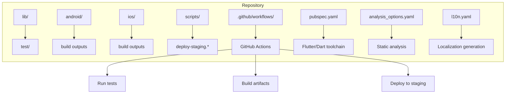
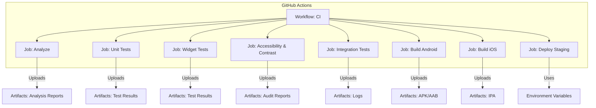
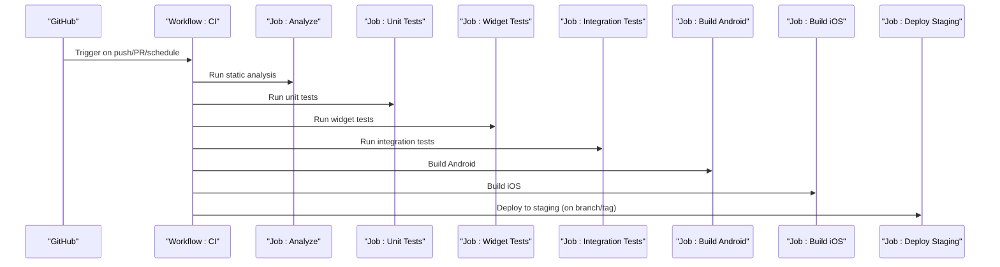
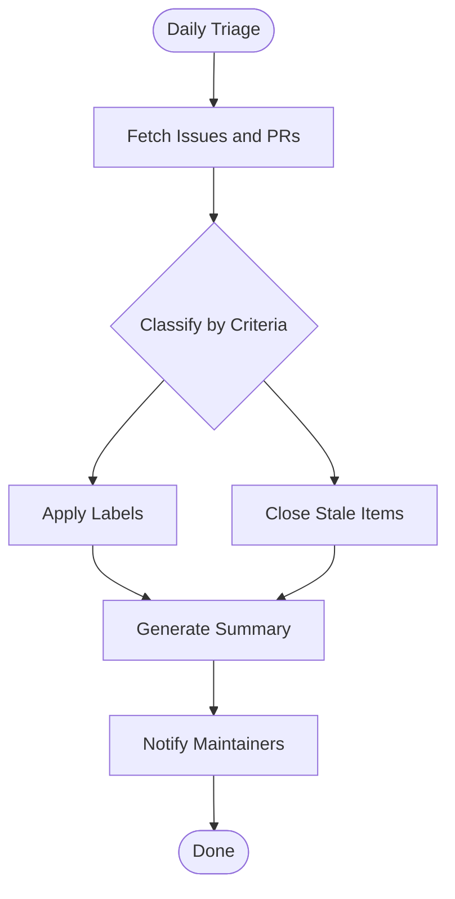
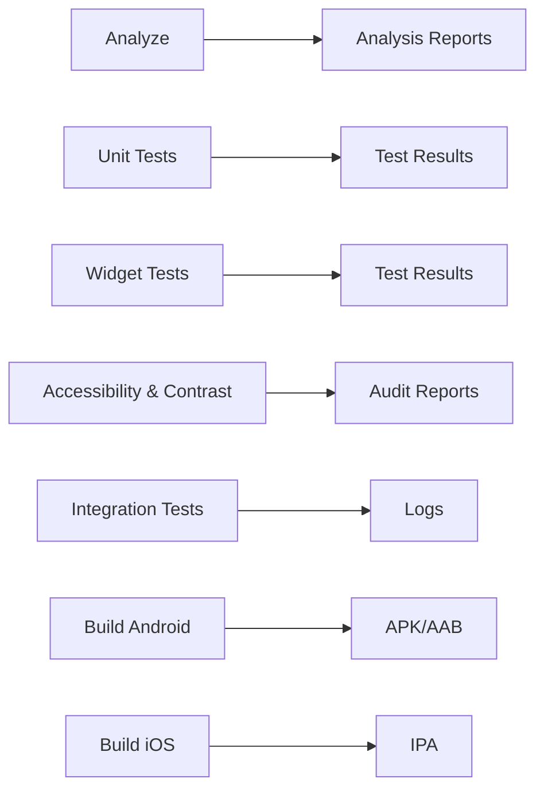
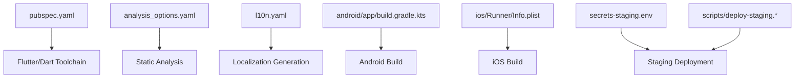

# CI/CD Pipeline

<cite>
**Referenced Files in This Document**
- [README.md](file://README.md)
- [pubspec.yaml](file://pubspec.yaml)
- [analysis_options.yaml](file://analysis_options.yaml)
- [l10n.yaml](file://l10n.yaml)
- [scripts/deploy-staging.sh](file://scripts/deploy-staging.sh)
- [scripts/deploy-staging.ps1](file://scripts/deploy-staging.ps1)
- [scripts/deploy-staging.bat](file://scripts/deploy-staging.bat)
- [secrets-staging.env](file://secrets-staging.env)
- [test/integration_test.dart](file://test/integration_test.dart)
- [test/widget_test.dart](file://test/widget_test.dart)
- [test/accessibility_test.dart](file://test/accessibility_test.dart)
- [test/contrast_audit_test.dart](file://test/contrast_audit_test.dart)
- [android/app/build.gradle.kts](file://android/app/build.gradle.kts)
- [ios/Runner/Info.plist](file://ios/Runner/Info.plist)
</cite>

## Table of Contents
1. [Introduction](#introduction)
2. [Project Structure](#project-structure)
3. [Core Components](#core-components)
4. [Architecture Overview](#architecture-overview)
5. [Detailed Component Analysis](#detailed-component-analysis)
6. [Dependency Analysis](#dependency-analysis)
7. [Performance Considerations](#performance-considerations)
8. [Troubleshooting Guide](#troubleshooting-guide)
9. [Conclusion](#conclusion)
10. [Appendices](#appendices)

## Introduction
This document describes the continuous integration and deployment (CI/CD) pipeline for a Flutter application. It explains how to structure GitHub Actions workflows for automated testing, building, and deployment; outlines daily triage automation for issue management; and details pipeline stages including code quality checks, unit tests, widget tests, integration tests, and build verification. It also provides guidance on extending the pipeline with additional jobs, custom actions, and deployment triggers, as well as monitoring, failure notifications, and debugging strategies.

## Project Structure
The repository is a multi-platform Flutter project with platform-specific directories (Android, iOS, Linux, macOS, Windows, Web), shared Dart code under lib, tests under test, and scripts under scripts. The CI/CD configuration lives in .github/workflows (not shown in the provided snapshot). The following files are relevant to configuring and running the pipeline:

- pubspec.yaml: Declares dependencies and optional test-related tooling.
- analysis_options.yaml: Configures static analysis rules used by the linter.
- l10n.yaml: Localization configuration that may be invoked during builds or tests.
- scripts/*: Cross-platform staging deployment helpers.
- secrets-staging.env: Example environment file for sensitive values consumed by deployment scripts.
- test/*: Unit, widget, accessibility, contrast audit, and integration tests executed by CI.
- android/app/build.gradle.kts and ios/Runner/Info.plist: Platform artifacts referenced by build steps.

[No sources needed since this diagram shows conceptual workflow, not actual code structure]

## Core Components
- Code Quality Checks
  - Static analysis using the analyzer configured via analysis_options.yaml.
  - Optional localization validation driven by l10n.yaml.
- Unit Tests
  - Dart unit tests under test/*.dart executed with the Dart test runner.
- Widget Tests
  - UI-focused tests under test/widget_test.dart and related files.
- Accessibility and Contrast Audits
  - Dedicated tests for accessibility and color contrast to ensure inclusive UX.
- Integration Tests
  - End-to-end flows defined under test/integration_test.dart and other integration suites.
- Build Verification
  - Android and iOS build targets validated to ensure platform compatibility.
- Deployment
  - Staging deployment orchestrated via scripts/deploy-staging.* and environment variables from secrets-staging.env.

**Section sources**
- [analysis_options.yaml](file://analysis_options.yaml)
- [l10n.yaml](file://l10n.yaml)
- [test/widget_test.dart](file://test/widget_test.dart)
- [test/accessibility_test.dart](file://test/accessibility_test.dart)
- [test/contrast_audit_test.dart](file://test/contrast_audit_test.dart)
- [test/integration_test.dart](file://test/integration_test.dart)
- [android/app/build.gradle.kts](file://android/app/build.gradle.kts)
- [ios/Runner/Info.plist](file://ios/Runner/Info.plist)
- [scripts/deploy-staging.sh](file://scripts/deploy-staging.sh)
- [scripts/deploy-staging.ps1](file://scripts/deploy-staging.ps1)
- [scripts/deploy-staging.bat](file://scripts/deploy-staging.bat)
- [secrets-staging.env](file://secrets-staging.env)

## Architecture Overview
The CI/CD architecture centers on GitHub Actions workflows that orchestrate multiple jobs across platforms. Each job runs on a dedicated runner image, installs Flutter and dependencies, executes tests, builds artifacts, and optionally deploys to staging. Artifacts are uploaded for later inspection or promotion.

[No sources needed since this diagram shows conceptual workflow, not actual code structure]

## Detailed Component Analysis

### Workflow: CI (Automated Testing, Building, Deployment)
- Triggers
  - Push to main and release branches.
  - Pull requests targeting protected branches.
  - Scheduled trigger for maintenance tasks (e.g., daily triage).
- Jobs
  - Analyze: Runs static analysis and reports results.
  - Unit Tests: Executes Dart unit tests and uploads results.
  - Widget Tests: Runs Flutter widget tests and uploads results.
  - Accessibility & Contrast: Runs accessibility and contrast audits.
  - Integration Tests: Runs integration tests against backend services.
  - Build Android: Builds Android app and uploads artifacts.
  - Build iOS: Builds iOS app and uploads artifacts.
  - Deploy Staging: Deploys to staging using environment variables.

[No sources needed since this diagram shows conceptual workflow, not actual code structure]

### Daily Triage Workflow (Issue Management and Maintenance)
- Purpose
  - Automate routine maintenance such as labeling stale issues, closing outdated PRs, and generating summaries.
- Schedule
  - Cron expression set to run daily at a consistent time.
- Steps
  - Checkout repository.
  - Fetch open issues and pull requests.
  - Apply labels based on criteria (e.g., no recent activity).
  - Post summary comment or create a report artifact.
  - Notify maintainers via status check or comment.

[No sources needed since this diagram shows conceptual workflow, not actual code structure]

### Pipeline Stages and Artifacts
- Code Quality
  - Analyzer output and any warnings/errors surfaced as job logs.
- Unit Tests
  - Test result artifacts for review and trend tracking.
- Widget Tests
  - Screenshots or logs if applicable.
- Accessibility & Contrast
  - Audit reports highlighting violations.
- Integration Tests
  - Logs and traces for failed scenarios.
- Build Verification
  - Android APK/AAB and iOS IPA artifacts attached to the workflow run.

[No sources needed since this diagram shows conceptual workflow, not actual code structure]

### Extending the Pipeline
- Additional Jobs
  - Add new jobs for linting, formatting checks, or performance profiling.
  - Introduce matrix builds for multiple Flutter versions or SDKs.
- Custom Actions
  - Create reusable actions for common setup steps (Flutter installation, dependency caching).
  - Encapsulate deployment logic into a custom action for reuse across environments.
- Deployment Triggers
  - Use tags for production releases.
  - Branch protection rules to gate deployments behind approvals.
  - Environment-specific secrets for secure credentials.

[No sources needed since this section provides general guidance]

### Monitoring, Failure Notifications, and Debugging
- Monitoring
  - Use workflow run history and artifacts to track trends.
  - Publish test coverage reports for visibility.
- Failure Notifications
  - Configure Slack or email notifications on workflow failures.
  - Post comments on PRs when tests fail.
- Debugging CI/CD Issues
  - Enable verbose logging for Flutter commands.
  - Cache dependencies to reduce flakiness and speed up runs.
  - Isolate failing jobs and reproduce locally with the same runner image.

[No sources needed since this section provides general guidance]

## Dependency Analysis
The CI/CD pipeline depends on:
- Flutter toolchain and Dart packages declared in pubspec.yaml.
- Static analysis rules in analysis_options.yaml.
- Localization configuration in l10n.yaml.
- Platform build configurations in android/app/build.gradle.kts and ios/Runner/Info.plist.
- Deployment scripts in scripts/deploy-staging.* consuming environment variables from secrets-staging.env.

**Diagram sources**
- [pubspec.yaml](file://pubspec.yaml)
- [analysis_options.yaml](file://analysis_options.yaml)
- [l10n.yaml](file://l10n.yaml)
- [android/app/build.gradle.kts](file://android/app/build.gradle.kts)
- [ios/Runner/Info.plist](file://ios/Runner/Info.plist)
- [scripts/deploy-staging.sh](file://scripts/deploy-staging.sh)
- [scripts/deploy-staging.ps1](file://scripts/deploy-staging.ps1)
- [scripts/deploy-staging.bat](file://scripts/deploy-staging.bat)
- [secrets-staging.env](file://secrets-staging.env)

**Section sources**
- [pubspec.yaml](file://pubspec.yaml)
- [analysis_options.yaml](file://analysis_options.yaml)
- [l10n.yaml](file://l10n.yaml)
- [android/app/build.gradle.kts](file://android/app/build.gradle.kts)
- [ios/Runner/Info.plist](file://ios/Runner/Info.plist)
- [scripts/deploy-staging.sh](file://scripts/deploy-staging.sh)
- [scripts/deploy-staging.ps1](file://scripts/deploy-staging.ps1)
- [scripts/deploy-staging.bat](file://scripts/deploy-staging.bat)
- [secrets-staging.env](file://secrets-staging.env)

## Performance Considerations
- Cache Flutter SDK and dependencies to accelerate subsequent runs.
- Parallelize independent jobs (unit tests, widget tests, analysis).
- Use smaller runner images where possible to reduce startup time.
- Limit artifact retention to essential outputs to save storage.
- Avoid unnecessary rebuilds by leveraging incremental builds and targeted test execution.

[No sources needed since this section provides general guidance]

## Troubleshooting Guide
Common issues and resolutions:
- Missing Dependencies
  - Ensure all required packages are listed in pubspec.yaml and cached properly.
- Flaky Tests
  - Stabilize integration tests by mocking external services or using test doubles.
- Build Failures
  - Validate platform configurations in android/app/build.gradle.kts and ios/Runner/Info.plist.
- Deployment Errors
  - Verify environment variables in secrets-staging.env and permissions for deployment targets.
- Logging and Artifacts
  - Inspect workflow logs and downloaded artifacts for detailed error context.

**Section sources**
- [pubspec.yaml](file://pubspec.yaml)
- [android/app/build.gradle.kts](file://android/app/build.gradle.kts)
- [ios/Runner/Info.plist](file://ios/Runner/Info.plist)
- [secrets-staging.env](file://secrets-staging.env)

## Conclusion
This CI/CD pipeline integrates code quality checks, comprehensive testing, build verification, and staged deployment. By structuring workflows around clear stages and leveraging artifacts and environment variables, teams can maintain high confidence in releases while automating repetitive tasks. Extensibility points allow adding new jobs, custom actions, and deployment triggers as the project evolves.

## Appendices

### Concrete Examples from the Codebase
- Test Suites
  - Widget tests: [test/widget_test.dart](file://test/widget_test.dart)
  - Accessibility tests: [test/accessibility_test.dart](file://test/accessibility_test.dart)
  - Contrast audit tests: [test/contrast_audit_test.dart](file://test/contrast_audit_test.dart)
  - Integration tests: [test/integration_test.dart](file://test/integration_test.dart)
- Build Configuration
  - Android: [android/app/build.gradle.kts](file://android/app/build.gradle.kts)
  - iOS: [ios/Runner/Info.plist](file://ios/Runner/Info.plist)
- Deployment Scripts
  - Shell: [scripts/deploy-staging.sh](file://scripts/deploy-staging.sh)
  - PowerShell: [scripts/deploy-staging.ps1](file://scripts/deploy-staging.ps1)
  - Batch: [scripts/deploy-staging.bat](file://scripts/deploy-staging.bat)
  - Environment: [secrets-staging.env](file://secrets-staging.env)
- Project Metadata
  - README: [README.md](file://README.md)
  - Dependencies: [pubspec.yaml](file://pubspec.yaml)
  - Analysis Rules: [analysis_options.yaml](file://analysis_options.yaml)
  - Localization: [l10n.yaml](file://l10n.yaml)

**Section sources**
- [test/widget_test.dart](file://test/widget_test.dart)
- [test/accessibility_test.dart](file://test/accessibility_test.dart)
- [test/contrast_audit_test.dart](file://test/contrast_audit_test.dart)
- [test/integration_test.dart](file://test/integration_test.dart)
- [android/app/build.gradle.kts](file://android/app/build.gradle.kts)
- [ios/Runner/Info.plist](file://ios/Runner/Info.plist)
- [scripts/deploy-staging.sh](file://scripts/deploy-staging.sh)
- [scripts/deploy-staging.ps1](file://scripts/deploy-staging.ps1)
- [scripts/deploy-staging.bat](file://scripts/deploy-staging.bat)
- [secrets-staging.env](file://secrets-staging.env)
- [README.md](file://README.md)
- [pubspec.yaml](file://pubspec.yaml)
- [analysis_options.yaml](file://analysis_options.yaml)
- [l10n.yaml](file://l10n.yaml)