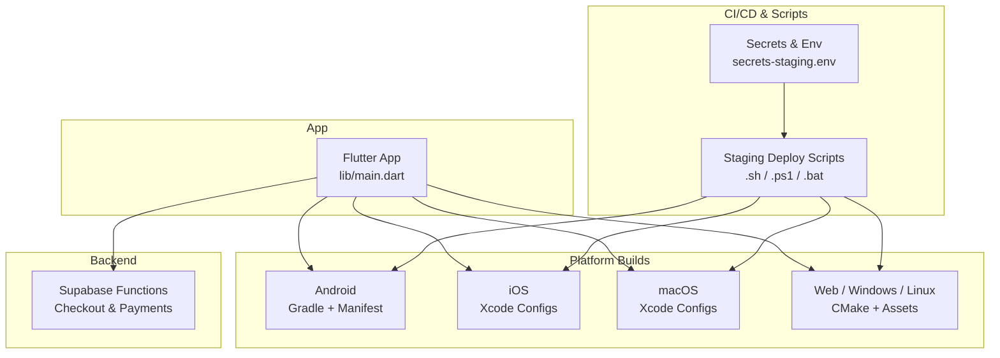
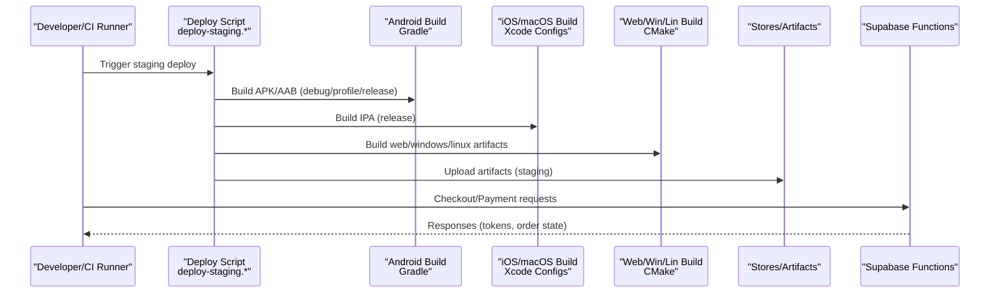
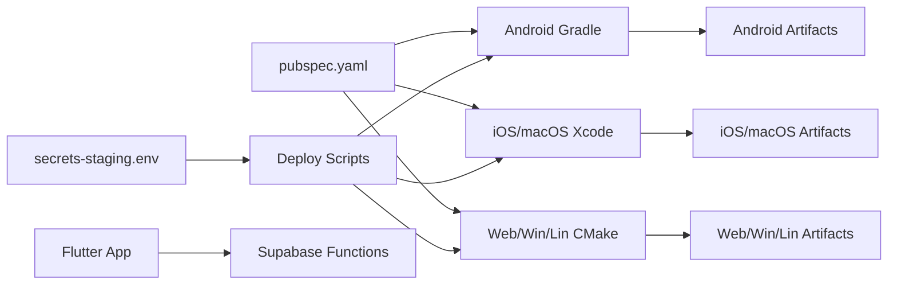

# Deployment & CI/CD

<cite>
**Referenced Files in This Document**
- [README.md](file://README.md)
- [pubspec.yaml](file://pubspec.yaml)
- [android/build.gradle.kts](file://android/build.gradle.kts)
- [android/app/build.gradle.kts](file://android/app/build.gradle.kts)
- [android/gradle.properties](file://android/gradle.properties)
- [android/settings.gradle.kts](file://android/settings.gradle.kts)
- [ios/Flutter/Release.xcconfig](file://ios/Flutter/Release.xcconfig)
- [ios/Flutter/Debug.xcconfig](file://ios/Flutter/Debug.xcconfig)
- [macos/Runner/Configs/Release.xcconfig](file://macos/Runner/Configs/Release.xcconfig)
- [macos/Runner/Configs/Debug.xcconfig](file://macos/Runner/Configs/Debug.xcconfig)
- [scripts/deploy-staging.sh](file://scripts/deploy-staging.sh)
- [scripts/deploy-staging.ps1](file://scripts/deploy-staging.ps1)
- [scripts/deploy-staging.bat](file://scripts/deploy-staging.bat)
- [secrets-staging.env](file://secrets-staging.env)
- [supabase/functions/checkout/index.ts](file://supabase/functions/checkout/index.ts)
- [supabase/functions/paymob-initiate/index.ts](file://supabase/functions/paymob-initiate/index.ts)
- [supabase/functions/paymob-payment-key/index.ts](file://supabase/functions/paymob-payment-key/index.ts)
- [lib/main.dart](file://lib/main.dart)
- [test/integration_test.dart](file://test/integration_test.dart)
</cite>

## Table of Contents
1. [Introduction](#introduction)
2. [Project Structure](#project-structure)
3. [Core Components](#core-components)
4. [Architecture Overview](#architecture-overview)
5. [Detailed Component Analysis](#detailed-component-analysis)
6. [Dependency Analysis](#dependency-analysis)
7. [Performance Considerations](#performance-considerations)
8. [Troubleshooting Guide](#troubleshooting-guide)
9. [Conclusion](#conclusion)
10. [Appendices](#appendices)

## Introduction
This document explains how to build, test, and deploy the Flutter application across Android, iOS, macOS, Web, Windows, and Linux. It covers environment management, secrets handling, release preparation, staging and production workflows, versioning, rollbacks, and monitoring. It also outlines how to set up CI/CD pipelines for automated testing and releases, including app store submissions, beta distribution, and over-the-air updates where applicable.

## Project Structure
The repository is a standard Flutter multi-platform project with platform-specific build configurations and deployment scripts:
- Platform builds are configured via Gradle (Android), Xcode configs (iOS/macOS), and CMake (Linux/Windows).
- Environment variables and secrets are managed through .env files and platform-specific configuration.
- Staging deployment automation is provided by shell, PowerShell, and batch scripts.
- Backend integrations use Supabase Functions for checkout and payment flows.

[No sources needed since this diagram shows conceptual workflow, not actual code structure]

## Core Components
- Build targets and variants:
  - Android: debug/profile/release via Gradle.
  - iOS/macOS: Debug/Release via Xcode xcconfig.
  - Web/Windows/Linux: CMake-based builds.
- Environment and secrets:
  - secrets-staging.env for staging credentials.
  - Platform-specific env injection via Flutter export and xcconfig.
- Deployment automation:
  - scripts/deploy-staging.{sh,ps1,bat} orchestrate build and upload steps.
- Backend integration:
  - Supabase Functions handle checkout and payment initiation.

**Section sources**
- [android/build.gradle.kts](file://android/build.gradle.kts)
- [android/app/build.gradle.kts](file://android/app/build.gradle.kts)
- [android/gradle.properties](file://android/gradle.properties)
- [android/settings.gradle.kts](file://android/settings.gradle.kts)
- [ios/Flutter/Release.xcconfig](file://ios/Flutter/Release.xcconfig)
- [ios/Flutter/Debug.xcconfig](file://ios/Flutter/Debug.xcconfig)
- [macos/Runner/Configs/Release.xcconfig](file://macos/Runner/Configs/Release.xcconfig)
- [macos/Runner/Configs/Debug.xcconfig](file://macos/Runner/Configs/Debug.xcconfig)
- [scripts/deploy-staging.sh](file://scripts/deploy-staging.sh)
- [scripts/deploy-staging.ps1](file://scripts/deploy-staging.ps1)
- [scripts/deploy-staging.bat](file://scripts/deploy-staging.bat)
- [secrets-staging.env](file://secrets-staging.env)
- [supabase/functions/checkout/index.ts](file://supabase/functions/checkout/index.ts)
- [supabase/functions/paymob-initiate/index.ts](file://supabase/functions/paymob-initiate/index.ts)
- [supabase/functions/paymob-payment-key/index.ts](file://supabase/functions/paymob-payment-key/index.ts)
- [lib/main.dart](file://lib/main.dart)

## Architecture Overview
End-to-end flow from developer machine or CI runner to deployed artifacts and backend services:

**Diagram sources**
- [scripts/deploy-staging.sh](file://scripts/deploy-staging.sh)
- [scripts/deploy-staging.ps1](file://scripts/deploy-staging.ps1)
- [scripts/deploy-staging.bat](file://scripts/deploy-staging.bat)
- [android/build.gradle.kts](file://android/build.gradle.kts)
- [android/app/build.gradle.kts](file://android/app/build.gradle.kts)
- [ios/Flutter/Release.xcconfig](file://ios/Flutter/Release.xcconfig)
- [macos/Runner/Configs/Release.xcconfig](file://macos/Runner/Configs/Release.xcconfig)
- [supabase/functions/checkout/index.ts](file://supabase/functions/checkout/index.ts)
- [supabase/functions/paymob-initiate/index.ts](file://supabase/functions/paymob-initiate/index.ts)

## Detailed Component Analysis

### Android Build Configuration
- Top-level Gradle and app-level Gradle define build types, signing, and packaging options.
- Gradle properties configure JVM settings and toolchain versions.
- Settings file configures Gradle plugin repositories and includes.

Key responsibilities:
- Define build variants (debug, profile, release).
- Configure signing for release builds.
- Manage dependencies and resource processing.

**Section sources**
- [android/build.gradle.kts](file://android/build.gradle.kts)
- [android/app/build.gradle.kts](file://android/app/build.gradle.kts)
- [android/gradle.properties](file://android/gradle.properties)
- [android/settings.gradle.kts](file://android/settings.gradle.kts)

### iOS/macOS Build Configuration
- Xcode xcconfig files separate Debug and Release settings.
- Release configs typically include code signing, optimization flags, and asset stripping.
- macOS shares similar structure under Runner/Configs.

Key responsibilities:
- Set build settings per variant.
- Configure entitlements and Info.plist values.
- Prepare signing identities and provisioning profiles (managed outside repo).

**Section sources**
- [ios/Flutter/Release.xcconfig](file://ios/Flutter/Release.xcconfig)
- [ios/Flutter/Debug.xcconfig](file://ios/Flutter/Debug.xcconfig)
- [macos/Runner/Configs/Release.xcconfig](file://macos/Runner/Configs/Release.xcconfig)
- [macos/Runner/Configs/Debug.xcconfig](file://macos/Runner/Configs/Debug.xcconfig)

### Web, Windows, Linux Build Configuration
- CMakeLists.txt files at root and platform runners define targets and link Flutter libraries.
- Asset bundling and icon generation are handled by Flutter tooling during build.

Key responsibilities:
- Configure native entry points and linking.
- Ensure assets and localization are included.

**Section sources**
- [linux/CMakeLists.txt](file://linux/CMakeLists.txt)
- [windows/CMakeLists.txt](file://windows/CMakeLists.txt)

### Environment Management and Secrets
- secrets-staging.env holds staging credentials used by deployment scripts and runtime.
- Flutter’s environment export mechanism injects variables into the app at build time.
- Supabase Functions rely on environment variables for API keys and tokens.

Best practices:
- Never commit secrets; use CI/CD secret stores.
- Maintain separate env files per environment (staging, production).
- Validate required variables before building.

**Section sources**
- [secrets-staging.env](file://secrets-staging.env)
- [lib/main.dart](file://lib/main.dart)
- [supabase/functions/checkout/index.ts](file://supabase/functions/checkout/index.ts)
- [supabase/functions/paymob-initiate/index.ts](file://supabase/functions/paymob-initiate/index.ts)
- [supabase/functions/paymob-payment-key/index.ts](file://supabase/functions/paymob-payment-key/index.ts)

### Staging Deployment Automation
- Shell, PowerShell, and Batch scripts provide cross-platform automation for staging deployments.
- Typical flow: load secrets, run tests, build artifacts, upload to artifact storage or stores.

Operational notes:
- Ensure executable permissions for .sh on Unix-like systems.
- Use consistent naming for artifacts and tags.
- Log outputs for traceability.

**Section sources**
- [scripts/deploy-staging.sh](file://scripts/deploy-staging.sh)
- [scripts/deploy-staging.ps1](file://scripts/deploy-staging.ps1)
- [scripts/deploy-staging.bat](file://scripts/deploy-staging.bat)

### Backend Integration (Supabase Functions)
- Checkout and payment functions implement server-side logic for order creation and payment initiation.
- These functions consume environment variables for provider keys and database access.

Integration considerations:
- Keep function code minimal and idempotent.
- Use retries and error propagation for resilience.
- Monitor logs and metrics in the hosting platform.

**Section sources**
- [supabase/functions/checkout/index.ts](file://supabase/functions/checkout/index.ts)
- [supabase/functions/paymob-initiate/index.ts](file://supabase/functions/paymob-initiate/index.ts)
- [supabase/functions/paymob-payment-key/index.ts](file://supabase/functions/paymob-payment-key/index.ts)

### Versioning and Release Preparation
- Application metadata and dependencies are declared in pubspec.yaml.
- For app stores, ensure version codes and bundle identifiers are aligned with platform configs.
- Tag releases consistently and generate changelogs.

Guidelines:
- Increment version numbers following semantic versioning.
- Validate all environments before promoting to production.
- Archive build artifacts with checksums.

**Section sources**
- [pubspec.yaml](file://pubspec.yaml)

### Automated Testing
- Integration tests exercise end-to-end flows such as checkout and payments.
- Unit and widget tests validate feature logic and UI behavior.

CI recommendations:
- Run unit/widget tests on every PR.
- Execute integration tests against staging endpoints.
- Publish test reports and artifacts.

**Section sources**
- [test/integration_test.dart](file://test/integration_test.dart)

## Dependency Analysis
Build-time and runtime dependencies span Flutter packages, platform SDKs, and backend services. The following diagram highlights key relationships relevant to deployment:

**Diagram sources**
- [pubspec.yaml](file://pubspec.yaml)
- [android/build.gradle.kts](file://android/build.gradle.kts)
- [ios/Flutter/Release.xcconfig](file://ios/Flutter/Release.xcconfig)
- [macos/Runner/Configs/Release.xcconfig](file://macos/Runner/Configs/Release.xcconfig)
- [scripts/deploy-staging.sh](file://scripts/deploy-staging.sh)
- [secrets-staging.env](file://secrets-staging.env)
- [supabase/functions/checkout/index.ts](file://supabase/functions/checkout/index.ts)

**Section sources**
- [pubspec.yaml](file://pubspec.yaml)
- [android/build.gradle.kts](file://android/build.gradle.kts)
- [ios/Flutter/Release.xcconfig](file://ios/Flutter/Release.xcconfig)
- [macos/Runner/Configs/Release.xcconfig](file://macos/Runner/Configs/Release.xcconfig)
- [scripts/deploy-staging.sh](file://scripts/deploy-staging.sh)
- [secrets-staging.env](file://secrets-staging.env)
- [supabase/functions/checkout/index.ts](file://supabase/functions/checkout/index.ts)

## Performance Considerations
- Enable R8/ProGuard for Android release builds to reduce size and improve startup.
- Use iOS/macOS Release xcconfig optimizations and strip symbols appropriately.
- Cache dependencies in CI to speed up builds.
- Split large assets and lazy-load heavy features.
- Profile network calls to Supabase Functions; consider caching strategies and pagination.

[No sources needed since this section provides general guidance]

## Troubleshooting Guide
Common issues and resolutions:
- Missing secrets: Ensure secrets-staging.env is present locally and CI secrets are configured.
- Signing failures: Verify signing keys and provisioning profiles for iOS/macOS; check Android keystore paths.
- Build environment mismatches: Align Gradle wrapper, JDK, and Xcode versions with CI.
- Function errors: Check Supabase logs for checkout/payment functions and validate environment variables.

Validation checklist:
- Run local builds for all platforms before pushing changes.
- Execute integration tests against staging endpoints.
- Inspect generated artifacts for correct versioning and signatures.

**Section sources**
- [secrets-staging.env](file://secrets-staging.env)
- [scripts/deploy-staging.sh](file://scripts/deploy-staging.sh)
- [scripts/deploy-staging.ps1](file://scripts/deploy-staging.ps1)
- [scripts/deploy-staging.bat](file://scripts/deploy-staging.bat)
- [supabase/functions/checkout/index.ts](file://supabase/functions/checkout/index.ts)
- [supabase/functions/paymob-initiate/index.ts](file://supabase/functions/paymob-initiate/index.ts)

## Conclusion
This guide consolidates the build, environment, and deployment setup for the Flutter app across platforms. By leveraging the provided scripts, environment files, and platform configurations, teams can automate staging deployments, prepare production releases, and maintain reliable CI/CD pipelines. Adopting the recommended practices for secrets management, versioning, testing, and monitoring will improve stability and speed of delivery.

[No sources needed since this section summarizes without analyzing specific files]

## Appendices

### CI/CD Pipeline Setup Guidelines
- Choose a CI provider (GitHub Actions, GitLab CI, etc.).
- Define jobs for:
  - Install dependencies and cache.
  - Lint and static analysis.
  - Unit and widget tests.
  - Integration tests against staging.
  - Build artifacts for each platform.
  - Upload artifacts and trigger staging deployment.
- Securely store secrets in the CI provider’s secret manager.
- Use matrix builds for multiple platforms and variants.

[No sources needed since this section provides general guidance]

### App Store Submission and Beta Distribution
- Android: Generate signed AAB/APK and upload to Google Play Console (internal testing or closed track).
- iOS/macOS: Archive and distribute via TestFlight or App Store Connect.
- Web: Host artifacts on a CDN or static hosting service.
- Windows/Linux: Package installers and publish to appropriate channels.

[No sources needed since this section provides general guidance]

### Over-the-Air Updates
- Consider solutions like CodePush or Expo Updates if applicable to your architecture.
- Ensure update policies align with app store guidelines.
- Implement rollback mechanisms and feature flags.

[No sources needed since this section provides general guidance]

### Monitoring Deployment Health
- Instrument crash reporting and analytics in the app.
- Monitor Supabase Functions logs and metrics.
- Set up alerts for build and deployment failures.
- Track performance metrics post-release.

[No sources needed since this section provides general guidance]