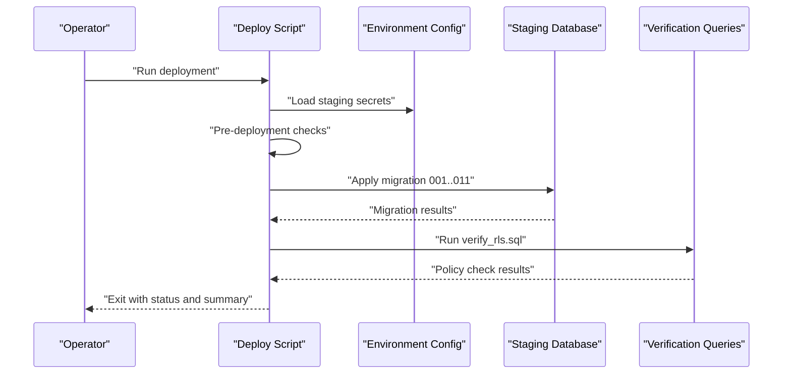
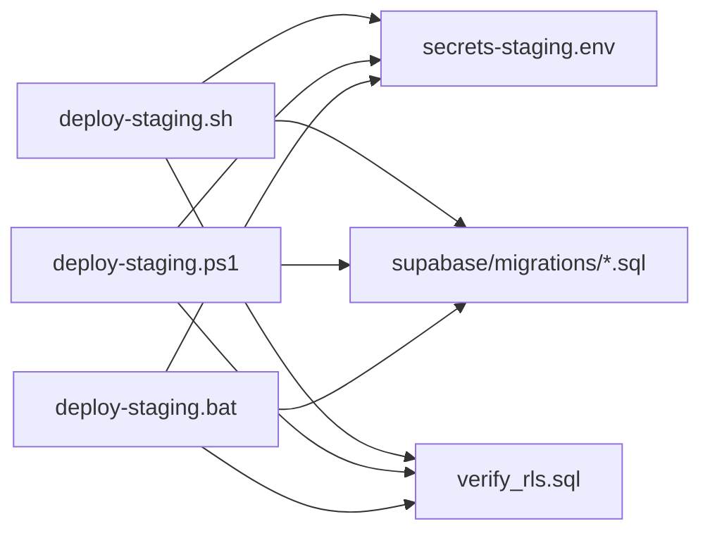

# Deployment Scripts

<cite>
**Referenced Files in This Document**
- [deploy-staging.sh](file://scripts/deploy-staging.sh)
- [deploy-staging.ps1](file://scripts/deploy-staging.ps1)
- [deploy-staging.bat](file://scripts/deploy-staging.bat)
- [001_initial_schema.sql](file://supabase/migrations/001_initial_schema.sql)
- [002_rls_policies.sql](file://supabase/migrations/002_rls_policies.sql)
- [003_auth_profiles_and_hardening.sql](file://supabase/migrations/003_auth_profiles_and_hardening.sql)
- [004_stock_function.sql](file://supabase/migrations/004_stock_function.sql)
- [005_storage_buckets.sql](file://supabase/migrations/005_storage_buckets.sql)
- [006_payments_table.sql](file://supabase/migrations/006_payments_table.sql)
- [007_stock_increment_function.sql](file://supabase/migrations/007_stock_increment_function.sql)
- [008_order_fulfillment.sql](file://supabase/migrations/008_order_fulfillment.sql)
- [009_shipping_zones.sql](file://supabase/migrations/009_shipping_zones.sql)
- [010_notifications_analytics.sql](file://supabase/migrations/010_notifications_analytics.sql)
- [011_orders_idempotency_and_expiry.sql](file://supabase/migrations/011_orders_idempotency_and_expiry.sql)
- [verify_rls.sql](file://supabase/migrations/verify_rls.sql)
- [secrets-staging.env](file://secrets-staging.env)
</cite>

## Table of Contents
1. [Introduction](#introduction)
2. [Project Structure](#project-structure)
3. [Core Components](#core-components)
4. [Architecture Overview](#architecture-overview)
5. [Detailed Component Analysis](#detailed-component-analysis)
6. [Dependency Analysis](#dependency-analysis)
7. [Performance Considerations](#performance-considerations)
8. [Troubleshooting Guide](#troubleshooting-guide)
9. [Conclusion](#conclusion)
10. [Appendices](#appendices)

## Introduction
This document provides comprehensive documentation for deployment automation scripts and database migration workflows used to deploy the application to a staging environment across multiple operating systems. It covers:
- Staging deployment scripts for Linux/macOS (shell), Windows PowerShell, and Windows batch
- Database migration execution and verification
- Usage patterns, parameters, error handling, pre-deployment checks, post-deployment verification, and rollback procedures
- Cross-platform compatibility considerations and troubleshooting guidance

The goal is to enable consistent, repeatable, and safe deployments with clear operational runbooks.

## Project Structure
The repository includes:
- Deployment automation scripts under scripts/
- Database migrations under supabase/migrations/
- A staging secrets file at the repository root

```mermaid
graph TB
subgraph "Deployment Scripts"
SH["scripts/deploy-staging.sh"]
PS["scripts/deploy-staging.ps1"]
BAT["scripts/deploy-staging.bat"]
end
subgraph "Database Migrations"
M001["supabase/migrations/001_initial_schema.sql"]
M002["supabase/migrations/002_rls_policies.sql"]
M003["supabase/migrations/003_auth_profiles_and_hardening.sql"]
M004["supabase/migrations/004_stock_function.sql"]
M005["supabase/migrations/005_storage_buckets.sql"]
M006["supabase/migrations/006_payments_table.sql"]
M007["supabase/migrations/007_stock_increment_function.sql"]
M008["supabase/migrations/008_order_fulfillment.sql"]
M009["supabase/migrations/009_shipping_zones.sql"]
M010["supabase/migrations/010_notifications_analytics.sql"]
M011["supabase/migrations/011_orders_idempotency_and_expiry.sql"]
VR["supabase/migrations/verify_rls.sql"]
end
subgraph "Configuration"
ENV["secrets-staging.env"]
end
SH --> ENV
PS --> ENV
BAT --> ENV
SH --> M001
SH --> M002
SH --> M003
SH --> M004
SH --> M005
SH --> M006
SH --> M007
SH --> M008
SH --> M009
SH --> M010
SH --> M011
SH --> VR
PS --> M001
PS --> M002
PS --> M003
PS --> M004
PS --> M005
PS --> M006
PS --> M007
PS --> M008
PS --> M009
PS --> M010
PS --> M011
PS --> VR
BAT --> M001
BAT --> M002
BAT --> M003
BAT --> M004
BAT --> M005
BAT --> M006
BAT --> M007
BAT --> M008
BAT --> M009
BAT --> M010
BAT --> M011
BAT --> VR
```

**Diagram sources**
- [deploy-staging.sh](file://scripts/deploy-staging.sh)
- [deploy-staging.ps1](file://scripts/deploy-staging.ps1)
- [deploy-staging.bat](file://scripts/deploy-staging.bat)
- [001_initial_schema.sql](file://supabase/migrations/001_initial_schema.sql)
- [002_rls_policies.sql](file://supabase/migrations/002_rls_policies.sql)
- [003_auth_profiles_and_hardening.sql](file://supabase/migrations/003_auth_profiles_and_hardening.sql)
- [004_stock_function.sql](file://supabase/migrations/004_stock_function.sql)
- [005_storage_buckets.sql](file://supabase/migrations/005_storage_buckets.sql)
- [006_payments_table.sql](file://supabase/migrations/006_payments_table.sql)
- [007_stock_increment_function.sql](file://supabase/migrations/007_stock_increment_function.sql)
- [008_order_fulfillment.sql](file://supabase/migrations/008_order_fulfillment.sql)
- [009_shipping_zones.sql](file://supabase/migrations/009_shipping_zones.sql)
- [010_notifications_analytics.sql](file://supabase/migrations/010_notifications_analytics.sql)
- [011_orders_idempotency_and_expiry.sql](file://supabase/migrations/011_orders_idempotency_and_expiry.sql)
- [verify_rls.sql](file://supabase/migrations/verify_rls.sql)
- [secrets-staging.env](file://secrets-staging.env)

**Section sources**
- [deploy-staging.sh](file://scripts/deploy-staging.sh)
- [deploy-staging.ps1](file://scripts/deploy-staging.ps1)
- [deploy-staging.bat](file://scripts/deploy-staging.bat)
- [secrets-staging.env](file://secrets-staging.env)

## Core Components
- Staging deployment scripts:
  - Shell script for Linux/macOS
  - PowerShell script for Windows
  - Batch script for Windows CMD
- Database migrations:
  - Sequential SQL migration files under supabase/migrations/
  - Verification script for Row-Level Security policies
- Configuration:
  - Environment variables for staging credentials and endpoints

These components work together to:
- Validate prerequisites and configuration
- Apply database migrations in order
- Verify schema and security policies
- Report success or failure with actionable diagnostics

**Section sources**
- [deploy-staging.sh](file://scripts/deploy-staging.sh)
- [deploy-staging.ps1](file://scripts/deploy-staging.ps1)
- [deploy-staging.bat](file://scripts/deploy-staging.bat)
- [001_initial_schema.sql](file://supabase/migrations/001_initial_schema.sql)
- [verify_rls.sql](file://supabase/migrations/verify_rls.sql)
- [secrets-staging.env](file://secrets-staging.env)

## Architecture Overview
The staging deployment process follows a linear flow:
1. Load environment configuration
2. Perform pre-deployment checks (dependencies, connectivity)
3. Execute database migrations in versioned order
4. Run verification queries against the schema and policies
5. Summarize results and exit with appropriate status code

[No sources needed since this diagram shows conceptual workflow, not actual code structure]

## Detailed Component Analysis

### Staging Deployment Scripts
The repository provides three cross-platform entry points for staging deployments:
- Shell script (Linux/macOS)
- PowerShell script (Windows)
- Batch script (Windows CMD)

Key responsibilities:
- Parse command-line arguments and flags
- Load environment variables from the staging secrets file
- Validate required tools and connectivity
- Execute database migrations in order
- Run verification steps
- Provide structured output and non-zero exit codes on failure

Usage patterns:
- Interactive mode: prompts for missing inputs
- Non-interactive mode: requires all parameters via flags or environment variables
- Dry-run mode: validates configuration without applying changes

Parameters:
- Target environment selection (staging)
- Database connection details (host, port, user, password, database name)
- Migration directory path
- Optional feature toggles (e.g., skip verification, force apply)

Error handling:
- Fail-fast on missing dependencies or invalid configuration
- Capture and report per-migration errors
- Rollback strategy guidance when applicable

Cross-platform notes:
- Path separators and quoting differ between shells and PowerShell
- Command availability varies by platform; scripts should detect and fail early if required tools are missing

**Section sources**
- [deploy-staging.sh](file://scripts/deploy-staging.sh)
- [deploy-staging.ps1](file://scripts/deploy-staging.ps1)
- [deploy-staging.bat](file://scripts/deploy-staging.bat)

### Database Migrations
Migrations are organized as sequential SQL files under supabase/migrations/. The naming convention uses zero-padded prefixes to enforce ordering.

Execution approach:
- Apply migrations in ascending numeric order
- Each migration should be idempotent where possible
- Use transactions to ensure atomicity per migration
- Log start/end timestamps and any errors

Verification:
- After applying migrations, run verification scripts to assert schema integrity and policy correctness
- The provided verification script focuses on Row-Level Security policies

Rollback:
- Maintain reverse migrations or documented manual steps for critical changes
- Prefer additive-only migrations in CI/CD pipelines; handle destructive changes manually with caution

Examples of migration files:
- Initial schema creation
- RLS policies and hardening
- Feature-specific tables and functions
- Analytics and notifications enhancements
- Order fulfillment and idempotency improvements

**Section sources**
- [001_initial_schema.sql](file://supabase/migrations/001_initial_schema.sql)
- [002_rls_policies.sql](file://supabase/migrations/002_rls_policies.sql)
- [003_auth_profiles_and_hardening.sql](file://supabase/migrations/003_auth_profiles_and_hardening.sql)
- [004_stock_function.sql](file://supabase/migrations/004_stock_function.sql)
- [005_storage_buckets.sql](file://supabase/migrations/005_storage_buckets.sql)
- [006_payments_table.sql](file://supabase/migrations/006_payments_table.sql)
- [007_stock_increment_function.sql](file://supabase/migrations/007_stock_increment_function.sql)
- [008_order_fulfillment.sql](file://supabase/migrations/008_order_fulfillment.sql)
- [009_shipping_zones.sql](file://supabase/migrations/009_shipping_zones.sql)
- [010_notifications_analytics.sql](file://supabase/migrations/010_notifications_analytics.sql)
- [011_orders_idempotency_and_expiry.sql](file://supabase/migrations/011_orders_idempotency_and_expiry.sql)
- [verify_rls.sql](file://supabase/migrations/verify_rls.sql)

### Configuration and Secrets
Staging configuration is loaded from a dedicated environment file. This file contains sensitive values such as database host, port, user, password, and project identifiers.

Best practices:
- Never commit secrets to version control
- Use secure secret management solutions in CI/CD
- Validate presence and format of required variables before proceeding
- Mask sensitive values in logs

**Section sources**
- [secrets-staging.env](file://secrets-staging.env)

## Dependency Analysis
The deployment scripts depend on:
- External CLI tools (e.g., database client utilities)
- The staging environment configuration file
- The ordered set of migration SQL files
- Verification SQL scripts

**Diagram sources**
- [deploy-staging.sh](file://scripts/deploy-staging.sh)
- [deploy-staging.ps1](file://scripts/deploy-staging.ps1)
- [deploy-staging.bat](file://scripts/deploy-staging.bat)
- [secrets-staging.env](file://secrets-staging.env)
- [verify_rls.sql](file://supabase/migrations/verify_rls.sql)

**Section sources**
- [deploy-staging.sh](file://scripts/deploy-staging.sh)
- [deploy-staging.ps1](file://scripts/deploy-staging.ps1)
- [deploy-staging.bat](file://scripts/deploy-staging.bat)
- [secrets-staging.env](file://secrets-staging.env)
- [verify_rls.sql](file://supabase/migrations/verify_rls.sql)

## Performance Considerations
- Minimize network round-trips by batching operations where safe
- Avoid unnecessary re-applications by checking migration state
- Use connection pooling and keep-alives for database clients
- Parallelize independent tasks only if they do not conflict with database writes
- Keep migration files small and focused to reduce lock contention

[No sources needed since this section provides general guidance]

## Troubleshooting Guide
Common issues and resolutions:
- Missing dependencies: Ensure required CLI tools are installed and available in PATH
- Invalid configuration: Validate environment variables and file paths
- Connectivity failures: Check firewall rules, DNS resolution, and credentials
- Migration errors: Review last applied migration and error logs; consider rolling back to a known good state
- Policy verification failures: Inspect RLS policy definitions and test with representative users

Operational tips:
- Enable verbose logging during initial runs
- Record baseline schema snapshots before major changes
- Use dry-run modes to validate commands without side effects
- Maintain a rollback checklist for destructive migrations

**Section sources**
- [deploy-staging.sh](file://scripts/deploy-staging.sh)
- [deploy-staging.ps1](file://scripts/deploy-staging.ps1)
- [deploy-staging.bat](file://scripts/deploy-staging.bat)
- [verify_rls.sql](file://supabase/migrations/verify_rls.sql)

## Conclusion
The staging deployment automation provides a consistent, cross-platform approach to applying database migrations and verifying schema integrity. By following the usage patterns, parameter conventions, and error handling strategies outlined here, operators can perform reliable deployments with clear diagnostics and safe rollback procedures.

[No sources needed since this section summarizes without analyzing specific files]

## Appendices

### Execution Examples
- Linux/macOS shell:
  - Invoke the shell script with required flags or environment variables
  - Example invocation pattern: run the script with target environment and connection parameters
- Windows PowerShell:
  - Invoke the PowerShell script with parameters or load secrets into session variables
  - Example invocation pattern: call the script with explicit connection details
- Windows batch:
  - Call the batch file with parameters or set environment variables beforehand
  - Example invocation pattern: pass connection details as arguments

Note: Replace placeholders with actual values from your staging configuration.

**Section sources**
- [deploy-staging.sh](file://scripts/deploy-staging.sh)
- [deploy-staging.ps1](file://scripts/deploy-staging.ps1)
- [deploy-staging.bat](file://scripts/deploy-staging.bat)
- [secrets-staging.env](file://secrets-staging.env)

### Pre-deployment Checklist
- Confirm access to staging database and required ports
- Validate secrets file presence and permissions
- Ensure CLI tools are installed and reachable
- Back up current schema if performing destructive changes

**Section sources**
- [deploy-staging.sh](file://scripts/deploy-staging.sh)
- [deploy-staging.ps1](file://scripts/deploy-staging.ps1)
- [deploy-staging.bat](file://scripts/deploy-staging.bat)
- [secrets-staging.env](file://secrets-staging.env)

### Post-deployment Verification
- Run verification queries to confirm schema and policies
- Smoke-test core application flows against staging
- Monitor logs for anomalies after deployment

**Section sources**
- [verify_rls.sql](file://supabase/migrations/verify_rls.sql)

### Rollback Procedures
- Identify the last successful migration
- Apply reverse migrations or restore from backup
- Re-run verification to ensure consistency
- Communicate rollback outcome and next steps

**Section sources**
- [deploy-staging.sh](file://scripts/deploy-staging.sh)
- [deploy-staging.ps1](file://scripts/deploy-staging.ps1)
- [deploy-staging.bat](file://scripts/deploy-staging.bat)