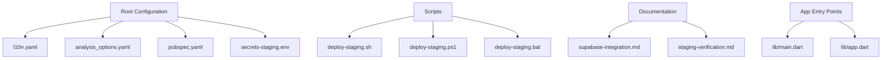
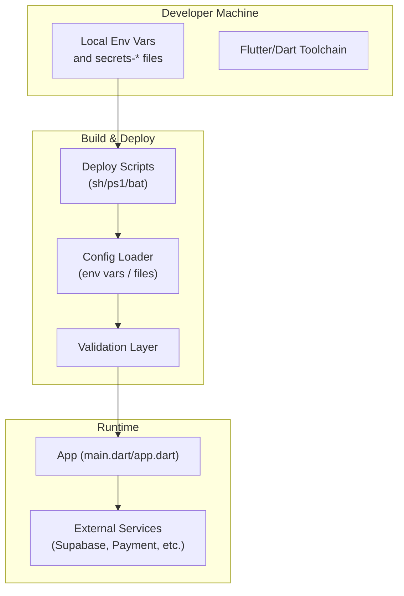
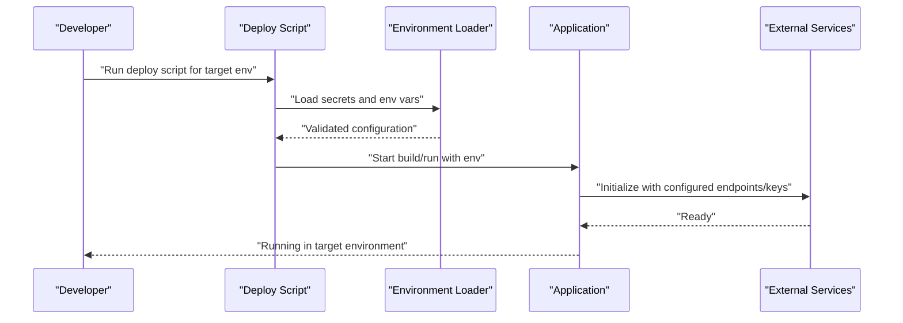
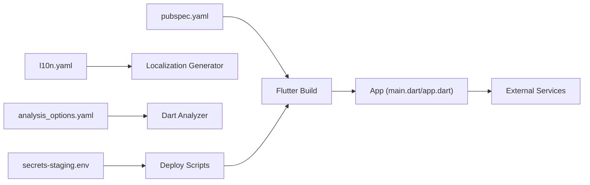

# Environment Management

<cite>
**Referenced Files in This Document**
- [secrets-staging.env](file://secrets-staging.env)
- [l10n.yaml](file://l10n.yaml)
- [analysis_options.yaml](file://analysis_options.yaml)
- [pubspec.yaml](file://pubspec.yaml)
- [main.dart](file://lib/main.dart)
- [app.dart](file://lib/app.dart)
- [deploy-staging.sh](file://scripts/deploy-staging.sh)
- [deploy-staging.ps1](file://scripts/deploy-staging.ps1)
- [deploy-staging.bat](file://scripts/deploy-staging.bat)
- [supabase-integration.md](file://docs/supabase-integration.md)
- [staging-verification.md](file://docs/staging-verification.md)
</cite>

## Table of Contents
1. [Introduction](#introduction)
2. [Project Structure](#project-structure)
3. [Core Components](#core-components)
4. [Architecture Overview](#architecture-overview)
5. [Detailed Component Analysis](#detailed-component-analysis)
6. [Dependency Analysis](#dependency-analysis)
7. [Performance Considerations](#performance-considerations)
8. [Troubleshooting Guide](#troubleshooting-guide)
9. [Conclusion](#conclusion)
10. [Appendices](#appendices)

## Introduction
This document explains how environment management and configuration are organized in the project, focusing on:
- Managing secrets and environment-specific values using secrets-staging.env and related files
- Setting up distinct environments (development, staging, production) with clear separation of concerns
- Configuring localization via l10n.yaml
- Configuring static analysis options via analysis_options.yaml
- Handling sensitive data, API keys, and service credentials securely
- Switching environments during development and deployment

The goal is to provide a practical guide for developers and CI/CD operators to configure, validate, and switch environments safely and consistently.

## Project Structure
Environment-related configuration spans several areas:
- Root-level configuration files for tooling and localization
- Secrets file for environment variables
- Scripts for deploying to specific environments
- Documentation describing integration points and verification steps

**Diagram sources**
- [l10n.yaml](file://l10n.yaml)
- [analysis_options.yaml](file://analysis_options.yaml)
- [pubspec.yaml](file://pubspec.yaml)
- [secrets-staging.env](file://secrets-staging.env)
- [deploy-staging.sh](file://scripts/deploy-staging.sh)
- [deploy-staging.ps1](file://scripts/deploy-staging.ps1)
- [deploy-staging.bat](file://scripts/deploy-staging.bat)
- [supabase-integration.md](file://docs/supabase-integration.md)
- [staging-verification.md](file://docs/staging-verification.md)
- [main.dart](file://lib/main.dart)
- [app.dart](file://lib/app.dart)

**Section sources**
- [l10n.yaml](file://l10n.yaml)
- [analysis_options.yaml](file://analysis_options.yaml)
- [pubspec.yaml](file://pubspec.yaml)
- [secrets-staging.env](file://secrets-staging.env)
- [deploy-staging.sh](file://scripts/deploy-staging.sh)
- [deploy-staging.ps1](file://scripts/deploy-staging.ps1)
- [deploy-staging.bat](file://scripts/deploy-staging.bat)
- [supabase-integration.md](file://docs/supabase-integration.md)
- [staging-verification.md](file://docs/staging-verification.md)
- [main.dart](file://lib/main.dart)
- [app.dart](file://lib/app.dart)

## Core Components
- secrets-staging.env: Holds environment-specific secrets and configuration values used by the app and scripts.
- l10n.yaml: Defines localization generation settings such as input/output paths and supported locales.
- analysis_options.yaml: Configures Dart analyzer rules and linting behavior.
- pubspec.yaml: Declares dependencies and may include build-time flags or asset references relevant to environments.
- Deployment scripts: Provide environment-targeted build and deploy workflows.
- App entry points: Initialize the application and can read environment-driven configuration at runtime.

Best practices applied:
- Keep secrets out of version control; use .gitignore to exclude sensitive files.
- Use separate secret files per environment (e.g., secrets-dev.env, secrets-staging.env, secrets-prod.env).
- Validate required environment variables before running or building.
- Centralize environment switching in scripts to reduce manual errors.

**Section sources**
- [secrets-staging.env](file://secrets-staging.env)
- [l10n.yaml](file://l10n.yaml)
- [analysis_options.yaml](file://analysis_options.yaml)
- [pubspec.yaml](file://pubspec.yaml)
- [deploy-staging.sh](file://scripts/deploy-staging.sh)
- [deploy-staging.ps1](file://scripts/deploy-staging.ps1)
- [deploy-staging.bat](file://scripts/deploy-staging.bat)
- [main.dart](file://lib/main.dart)
- [app.dart](file://lib/app.dart)

## Architecture Overview
The environment architecture separates configuration from code and enforces security through explicit loading and validation.

Key responsibilities:
- Scripts ensure the correct environment is targeted and inject environment variables into the build/run process.
- The loader reads secrets and configuration from environment variables and/or files.
- The validator checks that all required keys exist and conform to expected formats.
- The app consumes validated configuration to initialize services.

[No sources needed since this diagram shows conceptual workflow, not actual code structure]

## Detailed Component Analysis

### Environment Variables and Secrets Management
- secrets-staging.env contains staging-specific secrets and configuration values.
- Recommended pattern:
  - Create environment-specific files: secrets-dev.env, secrets-staging.env, secrets-prod.env.
  - Add secrets files to .gitignore to prevent accidental commits.
  - Load variables via your language’s environment utilities or a dedicated config module.
  - Validate presence and format of critical keys before starting the app.

Security best practices:
- Never hardcode secrets in source code.
- Use platform-native mechanisms where possible (e.g., keychain, keystore, OS keyrings).
- Rotate secrets regularly and limit access to authorized personnel.
- In CI/CD, inject secrets via secure vaults or provider-specific secret managers.

Operational guidance:
- For local development, load secrets from a local file and export them to the shell session.
- For CI/CD, pass secrets as environment variables provided by the pipeline.
- For mobile platforms, consider injecting values at build time via platform-specific configurations when appropriate.

**Section sources**
- [secrets-staging.env](file://secrets-staging.env)

### Localization Configuration (l10n.yaml)
- l10n.yaml defines how Flutter generates localized strings and ARB processing.
- Typical responsibilities:
  - Specify input ARB directory and output Dart classes.
  - Define supported locales and arb file naming conventions.
  - Configure formatting and fallback behaviors.

Usage tips:
- Keep locale resources under a dedicated directory (e.g., l10n/).
- Ensure each supported locale has a corresponding ARB file.
- Regenerate localization artifacts after modifying ARB files.

**Section sources**
- [l10n.yaml](file://l10n.yaml)

### Static Analysis Options (analysis_options.yaml)
- analysis_options.yaml configures the Dart analyzer and lint rules.
- Responsibilities:
  - Enable/disable specific lints.
  - Enforce style and quality standards across the codebase.
  - Tailor rules per environment if necessary (e.g., stricter rules in CI).

Usage tips:
- Maintain a baseline set of rules for consistency.
- Override selectively for specific packages or directories when justified.
- Integrate lint checks into pre-commit hooks and CI pipelines.

**Section sources**
- [analysis_options.yaml](file://analysis_options.yaml)

### Build-Time and Runtime Configuration Integration
- pubspec.yaml declares dependencies and assets; it may also reference environment-sensitive assets or build flags depending on the setup.
- App entry points (main.dart, app.dart) initialize the application and should consume validated configuration.

Integration patterns:
- Read environment variables at startup and map them to typed configuration objects.
- Fail fast if required configuration is missing or invalid.
- Separate configuration loading from business logic to keep components testable.

**Section sources**
- [pubspec.yaml](file://pubspec.yaml)
- [main.dart](file://lib/main.dart)
- [app.dart](file://lib/app.dart)

### Deployment Scripts and Environment Switching
- deploy-staging.sh, deploy-staging.ps1, deploy-staging.bat provide cross-platform scripts to target staging.
- Responsibilities:
  - Select the correct environment (dev/staging/prod).
  - Load the appropriate secrets file or environment variables.
  - Run builds and deployments with environment-specific flags.

Environment switching flow:

**Diagram sources**
- [deploy-staging.sh](file://scripts/deploy-staging.sh)
- [deploy-staging.ps1](file://scripts/deploy-staging.ps1)
- [deploy-staging.bat](file://scripts/deploy-staging.bat)

**Section sources**
- [deploy-staging.sh](file://scripts/deploy-staging.sh)
- [deploy-staging.ps1](file://scripts/deploy-staging.ps1)
- [deploy-staging.bat](file://scripts/deploy-staging.bat)

### Service Integrations and Credentials
- Supabase integration details and verification procedures are documented to guide environment-specific setup.
- Guidance:
  - Store Supabase URL and anon/public keys in environment variables.
  - Validate connectivity during startup or health checks.
  - Use different projects or instances for dev/staging/prod.

Verification steps:
- Confirm endpoints resolve correctly in each environment.
- Test authentication flows and permissions.
- Record known working values in environment documentation (not in code).

**Section sources**
- [supabase-integration.md](file://docs/supabase-integration.md)
- [staging-verification.md](file://docs/staging-verification.md)

## Dependency Analysis
Configuration dependencies across the system:

Observations:
- Secrets influence both build-time and runtime behavior.
- Localization and analysis are tooling concerns but affect developer experience and CI outcomes.
- pubspec.yaml ties dependencies and assets to the build process.

**Diagram sources**
- [secrets-staging.env](file://secrets-staging.env)
- [l10n.yaml](file://l10n.yaml)
- [analysis_options.yaml](file://analysis_options.yaml)
- [pubspec.yaml](file://pubspec.yaml)
- [deploy-staging.sh](file://scripts/deploy-staging.sh)
- [deploy-staging.ps1](file://scripts/deploy-staging.ps1)
- [deploy-staging.bat](file://scripts/deploy-staging.bat)
- [main.dart](file://lib/main.dart)
- [app.dart](file://lib/app.dart)

**Section sources**
- [secrets-staging.env](file://secrets-staging.env)
- [l10n.yaml](file://l10n.yaml)
- [analysis_options.yaml](file://analysis_options.yaml)
- [pubspec.yaml](file://pubspec.yaml)
- [deploy-staging.sh](file://scripts/deploy-staging.sh)
- [deploy-staging.ps1](file://scripts/deploy-staging.ps1)
- [deploy-staging.bat](file://scripts/deploy-staging.bat)
- [main.dart](file://lib/main.dart)
- [app.dart](file://lib/app.dart)

## Performance Considerations
- Avoid reading large configuration files repeatedly; cache parsed configuration at startup.
- Defer non-critical initialization until after core services are ready.
- Use environment-specific feature flags to disable heavy features in dev/staging if needed.
- Keep secrets minimal and scoped to what each component requires.

[No sources needed since this section provides general guidance]

## Troubleshooting Guide
Common issues and resolutions:
- Missing environment variables:
  - Ensure the correct secrets file is loaded for the target environment.
  - Verify variable names match those expected by the app.
- Invalid endpoint URLs or keys:
  - Cross-check values against service dashboards.
  - Use health checks to detect misconfiguration early.
- Localization not updating:
  - Regenerate localization artifacts after editing ARB files.
  - Confirm l10n.yaml paths and locale list are correct.
- Analysis failures:
  - Review analysis_options.yaml changes and run the analyzer locally before committing.

Operational checks:
- Validate required keys at startup and fail fast with clear messages.
- Log environment metadata (without secrets) to aid debugging.
- Use staging verification docs to confirm integrations behave as expected.

**Section sources**
- [staging-verification.md](file://docs/staging-verification.md)

## Conclusion
A robust environment strategy combines:
- Clear separation of secrets per environment
- Centralized loading and validation
- Consistent tooling configuration for localization and analysis
- Automated deployment scripts for reliable environment switching

Adopting these practices reduces risk, improves developer productivity, and ensures consistent behavior across development, staging, and production.

[No sources needed since this section summarizes without analyzing specific files]

## Appendices

### Environment Setup Checklist
- Create environment-specific secrets files and add them to .gitignore.
- Update l10n.yaml for supported locales and paths.
- Adjust analysis_options.yaml for desired lint strictness.
- Align deployment scripts with environment targets.
- Validate integrations using staging verification steps.

[No sources needed since this section provides general guidance]