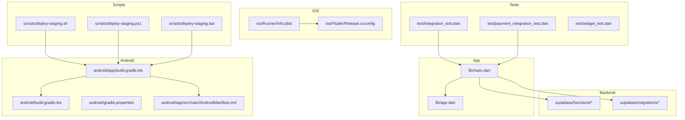
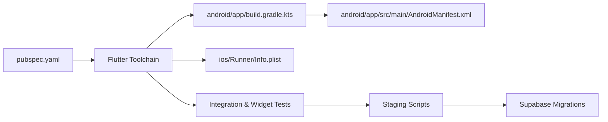

# Release Management

<cite>
**Referenced Files in This Document**
- [README.md](file://README.md)
- [pubspec.yaml](file://pubspec.yaml)
- [analysis_options.yaml](file://analysis_options.yaml)
- [l10n.yaml](file://l10n.yaml)
- [secrets-staging.env](file://secrets-staging.env)
- [android/build.gradle.kts](file://android/build.gradle.kts)
- [android/app/build.gradle.kts](file://android/app/build.gradle.kts)
- [android/gradle.properties](file://android/gradle.properties)
- [android/app/src/main/AndroidManifest.xml](file://android/app/src/main/AndroidManifest.xml)
- [ios/Runner/Info.plist](file://ios/Runner/Info.plist)
- [ios/Flutter/Release.xcconfig](file://ios/Flutter/Release.xcconfig)
- [scripts/deploy-staging.sh](file://scripts/deploy-staging.sh)
- [scripts/deploy-staging.ps1](file://scripts/deploy-staging.ps1)
- [scripts/deploy-staging.bat](file://scripts/deploy-staging.bat)
- [supabase/migrations/001_initial_schema.sql](file://supabase/migrations/001_initial_schema.sql)
- [supabase/migrations/002_rls_policies.sql](file://supabase/migrations/002_rls_policies.sql)
- [supabase/migrations/003_auth_profiles_and_hardening.sql](file://supabase/migrations/003_auth_profiles_and_hardening.sql)
- [supabase/migrations/004_stock_function.sql](file://supabase/migrations/004_stock_function.sql)
- [supabase/migrations/005_storage_buckets.sql](file://supabase/migrations/005_storage_buckets.sql)
- [supabase/migrations/006_payments_table.sql](file://supabase/migrations/006_payments_table.sql)
- [supabase/migrations/007_stock_increment_function.sql](file://supabase/migrations/007_stock_increment_function.sql)
- [supabase/migrations/008_order_fulfillment.sql](file://supabase/migrations/008_order_fulfillment.sql)
- [supabase/migrations/009_shipping_zones.sql](file://supabase/migrations/009_shipping_zones.sql)
- [supabase/migrations/010_notifications_analytics.sql](file://supabase/migrations/010_notifications_analytics.sql)
- [supabase/migrations/011_orders_idempotency_and_expiry.sql](file://supabase/migrations/011_orders_idempotency_and_expiry.sql)
- [supabase/migrations/verify_rls.sql](file://supabase/migrations/verify_rls.sql)
- [test/integration_test.dart](file://test/integration_test.dart)
- [test/payment_integration_test.dart](file://test/payment_integration_test.dart)
- [test/widget_test.dart](file://test/widget_test.dart)
- [lib/main.dart](file://lib/main.dart)
- [lib/app.dart](file://lib/app.dart)
</cite>

## Table of Contents
1. [Introduction](#introduction)
2. [Project Structure](#project-structure)
3. [Core Components](#core-components)
4. [Architecture Overview](#architecture-overview)
5. [Detailed Component Analysis](#detailed-component-analysis)
6. [Dependency Analysis](#dependency-analysis)
7. [Performance Considerations](#performance-considerations)
8. [Troubleshooting Guide](#troubleshooting-guide)
9. [Conclusion](#conclusion)
10. [Appendices](#appendices)

## Introduction
This document defines the release preparation and management processes for the project, including readiness checklists, staging verification, production deployment validation, versioning strategy, changelog and release notes maintenance, app store submission flows (iOS and Android), over-the-air updates, database migration strategies, feature flag management, and rollback procedures. It references concrete artifacts in the repository to ground each process in actual code and configuration.

## Project Structure
The project is a Flutter application with native Android and iOS targets, Supabase backend functions and migrations, and scripts for staging deployments. Key areas relevant to releases include:
- Application entry points and core app setup
- Platform build configurations and manifests
- Staging deployment scripts
- Database migrations under Supabase
- Tests covering integration and UI behavior
- Localization and analysis options



**Diagram sources**
- [lib/main.dart](file://lib/main.dart)
- [lib/app.dart](file://lib/app.dart)
- [android/app/build.gradle.kts](file://android/app/build.gradle.kts)
- [android/build.gradle.kts](file://android/build.gradle.kts)
- [android/gradle.properties](file://android/gradle.properties)
- [android/app/src/main/AndroidManifest.xml](file://android/app/src/main/AndroidManifest.xml)
- [ios/Runner/Info.plist](file://ios/Runner/Info.plist)
- [ios/Flutter/Release.xcconfig](file://ios/Flutter/Release.xcconfig)
- [supabase/migrations/001_initial_schema.sql](file://supabase/migrations/001_initial_schema.sql)
- [test/integration_test.dart](file://test/integration_test.dart)
- [test/payment_integration_test.dart](file://test/payment_integration_test.dart)
- [scripts/deploy-staging.sh](file://scripts/deploy-staging.sh)
- [scripts/deploy-staging.ps1](file://scripts/deploy-staging.ps1)
- [scripts/deploy-staging.bat](file://scripts/deploy-staging.bat)

**Section sources**
- [README.md](file://README.md)
- [pubspec.yaml](file://pubspec.yaml)
- [analysis_options.yaml](file://analysis_options.yaml)
- [l10n.yaml](file://l10n.yaml)
- [secrets-staging.env](file://secrets-staging.env)

## Core Components
- Application entrypoints: main and app initialization are defined in the Dart layer.
- Android build and manifest: Gradle files and AndroidManifest define packaging and permissions.
- iOS build and Info: Info.plist and Release.xcconfig configure runtime and signing settings.
- Staging deployment scripts: Shell, PowerShell, and Batch scripts automate staging builds and uploads.
- Database migrations: Versioned SQL migrations under Supabase manage schema evolution.
- Tests: Integration and widget tests validate critical flows before release.

**Section sources**
- [lib/main.dart](file://lib/main.dart)
- [lib/app.dart](file://lib/app.dart)
- [android/app/build.gradle.kts](file://android/app/build.gradle.kts)
- [android/build.gradle.kts](file://android/build.gradle.kts)
- [android/gradle.properties](file://android/gradle.properties)
- [android/app/src/main/AndroidManifest.xml](file://android/app/src/main/AndroidManifest.xml)
- [ios/Runner/Info.plist](file://ios/Runner/Info.plist)
- [ios/Flutter/Release.xcconfig](file://ios/Flutter/Release.xcconfig)
- [scripts/deploy-staging.sh](file://scripts/deploy-staging.sh)
- [scripts/deploy-staging.ps1](file://scripts/deploy-staging.ps1)
- [scripts/deploy-staging.bat](file://scripts/deploy-staging.bat)
- [supabase/migrations/001_initial_schema.sql](file://supabase/migrations/001_initial_schema.sql)
- [test/integration_test.dart](file://test/integration_test.dart)
- [test/payment_integration_test.dart](file://test/payment_integration_test.dart)

## Architecture Overview
The release pipeline integrates Flutter app builds, platform packaging, and backend migrations. Staging deployments use provided scripts to build and distribute artifacts. Production releases follow stricter gates and require validated migrations and test results.

```mermaid
sequenceDiagram
participant Dev as "Developer"
participant CI as "Build & Test"
participant And as "Android Build"
participant iOS as "iOS Build"
participant DB as "Supabase Migrations"
participant StoreA as "Google Play Console"
participant StoreI as "App Store Connect"
Dev->>CI : Trigger release build
CI->>And : Assemble release APK/AAB
CI->>iOS : Archive release IPA
CI->>DB : Apply pending migrations
CI-->>Dev : Artifacts + test reports
Dev->>StoreA : Upload AAB for staging or production
Dev->>StoreI : Upload IPA for TestFlight or App Store
StoreA-->>Dev : Internal/Closed testing track
StoreI-->>Dev : TestFlight distribution
```

[No sources needed since this diagram shows conceptual workflow, not actual code structure]

## Detailed Component Analysis

### Release Readiness Checklist
- Code review requirements
  - All changes must be reviewed and approved prior to merging into the release branch.
  - Ensure lint and static analysis pass using configured rules.
- Testing completion
  - Unit and widget tests must pass.
  - Integration tests covering checkout and payments must pass on staging.
- Documentation updates
  - Update user-facing docs and internal runbooks if features change.
- Configuration and secrets
  - Validate environment-specific configs and secrets for staging and production.
- Changelog and release notes
  - Maintain an up-to-date changelog and generate release notes from commits and tags.

Concrete examples from the repository:
- Static analysis configuration: [analysis_options.yaml](file://analysis_options.yaml)
- Localization configuration: [l10n.yaml](file://l10n.yaml)
- Environment variables for staging: [secrets-staging.env](file://secrets-staging.env)
- Integration tests: [test/integration_test.dart](file://test/integration_test.dart), [test/payment_integration_test.dart](file://test/payment_integration_test.dart)
- Widget tests: [test/widget_test.dart](file://test/widget_test.dart)

**Section sources**
- [analysis_options.yaml](file://analysis_options.yaml)
- [l10n.yaml](file://l10n.yaml)
- [secrets-staging.env](file://secrets-staging.env)
- [test/integration_test.dart](file://test/integration_test.dart)
- [test/payment_integration_test.dart](file://test/payment_integration_test.dart)
- [test/widget_test.dart](file://test/widget_test.dart)

### Staging Verification Procedures
- Build staging artifacts using provided scripts.
- Run integration and payment tests against staging endpoints.
- Verify localization strings and assets.
- Confirm that Supabase migrations applied successfully.

Staging deployment scripts:
- [scripts/deploy-staging.sh](file://scripts/deploy-staging.sh)
- [scripts/deploy-staging.ps1](file://scripts/deploy-staging.ps1)
- [scripts/deploy-staging.bat](file://scripts/deploy-staging.bat)

Environment configuration:
- [secrets-staging.env](file://secrets-staging.env)

**Section sources**
- [scripts/deploy-staging.sh](file://scripts/deploy-staging.sh)
- [scripts/deploy-staging.ps1](file://scripts/deploy-staging.ps1)
- [scripts/deploy-staging.bat](file://scripts/deploy-staging.bat)
- [secrets-staging.env](file://secrets-staging.env)

### Production Deployment Validation
- Gate criteria
  - All tests passed on staging.
  - Code review approvals recorded.
  - Migrations verified on staging and ready for production.
- Artifact validation
  - Android: Signed AAB/APK built with release config.
  - iOS: Signed IPA archived with correct provisioning profiles.
- Post-deployment checks
  - Smoke tests on production endpoints.
  - Monitor error rates and performance metrics.

Platform configuration references:
- Android build and manifest: [android/app/build.gradle.kts](file://android/app/build.gradle.kts), [android/app/src/main/AndroidManifest.xml](file://android/app/src/main/AndroidManifest.xml)
- iOS release config: [ios/Flutter/Release.xcconfig](file://ios/Flutter/Release.xcconfig), [ios/Runner/Info.plist](file://ios/Runner/Info.plist)

**Section sources**
- [android/app/build.gradle.kts](file://android/app/build.gradle.kts)
- [android/app/src/main/AndroidManifest.xml](file://android/app/src/main/AndroidManifest.xml)
- [ios/Flutter/Release.xcconfig](file://ios/Flutter/Release.xcconfig)
- [ios/Runner/Info.plist](file://ios/Runner/Info.plist)

### Version Management Strategy
- Flutter package versioning via pubspec.
- Android versionCode/versionName managed in Gradle.
- iOS CFBundleShortVersionString and CFBundleVersion managed in Info.plist and xcconfig.
- Tagging conventions aligned with semantic versioning.

References:
- [pubspec.yaml](file://pubspec.yaml)
- [android/app/build.gradle.kts](file://android/app/build.gradle.kts)
- [android/build.gradle.kts](file://android/build.gradle.kts)
- [android/gradle.properties](file://android/gradle.properties)
- [ios/Runner/Info.plist](file://ios/Runner/Info.plist)
- [ios/Flutter/Release.xcconfig](file://ios/Flutter/Release.xcconfig)

**Section sources**
- [pubspec.yaml](file://pubspec.yaml)
- [android/app/build.gradle.kts](file://android/app/build.gradle.kts)
- [android/build.gradle.kts](file://android/build.gradle.kts)
- [android/gradle.properties](file://android/gradle.properties)
- [ios/Runner/Info.plist](file://ios/Runner/Info.plist)
- [ios/Flutter/Release.xcconfig](file://ios/Flutter/Release.xcconfig)

### Changelog Maintenance and Release Notes Generation
- Maintain a structured changelog capturing breaking changes, new features, fixes, and migration steps.
- Generate release notes from commit messages and tags; ensure consistency across platforms.
- Include dependency updates and known issues.

[No sources needed since this section provides general guidance]

### App Store Submission Processes

#### Android
- Build signed AAB using release configuration.
- Upload to Google Play Console.
- Use internal or closed testing tracks for pre-release validation.
- Promote to production after successful staging verification.

References:
- [android/app/build.gradle.kts](file://android/app/build.gradle.kts)
- [android/gradle.properties](file://android/gradle.properties)
- [android/app/src/main/AndroidManifest.xml](file://android/app/src/main/AndroidManifest.xml)

**Section sources**
- [android/app/build.gradle.kts](file://android/app/build.gradle.kts)
- [android/gradle.properties](file://android/gradle.properties)
- [android/app/src/main/AndroidManifest.xml](file://android/app/src/main/AndroidManifest.xml)

#### iOS
- Archive release IPA with proper signing and provisioning profiles.
- Distribute via TestFlight for beta testing.
- Submit to App Store Connect for production release.

References:
- [ios/Runner/Info.plist](file://ios/Runner/Info.plist)
- [ios/Flutter/Release.xcconfig](file://ios/Flutter/Release.xcconfig)

**Section sources**
- [ios/Runner/Info.plist](file://ios/Runner/Info.plist)
- [ios/Flutter/Release.xcconfig](file://ios/Flutter/Release.xcconfig)

### Over-the-Air Updates
- For web targets, consider hosting updated bundles and enabling cache-busting strategies.
- For mobile apps, rely on store distributions; OTA updates are limited by platform policies.

[No sources needed since this section provides general guidance]

### Database Migration Strategies
- Versioned SQL migrations under Supabase.
- Apply migrations during staging deployments; verify idempotency and backward compatibility.
- Rollback plan includes reverse migrations or hotfixes.

Migration files:
- [supabase/migrations/001_initial_schema.sql](file://supabase/migrations/001_initial_schema.sql)
- [supabase/migrations/002_rls_policies.sql](file://supabase/migrations/002_rls_policies.sql)
- [supabase/migrations/003_auth_profiles_and_hardening.sql](file://supabase/migrations/003_auth_profiles_and_hardening.sql)
- [supabase/migrations/004_stock_function.sql](file://supabase/migrations/004_stock_function.sql)
- [supabase/migrations/005_storage_buckets.sql](file://supabase/migrations/005_storage_buckets.sql)
- [supabase/migrations/006_payments_table.sql](file://supabase/migrations/006_payments_table.sql)
- [supabase/migrations/007_stock_increment_function.sql](file://supabase/migrations/007_stock_increment_function.sql)
- [supabase/migrations/008_order_fulfillment.sql](file://supabase/migrations/008_order_fulfillment.sql)
- [supabase/migrations/009_shipping_zones.sql](file://supabase/migrations/009_shipping_zones.sql)
- [supabase/migrations/010_notifications_analytics.sql](file://supabase/migrations/010_notifications_analytics.sql)
- [supabase/migrations/011_orders_idempotency_and_expiry.sql](file://supabase/migrations/011_orders_idempotency_and_expiry.sql)
- [supabase/migrations/verify_rls.sql](file://supabase/migrations/verify_rls.sql)

**Section sources**
- [supabase/migrations/001_initial_schema.sql](file://supabase/migrations/001_initial_schema.sql)
- [supabase/migrations/002_rls_policies.sql](file://supabase/migrations/002_rls_policies.sql)
- [supabase/migrations/003_auth_profiles_and_hardening.sql](file://supabase/migrations/003_auth_profiles_and_hardening.sql)
- [supabase/migrations/004_stock_function.sql](file://supabase/migrations/004_stock_function.sql)
- [supabase/migrations/005_storage_buckets.sql](file://supabase/migrations/005_storage_buckets.sql)
- [supabase/migrations/006_payments_table.sql](file://supabase/migrations/006_payments_table.sql)
- [supabase/migrations/007_stock_increment_function.sql](file://supabase/migrations/007_stock_increment_function.sql)
- [supabase/migrations/008_order_fulfillment.sql](file://supabase/migrations/008_order_fulfillment.sql)
- [supabase/migrations/009_shipping_zones.sql](file://supabase/migrations/009_shipping_zones.sql)
- [supabase/migrations/010_notifications_analytics.sql](file://supabase/migrations/010_notifications_analytics.sql)
- [supabase/migrations/011_orders_idempotency_and_expiry.sql](file://supabase/migrations/011_orders_idempotency_and_expiry.sql)
- [supabase/migrations/verify_rls.sql](file://supabase/migrations/verify_rls.sql)

### Feature Flag Management
- Implement feature flags at the app level to enable/disable functionality without redeployments.
- Use environment-based toggles for staging vs production.
- Document flag lifecycle and deprecation policy.

[No sources needed since this section provides general guidance]

### Rollback Procedures for Failed Releases
- Mobile apps: Revert to previous stable version via store console (internal/closed testing or production).
- Backend: Apply reverse migrations or deploy a compatible hotfix; ensure idempotent operations.
- Immediate mitigation: Disable problematic features via feature flags; monitor error rates.

[No sources needed since this section provides general guidance]

## Dependency Analysis
The release process depends on Flutter tooling, platform build systems, and Supabase services. The following diagram highlights key dependencies between components involved in building and releasing the app.



**Diagram sources**
- [pubspec.yaml](file://pubspec.yaml)
- [android/app/build.gradle.kts](file://android/app/build.gradle.kts)
- [android/app/src/main/AndroidManifest.xml](file://android/app/src/main/AndroidManifest.xml)
- [ios/Runner/Info.plist](file://ios/Runner/Info.plist)
- [test/integration_test.dart](file://test/integration_test.dart)
- [test/widget_test.dart](file://test/widget_test.dart)
- [scripts/deploy-staging.sh](file://scripts/deploy-staging.sh)
- [supabase/migrations/001_initial_schema.sql](file://supabase/migrations/001_initial_schema.sql)

**Section sources**
- [pubspec.yaml](file://pubspec.yaml)
- [android/app/build.gradle.kts](file://android/app/build.gradle.kts)
- [android/app/src/main/AndroidManifest.xml](file://android/app/src/main/AndroidManifest.xml)
- [ios/Runner/Info.plist](file://ios/Runner/Info.plist)
- [test/integration_test.dart](file://test/integration_test.dart)
- [test/widget_test.dart](file://test/widget_test.dart)
- [scripts/deploy-staging.sh](file://scripts/deploy-staging.sh)
- [supabase/migrations/001_initial_schema.sql](file://supabase/migrations/001_initial_schema.sql)

## Performance Considerations
- Optimize build times by caching dependencies and parallelizing tasks where possible.
- Minimize artifact sizes through asset optimization and tree-shaking.
- Profile app startup and rendering paths before release.

[No sources needed since this section provides general guidance]

## Troubleshooting Guide
Common issues and resolutions:
- Build failures
  - Check platform-specific configurations and signing settings.
  - Validate Gradle and Xcode toolchains.
- Test failures
  - Review integration and payment tests; ensure staging endpoints are reachable.
- Migration errors
  - Inspect migration logs; apply reverse migrations if necessary.
- Secrets misconfiguration
  - Verify environment variables and secret files for staging and production.

References:
- [secrets-staging.env](file://secrets-staging.env)
- [test/integration_test.dart](file://test/integration_test.dart)
- [test/payment_integration_test.dart](file://test/payment_integration_test.dart)
- [supabase/migrations/verify_rls.sql](file://supabase/migrations/verify_rls.sql)

**Section sources**
- [secrets-staging.env](file://secrets-staging.env)
- [test/integration_test.dart](file://test/integration_test.dart)
- [test/payment_integration_test.dart](file://test/payment_integration_test.dart)
- [supabase/migrations/verify_rls.sql](file://supabase/migrations/verify_rls.sql)

## Conclusion
This release management guide consolidates readiness checklists, staging verification, production validation, versioning, changelog practices, app store submissions, database migrations, feature flags, and rollback strategies. By aligning these processes with the repository’s existing scripts, configurations, and tests, teams can deliver reliable releases with clear quality gates and recovery paths.

## Appendices

### Example Release Preparation Steps
- Prepare code changes and update documentation.
- Run static analysis and tests locally.
- Build staging artifacts using scripts.
- Apply migrations to staging and verify.
- Perform manual QA and smoke tests.
- Create changelog entries and release notes.
- Submit to stores or promote to production.

[No sources needed since this section provides general guidance]