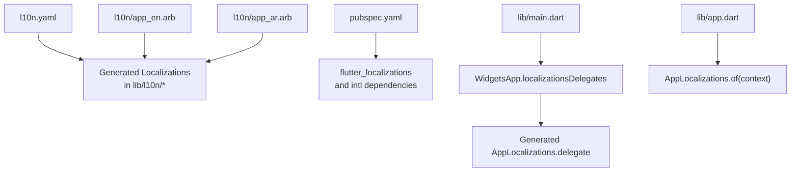
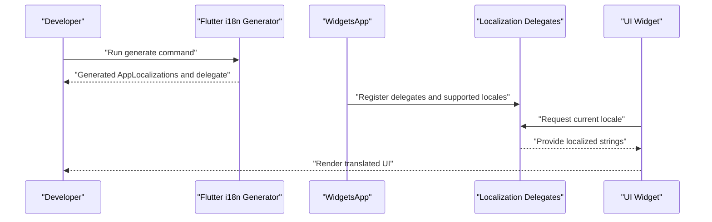
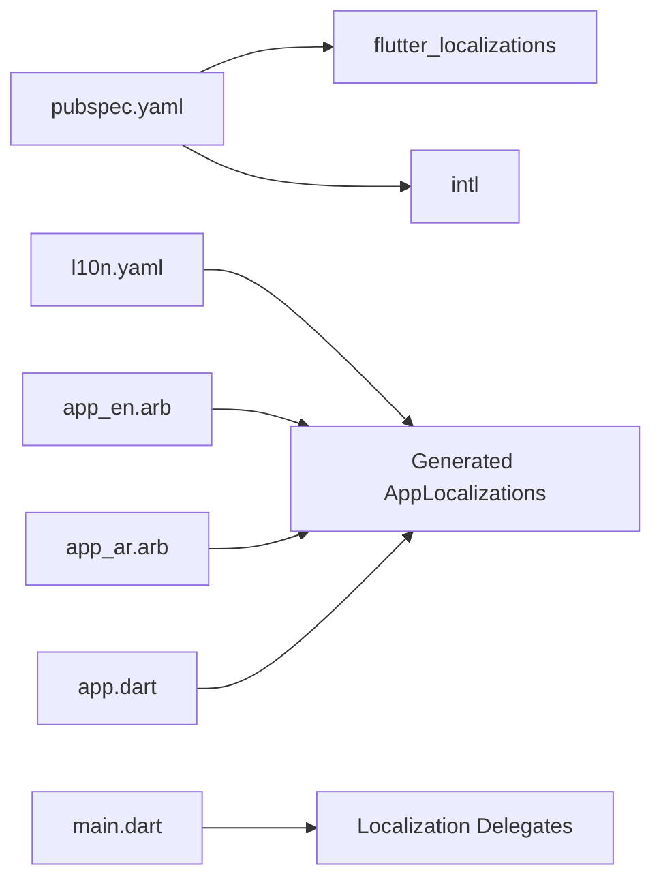

# Internationalization

<cite>
**Referenced Files in This Document**
- [l10n.yaml](file://l10n.yaml)
- [app_en.arb](file://l10n/app_en.arb)
- [app_ar.arb](file://l10n/app_ar.arb)
- [pubspec.yaml](file://pubspec.yaml)
- [main.dart](file://lib/main.dart)
- [app.dart](file://lib/app.dart)
</cite>

## Table of Contents
1. [Introduction](#introduction)
2. [Project Structure](#project-structure)
3. [Core Components](#core-components)
4. [Architecture Overview](#architecture-overview)
5. [Detailed Component Analysis](#detailed-component-analysis)
6. [Dependency Analysis](#dependency-analysis)
7. [Performance Considerations](#performance-considerations)
8. [Troubleshooting Guide](#troubleshooting-guide)
9. [Conclusion](#conclusion)
10. [Appendices](#appendices)

## Introduction
This document explains the internationalization (i18n) implementation for the project, focusing on multi-language support using ARB files, dynamic language switching, and cultural formatting. It covers localization setup, message extraction, translation management, runtime language switching, pluralization rules, date/number formatting, Arabic and English support, RTL layout considerations, font management, translation workflow, contributor guidelines, quality assurance, performance considerations for large translation files, lazy loading strategies, and best practices for adding new languages and maintaining consistency.

## Project Structure
The i18n configuration and assets are organized as follows:
- l10n.yaml: Flutter i18n generator configuration
- l10n/app_en.arb: English messages
- l10n/app_ar.arb: Arabic messages
- pubspec.yaml: Dependencies and asset declarations
- lib/main.dart: Application entry point where locale and delegates are configured
- lib/app.dart: Root application widget that consumes generated localization classes

**Diagram sources**
- [l10n.yaml](file://l10n.yaml)
- [app_en.arb](file://l10n/app_en.arb)
- [app_ar.arb](file://l10n/app_ar.arb)
- [pubspec.yaml](file://pubspec.yaml)
- [main.dart](file://lib/main.dart)
- [app.dart](file://lib/app.dart)

**Section sources**
- [l10n.yaml](file://l10n.yaml)
- [app_en.arb](file://l10n/app_en.arb)
- [app_ar.arb](file://l10n/app_ar.arb)
- [pubspec.yaml](file://pubspec.yaml)
- [main.dart](file://lib/main.dart)
- [app.dart](file://lib/app.dart)

## Core Components
- ARB message catalogs: app_en.arb and app_ar.arb define localized strings and parameters for UI text.
- l10n.yaml: Configures the Flutter i18n generator to produce Dart localization classes from ARB files.
- Generated localizations: The build process generates a delegate and typed accessors used throughout the app.
- Localization delegates: Provided by flutter_localizations and the generated AppLocalizations.delegate.
- Locale resolution: Determined via supportedLocales and initialLocale in the app configuration.
- Runtime switching: Changing the locale updates the context and rebuilds widgets with the new language.

Key responsibilities:
- Message extraction and validation from ARB files
- Generation of strongly-typed localization APIs
- Integration with WidgetsApp for localization delegates and supported locales
- Accessing localized strings in widgets via generated helpers

**Section sources**
- [l10n.yaml](file://l10n.yaml)
- [app_en.arb](file://l10n/app_en.arb)
- [app_ar.arb](file://l10n/app_ar.arb)
- [main.dart](file://lib/main.dart)
- [app.dart](file://lib/app.dart)

## Architecture Overview
The i18n architecture uses Flutter’s localization pipeline:
- ARB files are the source of truth for all user-facing text.
- The i18n generator produces Dart classes and a delegate.
- The app configures localization delegates and supported locales.
- Widgets retrieve localized strings through the generated API.

**Diagram sources**
- [l10n.yaml](file://l10n.yaml)
- [main.dart](file://lib/main.dart)
- [app.dart](file://lib/app.dart)

## Detailed Component Analysis

### ARB Message Catalogs
- app_en.arb: Contains English translations and any message parameters or plural forms.
- app_ar.arb: Contains Arabic translations and corresponding plural forms.
- Keys should be consistent across languages; missing keys cause generation errors.
- Use ICU message syntax for pluralization and formatting when needed.

Best practices:
- Keep keys descriptive and hierarchical (e.g., feature.section.message).
- Avoid embedding HTML or markup directly in ARB unless required by the UI layer.
- Validate ARB files before generating to catch inconsistencies early.

**Section sources**
- [app_en.arb](file://l10n/app_en.arb)
- [app_ar.arb](file://l10n/app_ar.arb)

### l10n Configuration
- l10n.yaml defines the base arb directory, output directory, and class name for generated localizations.
- Ensure the generator is configured to include both English and Arabic locales.
- The file also controls whether synthetic package generation is enabled.

Operational notes:
- After modifying ARB files, run the generator to update Dart code.
- If adding a new language, add a new ARB file and ensure it is included by the generator.

**Section sources**
- [l10n.yaml](file://l10n.yaml)

### Localization Delegates and Supported Locales
- main.dart registers localization delegates including flutter_localizations and the generated AppLocalizations.delegate.
- Supported locales list includes at least en and ar.
- Initial locale can be set based on device settings or persisted preference.

Runtime behavior:
- When locale changes, the app rebuilds with the new locale.
- Widgets using the generated API automatically reflect the updated language.

**Section sources**
- [main.dart](file://lib/main.dart)

### Using Localized Strings in Widgets
- app.dart demonstrates accessing localized strings via the generated API.
- Use the generated helper methods to fetch strings and format numbers/dates if provided.
- For pluralization, use the appropriate method signatures defined by the generator.

Guidelines:
- Always pass required parameters to avoid runtime errors.
- Prefer using the generated API rather than hardcoding strings.

**Section sources**
- [app.dart](file://lib/app.dart)

### Pluralization Rules
- ARB files can define plural forms using ICU syntax.
- The generator creates methods that accept count and return the correct plural form for each locale.
- Ensure plural categories match the target language’s rules (e.g., Arabic has multiple plural forms).

Example usage pattern:
- Call the generated plural method with a numeric count.
- The method returns the appropriate string variant for the current locale.

**Section sources**
- [app_en.arb](file://l10n/app_en.arb)
- [app_ar.arb](file://l10n/app_ar.arb)

### Date and Number Formatting
- Cultural formatting is handled by flutter_localizations and the intl package.
- Use the generated localization context to obtain number and date formatters.
- Format currency, percentages, and dates according to the active locale.

Recommendations:
- Centralize formatting calls in shared utilities to maintain consistency.
- Test formatting across locales to verify correctness.

**Section sources**
- [main.dart](file://lib/main.dart)
- [app.dart](file://lib/app.dart)

### Arabic Support and RTL Layout
- Arabic locale triggers right-to-left layout direction.
- Ensure UI components respect logical properties (start/end instead of left/right).
- Verify icons and images do not imply directionality that conflicts with RTL.

Implementation tips:
- Use Directionality-aware widgets and constraints.
- Test layouts extensively in Arabic mode.

**Section sources**
- [main.dart](file://lib/main.dart)

### Font Management for Different Languages
- Fonts must support characters used in Arabic and English.
- Declare fonts in pubspec.yaml and reference them in theme configurations.
- Consider fallback fonts for edge cases.

Verification:
- Render sample text in both languages to confirm glyph coverage.
- Check line heights and spacing adjustments for Arabic script.

**Section sources**
- [pubspec.yaml](file://pubspec.yaml)

## Dependency Analysis
The i18n stack depends on:
- flutter_localizations: Provides standard delegates and formatters.
- intl: Underpins number/date formatting and ICU message parsing.
- Generated AppLocalizations: Produced from ARB files via l10n.yaml.

**Diagram sources**
- [pubspec.yaml](file://pubspec.yaml)
- [l10n.yaml](file://l10n.yaml)
- [app_en.arb](file://l10n/app_en.arb)
- [app_ar.arb](file://l10n/app_ar.arb)
- [main.dart](file://lib/main.dart)
- [app.dart](file://lib/app.dart)

**Section sources**
- [pubspec.yaml](file://pubspec.yaml)
- [l10n.yaml](file://l10n.yaml)
- [main.dart](file://lib/main.dart)
- [app.dart](file://lib/app.dart)

## Performance Considerations
- Large ARB files increase generation time and bundle size. Split messages into feature-specific catalogs if necessary.
- Lazy loading:
  - Load only the active locale at startup.
  - Preload additional locales in background when users switch languages.
- Minimize repeated lookups by caching frequently used strings in stateful widgets.
- Avoid heavy formatting operations in hot paths; precompute where possible.

[No sources needed since this section provides general guidance]

## Troubleshooting Guide
Common issues and resolutions:
- Missing translation key:
  - Symptom: Generation error or runtime null access.
  - Resolution: Add the key to all ARB files with matching parameters.
- Incorrect plural form:
  - Symptom: Wrong plural string for certain counts.
  - Resolution: Review ICU plural rules in ARB files for the target locale.
- Formatting anomalies:
  - Symptom: Dates or numbers display incorrectly.
  - Resolution: Ensure proper locale is set and delegates are registered.
- RTL misalignment:
  - Symptom: Icons or text appear mirrored or misaligned.
  - Resolution: Use logical properties and test in Arabic locale.

**Section sources**
- [app_en.arb](file://l10n/app_en.arb)
- [app_ar.arb](file://l10n/app_ar.arb)
- [main.dart](file://lib/main.dart)
- [app.dart](file://lib/app.dart)

## Conclusion
The project implements robust internationalization using ARB files, Flutter’s i18n generator, and localization delegates. English and Arabic are supported with pluralization and cultural formatting. Following the guidelines here will help maintain consistency, improve performance, and streamline contributions for new languages and features.

[No sources needed since this section summarizes without analyzing specific files]

## Appendices

### Translation Workflow
- Authoring:
  - Edit ARB files under l10n/.
  - Maintain consistent keys and parameters across languages.
- Generation:
  - Run the Flutter i18n generator to update Dart classes.
- Integration:
  - Use generated APIs in widgets.
  - Register delegates and supported locales in main.dart.
- Validation:
  - Build and run tests to catch missing keys or formatting issues.

**Section sources**
- [l10n.yaml](file://l10n.yaml)
- [app_en.arb](file://l10n/app_en.arb)
- [app_ar.arb](file://l10n/app_ar.arb)
- [main.dart](file://lib/main.dart)
- [app.dart](file://lib/app.dart)

### Contributor Guidelines
- Always add keys to all ARB files.
- Follow naming conventions for keys.
- Provide clear, concise translations.
- Test pluralization and formatting in both locales.
- Update documentation when introducing new keys or features.

**Section sources**
- [app_en.arb](file://l10n/app_en.arb)
- [app_ar.arb](file://l10n/app_ar.arb)

### Quality Assurance Checklist
- All keys present in every ARB file.
- Plural forms validated for each locale.
- Date and number formatting verified.
- RTL layout tested thoroughly.
- No hardcoded strings in UI code.

**Section sources**
- [app_en.arb](file://l10n/app_en.arb)
- [app_ar.arb](file://l10n/app_ar.arb)
- [main.dart](file://lib/main.dart)
- [app.dart](file://lib/app.dart)

### Adding a New Language
Steps:
- Create a new ARB file (e.g., app_fr.arb) with all keys.
- Ensure l10n.yaml includes the new locale.
- Regenerate localizations.
- Add the locale to supportedLocales in main.dart.
- Test UI in the new language, including pluralization and formatting.

**Section sources**
- [l10n.yaml](file://l10n.yaml)
- [app_en.arb](file://l10n/app_en.arb)
- [app_ar.arb](file://l10n/app_ar.arb)
- [main.dart](file://lib/main.dart)

### Managing Translation Keys
- Use hierarchical keys for clarity.
- Group related keys by feature.
- Avoid duplication; reuse common phrases.
- Document key purposes in comments within ARB files if helpful.

**Section sources**
- [app_en.arb](file://l10n/app_en.arb)
- [app_ar.arb](file://l10n/app_ar.arb)

### Maintaining Consistency Across the Application
- Centralize formatting logic.
- Use shared utilities for recurring patterns.
- Enforce linting rules to prevent hardcoded strings.
- Regularly audit UI for missed translations.

**Section sources**
- [app.dart](file://lib/app.dart)
- [main.dart](file://lib/main.dart)