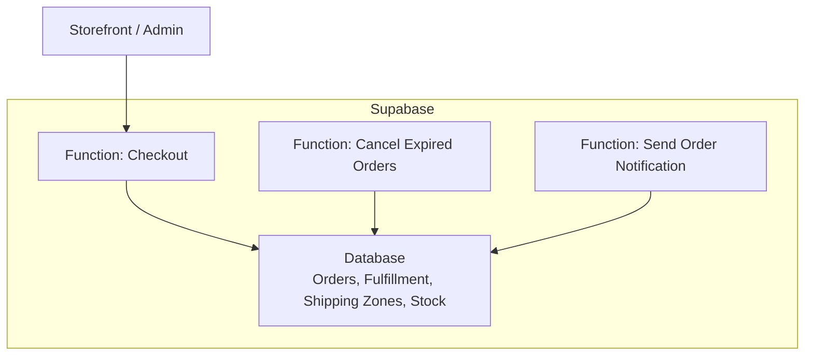
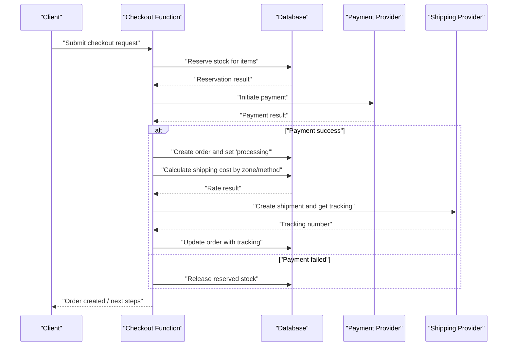
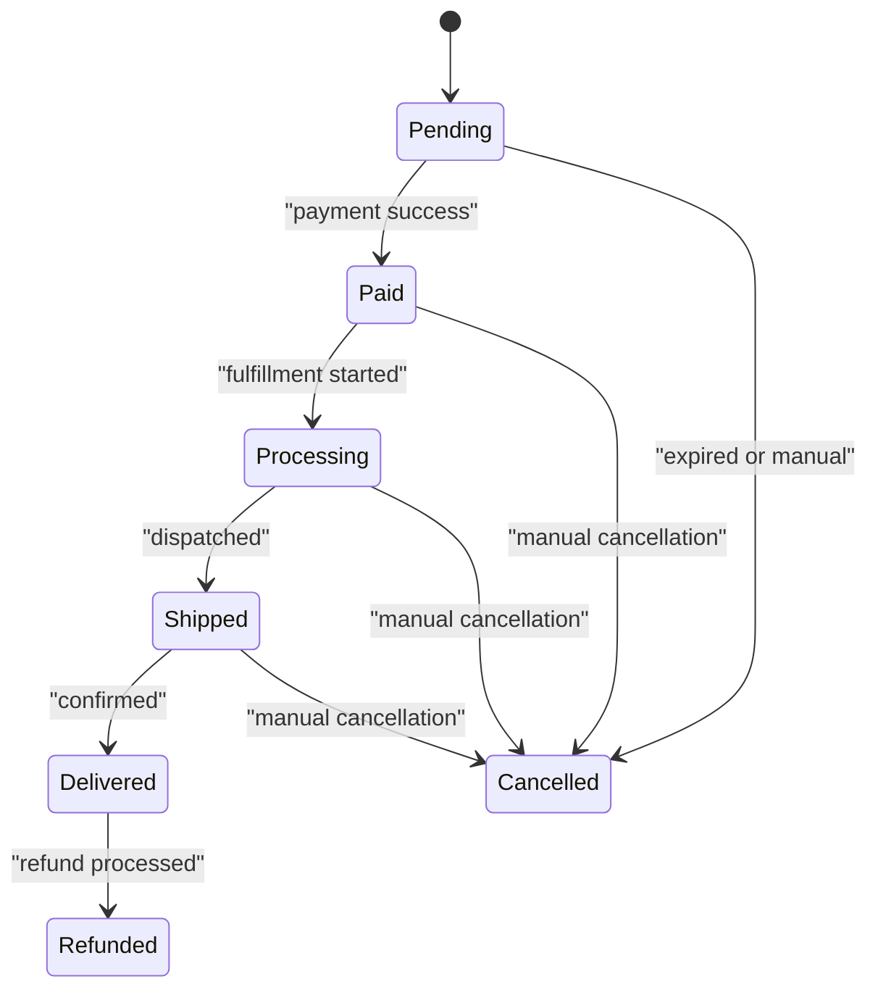
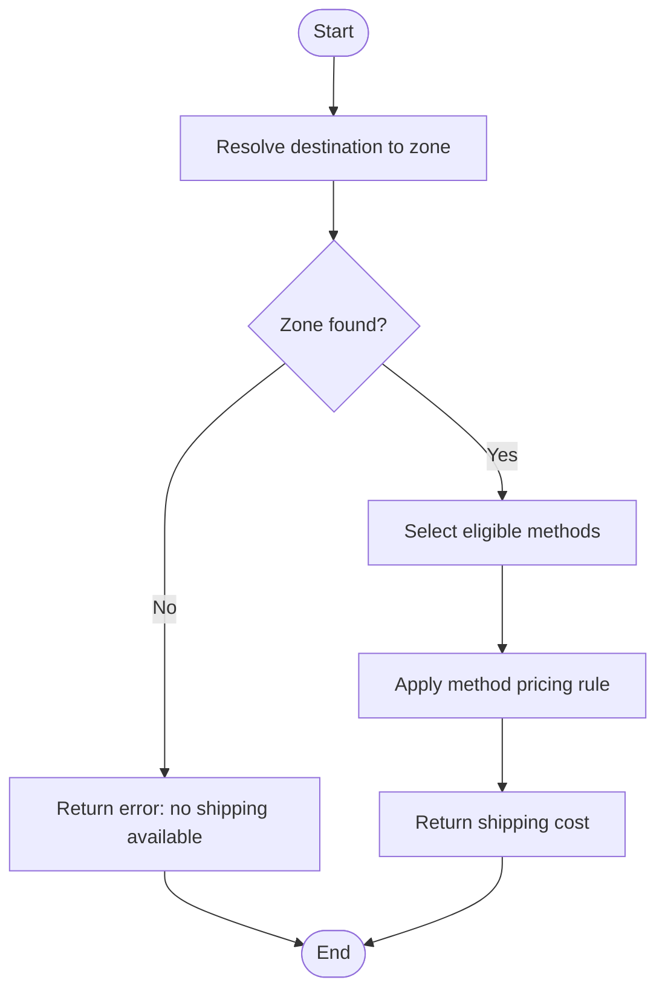
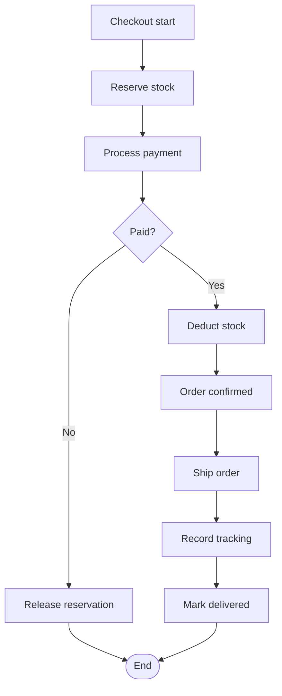
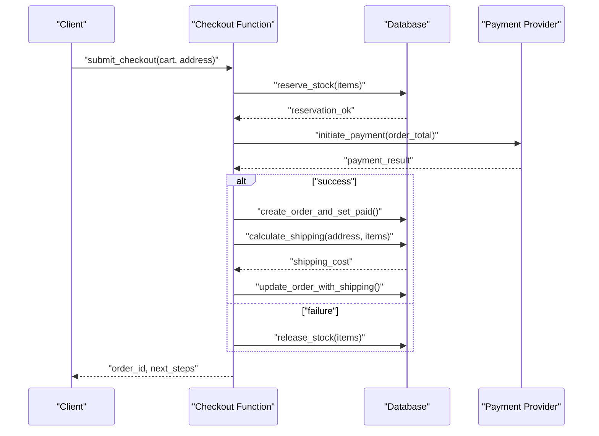
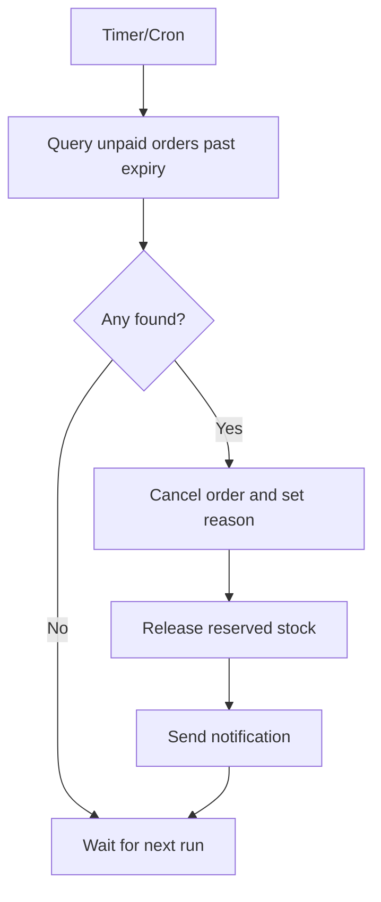
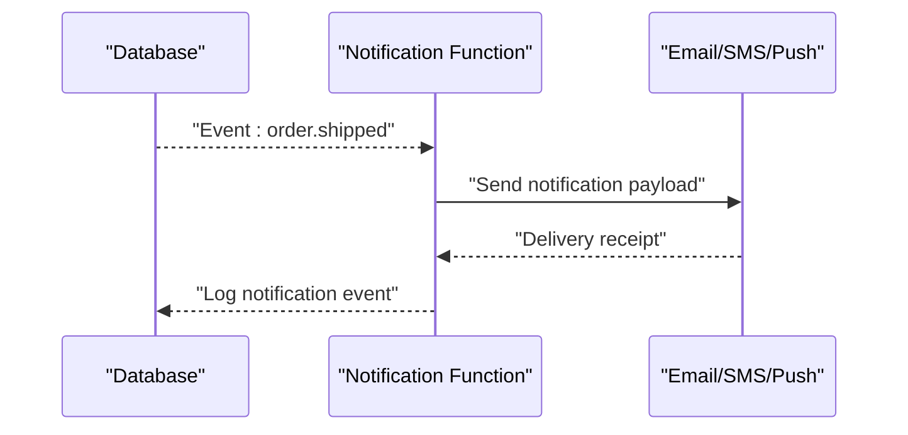
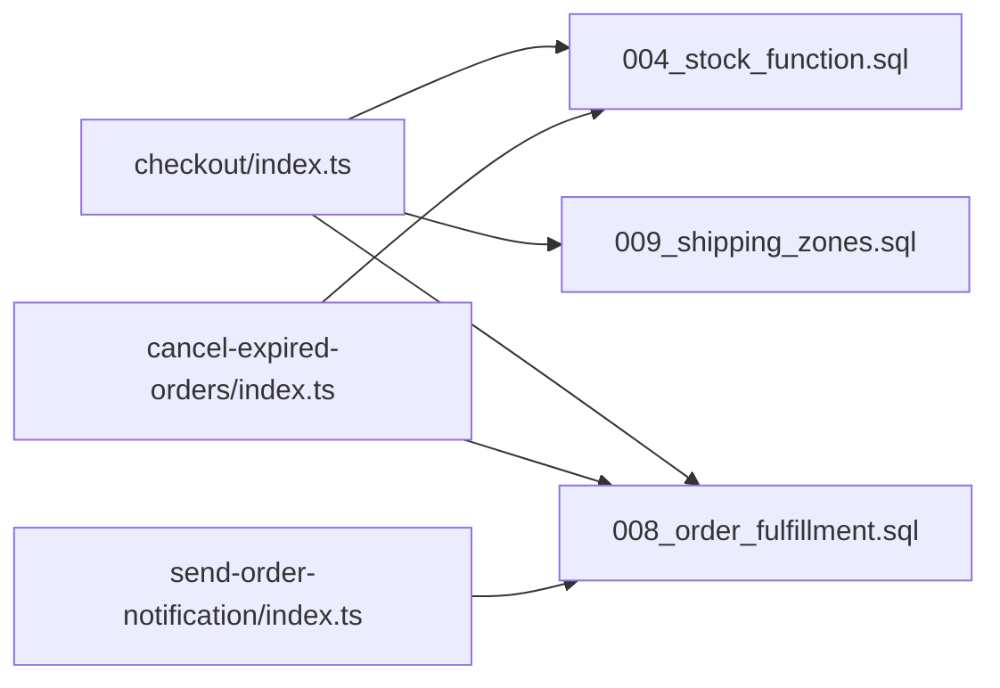

# Fulfillment Workflows & Shipping Integration

<cite>
**Referenced Files in This Document**
- [008_order_fulfillment.sql](file://supabase/migrations/008_order_fulfillment.sql)
- [009_shipping_zones.sql](file://supabase/migrations/009_shipping_zones.sql)
- [004_stock_function.sql](file://supabase/migrations/004_stock_function.sql)
- [007_stock_increment_function.sql](file://supabase/migrations/007_stock_increment_function.sql)
- [checkout/index.ts](file://supabase/functions/checkout/index.ts)
- [cancel-expired-orders/index.ts](file://supabase/functions/cancel-expired-orders/index.ts)
- [send-order-notification/index.ts](file://supabase/functions/send-order-notification/index.ts)
</cite>

## Table of Contents
1. Introduction
2. Project Structure
3. Core Components
4. Architecture Overview
5. Detailed Component Analysis
6. Dependency Analysis
7. Performance Considerations
8. Troubleshooting Guide
9. Conclusion
10. Appendices

## Introduction
This document explains the end-to-end fulfillment workflow and shipping integration for the store, from stock reservation at checkout through delivery confirmation. It covers:
- Order lifecycle and fulfillment states
- Stock reservation, deduction, and release flows
- Shipping zones configuration and rate calculation logic
- Integration patterns with external shipping providers
- Tracking number management and delivery status synchronization
- Low stock alerts and operational safeguards
- Guidelines for adding new shipping providers, customizing workflows, and supporting multiple warehouses

## Project Structure
The fulfillment and shipping capabilities are implemented primarily via database migrations (schema and functions) and serverless functions that orchestrate business processes. Key areas:
- Database schema and functions for orders, fulfillment, shipping zones, and stock operations
- Serverless functions for checkout orchestration, order expiration handling, and notifications

[No sources needed since this diagram shows conceptual workflow, not actual code structure]

## Core Components
- Order fulfillment state machine and audit trail
- Shipping zones and method configuration
- Stock reservation and inventory adjustment functions
- Checkout orchestration function coordinating payment, stock, and fulfillment
- Background job to cancel expired orders and release reserved stock
- Notifications for order events

**Section sources**
- [008_order_fulfillment.sql](file://supabase/migrations/008_order_fulfillment.sql)
- [009_shipping_zones.sql](file://supabase/migrations/009_shipping_zones.sql)
- [004_stock_function.sql](file://supabase/migrations/004_stock_function.sql)
- [007_stock_increment_function.sql](file://supabase/migrations/007_stock_increment_function.sql)
- [checkout/index.ts](file://supabase/functions/checkout/index.ts)
- [cancel-expired-orders/index.ts](file://supabase/functions/cancel-expired-orders/index.ts)
- [send-order-notification/index.ts](file://supabase/functions/send-order-notification/index.ts)

## Architecture Overview
High-level flow from checkout to delivery:
- Checkout function validates cart, reserves stock, creates order, and triggers payment
- On successful payment, order transitions to processing and fulfillment begins
- Shipping rates are calculated based on configured zones and methods
- After dispatch, tracking numbers are recorded; statuses sync back to the system
- Delivery confirmation updates final order state

**Diagram sources**
- [checkout/index.ts](file://supabase/functions/checkout/index.ts)
- [008_order_fulfillment.sql](file://supabase/migrations/008_order_fulfillment.sql)
- [009_shipping_zones.sql](file://supabase/migrations/009_shipping_zones.sql)
- [004_stock_function.sql](file://supabase/migrations/004_stock_function.sql)

## Detailed Component Analysis

### Order Fulfillment Lifecycle
- States include pending, paid, processing, shipped, delivered, cancelled, refunded
- Transitions are enforced by database constraints and functions
- Audit fields capture timestamps and actor context for traceability
- Expiration policy ensures un-paid orders revert to a safe state

**Diagram sources**
- [008_order_fulfillment.sql](file://supabase/migrations/008_order_fulfillment.sql)

**Section sources**
- [008_order_fulfillment.sql](file://supabase/migrations/008_order_fulfillment.sql)
- [cancel-expired-orders/index.ts](file://supabase/functions/cancel-expired-orders/index.ts)

### Shipping Zones and Methods
- Shipping zones define geographic coverage and applicable methods
- Shipping methods define pricing rules (flat, weight-based, price-based)
- Rate calculation selects matching zone and applies method formula
- Zone/method configurations can be extended without code changes

**Diagram sources**
- [009_shipping_zones.sql](file://supabase/migrations/009_shipping_zones.sql)

**Section sources**
- [009_shipping_zones.sql](file://supabase/migrations/009_shipping_zones.sql)

### Stock Management: Reservation, Deduction, Release
- Reservation locks stock during checkout to prevent oversell
- Deduction occurs when order is confirmed/paid
- Release happens on cancellation or expiration
- Increment function supports restocking and adjustments

**Diagram sources**
- [004_stock_function.sql](file://supabase/migrations/004_stock_function.sql)
- [007_stock_increment_function.sql](file://supabase/migrations/007_stock_increment_function.sql)
- [checkout/index.ts](file://supabase/functions/checkout/index.ts)

**Section sources**
- [004_stock_function.sql](file://supabase/migrations/004_stock_function.sql)
- [007_stock_increment_function.sql](file://supabase/migrations/007_stock_increment_function.sql)
- [checkout/index.ts](file://supabase/functions/checkout/index.ts)

### Checkout Orchestration
- Validates cart and calculates totals
- Reserves stock atomically
- Creates order and transitions state on payment success
- Calculates shipping cost using zones and methods
- Integrates with payment provider and records results

**Diagram sources**
- [checkout/index.ts](file://supabase/functions/checkout/index.ts)
- [008_order_fulfillment.sql](file://supabase/migrations/008_order_fulfillment.sql)
- [009_shipping_zones.sql](file://supabase/migrations/009_shipping_zones.sql)
- [004_stock_function.sql](file://supabase/migrations/004_stock_function.sql)

**Section sources**
- [checkout/index.ts](file://supabase/functions/checkout/index.ts)

### Order Expiration and Automatic Stock Release
- Unpaid orders expire after a configurable window
- Background process cancels expired orders and releases reserved stock
- Ensures inventory consistency and prevents deadlocks

**Diagram sources**
- [cancel-expired-orders/index.ts](file://supabase/functions/cancel-expired-orders/index.ts)
- [008_order_fulfillment.sql](file://supabase/migrations/008_order_fulfillment.sql)
- [004_stock_function.sql](file://supabase/migrations/004_stock_function.sql)

**Section sources**
- [cancel-expired-orders/index.ts](file://supabase/functions/cancel-expired-orders/index.ts)

### Notifications and Status Sync
- Sends notifications on key events (order created, shipped, delivered, cancelled)
- Can integrate with email/SMS/push channels
- Supports webhook callbacks for external systems

**Diagram sources**
- [send-order-notification/index.ts](file://supabase/functions/send-order-notification/index.ts)

**Section sources**
- [send-order-notification/index.ts](file://supabase/functions/send-order-notification/index.ts)

## Dependency Analysis
Key dependencies between components:
- Checkout function depends on stock reservation/deduction functions and shipping zone/methods
- Order fulfillment relies on state transitions defined in the fulfillment migration
- Expiration handler depends on order state and stock release functions
- Notifications depend on order events and user preferences

**Diagram sources**
- [checkout/index.ts](file://supabase/functions/checkout/index.ts)
- [cancel-expired-orders/index.ts](file://supabase/functions/cancel-expired-orders/index.ts)
- [send-order-notification/index.ts](file://supabase/functions/send-order-notification/index.ts)
- [004_stock_function.sql](file://supabase/migrations/004_stock_function.sql)
- [008_order_fulfillment.sql](file://supabase/migrations/008_order_fulfillment.sql)
- [009_shipping_zones.sql](file://supabase/migrations/009_shipping_zones.sql)

**Section sources**
- [checkout/index.ts](file://supabase/functions/checkout/index.ts)
- [cancel-expired-orders/index.ts](file://supabase/functions/cancel-expired-orders/index.ts)
- [send-order-notification/index.ts](file://supabase/functions/send-order-notification/index.ts)
- [004_stock_function.sql](file://supabase/migrations/004_stock_function.sql)
- [008_order_fulfillment.sql](file://supabase/migrations/008_order_fulfillment.sql)
- [009_shipping_zones.sql](file://supabase/migrations/009_shipping_zones.sql)

## Performance Considerations
- Use atomic database functions for stock reservation and deduction to avoid race conditions
- Keep checkout transactions short; offload heavy work (notifications, analytics) to background tasks
- Index frequently queried columns in shipping zones and orders for fast lookups
- Batch low stock checks and notifications to reduce overhead
- Cache shipping rates where appropriate, invalidating on configuration changes

[No sources needed since this section provides general guidance]

## Troubleshooting Guide
Common issues and resolutions:
- Stock reservation failures: verify item availability and reservation limits; check stock functions for errors
- Payment timeouts: implement idempotency keys and retry policies; ensure order state remains consistent
- Shipping rate mismatches: validate zone coverage and method rules; log inputs used for rate calculation
- Tracking not updated: confirm provider webhooks or polling jobs; reconcile tracking numbers with order records
- Expired orders not cancelled: inspect cron schedule and query filters; ensure release function runs successfully

Operational tips:
- Log all state transitions and actor context
- Add alerting for failed reservations, payments, and shipping calls
- Provide admin tools to manually adjust stock and order states with audit trails

**Section sources**
- [004_stock_function.sql](file://supabase/migrations/004_stock_function.sql)
- [008_order_fulfillment.sql](file://supabase/migrations/008_order_fulfillment.sql)
- [009_shipping_zones.sql](file://supabase/migrations/009_shipping_zones.sql)
- [cancel-expired-orders/index.ts](file://supabase/functions/cancel-expired-orders/index.ts)

## Conclusion
The fulfillment and shipping subsystem combines robust database-backed state management with serverless orchestration to deliver reliable order processing. By leveraging atomic stock functions, configurable shipping zones and methods, and clear order state transitions, the system supports scalable operations and easy extensibility for additional providers and multi-warehouse scenarios.

[No sources needed since this section summarizes without analyzing specific files]

## Appendices

### Adding a New Shipping Provider
- Define provider-specific API client and mapping to internal shipping methods
- Extend rate calculation to support provider-specific rules
- Implement tracking retrieval and status sync via webhooks or polling
- Update notifications to include provider-specific details

[No sources needed since this section provides general guidance]

### Customizing Fulfillment Workflows
- Introduce new order states and transitions in the fulfillment schema
- Add middleware-like hooks in the checkout function for pre/post actions
- Ensure idempotency across retries and background jobs

[No sources needed since this section provides general guidance]

### Multi-Warehouse Support
- Add warehouse entity and link products to warehouse inventories
- Modify stock reservation to allocate per warehouse based on proximity or rules
- Adjust shipping calculations to consider warehouse location and carrier coverage
- Update reporting and low stock alerts per warehouse

[No sources needed since this section provides general guidance]