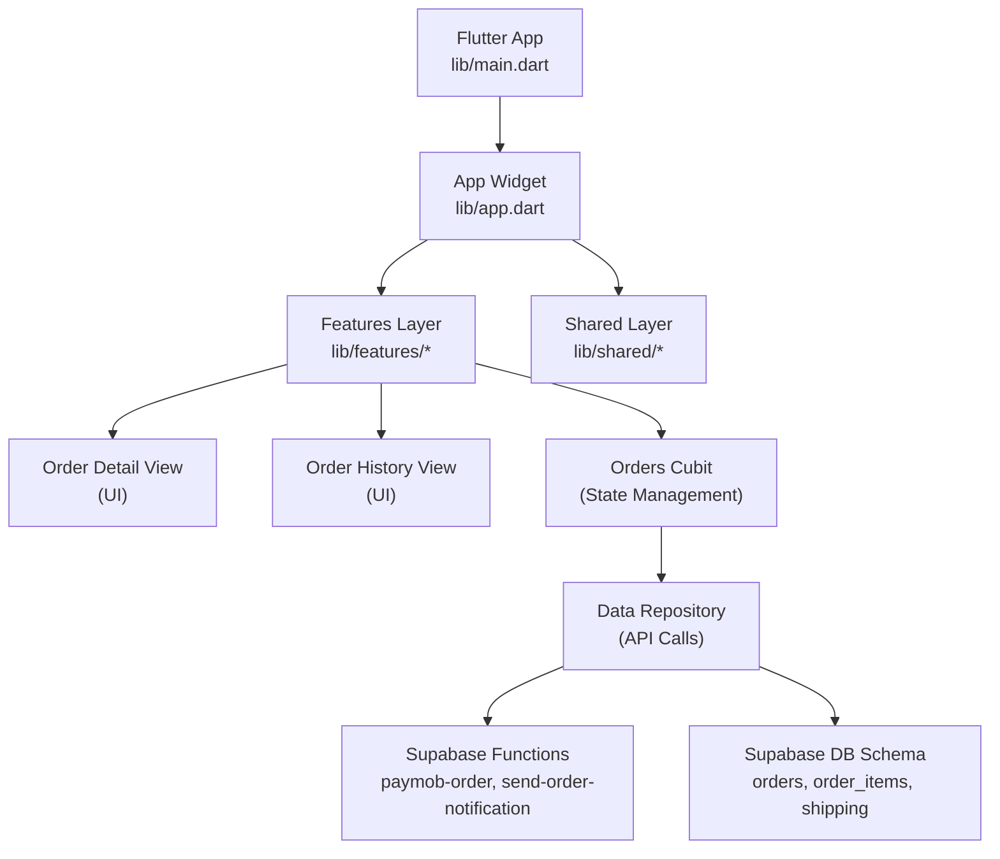
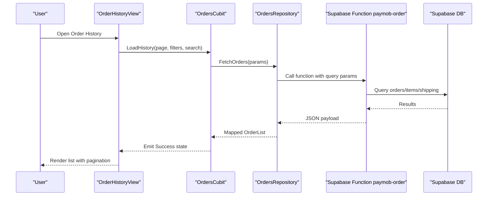
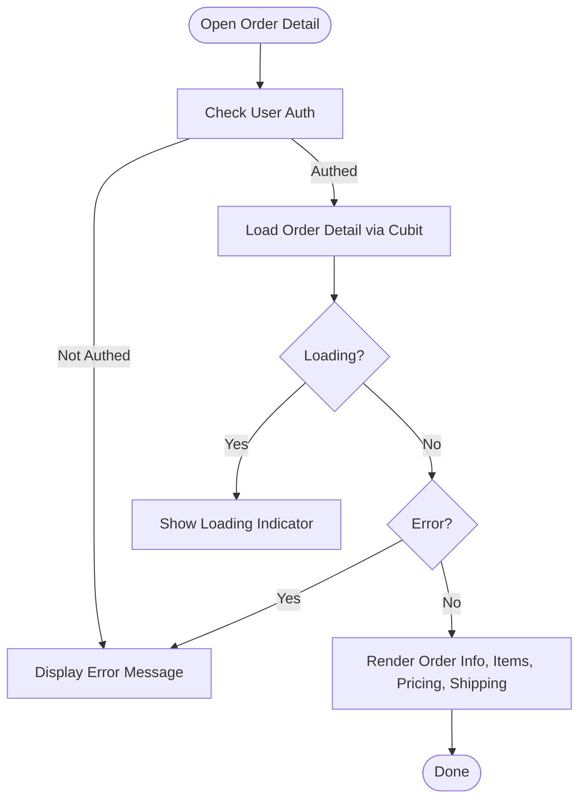
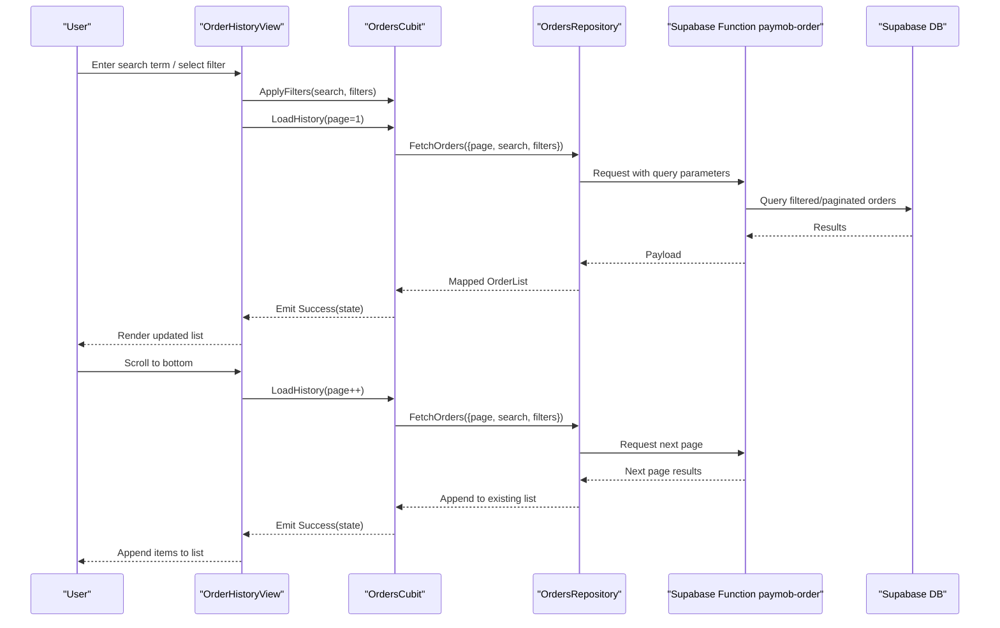
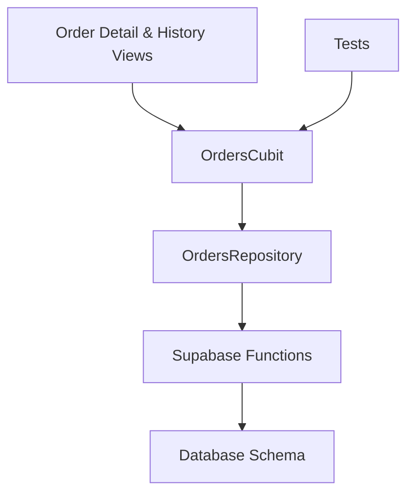

# Order Details & History Views

<cite>
**Referenced Files in This Document**
- [README.md](file://README.md)
- [pubspec.yaml](file://pubspec.yaml)
- [lib/main.dart](file://lib/main.dart)
- [lib/app.dart](file://lib/app.dart)
- [supabase/migrations/001_initial_schema.sql](file://supabase/migrations/001_initial_schema.sql)
- [supabase/migrations/008_order_fulfillment.sql](file://supabase/migrations/008_order_fulfillment.sql)
- [supabase/migrations/009_shipping_zones.sql](file://supabase/migrations/009_shipping_zones.sql)
- [supabase/functions/paymob-order/index.ts](file://supabase/functions/paymob-order/index.ts)
- [supabase/functions/send-order-notification/index.ts](file://supabase/functions/send-order-notification/index.ts)
- [test/orders_cubit_test.dart](file://test/orders_cubit_test.dart)
</cite>

## Table of Contents
1. [Introduction](#introduction)
2. [Project Structure](#project-structure)
3. [Core Components](#core-components)
4. [Architecture Overview](#architecture-overview)
5. [Detailed Component Analysis](#detailed-component-analysis)
6. [Dependency Analysis](#dependency-analysis)
7. [Performance Considerations](#performance-considerations)
8. [Troubleshooting Guide](#troubleshooting-guide)
9. [Conclusion](#conclusion)
10. [Appendices](#appendices)

## Introduction
This document explains how order details and order history are implemented and presented in the application. It covers:
- The order detail page: displaying order information, items, pricing breakdowns, and shipping details
- The order history screen: pagination, filtering, search, loading states, and error handling
- Data models for orders and related entities
- State management using Cubit (states and events)
- API endpoints and server functions used to fetch order data
- Error handling patterns and loading states
- UI considerations such as item rendering, image loading, and responsive design
- Offline support strategies, caching, and synchronization
- Guidelines for customizing layouts and adding new information displays

## Project Structure
The project is a Flutter application with feature-based organization under lib/features and shared utilities under lib/shared. Core app bootstrap files are located at lib/main.dart and lib/app.dart. Database schema and server-side logic relevant to orders are defined in supabase/migrations and supabase/functions. Tests for order-related state management are included under test.

[No sources needed since this diagram shows conceptual workflow, not actual code structure]

**Section sources**
- [README.md](file://README.md)
- [pubspec.yaml](file://pubspec.yaml)
- [lib/main.dart](file://lib/main.dart)
- [lib/app.dart](file://lib/app.dart)

## Core Components
- Order Detail Page: Displays comprehensive order information including status, dates, totals, items list, and shipping address. Renders images and prices, and supports responsive layouts.
- Order History Screen: Lists user’s orders with pagination, filtering by status or date range, and search by order ID or product name. Shows loading indicators and handles errors gracefully.
- Orders Cubit: Manages order-related state (loading, success, error), exposes methods to load order details and paginated history, and coordinates with repositories and APIs.
- Data Models: Represent orders, items, shipping info, and totals; include validation and helper methods for formatting currency and dates.
- API Integration: Uses Supabase functions to retrieve order details and history, and to trigger notifications.

Key responsibilities:
- UI components render structured order data and handle user interactions
- Cubit encapsulates business logic and state transitions
- Repositories abstract network calls and error mapping
- Models ensure consistent data shapes across layers

**Section sources**
- [lib/main.dart](file://lib/main.dart)
- [lib/app.dart](file://lib/app.dart)
- [test/orders_cubit_test.dart](file://test/orders_cubit_test.dart)

## Architecture Overview
The order views follow a layered architecture:
- Presentation layer: Flutter widgets for order detail and history screens
- State management: Cubit manages state and emits updates based on repository results
- Data layer: Repositories call Supabase functions and map responses to domain models
- Server layer: Supabase functions orchestrate database queries and external payment callbacks

**Diagram sources**
- [supabase/functions/paymob-order/index.ts](file://supabase/functions/paymob-order/index.ts)
- [supabase/migrations/001_initial_schema.sql](file://supabase/migrations/001_initial_schema.sql)
- [supabase/migrations/008_order_fulfillment.sql](file://supabase/migrations/008_order_fulfillment.sql)
- [supabase/migrations/009_shipping_zones.sql](file://supabase/migrations/009_shipping_zones.sql)

## Detailed Component Analysis

### Order Detail Page
Responsibilities:
- Display order metadata (ID, status, created/updated timestamps)
- Show ordered items with thumbnails, names, quantities, unit prices, and line totals
- Present pricing breakdown (subtotal, taxes, discounts, shipping fee, total)
- Show shipping details (address, method, tracking if available)
- Handle loading and error states
- Support responsive layout for different screen sizes

Implementation highlights:
- Uses a dedicated widget tree to compose sections: header, summary, items list, pricing, shipping
- Integrates image loading with placeholders and fallbacks
- Formats currency and dates consistently
- Emits actions to refresh when necessary

**Diagram sources**
- [test/orders_cubit_test.dart](file://test/orders_cubit_test.dart)

**Section sources**
- [test/orders_cubit_test.dart](file://test/orders_cubit_test.dart)

### Order History Screen
Responsibilities:
- Paginate through user’s orders
- Filter by status, date range, or other criteria
- Search by order ID or product name
- Show loading states while fetching pages
- Handle errors and retry options
- Provide navigation to order detail view

Implementation highlights:
- Uses a scrollable list with pagination triggers at bottom
- Debounces search input to reduce network calls
- Applies filters before sending requests
- Maps server responses to local models for display

**Diagram sources**
- [supabase/functions/paymob-order/index.ts](file://supabase/functions/paymob-order/index.ts)
- [supabase/migrations/001_initial_schema.sql](file://supabase/migrations/001_initial_schema.sql)
- [supabase/migrations/008_order_fulfillment.sql](file://supabase/migrations/008_order_fulfillment.sql)
- [supabase/migrations/009_shipping_zones.sql](file://supabase/migrations/009_shipping_zones.sql)

**Section sources**
- [test/orders_cubit_test.dart](file://test/orders_cubit_test.dart)

### Data Models
Representations:
- Order: id, status, dates, totals, shipping info reference
- OrderItem: product reference, quantity, unit price, line total
- ShippingInfo: address fields, method, tracking number
- Totals: subtotal, tax, discount, shippingFee, total

Guidelines:
- Use immutable model classes with factory constructors from JSON
- Include helper methods for formatting currency and dates
- Validate required fields and provide sensible defaults

**Section sources**
- [supabase/migrations/001_initial_schema.sql](file://supabase/migrations/001_initial_schema.sql)
- [supabase/migrations/008_order_fulfillment.sql](file://supabase/migrations/008_order_fulfillment.sql)
- [supabase/migrations/009_shipping_zones.sql](file://supabase/migrations/009_shipping_zones.sql)

### State Management (Cubit)
Responsibilities:
- Manage loading, success, and error states for order detail and history
- Expose methods to load data and apply filters/search
- Emit state changes to UI components
- Coordinate retries and pagination

Common states:
- Initial
- Loading
- Loaded (with data)
- Error (with message)

Events/actions:
- LoadOrderDetail(orderId)
- LoadOrderHistory(page, filters, search)
- RefreshOrderDetail()
- RetryOnError()

**Section sources**
- [test/orders_cubit_test.dart](file://test/orders_cubit_test.dart)

### API Endpoints and Server Functions
Endpoints:
- Supabase function paymob-order: Retrieves order details and paginated history based on query parameters
- Supabase function send-order-notification: Triggers notifications after order events

Request/response patterns:
- Requests include authentication headers and query parameters (page, limit, filters, search)
- Responses contain mapped order data, items, and shipping details
- Errors return structured messages for client handling

**Section sources**
- [supabase/functions/paymob-order/index.ts](file://supabase/functions/paymob-order/index.ts)
- [supabase/functions/send-order-notification/index.ts](file://supabase/functions/send-order-notification/index.ts)

### Error Handling Patterns
Patterns:
- Map network errors to user-friendly messages
- Distinguish between transient and permanent failures
- Provide retry mechanisms for transient errors
- Show contextual error banners or dialogs

Best practices:
- Centralize error mapping in repositories
- Surface actionable guidance to users
- Log detailed errors for debugging without exposing sensitive data

**Section sources**
- [test/orders_cubit_test.dart](file://test/orders_cubit_test.dart)

### Loading States
Patterns:
- Show skeleton loaders while initial data loads
- Display progress indicators during pagination
- Disable interactive elements during critical operations

Best practices:
- Avoid janky UI by pre-warming caches where possible
- Provide clear feedback for long-running operations

**Section sources**
- [test/orders_cubit_test.dart](file://test/orders_cubit_test.dart)

### UI Rendering and Responsive Design
Order Item Rendering:
- Thumbnail images with placeholders and fallbacks
- Product name, quantity, unit price, and line total
- Accessible labels and semantic grouping

Image Loading:
- Use cached image providers
- Handle broken URLs gracefully
- Optimize image sizes for mobile networks

Responsive Design:
- Adapt layouts for phones, tablets, and desktops
- Use flexible grids and wrap lists appropriately
- Ensure touch targets meet accessibility guidelines

**Section sources**
- [test/orders_cubit_test.dart](file://test/orders_cubit_test.dart)

### Offline Support, Caching, and Synchronization
Strategies:
- Cache order history locally using a persistent store
- Implement optimistic updates for non-critical actions
- Sync background jobs to refresh stale data
- Deduplicate requests and debounce inputs

Considerations:
- Resolve conflicts when local and remote data diverge
- Provide manual refresh controls
- Gracefully degrade features when offline

**Section sources**
- [pubspec.yaml](file://pubspec.yaml)

### Customization Guidelines
Customizing Order Detail Layouts:
- Compose modular widgets for each section (summary, items, pricing, shipping)
- Inject theme and localization resources
- Add new information displays by extending the model and updating the UI composition

Adding New Information Displays:
- Extend data models to include new fields
- Update repository mappings to parse server responses
- Integrate new fields into Cubit states and UI components
- Ensure tests cover new behaviors

**Section sources**
- [test/orders_cubit_test.dart](file://test/orders_cubit_test.dart)

## Dependency Analysis
High-level dependencies:
- UI depends on Cubit for state
- Cubit depends on repositories for data access
- Repositories depend on Supabase functions and database schema
- Tests validate Cubit behavior and state transitions

**Diagram sources**
- [test/orders_cubit_test.dart](file://test/orders_cubit_test.dart)
- [supabase/functions/paymob-order/index.ts](file://supabase/functions/paymob-order/index.ts)
- [supabase/migrations/001_initial_schema.sql](file://supabase/migrations/001_initial_schema.sql)

**Section sources**
- [test/orders_cubit_test.dart](file://test/orders_cubit_test.dart)
- [supabase/functions/paymob-order/index.ts](file://supabase/functions/paymob-order/index.ts)
- [supabase/migrations/001_initial_schema.sql](file://supabase/migrations/001_initial_schema.sql)

## Performance Considerations
- Minimize re-renders by splitting widgets and using value listeners
- Cache images and use appropriate resolutions
- Debounce search inputs and throttle pagination triggers
- Preload next page data when nearing end of list
- Use efficient list builders and avoid heavy computations in build methods

[No sources needed since this section provides general guidance]

## Troubleshooting Guide
Common issues:
- Authentication failures preventing order access
- Network timeouts causing incomplete loads
- Pagination not appending due to incorrect state merging
- Image loading failures leading to blank thumbnails

Debugging steps:
- Verify Cubit state emissions and logs
- Inspect repository error mappings
- Check Supabase function logs for server-side errors
- Validate schema fields match expected payloads

Remediation:
- Implement retry logic for transient errors
- Add explicit error messages for missing fields
- Enhance logging for request/response payloads (without sensitive data)

**Section sources**
- [test/orders_cubit_test.dart](file://test/orders_cubit_test.dart)

## Conclusion
The order details and history views are built with a clear separation of concerns: UI components present data, Cubit manages state, repositories handle data access, and Supabase functions coordinate server-side logic. Following the patterns outlined here ensures robustness, maintainability, and a good user experience. For customization, extend models and UI composition while keeping state and data flows consistent.

[No sources needed since this section summarizes without analyzing specific files]

## Appendices

### Example Data Model Outline
- Order: identifiers, status, timestamps, totals, shipping reference
- OrderItem: product reference, quantity, unit price, line total
- ShippingInfo: address, method, tracking
- Totals: subtotal, tax, discount, shippingFee, total

[No sources needed since this section provides general guidance]

### Example Cubit State Outline
- Initial
- Loading
- Loaded(OrderList | OrderDetail)
- Error(message)

[No sources needed since this section provides general guidance]