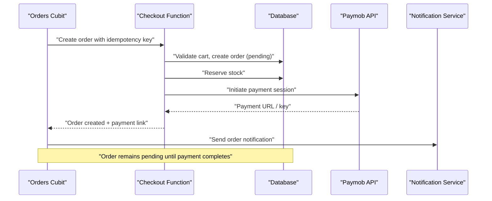
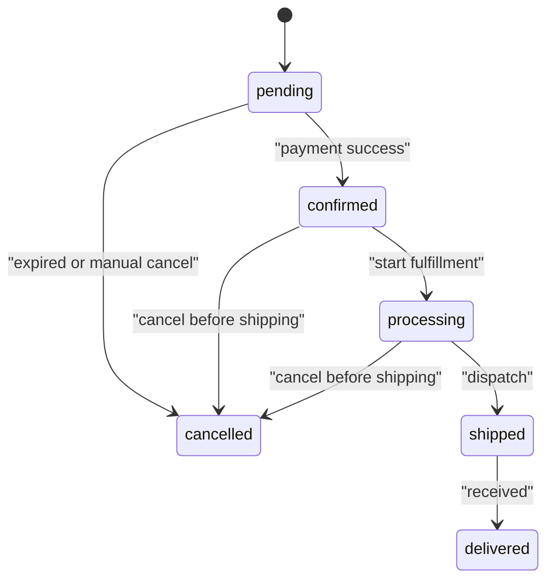
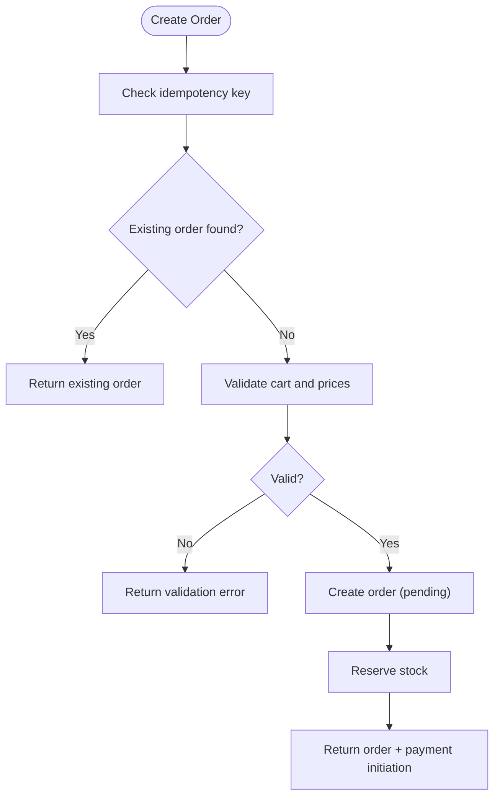
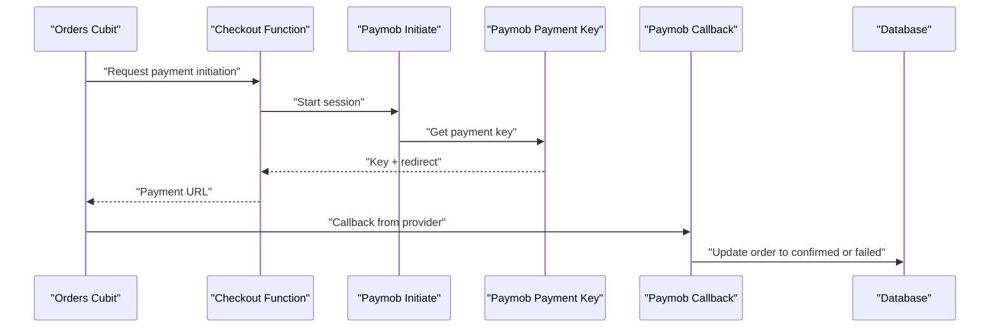
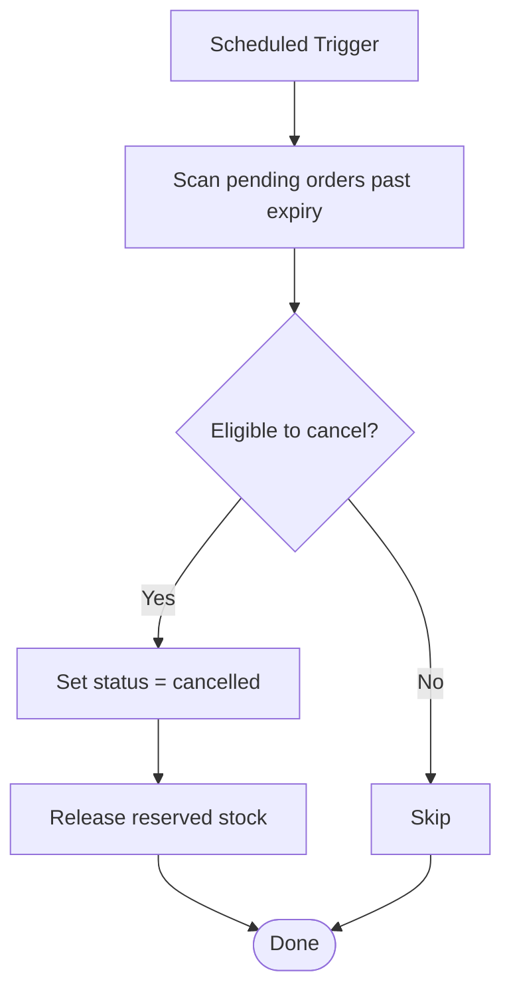
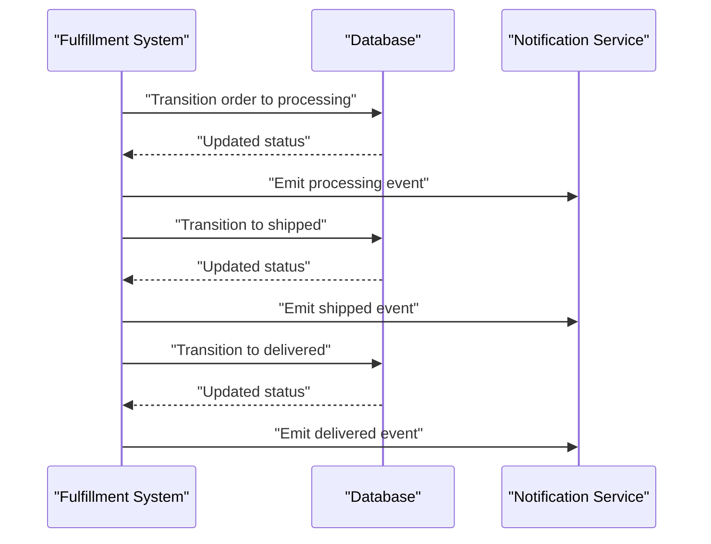
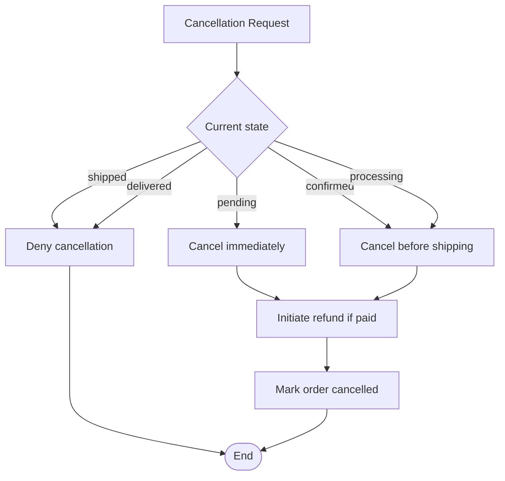
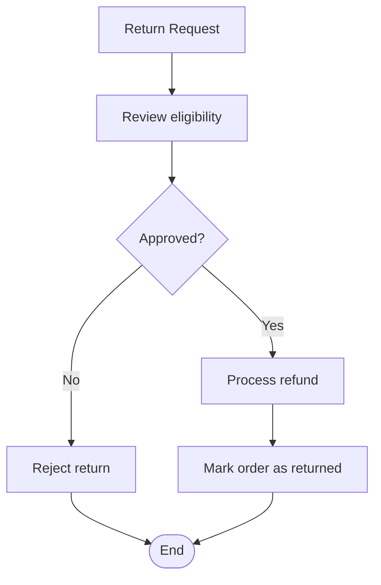
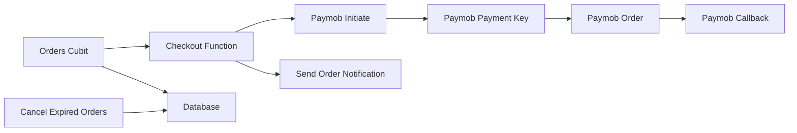
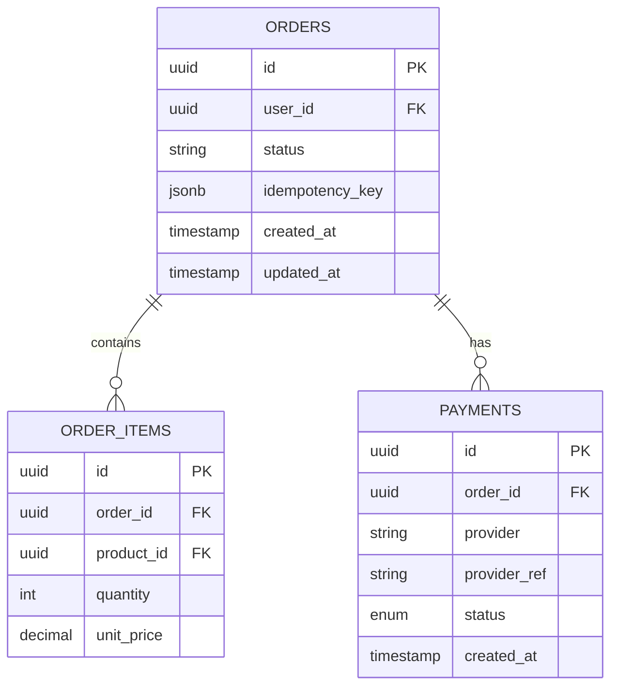

# Order Lifecycle Management

<cite>
**Referenced Files in This Document**
- [supabase/migrations/001_initial_schema.sql](file://supabase/migrations/001_initial_schema.sql)
- [supabase/migrations/008_order_fulfillment.sql](file://supabase/migrations/008_order_fulfillment.sql)
- [supabase/migrations/011_orders_idempotency_and_expiry.sql](file://supabase/migrations/011_orders_idempotency_and_expiry.sql)
- [supabase/functions/checkout/index.ts](file://supabase/functions/checkout/index.ts)
- [supabase/functions/cancel-expired-orders/index.ts](file://supabase/functions/cancel-expired-orders/index.ts)
- [supabase/functions/paymob-order/index.ts](file://supabase/functions/paymob-order/index.ts)
- [supabase/functions/paymob-payment-key/index.ts](file://supabase/functions/paymob-payment-key/index.ts)
- [supabase/functions/paymob-initiate/index.ts](file://supabase/functions/paymob-initiate/index.ts)
- [supabase/functions/paymob-callback/index.ts](file://supabase/functions/paymob-callback/index.ts)
- [supabase/functions/send-order-notification/index.ts](file://supabase/functions/send-order-notification/index.ts)
- [lib/features/orders/orders_cubit.dart](file://lib/features/orders/orders_cubit.dart)
- [test/orders_cubit_test.dart](file://test/orders_cubit_test.dart)
</cite>

## Table of Contents
1. [Introduction](#introduction)
2. [Project Structure](#project-structure)
3. [Core Components](#core-components)
4. [Architecture Overview](#architecture-overview)
5. [Detailed Component Analysis](#detailed-component-analysis)
6. [Dependency Analysis](#dependency-analysis)
7. [Performance Considerations](#performance-considerations)
8. [Troubleshooting Guide](#troubleshooting-guide)
9. [Conclusion](#conclusion)
10. [Appendices](#appendices)

## Introduction
This document explains the end-to-end order lifecycle management for the application, covering creation, validation, payment, fulfillment, and completion. It details supported states (pending, confirmed, processing, shipped, delivered, cancelled), idempotency guarantees, expiry handling for pending orders, concurrency safeguards, cancellation and refund workflows, return handling, and guidance for extending the lifecycle with custom states.

## Project Structure
Order-related functionality spans:
- Database schema and policies under supabase/migrations
- Serverless functions for checkout, payments, notifications, and background tasks under supabase/functions
- Client-side state management and tests under lib and test directories

```mermaid
graph TB
subgraph "Client"
OC["Orders Cubit<br/>lib/features/orders/orders_cubit.dart"]
Tests["Orders Cubit Tests<br/>test/orders_cubit_test.dart"]
end
subgraph "Supabase Functions"
Checkout["Checkout Function<br/>supabase/functions/checkout/index.ts"]
PaymobInit["Paymob Initiate<br/>supabase/functions/paymob-initiate/index.ts"]
PaymobKey["Paymob Payment Key<br/>supabase/functions/paymob-payment-key/index.ts]
PaymobOrder["Paymob Order<br/>supabase/functions/paymob-order/index.ts"]
PaymobCB["Paymob Callback<br/>supabase/functions/paymob-callback/index.ts"]
Notify["Send Order Notification<br/>supabase/functions/send-order-notification/index.ts"]
Expire["Cancel Expired Orders<br/>supabase/functions/cancel-expired-orders/index.ts"]
end
subgraph "Database"
Schema["Schema & Policies<br/>migrations/*.sql"]
end
OC --> Checkout
Checkout --> PaymobInit
PaymobInit --> PaymobKey
PaymobKey --> PaymobOrder
PaymobOrder --> PaymobCB
Checkout --> Notify
Expire --> Schema
OC --> Schema
Tests --> OC
```

**Diagram sources**
- [supabase/functions/checkout/index.ts](file://supabase/functions/checkout/index.ts)
- [supabase/functions/paymob-initiate/index.ts](file://supabase/functions/paymob-initiate/index.ts)
- [supabase/functions/paymob-payment-key/index.ts](file://supabase/functions/paymob-payment-key/index.ts)
- [supabase/functions/paymob-order/index.ts](file://supabase/functions/paymob-order/index.ts)
- [supabase/functions/paymob-callback/index.ts](file://supabase/functions/paymob-callback/index.ts)
- [supabase/functions/send-order-notification/index.ts](file://supabase/functions/send-order-notification/index.ts)
- [supabase/functions/cancel-expired-orders/index.ts](file://supabase/functions/cancel-expired-orders/index.ts)
- [supabase/migrations/001_initial_schema.sql](file://supabase/migrations/001_initial_schema.sql)
- [supabase/migrations/008_order_fulfillment.sql](file://supabase/migrations/008_order_fulfillment.sql)
- [supabase/migrations/011_orders_idempotency_and_expiry.sql](file://supabase/migrations/011_orders_idempotency_and_expiry.sql)
- [lib/features/orders/orders_cubit.dart](file://lib/features/orders/orders_cubit.dart)
- [test/orders_cubit_test.dart](file://test/orders_cubit_test.dart)

**Section sources**
- [supabase/migrations/001_initial_schema.sql](file://supabase/migrations/001_initial_schema.sql)
- [supabase/migrations/008_order_fulfillment.sql](file://supabase/migrations/008_order_fulfillment.sql)
- [supabase/migrations/011_orders_idempotency_and_expiry.sql](file://supabase/migrations/011_orders_idempotency_and_expiry.sql)
- [supabase/functions/checkout/index.ts](file://supabase/functions/checkout/index.ts)
- [supabase/functions/cancel-expired-orders/index.ts](file://supabase/functions/cancel-expired-orders/index.ts)
- [supabase/functions/paymob-order/index.ts](file://supabase/functions/paymob-order/index.ts)
- [supabase/functions/paymob-payment-key/index.ts](file://supabase/functions/paymob-payment-key/index.ts)
- [supabase/functions/paymob-initiate/index.ts](file://supabase/functions/paymob-initiate/index.ts)
- [supabase/functions/paymob-callback/index.ts](file://supabase/functions/paymob-callback/index.ts)
- [supabase/functions/send-order-notification/index.ts](file://supabase/functions/send-order-notification/index.ts)
- [lib/features/orders/orders_cubit.dart](file://lib/features/orders/orders_cubit.dart)
- [test/orders_cubit_test.dart](file://test/orders_cubit_test.dart)

## Core Components
- Orders Cubit: Manages client-side order state and orchestrates calls to serverless functions for checkout and status updates.
- Checkout Function: Validates cart, creates or retrieves an order, enforces idempotency, reserves stock, and initiates payment.
- Payment Integration: Uses Paymob endpoints to obtain a payment key and finalize payment; callback function updates order status on success/failure.
- Notifications: Emits order events to notify users and downstream systems.
- Background Expiry Handler: Periodically cancels pending orders that exceed configured time limits.
- Database Schema: Defines orders, order items, payments, and related tables with constraints and policies.

**Section sources**
- [lib/features/orders/orders_cubit.dart](file://lib/features/orders/orders_cubit.dart)
- [supabase/functions/checkout/index.ts](file://supabase/functions/checkout/index.ts)
- [supabase/functions/paymob-order/index.ts](file://supabase/functions/paymob-order/index.ts)
- [supabase/functions/paymob-payment-key/index.ts](file://supabase/functions/paymob-payment-key/index.ts)
- [supabase/functions/paymob-initiate/index.ts](file://supabase/functions/paymob-initiate/index.ts)
- [supabase/functions/paymob-callback/index.ts](file://supabase/functions/paymob-callback/index.ts)
- [supabase/functions/send-order-notification/index.ts](file://supabase/functions/send-order-notification/index.ts)
- [supabase/functions/cancel-expired-orders/index.ts](file://supabase/functions/cancel-expired-orders/index.ts)
- [supabase/migrations/001_initial_schema.sql](file://supabase/migrations/001_initial_schema.sql)
- [supabase/migrations/008_order_fulfillment.sql](file://supabase/migrations/008_order_fulfillment.sql)
- [supabase/migrations/011_orders_idempotency_and_expiry.sql](file://supabase/migrations/011_orders_idempotency_and_expiry.sql)

## Architecture Overview
The order flow is orchestrated by the client’s Orders Cubit, which delegates heavy lifting to Supabase Edge Functions. The database holds authoritative state, while functions enforce business rules, integrate with external payment providers, and emit notifications.



**Diagram sources**
- [supabase/functions/checkout/index.ts](file://supabase/functions/checkout/index.ts)
- [supabase/functions/paymob-initiate/index.ts](file://supabase/functions/paymob-initiate/index.ts)
- [supabase/functions/paymob-payment-key/index.ts](file://supabase/functions/paymob-payment-key/index.ts)
- [supabase/functions/send-order-notification/index.ts](file://supabase/functions/send-order-notification/index.ts)
- [supabase/migrations/001_initial_schema.sql](file://supabase/migrations/001_initial_schema.sql)

## Detailed Component Analysis

### Order States and Transitions
Supported states:
- pending: Created but not yet paid or confirmed
- confirmed: Payment verified; ready for processing
- processing: Being prepared for shipment
- shipped: Dispatched to carrier
- delivered: Received by customer
- cancelled: Cancelled before delivery (by user or system)

Valid transitions:
- pending → confirmed (after successful payment)
- confirmed → processing (fulfillment begins)
- processing → shipped (dispatched)
- shipped → delivered (customer receives)
- pending → cancelled (expiry or manual cancellation)
- confirmed → cancelled (before shipping)
- processing → cancelled (before shipping)



[No sources needed since this diagram shows conceptual workflow, not actual code structure]

### Order Creation Workflow and Validation
- Idempotency: Each creation request includes a unique idempotency key. If a matching key exists for the same user and cart snapshot, the existing order is returned instead of creating a duplicate.
- Validation: Cart contents are validated against product availability and pricing at checkout time. Stock reservation occurs atomically with order creation.
- Status: New orders start in pending.



**Diagram sources**
- [supabase/functions/checkout/index.ts](file://supabase/functions/checkout/index.ts)
- [supabase/migrations/011_orders_idempotency_and_expiry.sql](file://supabase/migrations/011_orders_idempotency_and_expiry.sql)

**Section sources**
- [supabase/functions/checkout/index.ts](file://supabase/functions/checkout/index.ts)
- [supabase/migrations/011_orders_idempotency_and_expiry.sql](file://supabase/migrations/011_orders_idempotency_and_expiry.sql)

### Payment Integration and Status Updates
- Initiation: The checkout function triggers payment initiation via Paymob endpoints to obtain a payment key and redirect URL.
- Completion: A Paymob callback updates the order status to confirmed upon success or reverts stock and marks the order failed/cancelled on failure.
- Client: The Orders Cubit listens for status changes and updates UI accordingly.



**Diagram sources**
- [supabase/functions/paymob-initiate/index.ts](file://supabase/functions/paymob-initiate/index.ts)
- [supabase/functions/paymob-payment-key/index.ts](file://supabase/functions/paymob-payment-key/index.ts)
- [supabase/functions/paymob-callback/index.ts](file://supabase/functions/paymob-callback/index.ts)
- [supabase/functions/checkout/index.ts](file://supabase/functions/checkout/index.ts)

**Section sources**
- [supabase/functions/paymob-initiate/index.ts](file://supabase/functions/paymob-initiate/index.ts)
- [supabase/functions/paymob-payment-key/index.ts](file://supabase/functions/paymob-payment-key/index.ts)
- [supabase/functions/paymob-callback/index.ts](file://supabase/functions/paymob-callback/index.ts)
- [supabase/functions/checkout/index.ts](file://supabase/functions/checkout/index.ts)

### Expiry Handling for Pending Orders
- Mechanism: A scheduled function scans for pending orders older than a configured threshold and cancels them, releasing reserved stock.
- Safety: Cancellation is idempotent and only applies to eligible orders.



**Diagram sources**
- [supabase/functions/cancel-expired-orders/index.ts](file://supabase/functions/cancel-expired-orders/index.ts)
- [supabase/migrations/011_orders_idempotency_and_expiry.sql](file://supabase/migrations/011_orders_idempotency_and_expiry.sql)

**Section sources**
- [supabase/functions/cancel-expired-orders/index.ts](file://supabase/functions/cancel-expired-orders/index.ts)
- [supabase/migrations/011_orders_idempotency_and_expiry.sql](file://supabase/migrations/011_orders_idempotency_and_expiry.sql)

### Order Fulfillment and Shipping
- Processing: After confirmation, orders move to processing when fulfillment begins.
- Shipped: Once dispatched, status becomes shipped.
- Delivered: Finalized upon delivery confirmation.



**Diagram sources**
- [supabase/migrations/008_order_fulfillment.sql](file://supabase/migrations/008_order_fulfillment.sql)
- [supabase/functions/send-order-notification/index.ts](file://supabase/functions/send-order-notification/index.ts)

**Section sources**
- [supabase/migrations/008_order_fulfillment.sql](file://supabase/migrations/008_order_fulfillment.sql)
- [supabase/functions/send-order-notification/index.ts](file://supabase/functions/send-order-notification/index.ts)

### Order Cancellation and Refunds
- Manual Cancellation: Users can cancel pending or confirmed orders before shipping.
- Automatic Cancellation: Expired pending orders are cancelled by the background job.
- Refunds: On successful cancellation after payment, refunds should be initiated through the payment provider and reflected in the order’s financial records.



**Diagram sources**
- [supabase/functions/cancel-expired-orders/index.ts](file://supabase/functions/cancel-expired-orders/index.ts)
- [supabase/migrations/008_order_fulfillment.sql](file://supabase/migrations/008_order_fulfillment.sql)

**Section sources**
- [supabase/functions/cancel-expired-orders/index.ts](file://supabase/functions/cancel-expired-orders/index.ts)
- [supabase/migrations/008_order_fulfillment.sql](file://supabase/migrations/008_order_fulfillment.sql)

### Returns Handling
- Initiation: Customers may initiate returns for delivered orders within a defined window.
- Approval: Support reviews and approves/rejects returns.
- Execution: Upon approval, process refund and update order history.



[No sources needed since this diagram shows conceptual workflow, not actual code structure]

### Concurrency Safeguards
- Idempotency Keys: Prevent duplicate order creation across retries or concurrent requests.
- Atomic Stock Reservation: Ensures inventory consistency during checkout.
- State Machine Guards: Enforce valid transitions using database constraints and function logic.

**Section sources**
- [supabase/migrations/011_orders_idempotency_and_expiry.sql](file://supabase/migrations/011_orders_idempotency_and_expiry.sql)
- [supabase/migrations/008_order_fulfillment.sql](file://supabase/migrations/008_order_fulfillment.sql)

### Extending the Order Lifecycle with Custom States
Guidelines:
- Define new states in the schema and add transition guards.
- Implement corresponding function handlers to perform side effects (notifications, stock adjustments).
- Ensure idempotency and auditability for all transitions.
- Add tests to validate new flows and edge cases.

[No sources needed since this section provides general guidance]

## Dependency Analysis
High-level dependencies between components:



**Diagram sources**
- [lib/features/orders/orders_cubit.dart](file://lib/features/orders/orders_cubit.dart)
- [supabase/functions/checkout/index.ts](file://supabase/functions/checkout/index.ts)
- [supabase/functions/paymob-initiate/index.ts](file://supabase/functions/paymob-initiate/index.ts)
- [supabase/functions/paymob-payment-key/index.ts](file://supabase/functions/paymob-payment-key/index.ts)
- [supabase/functions/paymob-order/index.ts](file://supabase/functions/paymob-order/index.ts)
- [supabase/functions/paymob-callback/index.ts](file://supabase/functions/paymob-callback/index.ts)
- [supabase/functions/send-order-notification/index.ts](file://supabase/functions/send-order-notification/index.ts)
- [supabase/functions/cancel-expired-orders/index.ts](file://supabase/functions/cancel-expired-orders/index.ts)

**Section sources**
- [lib/features/orders/orders_cubit.dart](file://lib/features/orders/orders_cubit.dart)
- [supabase/functions/checkout/index.ts](file://supabase/functions/checkout/index.ts)
- [supabase/functions/paymob-initiate/index.ts](file://supabase/functions/paymob-initiate/index.ts)
- [supabase/functions/paymob-payment-key/index.ts](file://supabase/functions/paymob-payment-key/index.ts)
- [supabase/functions/paymob-order/index.ts](file://supabase/functions/paymob-order/index.ts)
- [supabase/functions/paymob-callback/index.ts](file://supabase/functions/paymob-callback/index.ts)
- [supabase/functions/send-order-notification/index.ts](file://supabase/functions/send-order-notification/index.ts)
- [supabase/functions/cancel-expired-orders/index.ts](file://supabase/functions/cancel-expired-orders/index.ts)

## Performance Considerations
- Prefer idempotency keys to avoid redundant work and reduce contention.
- Batch operations where possible (e.g., bulk stock reservations).
- Use database indexes on frequently queried fields (order id, user id, status, created_at).
- Keep serverless functions short-lived and offload long-running tasks to background jobs.
- Cache read-heavy data at the client layer when safe.

[No sources needed since this section provides general guidance]

## Troubleshooting Guide
Common issues and resolutions:
- Duplicate orders: Verify idempotency key uniqueness and ensure it is included in every creation request.
- Stuck pending orders: Confirm expiry job runs and check thresholds; review logs for failures.
- Payment mismatches: Inspect callback payloads and reconcile with order records.
- Stock inconsistencies: Audit reservation logic and ensure atomic updates.

**Section sources**
- [supabase/migrations/011_orders_idempotency_and_expiry.sql](file://supabase/migrations/011_orders_idempotency_and_expiry.sql)
- [supabase/functions/cancel-expired-orders/index.ts](file://supabase/functions/cancel-expired-orders/index.ts)
- [supabase/functions/paymob-callback/index.ts](file://supabase/functions/paymob-callback/index.ts)

## Conclusion
The order lifecycle is implemented with strong guarantees around idempotency, concurrency, and state transitions. The combination of client orchestration, serverless functions, and robust database constraints ensures reliable order processing from creation to completion. Extensibility is supported through clear migration patterns and function boundaries.

[No sources needed since this section summarizes without analyzing specific files]

## Appendices

### Database Schema Overview
- Orders table: Stores core order metadata, status, timestamps, and idempotency information.
- Order items: Associates products and quantities to orders.
- Payments: Tracks payment sessions, provider references, and outcomes.
- Status tracking: Maintains audit trails for state transitions.



**Diagram sources**
- [supabase/migrations/001_initial_schema.sql](file://supabase/migrations/001_initial_schema.sql)
- [supabase/migrations/008_order_fulfillment.sql](file://supabase/migrations/008_order_fulfillment.sql)
- [supabase/migrations/011_orders_idempotency_and_expiry.sql](file://supabase/migrations/011_orders_idempotency_and_expiry.sql)

### Client-Side Orchestration
The Orders Cubit coordinates user interactions and updates local state based on responses from serverless functions and database events.

**Section sources**
- [lib/features/orders/orders_cubit.dart](file://lib/features/orders/orders_cubit.dart)
- [test/orders_cubit_test.dart](file://test/orders_cubit_test.dart)