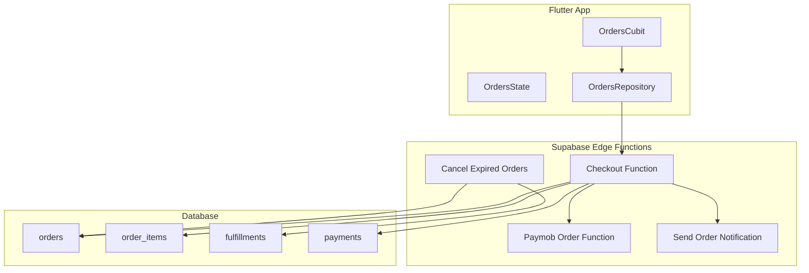
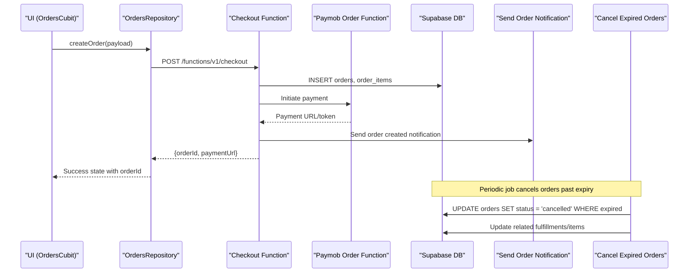
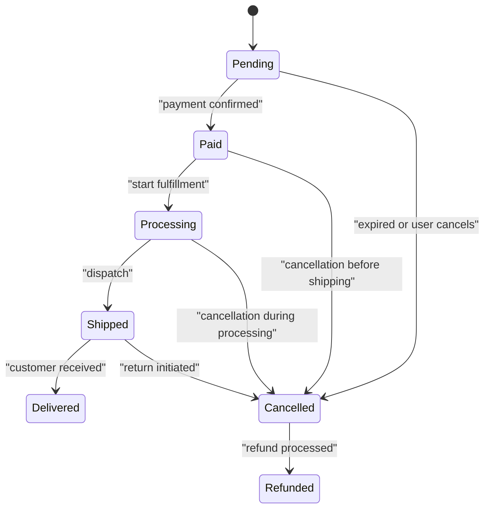
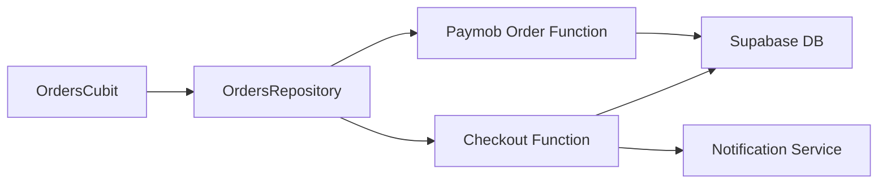

# Order Management

<cite>
**Referenced Files in This Document**
- [lib/features/orders/orders_cubit.dart](file://lib/features/orders/orders_cubit.dart)
- [lib/features/orders/orders_state.dart](file://lib/features/orders/orders_state.dart)
- [lib/features/orders/orders_repository.dart](file://lib/features/orders/orders_repository.dart)
- [supabase/migrations/008_order_fulfillment.sql](file://supabase/migrations/008_order_fulfillment.sql)
- [supabase/migrations/011_orders_idempotency_and_expiry.sql](file://supabase/migrations/011_orders_idempotency_and_expiry.sql)
- [supabase/functions/cancel-expired-orders/index.ts](file://supabase/functions/cancel-expired-orders/index.ts)
- [supabase/functions/checkout/index.ts](file://supabase/functions/checkout/index.ts)
- [supabase/functions/paymob-order/index.ts](file://supabase/functions/paymob-order/index.ts)
- [supabase/functions/send-order-notification/index.ts](file://supabase/functions/send-order-notification/index.ts)
- [test/orders_cubit_test.dart](file://test/orders_cubit_test.dart)
</cite>

## Table of Contents
1. [Introduction](#introduction)
2. [Project Structure](#project-structure)
3. [Core Components](#core-components)
4. [Architecture Overview](#architecture-overview)
5. [Detailed Component Analysis](#detailed-component-analysis)
6. [Dependency Analysis](#dependency-analysis)
7. [Performance Considerations](#performance-considerations)
8. [Troubleshooting Guide](#troubleshooting-guide)
9. [Conclusion](#conclusion)
10. [Appendices](#appendices)

## Introduction
This document explains the order management system, focusing on order history, status tracking, order details display, and lifecycle management. It covers data models, status transitions, fulfillment workflows, idempotency and expiry handling, real-time updates, cancellation processes, returns/refunds, concurrency considerations, and extensibility guidelines for custom order types and shipping integrations.

## Project Structure
The order feature is implemented using a clean architecture with a Cubit-based state layer, a repository abstraction over Supabase, and server-side functions for checkout, payment orchestration, notifications, and scheduled maintenance (e.g., canceling expired orders). Database schema changes are managed via migrations.

**Diagram sources**
- [lib/features/orders/orders_cubit.dart](file://lib/features/orders/orders_cubit.dart)
- [lib/features/orders/orders_repository.dart](file://lib/features/orders/orders_repository.dart)
- [supabase/functions/checkout/index.ts](file://supabase/functions/checkout/index.ts)
- [supabase/functions/paymob-order/index.ts](file://supabase/functions/paymob-order/index.ts)
- [supabase/functions/send-order-notification/index.ts](file://supabase/functions/send-order-notification/index.ts)
- [supabase/functions/cancel-expired-orders/index.ts](file://supabase/functions/cancel-expired-orders/index.ts)
- [supabase/migrations/008_order_fulfillment.sql](file://supabase/migrations/008_order_fulfillment.sql)
- [supabase/migrations/011_orders_idempotency_and_expiry.sql](file://supabase/migrations/011_orders_idempotency_and_expiry.sql)

**Section sources**
- [lib/features/orders/orders_cubit.dart](file://lib/features/orders/orders_cubit.dart)
- [lib/features/orders/orders_state.dart](file://lib/features/orders/orders_state.dart)
- [lib/features/orders/orders_repository.dart](file://lib/features/orders/orders_repository.dart)
- [supabase/migrations/008_order_fulfillment.sql](file://supabase/migrations/008_order_fulfillment.sql)
- [supabase/migrations/011_orders_idempotency_and_expiry.sql](file://supabase/migrations/011_orders_idempotency_and_expiry.sql)
- [supabase/functions/checkout/index.ts](file://supabase/functions/checkout/index.ts)
- [supabase/functions/paymob-order/index.ts](file://supabase/functions/paymob-order/index.ts)
- [supabase/functions/send-order-notification/index.ts](file://supabase/functions/send-order-notification/index.ts)
- [supabase/functions/cancel-expired-orders/index.ts](file://supabase/functions/cancel-expired-orders/index.ts)

## Core Components
- OrdersCubit: Manages UI state for listing orders, fetching order details, updating statuses, and handling errors/loading states.
- OrdersState: Represents current application state for orders (loading, success, error, selected order).
- OrdersRepository: Encapsulates data access to Supabase tables and edge functions; exposes methods for retrieving orders, creating orders, updating statuses, and subscribing to real-time events.
- Supabase Edge Functions: Orchestrate checkout, payment initiation, notifications, and background tasks like canceling expired orders.
- Database Schema: Defines orders, order items, fulfillments, payments, and related constraints and indexes.

Key responsibilities:
- Order retrieval and pagination
- Status transitions with validation
- Real-time updates via Supabase subscriptions
- Idempotent order creation and expiration handling
- Fulfillment lifecycle tracking

**Section sources**
- [lib/features/orders/orders_cubit.dart](file://lib/features/orders/orders_cubit.dart)
- [lib/features/orders/orders_state.dart](file://lib/features/orders/orders_state.dart)
- [lib/features/orders/orders_repository.dart](file://lib/features/orders/orders_repository.dart)
- [supabase/functions/checkout/index.ts](file://supabase/functions/checkout/index.ts)
- [supabase/functions/paymob-order/index.ts](file://supabase/functions/paymob-order/index.ts)
- [supabase/functions/send-order-notification/index.ts](file://supabase/functions/send-order-notification/index.ts)
- [supabase/functions/cancel-expired-orders/index.ts](file://supabase/functions/cancel-expired-orders/index.ts)
- [supabase/migrations/008_order_fulfillment.sql](file://supabase/migrations/008_order_fulfillment.sql)
- [supabase/migrations/011_orders_idempotency_and_expiry.sql](file://supabase/migrations/011_orders_idempotency_and_expiry.sql)

## Architecture Overview
The order flow begins at the UI through OrdersCubit, which delegates to OrdersRepository. The repository calls Supabase edge functions for checkout and payment orchestration. These functions persist orders and items, initiate payments, and send notifications. Background jobs cancel expired orders and update fulfillment records accordingly.

**Diagram sources**
- [lib/features/orders/orders_cubit.dart](file://lib/features/orders/orders_cubit.dart)
- [lib/features/orders/orders_repository.dart](file://lib/features/orders/orders_repository.dart)
- [supabase/functions/checkout/index.ts](file://supabase/functions/checkout/index.ts)
- [supabase/functions/paymob-order/index.ts](file://supabase/functions/paymob-order/index.ts)
- [supabase/functions/send-order-notification/index.ts](file://supabase/functions/send-order-notification/index.ts)
- [supabase/functions/cancel-expired-orders/index.ts](file://supabase/functions/cancel-expired-orders/index.ts)

## Detailed Component Analysis

### OrdersCubit
Responsibilities:
- Load order list and order details
- Create new orders via repository
- Update order status with optimistic/pessimistic strategies
- Manage loading and error states
- Subscribe to real-time updates for live status changes

Typical operations:
- fetchOrders()
- fetchOrderDetails(orderId)
- createOrder(cartItems, address, shipping)
- updateStatus(orderId, newStatus)
- subscribeToOrderUpdates(orderId)

Error handling:
- Maps network and database errors to user-friendly messages
- Retries transient failures where appropriate

Real-time integration:
- Uses Supabase realtime channels to listen for order changes and refresh UI automatically

**Section sources**
- [lib/features/orders/orders_cubit.dart](file://lib/features/orders/orders_cubit.dart)
- [test/orders_cubit_test.dart](file://test/orders_cubit_test.dart)

### OrdersState
Represents:
- List of orders
- Selected order detail
- Loading flags
- Error messages

Transitions:
- Idle -> Loading -> Success/Error
- Refresh triggers re-fetch
- Realtime events trigger partial updates without full reload

**Section sources**
- [lib/features/orders/orders_state.dart](file://lib/features/orders/orders_state.dart)

### OrdersRepository
Abstractions:
- Data access to orders, order_items, fulfillments, payments
- Calls to Supabase edge functions for checkout and payment flows
- Realtime subscription management

Key methods:
- getOrders(userId)
- getOrderById(orderId)
- createOrder(payload)
- updateOrderStatus(orderId, status)
- subscribeToOrder(orderId)

Concurrency safeguards:
- Ensures idempotent order creation via client-generated idempotency keys
- Prevents duplicate inserts by enforcing unique constraints and checks

**Section sources**
- [lib/features/orders/orders_repository.dart](file://lib/features/orders/orders_repository.dart)

### Database Schema and Models
Tables and relationships:
- orders: core order record with status, totals, timestamps, and idempotency/expiry fields
- order_items: line items linked to orders with product references and quantities
- fulfillments: tracks fulfillment stages per order or item
- payments: payment attempts, provider references, and outcomes

Constraints and indexes:
- Unique constraints for idempotency keys
- Foreign keys linking items and fulfillments to orders
- Indexes on status, userId, and expiry time for efficient queries and scheduled jobs

Status model:
- Enumerated values such as pending, paid, processing, shipped, delivered, cancelled, refunded
- Transitions enforced by database policies and business logic

**Section sources**
- [supabase/migrations/008_order_fulfillment.sql](file://supabase/migrations/008_order_fulfillment.sql)
- [supabase/migrations/011_orders_idempotency_and_expiry.sql](file://supabase/migrations/011_orders_idempotency_and_expiry.sql)

### Order Lifecycle and Status Transitions
Lifecycle phases:
- Pending: Created but not yet paid
- Paid: Payment confirmed
- Processing: Preparing for shipment
- Shipped: Dispatched with tracking
- Delivered: Received by customer
- Cancelled: Order voided before fulfillment completion
- Refunded: Money returned after return or cancellation

Transition rules:
- Only valid transitions allowed (e.g., cannot ship an unpaid order)
- Enforced by repository validations and database policies
- Realtime updates propagate transitions to clients

[No diagram sources needed since this diagram shows conceptual workflow, not actual code structure]

### Fulfillment Workflow
Fulfillment entities track:
- Stage progression (picked, packed, shipped, delivered)
- Provider references (carrier, tracking number)
- Timestamps for each stage

Integration points:
- Shipping providers can be integrated via dedicated adapters called from fulfillment services
- Notifications sent when status changes

**Section sources**
- [supabase/migrations/008_order_fulfillment.sql](file://supabase/migrations/008_order_fulfillment.sql)

### Real-time Order Status Updates
Mechanism:
- OrdersRepository subscribes to Supabase realtime channels for specific orders
- On change events, OrdersCubit updates state efficiently
- UI reflects live status without manual refresh

Best practices:
- Debounce rapid updates
- Handle offline scenarios gracefully
- Validate incoming updates against expected transitions

**Section sources**
- [lib/features/orders/orders_repository.dart](file://lib/features/orders/orders_repository.dart)
- [lib/features/orders/orders_cubit.dart](file://lib/features/orders/orders_cubit.dart)

### Order Cancellation Process
Triggers:
- User-initiated cancellation
- Expiration due to payment timeout
- Inventory unavailability

Steps:
- Validate eligibility based on current status
- Update order status to cancelled
- Release reserved stock if applicable
- Initiate refund if payment was captured
- Send cancellation notification

**Section sources**
- [supabase/functions/cancel-expired-orders/index.ts](file://supabase/functions/cancel-expired-orders/index.ts)
- [supabase/migrations/011_orders_idempotency_and_expiry.sql](file://supabase/migrations/011_orders_idempotency_and_expiry.sql)

### Returns and Refund Handling
Flow:
- Return request recorded against order
- Refund initiated via payment provider
- Status updated to refunded upon confirmation
- Inventory restored according to policy

Provider integration:
- Abstraction layer for payment providers
- Retry and idempotency for refund requests

**Section sources**
- [supabase/migrations/008_order_fulfillment.sql](file://supabase/migrations/008_order_fulfillment.sql)
- [supabase/functions/paymob-order/index.ts](file://supabase/functions/paymob-order/index.ts)

### Idempotency and Expiry Handling
Idempotency:
- Client generates unique idempotency key per order creation attempt
- Server enforces uniqueness to prevent duplicates
- Repository passes idempotency key in payload

Expiry:
- Orders have an expiry timestamp
- Scheduled function cancels expired orders and cleans up related records

**Section sources**
- [supabase/migrations/011_orders_idempotency_and_expiry.sql](file://supabase/migrations/011_orders_idempotency_and_expiry.sql)
- [supabase/functions/cancel-expired-orders/index.ts](file://supabase/functions/cancel-expired-orders/index.ts)

### Concurrent Order Processing
Considerations:
- Avoid race conditions when multiple clients update the same order
- Use database-level locks or conditional updates for critical transitions
- Implement retry with exponential backoff for transient failures

Recommendations:
- Prefer optimistic locking with version columns
- Validate transitions server-side
- Log all state changes for auditability

**Section sources**
- [supabase/migrations/008_order_fulfillment.sql](file://supabase/migrations/008_order_fulfillment.sql)
- [supabase/migrations/011_orders_idempotency_and_expiry.sql](file://supabase/migrations/011_orders_idempotency_and_expiry.sql)

### Extending Order Types and Custom Workflows
Guidelines:
- Add new order type enum values and corresponding transition rules
- Extend fulfillment stages per type
- Introduce type-specific metadata in JSONB fields
- Implement custom handlers in edge functions for specialized flows

Shipping provider integration:
- Create adapter interfaces for carriers
- Map provider responses to internal fulfillment statuses
- Store tracking numbers and links in fulfillments table

**Section sources**
- [supabase/migrations/008_order_fulfillment.sql](file://supabase/migrations/008_order_fulfillment.sql)
- [supabase/functions/checkout/index.ts](file://supabase/functions/checkout/index.ts)

## Dependency Analysis
Component coupling:
- OrdersCubit depends on OrdersRepository for data operations
- OrdersRepository depends on Supabase edge functions and database tables
- Edge functions depend on payment providers and notification services

Potential circular dependencies:
- None observed; clear separation between UI, repository, and server functions

External dependencies:
- Payment provider (Paymob)
- Notification service
- Supabase realtime and storage

**Diagram sources**
- [lib/features/orders/orders_cubit.dart](file://lib/features/orders/orders_cubit.dart)
- [lib/features/orders/orders_repository.dart](file://lib/features/orders/orders_repository.dart)
- [supabase/functions/checkout/index.ts](file://supabase/functions/checkout/index.ts)
- [supabase/functions/paymob-order/index.ts](file://supabase/functions/paymob-order/index.ts)
- [supabase/functions/send-order-notification/index.ts](file://supabase/functions/send-order-notification/index.ts)

**Section sources**
- [lib/features/orders/orders_cubit.dart](file://lib/features/orders/orders_cubit.dart)
- [lib/features/orders/orders_repository.dart](file://lib/features/orders/orders_repository.dart)
- [supabase/functions/checkout/index.ts](file://supabase/functions/checkout/index.ts)
- [supabase/functions/paymob-order/index.ts](file://supabase/functions/paymob-order/index.ts)
- [supabase/functions/send-order-notification/index.ts](file://supabase/functions/send-order-notification/index.ts)

## Performance Considerations
- Use pagination for order lists to reduce payload size
- Cache frequently accessed order details locally with invalidation on realtime updates
- Minimize redundant API calls by batching status updates
- Optimize database queries with proper indexes on status, userId, and expiry fields
- Debounce realtime events to avoid excessive UI rebuilds

[No sources needed since this section provides general guidance]

## Troubleshooting Guide
Common issues:
- Duplicate orders: Verify idempotency key usage and unique constraints
- Stale status: Ensure realtime subscriptions are active and error handling retries are in place
- Failed cancellations: Check eligibility rules and transactional integrity
- Payment mismatches: Cross-check payment provider callbacks with order records

Debugging steps:
- Inspect OrdersCubit state transitions and error logs
- Review repository method calls and payloads
- Check edge function logs for checkout and payment flows
- Validate database constraints and policies

**Section sources**
- [test/orders_cubit_test.dart](file://test/orders_cubit_test.dart)
- [supabase/functions/checkout/index.ts](file://supabase/functions/checkout/index.ts)
- [supabase/functions/paymob-order/index.ts](file://supabase/functions/paymob-order/index.ts)
- [supabase/functions/cancel-expired-orders/index.ts](file://supabase/functions/cancel-expired-orders/index.ts)

## Conclusion
The order management system combines a robust Flutter state layer with reliable server-side orchestration and a well-structured database schema. It supports comprehensive lifecycle management, real-time updates, idempotency, expiry handling, and extensible fulfillment workflows. Following the provided guidelines ensures maintainability, scalability, and resilience under concurrent load.

[No sources needed since this section summarizes without analyzing specific files]

## Appendices

### Example Usage Paths
- Creating an order: [createOrder](file://lib/features/orders/orders_cubit.dart) -> [OrdersRepository.createOrder](file://lib/features/orders/orders_repository.dart) -> [Checkout Function](file://supabase/functions/checkout/index.ts)
- Fetching order details: [fetchOrderDetails](file://lib/features/orders/orders_cubit.dart) -> [OrdersRepository.getOrderById](file://lib/features/orders/orders_repository.dart)
- Updating status: [updateStatus](file://lib/features/orders/orders_cubit.dart) -> [OrdersRepository.updateOrderStatus](file://lib/features/orders/orders_repository.dart)
- Realtime updates: [subscribeToOrder](file://lib/features/orders/orders_repository.dart) -> [Supabase Realtime](file://lib/features/orders/orders_repository.dart)

**Section sources**
- [lib/features/orders/orders_cubit.dart](file://lib/features/orders/orders_cubit.dart)
- [lib/features/orders/orders_repository.dart](file://lib/features/orders/orders_repository.dart)
- [supabase/functions/checkout/index.ts](file://supabase/functions/checkout/index.ts)