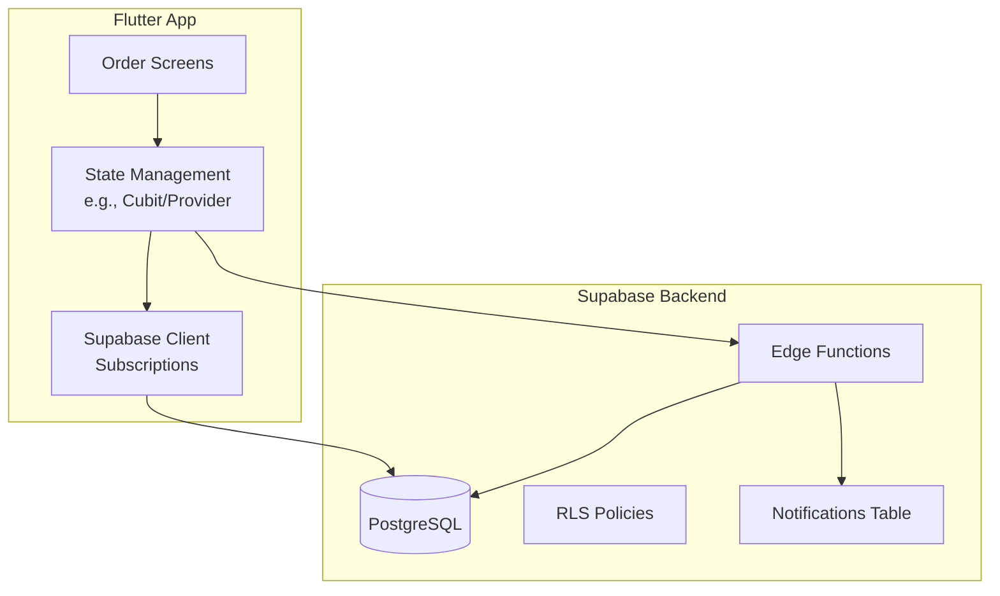
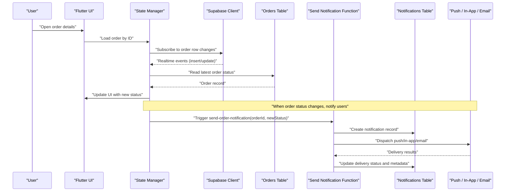
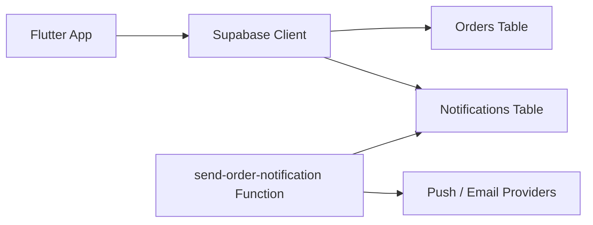

# Order Status Tracking & Real-time Updates

<cite>
**Referenced Files in This Document**
- [supabase-integration.md](file://docs/supabase-integration.md)
- [010_notifications_analytics.sql](file://supabase/migrations/010_notifications_analytics.sql)
- [send-order-notification/index.ts](file://supabase/functions/send-order-notification/index.ts)
- [orders_cubit_test.dart](file://test/orders_cubit_test.dart)
</cite>

## Table of Contents
1. [Introduction](#introduction)
2. [Project Structure](#project-structure)
3. [Core Components](#core-components)
4. [Architecture Overview](#architecture-overview)
5. [Detailed Component Analysis](#detailed-component-analysis)
6. [Dependency Analysis](#dependency-analysis)
7. [Performance Considerations](#performance-considerations)
8. [Troubleshooting Guide](#troubleshooting-guide)
9. [Conclusion](#conclusion)
10. [Appendices](#appendices)

## Introduction
This document explains how order statuses are tracked and updated in real time across clients, with a focus on:
- Managing and synchronizing order status changes
- Using Supabase subscriptions for live updates
- The notifications system (schema, types, delivery mechanisms)
- Push, in-app, and email notification channels
- Error handling, retries, and user preferences
- How to add new notification types and customize delivery channels

The goal is to provide both high-level architecture guidance and concrete implementation references so that developers can implement robust, scalable, and user-friendly order tracking experiences.

## Project Structure
At a high level, the relevant parts of the codebase include:
- Supabase migrations defining database schema and policies
- Edge Functions for server-side processing and outbound notifications
- Flutter tests exercising order-related logic
- Documentation describing Supabase integration patterns

[No sources needed since this diagram shows conceptual workflow, not actual code structure]

## Core Components
- Order state management: Tracks current order status and persists it locally while syncing with the backend.
- Real-time subscriptions: Listens to order table changes via Supabase realtime to update UI instantly.
- Notifications service: Creates notification records and triggers outbound channels (push, in-app, email).
- Edge functions: Server-side handlers for reliable delivery, retries, and integrations with third-party services.
- Database schema: Defines orders and notifications tables, including fields for status, type, payload, and delivery metadata.

Key responsibilities:
- Orders: Source of truth for order lifecycle and status transitions.
- Notifications: Audit trail and delivery control for all user-facing messages.
- Realtime: Ensures consistent UI state across devices without polling.

**Section sources**
- [supabase-integration.md](file://docs/supabase-integration.md)

## Architecture Overview
The system uses a hybrid approach combining client-side realtime subscriptions with server-side edge functions for reliability and scalability.

**Diagram sources**
- [supabase-integration.md:1-200](file://docs/supabase-integration.md#L1-L200)
- [send-order-notification/index.ts:1-200](file://supabase/functions/send-order-notification/index.ts#L1-L200)
- [010_notifications_analytics.sql:1-200](file://supabase/migrations/010_notifications_analytics.sql#L1-L200)

## Detailed Component Analysis

### Order Status Lifecycle and Synchronization
- Status transitions are persisted in the orders table and propagated to clients via Supabase realtime subscriptions.
- Clients subscribe to specific order rows or filtered queries to minimize bandwidth and ensure timely updates.
- Local state is reconciled with server state upon subscription events; conflicts are resolved using timestamps or version fields if present.

Implementation guidelines:
- Subscribe to order updates when entering an order detail screen.
- Unsubscribe when leaving to avoid memory leaks.
- Debounce rapid updates if necessary to reduce UI churn.
- Persist last known status locally for offline resilience.

**Section sources**
- [supabase-integration.md:1-200](file://docs/supabase-integration.md#L1-L200)

### Real-time Notifications with Supabase Subscriptions
- Use Supabase realtime to listen to order table changes.
- Filter by order ID or user context to limit event scope.
- On receiving an update, refresh local state and trigger any side effects (e.g., sound/vibration).

Example patterns:
- Row-level subscription for a single order.
- Channel-based subscription for all orders belonging to a user.
- Conditional listeners based on user preferences.

**Section sources**
- [supabase-integration.md:1-200](file://docs/supabase-integration.md#L1-L200)

### Notifications Table Schema and Types
The notifications table captures all outbound messages and their delivery outcomes. It supports:
- Type classification (e.g., order_status_change, shipping_update, payment_confirmation)
- Target audience (user_id, device tokens, email)
- Payload content (title, body, deep link)
- Delivery metadata (channel, status, attempts, error codes, timestamps)

Typical fields:
- id (primary key)
- user_id (foreign key to profiles/users)
- type (enum-like string)
- title, body, data (payload)
- channel (push, in_app, email)
- status (pending, sent, failed, retrying)
- attempts (integer)
- last_error (string)
- created_at, updated_at (timestamps)

Notification types commonly used:
- order_status_change
- shipping_updated
- payment_confirmed
- delivery_attempted
- delivery_delivered

**Section sources**
- [010_notifications_analytics.sql:1-200](file://supabase/migrations/010_notifications_analytics.sql#L1-L200)

### Edge Function: Send Order Notification
The send-order-notification function centralizes notification creation and dispatch:
- Validates input (order_id, new_status, user_id)
- Persists a notification record
- Dispatches to channels (push, in-app, email)
- Handles errors and schedules retries
- Updates delivery status and logs errors

Operational flow:
- Input validation and authorization checks
- Create notification row with pending status
- For each enabled channel:
  - Attempt delivery
  - Update status to sent or failed
  - Record error details and increment attempt count
- Return aggregated result to caller

Error handling and retries:
- Exponential backoff for transient failures
- Idempotency keys to prevent duplicates
- Dead-letter queue for persistent failures

**Section sources**
- [send-order-notification/index.ts:1-200](file://supabase/functions/send-order-notification/index.ts#L1-L200)

### Flutter Integration and UI Updates
- Subscribe to order updates and map them to UI state changes.
- Show in-app banners or badges for new notifications.
- Provide deep links from push notifications to the relevant order screen.
- Respect user preferences for notification channels and quiet hours.

Testing considerations:
- Mock Supabase realtime events to verify UI reactions.
- Validate that state updates occur only for the active order.
- Ensure cleanup of subscriptions on dispose.

**Section sources**
- [orders_cubit_test.dart:1-200](file://test/orders_cubit_test.dart#L1-L200)

### Error Handling, Retry Mechanisms, and Preferences
- Robust retry strategy with exponential backoff and jitter.
- Idempotent operations using unique request IDs.
- User preference storage for enabling/disabling channels and selecting preferred methods.
- Graceful degradation when channels fail (fallback to in-app).

Guidelines:
- Log detailed error contexts for debugging.
- Surface actionable messages to users when delivery fails.
- Provide settings to manage notification preferences.

**Section sources**
- [send-order-notification/index.ts:1-200](file://supabase/functions/send-order-notification/index.ts#L1-L200)
- [010_notifications_analytics.sql:1-200](file://supabase/migrations/010_notifications_analytics.sql#L1-L200)

### Adding New Notification Types and Customizing Channels
To introduce a new notification type:
- Define the type in the notifications schema or enum.
- Extend the edge function to handle the new type’s payload and routing rules.
- Update client-side listeners to recognize and render the new type.
- Add tests covering creation, delivery, and error scenarios.

Customizing delivery channels:
- Implement per-channel adapters in the edge function.
- Store channel-specific configuration securely.
- Allow user preferences to enable/disable channels.

**Section sources**
- [010_notifications_analytics.sql:1-200](file://supabase/migrations/010_notifications_analytics.sql#L1-L200)
- [send-order-notification/index.ts:1-200](file://supabase/functions/send-order-notification/index.ts#L1-L200)

## Dependency Analysis
High-level dependencies among components:
- Flutter app depends on Supabase client for realtime and API calls.
- Edge functions depend on database writes and external notification providers.
- Notifications table is the source of truth for audit and analytics.

[No sources needed since this diagram shows conceptual relationships, not direct code mappings]

## Performance Considerations
- Prefer row-level subscriptions to reduce payload size.
- Batch UI updates where possible to avoid excessive rebuilds.
- Cache recent notifications locally for quick access.
- Use pagination for historical notifications.
- Monitor network conditions and adapt retry strategies accordingly.

[No sources needed since this section provides general guidance]

## Troubleshooting Guide
Common issues and resolutions:
- Missing realtime events: Verify RLS policies and subscription filters.
- Duplicate notifications: Ensure idempotency keys and deduplication logic.
- Failed deliveries: Check provider credentials, quotas, and error logs.
- Stale UI state: Confirm proper subscription lifecycle and reconnection handling.

Debugging steps:
- Inspect notifications table for pending/failed entries.
- Review edge function logs for error traces.
- Validate user preferences and device tokens.

**Section sources**
- [send-order-notification/index.ts:1-200](file://supabase/functions/send-order-notification/index.ts#L1-L200)
- [010_notifications_analytics.sql:1-200](file://supabase/migrations/010_notifications_analytics.sql#L1-L200)

## Conclusion
By combining Supabase realtime subscriptions with resilient edge functions and a comprehensive notifications schema, the system delivers timely, accurate, and user-centric order status updates. Following the guidelines here ensures scalability, reliability, and a smooth user experience across platforms.

[No sources needed since this section summarizes without analyzing specific files]

## Appendices

### Example Patterns Reference
- Status change listener: Subscribe to order row updates and reconcile local state.
- Notification handler: Process incoming notifications and route to appropriate UI flows.
- UI update: Reflect new status immediately with minimal layout thrash.

For concrete examples, refer to:
- Supabase integration documentation
- Orders cubit tests for state synchronization patterns
- Edge function implementation for notification dispatch

**Section sources**
- [supabase-integration.md:1-200](file://docs/supabase-integration.md#L1-L200)
- [orders_cubit_test.dart:1-200](file://test/orders_cubit_test.dart#L1-L200)
- [send-order-notification/index.ts:1-200](file://supabase/functions/send-order-notification/index.ts#L1-L200)