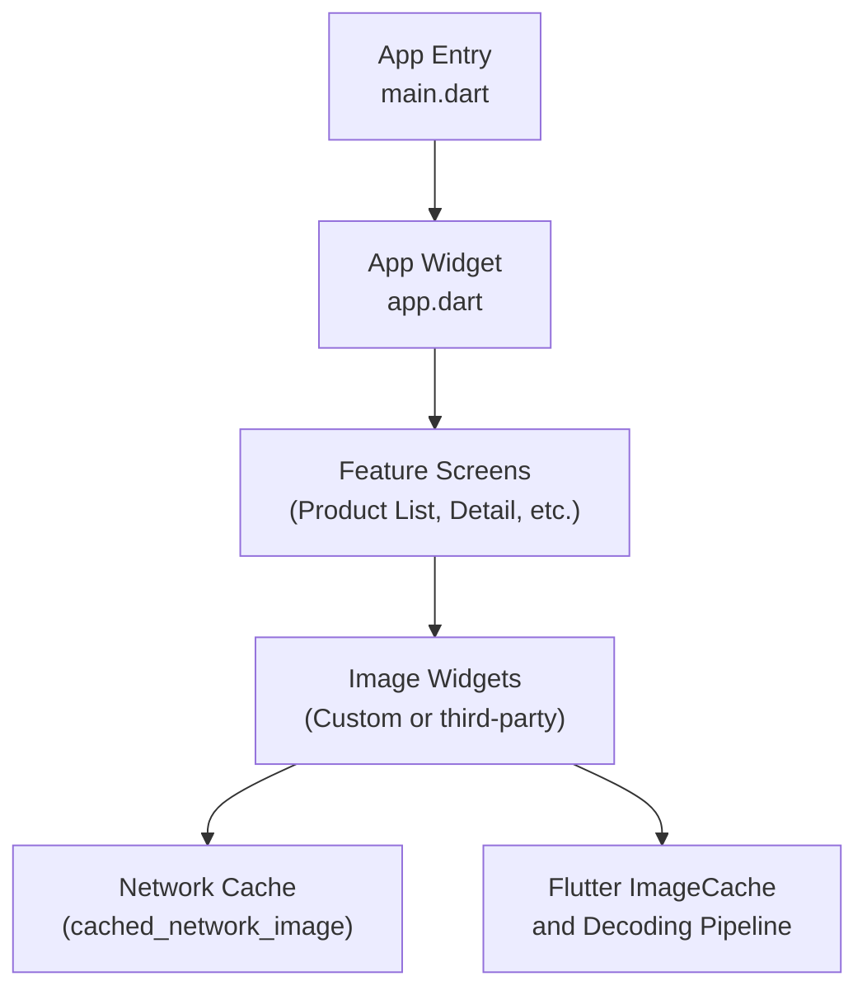
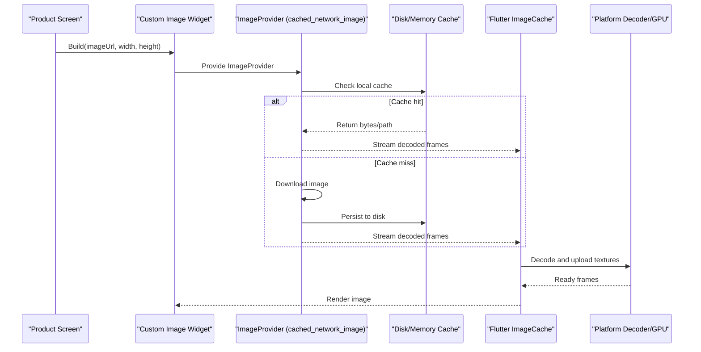
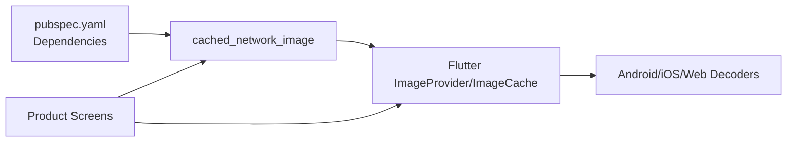

# Image Loading & Caching

<cite>
**Referenced Files in This Document**
- [pubspec.yaml](file://pubspec.yaml)
- [app.dart](file://lib/app.dart)
- [main.dart](file://lib/main.dart)
</cite>

## Table of Contents
1. [Introduction](#introduction)
2. [Project Structure](#project-structure)
3. [Core Components](#core-components)
4. [Architecture Overview](#architecture-overview)
5. [Detailed Component Analysis](#detailed-component-analysis)
6. [Dependency Analysis](#dependency-analysis)
7. [Performance Considerations](#performance-considerations)
8. [Troubleshooting Guide](#troubleshooting-guide)
9. [Conclusion](#conclusion)
10. [Appendices](#appendices)

## Introduction
This document explains image loading and caching strategies for Albatal Store, focusing on efficient product image display, memory management, and robust error handling. It covers:
- Use of Flutter’s ImageProvider ecosystem
- Integration with cached_network_image for network images
- Custom image widgets for placeholders, error states, and lifecycle-aware behavior
- Lazy loading patterns for lists and grids
- Compression and resizing strategies
- Platform-specific optimizations
- Monitoring and diagnostics for image-heavy screens

Where applicable, this guide references concrete files in the repository to ground recommendations in the actual project setup.

## Project Structure
Albatal Store is a Flutter application with platform directories (android, ios, web, windows, linux, macos) and a Dart source tree under lib. The app entry points are main.dart and app.dart. Dependencies, including any image-related packages, are declared in pubspec.yaml.

[No sources needed since this diagram shows conceptual workflow, not actual code structure]

**Section sources**
- [main.dart](file://lib/main.dart)
- [app.dart](file://lib/app.dart)
- [pubspec.yaml](file://pubspec.yaml)

## Core Components
- ImageProvider-based rendering pipeline: Flutter decodes images via ImageProvider implementations, leveraging the framework’s ImageCache for in-memory caching.
- Network image caching: cached_network_image provides disk and memory caching for remote images, with placeholder and error widgets.
- Custom image widget: A reusable widget that encapsulates placeholder, retry, and error UI while delegating to an ImageProvider.
- Lazy loading: Combine list/grid builders with deferred image requests to avoid upfront decoding costs.

Key implementation touchpoints:
- Dependency declarations for image caching libraries
- App initialization where global settings may be configured
- Feature screens that render product images using the above components

**Section sources**
- [pubspec.yaml](file://pubspec.yaml)
- [app.dart](file://lib/app.dart)
- [main.dart](file://lib/main.dart)

## Architecture Overview
The image loading architecture follows a layered approach:
- Presentation layer: Product screens request images through custom widgets.
- Caching layer: cached_network_image manages disk/memory cache and provides fallbacks.
- Framework layer: Flutter’s ImageProvider/ImageCache handles decoding and in-memory caching.
- Platform layer: OS-level decoders and GPU texture upload.

[No sources needed since this diagram shows conceptual workflow, not actual code structure]

## Detailed Component Analysis

### ImageProvider and cached_network_image Integration
- Purpose: Load remote product images efficiently with caching and fallbacks.
- Behavior:
  - On first load, downloads and caches the image locally; subsequent loads use cache.
  - Supports placeholder and error widgets.
  - Integrates with Flutter’s ImageProvider interface so it can be used directly in Image widgets.
- Configuration:
  - Tune cache size and max age at the provider level.
  - Set appropriate headers or authentication if required by your CDN.

Usage pattern:
- In a product grid/list item, pass the image URL to a custom image widget that wraps cached_network_image.
- Provide width/height hints to reduce over-decoding.

**Section sources**
- [pubspec.yaml](file://pubspec.yaml)

### Custom Image Widget
- Responsibilities:
  - Encapsulate placeholder, retry, and error UI.
  - Accept sizing hints (width/height, fit).
  - Handle user interactions (tap to retry, long press to share).
  - Integrate with lazy-loading containers (e.g., ListView.builder, GridView.builder).
- Implementation notes:
  - Use a stateful widget to manage loading/error states.
  - Debounce rapid rebuilds when parent widgets rebuild frequently.
  - Respect accessibility semantics (semanticsLabel, focusable).

Example usage pattern:
- Wrap each product thumbnail with the custom widget, passing imageUrl, width, height, and optional aspect ratio.

**Section sources**
- [pubspec.yaml](file://pubspec.yaml)

### Lazy Loading Patterns
- List/Grid Builders:
  - Use ListView.builder/GridView.builder to defer image creation until visible.
  - Apply shrinkWrap only when necessary; prefer scroll-driven layouts.
- Intersection-style loading:
  - For very large catalogs, consider loading images only when within a viewport margin.
- Preloading strategy:
  - Optionally preload next N items’ images in background to improve perceived performance.

**Section sources**
- [pubspec.yaml](file://pubspec.yaml)

### Memory-Efficient Image Handling
- Size hints:
  - Always provide width/height to avoid decoding oversized images.
- Fit and alignment:
  - Choose BoxFit options that minimize unnecessary scaling.
- ImageCache tuning:
  - Adjust maximum number of entries and bytes based on device class.
- Avoid redundant builds:
  - Use const constructors where possible and stable keys for list items.

**Section sources**
- [pubspec.yaml](file://pubspec.yaml)

### Placeholder Implementations
- Lightweight skeleton:
  - Show a colored box or shimmer animation while loading.
- Semantic placeholders:
  - Include a low-resolution blur or SVG icon to maintain layout stability.
- Error placeholders:
  - Display a friendly message and a retry action.

**Section sources**
- [pubspec.yaml](file://pubspec.yaml)

### Error Handling for Failed Loads
- Network errors:
  - Detect connectivity issues and show a retry button.
- Invalid URLs:
  - Validate URLs before requesting; log failures for analytics.
- Degraded mode:
  - If repeated failures occur, fall back to a default product image.

**Section sources**
- [pubspec.yaml](file://pubspec.yaml)

### Image Compression Strategies
- Server-side:
  - Serve appropriately sized images via CDN with query parameters for width/height.
- Client-side:
  - Request thumbnails for lists and high-res for detail views.
  - Prefer modern formats (WebP/AVIF) when supported.
- Local cache:
  - Allow cached_network_image to store compressed versions to save bandwidth.

**Section sources**
- [pubspec.yaml](file://pubspec.yaml)

### Platform-Specific Optimizations
- Android:
  - Ensure hardware acceleration is enabled.
  - Monitor memory pressure; consider reducing ImageCache size on low-end devices.
- iOS:
  - Leverage system decoders; avoid excessive concurrent downloads.
- Web:
  - Use responsive images and browser cache headers.
  - Consider lazy loading attributes for HTML  equivalents.

**Section sources**
- [pubspec.yaml](file://pubspec.yaml)

### Performance Monitoring for Image-Heavy Screens
- Metrics to track:
  - Time-to-first-frame for images
  - Cache hit rate
  - Memory usage spikes during scrolling
  - Number of failed loads and retries
- Tools:
  - Flutter DevTools (Memory, Timeline)
  - Analytics events for image load success/failure
  - Crash reporting integration for decoder exceptions

**Section sources**
- [pubspec.yaml](file://pubspec.yaml)

## Dependency Analysis
The image subsystem depends on:
- Flutter core ImageProvider/ImageCache
- Third-party caching library (declared in pubspec.yaml)
- Application features that consume images (product screens)

**Diagram sources**
- [pubspec.yaml](file://pubspec.yaml)

**Section sources**
- [pubspec.yaml](file://pubspec.yaml)

## Performance Considerations
- Provide explicit dimensions to avoid over-decoding.
- Use appropriate BoxFit to prevent extra scaling passes.
- Keep ImageCache sizes reasonable for target devices.
- Prefer server-side resizing and format optimization.
- Avoid rebuilding image widgets unnecessarily; stabilize keys and use const where possible.
- Monitor memory and decode times with DevTools.

[No sources needed since this section provides general guidance]

## Troubleshooting Guide
Common issues and resolutions:
- Images not appearing:
  - Verify URL validity and CORS/network permissions.
  - Check placeholder and error widgets to confirm failure paths.
- High memory usage:
  - Reduce ImageCache size and ensure width/height hints are set.
- Stuttering while scrolling:
  - Confirm lazy loading is active; avoid heavy work in build methods.
- Excessive network traffic:
  - Inspect cache configuration and enable compression.

[No sources needed since this section provides general guidance]

## Conclusion
By combining Flutter’s ImageProvider pipeline with cached_network_image and a well-designed custom image widget, Albatal Store can deliver fast, reliable, and memory-efficient image loading across platforms. Proper sizing, caching, and monitoring ensure smooth experiences even in image-heavy product catalogs.

[No sources needed since this section summarizes without analyzing specific files]

## Appendices

### Example Usage Patterns (Conceptual)
- Product thumbnail:
  - Use a custom image widget with width/height hints and a lightweight placeholder.
- Product detail:
  - Load higher-resolution images with a fade-in transition and error retry.
- Infinite list:
  - Combine builder-based lazy loading with preloading of upcoming items.

[No sources needed since this section doesn't analyze specific files]