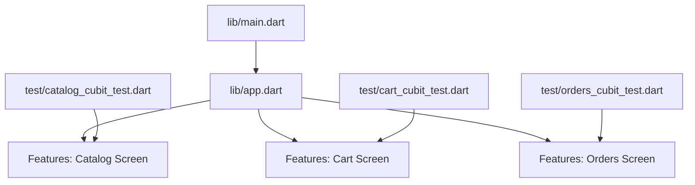
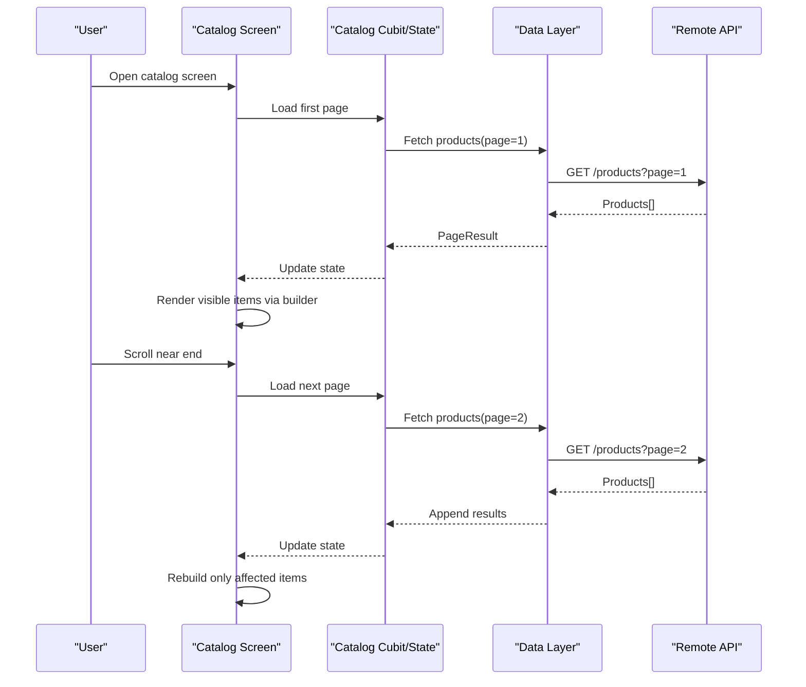
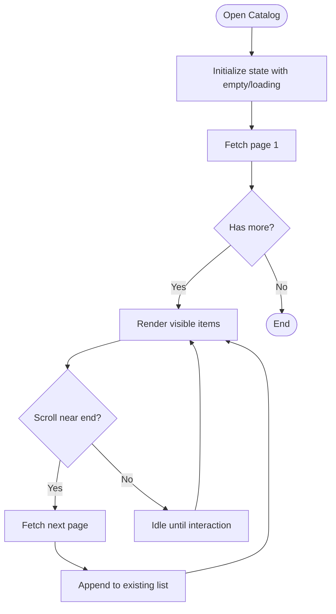
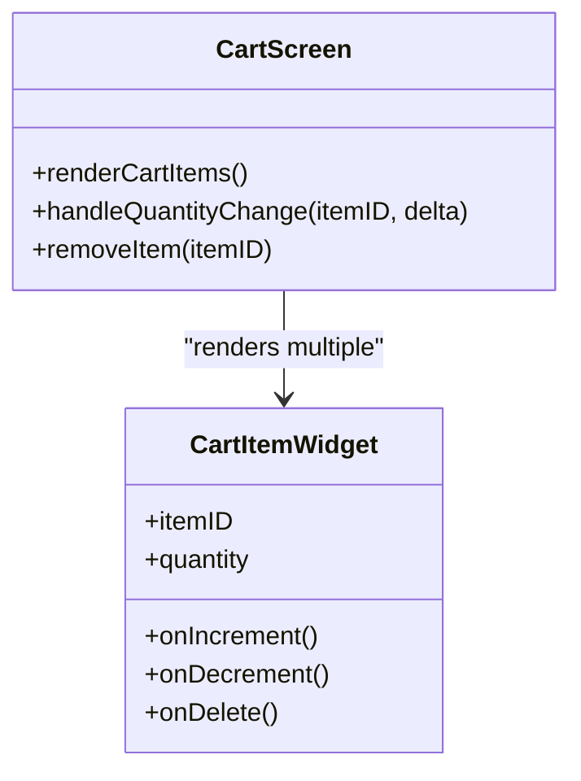
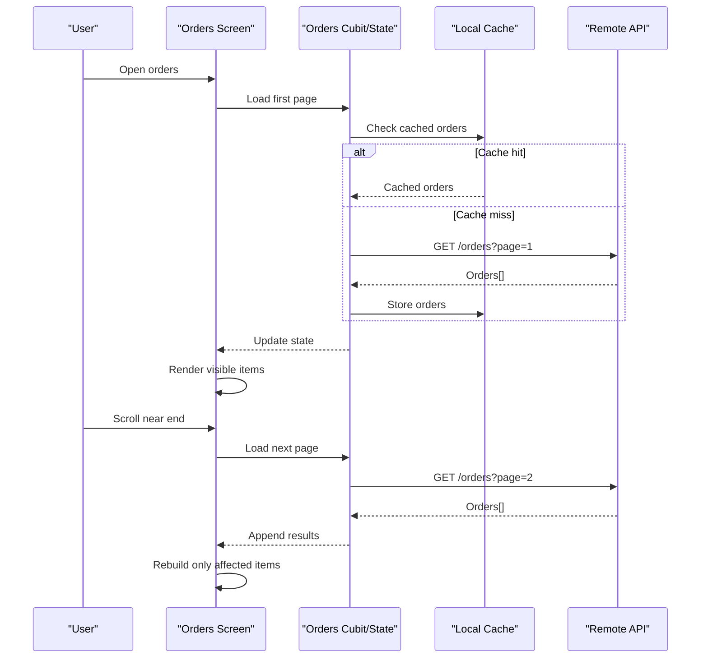
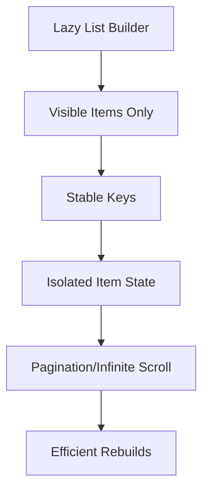
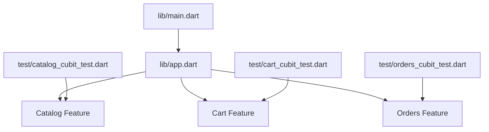

# List Rendering Optimization

<cite>
**Referenced Files in This Document**
- [main.dart](file://lib/main.dart)
- [app.dart](file://lib/app.dart)
- [catalog_cubit_test.dart](file://test/catalog_cubit_test.dart)
- [cart_cubit_test.dart](file://test/cart_cubit_test.dart)
- [orders_cubit_test.dart](file://test/orders_cubit_test.dart)
</cite>

## Table of Contents
1. [Introduction](#introduction)
2. [Project Structure](#project-structure)
3. [Core Components](#core-components)
4. [Architecture Overview](#architecture-overview)
5. [Detailed Component Analysis](#detailed-component-analysis)
6. [Dependency Analysis](#dependency-analysis)
7. [Performance Considerations](#performance-considerations)
8. [Troubleshooting Guide](#troubleshooting-guide)
9. [Conclusion](#conclusion)
10. [Appendices](#appendices)

## Introduction
This document provides a comprehensive guide to list rendering optimization techniques for the Albatal Store application, focusing on efficient long-list UI patterns such as ListView.builder, Sliver-based layouts, and virtual scrolling strategies. It explains widget reuse, key management, efficient state updates, pagination, infinite scrolling, and performance profiling for list-heavy screens like product catalogs, cart items, and order history. The guidance is grounded in the project’s structure and test coverage areas that indicate where these lists are exercised.

## Project Structure
The repository follows a feature-oriented layout under lib with core app entry points and tests covering major features (catalog, cart, orders). While the detailed UI implementations are not included here, the presence of dedicated tests for catalog, cart, and orders indicates these are primary list-driven screens.

**Diagram sources**
- [main.dart](file://lib/main.dart)
- [app.dart](file://lib/app.dart)
- [catalog_cubit_test.dart](file://test/catalog_cubit_test.dart)
- [cart_cubit_test.dart](file://test/cart_cubit_test.dart)
- [orders_cubit_test.dart](file://test/orders_cubit_test.dart)

**Section sources**
- [main.dart](file://lib/main.dart)
- [app.dart](file://lib/app.dart)
- [catalog_cubit_test.dart](file://test/catalog_cubit_test.dart)
- [cart_cubit_test.dart](file://test/cart_cubit_test.dart)
- [orders_cubit_test.dart](file://test/orders_cubit_test.dart)

## Core Components
This section outlines the high-level components involved in list rendering across the app’s main screens. These components are inferred from the test files and typical Flutter patterns used in list-heavy applications.

- Product Catalog Screen
  - Displays paginated or searchable product listings using efficient builders.
  - Integrates with a catalog data layer (cubit/state) to fetch and update pages.
  - Uses slivers or lazy lists to minimize memory footprint during scroll.

- Cart Items Screen
  - Renders a dynamic list of cart entries with quantity controls and item removal.
  - Optimizes rebuilds by scoping state changes to individual items.
  - Supports quick actions without full-screen reflows.

- Order History Screen
  - Presents a chronological list of past orders with status indicators.
  - Implements pagination or infinite loading for large histories.
  - Minimizes layout thrash by separating header sections and item rows.

Key responsibilities:
- Efficient list construction via builder patterns.
- State isolation per item to avoid unnecessary rebuilds.
- Pagination/infinite scroll integration with data fetching.
- Proper key usage for stable widget identity.

[No sources needed since this section provides general guidance]

## Architecture Overview
The list rendering architecture centers around a separation between UI widgets and state management. Builders render only visible items, while state layers manage data paging and item mutations.

**Diagram sources**
- [catalog_cubit_test.dart](file://test/catalog_cubit_test.dart)

## Detailed Component Analysis

### Product Catalog Screen
Focus areas:
- Use ListView.builder or CustomScrollView with SliverList/SliverGrid for virtualized rendering.
- Implement pagination to load more items as the user scrolls.
- Apply keys to each product tile to ensure stable identity and minimal rebuilds.
- Debounce search/filter inputs to reduce rebuild frequency.

Optimization tactics:
- Keep item widgets immutable and lightweight; pass only necessary data.
- Avoid heavy computations inside build; precompute derived values in state.
- Use const constructors for static parts of tiles.
- Separate complex headers/filters into their own widgets to limit rebuild scope.

**Diagram sources**
- [catalog_cubit_test.dart](file://test/catalog_cubit_test.dart)

**Section sources**
- [catalog_cubit_test.dart](file://test/catalog_cubit_test.dart)

### Cart Items Screen
Focus areas:
- Each cart item should be an independent widget with its own state to prevent full-list rebuilds when quantities change.
- Use unique keys per cart entry to preserve item identity across updates.
- Provide inline actions (increment/decrement/remove) that trigger localized state updates.

Optimization tactics:
- Isolate item state using small cubits or valueNotifiers scoped to each row.
- Avoid rebuilding the entire cart list on minor changes.
- Use efficient animations for add/remove transitions.

**Diagram sources**
- [cart_cubit_test.dart](file://test/cart_cubit_test.dart)

**Section sources**
- [cart_cubit_test.dart](file://test/cart_cubit_test.dart)

### Order History Screen
Focus areas:
- Display a paginated list of orders with summary cards.
- Use sliver-based layouts to integrate sticky headers or filters efficiently.
- Ensure stable ordering and keys to maintain scroll position and item identity.

Optimization tactics:
- Preformat dates and statuses at the state layer to avoid repeated formatting in build.
- Use placeholder skeletons for initial loads to improve perceived performance.
- Limit network requests by caching recent pages.

**Diagram sources**
- [orders_cubit_test.dart](file://test/orders_cubit_test.dart)

**Section sources**
- [orders_cubit_test.dart](file://test/orders_cubit_test.dart)

### Conceptual Overview
Conceptually, all three screens follow similar patterns:
- Lazy rendering via builders or slivers.
- State-driven updates with isolated scopes.
- Pagination/infinite scrolling to handle large datasets.
- Stable keys to preserve widget identity and scroll positions.

[No sources needed since this diagram shows conceptual workflow, not actual code structure]

## Dependency Analysis
The following diagram maps the relationship between the app entry points and the test coverage areas that exercise list-heavy features.

**Diagram sources**
- [main.dart](file://lib/main.dart)
- [app.dart](file://lib/app.dart)
- [catalog_cubit_test.dart](file://test/catalog_cubit_test.dart)
- [cart_cubit_test.dart](file://test/cart_cubit_test.dart)
- [orders_cubit_test.dart](file://test/orders_cubit_test.dart)

**Section sources**
- [main.dart](file://lib/main.dart)
- [app.dart](file://lib/app.dart)
- [catalog_cubit_test.dart](file://test/catalog_cubit_test.dart)
- [cart_cubit_test.dart](file://test/cart_cubit_test.dart)
- [orders_cubit_test.dart](file://test/orders_cubit_test.dart)

## Performance Considerations
General recommendations for list-heavy interfaces:
- Prefer ListView.builder or CustomScrollView with SliverList/SliverGrid to leverage virtualization.
- Assign stable, unique keys to each list item to avoid unnecessary rebuilds and preserve scroll state.
- Keep item widgets lean; move heavy logic out of build methods and into state layers.
- Scope state changes to specific items to prevent full-list rebuilds.
- Implement pagination or infinite scrolling to control memory usage and network requests.
- Debounce search/filter inputs and batch state updates.
- Use const constructors for static UI elements within list items.
- Avoid nested scrollables unless necessary; prefer single scrollable containers.
- Profile frame times and identify jank using Flutter DevTools.

[No sources needed since this section provides general guidance]

## Troubleshooting Guide
Common pitfalls and remedies:
- Unnecessary rebuilds
  - Symptom: Entire list rebuilds on minor item changes.
  - Fix: Isolate item state; use smaller widgets and precise keys.
- Excessive widget creation
  - Symptom: High memory usage and GC pressure during scroll.
  - Fix: Use builders/slivers; avoid creating large objects in build.
- Memory leaks in scrollable containers
  - Symptom: Widgets retain references after leaving screen.
  - Fix: Dispose controllers and listeners; avoid global references in items.
- Jank during pagination
  - Symptom: Stutters when loading more items.
  - Fix: Preload next page earlier; show skeletons; optimize image decoding.
- Search/filter causing lag
  - Symptom: Input delays and frequent rebuilds.
  - Fix: Debounce input; compute filtered results in state; memoize derived data.

[No sources needed since this section provides general guidance]

## Conclusion
By combining lazy rendering, stable keys, isolated item state, and pagination/infinite scrolling, the Albatal Store can deliver smooth, responsive list experiences across product catalogs, cart items, and order history. Focus on minimizing rebuild scope, avoiding heavy work in build, and leveraging slivers for complex layouts. Continuously profile performance to catch regressions early.

[No sources needed since this section summarizes without analyzing specific files]

## Appendices
- Practical examples to implement:
  - Product catalog listing with pagination and search debouncing.
  - Cart items with per-item quantity controls and remove actions.
  - Order history with sticky headers and infinite loading.

[No sources needed since this section provides general guidance]