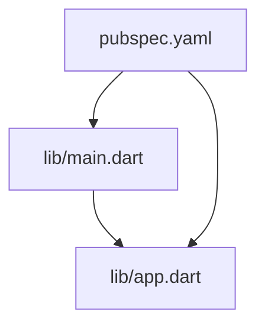
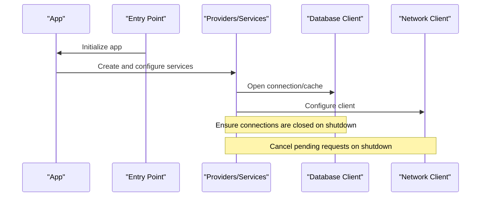
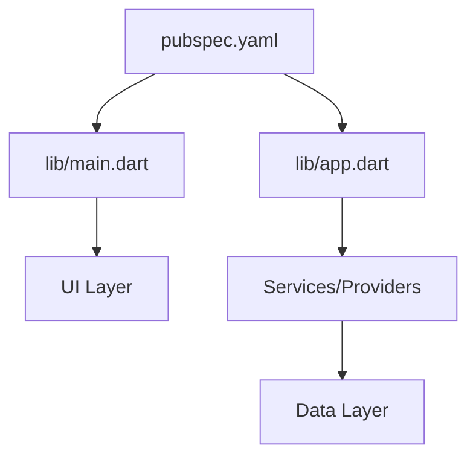

# Memory Management & Leak Prevention

<cite>
**Referenced Files in This Document**
- [main.dart](file://lib/main.dart)
- [app.dart](file://lib/app.dart)
- [pubspec.yaml](file://pubspec.yaml)
</cite>

## Table of Contents
1. [Introduction](#introduction)
2. [Project Structure](#project-structure)
3. [Core Components](#core-components)
4. [Architecture Overview](#architecture-overview)
5. [Detailed Component Analysis](#detailed-component-analysis)
6. [Dependency Analysis](#dependency-analysis)
7. [Performance Considerations](#performance-considerations)
8. [Troubleshooting Guide](#troubleshooting-guide)
9. [Conclusion](#conclusion)
10. [Appendices](#appendices)

## Introduction
This document provides a comprehensive guide to memory management and leak prevention for the Albatal Store application. It focuses on proper disposal of controllers, streams, subscriptions, and resources; widget lifecycle management; context cleanup; and event listener removal. It also includes practical guidance for detecting leaks with Flutter DevTools, heap analysis, and profiling, as well as best practices for handling large datasets, database connections, and network requests. Platform-specific considerations, garbage collection tuning, and memory-efficient data structures are addressed to help you build a stable and efficient app.

## Project Structure
The project follows a standard Flutter layout with platform directories (android, ios, web, windows, linux, macos), feature-oriented Dart code under lib, and configuration files at the root. The entry points relevant to runtime behavior and dependency configuration are:
- Application entry point and bootstrap logic
- Top-level app configuration and provider setup
- Dependency declarations that influence runtime behavior and memory usage

**Diagram sources**
- [main.dart](file://lib/main.dart)
- [app.dart](file://lib/app.dart)
- [pubspec.yaml](file://pubspec.yaml)

**Section sources**
- [main.dart](file://lib/main.dart)
- [app.dart](file://lib/app.dart)
- [pubspec.yaml](file://pubspec.yaml)

## Core Components
This section outlines the key areas where memory management is critical in the application:
- Controllers and state holders: ensure they implement proper disposal patterns and release resources when no longer needed.
- Streams and subscriptions: always cancel subscriptions during widget or controller teardown to prevent dangling references.
- Database and storage clients: close or reset connections and clear caches when appropriate.
- Network clients: cancel in-flight requests and avoid retaining response payloads beyond their scope.
- Widgets and contexts: dispose of temporary objects and remove listeners in lifecycle hooks.

Practical strategies include:
- Implementing a consistent dispose pattern across controllers and services.
- Using scoped providers or singletons with explicit shutdown hooks.
- Avoiding long-lived global references to transient widgets or contexts.
- Applying weak references or IDs instead of direct object references where applicable.

[No sources needed since this section provides general guidance]

## Architecture Overview
At runtime, the app initializes core services and UI layers from the entry point. Proper resource management should be integrated into initialization and shutdown flows.

[No sources needed since this diagram shows conceptual workflow, not actual code structure]

## Detailed Component Analysis

### Controllers and State Holders
- Implement a dispose method to release subscriptions, timers, and cached data.
- Use a factory or builder that guarantees disposal when the owning scope ends.
- Avoid holding references to widgets or BuildContext after navigation.

Best practices:
- Centralize disposal in a base class or mixin if multiple controllers share patterns.
- Expose a clear API to check if a controller is disposed before use.
- Prefer immutable snapshots of data to reduce accidental retention.

[No sources needed since this section provides general guidance]

### Streams and Subscriptions
- Always cancel subscriptions in dispose or when the stream is no longer needed.
- Use auto-canceling stream builders where possible.
- Debounce or throttle high-frequency events to reduce pressure on memory and CPU.

Common pitfalls:
- Forgetting to cancel subscriptions in nested scopes.
- Retaining stream controllers globally without cleanup.
- Accidentally capturing large objects in closures.

[No sources needed since this section provides general guidance]

### Database Connections and Storage
- Close or reset database connections when shutting down or switching users.
- Limit cache sizes and evict least recently used entries.
- Batch writes and avoid excessive transactions.

Platform notes:
- On Android/iOS, ensure native storage plugins are properly closed.
- On Web, manage IndexedDB or local storage limits and clear unused keys.

[No sources needed since this section provides general guidance]

### Network Requests and Clients
- Cancel in-flight requests on route changes or app shutdown.
- Avoid caching entire responses; prefer keyed, size-bounded caches.
- Reuse HTTP clients but reset them on errors or token refresh.

[No sources needed since this section provides general guidance]

### Widget Lifecycle and Context Cleanup
- Remove listeners in dispose or when the widget is unmounted.
- Avoid storing BuildContext in long-lived objects.
- Use const widgets where possible to reduce rebuild overhead.

[No sources needed since this section provides general guidance]

### Event Listeners and Observers
- Unregister observers when no longer needed.
- Use unique identifiers to match registration/unregistration pairs.
- Guard against double-disposal by tracking state.

[No sources needed since this section provides general guidance]

### Data Structures and Large Datasets
- Prefer lightweight models and avoid unnecessary fields.
- Use pagination and virtualization for large lists.
- Apply compression or serialization for large payloads.

[No sources needed since this section provides general guidance]

## Dependency Analysis
Dependencies declared in the project manifest influence runtime memory behavior through plugin implementations and third-party libraries. Review dependencies for known memory issues and ensure versions are up to date.

**Diagram sources**
- [pubspec.yaml](file://pubspec.yaml)
- [main.dart](file://lib/main.dart)
- [app.dart](file://lib/app.dart)

**Section sources**
- [pubspec.yaml](file://pubspec.yaml)
- [main.dart](file://lib/main.dart)
- [app.dart](file://lib/app.dart)

## Performance Considerations
- Profile regularly using Flutter DevTools to detect memory growth and retained objects.
- Monitor heap snapshots over time to identify growing collections or lingering instances.
- Reduce allocations by reusing objects and avoiding unnecessary conversions.
- Optimize image loading and caching strategies to prevent out-of-memory conditions.
- Tune garbage collection indirectly by reducing allocation churn and shortening lifetimes of large objects.

[No sources needed since this section provides general guidance]

## Troubleshooting Guide
Use these steps to detect and fix memory leaks:
- Take heap snapshots in Flutter DevTools and compare before/after navigation or actions.
- Look for retained widgets, controllers, or large collections.
- Verify all subscriptions are canceled and listeners are removed.
- Check for global references to transient objects.
- Validate that database and network clients are closed or reset appropriately.

Common fixes:
- Add dispose calls in widget and controller teardown.
- Replace strong references with weak references or IDs where feasible.
- Implement bounded caches with eviction policies.
- Cancel network requests on route changes.

[No sources needed since this section provides general guidance]

## Conclusion
Effective memory management in Albatal Store hinges on disciplined disposal of controllers, streams, subscriptions, and external resources, combined with careful widget lifecycle management and robust cleanup of listeners and contexts. By integrating profiling into development workflows and following the best practices outlined here, you can minimize leaks, improve stability, and deliver a responsive user experience across platforms.

[No sources needed since this section summarizes without analyzing specific files]

## Appendices

### Practical Techniques and Tools
- Flutter DevTools: Heap snapshots, memory timeline, and widget inspector.
- Profiling: Enable performance overlays and monitor GC activity.
- Testing: Write tests that assert no unexpected retained objects after interactions.

[No sources needed since this section provides general guidance]