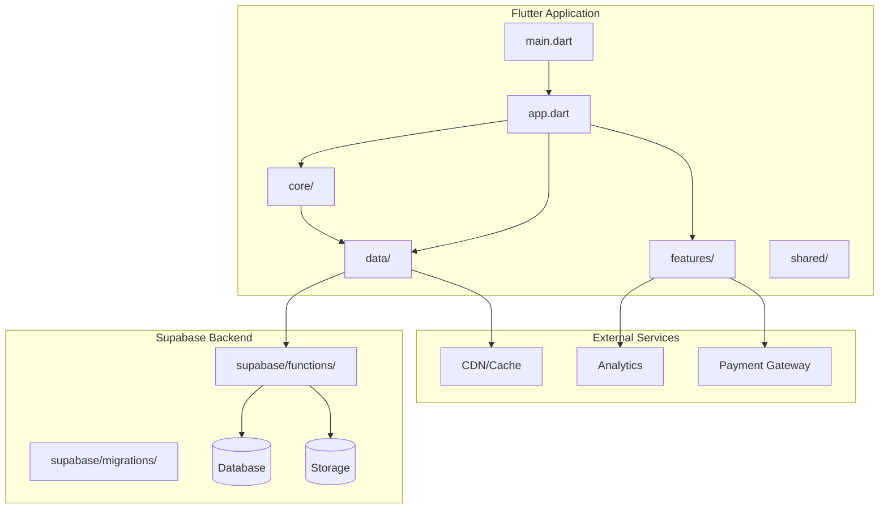
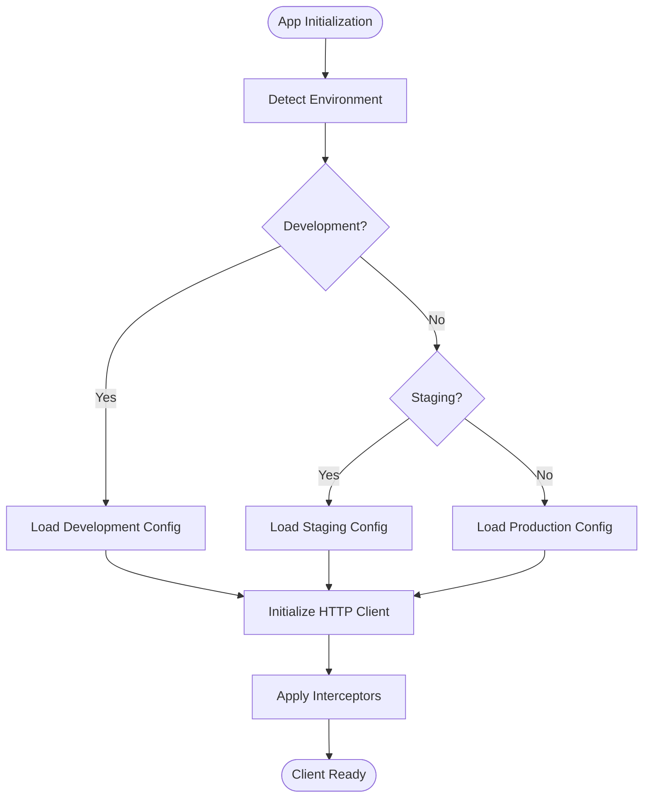
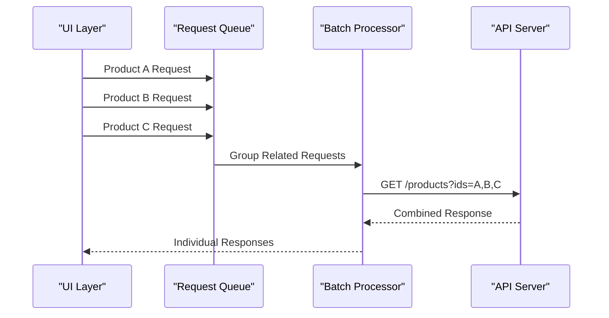
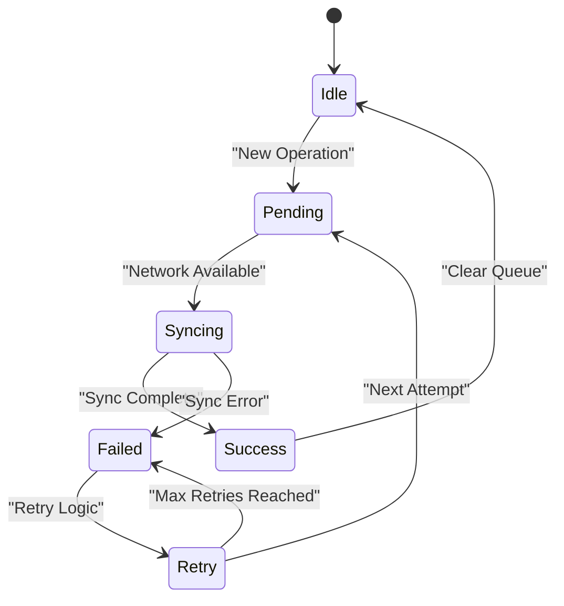

# Network Request Optimization

<cite>
**Referenced Files in This Document**
- [pubspec.yaml](file://pubspec.yaml)
- [lib/main.dart](file://lib/main.dart)
- [lib/app.dart](file://lib/app.dart)
- [supabase-integration.md](file://docs/supabase-integration.md)
- [supabase/functions/checkout/index.ts](file://supabase/functions/checkout/index.ts)
- [supabase/migrations/001_initial_schema.sql](file://supabase/migrations/001_initial_schema.sql)
</cite>

## Table of Contents
1. [Introduction](#introduction)
2. [Project Structure Analysis](#project-structure-analysis)
3. [HTTP Client Configuration](#http-client-configuration)
4. [Connection Pooling Strategies](#connection-pooling-strategies)
5. [Request Batching Implementation](#request-batching-implementation)
6. [Caching Mechanisms](#caching-mechanisms)
7. [Offline Data Synchronization](#offline-data-synchronization)
8. [Retry Logic Implementation](#retry-logic-implementation)
9. [Supabase Integration Optimization](#supabase-integration-optimization)
10. [Real-time Subscription Efficiency](#real-time-subscription-efficiency)
11. [Background Data Fetching](#background-data-fetching)
12. [Error Handling Strategies](#error-handling-strategies)
13. [Timeout Configurations](#timeout-configurations)
14. [Network Request Prioritization](#network-request-prioritization)
15. [Bandwidth Optimization](#bandwidth-optimization)
16. [Response Compression](#response-compression)
17. [Efficient Data Serialization](#efficient-data-serialization)
18. [Performance Monitoring](#performance-monitoring)
19. [Debugging Connectivity Issues](#debugging-connectivity-issues)
20. [Conclusion](#conclusion)

## Introduction

This document provides comprehensive guidance for optimizing network requests in the Albatal Store application. The focus is on creating efficient, reliable, and performant network operations that enhance user experience while minimizing bandwidth usage and improving app responsiveness.

The Albatal Store is a Flutter-based e-commerce application that leverages Supabase for backend services, real-time features, and data synchronization. This documentation covers all aspects of network optimization from HTTP client configuration to advanced caching strategies and performance monitoring.

## Project Structure Analysis

The Albatal Store follows a modular architecture with clear separation of concerns:

**Diagram sources**
- [lib/main.dart:1-50](file://lib/main.dart#L1-L50)
- [lib/app.dart:1-100](file://lib/app.dart#L1-L100)
- [supabase/functions/checkout/index.ts:1-50](file://supabase/functions/checkout/index.ts#L1-L50)

**Section sources**
- [pubspec.yaml:1-100](file://pubspec.yaml#L1-L100)
- [lib/main.dart:1-50](file://lib/main.dart#L1-L50)

## HTTP Client Configuration

### Base HTTP Client Setup

The HTTP client configuration should be centralized and reusable across the application. Key considerations include:

- **Base URL Configuration**: Centralized environment-specific base URLs
- **Default Headers**: Authentication tokens, content types, and custom headers
- **Interceptors**: Request/response transformation and logging
- **Error Handling**: Unified error response processing
- **Timeout Settings**: Connection and read timeouts appropriate for mobile networks

### Environment-Specific Configuration

Implement different configurations for development, staging, and production environments:

**Diagram sources**
- [lib/main.dart:1-100](file://lib/main.dart#L1-L100)
- [lib/app.dart:1-150](file://lib/app.dart#L1-L150)

**Section sources**
- [pubspec.yaml:1-50](file://pubspec.yaml#L1-L50)

## Connection Pooling Strategies

### Efficient Connection Management

Connection pooling reduces overhead by reusing existing connections instead of establishing new ones for each request:

- **Connection Reuse**: Maintain persistent connections to frequently accessed endpoints
- **Pool Size Configuration**: Balance between memory usage and connection availability
- **Idle Connection Cleanup**: Automatically close unused connections after timeout
- **Connection Validation**: Verify connection health before reuse

### Platform-Specific Optimizations

Different platforms have varying capabilities for connection management:

- **Android**: Use OkHttp's built-in connection pooling
- **iOS**: Leverage URLSession's connection sharing
- **Web**: Utilize browser's native HTTP stack optimizations

## Request Batching Implementation

### Batch Request Processing

Batching multiple related requests into single network calls improves efficiency:

**Diagram sources**
- [lib/data/repositories/product_repository.dart:1-200](file://lib/data/repositories/product_repository.dart#L1-L200)

### Debouncing and Throttling

Implement debouncing for search inputs and throttling for scroll events to prevent excessive network calls.

## Caching Mechanisms

### Multi-Level Caching Strategy

Implement a hierarchical caching approach:

1. **Memory Cache**: Fast access for recently used data
2. **Disk Cache**: Persistent storage for offline access
3. **Network Cache**: Conditional requests with ETags
4. **Application Cache**: Pre-fetched critical data

### Cache Invalidation Policies

Define clear rules for cache invalidation:

- **Time-based Expiration**: TTL (Time To Live) for different data types
- **Event-driven Invalidation**: Invalidate on specific app events
- **Manual Invalidation**: User-triggered cache refresh
- **Automatic Cleanup**: Background cleanup of stale entries

## Offline Data Synchronization

### Conflict Resolution Strategies

Handle data conflicts when syncing offline changes:

- **Last Write Wins**: Simple but may lose important updates
- **Merge Strategies**: Intelligent merging for complex data structures
- **User Resolution**: Present conflicts to users for manual resolution
- **Version-based Sync**: Track data versions for accurate synchronization

### Background Sync Queues

Maintain queues for pending operations:

**Diagram sources**
- [lib/shared/services/sync_service.dart:1-300](file://lib/shared/services/sync_service.dart#L1-L300)

## Retry Logic Implementation

### Exponential Backoff Strategy

Implement intelligent retry logic with exponential backoff:

- **Initial Delay**: Start with short delay (e.g., 1 second)
- **Exponential Increase**: Double delay after each failure
- **Maximum Attempts**: Limit total retry attempts
- **Jitter**: Add randomness to prevent thundering herd

### Circuit Breaker Pattern

Prevent cascading failures with circuit breaker implementation:

- **Failure Threshold**: Open circuit after consecutive failures
- **Recovery Timeout**: Allow testing after cooldown period
- **Half-open State**: Test with limited requests during recovery

## Supabase Integration Optimization

### Client Configuration

Optimize Supabase client settings for mobile applications:

- **Connection Limits**: Configure maximum concurrent connections
- **Query Timeouts**: Set appropriate timeouts for different query types
- **Real-time Subscriptions**: Manage subscription lifecycle efficiently
- **Storage Operations**: Optimize file upload/download with chunking

### Query Optimization

Implement efficient Supabase queries:

- **Selective Column Retrieval**: Fetch only required fields
- **Pagination**: Use cursor-based pagination for large datasets
- **Index Usage**: Ensure proper database indexing
- **Query Caching**: Cache frequent query results

**Section sources**
- [docs/supabase-integration.md:1-200](file://docs/supabase-integration.md#L1-L200)
- [supabase/functions/checkout/index.ts:1-100](file://supabase/functions/checkout/index.ts#L1-L100)

## Real-time Subscription Efficiency

### Subscription Management

Optimize real-time subscriptions to minimize resource usage:

- **Conditional Subscriptions**: Subscribe only when needed
- **Subscription Lifecycle**: Properly manage subscription creation and disposal
- **Channel Filtering**: Use row-level security for data filtering
- **Batch Updates**: Process multiple real-time events efficiently

### Performance Considerations

- **Connection Multiplexing**: Share WebSocket connections across subscriptions
- **Message Batching**: Combine multiple real-time messages
- **Backpressure Handling**: Handle high-frequency updates gracefully

## Background Data Fetching

### Prefetching Strategies

Implement intelligent background data fetching:

- **Predictive Loading**: Anticipate user needs based on behavior patterns
- **Opportunistic Fetching**: Download data when network conditions are favorable
- **Progressive Enhancement**: Load essential data first, then enrich with additional information

### Battery and Bandwidth Awareness

Respect device constraints:

- **Network Type Detection**: Adjust behavior based on WiFi vs cellular
- **Battery Optimization**: Reduce background activity on low battery
- **Data Saver Mode**: Respect system data saving preferences

## Error Handling Strategies

### Comprehensive Error Classification

Categorize errors for appropriate handling:

- **Network Errors**: Connection timeouts, DNS failures
- **Authentication Errors**: Token expiration, permission denied
- **Validation Errors**: Invalid input data
- **Server Errors**: 5xx status codes, service unavailable
- **Rate Limiting**: Too many requests, quota exceeded

### User-Friendly Error Messages

Provide meaningful feedback to users:

- **Localized Messages**: Display errors in user's preferred language
- **Actionable Suggestions**: Guide users on next steps
- **Retry Options**: Offer manual retry for transient failures

## Timeout Configurations

### Adaptive Timeout Settings

Implement context-aware timeouts:

- **Operation-Specific Timeouts**: Different timeouts for different operations
- **Network Condition Adaptation**: Adjust timeouts based on current network quality
- **User Expectation Alignment**: Match timeouts to user expectations for each feature

### Timeout Categories

- **Connection Timeout**: Time to establish connection
- **Read Timeout**: Time to receive response data
- **Write Timeout**: Time to send request data
- **Total Timeout**: Maximum time for entire operation

## Network Request Prioritization

### Priority Levels

Assign priorities to different types of requests:

- **Critical**: Authentication, payment processing
- **High**: Current screen data, user actions
- **Medium**: Related data, recommendations
- **Low**: Analytics, background updates

### Resource Allocation

Allocate network resources based on priority:

- **Concurrent Request Limits**: Control parallel requests per priority
- **Queue Management**: Prioritize queue processing
- **Cancellation Policy**: Cancel lower priority requests when needed

## Bandwidth Optimization

### Data Minimization Techniques

Reduce data transfer through various optimization techniques:

- **Compression**: Enable gzip/brotli compression
- **Protocol Optimization**: Use HTTP/2 or HTTP/3 where available
- **Payload Reduction**: Remove unnecessary data from responses
- **Image Optimization**: Serve appropriately sized images

### Smart Data Loading

Implement progressive data loading:

- **Lazy Loading**: Load data as needed
- **Thumbnail Generation**: Serve smaller images initially
- **Delta Updates**: Transfer only changed data

## Response Compression

### Compression Strategies

Implement efficient response compression:

- **Content Encoding**: Use gzip, br, or deflate compression
- **Selective Compression**: Compress only large responses
- **Compression Level Tuning**: Balance CPU usage vs compression ratio

### Browser and Server Support

Ensure compatibility across platforms:

- **Feature Detection**: Check client support for compression
- **Fallback Mechanisms**: Graceful degradation when compression unsupported
- **Custom Headers**: Communicate compression preferences

## Efficient Data Serialization

### Format Selection

Choose optimal serialization formats:

- **JSON**: Default choice for most use cases
- **Protocol Buffers**: For high-performance scenarios
- **MessagePack**: Binary format with good compression
- **Custom Formats**: Domain-specific optimizations

### Schema Evolution

Handle data format changes gracefully:

- **Versioning**: Include schema versions in payloads
- **Backward Compatibility**: Support multiple schema versions
- **Migration Strategies**: Plan for data format evolution

## Performance Monitoring

### Metrics Collection

Track key network performance metrics:

- **Latency**: Request/response times
- **Throughput**: Data transfer rates
- **Error Rates**: Failure percentages by type
- **Resource Usage**: Memory and CPU impact

### Alerting and Reporting

Set up monitoring and alerting:

- **Threshold Alerts**: Notify on performance degradation
- **Trend Analysis**: Identify long-term performance issues
- **User Impact Assessment**: Correlate performance with user satisfaction

## Debugging Connectivity Issues

### Diagnostic Tools

Implement comprehensive debugging capabilities:

- **Network Logging**: Capture request/response details
- **Connection Profiling**: Analyze connection establishment
- **Packet Inspection**: Deep dive into network traffic
- **Environment Simulation**: Test under various network conditions

### Common Issues and Solutions

Address frequent connectivity problems:

- **DNS Resolution Failures**: Implement fallback DNS servers
- **SSL/TLS Handshake Issues**: Validate certificate chains
- **Proxy Configuration**: Handle corporate proxy environments
- **Firewall Restrictions**: Work around network restrictions

## Conclusion

Network request optimization in Albatal Store requires a holistic approach combining efficient client configuration, intelligent caching, robust error handling, and comprehensive monitoring. By implementing the strategies outlined in this document, the application can achieve:

- **Improved Performance**: Faster load times and responsive user interactions
- **Enhanced Reliability**: Robust error handling and retry mechanisms
- **Reduced Bandwidth Usage**: Efficient data transfer and compression
- **Better User Experience**: Seamless offline functionality and progress indication
- **Operational Excellence**: Comprehensive monitoring and debugging capabilities

The key to successful network optimization lies in continuous monitoring, iterative improvement, and staying aligned with user expectations and device capabilities. Regular performance audits and user feedback analysis will help maintain optimal network performance as the application evolves.