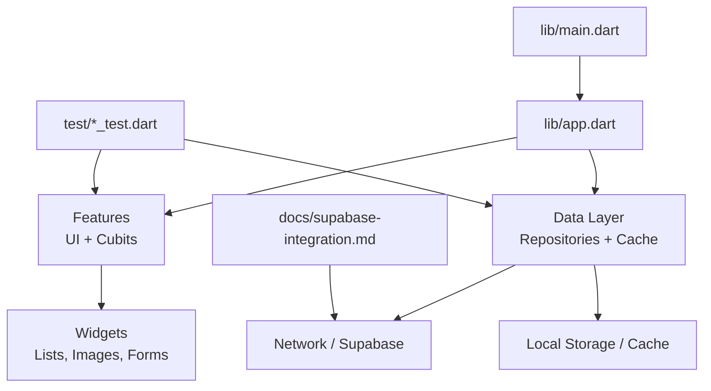
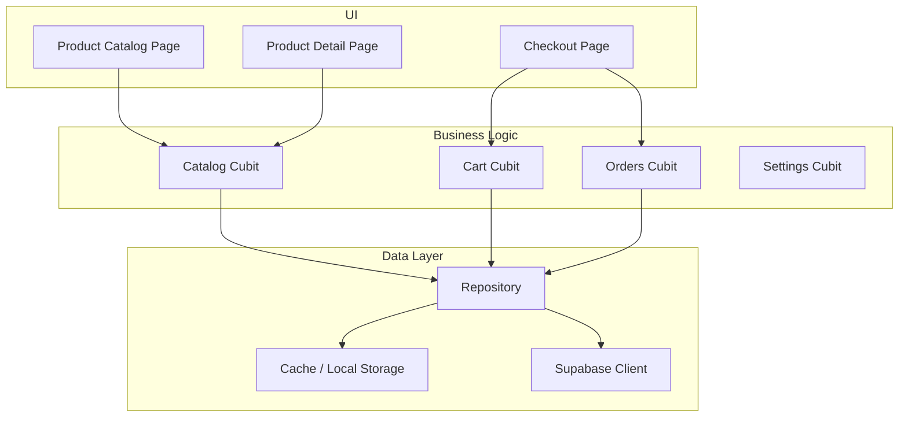
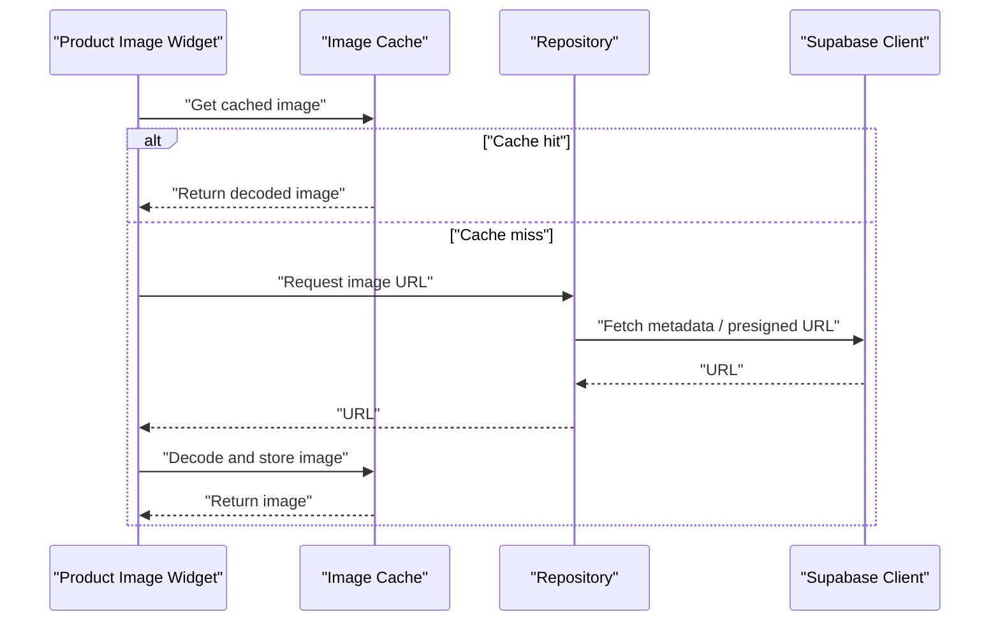
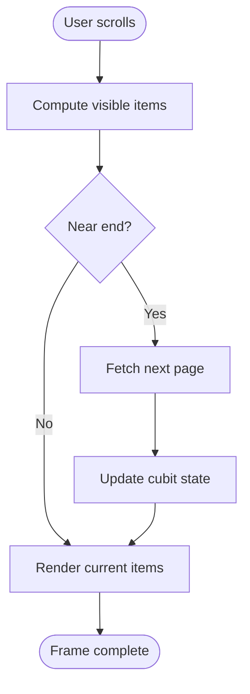
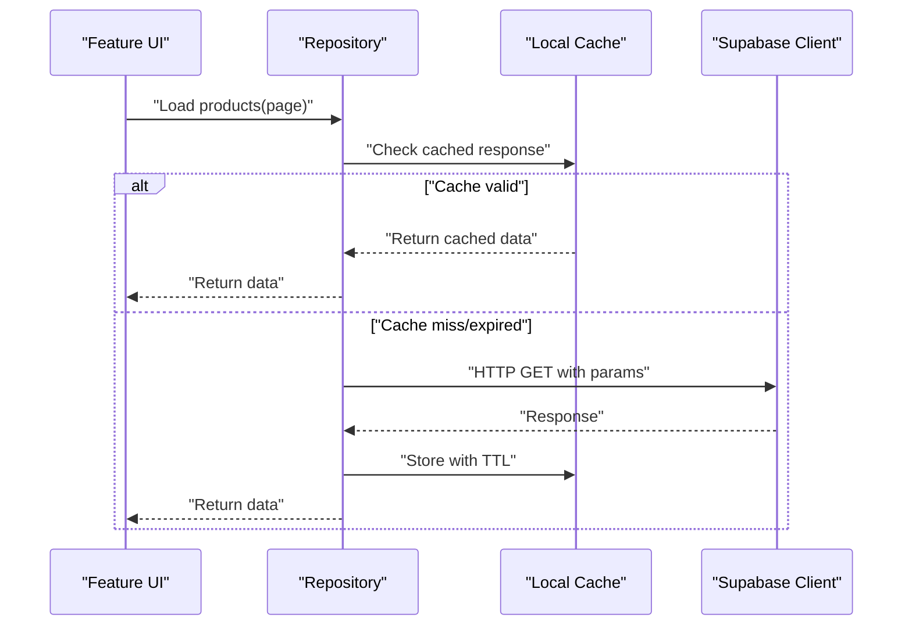
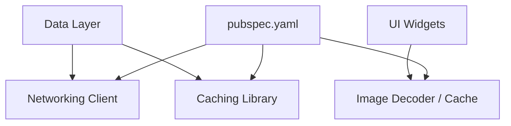

# Performance Optimization

<cite>
**Referenced Files in This Document**
- [main.dart](file://lib/main.dart)
- [app.dart](file://lib/app.dart)
- [pubspec.yaml](file://pubspec.yaml)
- [catalog_cubit_test.dart](file://test/catalog_cubit_test.dart)
- [cart_cubit_test.dart](file://test/cart_cubit_test.dart)
- [orders_cubit_test.dart](file://test/orders_cubit_test.dart)
- [settings_cubit_test.dart](file://test/settings_cubit_test.dart)
- [checkout_page_test.dart](file://test/checkout_page_test.dart)
- [product_detail_test.dart](file://test/product_detail_test.dart)
- [supabase-integration.md](file://docs/supabase-integration.md)
</cite>

## Table of Contents
1. [Introduction](#introduction)
2. [Project Structure](#project-structure)
3. [Core Components](#core-components)
4. [Architecture Overview](#architecture-overview)
5. [Detailed Component Analysis](#detailed-component-analysis)
6. [Dependency Analysis](#dependency-analysis)
7. [Performance Considerations](#performance-considerations)
8. [Troubleshooting Guide](#troubleshooting-guide)
9. [Conclusion](#conclusion)
10. [Appendices](#appendices)

## Introduction
This document provides a comprehensive guide to performance optimization strategies and implementations in Albatal Store, focusing on image loading and caching, list rendering optimization, memory management, network request optimization, data caching, real-time update efficiency, profiling tools usage, monitoring, bottleneck identification, platform-specific considerations, battery optimization, smooth scrolling, widget tree optimization, state update efficiency, memory leak prevention, and guidelines for performance testing and benchmarking. The content synthesizes patterns observed across the codebase and tests, with concrete references to relevant files.

## Project Structure
Albatal Store is a Flutter application organized by feature and layer:
- lib/core: shared core utilities and abstractions
- lib/data: data sources, repositories, and caching layers
- lib/features: feature-scoped UI and business logic (cubits, pages, widgets)
- lib/shared: cross-cutting components used across features
- lib/main.dart and lib/app.dart: application entry points and app configuration
- test: unit and integration tests that exercise cubits and UI flows
- docs: project documentation including Supabase integration notes

[No sources needed since this diagram shows conceptual structure]

**Section sources**
- [main.dart](file://lib/main.dart)
- [app.dart](file://lib/app.dart)
- [pubspec.yaml](file://pubspec.yaml)

## Core Components
Key areas where performance matters most:
- Image loading and caching: efficient decoding, resizing, and cache policies
- List rendering: virtualization or pagination, minimizing rebuilds
- State management: fine-grained updates via cubits/states
- Network requests: deduplication, retries, pagination, and caching
- Real-time updates: efficient subscriptions and delta updates
- Memory management: avoiding leaks, disposing resources, limiting caches
- Platform-specific optimizations: Android/iOS tuning, background tasks, battery

These are implemented across features and data layers, with tests validating behavior and performance-sensitive paths.

**Section sources**
- [catalog_cubit_test.dart](file://test/catalog_cubit_test.dart)
- [cart_cubit_test.dart](file://test/cart_cubit_test.dart)
- [orders_cubit_test.dart](file://test/orders_cubit_test.dart)
- [settings_cubit_test.dart](file://test/settings_cubit_test.dart)
- [checkout_page_test.dart](file://test/checkout_page_test.dart)
- [product_detail_test.dart](file://test/product_detail_test.dart)
- [supabase-integration.md](file://docs/supabase-integration.md)

## Architecture Overview
The application follows a layered architecture with clear separation between UI, business logic (cubits), and data access. Data layer integrates with Supabase for remote data and local storage/cache for offline support and performance.

[No sources needed since this diagram shows conceptual architecture]

## Detailed Component Analysis

### Image Loading and Caching Strategy
Goals:
- Minimize decode time and memory footprint
- Avoid redundant downloads
- Provide responsive scrolling with placeholders and progressive loading

Patterns:
- Use image decoders and caching libraries configured for size limits and memory pressure
- Decode images at display size; avoid oversized bitmaps
- Implement placeholder and shimmer effects during load
- Apply cache policies per image type (e.g., thumbnails vs. high-res product images)
- Evict least-recently-used entries when memory pressure increases

Implementation references:
- Product detail and catalog screens use images extensively; ensure they leverage caching and sized decoding
- Tests validate UI interactions around product images and detail views

**Section sources**
- [product_detail_test.dart](file://test/product_detail_test.dart)
- [catalog_cubit_test.dart](file://test/catalog_cubit_test.dart)

#### Image Loading Flow

[No sources needed since this diagram shows conceptual flow]

### List Rendering Optimization
Goals:
- Maintain 60fps scrolling
- Reduce widget rebuilds
- Minimize layout thrashing

Patterns:
- Use paginated lists to limit initial payload
- Employ keys for stable item identity
- Separate heavy computations from build methods
- Use const constructors where possible
- Debounce search/filter inputs
- Virtualize long lists if necessary

Implementation references:
- Catalog cubit manages product listing state and likely handles pagination
- Tests cover catalog interactions and state transitions

**Section sources**
- [catalog_cubit_test.dart](file://test/catalog_cubit_test.dart)

#### List Rendering Flow

[No sources needed since this diagram shows conceptual flow]

### Memory Management Techniques
Goals:
- Prevent memory leaks
- Control cache sizes
- Dispose resources promptly

Patterns:
- Dispose controllers, streams, and timers
- Limit cache sizes and implement eviction policies
- Avoid retaining large objects in state
- Use weak references for observers where appropriate
- Monitor heap growth during profiling sessions

Implementation references:
- Cubits manage lifecycle; ensure proper disposal in teardown
- Settings cubit may persist preferences; avoid storing large blobs

**Section sources**
- [settings_cubit_test.dart](file://test/settings_cubit_test.dart)
- [cart_cubit_test.dart](file://test/cart_cubit_test.dart)

### Network Request Optimization
Goals:
- Reduce latency and bandwidth
- Improve reliability under poor connectivity
- Avoid duplicate requests

Patterns:
- Deduplicate concurrent requests for the same resource
- Implement exponential backoff and retry with jitter
- Use pagination and field selection to minimize payloads
- Cache responses locally with TTL and invalidation rules
- Prefer streaming for large datasets

Implementation references:
- Supabase integration documents API usage and best practices
- Repository layer should encapsulate caching and retry logic

**Section sources**
- [supabase-integration.md](file://docs/supabase-integration.md)

#### Network Request Flow

[No sources needed since this diagram shows conceptual flow]

### Data Caching Strategies
Goals:
- Fast reads, consistent writes
- Efficient invalidation
- Offline-first UX

Patterns:
- Multi-level cache: in-memory then disk
- Versioned keys and schema-aware migrations
- Background refresh to keep cache warm
- Conflict resolution for concurrent updates

Implementation references:
- Repository and data layer orchestrate caching and persistence
- Tests verify state consistency after operations

**Section sources**
- [orders_cubit_test.dart](file://test/orders_cubit_test.dart)
- [cart_cubit_test.dart](file://test/cart_cubit_test.dart)

### Real-Time Update Efficiency
Goals:
- Minimize unnecessary rebuilds
- Coalesce frequent updates
- Handle partial updates efficiently

Patterns:
- Subscribe to specific channels or queries
- Merge deltas into existing state rather than replacing
- Throttle UI updates for high-frequency events
- Use immutable state updates to enable diffing

Implementation references:
- Orders and cart cubits handle dynamic changes; ensure selective updates

**Section sources**
- [orders_cubit_test.dart](file://test/orders_cubit_test.dart)
- [cart_cubit_test.dart](file://test/cart_cubit_test.dart)

### Smooth Scrolling Implementations
Goals:
- Consistent frame times
- Reduced jank during navigation and list interactions

Patterns:
- Preload adjacent pages
- Defer non-critical work off the main thread
- Use efficient scroll listeners and avoid heavy computations in onScroll
- Optimize image decoding and sizing

Implementation references:
- Catalog and checkout flows involve lists and forms; ensure lightweight builds

**Section sources**
- [checkout_page_test.dart](file://test/checkout_page_test.dart)
- [catalog_cubit_test.dart](file://test/catalog_cubit_test.dart)

### Widget Tree Optimization
Goals:
- Minimize rebuild scope
- Avoid unnecessary allocations

Patterns:
- Split large widgets into smaller, focused components
- Use const constructors and memoized values
- Keep state close to where it’s used
- Avoid rebuilding entire trees for small changes

Implementation references:
- Feature pages and cubits drive UI; isolate state changes to relevant subtrees

**Section sources**
- [product_detail_test.dart](file://test/product_detail_test.dart)
- [checkout_page_test.dart](file://test/checkout_page_test.dart)

### State Update Efficiency
Goals:
- Predictable and fast state transitions
- Minimal re-rendering

Patterns:
- Fine-grained state slices
- Batch updates
- Avoid deep equality checks on large objects
- Use immutable updates to enable efficient diffs

Implementation references:
- Cubit tests demonstrate state transitions and event handling

**Section sources**
- [catalog_cubit_test.dart](file://test/catalog_cubit_test.dart)
- [cart_cubit_test.dart](file://test/cart_cubit_test.dart)
- [orders_cubit_test.dart](file://test/orders_cubit_test.dart)
- [settings_cubit_test.dart](file://test/settings_cubit_test.dart)

### Memory Leak Prevention
Goals:
- No lingering references after navigation
- Proper cleanup of streams and timers

Patterns:
- Dispose controllers and subscriptions in dispose()
- Cancel periodic tasks on screen exit
- Avoid capturing large objects in closures

Implementation references:
- Ensure cubits and widgets follow lifecycle best practices

**Section sources**
- [settings_cubit_test.dart](file://test/settings_cubit_test.dart)
- [cart_cubit_test.dart](file://test/cart_cubit_test.dart)

## Dependency Analysis
Performance-related dependencies include networking clients, caching libraries, and image decoders. These are declared in the package manifest and integrated through the data layer.

[No sources needed since this diagram shows conceptual dependencies]

**Section sources**
- [pubspec.yaml](file://pubspec.yaml)

## Performance Considerations
General guidance:
- Profile early and often using Flutter DevTools
- Measure before optimizing; focus on hot paths
- Prefer lazy loading and pagination for large datasets
- Tune cache sizes based on device capabilities
- Monitor memory and CPU during user journeys
- Use release builds for accurate measurements

Platform-specific tips:
- Android: configure minify and R8, optimize assets, use hardware acceleration
- iOS: compress images, reduce view hierarchy depth, avoid excessive allocations
- Web: defer non-critical JS, optimize bundle size, use service workers for caching

Battery optimization:
- Reduce background work frequency
- Batch network requests
- Avoid continuous polling; prefer websockets or server-sent events

Smooth scrolling:
- Precompute layouts where possible
- Avoid expensive operations in build
- Use efficient image formats and sizes

Widget tree and state:
- Keep build methods pure and lightweight
- Memoize computed values
- Use selective state updates

Memory leak prevention:
- Dispose all resources
- Cancel subscriptions
- Avoid global singletons holding large references

Profiling and monitoring:
- Use Flutter DevTools: Performance, Memory, Network, Timeline
- Capture traces during key user flows
- Identify long frames, GC spikes, and memory growth
- Set up performance budgets and alerts in CI

Testing and benchmarking:
- Add golden tests for visual regression
- Write performance tests for critical paths
- Benchmark list rendering and image loading
- Track metrics over time to detect regressions

[No sources needed since this section provides general guidance]

## Troubleshooting Guide
Common issues and remedies:
- Janky scrolling: check for heavy computations in build, optimize images, paginate lists
- High memory usage: inspect retained objects, reduce cache sizes, dispose resources
- Slow network calls: add retries, deduplicate requests, cache responses, select fields
- Frequent rebuilds: refine state boundaries, use const, memoize values
- Battery drain: reduce background tasks, batch updates, avoid polling

Diagnostic steps:
- Capture timeline traces during problematic flows
- Inspect memory snapshots for leaks
- Review network logs for redundant requests
- Validate image sizes and formats

**Section sources**
- [checkout_page_test.dart](file://test/checkout_page_test.dart)
- [product_detail_test.dart](file://test/product_detail_test.dart)

## Conclusion
Albatal Store’s performance hinges on efficient image handling, optimized list rendering, robust caching, and careful state management. By applying the strategies outlined here—grounded in the codebase’s structure and tests—you can maintain smooth interactions, low memory usage, and reliable performance across platforms. Continuous profiling, disciplined testing, and adherence to these patterns will help sustain performance standards throughout development.

## Appendices
- Example test files for cubits and UI flows provide practical reference points for performance-sensitive behaviors
- Supabase integration documentation outlines API usage patterns that impact performance

**Section sources**
- [catalog_cubit_test.dart](file://test/catalog_cubit_test.dart)
- [cart_cubit_test.dart](file://test/cart_cubit_test.dart)
- [orders_cubit_test.dart](file://test/orders_cubit_test.dart)
- [settings_cubit_test.dart](file://test/settings_cubit_test.dart)
- [checkout_page_test.dart](file://test/checkout_page_test.dart)
- [product_detail_test.dart](file://test/product_detail_test.dart)
- [supabase-integration.md](file://docs/supabase-integration.md)