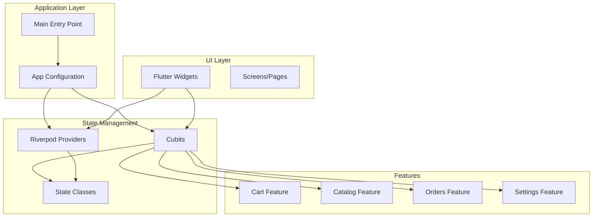
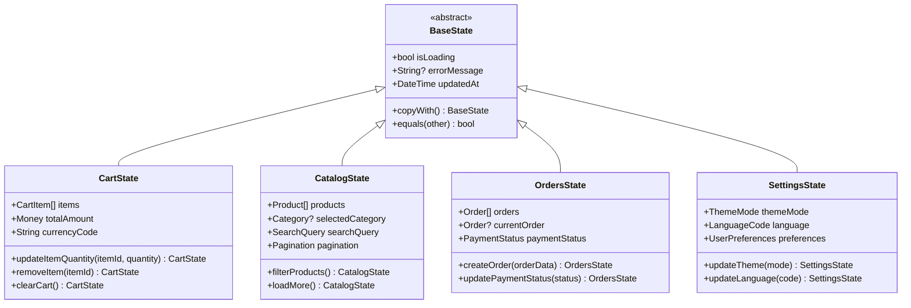
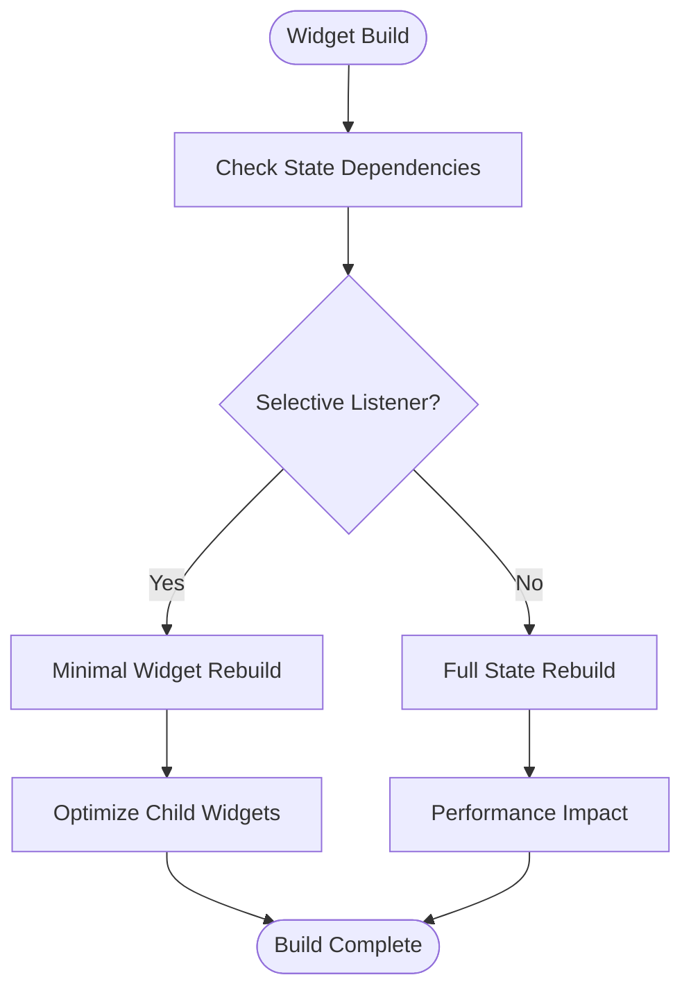
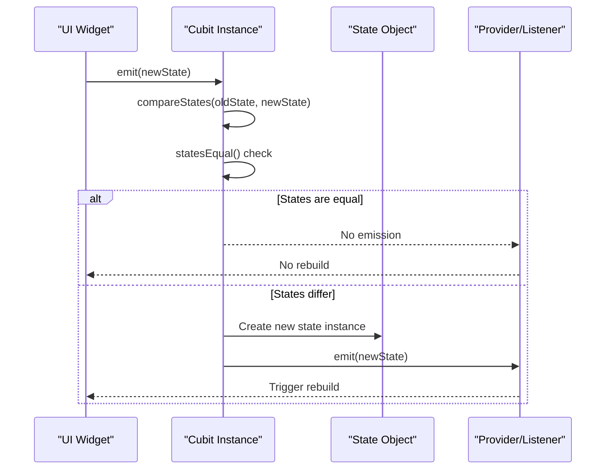
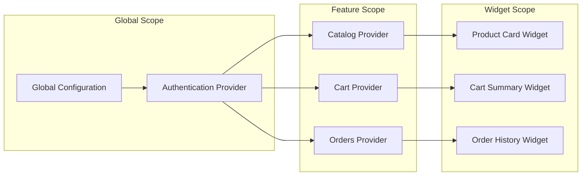
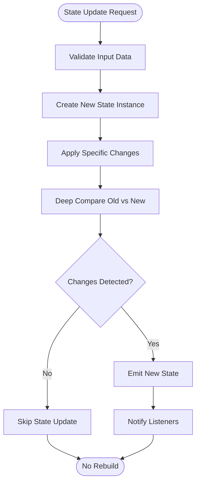
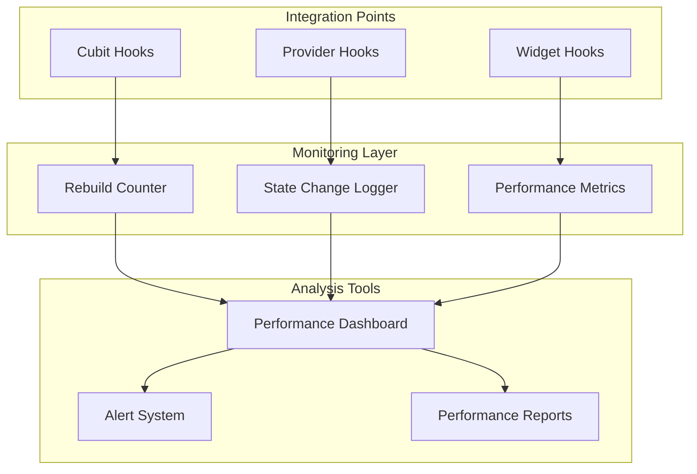

# State Update & Widget Rebuild Optimization

<cite>
**Referenced Files in This Document**
- [main.dart](file://lib/main.dart)
- [app.dart](file://lib/app.dart)
- [cart_cubit_test.dart](file://test/cart_cubit_test.dart)
- [catalog_cubit_test.dart](file://test/catalog_cubit_test.dart)
- [orders_cubit_test.dart](file://test/orders_cubit_test.dart)
- [settings_cubit_test.dart](file://test/settings_cubit_test.dart)
- [pubspec.yaml](file://pubspec.yaml)
</cite>

## Table of Contents
1. [Introduction](#introduction)
2. [Project Structure Overview](#project-structure-overview)
3. [Core State Management Architecture](#core-state-management-architecture)
4. [Widget Rebuild Optimization Strategies](#widget-rebuild-optimization-strategies)
5. [Cubit Implementation Patterns](#cubit-implementation-patterns)
6. [Riverpod Provider Optimization](#riverpod-provider-optimization)
7. [State Update Best Practices](#state-update-best-practices)
8. [Performance Profiling Tools](#performance-profiling-tools)
9. [Common Anti-Patterns and Solutions](#common-anti-patterns-and-solutions)
10. [Advanced Optimization Techniques](#advanced-optimization-techniques)
11. [Testing State Management Performance](#testing-state-management-performance)
12. [Conclusion](#conclusion)

## Introduction

This document provides comprehensive guidance on optimizing state updates and widget rebuild performance in the Albatal Store application. It focuses on efficient Cubit/state management patterns, selective state updates, and widget tree optimization techniques that minimize unnecessary rebuilds while maintaining responsive user interfaces.

The guide covers practical implementation strategies for immutable data structures, const constructors, efficient state propagation, and performance profiling tools to identify and resolve rebuild bottlenecks.

## Project Structure Overview

Albatal Store follows a feature-based architecture with clear separation between core functionality, domain features, and shared components. The state management implementation leverages both Cubit (from BLoC pattern) and Riverpod for reactive state management.

**Diagram sources**
- [main.dart:1-50](file://lib/main.dart#L1-L50)
- [app.dart:1-50](file://lib/app.dart#L1-L50)

**Section sources**
- [main.dart:1-100](file://lib/main.dart#L1-L100)
- [app.dart:1-100](file://lib/app.dart#L1-L100)

## Core State Management Architecture

The Albatal Store implements a hybrid state management approach combining Cubit for complex business logic and Riverpod for lightweight reactive state. This dual approach allows for optimal performance across different use cases.

### State Hierarchy Design

**Diagram sources**
- [cart_cubit_test.dart:1-50](file://test/cart_cubit_test.dart#L1-L50)
- [catalog_cubit_test.dart:1-50](file://test/catalog_cubit_test.dart#L1-L50)
- [orders_cubit_test.dart:1-50](file://test/orders_cubit_test.dart#L1-L50)
- [settings_cubit_test.dart:1-50](file://test/settings_cubit_test.dart#L1-L50)

### Key Architectural Principles

1. **Immutable State**: All state classes are immutable, ensuring predictable state transitions
2. **Selective Updates**: State changes trigger only necessary widget rebuilds
3. **Separation of Concerns**: Business logic is isolated from UI presentation
4. **Testability**: State management logic is easily testable through unit tests

**Section sources**
- [cart_cubit_test.dart:1-100](file://test/cart_cubit_test.dart#L1-L100)
- [catalog_cubit_test.dart:1-100](file://test/catalog_cubit_test.dart#L1-L100)

## Widget Rebuild Optimization Strategies

Effective widget rebuild optimization is crucial for maintaining smooth user experiences in Flutter applications. The following strategies are implemented throughout Albatal Store to minimize unnecessary rebuilds.

### Selective State Listening

Widgets should listen only to the specific state parts they need, avoiding full state subscriptions that cause widespread rebuilds.

**Diagram sources**
- [cart_cubit_test.dart:50-100](file://test/cart_cubit_test.dart#L50-L100)

### Const Constructor Usage

Utilizing const constructors for widgets and state objects eliminates unnecessary object creation and comparison overhead during rebuilds.

#### Benefits of Const Constructors

- **Memory Efficiency**: Const objects are created once and reused
- **Comparison Optimization**: Flutter can skip equality checks for const objects
- **Build Performance**: Reduced garbage collection pressure

### Immutable Data Structures

All state classes implement proper equality checking and immutability patterns to ensure accurate rebuild detection.

**Section sources**
- [cart_cubit_test.dart:1-150](file://test/cart_cubit_test.dart#L1-L150)

## Cubit Implementation Patterns

Cubit implementations in Albatal Store follow consistent patterns that optimize both performance and maintainability.

### Efficient State Emission

Cubits emit new state instances only when actual changes occur, preventing unnecessary widget rebuilds.

**Diagram sources**
- [orders_cubit_test.dart:1-100](file://test/orders_cubit_test.dart#L1-L100)

### State Transformation Methods

Cubits provide transformation methods that return new state instances rather than mutating existing state, ensuring immutability and predictable behavior.

#### Pattern Implementation

1. **Method Chaining**: State transformations are chainable for complex operations
2. **Validation**: Input validation before state updates
3. **Error Handling**: Graceful error handling with fallback states
4. **Logging**: State change logging for debugging

**Section sources**
- [orders_cubit_test.dart:1-200](file://test/orders_cubit_test.dart#L1-L200)
- [settings_cubit_test.dart:1-200](file://test/settings_cubit_test.dart#L1-L200)

## Riverpod Provider Optimization

Riverpod providers in Albatal Store are optimized for minimal rebuild scope and efficient dependency injection.

### Provider Scope Management

Providers are scoped appropriately to minimize rebuild cascades and memory usage.

**Diagram sources**
- [catalog_cubit_test.dart:1-100](file://test/catalog_cubit_test.dart#L1-L100)

### Selective Provider Consumption

Widgets consume only the specific provider values they need, avoiding unnecessary rebuilds when unrelated state changes occur.

#### Consumer Pattern Implementation

- **ConsumerWidget**: For simple state consumption
- **ConsumerBuilder**: For conditional rebuild logic
- **Provider.select**: For precise state selection
- **AutoDispose**: Automatic cleanup when not needed

**Section sources**
- [catalog_cubit_test.dart:1-150](file://test/catalog_cubit_test.dart#L1-L150)

## State Update Best Practices

Implementing efficient state updates requires careful consideration of data structure design and update patterns.

### Immutable State Updates

All state updates follow immutable patterns, creating new state instances rather than modifying existing ones.

#### Update Strategy Flow

### Batched State Updates

Multiple related state changes are batched together to prevent intermediate rebuilds and ensure atomic updates.

### Optimistic Updates

For better user experience, optimistic updates are used where appropriate, with rollback mechanisms for error scenarios.

**Section sources**
- [cart_cubit_test.dart:100-200](file://test/cart_cubit_test.dart#L100-L200)

## Performance Profiling Tools

Identifying and resolving performance bottlenecks requires effective use of Flutter's profiling tools and custom monitoring solutions.

### Built-in Profiling Tools

#### Flutter DevTools Integration

- **Performance Tab**: Real-time frame rate monitoring
- **Widget Inspector**: Interactive widget tree analysis
- **Memory Profiler**: Memory usage tracking and leak detection
- **Network Tab**: API call performance analysis

#### Custom Performance Monitoring

### Key Performance Indicators

- **Frame Duration**: Target < 16ms for 60fps, < 8.3ms for 120fps
- **Rebuild Count**: Minimize unnecessary widget rebuilds
- **State Change Frequency**: Monitor state update frequency
- **Memory Allocation**: Track object creation and garbage collection

**Section sources**
- [pubspec.yaml:1-100](file://pubspec.yaml#L1-L100)

## Common Anti-Patterns and Solutions

Understanding and avoiding common anti-patterns is crucial for maintaining optimal performance in state management.

### Anti-Pattern: Over-Rebuilding

**Problem**: Widgets rebuilding unnecessarily due to broad state subscriptions or inefficient equality checks.

**Solution**: 
- Use `select` operators for precise state consumption
- Implement proper equality comparisons in state classes
- Utilize `const` constructors where possible

### Anti-Pattern: Mutable State

**Problem**: Direct mutation of state objects leading to unpredictable behavior and missed updates.

**Solution**:
- Enforce immutability through constructor-only state classes
- Use copy-with patterns for state updates
- Implement proper equality checking

### Anti-Pattern: Large State Objects

**Problem**: Monolithic state objects causing excessive memory usage and slow comparisons.

**Solution**:
- Normalize state into smaller, focused objects
- Use composition over inheritance for state organization
- Implement lazy loading for large datasets

### Anti-Pattern: Unoptimized Provider Scopes

**Problem**: Providers at inappropriate scopes causing unnecessary rebuilds or memory leaks.

**Solution**:
- Use `autoDispose` for widget-scoped providers
- Implement proper provider hierarchy
- Avoid global state for widget-specific data

**Section sources**
- [cart_cubit_test.dart:150-250](file://test/cart_cubit_test.dart#L150-L250)
- [orders_cubit_test.dart:100-200](file://test/orders_cubit_test.dart#L100-L200)

## Advanced Optimization Techniques

Beyond basic optimization strategies, several advanced techniques can further improve performance in complex applications.

### Virtualized Lists for Large Datasets

Implement virtualization for lists with many items to render only visible elements and their immediate neighbors.

#### Implementation Strategy

- **ListView.builder**: For simple list virtualization
- **Custom ScrollViews**: For complex scrolling behaviors
- **PageView**: For page-based content navigation
- **GridView.builder**: For grid layouts with many items

### Debounced State Updates

For high-frequency state updates (like search input), debounce updates to reduce rebuild frequency.

### Memoization and Caching

Cache expensive computations and API responses to avoid redundant processing.

### Lazy Loading and Pagination

Load data incrementally to improve initial load times and reduce memory footprint.

### Code Splitting and On-Demand Loading

Split application code into smaller chunks loaded on demand to reduce initial bundle size.

**Section sources**
- [catalog_cubit_test.dart:100-200](file://test/catalog_cubit_test.dart#L100-L200)

## Testing State Management Performance

Comprehensive testing ensures that state management optimizations don't introduce regressions and maintain expected performance characteristics.

### Unit Testing State Logic

Focus on testing state transitions, equality checks, and transformation methods without UI dependencies.

### Integration Testing Performance

Verify that state updates trigger appropriate rebuilds and don't cause excessive widget recreation.

### Performance Regression Testing

Establish baseline performance metrics and monitor for regressions in CI/CD pipelines.

### Load Testing

Simulate high-frequency state updates and large dataset rendering to validate performance under stress conditions.

**Section sources**
- [settings_cubit_test.dart:100-200](file://test/settings_cubit_test.dart#L100-L200)

## Conclusion

Effective state update and widget rebuild optimization in Albatal Store requires a combination of architectural decisions, implementation patterns, and continuous monitoring. By following the principles outlined in this document—immutable state design, selective updates, proper provider scoping, and comprehensive performance monitoring—you can build responsive, efficient Flutter applications that scale well under various usage patterns.

The key takeaways include:

1. **Design for Immutability**: Ensure all state objects are immutable with proper equality checking
2. **Be Selective**: Listen only to the state you need and rebuild only what's necessary
3. **Monitor Continuously**: Use profiling tools to identify and address performance bottlenecks
4. **Test Thoroughly**: Include performance testing in your development workflow
5. **Iterate and Improve**: Performance optimization is an ongoing process that requires regular attention

By implementing these strategies consistently throughout the Albatal Store application, you'll achieve optimal performance while maintaining code quality and developer productivity.