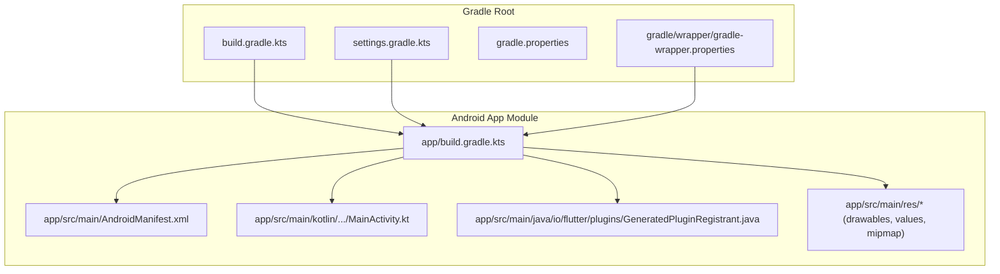
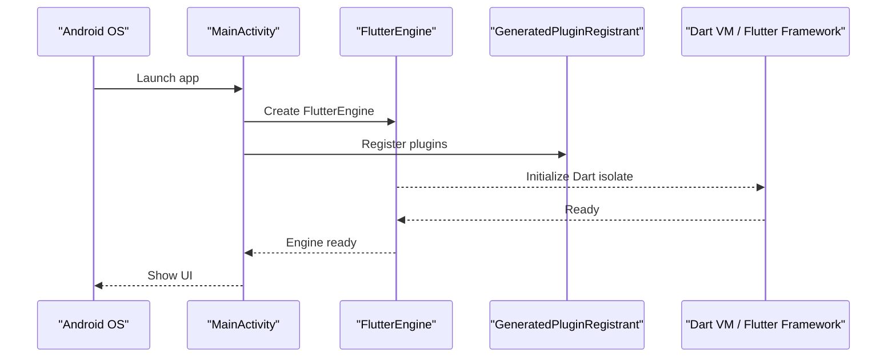
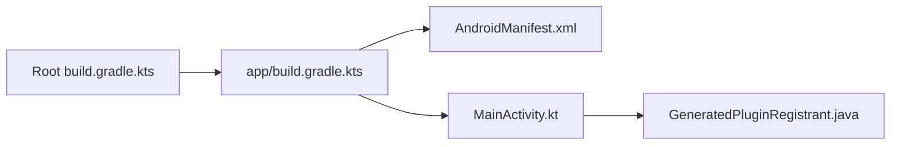

# Android Platform Implementation

<cite>
**Referenced Files in This Document**
- [AndroidManifest.xml](file://android/app/src/main/AndroidManifest.xml)
- [MainActivity.kt](file://android/app/src/main/kotlin/com/example/albatal_store/MainActivity.kt)
- [app/build.gradle.kts](file://android/app/build.gradle.kts)
- [build.gradle.kts](file://android/build.gradle.kts)
- [settings.gradle.kts](file://android/settings.gradle.kts)
- [gradle-wrapper.properties](file://android/gradle/wrapper/gradle-wrapper.properties)
- [GeneratedPluginRegistrant.java](file://android/app/src/main/java/io/flutter/plugins/GeneratedPluginRegistrant.java)
</cite>

## Table of Contents
1. [Introduction](#introduction)
2. [Project Structure](#project-structure)
3. [Core Components](#core-components)
4. [Architecture Overview](#architecture-overview)
5. [Detailed Component Analysis](#detailed-component-analysis)
6. [Dependency Analysis](#dependency-analysis)
7. [Performance Considerations](#performance-considerations)
8. [Troubleshooting Guide](#troubleshooting-guide)
9. [Conclusion](#conclusion)
10. [Appendices](#appendices)

## Introduction
This document explains the Android platform implementation for the Flutter application. It covers the Android manifest configuration, Gradle build setup, MainActivity and Flutter plugin registration, Gradle wrapper usage, native integration patterns, debugging and profiling, and building/signing for release including Google Play Store preparation. The goal is to help developers understand how the Android side integrates with Flutter and how to extend or maintain it effectively.

## Project Structure
The Android module follows the standard Flutter template layout:
- app module contains the Android application code and resources
- gradle wrapper provides a consistent Gradle version across environments
- settings.gradle.kts configures included modules and repositories
- GeneratedPluginRegistrant.java is auto-generated by Flutter tooling to register plugins at runtime

[No sources needed since this diagram shows conceptual structure]

## Core Components
- AndroidManifest.xml: Declares permissions, activities, services, receivers, and intent filters required by the app and its plugins.
- MainActivity.kt: Entry point activity that initializes FlutterEngine and registers plugins via GeneratedPluginRegistrant.
- app/build.gradle.kts: Configures compileSdk/targetSdk/minSdk, dependencies, signingConfigs, buildTypes, and product flavors if used.
- build.gradle.kts (root): Applies Android Gradle Plugin and Kotlin plugin versions centrally.
- settings.gradle.kts: Includes the app module and configures repository management.
- GeneratedPluginRegistrant.java: Auto-generated class that registers all Flutter plugins during startup.

Key responsibilities:
- Manifest: system-level declarations such as internet access, storage, notifications, background execution, and custom scheme handlers.
- MainActivity: minimal Flutter bootstrap; optional overrides for lifecycle hooks or platform channel handling.
- Gradle files: reproducible builds, dependency resolution, signing, and variant-specific configurations.

**Section sources**
- [AndroidManifest.xml](file://android/app/src/main/AndroidManifest.xml)
- [MainActivity.kt](file://android/app/src/main/kotlin/com/example/albatal_store/MainActivity.kt)
- [app/build.gradle.kts](file://android/app/build.gradle.kts)
- [build.gradle.kts](file://android/build.gradle.kts)
- [settings.gradle.kts](file://android/settings.gradle.kts)
- [GeneratedPluginRegistrant.java](file://android/app/src/main/java/io/flutter/plugins/GeneratedPluginRegistrant.java)

## Architecture Overview
Flutter’s Android architecture centers around an Activity hosting a FlutterEngine. Plugins are registered automatically, and platform channels enable communication between Dart and native code.

**Diagram sources**
- [MainActivity.kt](file://android/app/src/main/kotlin/com/example/albatal_store/MainActivity.kt)
- [GeneratedPluginRegistrant.java](file://android/app/src/main/java/io/flutter/plugins/GeneratedPluginRegistrant.java)

## Detailed Component Analysis

### AndroidManifest.xml Configuration
Purpose:
- Declare permissions required by the app and plugins (e.g., network, storage, notifications).
- Define the main Activity and any additional Activities or Services.
- Configure intent filters for deep links, share targets, or custom schemes.
- Set application-level attributes like icon, theme, allowBackup, and usesCleartextTraffic where applicable.

Common items to verify:
- Internet permission for API calls.
- Notification permission for Android 13+ when posting notifications.
- Foreground service type declaration for background tasks.
- FileProvider configuration for sharing files.
- Custom scheme or URL scheme for deep linking.

Best practices:
- Keep only necessary permissions to minimize user friction.
- Use minSdkVersion aligned with your feature set and target device coverage.
- Avoid cleartext traffic unless absolutely required; prefer HTTPS.

Example references:
- Permissions and components: [AndroidManifest.xml](file://android/app/src/main/AndroidManifest.xml)

**Section sources**
- [AndroidManifest.xml](file://android/app/src/main/AndroidManifest.xml)

### Build Configuration (app/build.gradle.kts)
Responsibilities:
- Compile SDK, target SDK, and minimum SDK versions.
- Dependencies for app and test scopes.
- Signing configurations for debug and release.
- Build types (debug, profile, release) and optional product flavors.
- Resource processing options and lint rules.

Signing configuration:
- Define key store path, alias, and passwords securely (prefer environment variables or local secrets).
- Apply signingConfig to release buildType.
- Ensure keystore is not committed to source control.

Build variants:
- Use productFlavors for staging vs production (e.g., different package names, API endpoints).
- Variant-specific manifests or resource overlays for environment differences.

Example references:
- App-level build script: [app/build.gradle.kts](file://android/app/build.gradle.kts)

**Section sources**
- [app/build.gradle.kts](file://android/app/build.gradle.kts)

### Root Gradle and Settings (build.gradle.kts and settings.gradle.kts)
Root build.gradle.kts:
- Centralizes Android Gradle Plugin and Kotlin plugin versions.
- Ensures consistent plugin versions across the project.

settings.gradle.kts:
- Includes the app module.
- Configures repository management and dependency resolution.

Example references:
- Root build script: [build.gradle.kts](file://android/build.gradle.kts)
- Settings script: [settings.gradle.kts](file://android/settings.gradle.kts)

**Section sources**
- [build.gradle.kts](file://android/build.gradle.kts)
- [settings.gradle.kts](file://android/settings.gradle.kts)

### MainActivity.kt and Flutter Plugin Registration
MainActivity:
- Extends FlutterActivity and bootstraps the Flutter engine.
- Optional overrides for lifecycle callbacks, navigation, or platform channel handling.

GeneratedPluginRegistrant:
- Auto-generated by Flutter tooling to register all enabled plugins.
- Invoked during engine initialization to bind Dart APIs to native implementations.

Integration pattern:
- If you need custom initialization before Flutter starts, override onConfigureFlutterEngine or add plugins programmatically.
- For platform channels, implement MethodChannel handlers in Kotlin and call from Dart.

Example references:
- Main entry point: [MainActivity.kt](file://android/app/src/main/kotlin/com/example/albatal_store/MainActivity.kt)
- Plugin registration: [GeneratedPluginRegistrant.java](file://android/app/src/main/java/io/flutter/plugins/GeneratedPluginRegistrant.java)

**Section sources**
- [MainActivity.kt](file://android/app/src/main/kotlin/com/example/albatal_store/MainActivity.kt)
- [GeneratedPluginRegistrant.java](file://android/app/src/main/java/io/flutter/plugins/GeneratedPluginRegistrant.java)

### Gradle Wrapper Setup
The Gradle wrapper ensures reproducible builds across machines and CI.

Key points:
- gradle-wrapper.properties pins the Gradle distribution version and download URL.
- Use ./gradlew (or .\gradlew.bat on Windows) to run tasks consistently.
- Update wrapper version cautiously and validate builds after changes.

Example reference:
- Wrapper properties: [gradle-wrapper.properties](file://android/gradle/wrapper/gradle-wrapper.properties)

**Section sources**
- [gradle-wrapper.properties](file://android/gradle/wrapper/gradle-wrapper.properties)

### Native Code Integration Patterns
Patterns commonly used:
- Platform Channels: pass messages between Dart and Kotlin/Java.
- Background Services: use foreground services for long-running tasks; declare types in manifest and start with appropriate permissions.
- File Provider: expose files securely for sharing or camera intents.
- BroadcastReceivers: handle system events or inter-process broadcasts.

Guidelines:
- Keep heavy work off the main thread.
- Use WorkManager for deferrable background jobs.
- Respect battery optimizations and doze mode.

Example references:
- Main entry point: [MainActivity.kt](file://android/app/src/main/kotlin/com/example/albatal_store/MainActivity.kt)
- Manifest components: [AndroidManifest.xml](file://android/app/src/main/AndroidManifest.xml)

**Section sources**
- [MainActivity.kt](file://android/app/src/main/kotlin/com/example/albatal_store/MainActivity.kt)
- [AndroidManifest.xml](file://android/app/src/main/AndroidManifest.xml)

## Dependency Analysis
High-level relationships:
- app/build.gradle.kts depends on root build.gradle.kts for plugin versions.
- MainActivity.kt relies on Flutter framework and GeneratedPluginRegistrant.
- AndroidManifest.xml declares components consumed by the Android system and plugins.

**Diagram sources**
- [build.gradle.kts](file://android/build.gradle.kts)
- [app/build.gradle.kts](file://android/app/build.gradle.kts)
- [AndroidManifest.xml](file://android/app/src/main/AndroidManifest.xml)
- [MainActivity.kt](file://android/app/src/main/kotlin/com/example/albatal_store/MainActivity.kt)
- [GeneratedPluginRegistrant.java](file://android/app/src/main/java/io/flutter/plugins/GeneratedPluginRegistrant.java)

**Section sources**
- [build.gradle.kts](file://android/build.gradle.kts)
- [app/build.gradle.kts](file://android/app/build.gradle.kts)
- [AndroidManifest.xml](file://android/app/src/main/AndroidManifest.xml)
- [MainActivity.kt](file://android/app/src/main/kotlin/com/example/albatal_store/MainActivity.kt)
- [GeneratedPluginRegistrant.java](file://android/app/src/main/java/io/flutter/plugins/GeneratedPluginRegistrant.java)

## Performance Considerations
- Minimize startup time: avoid heavy work in onCreate/onCreateFlutterEngine; defer non-critical initialization.
- Reduce APK size: remove unused resources, enable shrinking/obfuscation in release, and keep only required locales and images.
- Memory management: avoid holding large bitmaps in memory; use image libraries optimized for Android; clear listeners in onDestroy.
- Battery optimization: prefer WorkManager over long-lived threads; avoid wake locks; batch network requests.
- ProGuard/R8: enable in release to shrink and optimize bytecode.
- Network: reuse HTTP clients, cache responses appropriately, and prefer HTTPS.

[No sources needed since this section provides general guidance]

## Troubleshooting Guide
Debugging techniques:
- Android Studio Debugger: attach to the running process, set breakpoints in Kotlin/Java, and inspect Flutter engine state.
- Logcat: filter by tag or package name; capture logs during reproduction steps; export logs for analysis.
- Profiler: use CPU, Memory, and Network profilers to identify bottlenecks and leaks.
- Layout Inspector: inspect widget tree and view hierarchy to diagnose UI issues.
- Gradle tasks:
  - Clean and rebuild: ./gradlew clean assembleDebug
  - Inspect dependencies: ./gradlew :app:dependencies
  - Generate signed bundle: ./gradlew :app:bundleRelease

Common issues and checks:
- Missing permissions: ensure declared in manifest and requested at runtime where required.
- Cleartext traffic blocked: confirm network security config or upgrade to HTTPS.
- Background execution limits: use foreground services or WorkManager as appropriate.
- Signing errors: verify keystore paths and credentials; ensure release signingConfig is applied.

Example references:
- App build script: [app/build.gradle.kts](file://android/app/build.gradle.kts)
- Manifest components: [AndroidManifest.xml](file://android/app/src/main/AndroidManifest.xml)

**Section sources**
- [app/build.gradle.kts](file://android/app/build.gradle.kts)
- [AndroidManifest.xml](file://android/app/src/main/AndroidManifest.xml)

## Conclusion
The Android layer for this Flutter app follows established conventions: a minimal MainActivity bootstrapping FlutterEngine, auto-generated plugin registration, and Gradle-based builds with centralized plugin versions. To extend functionality, focus on manifest declarations, Gradle configuration, and platform channels. Maintain performance and reliability by adhering to best practices for permissions, background work, memory, and battery optimization.

[No sources needed since this section summarizes without analyzing specific files]

## Appendices

### Building and Signing
- Debug build: ./gradlew :app:assembleDebug
- Release APK: ./gradlew :app:assembleRelease
- Android App Bundle (AAB): ./gradlew :app:bundleRelease
- Sign release artifacts: configure signingConfigs in app/build.gradle.kts and apply to release buildType.

Example references:
- App build script: [app/build.gradle.kts](file://android/app/build.gradle.kts)

**Section sources**
- [app/build.gradle.kts](file://android/app/build.gradle.kts)

### Google Play Store Deployment Preparation
- Generate AAB using the release build task.
- Verify signing configuration and keystore safety.
- Test internal testing track or closed testing before open rollout.
- Prepare store listing assets and privacy policy as required.

[No sources needed since this section provides general guidance]

### Example Scenarios

#### Permission Handling
- Declare required permissions in the manifest.
- Request runtime permissions at first use for sensitive features.
- Handle denial gracefully and guide users to app settings.

Example references:
- Manifest: [AndroidManifest.xml](file://android/app/src/main/AndroidManifest.xml)

**Section sources**
- [AndroidManifest.xml](file://android/app/src/main/AndroidManifest.xml)

#### Background Services
- Use foreground services for ongoing operations; declare service type in manifest.
- Prefer WorkManager for deferrable background tasks.
- Respect Doze and app standby modes.

Example references:
- Manifest: [AndroidManifest.xml](file://android/app/src/main/AndroidManifest.xml)

**Section sources**
- [AndroidManifest.xml](file://android/app/src/main/AndroidManifest.xml)

#### Android-Specific Features
- Deep linking: define intent filters and handle incoming URIs in the Activity.
- File sharing: configure FileProvider and grant temporary permissions.
- Notifications: request notification permission on Android 13+ and post notifications with proper channels.

Example references:
- Manifest: [AndroidManifest.xml](file://android/app/src/main/AndroidManifest.xml)
- Main entry point: [MainActivity.kt](file://android/app/src/main/kotlin/com/example/albatal_store/MainActivity.kt)

**Section sources**
- [AndroidManifest.xml](file://android/app/src/main/AndroidManifest.xml)
- [MainActivity.kt](file://android/app/src/main/kotlin/com/example/albatal_store/MainActivity.kt)